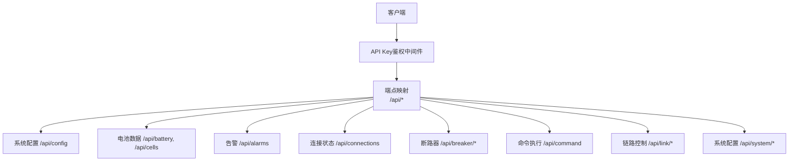
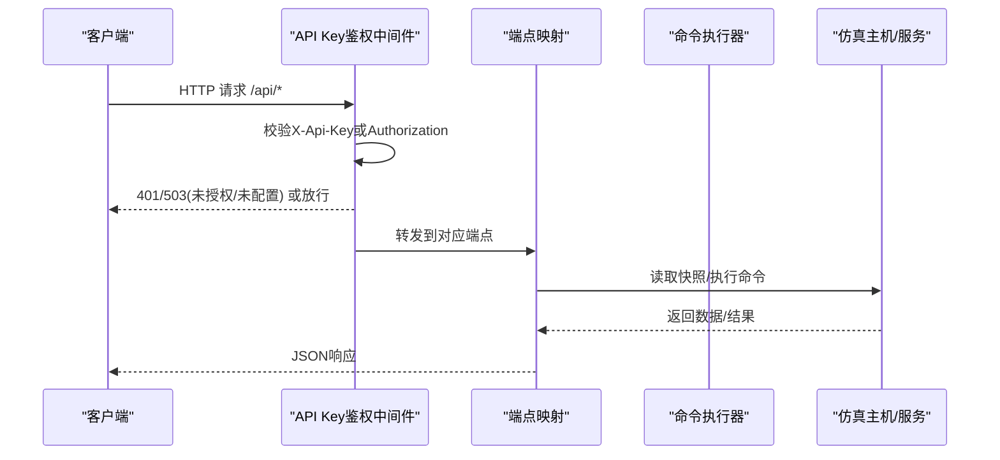
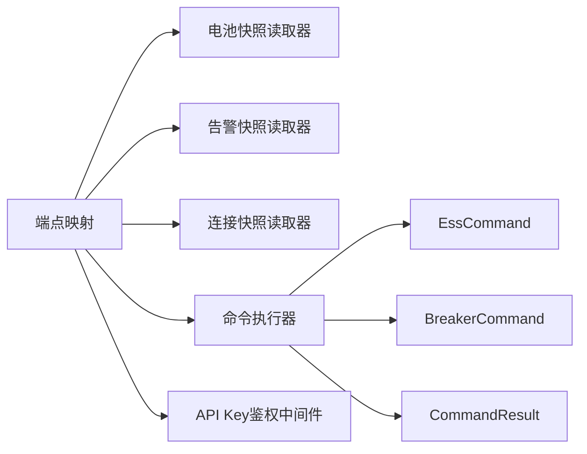

# RESTful API接口

<cite>
**本文引用的文件**
- [Program.cs](file://Program.cs)
- [EndpointExtensions.cs](file://Web/EndpointExtensions.cs)
- [ApiKeyAuthMiddleware.cs](file://Web/ApiKeyAuthMiddleware.cs)
- [BatterySnapshotReader.cs](file://Web/BatterySnapshotReader.cs)
- [AlarmSnapshotReader.cs](file://Web/AlarmSnapshotReader.cs)
- [ConnectionSnapshotReader.cs](file://Web/ConnectionSnapshotReader.cs)
- [SystemConfigEndpoints.cs](file://Web/Topology/SystemConfigEndpoints.cs)
- [EssCommand.cs](file://Display/EssCommand.cs)
- [BreakerCommand.cs](file://Display/BreakerCommand.cs)
- [CommandResult.cs](file://Display/CommandResult.cs)
- [WebCommandExecutor.cs](file://Web/WebCommandExecutor.cs)
- [appsettings.json](file://appsettings.json)
</cite>

## 目录
1. [简介](#简介)
2. [项目结构](#项目结构)
3. [核心组件](#核心组件)
4. [架构总览](#架构总览)
5. [详细接口说明](#详细接口说明)
6. [依赖关系分析](#依赖关系分析)
7. [性能与可用性](#性能与可用性)
8. [故障排查指南](#故障排查指南)
9. [结论](#结论)
10. [附录](#附录)

## 简介
本文件为储能仿真系统的RESTful API文档，覆盖系统配置、电池数据、告警、连接状态、断路器控制、命令执行与链路控制等核心能力。所有接口基于ASP.NET Core端点注册，统一通过中间件进行可选的API Key鉴权，并通过结构化结果对象返回JSON响应。

## 项目结构
- Web层入口：在应用启动时注册CORS、SignalR、静态文件、中间件与全部/api路由。
- 路由注册：集中在扩展方法中，按功能域划分健康检查、设备快照、配置、控制类接口。
- 鉴权：可选的API Key中间件，保护/api/*（除探活路径）。
- 命令执行：通用命令执行器封装底层命令处理器，支持断路器、链路控制、DPC测试等。

图表来源
- [Program.cs:483-494](file://Program.cs#L483-L494)
- [EndpointExtensions.cs:16-318](file://Web/EndpointExtensions.cs#L16-L318)
- [ApiKeyAuthMiddleware.cs:21-40](file://Web/ApiKeyAuthMiddleware.cs#L21-L40)

章节来源
- [Program.cs:258-523](file://Program.cs#L258-L523)
- [EndpointExtensions.cs:16-318](file://Web/EndpointExtensions.cs#L16-L318)

## 核心组件
- 端点映射：集中定义所有HTTP端点，包括GET/POST方法与URL模式。
- 快照读取器：从仿真运行时读取电池、告警、连接等实时数据并序列化为DTO。
- 命令执行器：将HTTP请求转换为内部命令，调用断路器、链路控制、DPC测试等能力。
- 鉴权中间件：根据配置决定是否校验X-Api-Key或Authorization头。

章节来源
- [EndpointExtensions.cs:16-318](file://Web/EndpointExtensions.cs#L16-L318)
- [BatterySnapshotReader.cs:69-204](file://Web/BatterySnapshotReader.cs#L69-L204)
- [AlarmSnapshotReader.cs:211-447](file://Web/AlarmSnapshotReader.cs#L211-L447)
- [ConnectionSnapshotReader.cs:34-81](file://Web/ConnectionSnapshotReader.cs#L34-L81)
- [WebCommandExecutor.cs:6-58](file://Web/WebCommandExecutor.cs#L6-L58)
- [ApiKeyAuthMiddleware.cs:9-95](file://Web/ApiKeyAuthMiddleware.cs#L9-L95)

## 架构总览

图表来源
- [Program.cs:483-494](file://Program.cs#L483-L494)
- [ApiKeyAuthMiddleware.cs:21-40](file://Web/ApiKeyAuthMiddleware.cs#L21-L40)
- [EndpointExtensions.cs:16-318](file://Web/EndpointExtensions.cs#L16-L318)

## 详细接口说明

### 认证机制
- 位置：中间件拦截所有/api/*请求（/api/health豁免）。
- 方式：
  - 请求头：X-Api-Key
  - Authorization：Bearer <key> 或 ApiKey <key>
- 行为：
  - 若未启用或未配置API Key：直接放行。
  - 已启用但未配置：返回503 ServiceUnavailable。
  - 缺少或错误：返回401 Unauthorized。
- 配置项：Simulator:Web:ApiKeyEnabled、Simulator:Web:ApiKey。

章节来源
- [ApiKeyAuthMiddleware.cs:9-95](file://Web/ApiKeyAuthMiddleware.cs#L9-L95)
- [appsettings.json:53-63](file://appsettings.json#L53-L63)

### 健康检查
- GET /api/health
- 响应字段：status、time、ready
- 用途：服务存活与就绪探测

章节来源
- [EndpointExtensions.cs:18-23](file://Web/EndpointExtensions.cs#L18-L23)

### 系统配置API
- GET /api/config
- 描述：返回仿真运行时配置、产品档位信息、Web服务配置以及BMS拓扑展开信息。
- 主要响应字段：
  - simulator：包含Runtime、Protocol、unitCount、channelCount、bmsTopology
  - edition：Name、LockTopology、MaxEssUnits、AllowDroopSlices、AllowMainline3d、AllowTopologyEditor、IsCommunity
  - web：HttpPort、HttpBaseUrl、StaticFiles、CorsOrigins、SnapshotIntervalMs、DroopSliceCaptureEnabled、DroopSliceMaxCount、ApiKeyEnabled、apiKeyConfigured
- bmsTopology元素：unitIndex、slotInUnit、channelIndex、compartmentNumber、name、clusterCount、packCount、cellSeriesCount、cellParallelCount

章节来源
- [EndpointExtensions.cs:68-130](file://Web/EndpointExtensions.cs#L68-L130)

### 协议信息API
- GET /api/protocol
- 描述：返回Modbus服务端口信息（电表、BMS、EMU、光伏Logger/Meter）

章节来源
- [EndpointExtensions.cs:132-153](file://Web/EndpointExtensions.cs#L132-L153)

### 电池数据API
- GET /api/battery/{unit}
- 描述：获取指定单元（1-based）的电池舱总览快照。
- 响应DTO关键字段：
  - UnitIndex、UnitNumber、TotalVoltage、TotalCurrent、SOC、SOH
  - MaxCellVoltage、MinCellVoltage及极值定位（ClusterId/PackId/CellId）
  - GridConnectStatus、BlackStartModeStatus
  - Clusters[]：每簇电压、电流、功率、SOC/SOH、平均/最大/最小单体电压与温度、极值温度定位
- GET /api/cells/{unit}/{cluster}
- 描述：获取指定单元与簇的单体电压矩阵（4包×104节），含极值单体定位与电池节点温度。
- 响应DTO关键字段：
  - UnitIndex、ClusterId、PackCount、CellsPerPack
  - Packs[][]：二维数组，单位V
  - MinCellVoltage、MaxCellVoltage及极值定位
  - BatteryNodeTempC

章节来源
- [EndpointExtensions.cs:28-40](file://Web/EndpointExtensions.cs#L28-L40)
- [BatterySnapshotReader.cs:6-67](file://Web/BatterySnapshotReader.cs#L6-L67)
- [BatterySnapshotReader.cs:71-204](file://Web/BatterySnapshotReader.cs#L71-L204)

### 告警API
- GET /api/alarms
- 描述：汇总所有设备的告警/故障位快照（绿=未触发，红=已触发）。
- 响应DTO关键字段：
  - Time、UnitCount、ActiveDeviceCount、ActiveFlagCount
  - Devices[]：DeviceType、DeviceId、Title、UnitNumber、RackIndex、ActiveCount、TotalCount、Flags[]
  - Flags[]：Name、Label、Kind（protection/fault/alarm/other）、Active
- GET /api/alarms/bms/{unit}?rack={rack}
- 描述：按单元与可选机架索引查询BMS告警。

章节来源
- [EndpointExtensions.cs:54-62](file://Web/EndpointExtensions.cs#L54-L62)
- [AlarmSnapshotReader.cs:9-37](file://Web/AlarmSnapshotReader.cs#L9-L37)
- [AlarmSnapshotReader.cs:211-273](file://Web/AlarmSnapshotReader.cs#L211-L273)
- [AlarmSnapshotReader.cs:275-447](file://Web/AlarmSnapshotReader.cs#L275-L447)

### 连接状态API
- GET /api/connections
- 描述：返回网络接口、监听服务、客户端连接与链路状态。
- 响应DTO关键字段：
  - NetworkInterfaces[]：Name、Address
  - Servers[]：Server、ListenInfo
  - Clients[]：Client、State（已连接/未连接）
  - LinkStatus[]：Label、ServerName、Target、Online、ListenInfo、Extra

章节来源
- [EndpointExtensions.cs:64-64](file://Web/EndpointExtensions.cs#L64-L64)
- [ConnectionSnapshotReader.cs:8-81](file://Web/ConnectionSnapshotReader.cs#L8-L81)
- [EssCommand.cs:478-522](file://Display/EssCommand.cs#L478-L522)

### 断路器控制API
- POST /api/breaker/main/{closed}
- 描述：设置主断路器合闸/分闸（true/false）。
- 响应：标准CommandResult（Success、Message等）。
- POST /api/breaker/unit/{unit:int}/{closed:bool}
- 描述：设置单元断路器（写EMU控制点yx0），unit从1起。
- 响应：标准CommandResult。

章节来源
- [EndpointExtensions.cs:228-240](file://Web/EndpointExtensions.cs#L228-L240)
- [BreakerCommand.cs:7-35](file://Display/BreakerCommand.cs#L7-L35)
- [CommandResult.cs:4-32](file://Display/CommandResult.cs#L4-L32)

### 命令执行API
- POST /api/command
- 请求体：{ "input": "<命令字符串>" }
- 描述：通用命令执行入口，支持esscmd、breaker、dpc、dpctest等子命令。
- 响应：CommandResult（Success、Message、Data等）。
- 常用子命令示例（通过input传入）：
  - esscmd link status [pcsN|bmsN|em]
  - esscmd setLoad activePower|reactivePower <数值>
  - esscmd setGrid frequency|voltage <数值>
  - esscmd setbmsN power on|off
  - esscmd setbmsN soc <0~1|%>
  - esscmd pcsN start|stop
  - esscmd setpvN array A|B temperature|angle <数值>

章节来源
- [EndpointExtensions.cs:242-248](file://Web/EndpointExtensions.cs#L242-L248)
- [WebCommandExecutor.cs:6-58](file://Web/WebCommandExecutor.cs#L6-L58)
- [EssCommand.cs:11-79](file://Display/EssCommand.cs#L11-L79)
- [CommandResult.cs:4-32](file://Display/CommandResult.cs#L4-L32)

### 链路控制API
- POST /api/link/{target}/{state}
- 参数：
  - target：em | bmsN | pcsN（pcsN会作用于对应EMU单元，影响两路PCS）
  - state：on/off（也接受online/offline、connect/disconnect）
- 描述：开启或关闭目标协议的Modbus对外服务（模拟通信中断/恢复）。
- 响应：CommandResult，包含操作结果与监听信息。

章节来源
- [EndpointExtensions.cs:250-266](file://Web/EndpointExtensions.cs#L250-L266)
- [EssCommand.cs:361-412](file://Display/EssCommand.cs#L361-L412)
- [EssCommand.cs:414-476](file://Display/EssCommand.cs#L414-L476)

### 系统配置（工程模式）API
- GET /api/system/config
- 描述：返回当前运行模式（工程模式/普通模式）、活动工程、叠加层摘要、运行时单元数等。
- POST /api/system/projects
- 描述：列出可用工程。
- POST /api/system/apply
- 描述：应用工程或关闭工程模式；可选择确认重启。
- 注意：该组接口受EditionConfig.AllowTopologyEditor限制，不开放时返回403。

章节来源
- [SystemConfigEndpoints.cs:13-168](file://Web/Topology/SystemConfigEndpoints.cs#L13-L168)
- [SystemConfigEndpoints.cs:171-183](file://Web/Topology/SystemConfigEndpoints.cs#L171-L183)

### 其他辅助接口
- GET /api/autotest：列出可用的自动化测试用例。
- GET /api/pointmaps：列出各设备的数据/控制映射。
- GET /api/droop-slices/status|list|get|clear|config：白盒切片功能（受产品档位限制）。
- GET /api/alert：致命系统告警快照。
- GET /api/mainline：主接线图数据。

章节来源
- [EndpointExtensions.cs:155-317](file://Web/EndpointExtensions.cs#L155-L317)

## 依赖关系分析

图表来源
- [EndpointExtensions.cs:16-318](file://Web/EndpointExtensions.cs#L16-L318)
- [BatterySnapshotReader.cs:69-204](file://Web/BatterySnapshotReader.cs#L69-L204)
- [AlarmSnapshotReader.cs:211-447](file://Web/AlarmSnapshotReader.cs#L211-L447)
- [ConnectionSnapshotReader.cs:34-81](file://Web/ConnectionSnapshotReader.cs#L34-L81)
- [WebCommandExecutor.cs:6-58](file://Web/WebCommandExecutor.cs#L6-L58)
- [EssCommand.cs:11-563](file://Display/EssCommand.cs#L11-L563)
- [BreakerCommand.cs:7-35](file://Display/BreakerCommand.cs#L7-L35)
- [CommandResult.cs:4-32](file://Display/CommandResult.cs#L4-L32)
- [ApiKeyAuthMiddleware.cs:9-95](file://Web/ApiKeyAuthMiddleware.cs#L9-L95)

## 性能与可用性
- 快照接口：以内存快照形式返回，适合前端轮询或SignalR推送配合使用。
- 信号量与并发：中间件与端点无阻塞I/O，建议合理设置轮询间隔。
- 资源限制：SignalR接收消息大小已配置，避免过大负载。
- 就绪检测：/api/health提供ready标志，便于外部编排等待仿真就绪。

[本节为通用指导，无需特定文件引用]

## 故障排查指南
- 401 Unauthorized：请检查是否启用了API Key且提供了正确的X-Api-Key或Authorization头。
- 503 ServiceUnavailable：已启用API Key但未配置密钥，需设置Simulator:Web:ApiKey。
- 404 Not Found：路径或参数不正确，例如单元/簇索引越界或设备不存在。
- 400 Bad Request：命令输入为空或格式错误，或链路状态参数非法。
- 403 Forbidden：当前产品档位不包含组态编辑或白盒切片功能。
- 服务不可用：确认仿真已启动且必要设备已注册（ess/simEm/simBms*等）。

章节来源
- [ApiKeyAuthMiddleware.cs:59-92](file://Web/ApiKeyAuthMiddleware.cs#L59-L92)
- [EndpointExtensions.cs:242-266](file://Web/EndpointExtensions.cs#L242-L266)
- [SystemConfigEndpoints.cs:171-183](file://Web/Topology/SystemConfigEndpoints.cs#L171-L183)

## 结论
本API集围绕“读”与“控”两大维度构建：读侧提供电池、告警、连接与配置的实时快照；控侧通过统一的命令执行器与专用控制器暴露断路器、链路控制与DPC测试能力。结合可选的API Key鉴权与SignalR推送，可满足前端可视化与自动化测试场景。

[本节为总结性内容，无需特定文件引用]

## 附录

### 请求/响应示例（JSON结构）
- 系统配置
  - GET /api/config
  - 响应示例字段：simulator、edition、web、bmsTopology[]
- 电池总览
  - GET /api/battery/{unit}
  - 响应示例字段：UnitIndex、TotalVoltage、SOC、Clusters[]
- 单体电压
  - GET /api/cells/{unit}/{cluster}
  - 响应示例字段：Packs[][]、MinCellVoltage、MaxCellVoltage、BatteryNodeTempC
- 告警
  - GET /api/alarms
  - 响应示例字段：Devices[].Flags[]（Name、Label、Kind、Active）
- 连接状态
  - GET /api/connections
  - 响应示例字段：NetworkInterfaces[]、Servers[]、Clients[]、LinkStatus[]
- 断路器
  - POST /api/breaker/main/{closed}
  - 响应：CommandResult（Success、Message）
- 命令执行
  - POST /api/command
  - 请求体：{ "input": "esscmd link status" }
  - 响应：CommandResult
- 链路控制
  - POST /api/link/{target}/{state}
  - 响应：CommandResult

[本节为结构说明，无需特定文件引用]