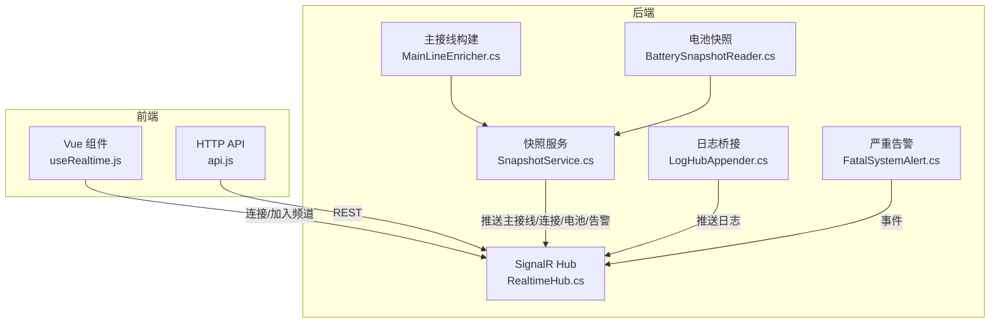
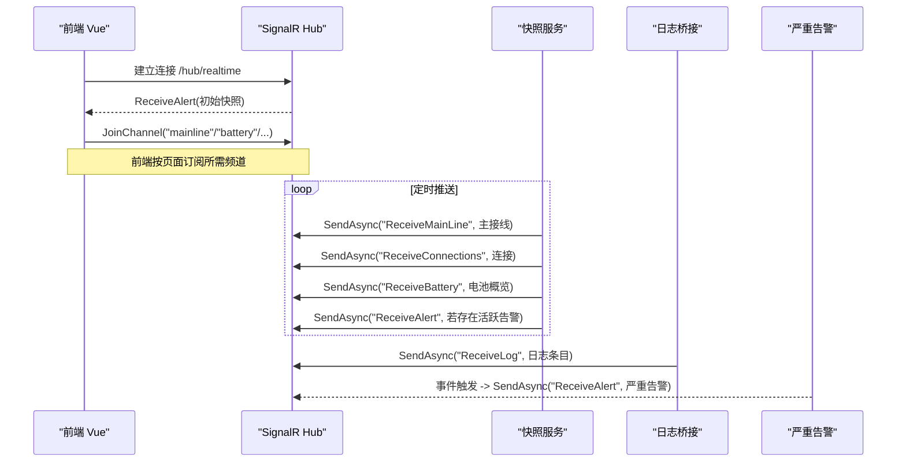
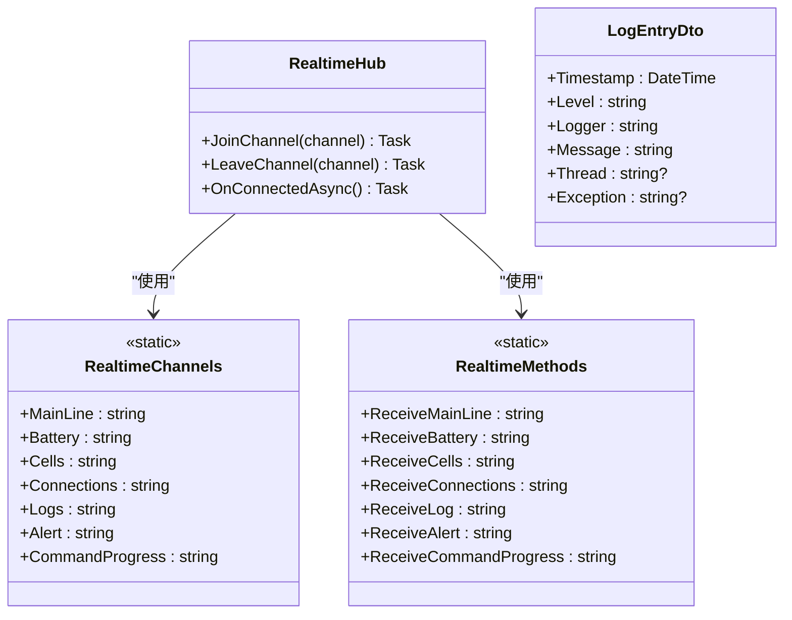
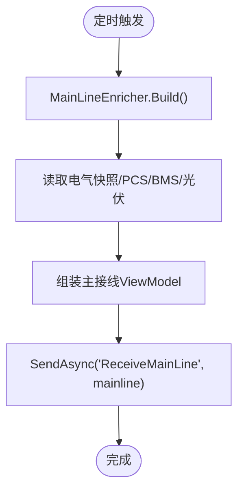
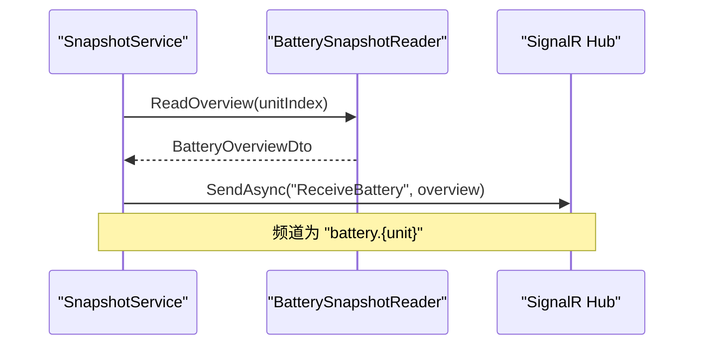
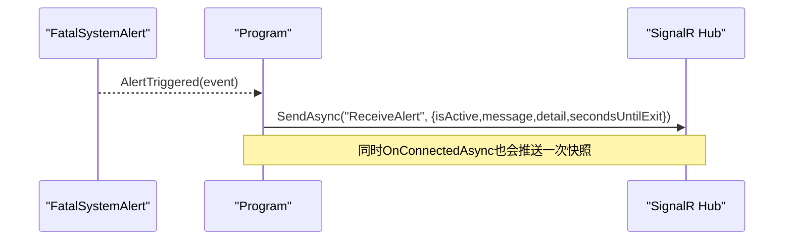
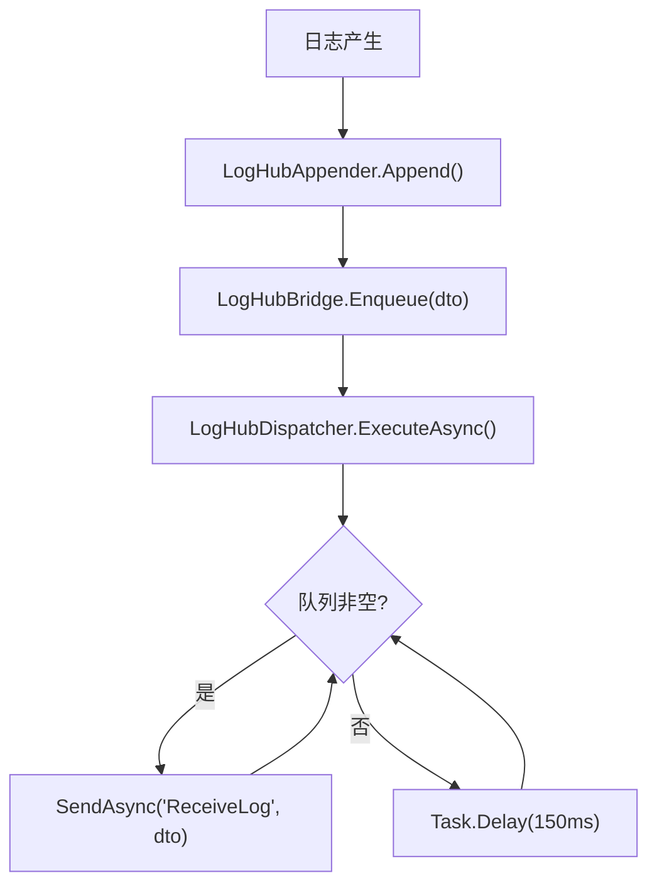
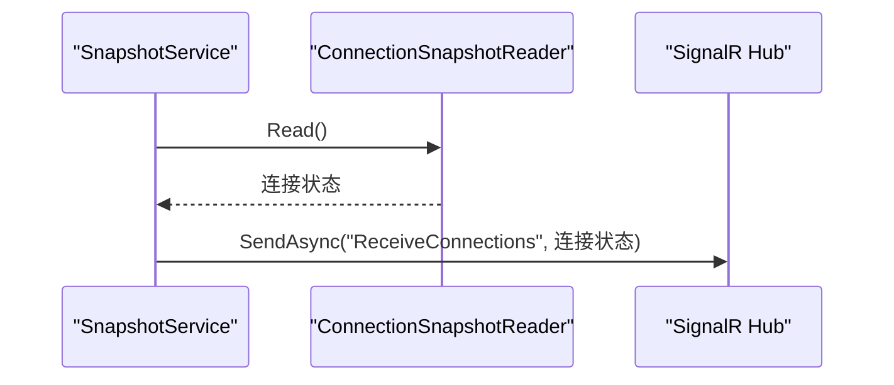
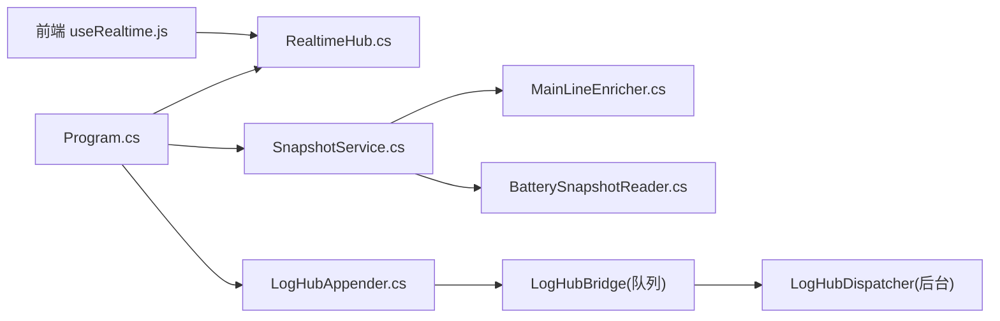

# SignalR实时通信

<cite>
**本文引用的文件**
- [Program.cs](file://Program.cs)
- [RealtimeHub.cs](file://Web/RealtimeHub.cs)
- [LogHubAppender.cs](file://Web/LogHubAppender.cs)
- [SnapshotService.cs](file://Web/SnapshotService.cs)
- [MainLineEnricher.cs](file://Web/MainLineEnricher.cs)
- [BatterySnapshotReader.cs](file://Web/BatterySnapshotReader.cs)
- [FatalSystemAlert.cs](file://Display/FatalSystemAlert.cs)
- [api.js](file://Web/src/services/api.js)
- [useRealtime.js](file://Web/src/services/useRealtime.js)
- [constants.js](file://Web/src/services/constants.js)
- [ConnectionsView.vue](file://Web/src/views/ConnectionsView.vue)
</cite>

## 目录
1. [简介](#简介)
2. [项目结构](#项目结构)
3. [核心组件](#核心组件)
4. [架构总览](#架构总览)
5. [详细组件分析](#详细组件分析)
6. [依赖关系分析](#依赖关系分析)
7. [性能考虑](#性能考虑)
8. [故障排查指南](#故障排查指南)
9. [结论](#结论)
10. [附录：JavaScript客户端集成指南](#附录javascript客户端集成指南)

## 简介
本文件面向储能仿真系统的SignalR实时通信能力，系统通过ASP.NET Core SignalR提供低延迟、双向的实时数据推送。后端以频道分组方式将主接线、电池状态、单体电压、连接状态、日志与告警等数据推送到前端；前端使用Vue组合式API封装连接生命周期管理，按页面需要订阅相应频道并处理事件。

## 项目结构
- 服务端（C#）
  - Hub与常量：定义Hub、频道名与方法名常量、日志DTO
  - 快照服务：定时读取仿真模型数据并通过SignalR推送
  - 日志桥接：log4net Appender将日志入队，后台任务推送到logs频道
  - 启动配置：注册SignalR、CORS、中间件与端点，订阅严重告警事件并推送
- 前端（JavaScript/Vue）
  - 连接管理：单例Hub连接、自动重连、加入/离开频道
  - 事件绑定：在组件挂载时订阅方法，卸载时解绑并离开频道
  - 视图示例：连接页演示加入频道与接收连接状态推送

图表来源
- [Program.cs:398-494](file://Program.cs#L398-L494)
- [RealtimeHub.cs:10-58](file://Web/RealtimeHub.cs#L10-L58)
- [SnapshotService.cs:103-132](file://Web/SnapshotService.cs#L103-L132)
- [LogHubAppender.cs:51-74](file://Web/LogHubAppender.cs#L51-L74)
- [MainLineEnricher.cs:10-70](file://Web/MainLineEnricher.cs#L10-L70)
- [BatterySnapshotReader.cs:69-204](file://Web/BatterySnapshotReader.cs#L69-L204)
- [FatalSystemAlert.cs:11-86](file://Display/FatalSystemAlert.cs#L11-L86)

章节来源
- [Program.cs:398-494](file://Program.cs#L398-L494)
- [RealtimeHub.cs:10-58](file://Web/RealtimeHub.cs#L10-L58)

## 核心组件
- RealtimeHub：提供JoinChannel/LeaveChannel分组能力，连接建立时推送一次当前告警快照；定义频道与方法名常量及日志DTO
- SnapshotService：后台定时任务，读取主接线、连接、电池等快照并按频道推送
- LogHubAppender + LogHubDispatcher：log4net Appender将日志事件入队，后台任务批量推送到logs频道
- FatalSystemAlert：全进程级严重故障事件，触发后由Program订阅并通过SignalR推送ReceiveAlert
- 前端useRealtime：封装连接、加入频道、事件绑定与卸载清理
- 前端api.js：创建SignalR连接（自动重连）、暴露REST API

章节来源
- [RealtimeHub.cs:10-58](file://Web/RealtimeHub.cs#L10-L58)
- [SnapshotService.cs:103-132](file://Web/SnapshotService.cs#L103-L132)
- [LogHubAppender.cs:8-74](file://Web/LogHubAppender.cs#L8-L74)
- [FatalSystemAlert.cs:11-86](file://Display/FatalSystemAlert.cs#L11-L86)
- [useRealtime.js:5-38](file://Web/src/services/useRealtime.js#L5-L38)
- [api.js:71-85](file://Web/src/services/api.js#L71-L85)

## 架构总览
SignalR作为实时总线，后端各子系统通过IHubContext主动推送消息到指定频道或全部客户端；前端按需订阅频道并处理事件。

图表来源
- [Program.cs:466-494](file://Program.cs#L466-L494)
- [RealtimeHub.cs:16-21](file://Web/RealtimeHub.cs#L16-L21)
- [SnapshotService.cs:103-132](file://Web/SnapshotService.cs#L103-L132)
- [LogHubAppender.cs:51-74](file://Web/LogHubAppender.cs#L51-L74)
- [FatalSystemAlert.cs:27-45](file://Display/FatalSystemAlert.cs#L27-L45)

## 详细组件分析

### Hub与频道机制
- 频道常量：mainline、battery、cells、connections、logs、alert、cmdprogress
- 方法常量：ReceiveMainLine、ReceiveBattery、ReceiveCells、ReceiveConnections、ReceiveLog、ReceiveAlert、ReceiveCommandProgress
- 连接生命周期：OnConnectedAsync推送一次当前告警快照；支持JoinChannel/LeaveChannel进行分组推送

图表来源
- [RealtimeHub.cs:10-58](file://Web/RealtimeHub.cs#L10-L58)

章节来源
- [RealtimeHub.cs:10-58](file://Web/RealtimeHub.cs#L10-L58)

### 主接线实时更新
- 构建逻辑：MainLineEnricher从仿真模型读取电气拓扑与PCS/BMS信息，生成主接线视图模型
- 推送流程：SnapshotService定时调用Build并发送到mainline频道

图表来源
- [MainLineEnricher.cs:10-70](file://Web/MainLineEnricher.cs#L10-L70)
- [SnapshotService.cs:103-111](file://Web/SnapshotService.cs#L103-L111)

章节来源
- [MainLineEnricher.cs:10-70](file://Web/MainLineEnricher.cs#L10-L70)
- [SnapshotService.cs:103-111](file://Web/SnapshotService.cs#L103-L111)

### 电池状态监控
- 数据源：BatterySnapshotReader读取BMS堆与簇的电压、电流、SOC/SOH、温度等
- 推送目标：按单元号分组频道 battery.{unit}，发送ReceiveBattery

图表来源
- [BatterySnapshotReader.cs:69-150](file://Web/BatterySnapshotReader.cs#L69-L150)
- [SnapshotService.cs:113-123](file://Web/SnapshotService.cs#L113-L123)

章节来源
- [BatterySnapshotReader.cs:69-150](file://Web/BatterySnapshotReader.cs#L69-L150)
- [SnapshotService.cs:113-123](file://Web/SnapshotService.cs#L113-L123)

### 告警通知
- 严重告警：FatalSystemAlert触发事件，Program订阅并通过ReceiveAlert推送给所有客户端
- 连接初始化：RealtimeHub.OnConnectedAsync推送一次当前告警快照，便于前端初始化显示

图表来源
- [FatalSystemAlert.cs:27-45](file://Display/FatalSystemAlert.cs#L27-L45)
- [Program.cs:466-481](file://Program.cs#L466-L481)
- [RealtimeHub.cs:16-21](file://Web/RealtimeHub.cs#L16-L21)

章节来源
- [FatalSystemAlert.cs:27-45](file://Display/FatalSystemAlert.cs#L27-L45)
- [Program.cs:466-481](file://Program.cs#L466-L481)
- [RealtimeHub.cs:16-21](file://Web/RealtimeHub.cs#L16-L21)

### 日志推送
- log4net Appender将日志事件转换为LogEntryDto并入队
- LogHubDispatcher后台任务出队并推送到logs频道

图表来源
- [LogHubAppender.cs:8-48](file://Web/LogHubAppender.cs#L8-L48)
- [LogHubAppender.cs:51-74](file://Web/LogHubAppender.cs#L51-L74)

章节来源
- [LogHubAppender.cs:8-74](file://Web/LogHubAppender.cs#L8-L74)

### 连接状态推送
- SnapshotService读取连接快照并推送到connections频道

图表来源
- [SnapshotService.cs:109-111](file://Web/SnapshotService.cs#L109-L111)

章节来源
- [SnapshotService.cs:109-111](file://Web/SnapshotService.cs#L109-L111)

## 依赖关系分析
- Program负责：
  - 注册SignalR服务与最大消息大小限制
  - CORS策略与静态文件/回退路由
  - 映射Hub端点/hub/realtime
  - 订阅FatalSystemAlert事件并推送
- SnapshotService依赖：
  - MainLineEnricher构建主接线
  - BatterySnapshotReader读取电池数据
  - ConnectionSnapshotReader读取连接状态
- LogHubAppender依赖：
  - LogHubBridge队列缓冲
  - LogHubDispatcher后台任务推送
- 前端依赖：
  - api.js中的getHub创建SignalR连接并自动重连
  - useRealtime封装频道订阅与生命周期管理
  - constants.js统一方法与频道常量

图表来源
- [Program.cs:398-494](file://Program.cs#L398-L494)
- [SnapshotService.cs:103-132](file://Web/SnapshotService.cs#L103-L132)
- [LogHubAppender.cs:8-74](file://Web/LogHubAppender.cs#L8-L74)
- [RealtimeHub.cs:10-58](file://Web/RealtimeHub.cs#L10-L58)

章节来源
- [Program.cs:398-494](file://Program.cs#L398-L494)
- [SnapshotService.cs:103-132](file://Web/SnapshotService.cs#L103-L132)
- [LogHubAppender.cs:8-74](file://Web/LogHubAppender.cs#L8-L74)
- [RealtimeHub.cs:10-58](file://Web/RealtimeHub.cs#L10-L58)

## 性能考虑
- 频道分组：前端仅订阅所需频道，减少无关流量与处理开销
- 背压控制：日志队列设置上限，超出时丢弃最旧条目，避免内存增长
- 推送频率：快照服务采用后台定时任务，合理间隔平衡实时性与负载
- 序列化优化：启用camelCase命名策略与包含字段，减少前端转换成本
- 连接复用：前端单例Hub连接，避免重复握手与资源消耗

[本节为通用指导，不直接分析具体文件]

## 故障排查指南
- 连接失败
  - 检查CORS配置与前端开发代理端口是否放行
  - 确认Hub端点映射/hub/realtime已启用
- 未收到推送
  - 确认前端已调用JoinChannel加入对应频道
  - 检查后端SnapshotService与LogHubDispatcher是否正常运行
- 告警未显示
  - 验证FatalSystemAlert事件是否被Program订阅并推送
  - 连接建立时应收到一次ReceiveAlert快照
- 日志堆积
  - 观察LogHubBridge队列长度与丢弃策略
  - 调整推送间隔或降低日志级别

章节来源
- [Program.cs:385-494](file://Program.cs#L385-L494)
- [LogHubAppender.cs:34-74](file://Web/LogHubAppender.cs#L34-L74)
- [RealtimeHub.cs:16-21](file://Web/RealtimeHub.cs#L16-L21)

## 结论
该系统通过SignalR实现了高效、可扩展的实时通信能力。后端以频道分组推送主接线、电池、连接、日志与告警等关键数据；前端通过组合式API统一管理连接与事件，具备自动重连与生命周期清理能力。整体设计清晰、职责分离，便于扩展新的实时功能。

[本节为总结性内容，不直接分析具体文件]

## 附录：JavaScript客户端集成指南
- 连接管理
  - 使用getHub获取单例Hub连接，默认启用自动重连
  - 建议在全局初始化时建立连接，避免重复创建
- 事件处理
  - 在组件onMounted中调用JoinChannel加入频道
  - 使用conn.on(methodName, handler)绑定回调
  - 在组件onBeforeUnmount中移除监听并调用LeaveChannel离开频道
- 数据处理最佳实践
  - 对高频推送数据进行节流或增量更新，避免频繁重绘
  - 对大对象（如单体电压矩阵）进行分页或按需加载
  - 对错误与断线进行友好提示，必要时引导刷新页面

章节来源
- [api.js:71-85](file://Web/src/services/api.js#L71-L85)
- [useRealtime.js:5-38](file://Web/src/services/useRealtime.js#L5-L38)
- [constants.js:1-17](file://Web/src/services/constants.js#L1-L17)
- [ConnectionsView.vue:73-81](file://Web/src/views/ConnectionsView.vue#L73-L81)