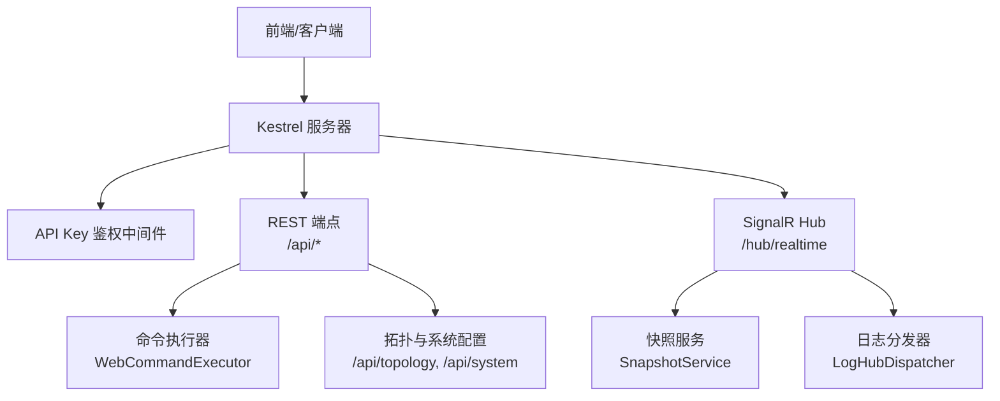
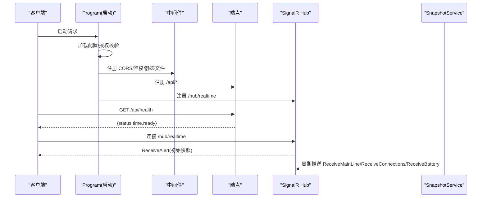
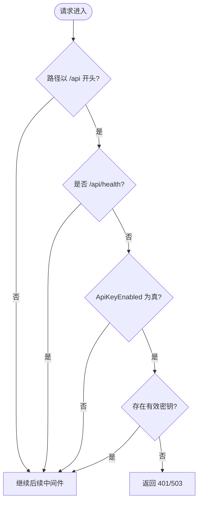
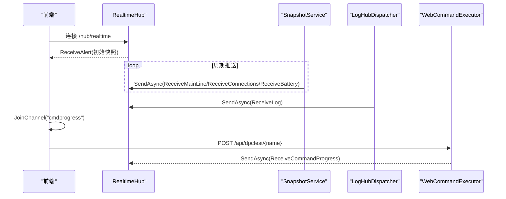
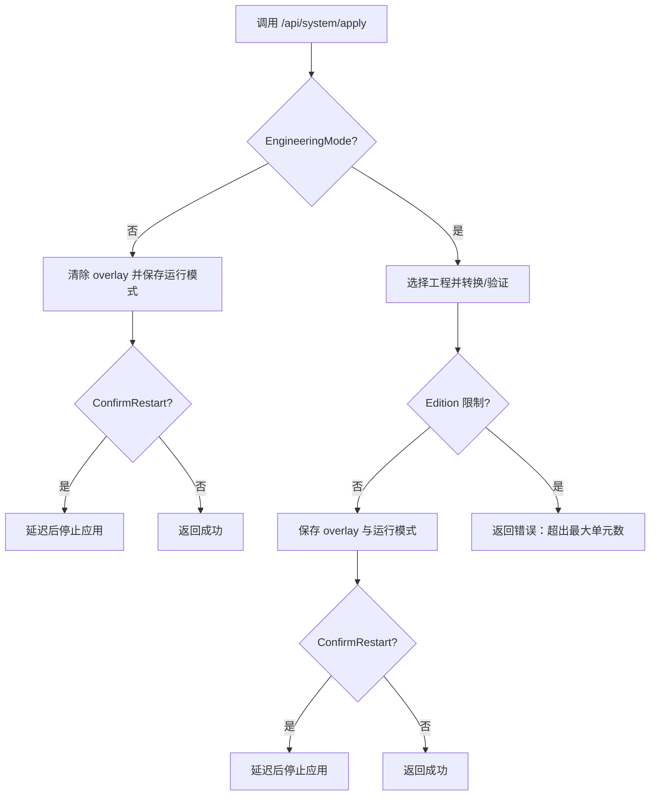
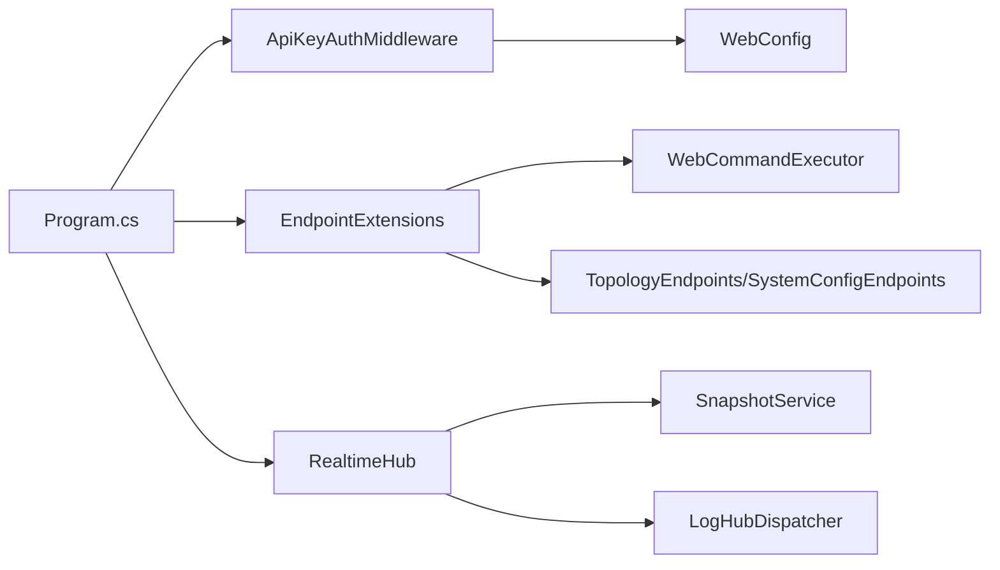

# Web API和实时通信

<cite>
**本文引用的文件**
- [Program.cs](file://Program.cs)
- [EndpointExtensions.cs](file://Web/EndpointExtensions.cs)
- [RealtimeHub.cs](file://Web/RealtimeHub.cs)
- [SnapshotService.cs](file://Web/SnapshotService.cs)
- [ApiKeyAuthMiddleware.cs](file://Web/ApiKeyAuthMiddleware.cs)
- [SystemConfigEndpoints.cs](file://Web/Topology/SystemConfigEndpoints.cs)
- [TopologyEndpoints.cs](file://Web/Topology/TopologyEndpoints.cs)
- [WebCommandExecutor.cs](file://Web/WebCommandExecutor.cs)
- [LogHubAppender.cs](file://Web/LogHubAppender.cs)
- [appsettings.json](file://appsettings.json)
- [WebConfig.cs](file://Configuration/WebConfig.cs)
</cite>

## 目录
1. [简介](#简介)
2. [项目结构](#项目结构)
3. [核心组件](#核心组件)
4. [架构总览](#架构总览)
5. [详细组件分析](#详细组件分析)
6. [依赖关系分析](#依赖关系分析)
7. [性能考虑](#性能考虑)
8. [故障排查指南](#故障排查指南)
9. [结论](#结论)
10. [附录](#附录)

## 简介
本文件为储能仿真系统的 Web API 与实时通信（SignalR）的权威技术文档。内容覆盖：
- RESTful API 端点清单：HTTP 方法、URL 模式、请求/响应模型、认证方式
- SignalR 实时通信：连接处理、频道分组、消息格式、事件类型、交互模式
- 系统配置、拓扑管理、命令执行等关键能力规范
- 客户端实现指南、错误处理策略与性能优化建议

## 项目结构
后端基于 ASP.NET Core，采用“最小化端点 + 中间件 + 后台服务”的分层组织：
- 启动与管线：Program.cs 负责配置加载、授权校验、服务注册、中间件与端点挂载
- API 路由：EndpointExtensions.cs 集中定义 /api/* 端点；Topology 子模块提供 /api/topology 与 /api/system
- 实时推送：RealtimeHub.cs 定义 Hub、频道与方法名常量；SnapshotService.cs 周期推送快照；LogHubAppender.cs 将日志推送到 SignalR
- 鉴权：ApiKeyAuthMiddleware.cs 对 /api/* 进行可选的 API Key 鉴权
- 配置：appsettings.json 与 WebConfig.cs 描述 Web 行为、端口、CORS、快照间隔、切片采集开关等

**图表来源**
- [Program.cs:258-494](file://Program.cs#L258-L494)
- [EndpointExtensions.cs:16-318](file://Web/EndpointExtensions.cs#L16-L318)
- [RealtimeHub.cs:10-58](file://Web/RealtimeHub.cs#L10-L58)
- [SnapshotService.cs:10-133](file://Web/SnapshotService.cs#L10-L133)
- [LogHubAppender.cs:51-75](file://Web/LogHubAppender.cs#L51-L75)

**章节来源**
- [Program.cs:258-494](file://Program.cs#L258-L494)
- [EndpointExtensions.cs:16-318](file://Web/EndpointExtensions.cs#L16-L318)
- [RealtimeHub.cs:10-58](file://Web/RealtimeHub.cs#L10-L58)
- [SnapshotService.cs:10-133](file://Web/SnapshotService.cs#L10-L133)
- [LogHubAppender.cs:51-75](file://Web/LogHubAppender.cs#L51-L75)

## 核心组件
- 健康检查与就绪状态：/api/health 返回服务状态与仿真就绪标志
- 主接线与设备快照：/api/mainline、/api/battery/{unit}、/api/cells/{unit}/{cluster}
- 告警与连接：/api/alarms、/api/alarms/bms/{unit}、/api/connections、/api/alert
- 协议信息：/api/protocol 列出各 Modbus 模拟服务名称与端口
- 自动测试：/api/autotest 列出可用用例
- 点位映射：/api/pointmaps 枚举各设备的点位映射
- 断路器控制：/api/breaker/main/{closed}、/api/breaker/unit/{unit}/{closed}
- 通用命令：POST /api/command
- 链路控制：POST /api/link/{target}/{state}
- 白盒切片：/api/droop-slices/*（受产品档位限制）
- 拓扑管理：/api/topology/*（模板、工程、库、连接/断开、脚手架等）
- 系统配置：/api/system/*（工程模式切换、应用并可选重启）
- 实时通道：/hub/realtime（SignalR），支持频道分组与多种推送方法

**章节来源**
- [EndpointExtensions.cs:16-318](file://Web/EndpointExtensions.cs#L16-L318)
- [TopologyEndpoints.cs:12-194](file://Web/Topology/TopologyEndpoints.cs#L12-L194)
- [SystemConfigEndpoints.cs:13-168](file://Web/Topology/SystemConfigEndpoints.cs#L13-L168)
- [RealtimeHub.cs:24-58](file://Web/RealtimeHub.cs#L24-L58)

## 架构总览
系统通过 Program.cs 完成服务注册与管线装配：
- 配置加载：支持带注释 JSON、环境变量、命令行参数
- 授权校验：根据 Edition/License 决定是否要求 license.txt
- 服务注册：EnergyStorageSystem、BMS/PCS/EMU 数据服务、Modbus 服务、DroopSliceStore、TopologyStore、SnapshotService、LogHubDispatcher 等
- 中间件：CORS、API Key 鉴权、静态文件托管
- 端点：SignalR Hub 与 REST 端点统一挂载

**图表来源**
- [Program.cs:258-494](file://Program.cs#L258-L494)
- [EndpointExtensions.cs:16-318](file://Web/EndpointExtensions.cs#L16-L318)
- [RealtimeHub.cs:16-21](file://Web/RealtimeHub.cs#L16-L21)
- [SnapshotService.cs:46-133](file://Web/SnapshotService.cs#L46-L133)

## 详细组件分析

### 认证与访问控制
- 中间件：ApiKeyAuthMiddleware 对 /api/* 启用可选的 API Key 鉴权，/api/health 豁免
- 密钥来源：请求头 X-Api-Key 或 Authorization: Bearer/ApiKey
- 配置项：Simulator:Web.ApiKeyEnabled、Simulator:Web.ApiKey
- 行为：未启用时放行；已启用但未配置时返回 503；密钥不匹配返回 401

**图表来源**
- [ApiKeyAuthMiddleware.cs:21-83](file://Web/ApiKeyAuthMiddleware.cs#L21-L83)
- [WebConfig.cs:29-36](file://Configuration/WebConfig.cs#L29-L36)

**章节来源**
- [ApiKeyAuthMiddleware.cs:1-95](file://Web/ApiKeyAuthMiddleware.cs#L1-L95)
- [WebConfig.cs:1-39](file://Configuration/WebConfig.cs#L1-L39)
- [appsettings.json:53-63](file://appsettings.json#L53-L63)

### RESTful API 规范

#### 健康与就绪
- GET /api/health
  - 响应：{ status, time, ready }
  - ready 表示仿真核心与必要设备已就绪

**章节来源**
- [EndpointExtensions.cs:18-23](file://Web/EndpointExtensions.cs#L18-L23)

#### 主接线与电池快照
- GET /api/mainline
  - 响应：主接线图数据（由 MainLineEnricher.Build 生成）
- GET /api/battery/{unit}
  - 响应：指定单元（1-based）的电池概览
- GET /api/cells/{unit}/{cluster}
  - 响应：指定单元/簇的单体详情

**章节来源**
- [EndpointExtensions.cs:25-39](file://Web/EndpointExtensions.cs#L25-L39)

#### 告警与连接
- GET /api/alarms
  - 响应：全部设备告警/故障位
- GET /api/alarms/bms/{unit}[?rack]
  - 响应：指定 BMS 单元的告警
- GET /api/connections
  - 响应：连接快照
- GET /api/alert
  - 响应：致命系统告警快照

**章节来源**
- [EndpointExtensions.cs:54-66](file://Web/EndpointExtensions.cs#L54-L66)

#### 协议信息与点位映射
- GET /api/protocol
  - 响应：EM/BMS/EMU/PV Logger/Meter 的名称与端口
- GET /api/pointmaps
  - 响应：各设备的 dataMaps/controlMaps/rackControlMaps

**章节来源**
- [EndpointExtensions.cs:132-153](file://Web/EndpointExtensions.cs#L132-L153)
- [EndpointExtensions.cs:162-226](file://Web/EndpointExtensions.cs#L162-L226)

#### 自动测试
- GET /api/autotest
  - 响应：{ ok, tests[], error? }

**章节来源**
- [EndpointExtensions.cs:155-160](file://Web/EndpointExtensions.cs#L155-L160)

#### 断路器控制
- POST /api/breaker/main/{closed}
  - 通过 CommandProcessor 执行 breaker 指令
- POST /api/breaker/unit/{unit}/{closed}
  - 通过 dpc 写 EMU 控制点 yx0

**章节来源**
- [EndpointExtensions.cs:228-240](file://Web/EndpointExtensions.cs#L228-L240)

#### 通用命令执行
- POST /api/command
  - 请求体：{ input: string }
  - 响应：CommandResult（success/message）

**章节来源**
- [EndpointExtensions.cs:242-248](file://Web/EndpointExtensions.cs#L242-L248)
- [WebCommandExecutor.cs:28-32](file://Web/WebCommandExecutor.cs#L28-L32)

#### 链路控制
- POST /api/link/{target}/{state}
  - target: em|bms1|pcs1 等
  - state: on|off
  - 响应：CommandResult

**章节来源**
- [EndpointExtensions.cs:250-266](file://Web/EndpointExtensions.cs#L250-L266)

#### 自动化测试异步执行
- POST /api/dpctest/{name}
  - 进度通过 SignalR cmdprogress 频道推送

**章节来源**
- [EndpointExtensions.cs:268-273](file://Web/EndpointExtensions.cs#L268-L273)
- [WebCommandExecutor.cs:34-55](file://Web/WebCommandExecutor.cs#L34-L55)

#### 白盒切片（受产品档位限制）
- GET /api/droop-slices/status
- GET /api/droop-slices[?limit&offset]
- GET /api/droop-slices/{id}
- POST /api/droop-slices/clear
- POST /api/droop-slices/config
  - 请求体：{ enabled?, maxCount? }

**章节来源**
- [EndpointExtensions.cs:275-311](file://Web/EndpointExtensions.cs#L275-L311)

#### 拓扑管理（/api/topology）
- 模板：GET /templates、GET /templates/{id}
- 工程：GET /project、PUT /project、POST /validate
- 连接/断开：POST /connect、POST /disconnect
- 脚手架：POST /scaffold
- 设备库：GET/PUT/DELETE /library/*
- 工程列表与路径：GET /projects、GET /paths、GET /projects/check-name
- 工程 CRUD：POST /projects/new、GET /projects/{id}、POST /projects/{id}/open、DELETE /projects/{id}

**章节来源**
- [TopologyEndpoints.cs:12-194](file://Web/Topology/TopologyEndpoints.cs#L12-L194)

#### 系统配置（/api/system）
- GET /config：返回工程模式、活动工程、overlay 摘要、运行时单元数等
- GET /projects：工程列表
- POST /apply：切换工程模式或应用工程，可确认重启

**章节来源**
- [SystemConfigEndpoints.cs:13-168](file://Web/Topology/SystemConfigEndpoints.cs#L13-L168)

### SignalR 实时通信

#### 连接与频道
- 连接地址：/hub/realtime
- 频道分组：mainline、battery、cells、connections、logs、alert、cmdprogress
- 客户端订阅：JoinChannel(channel)、LeaveChannel(channel)

**章节来源**
- [RealtimeHub.cs:12-34](file://Web/RealtimeHub.cs#L12-L34)

#### 推送方法与消息
- ReceiveMainLine：主接线数据（组 mainline）
- ReceiveBattery：电池概览（组 battery.{unit}）
- ReceiveCells：单体数据（组 cells）
- ReceiveConnections：连接快照（组 connections）
- ReceiveLog：日志条目（组 logs）
- ReceiveAlert：致命告警（全量 All）
- ReceiveCommandProgress：命令进度（组 cmdprogress）

**章节来源**
- [RealtimeHub.cs:36-58](file://Web/RealtimeHub.cs#L36-L58)
- [SnapshotService.cs:103-130](file://Web/SnapshotService.cs#L103-L130)
- [LogHubAppender.cs:51-75](file://Web/LogHubAppender.cs#L51-L75)
- [WebCommandExecutor.cs:47-55](file://Web/WebCommandExecutor.cs#L47-L55)

#### 实时交互时序

**图表来源**
- [RealtimeHub.cs:16-21](file://Web/RealtimeHub.cs#L16-L21)
- [SnapshotService.cs:46-133](file://Web/SnapshotService.cs#L46-L133)
- [LogHubAppender.cs:51-75](file://Web/LogHubAppender.cs#L51-L75)
- [WebCommandExecutor.cs:34-55](file://Web/WebCommandExecutor.cs#L34-L55)

### 系统配置与拓扑管理流程

**图表来源**
- [SystemConfigEndpoints.cs:49-166](file://Web/Topology/SystemConfigEndpoints.cs#L49-L166)

**章节来源**
- [SystemConfigEndpoints.cs:13-168](file://Web/Topology/SystemConfigEndpoints.cs#L13-L168)

## 依赖关系分析
- 启动依赖：Program.cs 依赖 Configuration、Core、Display、EssDeviceSimModel、EssSimModelApi、LocalControl、Web、Topology 等模块
- 中间件依赖：ApiKeyAuthMiddleware 依赖 WebConfig
- 端点依赖：EndpointExtensions 依赖 WebCommandExecutor、TopologyStore、DroopSliceStore、各类快照读取器
- 实时依赖：SnapshotService 与 LogHubDispatcher 依赖 IHubContext<RealtimeHub>
- 配置依赖：appsettings.json 与 WebConfig 共同决定 Web 行为

**图表来源**
- [Program.cs:258-494](file://Program.cs#L258-L494)
- [EndpointExtensions.cs:16-318](file://Web/EndpointExtensions.cs#L16-L318)
- [RealtimeHub.cs:10-58](file://Web/RealtimeHub.cs#L10-L58)
- [SnapshotService.cs:10-133](file://Web/SnapshotService.cs#L10-L133)
- [LogHubAppender.cs:51-75](file://Web/LogHubAppender.cs#L51-L75)
- [WebConfig.cs:1-39](file://Configuration/WebConfig.cs#L1-L39)

**章节来源**
- [Program.cs:258-494](file://Program.cs#L258-L494)
- [EndpointExtensions.cs:16-318](file://Web/EndpointExtensions.cs#L16-L318)
- [RealtimeHub.cs:10-58](file://Web/RealtimeHub.cs#L10-L58)
- [SnapshotService.cs:10-133](file://Web/SnapshotService.cs#L10-L133)
- [LogHubAppender.cs:51-75](file://Web/LogHubAppender.cs#L51-L75)
- [WebConfig.cs:1-39](file://Configuration/WebConfig.cs#L1-L39)

## 性能考虑
- 快照推送间隔：默认 200ms，可通过 Simulator:Web.SnapshotIntervalMs 调整（下限 50ms）
- 立即推送：控制变更后调用 RequestImmediatePush() 触发一帧即时推送
- 日志背压：LogHubBridge 队列上限 2000，溢出丢弃最旧日志
- 信号接收大小：SignalR MaximumReceiveMessageSize 设置为 64KB
- 切片采集：DroopSliceCaptureEnabled 与 DroopSliceMaxCount 控制内存占用
- CORS：开发环境默认放行 Vite 常用端口，生产建议精确配置 CorsOrigins

**章节来源**
- [SnapshotService.cs:55-57](file://Web/SnapshotService.cs#L55-L57)
- [SnapshotService.cs:35-38](file://Web/SnapshotService.cs#L35-L38)
- [LogHubAppender.cs:34-48](file://Web/LogHubAppender.cs#L34-L48)
- [Program.cs:398-406](file://Program.cs#L398-L406)
- [appsettings.json:53-63](file://appsettings.json#L53-L63)
- [WebConfig.cs:20-27](file://Configuration/WebConfig.cs#L20-L27)

## 故障排查指南
- 健康检查失败：优先查看 /api/health 的 ready 字段，确认 ess/simEm/simBms1 或 simPv1 是否就绪
- 鉴权失败：确认是否启用了 ApiKeyEnabled，且提供了正确的 X-Api-Key 或 Authorization
- 实时无推送：检查前端是否正确 JoinChannel，服务端是否处于运行态；关注 SnapshotService 异常日志
- 日志缺失：确认 LogHubAppender 已注册，且前端订阅了 logs 频道
- 拓扑编辑受限：若返回 403，说明当前产品档位未开放 AllowTopologyEditor
- 命令执行失败：使用 /api/command 获取具体错误信息；dpctest 通过 cmdprogress 频道查看进度

**章节来源**
- [EndpointExtensions.cs:18-23](file://Web/EndpointExtensions.cs#L18-L23)
- [ApiKeyAuthMiddleware.cs:21-83](file://Web/ApiKeyAuthMiddleware.cs#L21-L83)
- [SnapshotService.cs:60-69](file://Web/SnapshotService.cs#L60-L69)
- [LogHubAppender.cs:51-75](file://Web/LogHubAppender.cs#L51-L75)
- [SystemConfigEndpoints.cs:171-183](file://Web/Topology/SystemConfigEndpoints.cs#L171-L183)

## 结论
本系统通过清晰的 REST API 与 SignalR 实时通道，实现了仿真状态的可视化与交互式控制。API 设计遵循最小化原则，结合产品档位与配置项灵活裁剪功能；实时推送采用频道分组与背压机制，兼顾性能与可靠性。建议在生产环境开启 API Key 鉴权、合理设置快照间隔与切片容量，并通过 /api/system 与 /api/topology 完成工程化部署与运维。

## 附录

### 客户端实现要点
- 连接 SignalR：连接到 /hub/realtime，按需加入频道（mainline、battery、connections、logs、alert、cmdprogress）
- 订阅方法：监听 ReceiveMainLine、ReceiveBattery、ReceiveConnections、ReceiveLog、ReceiveAlert、ReceiveCommandProgress
- 轮询与增量：优先使用实时推送；必要时用 GET 接口拉取快照
- 鉴权：在启用 ApiKey 时，携带 X-Api-Key 或 Authorization 头
- 错误处理：对 401/403/404/503 做友好提示；对网络中断重连

**章节来源**
- [RealtimeHub.cs:12-34](file://Web/RealtimeHub.cs#L12-L34)
- [ApiKeyAuthMiddleware.cs:21-83](file://Web/ApiKeyAuthMiddleware.cs#L21-L83)
- [EndpointExtensions.cs:16-318](file://Web/EndpointExtensions.cs#L16-L318)