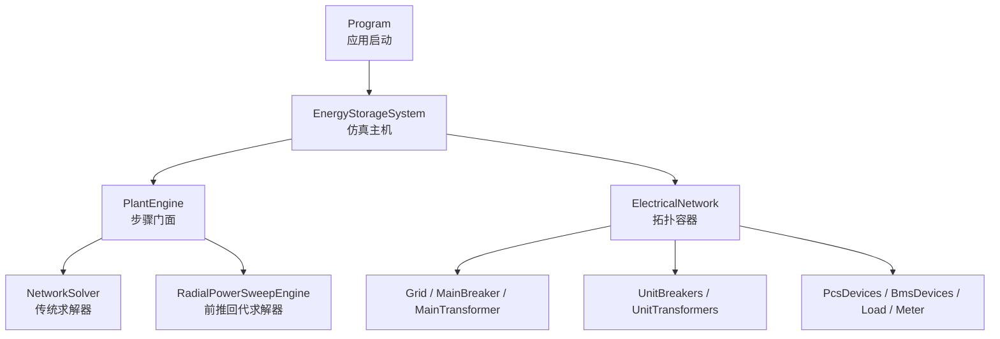
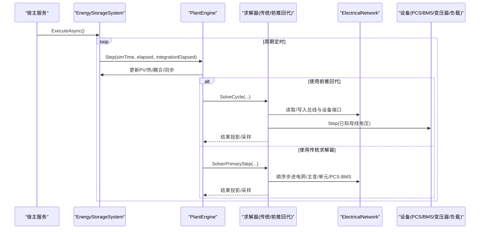
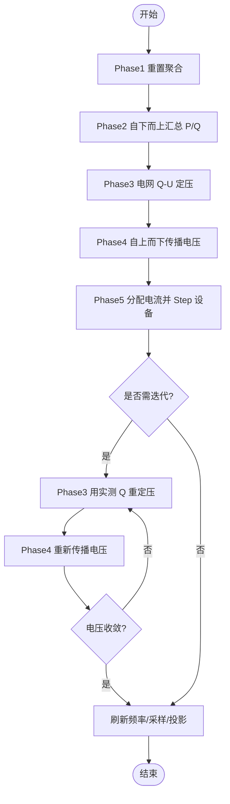
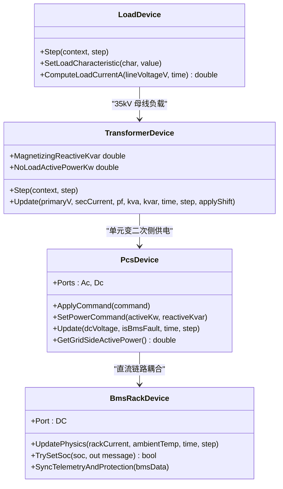
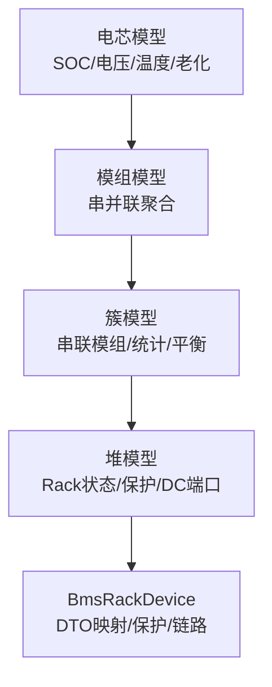
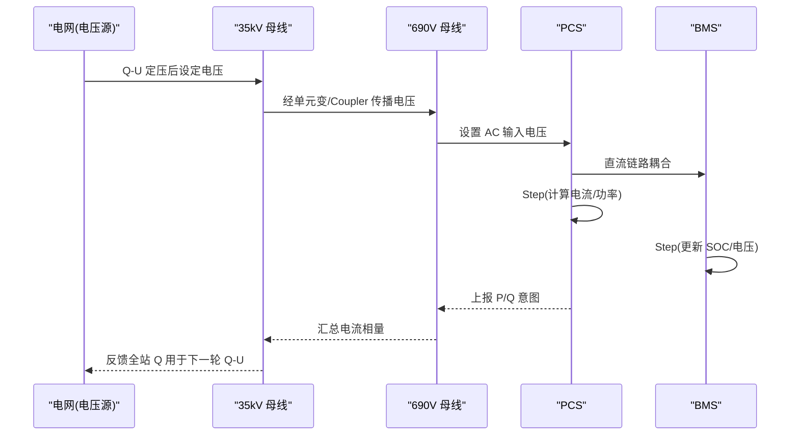
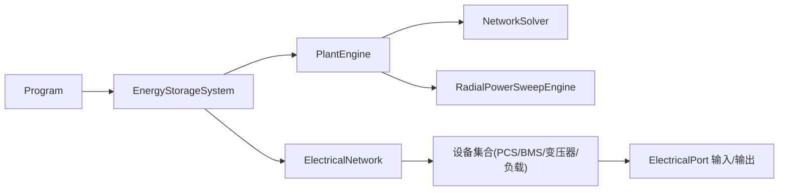

# 仿真引擎核心

<cite>
**本文引用的文件**
- [Program.cs](file://Program.cs)
- [SimulatorHost.cs](file://Core/SimulatorHost.cs)
- [EnergyStorageSys.cs](file://EssDeviceSimModel/EnergyStorageSys.cs)
- [PlantEngine.cs](file://EssDeviceSimModel/PlantEngine.cs)
- [NetworkSolver.cs](file://EssDeviceSimModel/Solver/NetworkSolver.cs)
- [ElectricalNetwork.cs](file://EssDeviceSimModel/Solver/ElectricalNetwork.cs)
- [RadialPowerSweepEngine.cs](file://EssDeviceSimModel/Propagation/RadialPowerSweepEngine.cs)
- [PcsDevice.Core.cs](file://EssDeviceSimModel/Devices/PcsDevice.Core.cs)
- [BmsRackDevice.cs](file://EssDeviceSimModel/Devices/BmsRackDevice.cs)
- [TransformerDevice.cs](file://EssDeviceSimModel/Devices/TransformerDevice.cs)
- [LoadDevice.cs](file://EssDeviceSimModel/Devices/LoadDevice.cs)
- [batteryCellModel.cs](file://EssDeviceSimModel/Battery/batteryCellModel.cs)
- [batteryClusterModel.cs](file://EssDeviceSimModel/Battery/batteryClusterModel.cs)
- [ElectricalBusNode.cs](file://EssDeviceSimModel/Propagation/ElectricalBusNode.cs)
</cite>

## 目录
1. [简介](#简介)
2. [项目结构](#项目结构)
3. [核心组件](#核心组件)
4. [架构总览](#架构总览)
5. [详细组件分析](#详细组件分析)
6. [依赖关系分析](#依赖关系分析)
7. [性能考虑](#性能考虑)
8. [故障排查指南](#故障排查指南)
9. [结论](#结论)
10. [附录：使用模式与扩展指南](#附录使用模式与扩展指南)

## 简介
本文件面向储能仿真引擎的核心实现，重点解释电气网络求解算法（潮流计算、故障分析与电压源传播机制）、设备模型库（BMS电池管理系统、PCS功率转换系统、变压器模型、负载模型），以及电池建模的多层次结构（电芯→模组→簇→堆）。文档同时给出具体代码路径与调用序列图，帮助读者理解如何基于现有接口实现自定义设备模型与控制策略。

## 项目结构
- 应用启动与生命周期管理由 Program 负责，注册核心服务并启动 Web、SignalR、Modbus 等子系统。
- EnergyStorageSystem 作为仿真主机，构建并维护电气拓扑、设备实例、热系统与耦合图；通过 PlantEngine 驱动每步推进。
- 电气求解提供两条主路径：
  - 传统 NetworkSolver：按“电网→主变→单元支路→PCS/BMS”顺序步进。
  - 径向前推回代 RadialPowerSweepEngine：叶子汇报 P/Q → 自下而上汇总 → 电网 Q-U 定压 → 自上而下传播电压 → 算电流并 Step 设备 → Q-V 反馈迭代收敛。
- 设备模型以统一 ElectricalPort 接口暴露 AC/DC 端口，支持潮流/保护/黑启动/温度等物理过程。
- 电池四层模型从 LiFePO4CellSimulator 到 BatteryClusterSimulator，向上聚合为 Rack 级状态，并通过 BmsRackDevice 接入直流链路。

**图表来源**
- [Program.cs:408-459](file://Program.cs#L408-L459)
- [EnergyStorageSys.cs:215-244](file://EssDeviceSimModel/EnergyStorageSys.cs#L215-L244)
- [PlantEngine.cs:22-48](file://EssDeviceSimModel/PlantEngine.cs#L22-L48)
- [NetworkSolver.cs:27-107](file://EssDeviceSimModel/Solver/NetworkSolver.cs#L27-L107)
- [RadialPowerSweepEngine.cs:54-75](file://EssDeviceSimModel/Propagation/RadialPowerSweepEngine.cs#L54-L75)

**章节来源**
- [Program.cs:216-523](file://Program.cs#L216-L523)
- [EnergyStorageSys.cs:124-244](file://EssDeviceSimModel/EnergyStorageSys.cs#L124-L244)
- [PlantEngine.cs:1-48](file://EssDeviceSimModel/PlantEngine.cs#L1-L48)

## 核心组件
- EnergyStorageSystem：装配 PCS/BMS/变压器/负载/光伏，选择求解路径，维护断路器、频率、PCC/站内母线电压，协调黑启动与站用电分摊。
- PlantEngine：对外仅暴露 Step(simTime, elapsed, integrationElapsed)，内部编排 PV→电气→热→耦合→同步→刷新。
- ElectricalNetwork：拓扑运行时容器，持有 Grid、断路器、变压器、负载、电表、PCS/BMS 列表及求解器。
- NetworkSolver：分阶段步进，完成负载意图、PCS/PV 功率收集、电网 Q-U、主变路径、单元支路求解、Q 反馈修正与电表采样。
- RadialPowerSweepEngine：六阶段前推回代，含 Q-V 反馈迭代与系统频率刷新、PCC 采样、结果投影至 ESS。
- 设备模型：PcsDevice、BmsRackDevice、TransformerDevice、LoadDevice 均暴露 ElectricalPort 输入输出，参与潮流与保护。

**章节来源**
- [EnergyStorageSys.cs:24-118](file://EssDeviceSimModel/EnergyStorageSys.cs#L24-L118)
- [PlantEngine.cs:6-48](file://EssDeviceSimModel/PlantEngine.cs#L6-L48)
- [ElectricalNetwork.cs:7-34](file://EssDeviceSimModel/Solver/ElectricalNetwork.cs#L7-L34)
- [NetworkSolver.cs:27-107](file://EssDeviceSimModel/Solver/NetworkSolver.cs#L27-L107)
- [RadialPowerSweepEngine.cs:9-75](file://EssDeviceSimModel/Propagation/RadialPowerSweepEngine.cs#L9-L75)

## 架构总览
仿真主循环由 HostedService 驱动，周期性调用 PlantEngine.Step。根据配置选择前推回代或传统求解器。设备间通过 ElectricalPort 交换 AC/DC 快照，母线节点聚合 P/Q 与电流相量，电网作为唯一电压源进行 Q-U 控制，PCS 在离网模式下可作为局部电压源建压。

**图表来源**
- [EnergyStorageSys.cs:473-496](file://EssDeviceSimModel/EnergyStorageSys.cs#L473-L496)
- [PlantEngine.cs:22-48](file://EssDeviceSimModel/PlantEngine.cs#L22-L48)
- [RadialPowerSweepEngine.cs:54-75](file://EssDeviceSimModel/Propagation/RadialPowerSweepEngine.cs#L54-L75)
- [NetworkSolver.cs:27-107](file://EssDeviceSimModel/Solver/NetworkSolver.cs#L27-L107)

## 详细组件分析

### 电气网络求解算法
- 传统求解器（NetworkSolver）
  - S1：设置负载端口输入，执行负载 Step，汇总全站有功/无功。
  - 收集 PCS/PV 功率意图，注入电网 Q-U 控制。
  - 电网 Step 后，沿主断→主变→35kV 母线传递。
  - 单元支路：按单元断路器状态计算单元电流，驱动单元变与 PCS/BMS 对。
  - Q 反馈修正一次迭代，刷新 PCC/站内母线电压，采样 PCC 电表。
- 前推回代（RadialPowerSweepEngine）
  - Phase1：重置各母线功率聚合。
  - Phase2：690V 母线贡献者上报 P/Q，汇总至 35kV。
  - Phase3：电网读全站 Q，Q-U 定 220kV 电压。
  - Phase4：电压自上而下经 Coupler 链传播至 690V。
  - Phase5：按已知母线电压分配电流，驱动设备 Step。
  - 迭代：按实测 Q 多轮 Q-U/V 反馈直至收敛。
  - 完成后刷新系统频率、采样 PCC、投影结果至 ESS。

**图表来源**
- [RadialPowerSweepEngine.cs:77-203](file://EssDeviceSimModel/Propagation/RadialPowerSweepEngine.cs#L77-L203)
- [RadialPowerSweepEngine.cs:251-320](file://EssDeviceSimModel/Propagation/RadialPowerSweepEngine.cs#L251-L320)

**章节来源**
- [NetworkSolver.cs:27-107](file://EssDeviceSimModel/Solver/NetworkSolver.cs#L27-L107)
- [NetworkSolver.cs:117-215](file://EssDeviceSimModel/Solver/NetworkSolver.cs#L117-L215)
- [NetworkSolver.cs:217-245](file://EssDeviceSimModel/Solver/NetworkSolver.cs#L217-L245)
- [RadialPowerSweepEngine.cs:54-75](file://EssDeviceSimModel/Propagation/RadialPowerSweepEngine.cs#L54-L75)
- [RadialPowerSweepEngine.cs:77-203](file://EssDeviceSimModel/Propagation/RadialPowerSweepEngine.cs#L77-L203)

### 设备模型库
- PCS 功率转换系统（PcsDevice）
  - 暴露 AC/DC 端口，支持跟网/离网、功率爬坡、黑启动、保护、温度模型。
  - 并网模式：按效率折算 DC 侧功率，交流侧电流由 P/Q 与端电压推算。
  - 离网模式：作为电压源建压，频率与电压受黑启动相位控制。
  - 保护：过流、超温、直流电压越限、孤岛检测、黑启动与市电冲突等。
- BMS 电池管理系统（BmsRackDevice）
  - 封装四层电池堆物理，提供 DC 端口与 PCS 并网链路。
  - 将物理量映射为 BMS DTO，评估簇级/Rack 级保护并回写故障态。
  - 支持热设 SOC（待机时）、电池节点温度注入（影响电芯散热）。
- 变压器模型（TransformerDevice）
  - 两端口串联设备，计算励磁涌流、空载铁损、负载铜损、效率。
  - 并网且电网可用时，励磁/铁损由无穷大电网吸收，端口只传递穿越功率。
  - 提供二次侧无载有功与无功、涌流需求等辅助接口。
- 负载模型（LoadDevice）
  - 单端口设备，支持时段计划与随机波动，只能消耗有功（≤0）。
  - 根据母线电压换算负载电流，供监视与兼容路径使用。

**图表来源**
- [PcsDevice.Core.cs:136-159](file://EssDeviceSimModel/Devices/PcsDevice.Core.cs#L136-L159)
- [PcsDevice.Core.cs:333-348](file://EssDeviceSimModel/Devices/PcsDevice.Core.cs#L333-L348)
- [PcsDevice.Core.cs:444-533](file://EssDeviceSimModel/Devices/PcsDevice.Core.cs#L444-L533)
- [BmsRackDevice.cs:84-149](file://EssDeviceSimModel/Devices/BmsRackDevice.cs#L84-L149)
- [TransformerDevice.cs:68-127](file://EssDeviceSimModel/Devices/TransformerDevice.cs#L68-L127)
- [LoadDevice.cs:142-157](file://EssDeviceSimModel/Devices/LoadDevice.cs#L142-L157)

**章节来源**
- [PcsDevice.Core.cs:1-696](file://EssDeviceSimModel/Devices/PcsDevice.Core.cs#L1-L696)
- [BmsRackDevice.cs:1-167](file://EssDeviceSimModel/Devices/BmsRackDevice.cs#L1-L167)
- [TransformerDevice.cs:1-298](file://EssDeviceSimModel/Devices/TransformerDevice.cs#L1-L298)
- [LoadDevice.cs:1-172](file://EssDeviceSimModel/Devices/LoadDevice.cs#L1-L172)

### 电池建模多层次结构
- 电芯模型（LiFePO4CellSimulator）
  - 维护 SOC、电压、温度、剩余容量、循环次数、老化程度。
  - 温度模型采用一阶滤波，稳态温度与环境节点温度相关，时间常数由质量与等效散热系数决定。
  - 老化模型综合循环吞吐与阿伦尼乌斯日历老化。
- 模组/簇模型（BatteryPackSimulator/BatteryClusterSimulator）
  - 簇由多个模组串联，每个模组包含串并联电芯。
  - 簇级统计包括总电压、电流、电压不平衡度、温差、SOC 范围、健康度、容量等。
  - 支持热设簇内全部 Pack SOC，并刷新簇汇总。
- 堆模型（BatteryRackSimulator，通过 BmsRackDevice 暴露）
  - 将簇级状态聚合为 Rack 级运行状态，提供 DC 端口与 PCS 并网链路。
  - 将物理量映射为 BMS DTO，评估保护并回写 Rack 故障态。

**图表来源**
- [batteryCellModel.cs:35-177](file://EssDeviceSimModel/Battery/batteryCellModel.cs#L35-L177)
- [batteryClusterModel.cs:42-153](file://EssDeviceSimModel/Battery/batteryClusterModel.cs#L42-L153)
- [BmsRackDevice.cs:84-149](file://EssDeviceSimModel/Devices/BmsRackDevice.cs#L84-L149)

**章节来源**
- [batteryCellModel.cs:1-269](file://EssDeviceSimModel/Battery/batteryCellModel.cs#L1-L269)
- [batteryClusterModel.cs:1-266](file://EssDeviceSimModel/Battery/batteryClusterModel.cs#L1-L266)
- [BmsRackDevice.cs:1-167](file://EssDeviceSimModel/Devices/BmsRackDevice.cs#L1-L167)

### 电压源传播机制
- 母线节点（ElectricalBusNode）
  - 维护线电压、频率、电流相量累加，支持注册功率贡献者与本地电压源。
  - 合并本地电压源（如黑启动 PCS）注入，取最高线电压写入母线。
  - 提供 ToCurrentIntent/ToVoltageIntent 用于潮流计算。
- 前推回代中的电压传播
  - 电网 Q-U 定压后，通过 Coupler 链自上而下传播至 35kV/690V 母线。
  - 设备在已知母线电压下计算电流并 Step，随后用实测 Q 迭代收敛。

**图表来源**
- [ElectricalBusNode.cs:60-116](file://EssDeviceSimModel/Propagation/ElectricalBusNode.cs#L60-L116)
- [RadialPowerSweepEngine.cs:97-133](file://EssDeviceSimModel/Propagation/RadialPowerSweepEngine.cs#L97-L133)
- [RadialPowerSweepEngine.cs:148-177](file://EssDeviceSimModel/Propagation/RadialPowerSweepEngine.cs#L148-L177)
- [RadialPowerSweepEngine.cs:260-288](file://EssDeviceSimModel/Propagation/RadialPowerSweepEngine.cs#L260-L288)

**章节来源**
- [ElectricalBusNode.cs:1-172](file://EssDeviceSimModel/Propagation/ElectricalBusNode.cs#L1-L172)
- [RadialPowerSweepEngine.cs:97-177](file://EssDeviceSimModel/Propagation/RadialPowerSweepEngine.cs#L97-L177)

## 依赖关系分析
- 启动层：Program 注册 EnergyStorageSystem、数据服务、Web/SignalR/Modbus，并启动 HostedService。
- 仿真层：EnergyStorageSystem 构造 ElectricalNetwork，选择求解器；PlantEngine 编排 PV→电气→热→耦合→同步。
- 求解层：NetworkSolver 与 RadialPowerSweepEngine 都依赖 ElectricalNetwork 的设备列表与端口快照。
- 设备层：PcsDevice/BmsRackDevice/TransformerDevice/LoadDevice 通过 ElectricalPort 交互，不直接耦合彼此。
- 数据层：BmsRackDevice 将 Rack 状态映射为 BMS DTO，供上层数据交换管道消费。

**图表来源**
- [Program.cs:408-459](file://Program.cs#L408-L459)
- [EnergyStorageSys.cs:215-244](file://EssDeviceSimModel/EnergyStorageSys.cs#L215-L244)
- [PlantEngine.cs:22-48](file://EssDeviceSimModel/PlantEngine.cs#L22-L48)
- [ElectricalNetwork.cs:12-34](file://EssDeviceSimModel/Solver/ElectricalNetwork.cs#L12-L34)

**章节来源**
- [Program.cs:216-523](file://Program.cs#L216-L523)
- [EnergyStorageSys.cs:124-244](file://EssDeviceSimModel/EnergyStorageSys.cs#L124-L244)
- [ElectricalNetwork.cs:7-34](file://EssDeviceSimModel/Solver/ElectricalNetwork.cs#L7-L34)

## 性能考虑
- 前推回代路径默认启用时，通过 Q-V 反馈迭代提升收敛性，迭代次数与容差可配置。
- 设备 Step 仅在已知母线电压下进行，减少全局非线性求解复杂度。
- 负载与 PCS 的功率意图先汇总再驱动设备，降低重复计算。
- 温度与老化模型采用一阶滤波与简化公式，避免昂贵微分方程求解。
- 建议合理设置 PropagationIntervalMs 与 IntegrationStepMultiplier，平衡实时性与精度。

[本节为通用指导，无需特定文件引用]

## 故障排查指南
- PCS 故障锁存
  - 过流、超温、直流电压越限、孤岛检测、黑启动与市电冲突会触发故障锁存；外部启停写 0 或联锁会停机。
  - 可通过外部写 1 清除历史故障并重启（见 PCS 外部命令处理）。
- BMS 保护
  - 簇级/Rack 级保护评估后回写 Rack 故障态，影响 PCS 直流链路连通性。
- 电网失电与黑启动
  - 主网不可用时，PCS 若未启用黑启动则停机；启用后可在单元母线建压。
- 频率与电压
  - 系统频率由 SystemFrequencyResolver 每步刷新；PCC/站内母线电压在主断闭合时由电网推导。

**章节来源**
- [PcsDevice.Core.cs:643-693](file://EssDeviceSimModel/Devices/PcsDevice.Core.cs#L643-L693)
- [PcsDevice.Core.cs:247-268](file://EssDeviceSimModel/Devices/PcsDevice.Core.cs#L247-L268)
- [BmsRackDevice.cs:116-131](file://EssDeviceSimModel/Devices/BmsRackDevice.cs#L116-L131)
- [EnergyStorageSys.cs:498-521](file://EssDeviceSimModel/EnergyStorageSys.cs#L498-L521)

## 结论
该仿真引擎以统一的 ElectricalPort 抽象连接设备，提供两种电气求解路径以满足不同场景需求。PCS/BMS/变压器/负载等设备模型具备完整的物理过程（潮流、保护、温度、老化），并通过 PlantEngine 与耦合图协同工作。前推回代机制结合 Q-V 反馈迭代，提升了复杂网络的收敛性与可解释性。基于现有接口，用户可便捷扩展自定义设备与控制策略。

[本节为总结，无需特定文件引用]

## 附录：使用模式与扩展指南
- 典型使用模式
  - 启动应用：Program 注册服务并启动 HostedService，周期性调用 PlantEngine.Step。
  - 配置选择：根据 Runtime.UseElectricalPropagation 选择前推回代或传统求解器。
  - 设备控制：通过 DeviceCommand 设置 PCS 功率指令，或通过 API 设置负载特性、电网参数。
- 自定义设备模型
  - 实现 IElectricalDevice 或继承已有基类，暴露 ElectricalPort 输入/输出。
  - 在 Step(context, step) 中读取端口输入，计算物理量，写入端口输出。
  - 如需参与潮流，向对应母线注册为功率贡献者或电压源。
- 自定义控制策略
  - 在 PCS 中通过 SetControlStrategy 扩展控制逻辑（恒功率/恒电流/下垂控制等）。
  - 利用 PowerSweepEngine 或 NetworkSolver 的回调点注入策略调整。

**章节来源**
- [Program.cs:408-459](file://Program.cs#L408-L459)
- [EnergyStorageSys.cs:225-240](file://EssDeviceSimModel/EnergyStorageSys.cs#L225-L240)
- [PcsDevice.Core.cs:424-441](file://EssDeviceSimModel/Devices/PcsDevice.Core.cs#L424-L441)
- [LoadDevice.cs:76-91](file://EssDeviceSimModel/Devices/LoadDevice.cs#L76-L91)