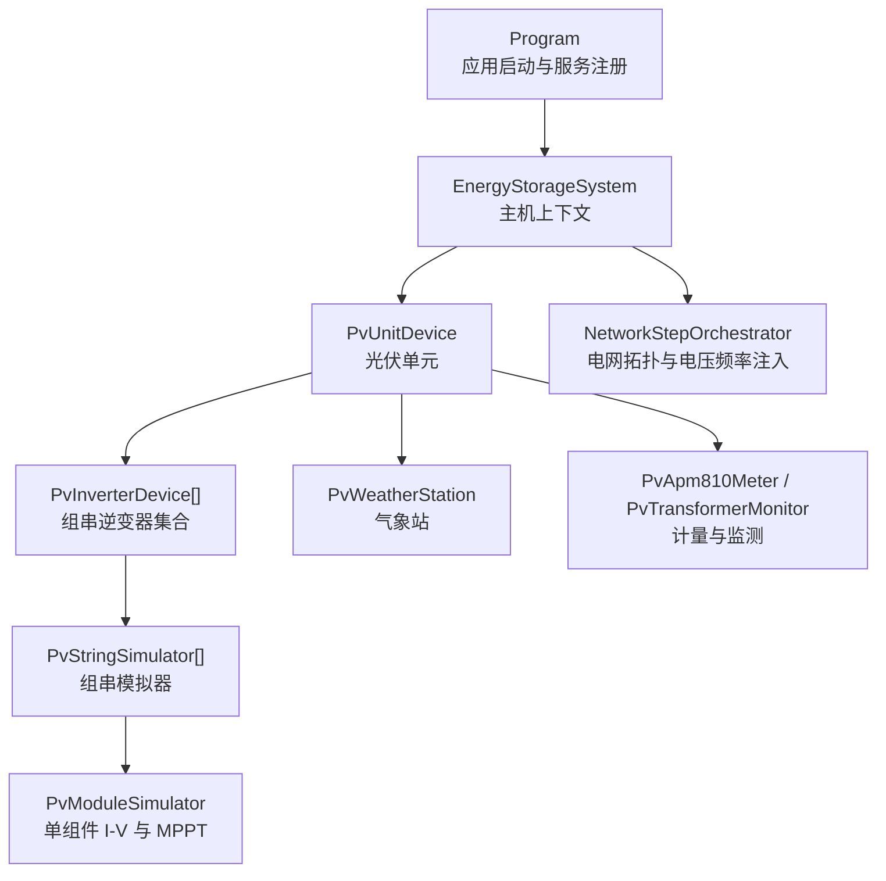
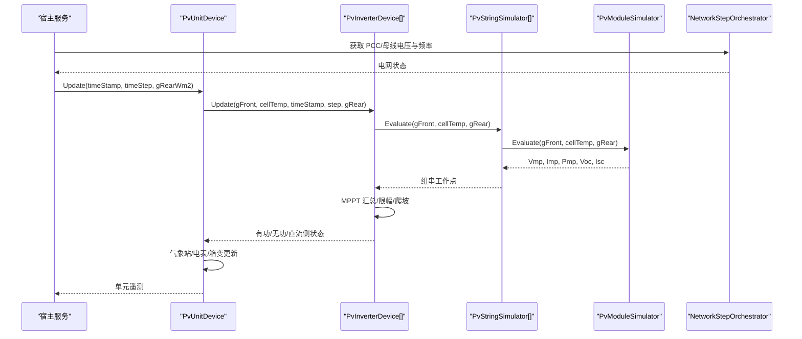
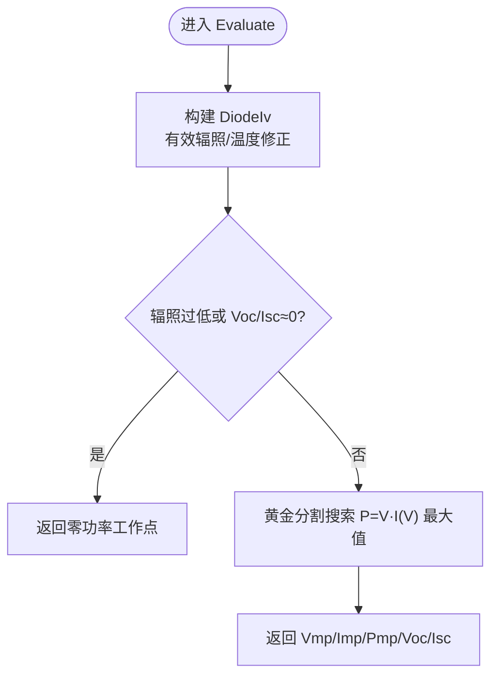
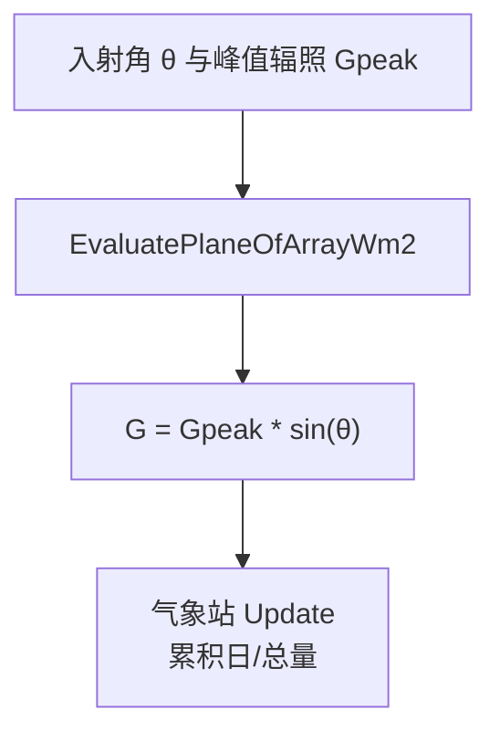
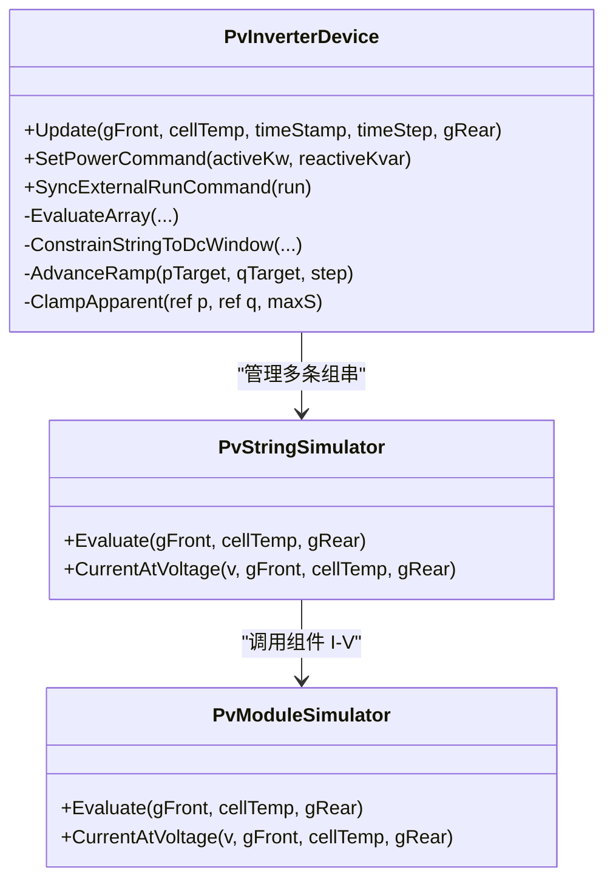
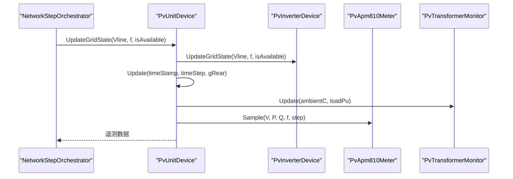
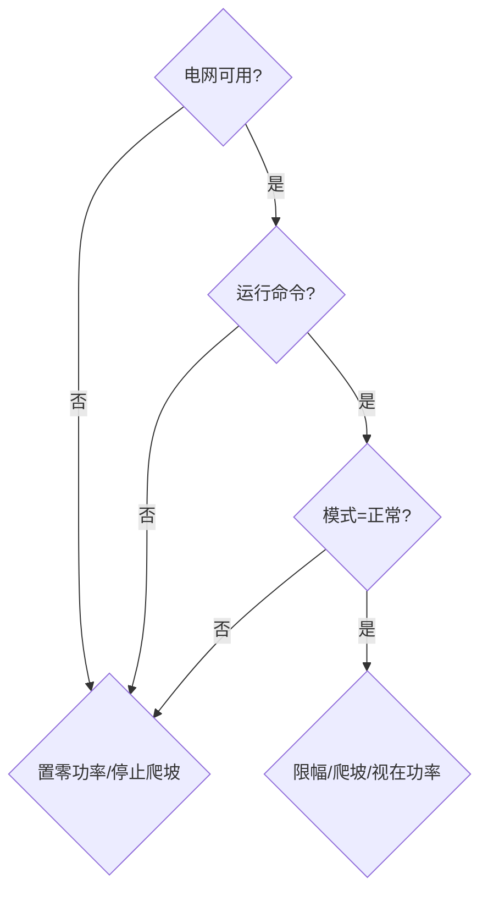
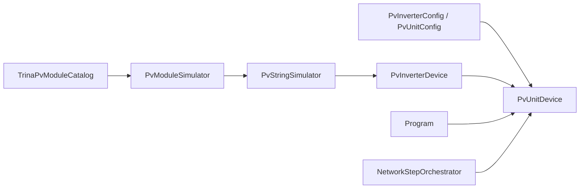

# 光伏系统仿真

<cite>
**本文引用的文件**
- [Program.cs](file://Program.cs)
- [appsettings.json](file://appsettings.json)
- [EssDeviceSimModel/Pv/PvInverterDevice.cs](file://EssDeviceSimModel/Pv/PvInverterDevice.cs)
- [EssDeviceSimModel/Pv/PvModuleSimulator.cs](file://EssDeviceSimModel/Pv/PvModuleSimulator.cs)
- [EssDeviceSimModel/Pv/PvIrradianceModel.cs](file://EssDeviceSimModel/Pv/PvIrradianceModel.cs)
- [EssDeviceSimModel/Pv/PvWeatherStation.cs](file://EssDeviceSimModel/Pv/PvWeatherStation.cs)
- [EssDeviceSimModel/Pv/PvStringSimulator.cs](file://EssDeviceSimModel/Pv/PvStringSimulator.cs)
- [EssDeviceSimModel/Pv/PvUnitDevice.cs](file://EssDeviceSimModel/Pv/PvUnitDevice.cs)
- [EssDeviceSimModel/Pv/PvInverterConfig.cs](file://EssDeviceSimModel/Pv/PvInverterConfig.cs)
- [EssDeviceSimModel/Pv/PvUnitConfig.cs](file://EssDeviceSimModel/Pv/PvUnitConfig.cs)
- [EssDeviceSimModel/Pv/TrinaPvModuleCatalog.cs](file://EssDeviceSimModel/Pv/TrinaPvModuleCatalog.cs)
- [EssDeviceSimModel/PcsTypes.cs](file://EssDeviceSimModel/PcsTypes.cs)
- [EssDeviceSimModel/Solver/NetworkStepOrchestrator.cs](file://EssDeviceSimModel/Solver/NetworkStepOrchestrator.cs)
- [EssSimulator.Tests/Pv/PvIrradianceModelTests.cs](file://EssSimulator.Tests/Pv/PvIrradianceModelTests.cs)
- [EssSimulator.Tests/Pv/PvModuleSimulatorTests.cs](file://EssSimulator.Tests/Pv/PvModuleSimulatorTests.cs)
</cite>

## 目录
1. [简介](#简介)
2. [项目结构](#项目结构)
3. [核心组件](#核心组件)
4. [架构总览](#架构总览)
5. [详细组件分析](#详细组件分析)
6. [依赖关系分析](#依赖关系分析)
7. [性能考虑](#性能考虑)
8. [故障排查指南](#故障排查指南)
9. [结论](#结论)
10. [附录：配置与使用示例](#附录：配置与使用示例)

## 简介
本文件面向“光伏系统仿真”目标，围绕逆变器模型、辐照度模型、气象站仿真与组件模拟器进行系统化说明，并补充 MPPT 算法、功率曲线建模、效率损失计算、与储能协调控制、并网控制及故障处理机制。文档同时给出可操作的配置与监控方法，帮助读者快速搭建、运行与评估光伏仿真场景。

## 项目结构
本项目采用模块化设计，光伏相关能力集中在 EssDeviceSimModel/Pv 目录下，通过 Program 启动时注册到宿主服务，并由网络求解器在每步仿真中驱动更新。关键组织方式如下：
- 设备层：组件、组串、逆变器、单元（含箱变、电表、PID、气象站等）
- 控制层：有功/无功指令、爬坡限制、限幅逻辑、状态机
- 环境层：辐照度模型、温度估算、气象站累计量
- 集成层：与电网拓扑、PCS/储能系统耦合，提供统一接口

图表来源
- [Program.cs:408-424](file://Program.cs#L408-L424)
- [EssDeviceSimModel/Solver/NetworkStepOrchestrator.cs:28-43](file://EssDeviceSimModel/Solver/NetworkStepOrchestrator.cs#L28-L43)
- [EssDeviceSimModel/Pv/PvUnitDevice.cs:19-47](file://EssDeviceSimModel/Pv/PvUnitDevice.cs#L19-L47)
- [EssDeviceSimModel/Pv/PvInverterDevice.cs:33-49](file://EssDeviceSimModel/Pv/PvInverterDevice.cs#L33-L49)
- [EssDeviceSimModel/Pv/PvStringSimulator.cs:8-20](file://EssDeviceSimModel/Pv/PvStringSimulator.cs#L8-L20)
- [EssDeviceSimModel/Pv/PvModuleSimulator.cs:14-23](file://EssDeviceSimModel/Pv/PvModuleSimulator.cs#L14-L23)

章节来源
- [Program.cs:216-523](file://Program.cs#L216-L523)
- [appsettings.json:1-91](file://appsettings.json#L1-L91)

## 核心组件
- 组件模拟器：基于单二极管 I-V 模型，支持双玻背面辐照、温度系数、NOCT 温度估算，并在运行时以黄金分割法搜索 P=V·I(V) 的最大功率点，实现 MPPT。
- 组串模拟器：串联 N 块组件，电流一致，电压/功率按块数叠加。
- 逆变器模型：多路 MPPT（默认 6 路），每路分配若干组串；支持直流窗口约束、低温降额、有功/无功设定、视在功率限幅、爬坡限制、电网断开保护。
- 单元设备：聚合多台逆变器，维护方阵气候（A/B 侧）、气象站、箱变监测、高低压侧电表、PID 模块与日志。
- 辐照度模型：平面入射角与太阳高度角关联，G = Gpeak · sin(θ)。
- 气象站：记录环境/组件温度、水平/斜面辐照度及其日累计与总累计。

章节来源
- [EssDeviceSimModel/Pv/PvModuleSimulator.cs:1-148](file://EssDeviceSimModel/Pv/PvModuleSimulator.cs#L1-L148)
- [EssDeviceSimModel/Pv/PvStringSimulator.cs:1-39](file://EssDeviceSimModel/Pv/PvStringSimulator.cs#L1-L39)
- [EssDeviceSimModel/Pv/PvInverterDevice.cs:1-355](file://EssDeviceSimModel/Pv/PvInverterDevice.cs#L1-L355)
- [EssDeviceSimModel/Pv/PvUnitDevice.cs:1-231](file://EssDeviceSimModel/Pv/PvUnitDevice.cs#L1-L231)
- [EssDeviceSimModel/Pv/PvIrradianceModel.cs:1-25](file://EssDeviceSimModel/Pv/PvIrradianceModel.cs#L1-L25)
- [EssDeviceSimModel/Pv/PvWeatherStation.cs:1-50](file://EssDeviceSimModel/Pv/PvWeatherStation.cs#L1-L50)

## 架构总览
光伏仿真由“环境输入 → 组件/组串 → 逆变器 → 单元聚合 → 电网耦合”的流水线构成。每步仿真：
1) 读取或生成辐照度与环境温度；
2) 计算组件工作点与 MPPT；
3) 逆变器汇总各 MPPT 支路，执行限幅与爬坡；
4) 输出交流侧功率、电流、电压、频率；
5) 与电网拓扑交互，受 PCC/母线电压与频率影响。

图表来源
- [EssDeviceSimModel/Solver/NetworkStepOrchestrator.cs:28-43](file://EssDeviceSimModel/Solver/NetworkStepOrchestrator.cs#L28-L43)
- [EssDeviceSimModel/Pv/PvUnitDevice.cs:145-157](file://EssDeviceSimModel/Pv/PvUnitDevice.cs#L145-L157)
- [EssDeviceSimModel/Pv/PvInverterDevice.cs:128-153](file://EssDeviceSimModel/Pv/PvInverterDevice.cs#L128-L153)
- [EssDeviceSimModel/Pv/PvStringSimulator.cs:22-33](file://EssDeviceSimModel/Pv/PvStringSimulator.cs#L22-L33)
- [EssDeviceSimModel/Pv/PvModuleSimulator.cs:32-41](file://EssDeviceSimModel/Pv/PvModuleSimulator.cs#L32-L41)

## 详细组件分析

### 组件模拟器与 MPPT 算法
- 单二极管 I-V 模型：根据有效辐照（前背双面叠加）与电池温度构建 I-V 曲线，计算短路电流、开路电压、反向饱和电流等参数。
- MPPT 实现：在 Voc 区间内采用黄金分割法搜索 P=V·I(V) 最大值，迭代固定次数收敛，得到 Vmp、Imp、Pmp。
- 温度与辐照：支持 NOCT 温度估算、温度系数修正、最小辐照阈值保护。

图表来源
- [EssDeviceSimModel/Pv/PvModuleSimulator.cs:32-41](file://EssDeviceSimModel/Pv/PvModuleSimulator.cs#L32-L41)
- [EssDeviceSimModel/Pv/PvModuleSimulator.cs:85-118](file://EssDeviceSimModel/Pv/PvModuleSimulator.cs#L85-L118)
- [EssDeviceSimModel/Pv/PvModuleSimulator.cs:49-70](file://EssDeviceSimModel/Pv/PvModuleSimulator.cs#L49-L70)

章节来源
- [EssDeviceSimModel/Pv/PvModuleSimulator.cs:1-148](file://EssDeviceSimModel/Pv/PvModuleSimulator.cs#L1-L148)
- [EssDeviceSimModel/Pv/TrinaPvModuleCatalog.cs:1-41](file://EssDeviceSimModel/Pv/TrinaPvModuleCatalog.cs#L1-L41)
- [EssSimulator.Tests/Pv/PvModuleSimulatorTests.cs:1-44](file://EssSimulator.Tests/Pv/PvModuleSimulatorTests.cs#L1-L44)

### 辐照度模型与气象站仿真
- 辐照度模型：平面入射角 θ 与太阳高度角关联，G = Gpeak · sin(θ)，θ∈(0,180) 时生效。
- 气象站：维护环境温度、组件温度、水平/斜面辐照度及其日累计与总累计，用于统计发电量与性能评估。

图表来源
- [EssDeviceSimModel/Pv/PvIrradianceModel.cs:11-22](file://EssDeviceSimModel/Pv/PvIrradianceModel.cs#L11-L22)
- [EssDeviceSimModel/Pv/PvWeatherStation.cs:21-47](file://EssDeviceSimModel/Pv/PvWeatherStation.cs#L21-L47)

章节来源
- [EssDeviceSimModel/Pv/PvIrradianceModel.cs:1-25](file://EssDeviceSimModel/Pv/PvIrradianceModel.cs#L1-L25)
- [EssDeviceSimModel/Pv/PvWeatherStation.cs:1-50](file://EssDeviceSimModel/Pv/PvWeatherStation.cs#L1-L50)
- [EssSimulator.Tests/Pv/PvIrradianceModelTests.cs:1-42](file://EssSimulator.Tests/Pv/PvIrradianceModelTests.cs#L1-L42)

### 逆变器模型与功率曲线建模
- 组串与 MPPT 分配：默认 16 组串，6 路 MPPT 分配为 3+3+3+3+2+2；每路汇总电流与平均电压。
- 直流窗口约束：将工作点限制在 DC 电压范围内，越界触发过压/欠压标记。
- 功率曲线与限幅：实际出力 = min(限值, 阵列可发, 额定)，并受视在功率 S 约束；支持有功/无功设定与爬坡限制。
- 效率与损失：交流侧功率 = 直流侧 × 逆变器效率；电网损耗通过 GridLossCoefficient 调整。
- 低温降额：线性降额至截止温度，低于阈值则禁止发电。

图表来源
- [EssDeviceSimModel/Pv/PvInverterDevice.cs:33-49](file://EssDeviceSimModel/Pv/PvInverterDevice.cs#L33-L49)
- [EssDeviceSimModel/Pv/PvInverterDevice.cs:128-153](file://EssDeviceSimModel/Pv/PvInverterDevice.cs#L128-L153)
- [EssDeviceSimModel/Pv/PvInverterDevice.cs:177-234](file://EssDeviceSimModel/Pv/PvInverterDevice.cs#L177-L234)
- [EssDeviceSimModel/Pv/PvInverterDevice.cs:295-334](file://EssDeviceSimModel/Pv/PvInverterDevice.cs#L295-L334)
- [EssDeviceSimModel/Pv/PvStringSimulator.cs:22-36](file://EssDeviceSimModel/Pv/PvStringSimulator.cs#L22-L36)
- [EssDeviceSimModel/Pv/PvModuleSimulator.cs:32-47](file://EssDeviceSimModel/Pv/PvModuleSimulator.cs#L32-L47)

章节来源
- [EssDeviceSimModel/Pv/PvInverterDevice.cs:1-355](file://EssDeviceSimModel/Pv/PvInverterDevice.cs#L1-L355)
- [EssDeviceSimModel/Pv/PvInverterConfig.cs:1-23](file://EssDeviceSimModel/Pv/PvInverterConfig.cs#L1-L23)

### 单元设备与监控
- 单元聚合：管理 A/B 方阵气候、多台逆变器、气象站、箱变监测、高低压侧电表、PID 模块与日志。
- 电网耦合：根据主开关与单元断路器状态，向逆变器注入低压侧线电压与系统频率，判断电网可用性。
- 计量与监测：采样低/高压侧电压、有功/无功、频率，累计电量；箱变负载率与温度监测。

图表来源
- [EssDeviceSimModel/Solver/NetworkStepOrchestrator.cs:100-127](file://EssDeviceSimModel/Solver/NetworkStepOrchestrator.cs#L100-L127)
- [EssDeviceSimModel/Pv/PvUnitDevice.cs:124-131](file://EssDeviceSimModel/Pv/PvUnitDevice.cs#L124-L131)
- [EssDeviceSimModel/Pv/PvUnitDevice.cs:206-219](file://EssDeviceSimModel/Pv/PvUnitDevice.cs#L206-L219)

章节来源
- [EssDeviceSimModel/Pv/PvUnitDevice.cs:1-231](file://EssDeviceSimModel/Pv/PvUnitDevice.cs#L1-L231)
- [EssDeviceSimModel/Pv/PvUnitConfig.cs:1-18](file://EssDeviceSimModel/Pv/PvUnitConfig.cs#L1-L18)

### 与储能的协调控制与并网控制
- 协调控制：光伏单元与储能 PCS 共享同一电网拓扑与频率源；当电网可用时，两者均依据 PCC/母线电压与频率进行控制。
- 并网控制：逆变器仅在电网可用且处于正常模式时输出有功；电网断开时停止爬坡并置零功率。
- 故障处理：直流过压/欠压、电网不可用、低温抑制等条件会改变限制原因并停止输出；PCS 侧也有类似故障检测与闭锁逻辑。

图表来源
- [EssDeviceSimModel/Pv/PvInverterDevice.cs:128-153](file://EssDeviceSimModel/Pv/PvInverterDevice.cs#L128-L153)
- [EssDeviceSimModel/Pv/PvInverterDevice.cs:336-345](file://EssDeviceSimModel/Pv/PvInverterDevice.cs#L336-L345)
- [EssDeviceSimModel/PcsTypes.cs:91-96](file://EssDeviceSimModel/PcsTypes.cs#L91-L96)

章节来源
- [EssDeviceSimModel/Solver/NetworkStepOrchestrator.cs:28-43](file://EssDeviceSimModel/Solver/NetworkStepOrchestrator.cs#L28-L43)
- [EssDeviceSimModel/PcsTypes.cs:91-96](file://EssDeviceSimModel/PcsTypes.cs#L91-L96)

## 依赖关系分析
- 组件依赖：PvUnitDevice 依赖 PvInverterDevice 数组；每个逆变器依赖 PvStringSimulator 数组；组串依赖 PvModuleSimulator。
- 配置依赖：PvInverterConfig 与 PvUnitConfig 决定拓扑与电气参数；TrinaPvModuleCatalog 提供组件规格。
- 外部依赖：Program 将 EnergyStorageSystem 与 PV 单元注册到宿主；NetworkStepOrchestrator 提供电网状态注入。

图表来源
- [EssDeviceSimModel/Pv/PvUnitConfig.cs:1-18](file://EssDeviceSimModel/Pv/PvUnitConfig.cs#L1-L18)
- [EssDeviceSimModel/Pv/PvInverterConfig.cs:1-23](file://EssDeviceSimModel/Pv/PvInverterConfig.cs#L1-L23)
- [EssDeviceSimModel/Pv/TrinaPvModuleCatalog.cs:1-41](file://EssDeviceSimModel/Pv/TrinaPvModuleCatalog.cs#L1-L41)
- [Program.cs:408-424](file://Program.cs#L408-L424)
- [EssDeviceSimModel/Solver/NetworkStepOrchestrator.cs:28-43](file://EssDeviceSimModel/Solver/NetworkStepOrchestrator.cs#L28-L43)

章节来源
- [EssDeviceSimModel/Pv/PvUnitDevice.cs:1-231](file://EssDeviceSimModel/Pv/PvUnitDevice.cs#L1-L231)
- [EssDeviceSimModel/Pv/PvInverterDevice.cs:1-355](file://EssDeviceSimModel/Pv/PvInverterDevice.cs#L1-L355)
- [EssDeviceSimModel/Pv/PvModuleSimulator.cs:1-148](file://EssDeviceSimModel/Pv/PvModuleSimulator.cs#L1-L148)

## 性能考虑
- MPPT 搜索复杂度：黄金分割法在固定迭代次数下收敛，时间复杂度近似 O(k)，k 为迭代次数（常数级）。
- 组件 I-V 计算：指数项需做上界截断以避免溢出，保证数值稳定性。
- 逆变器限幅与爬坡：视在功率限幅与斜坡限制避免突变，提升系统稳定性。
- 温度与辐照：NOCT 温度估算简化热模型，减少计算开销。
- 批量更新：单元对 A/B 方阵分别更新，降低单次循环复杂度。

[本节为通用性能讨论，不直接分析具体文件]

## 故障排查指南
- 无输出或功率为零：检查运行命令、电网可用性、辐照度是否过低、直流电压是否在窗口内、是否处于低温抑制。
- 直流过压/欠压：确认组件开路电压与逆变器 DC 范围匹配；检查组串数量与配置。
- 有功受限：查看“限制原因”，区分“有功设定”、“已达额定”、“辐照不足”等。
- 与储能协调异常：确认 PCC/母线电压与频率注入是否正确；检查主开关与单元断路器状态。
- 故障闭锁：参考 PCS 故障检测逻辑（直流电压越限、过流、高温、孤岛检测等），定位并复位。

章节来源
- [EssDeviceSimModel/Pv/PvInverterDevice.cs:155-175](file://EssDeviceSimModel/Pv/PvInverterDevice.cs#L155-L175)
- [EssDeviceSimModel/Pv/PvInverterDevice.cs:202-234](file://EssDeviceSimModel/Pv/PvInverterDevice.cs#L202-L234)
- [EssDeviceSimModel/PcsTypes.cs:91-96](file://EssDeviceSimModel/PcsTypes.cs#L91-L96)

## 结论
该光伏仿真实现了从组件到单元的完整链路，具备可靠的 MPPT、功率曲线建模与效率损失计算，能够与电网拓扑和储能系统协同运行。通过配置化与模块化设计，用户可灵活搭建不同规模的光伏阵列，并进行性能评估与优化。

[本节为总结性内容，不直接分析具体文件]

## 附录：配置与使用示例
- 配置光伏阵列
  - 设置逆变器数量、每串组件数、额定功率、DC 电压范围、效率、爬坡斜率与间隔等。
  - 选择组件型号（如天合 760 W 档），自动获得温度系数与双面增益。
  - 参考路径：[PvInverterConfig.cs:1-23](file://EssDeviceSimModel/Pv/PvInverterConfig.cs#L1-L23)、[PvUnitConfig.cs:1-18](file://EssDeviceSimModel/Pv/PvUnitConfig.cs#L1-L18)、[TrinaPvModuleCatalog.cs:1-41](file://EssDeviceSimModel/Pv/TrinaPvModuleCatalog.cs#L1-L41)

- 设置天气数据
  - 通过单元 Update 传入斜面辐照、环境温度、组件温度与背面辐照；或使用气象站累计量进行统计。
  - 辐照度模型可按入射角计算平面辐照。
  - 参考路径：[PvUnitDevice.cs:145-167](file://EssDeviceSimModel/Pv/PvUnitDevice.cs#L145-L167)、[PvWeatherStation.cs:21-47](file://EssDeviceSimModel/Pv/PvWeatherStation.cs#L21-L47)、[PvIrradianceModel.cs:11-22](file://EssDeviceSimModel/Pv/PvIrradianceModel.cs#L11-L22)

- 监控发电性能
  - 读取单元有功/无功、直流侧电压/电流、逆变器 MPPT 电压/电流、气象站日累计辐照、电表累计电量。
  - 参考路径：[PvUnitDevice.cs:85-110](file://EssDeviceSimModel/Pv/PvUnitDevice.cs#L85-L110)、[PvInverterDevice.cs:51-61](file://EssDeviceSimModel/Pv/PvInverterDevice.cs#L51-L61)

- 协调控制与并网控制
  - 通过宿主服务注入电网电压与频率；逆变器根据电网可用性与运行命令控制输出。
  - 参考路径：[NetworkStepOrchestrator.cs:100-127](file://EssDeviceSimModel/Solver/NetworkStepOrchestrator.cs#L100-L127)、[PvInverterDevice.cs:108-115](file://EssDeviceSimModel/Pv/PvInverterDevice.cs#L108-L115)

- 故障处理机制
  - 直流过压/欠压、电网断开、低温抑制等条件将限制输出并上报限制原因；PCS 侧具备类似故障检测与闭锁。
  - 参考路径：[PvInverterDevice.cs:155-175](file://EssDeviceSimModel/Pv/PvInverterDevice.cs#L155-L175)、[PcsTypes.cs:91-96](file://EssDeviceSimModel/PcsTypes.cs#L91-L96)

- 性能评估与优化策略
  - 评估指标：日/总发电量、等效满发小时数、逆变器利用率、限制原因分布。
  - 优化建议：合理配置串数与 MPPT 分配、避免直流越界、优化倾角与方位角以提升平面辐照、结合温度系数与双面增益提升效率。
  - 参考路径：[PvWeatherStation.cs:21-47](file://EssDeviceSimModel/Pv/PvWeatherStation.cs#L21-L47)、[PvInverterDevice.cs:247-270](file://EssDeviceSimModel/Pv/PvInverterDevice.cs#L247-L270)