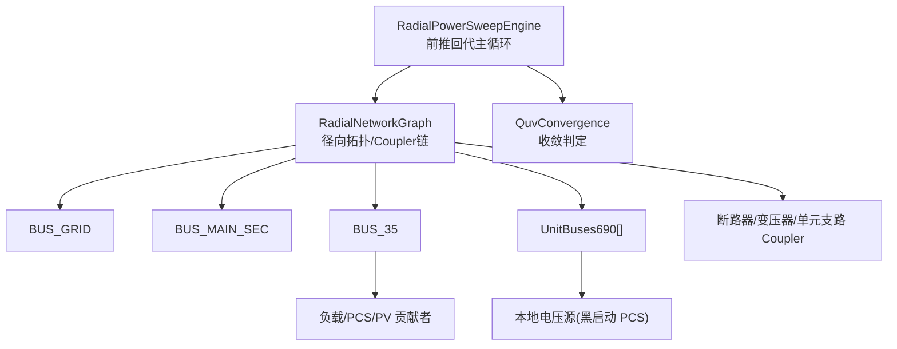
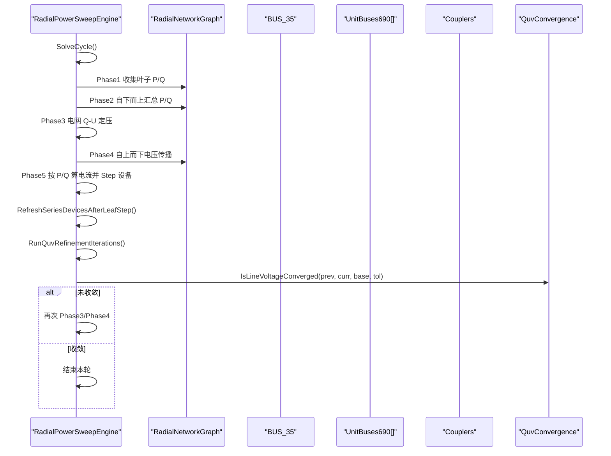
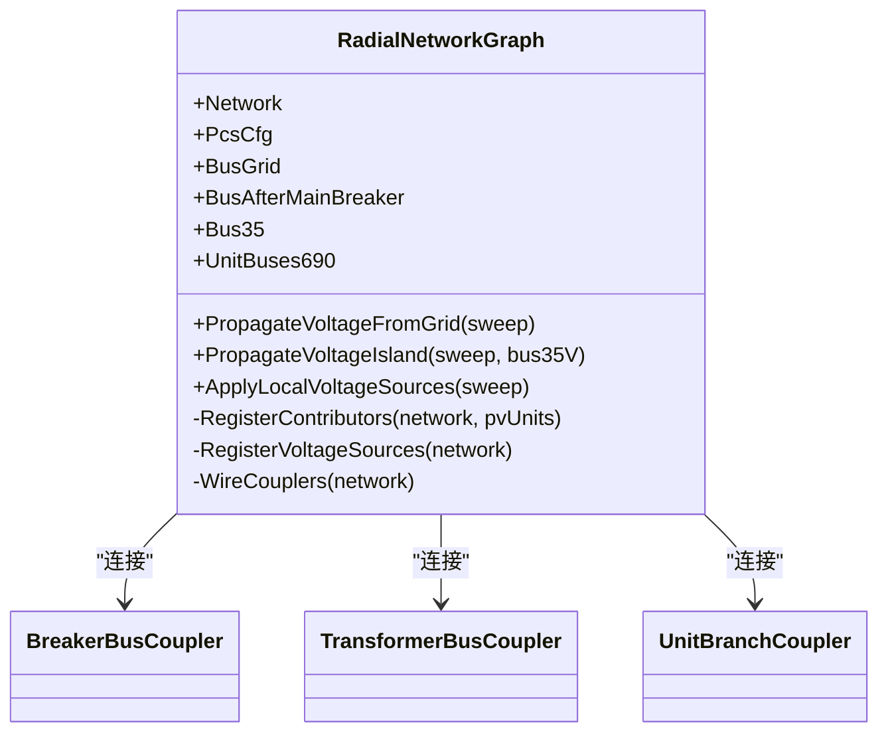
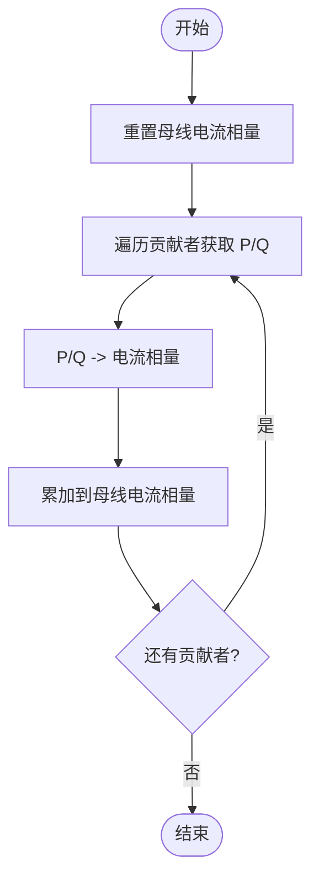
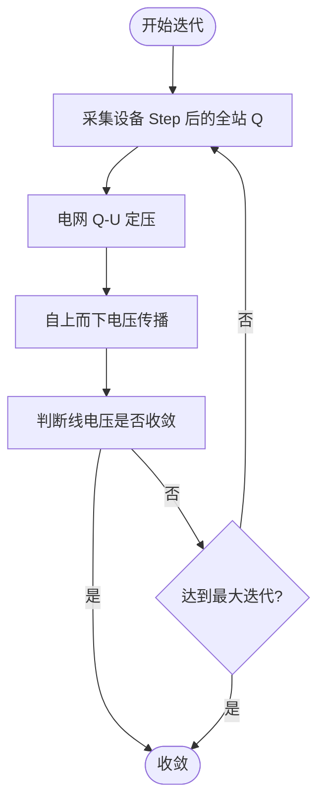
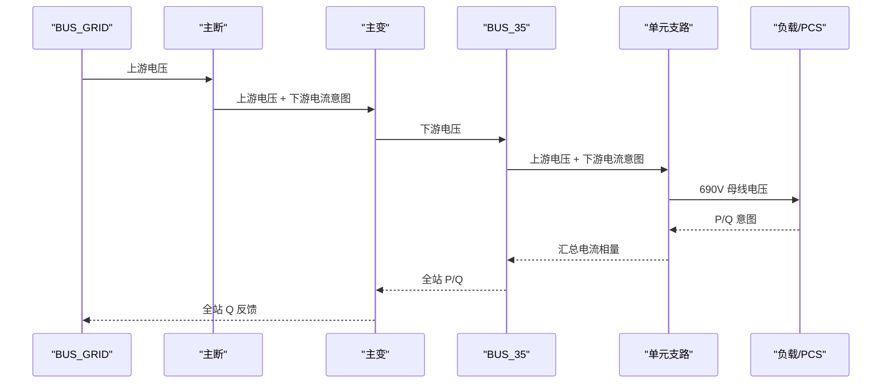
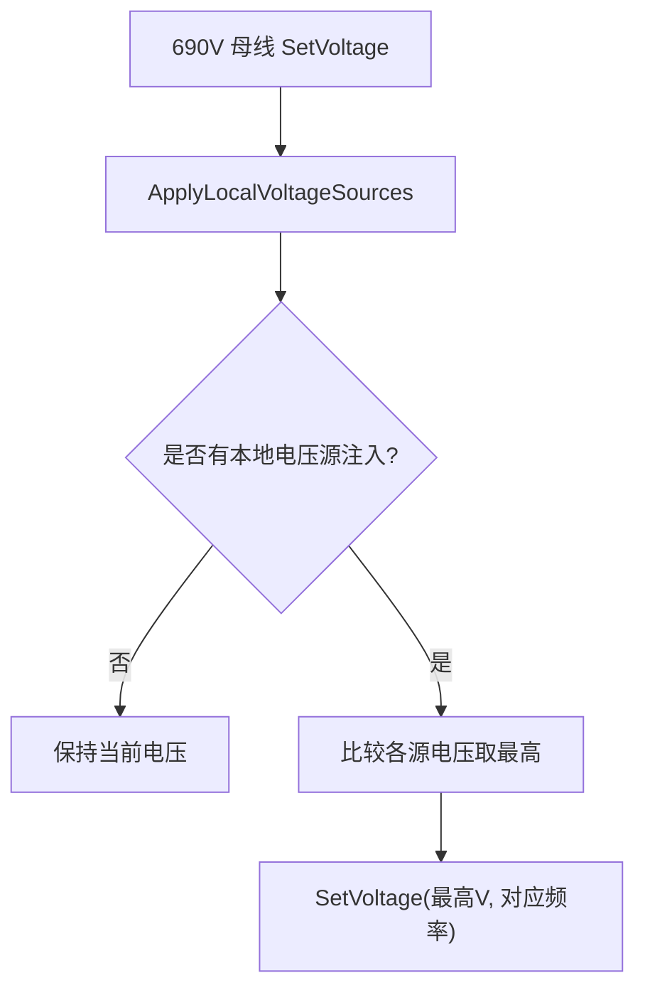
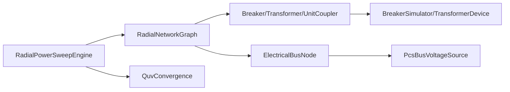

# 功率传播引擎

<cite>
**本文引用的文件**
- [RadialPowerSweepEngine.cs](file://EssDeviceSimModel/Propagation/RadialPowerSweepEngine.cs)
- [RadialNetworkGraph.cs](file://EssDeviceSimModel/Propagation/RadialNetworkGraph.cs)
- [ElectricalBusNode.cs](file://EssDeviceSimModel/Propagation/ElectricalBusNode.cs)
- [BusPowerContributors.cs](file://EssDeviceSimModel/Propagation/BusPowerContributors.cs)
- [QuvConvergence.cs](file://EssDeviceSimModel/Propagation/QuvConvergence.cs)
- [BreakerBusCoupler.cs](file://EssDeviceSimModel/Propagation/BreakerBusCoupler.cs)
- [TransformerBusCoupler.cs](file://EssDeviceSimModel/Propagation/TransformerBusCoupler.cs)
- [UnitBranchCoupler.cs](file://EssDeviceSimModel/Propagation/UnitBranchCoupler.cs)
- [PcsBusVoltageSource.cs](file://EssDeviceSimModel/Propagation/PcsBusVoltageSource.cs)
- [PropagationSweepContext.cs](file://EssDeviceSimModel/Propagation/PropagationSweepContext.cs)
- [ElectricalSignalRouter.cs](file://EssDeviceSimModel/Propagation/ElectricalSignalRouter.cs)
</cite>

## 目录
1. [简介](#简介)
2. [项目结构](#项目结构)
3. [核心组件](#核心组件)
4. [架构总览](#架构总览)
5. [详细组件分析](#详细组件分析)
6. [依赖关系分析](#依赖关系分析)
7. [性能考虑](#性能考虑)
8. [故障诊断指南](#故障诊断指南)
9. [结论](#结论)
10. [附录：使用示例与最佳实践](#附录使用示例与最佳实践)

## 简介
本文件面向储能仿真系统中的“功率传播引擎”，系统性阐述径向网络图构建、母线贡献者管理以及 QUV 收敛算法的实现原理。重点解释功率在电网中的传播路径计算、电压源注入机制和负载分配策略，并给出参数设置、边界条件处理与收敛监控的实践方法。同时对比与传统求解器的差异与适用场景，提供性能调优建议与故障诊断方法。

## 项目结构
功率传播引擎位于 EssDeviceSimModel/Propagation 目录下，围绕“母线节点—耦合器—贡献者—电压源”的解耦设计，配合 RadialPowerSweepEngine 的前推回代流程完成一次完整求解周期。

图表来源
- [RadialPowerSweepEngine.cs:14-75](file://EssDeviceSimModel/Propagation/RadialPowerSweepEngine.cs#L14-L75)
- [RadialNetworkGraph.cs:18-48](file://EssDeviceSimModel/Propagation/RadialNetworkGraph.cs#L18-L48)
- [ElectricalBusNode.cs:16-48](file://EssDeviceSimModel/Propagation/ElectricalBusNode.cs#L16-L48)
- [BusPowerContributors.cs:6-46](file://EssDeviceSimModel/Propagation/BusPowerContributors.cs#L6-L46)
- [PcsBusVoltageSource.cs:7-23](file://EssDeviceSimModel/Propagation/PcsBusVoltageSource.cs#L7-L23)
- [QuvConvergence.cs:6-20](file://EssDeviceSimModel/Propagation/QuvConvergence.cs#L6-L20)

章节来源
- [RadialPowerSweepEngine.cs:14-75](file://EssDeviceSimModel/Propagation/RadialPowerSweepEngine.cs#L14-L75)
- [RadialNetworkGraph.cs:18-48](file://EssDeviceSimModel/Propagation/RadialNetworkGraph.cs#L18-L48)

## 核心组件
- 前推回代引擎：RadialPowerSweepEngine，负责单步求解周期（叶子 P/Q 收集→自下而上汇总→电网 Q-U 定压→自上而下电压传播→设备 Step→Q-U/V 反馈迭代→频率刷新与采样）。
- 径向拓扑：RadialNetworkGraph，从 ElectricalNetwork 构建母线节点、注册贡献者与电压源、连接 Coupler 链。
- 母线节点：ElectricalBusNode，维护电压、频率、电流相量累加、功率意图聚合、本地电压源合并与事件通知。
- 贡献者：LoadBusContributor、PcsBusContributor、PvUnitBusContributor，向母线上报 P/Q 意图。
- 电压源：PcsBusVoltageSource，为 690V 母线提供黑启动 V/f 注入。
- 耦合器：BreakerBusCoupler、TransformerBusCoupler、UnitBranchCoupler，实现上游电压+下游电流意图到下游母线的传递。
- 收敛判定：QuvConvergence，基于线电压变化率判断 Q-U/V 反馈迭代是否收敛。
- 传播上下文：PropagationSweepContext，携带步进、频率、母线参考等全局信息。
- 信号路由：ElectricalSignalRouter，用于端口输出变化的订阅/发布（与传播引擎协同）。

章节来源
- [RadialPowerSweepEngine.cs:14-75](file://EssDeviceSimModel/Propagation/RadialPowerSweepEngine.cs#L14-L75)
- [RadialNetworkGraph.cs:18-48](file://EssDeviceSimModel/Propagation/RadialNetworkGraph.cs#L18-L48)
- [ElectricalBusNode.cs:16-172](file://EssDeviceSimModel/Propagation/ElectricalBusNode.cs#L16-L172)
- [BusPowerContributors.cs:6-46](file://EssDeviceSimModel/Propagation/BusPowerContributors.cs#L6-L46)
- [PcsBusVoltageSource.cs:7-23](file://EssDeviceSimModel/Propagation/PcsBusVoltageSource.cs#L7-L23)
- [BreakerBusCoupler.cs:7-51](file://EssDeviceSimModel/Propagation/BreakerBusCoupler.cs#L7-L51)
- [TransformerBusCoupler.cs:7-56](file://EssDeviceSimModel/Propagation/TransformerBusCoupler.cs#L7-L56)
- [UnitBranchCoupler.cs:7-73](file://EssDeviceSimModel/Propagation/UnitBranchCoupler.cs#L7-L73)
- [QuvConvergence.cs:6-20](file://EssDeviceSimModel/Propagation/QuvConvergence.cs#L6-L20)
- [PropagationSweepContext.cs:6-17](file://EssDeviceSimModel/Propagation/PropagationSweepContext.cs#L6-L17)
- [ElectricalSignalRouter.cs:10-61](file://EssDeviceSimModel/Propagation/ElectricalSignalRouter.cs#L10-L61)

## 架构总览
功率传播引擎采用“前推回代 + Q-U/V 反馈迭代”的混合策略：
- 前推：自下而上汇总各母线 P/Q 意图，得到全站无功；电网侧通过 Q-U 控制确定 220kV 电压。
- 回代：自上而下经断路器、主变、单元支路将电压传播至 690V 母线；在已知电压下由 P/Q 计算电流并驱动设备 Step。
- 反馈：设备 Step 后，采集实际 Q 进行 Q-U/V 反馈，重算电网电压并重新传播，直至收敛。

图表来源
- [RadialPowerSweepEngine.cs:54-75](file://EssDeviceSimModel/Propagation/RadialPowerSweepEngine.cs#L54-L75)
- [RadialPowerSweepEngine.cs:78-133](file://EssDeviceSimModel/Propagation/RadialPowerSweepEngine.cs#L78-L133)
- [RadialPowerSweepEngine.cs:180-203](file://EssDeviceSimModel/Propagation/RadialPowerSweepEngine.cs#L180-L203)
- [QuvConvergence.cs:6-20](file://EssDeviceSimModel/Propagation/QuvConvergence.cs#L6-L20)

## 详细组件分析

### 径向网络图构建（RadialNetworkGraph）
- 构建阶段：创建 BUS_GRID、BUS_MAIN_SEC、BUS_35 与各单元 690V 母线节点；注册负载、PCS、PV 作为功率贡献者；注册 690V 母线的本地电压源；连接断路器、主变、单元支路的 Coupler 链。
- 电压传播入口：PropagateVoltageFromGrid（并网）与 PropagateVoltageIsland（离网/主断分），并在 690V 母线上合并本地电压源。
- 二次电流解析：ResolveStationSecondaryCurrent 根据 35kV 估计电压与全站 P/Q 生成等效电流相量，供 Coupler 使用。

图表来源
- [RadialNetworkGraph.cs:18-48](file://EssDeviceSimModel/Propagation/RadialNetworkGraph.cs#L18-L48)
- [RadialNetworkGraph.cs:59-97](file://EssDeviceSimModel/Propagation/RadialNetworkGraph.cs#L59-L97)
- [RadialNetworkGraph.cs:99-170](file://EssDeviceSimModel/Propagation/RadialNetworkGraph.cs#L99-L170)
- [BreakerBusCoupler.cs:7-51](file://EssDeviceSimModel/Propagation/BreakerBusCoupler.cs#L7-L51)
- [TransformerBusCoupler.cs:7-56](file://EssDeviceSimModel/Propagation/TransformerBusCoupler.cs#L7-L56)
- [UnitBranchCoupler.cs:7-73](file://EssDeviceSimModel/Propagation/UnitBranchCoupler.cs#L7-L73)

章节来源
- [RadialNetworkGraph.cs:18-170](file://EssDeviceSimModel/Propagation/RadialNetworkGraph.cs#L18-L170)

### 母线贡献者管理（ElectricalBusNode + BusPowerContributors）
- 贡献者接口：IBusPowerContributor 定义 ContributorId 与 GetBusPowerContribution(context)。
- 具体贡献者：负载、PCS、光伏单元分别上报其有功/无功。
- 母线聚合：ElectricalBusNode 将各贡献者的 P/Q 转换为电流相量并累加，支持 Reset/AddPower/AddCurrentPhasor/CollectFromContributors。
- 功率转电流：利用 AcQuantityConverter.FromPowerToPhasor 将 P/Q 转为等效电流相量，便于叠加。

图表来源
- [BusPowerContributors.cs:6-46](file://EssDeviceSimModel/Propagation/BusPowerContributors.cs#L6-L46)
- [ElectricalBusNode.cs:118-150](file://EssDeviceSimModel/Propagation/ElectricalBusNode.cs#L118-L150)

章节来源
- [BusPowerContributors.cs:6-46](file://EssDeviceSimModel/Propagation/BusPowerContributors.cs#L6-L46)
- [ElectricalBusNode.cs:16-172](file://EssDeviceSimModel/Propagation/ElectricalBusNode.cs#L16-L172)

### QUV 收敛算法（QuvConvergence + 反馈迭代）
- 收敛判据：以标幺值电压变化率 deltaPu = |Ucurr - Uprev| / Unom 与容差比较；当电压接近零时视为已收敛。
- 反馈迭代：设备 Step 后，采集全站实际无功（负载与所有 PCS），调用电网 Q-U 控制更新 220kV 电压，再重跑电压传播，直到收敛或达到最大迭代次数。

图表来源
- [RadialPowerSweepEngine.cs:180-203](file://EssDeviceSimModel/Propagation/RadialPowerSweepEngine.cs#L180-L203)
- [QuvConvergence.cs:6-20](file://EssDeviceSimModel/Propagation/QuvConvergence.cs#L6-L20)

章节来源
- [RadialPowerSweepEngine.cs:180-203](file://EssDeviceSimModel/Propagation/RadialPowerSweepEngine.cs#L180-L203)
- [QuvConvergence.cs:6-20](file://EssDeviceSimModel/Propagation/QuvConvergence.cs#L6-L20)

### 功率传播路径与负载分配策略
- 传播路径：
  - 并网：BUS_GRID → 主断 → BUS_MAIN_SEC → 主变 → BUS_35 → 单元支路（单元断+单元变）→ 各 690V 母线。
  - 离网/主断分：直接设定 BUS_35 电压并传播至各 690V 母线。
- 负载分配：
  - 在已知母线电压下，由 P/Q 计算电流，驱动负载与 PCS 设备 Step。
  - 串联设备（主变、单元变）在叶子设备 Step 后，用最新下游母线电压重算端口并 Step，确保一致性。
- 边界条件：
  - 主断分闸时，PCC 电压置零，离网估算 35kV 电压并传播。
  - 单元断分闸或跳闸时，对应 690V 母线电压置零。

图表来源
- [BreakerBusCoupler.cs:32-51](file://EssDeviceSimModel/Propagation/BreakerBusCoupler.cs#L32-L51)
- [TransformerBusCoupler.cs:35-56](file://EssDeviceSimModel/Propagation/TransformerBusCoupler.cs#L35-L56)
- [UnitBranchCoupler.cs:36-73](file://EssDeviceSimModel/Propagation/UnitBranchCoupler.cs#L36-L73)
- [RadialPowerSweepEngine.cs:149-177](file://EssDeviceSimModel/Propagation/RadialPowerSweepEngine.cs#L149-L177)
- [RadialPowerSweepEngine.cs:206-249](file://EssDeviceSimModel/Propagation/RadialPowerSweepEngine.cs#L206-L249)

章节来源
- [RadialPowerSweepEngine.cs:112-177](file://EssDeviceSimModel/Propagation/RadialPowerSweepEngine.cs#L112-L177)
- [RadialPowerSweepEngine.cs:206-249](file://EssDeviceSimModel/Propagation/RadialPowerSweepEngine.cs#L206-L249)
- [BreakerBusCoupler.cs:32-51](file://EssDeviceSimModel/Propagation/BreakerBusCoupler.cs#L32-L51)
- [TransformerBusCoupler.cs:35-56](file://EssDeviceSimModel/Propagation/TransformerBusCoupler.cs#L35-L56)
- [UnitBranchCoupler.cs:36-73](file://EssDeviceSimModel/Propagation/UnitBranchCoupler.cs#L36-L73)

### 电压源注入机制（本地 V/f）
- 690V 母线可注册本地电压源（如黑启动 PCS），在 ApplyLocalVoltageSources 中取最高线电压写入母线，并同步频率。
- PcsBusVoltageSource 通过 PCS 的黑启动能力判断是否注入及注入值。

图表来源
- [ElectricalBusNode.cs:63-91](file://EssDeviceSimModel/Propagation/ElectricalBusNode.cs#L63-L91)
- [PcsBusVoltageSource.cs:15-23](file://EssDeviceSimModel/Propagation/PcsBusVoltageSource.cs#L15-L23)

章节来源
- [ElectricalBusNode.cs:63-91](file://EssDeviceSimModel/Propagation/ElectricalBusNode.cs#L63-L91)
- [PcsBusVoltageSource.cs:7-23](file://EssDeviceSimModel/Propagation/PcsBusVoltageSource.cs#L7-L23)

## 依赖关系分析
- 松耦合：母线节点通过事件通知 Coupler，避免强引用；贡献者与电压源通过接口抽象，易于扩展。
- 关键依赖：
  - RadialPowerSweepEngine 依赖 RadialNetworkGraph、ElectricalNetwork、SystemFrequencyResolver。
  - Coupler 依赖 BreakerSimulator、TransformerDevice、PropagationPortBinding。
  - 收敛判定依赖 QuvConvergence。
- 潜在环路与顺序：
  - 前推回代顺序严格：先汇总 P/Q，再电网 Q-U 定压，再自上而下传播，最后设备 Step 与反馈迭代，避免循环依赖导致的数值不稳定。

图表来源
- [RadialPowerSweepEngine.cs:14-75](file://EssDeviceSimModel/Propagation/RadialPowerSweepEngine.cs#L14-L75)
- [RadialNetworkGraph.cs:18-48](file://EssDeviceSimModel/Propagation/RadialNetworkGraph.cs#L18-L48)
- [BreakerBusCoupler.cs:7-51](file://EssDeviceSimModel/Propagation/BreakerBusCoupler.cs#L7-L51)
- [TransformerBusCoupler.cs:7-56](file://EssDeviceSimModel/Propagation/TransformerBusCoupler.cs#L7-L56)
- [UnitBranchCoupler.cs:7-73](file://EssDeviceSimModel/Propagation/UnitBranchCoupler.cs#L7-L73)
- [ElectricalBusNode.cs:16-172](file://EssDeviceSimModel/Propagation/ElectricalBusNode.cs#L16-L172)
- [PcsBusVoltageSource.cs:7-23](file://EssDeviceSimModel/Propagation/PcsBusVoltageSource.cs#L7-L23)

章节来源
- [RadialPowerSweepEngine.cs:14-75](file://EssDeviceSimModel/Propagation/RadialPowerSweepEngine.cs#L14-L75)
- [RadialNetworkGraph.cs:18-170](file://EssDeviceSimModel/Propagation/RadialNetworkGraph.cs#L18-L170)

## 性能考虑
- 迭代次数与容差：
  - propagationQuvMaxIterations 控制 Q-U/V 反馈迭代轮数；propagationVoltageTolerancePu 控制收敛容差。合理设置可平衡精度与耗时。
- 短路路径优化：
  - 主断分闸时直接进入离网估算与传播分支，避免不必要的电网侧计算。
- 电流相量累加：
  - 通过电流相量叠加减少多次功率转换开销，提升汇总效率。
- 设备 Step 顺序：
  - 先叶子设备 Step，再刷新串联设备端口，降低重复计算。
- 频率刷新：
  - SystemFrequencyResolver.Refresh 在关键步骤刷新系统频率，保证后续计算的准确性。

[本节为通用指导，不直接分析具体文件]

## 故障诊断指南
- 收敛失败：
  - 检查 propagationQuvMaxIterations 是否过小；增大容差或迭代次数。
  - 确认电网 Q-U 控制输入是否正确（全站 Q 汇总是否包含所有 PCS）。
- 电压异常：
  - 主断分闸时，确认离网估算逻辑是否返回有效 35kV 电压。
  - 单元断分闸或跳闸时，对应 690V 母线应被置零，检查开关状态。
- 设备无响应：
  - 检查 PCS 是否收到正确的 690V 电压输入；确认 gridAvailable 标志。
  - 验证贡献者 P/Q 是否为预期值（负载调度、PCS 控制策略）。
- 日志定位：
  - 关注引擎就绪日志、贡献者数量统计、耦合器动作日志，快速定位问题环节。

章节来源
- [RadialPowerSweepEngine.cs:45-47](file://EssDeviceSimModel/Propagation/RadialPowerSweepEngine.cs#L45-L47)
- [RadialNetworkGraph.cs:46-48](file://EssDeviceSimModel/Propagation/RadialNetworkGraph.cs#L46-L48)
- [RadialPowerSweepEngine.cs:180-203](file://EssDeviceSimModel/Propagation/RadialPowerSweepEngine.cs#L180-L203)
- [RadialPowerSweepEngine.cs:340-359](file://EssDeviceSimModel/Propagation/RadialPowerSweepEngine.cs#L340-L359)

## 结论
功率传播引擎通过“前推回代 + Q-U/V 反馈迭代”的组合，实现了高效、可扩展的径向电网潮流计算。其模块化设计（母线节点、贡献者、电压源、耦合器）使得拓扑扩展与设备接入更加灵活。相比传统求解器，该方案更贴合储能电站的层级结构与运行模式，适合大规模、实时性要求高的仿真场景。

[本节为总结性内容，不直接分析具体文件]

## 附录：使用示例与最佳实践
- 设置传播参数：
  - 在构造 RadialPowerSweepEngine 时配置 propagationQuvMaxIterations 与 propagationVoltageTolerancePu，以匹配系统动态与精度需求。
- 处理边界条件：
  - 主断分闸时，引擎自动进入离网模式并估算 35kV 电压；单元断分闸时，对应 690V 母线电压置零。
- 监控收敛状态：
  - 通过 IsLineVoltageConverged 返回值判断每轮迭代是否收敛；结合日志观察电压变化趋势。
- 与传统求解器的区别与适用场景：
  - 传统求解器多基于全量矩阵求解，适用于复杂环网；本引擎针对径向网络与前推回代特性，具备更高效率与更好的实时性，适合储能电站的层级化、模块化仿真。
- 性能调优建议：
  - 合理设置迭代次数与容差；减少不必要的设备 Step；充分利用电流相量累加以降低转换开销。
- 故障诊断方法：
  - 检查开关状态、贡献者 P/Q、本地电压源注入；关注引擎与耦合器日志，定位异常环节。

章节来源
- [RadialPowerSweepEngine.cs:27-47](file://EssDeviceSimModel/Propagation/RadialPowerSweepEngine.cs#L27-L47)
- [RadialPowerSweepEngine.cs:180-203](file://EssDeviceSimModel/Propagation/RadialPowerSweepEngine.cs#L180-L203)
- [RadialPowerSweepEngine.cs:340-359](file://EssDeviceSimModel/Propagation/RadialPowerSweepEngine.cs#L340-L359)
- [QuvConvergence.cs:6-20](file://EssDeviceSimModel/Propagation/QuvConvergence.cs#L6-L20)