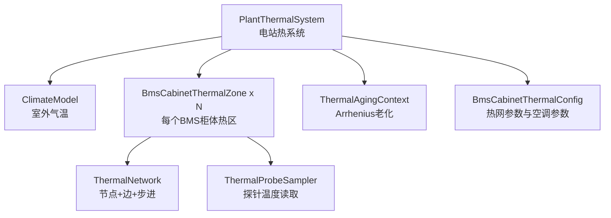
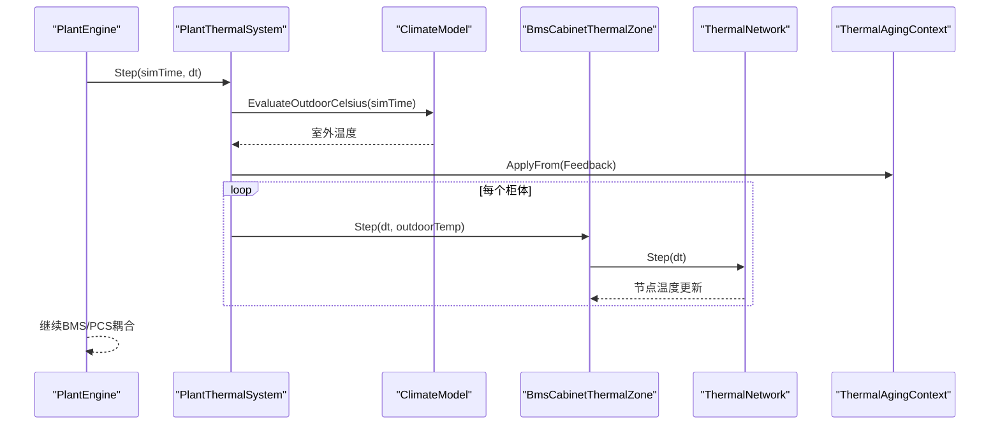
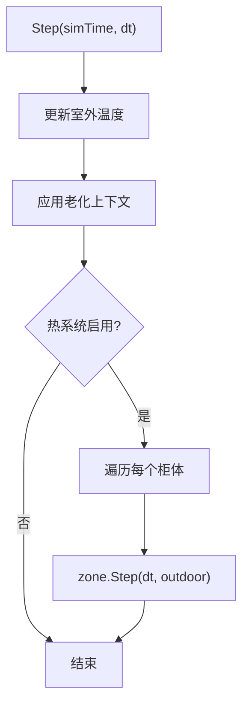
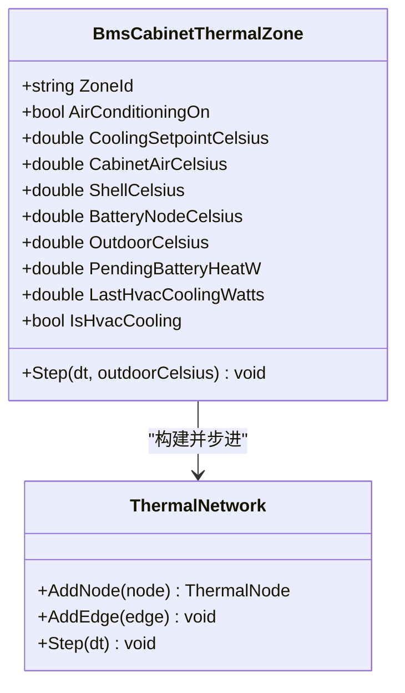
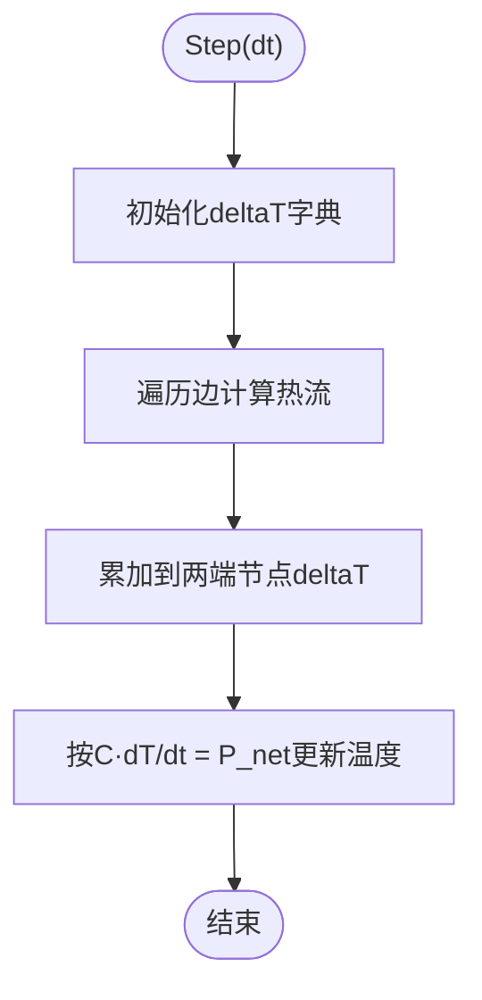
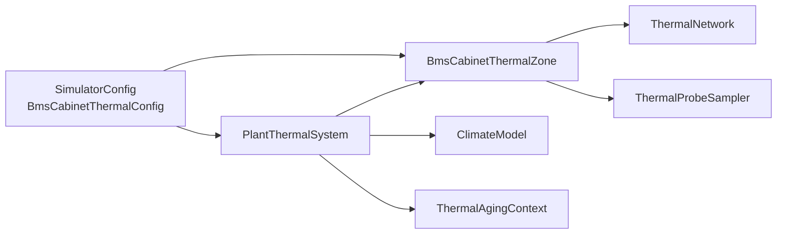

# 热力学仿真系统

<cite>
**本文引用的文件**
- [ClimateModel.cs](file://EssDeviceSimModel/Thermal/ClimateModel.cs)
- [PlantThermalSystem.cs](file://EssDeviceSimModel/Thermal/PlantThermalSystem.cs)
- [ThermalNetwork.cs](file://EssDeviceSimModel/Thermal/ThermalNetwork.cs)
- [BmsCabinetThermalZone.cs](file://EssDeviceSimModel/Thermal/BmsCabinetThermalZone.cs)
- [ThermalProbeSampler.cs](file://EssDeviceSimModel/Thermal/ThermalProbeSampler.cs)
- [ThermalAgingContext.cs](file://EssDeviceSimModel/Thermal/ThermalAgingContext.cs)
- [SimulatorConfig.cs](file://Configuration/SimulatorConfig.cs)
- [ThermalPhase2Tests.cs](file://EssSimulator.Tests/Thermal/ThermalPhase2Tests.cs)
- [ThermalPhase5Tests.cs](file://EssSimulator.Tests/Thermal/ThermalPhase5Tests.cs)
</cite>

## 目录
1. [简介](#简介)
2. [项目结构](#项目结构)
3. [核心组件](#核心组件)
4. [架构总览](#架构总览)
5. [详细组件分析](#详细组件分析)
6. [依赖关系分析](#依赖关系分析)
7. [性能与数值特性](#性能与数值特性)
8. [故障排查指南](#故障排查指南)
9. [结论](#结论)
10. [附录：配置与使用示例](#附录：配置与使用示例)

## 简介
本系统提供储能电站的热力学仿真能力，覆盖室外气候模型、柜体集总参数热网络、空调闭环控制、探针温度采样以及电芯日历老化反馈。通过“热-电耦合”接口，将电池堆的欧姆损耗作为热源注入热网络，驱动温度场演化；同时为上层 BMS/PCS 提供环境温度和探针读数，形成闭环控制与保护。

## 项目结构
热力学相关代码集中在 EssDeviceSimModel/Thermal 与 Configuration 中，测试用例位于 EssSimulator.Tests/Thermal。关键模块职责如下：
- 气候模型：计算室外气温（固定或正弦日变化）
- 电站热系统：管理多个柜体热区、推进步进、暴露空调控制接口
- 热网络：集总参数节点与边，显式欧拉积分求解温度场
- 柜体热区：定义外壳、空气、电池等节点及空调控制逻辑
- 探针采样：从热网络节点读取混合温度并叠加偏置
- 老化上下文：基于 Arrhenius 公式的温度相关老化倍率

图表来源
- [PlantThermalSystem.cs:1-143](file://EssDeviceSimModel/Thermal/PlantThermalSystem.cs#L1-L143)
- [ClimateModel.cs:1-37](file://EssDeviceSimModel/Thermal/ClimateModel.cs#L1-L37)
- [BmsCabinetThermalZone.cs:1-108](file://EssDeviceSimModel/Thermal/BmsCabinetThermalZone.cs#L1-L108)
- [ThermalNetwork.cs:1-116](file://EssDeviceSimModel/Thermal/ThermalNetwork.cs#L1-L116)
- [ThermalProbeSampler.cs:1-53](file://EssDeviceSimModel/Thermal/ThermalProbeSampler.cs#L1-L53)
- [ThermalAgingContext.cs:1-38](file://EssDeviceSimModel/Thermal/ThermalAgingContext.cs#L1-L38)
- [SimulatorConfig.cs:105-135](file://Configuration/SimulatorConfig.cs#L105-L135)

章节来源
- [PlantThermalSystem.cs:1-143](file://EssDeviceSimModel/Thermal/PlantThermalSystem.cs#L1-L143)
- [SimulatorConfig.cs:105-135](file://Configuration/SimulatorConfig.cs#L105-L135)

## 核心组件
- 室外气温模型：支持固定温度或按小时正弦日变化，峰值小时可调
- 电站热系统：初始化各柜体热区，每步更新室外温度、老化上下文，并步进所有柜体
- 柜体热区：四节点热网络（室外边界、外壳、柜内空气、电池等效），含回差+比例控制的空调
- 热网络：显式欧拉积分，节点热容、边热导，边界节点不参与积分
- 探针采样：根据位置选择不同节点或混合权重，叠加传感器偏置
- 老化上下文：按温度计算 Arrhenius 倍率，供电池寿命模型使用

章节来源
- [ClimateModel.cs:1-37](file://EssDeviceSimModel/Thermal/ClimateModel.cs#L1-L37)
- [PlantThermalSystem.cs:1-143](file://EssDeviceSimModel/Thermal/PlantThermalSystem.cs#L1-L143)
- [BmsCabinetThermalZone.cs:1-108](file://EssDeviceSimModel/Thermal/BmsCabinetThermalZone.cs#L1-L108)
- [ThermalNetwork.cs:1-116](file://EssDeviceSimModel/Thermal/ThermalNetwork.cs#L1-L116)
- [ThermalProbeSampler.cs:1-53](file://EssDeviceSimModel/Thermal/ThermalProbeSampler.cs#L1-L53)
- [ThermalAgingContext.cs:1-38](file://EssDeviceSimModel/Thermal/ThermalAgingContext.cs#L1-L38)

## 架构总览
热-电耦合流程：电气步完成后，由 PlantEngine 调用 PlantThermalSystem.Step 推进热仿真；BMS/PCS 在后续步骤中读取环境温度与探针值，形成闭环。

图表来源
- [PlantThermalSystem.cs:58-69](file://EssDeviceSimModel/Thermal/PlantThermalSystem.cs#L58-L69)
- [ClimateModel.cs:17-34](file://EssDeviceSimModel/Thermal/ClimateModel.cs#L17-L34)
- [BmsCabinetThermalZone.cs:62-71](file://EssDeviceSimModel/Thermal/BmsCabinetThermalZone.cs#L62-L71)
- [ThermalNetwork.cs:76-113](file://EssDeviceSimModel/Thermal/ThermalNetwork.cs#L76-L113)
- [ThermalAgingContext.cs:13-25](file://EssDeviceSimModel/Thermal/ThermalAgingContext.cs#L13-L25)

## 详细组件分析

### 室外气温模型（ClimateModel）
- 功能：根据配置返回当前时刻的室外温度；若设置固定温度则忽略时间；否则以正弦曲线模拟日变化，峰值小时可配置
- 复杂度：O(1)
- 关键点：最小/最大温度自动归一化；相位以峰值小时对齐

章节来源
- [ClimateModel.cs:1-37](file://EssDeviceSimModel/Thermal/ClimateModel.cs#L1-L37)
- [SimulatorConfig.cs:92-103](file://Configuration/SimulatorConfig.cs#L92-L103)

### 电站热系统（PlantThermalSystem）
- 功能：维护气候模型与若干柜体热区；每步更新室外温度、老化上下文，步进所有柜体；提供空调开关与设定点运行时修改；估算电池堆欧姆损耗并登记到对应柜体
- 数据流：RecordBatteryHeatFromRack → RecordCabinetHeatWatts → 下一热步注入电池节点
- 输出：GetBmsAmbientCelsius 用于 BMS 散热环境；HvacEnabled 指示空调是否可用

图表来源
- [PlantThermalSystem.cs:58-69](file://EssDeviceSimModel/Thermal/PlantThermalSystem.cs#L58-L69)
- [PlantThermalSystem.cs:96-112](file://EssDeviceSimModel/Thermal/PlantThermalSystem.cs#L96-L112)
- [PlantThermalSystem.cs:117-140](file://EssDeviceSimModel/Thermal/PlantThermalSystem.cs#L117-L140)

章节来源
- [PlantThermalSystem.cs:1-143](file://EssDeviceSimModel/Thermal/PlantThermalSystem.cs#L1-L143)

### 柜体热区（BmsCabinetThermalZone）
- 拓扑：四个节点（室外边界、外壳、柜内空气、电池等效），三组热阻边连接
- 控制：空调采用回差+比例控制，从空气节点抽热；状态机避免频繁启停
- 输入：PendingBatteryHeatW 上一步登记的电池热功率，本步注入电池节点
- 输出：CabinetAirCelsius、ShellCelsius、BatteryNodeCelsius、IsHvacCooling

图表来源
- [BmsCabinetThermalZone.cs:1-108](file://EssDeviceSimModel/Thermal/BmsCabinetThermalZone.cs#L1-L108)
- [ThermalNetwork.cs:1-116](file://EssDeviceSimModel/Thermal/ThermalNetwork.cs#L1-L116)

章节来源
- [BmsCabinetThermalZone.cs:1-108](file://EssDeviceSimModel/Thermal/BmsCabinetThermalZone.cs#L1-L108)

### 热网络（ThermalNetwork）
- 数据结构：节点包含热容、温度、是否边界、注入热功率；边为两节点间热导（热阻倒数）
- 步进算法：显式欧拉法，先累计边热流，再按节点热容更新温度；边界节点不参与积分
- 稳定性：dt 下限保护；热流方向由温差决定

图表来源
- [ThermalNetwork.cs:76-113](file://EssDeviceSimModel/Thermal/ThermalNetwork.cs#L76-L113)

章节来源
- [ThermalNetwork.cs:1-116](file://EssDeviceSimModel/Thermal/ThermalNetwork.cs#L1-L116)

### 探针采样（ThermalProbeSampler）
- 功能：根据探针类型从热网络节点读取温度，支持顶部/底部空气、盘管、冷凝器等混合位置，并可叠加偏置
- 用途：模拟传感器安装位置误差与实际测量值

章节来源
- [ThermalProbeSampler.cs:1-53](file://EssDeviceSimModel/Thermal/ThermalProbeSampler.cs#L1-L53)
- [SimulatorConfig.cs:79-90](file://Configuration/SimulatorConfig.cs#L79-L90)

### 老化上下文（ThermalAgingContext）
- 功能：每步从反馈配置加载老化参数；提供 Arrhenius 倍率函数，随温度升高加速老化
- 集成点：PlantThermalSystem.Step 中调用 ApplyFrom，使电池模型获取最新老化因子

章节来源
- [ThermalAgingContext.cs:1-38](file://EssDeviceSimModel/Thermal/ThermalAgingContext.cs#L1-L38)
- [PlantThermalSystem.cs:58-69](file://EssDeviceSimModel/Thermal/PlantThermalSystem.cs#L58-L69)

## 依赖关系分析
- PlantThermalSystem 依赖 ClimateModel、BmsCabinetThermalZone、ThermalAgingContext 与配置类
- BmsCabinetThermalZone 依赖 ThermalNetwork 与 BmsCabinetThermalConfig
- ThermalNetwork 仅依赖基本集合与数值运算，无外部耦合
- 探针采样依赖柜体热区暴露的温度属性

图表来源
- [PlantThermalSystem.cs:1-143](file://EssDeviceSimModel/Thermal/PlantThermalSystem.cs#L1-L143)
- [BmsCabinetThermalZone.cs:1-108](file://EssDeviceSimModel/Thermal/BmsCabinetThermalZone.cs#L1-L108)
- [ThermalNetwork.cs:1-116](file://EssDeviceSimModel/Thermal/ThermalNetwork.cs#L1-L116)
- [SimulatorConfig.cs:105-135](file://Configuration/SimulatorConfig.cs#L105-L135)

章节来源
- [PlantThermalSystem.cs:1-143](file://EssDeviceSimModel/Thermal/PlantThermalSystem.cs#L1-L143)
- [BmsCabinetThermalZone.cs:1-108](file://EssDeviceSimModel/Thermal/BmsCabinetThermalZone.cs#L1-L108)
- [ThermalNetwork.cs:1-116](file://EssDeviceSimModel/Thermal/ThermalNetwork.cs#L1-L116)
- [SimulatorConfig.cs:105-135](file://Configuration/SimulatorConfig.cs#L105-L135)

## 性能与数值特性
- 步进复杂度：热网络步进 O(N+E)，N 为节点数，E 为边数；单柜通常常数规模
- 数值稳定性：显式欧拉法对 dt 敏感；建议保持合理步长，避免过大导致振荡
- 空调控制：回差+比例控制避免高频切换；增益与额定功率限制确保物理可行
- 热容与热阻：合理设置热容与热阻可反映真实热惯性；校准方法见附录

[本节为通用指导，不直接分析具体文件]

## 故障排查指南
- 温度不升或不降
  - 检查电池热注入是否正确登记（PendingBatteryHeatW）
  - 确认热阻与热容参数是否合理
  - 验证空调是否开启且设定点有效
- 空调频繁启停
  - 增大回差 HvacHysteresisCelsius
  - 降低比例增益 HvacProportionalGainWPerK
- 探针读数异常
  - 检查探针类型与混合权重
  - 调整传感器偏置 ThermalProbeBiasesConfig
- 老化结果不符合预期
  - 确认 ThermalFeedbackConfig 已正确加载
  - 检查参考温度与 Arrhenius B 参数

章节来源
- [ThermalPhase2Tests.cs:71-96](file://EssSimulator.Tests/Thermal/ThermalPhase2Tests.cs#L71-L96)
- [ThermalPhase5Tests.cs:7-36](file://EssSimulator.Tests/Thermal/ThermalPhase5Tests.cs#L7-L36)
- [ThermalPhase5Tests.cs:82-97](file://EssSimulator.Tests/Thermal/ThermalPhase5Tests.cs#L82-L97)

## 结论
该热力学仿真系统以集总参数热网络为核心，结合室外气候模型与空调闭环控制，实现了电站级温度场演化与热-电耦合。通过探针采样与老化上下文，为 BMS/PCS 提供贴近实际的运行环境与寿命影响评估。系统结构清晰、扩展性强，适合工程调试与策略优化。

[本节为总结性内容，不直接分析具体文件]

## 附录：配置与使用示例

### 设置热参数（BmsCabinetThermalConfig）
- 热容：空气、外壳、电池热容分别设置，反映热惯性
- 热阻：室外→外壳、外壳→空气、电池→空气热阻，决定传热速率
- 空调：制冷功率、设定点、回差、比例增益
- 探针偏置：各测点相对混合温度的固定偏置

章节来源
- [SimulatorConfig.cs:105-135](file://Configuration/SimulatorConfig.cs#L105-L135)
- [SimulatorConfig.cs:79-90](file://Configuration/SimulatorConfig.cs#L79-L90)

### 配置冷却策略（空调控制）
- 启用空调：设置 HvacEnabled 与 HvacCoolingPowerW > 0
- 设定目标温度：HvacSetpointCelsius
- 调节回差与增益：HvacHysteresisCelsius、HvacProportionalGainWPerK
- 运行时控制：通过 PlantThermalSystem.SetHvacEnabled/SetHvacSetpointCelsius/SetCabinetAirConditioningOn/SetCabinetCoolingSetpointC

章节来源
- [PlantThermalSystem.cs:73-94](file://EssDeviceSimModel/Thermal/PlantThermalSystem.cs#L73-L94)
- [BmsCabinetThermalZone.cs:73-105](file://EssDeviceSimModel/Thermal/BmsCabinetThermalZone.cs#L73-L105)

### 监控温度状态
- 读取柜内空气温度：CabinetAirCelsius
- 读取外壳与电池节点温度：ShellCelsius、BatteryNodeCelsius
- 读取探针温度：使用 ThermalProbeSampler.ReadCelsius，指定探针类型与偏置
- 判断空调状态：IsHvacCooling、LastHvacCoolingWatts

章节来源
- [BmsCabinetThermalZone.cs:42-60](file://EssDeviceSimModel/Thermal/BmsCabinetThermalZone.cs#L42-L60)
- [ThermalProbeSampler.cs:24-50](file://EssDeviceSimModel/Thermal/ThermalProbeSampler.cs#L24-L50)

### 热-电耦合与设备发热建模
- 电气步后登记电池热：PlantThermalSystem.RecordBatteryHeatFromRack 或 RecordCabinetHeatWatts
- 堆级欧姆损耗估算：EstimateRackOhmicLossWatts，考虑串并联路径与附加内阻
- 下一热步注入：PendingBatteryHeatW 在 zone.Step 中注入电池节点

章节来源
- [PlantThermalSystem.cs:96-140](file://EssDeviceSimModel/Thermal/PlantThermalSystem.cs#L96-L140)
- [BmsCabinetThermalZone.cs:62-71](file://EssDeviceSimModel/Thermal/BmsCabinetThermalZone.cs#L62-L71)

### 环境温度影响
- 室外气温：ClimateModel.EvaluateOutdoorCelsius，支持固定或正弦日变化
- 环境反馈：PlantThermalSystem.GetBmsAmbientCelsius 返回 BMS 散热环境温
- 探针与环境：ThermalProbeSampler 支持冷凝侧等偏室外探针

章节来源
- [ClimateModel.cs:17-34](file://EssDeviceSimModel/Thermal/ClimateModel.cs#L17-L34)
- [PlantThermalSystem.cs:44-56](file://EssDeviceSimModel/Thermal/PlantThermalSystem.cs#L44-L56)
- [ThermalProbeSampler.cs:36-46](file://EssDeviceSimModel/Thermal/ThermalProbeSampler.cs#L36-L46)

### 热仿真精度校准方法
- 校准目标：使柜内空气、外壳、电池节点温度与实测一致
- 步骤：
  - 记录稳态工况下的温度分布与空调功耗
  - 调整热容与热阻，使时间常数与稳态值匹配
  - 校验探针偏置，修正传感器安装误差
  - 验证空调回差与增益，避免过冲或振荡
- 参考测试：无空调时温度上升、有空调时稳定在设定点附近

章节来源
- [ThermalPhase2Tests.cs:71-96](file://EssSimulator.Tests/Thermal/ThermalPhase2Tests.cs#L71-L96)
- [ThermalPhase5Tests.cs:7-36](file://EssSimulator.Tests/Thermal/ThermalPhase5Tests.cs#L7-L36)

### 散热优化建议
- 降低热阻：改善外壳与空气对流、提高电池到空气传热
- 提升热容：增加缓冲能力，减缓温度波动
- 优化空调：提高制冷功率、合理设置设定点与回差
- 控制策略：根据负载预测提前降温，避免峰值时段高温

[本节为通用指导，不直接分析具体文件]