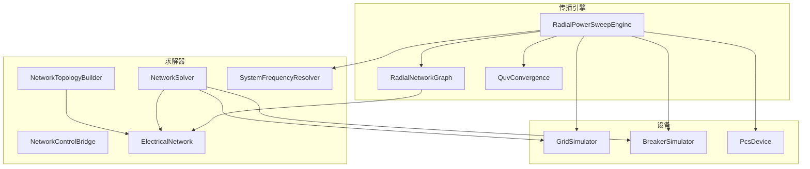
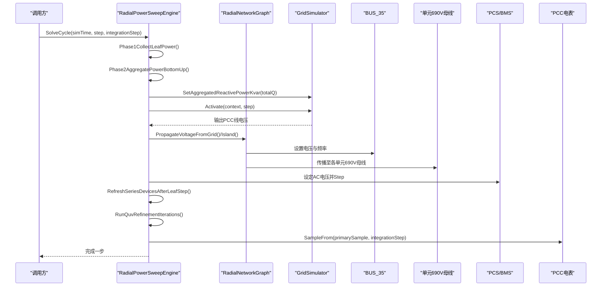
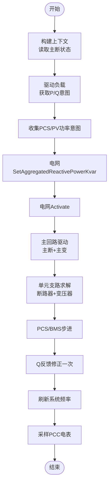
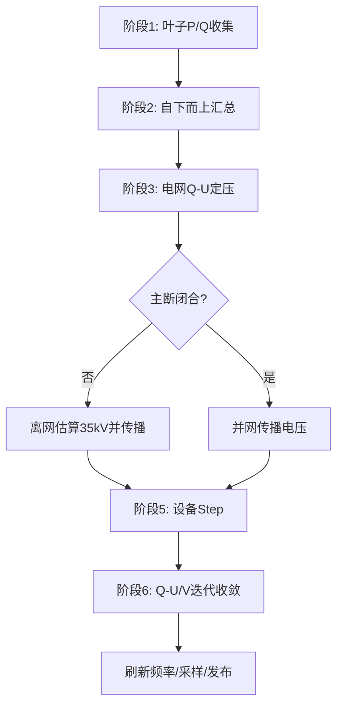
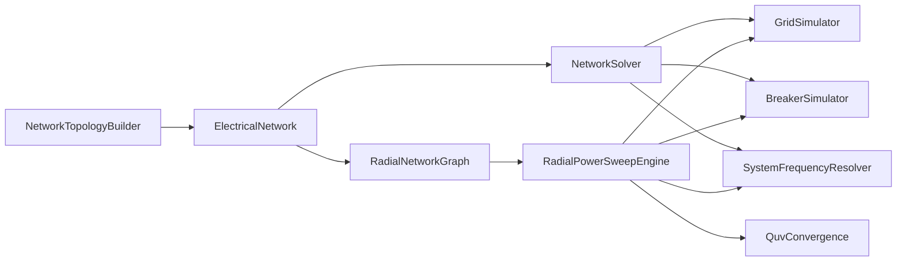
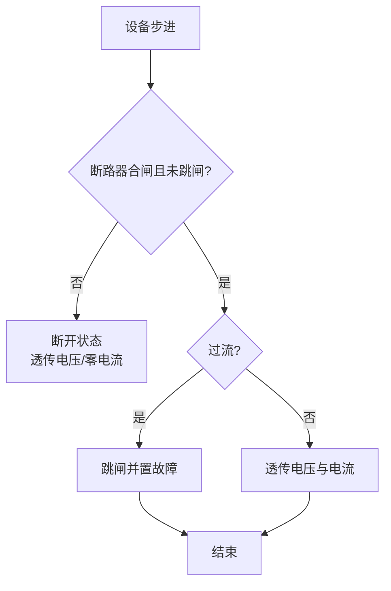

# 电气网络求解器

<cite>
**本文引用的文件**
- [NetworkSolver.cs](file://EssDeviceSimModel/Solver/NetworkSolver.cs)
- [ElectricalNetwork.cs](file://EssDeviceSimModel/Solver/ElectricalNetwork.cs)
- [SystemFrequencyResolver.cs](file://EssDeviceSimModel/Solver/SystemFrequencyResolver.cs)
- [NetworkTopologyBuilder.cs](file://EssDeviceSimModel/Solver/NetworkTopologyBuilder.cs)
- [RadialPowerSweepEngine.cs](file://EssDeviceSimModel/Propagation/RadialPowerSweepEngine.cs)
- [RadialNetworkGraph.cs](file://EssDeviceSimModel/Propagation/RadialNetworkGraph.cs)
- [QuvConvergence.cs](file://EssDeviceSimModel/Propagation/QuvConvergence.cs)
- [NetworkControlBridge.cs](file://EssDeviceSimModel/Solver/NetworkControlBridge.cs)
- [BreakerSimulator.cs](file://EssDeviceSimModel/Devices/BreakerSimulator.cs)
- [GridSimulator.cs](file://EssDeviceSimModel/Devices/GridSimulator.cs)
- [INetworkSolver.cs](file://EssDeviceSimModel/Interface/INetworkSolver.cs)
- [PcsDevice.Core.cs](file://EssDeviceSimModel/Devices/PcsDevice.Core.cs)
</cite>

## 目录
1. [简介](#简介)
2. [项目结构](#项目结构)
3. [核心组件](#核心组件)
4. [架构总览](#架构总览)
5. [详细组件分析](#详细组件分析)
6. [依赖关系分析](#依赖关系分析)
7. [性能与收敛性](#性能与收敛性)
8. [故障分析与保护](#故障分析与保护)
9. [使用示例与配置](#使用示例与配置)
10. [调试与排障指南](#调试与排障指南)
11. [结论](#结论)

## 简介
本文件面向储能仿真系统中的“电气网络求解器”，系统性说明其潮流计算实现、电压源传播机制、频率解析、故障分析与求解策略选择。系统提供两类求解路径：
- 传统顺序步进求解（NetworkSolver）：按设备顺序驱动，适合简单拓扑或快速仿真。
- 径向前推回代求解（RadialPowerSweepEngine）：自下而上汇总 P/Q，自上而下传播电压，并基于 Q-U/V 反馈迭代至收敛，适合多单元、多支路的辐射状网络。

此外，系统通过 SystemFrequencyResolver 在每步确定系统唯一频率；通过 GridSimulator 实现电网 Q-U 定压；通过 BreakerSimulator 实现过流跳闸等保护逻辑；并通过 NetworkTopologyBuilder 构建运行时拓扑与总线集合。

## 项目结构
求解器位于 EssDeviceSimModel 的 Solver 与 Propagation 两个子模块中：
- Solver：负责网络容器、拓扑构建、顺序步进求解、频率解析与控制桥接。
- Propagation：负责径向网络的图模型、电压传播、Q-U/V 收敛判定与迭代。

图表来源
- [NetworkTopologyBuilder.cs:10-109](file://EssDeviceSimModel/Solver/NetworkTopologyBuilder.cs#L10-L109)
- [RadialPowerSweepEngine.cs:54-75](file://EssDeviceSimModel/Propagation/RadialPowerSweepEngine.cs#L54-L75)
- [RadialNetworkGraph.cs:18-48](file://EssDeviceSimModel/Propagation/RadialNetworkGraph.cs#L18-L48)
- [GridSimulator.cs:49-71](file://EssDeviceSimModel/Devices/GridSimulator.cs#L49-L71)
- [BreakerSimulator.cs:46-98](file://EssDeviceSimModel/Devices/BreakerSimulator.cs#L46-L98)

章节来源
- [NetworkTopologyBuilder.cs:10-109](file://EssDeviceSimModel/Solver/NetworkTopologyBuilder.cs#L10-L109)
- [RadialPowerSweepEngine.cs:54-75](file://EssDeviceSimModel/Propagation/RadialPowerSweepEngine.cs#L54-L75)

## 核心组件
- ElectricalNetwork：运行时容器，持有电网、主断、主变、负载、电表、各单元断路器/变压器、PCS/BMS、直流链路及总线拓扑。
- NetworkTopologyBuilder：根据配置构建 ElectricalNetwork 及其拓扑（BUS_GRID、BUS_35、BUS_690_Ux 等）。
- NetworkSolver：顺序步进求解器，按 S1~S8 步骤驱动负载、电网、主回路、单元支路与 PCS/BMS，并采样电表。
- RadialPowerSweepEngine：径向前推回代求解器，执行叶子 P/Q 收集、自下而上汇总、电网 Q-U 定压、自上而下电压传播、设备 Step、Q-U/V 反馈迭代、频率刷新与采样。
- RadialNetworkGraph：从 ElectricalNetwork 构建母线节点、贡献者注册、电压源注册与 Coupler 链连接。
- SystemFrequencyResolver：每步确定系统频率（并网取电网额定频率，离网取构网 PCS 最高电压对应频率）。
- GridSimulator：电网设备，依据全站无功进行 Q-U 定压输出。
- BreakerSimulator：断路器模拟，含过流跳闸与状态切换。
- QuvConvergence：Q-U/V 迭代收敛判断（以标幺值容差为准）。

章节来源
- [ElectricalNetwork.cs:10-34](file://EssDeviceSimModel/Solver/ElectricalNetwork.cs#L10-L34)
- [NetworkTopologyBuilder.cs:10-109](file://EssDeviceSimModel/Solver/NetworkTopologyBuilder.cs#L10-L109)
- [NetworkSolver.cs:27-107](file://EssDeviceSimModel/Solver/NetworkSolver.cs#L27-L107)
- [RadialPowerSweepEngine.cs:54-75](file://EssDeviceSimModel/Propagation/RadialPowerSweepEngine.cs#L54-L75)
- [RadialNetworkGraph.cs:18-48](file://EssDeviceSimModel/Propagation/RadialNetworkGraph.cs#L18-L48)
- [SystemFrequencyResolver.cs:12-42](file://EssDeviceSimModel/Solver/SystemFrequencyResolver.cs#L12-L42)
- [GridSimulator.cs:49-71](file://EssDeviceSimModel/Devices/GridSimulator.cs#L49-L71)
- [BreakerSimulator.cs:46-98](file://EssDeviceSimModel/Devices/BreakerSimulator.cs#L46-L98)
- [QuvConvergence.cs:6-20](file://EssDeviceSimModel/Propagation/QuvConvergence.cs#L6-L20)

## 架构总览
系统采用“设备端口 + 总线 + 传播”的解耦设计：
- 设备通过 ElectricalPort 暴露输入/输出快照，设备内部完成物理/控制步进。
- 总线节点维护电压、频率、功率聚合与贡献者列表。
- 传播引擎将电网作为电压源，经断路器、变压器耦合链自上而下传播电压；同时自下而上汇总 P/Q 用于电网 Q-U 定压。

图表来源
- [RadialPowerSweepEngine.cs:54-75](file://EssDeviceSimModel/Propagation/RadialPowerSweepEngine.cs#L54-L75)
- [RadialPowerSweepEngine.cs:98-133](file://EssDeviceSimModel/Propagation/RadialPowerSweepEngine.cs#L98-L133)
- [RadialPowerSweepEngine.cs:149-177](file://EssDeviceSimModel/Propagation/RadialPowerSweepEngine.cs#L149-L177)
- [RadialPowerSweepEngine.cs:180-203](file://EssDeviceSimModel/Propagation/RadialPowerSweepEngine.cs#L180-L203)
- [RadialPowerSweepEngine.cs:290-320](file://EssDeviceSimModel/Propagation/RadialPowerSweepEngine.cs#L290-L320)
- [GridSimulator.cs:49-71](file://EssDeviceSimModel/Devices/GridSimulator.cs#L49-L71)

## 详细组件分析

### 顺序步进求解器（NetworkSolver）
- 功能要点：
  - 构建 DeviceStepContext，读取主断状态与可用电网。
  - 先驱动负载，再收集 PCS/PV 功率意图，更新电网无功后激活电网。
  - 通过 WireMainPath 串联主断与主变，得到 35kV 站用电压。
  - 对每个单元支路，计算电流并驱动单元断路器与变压器，随后驱动 PCS/BMS 对。
  - 一次 Q 反馈修正后，刷新频率、采样 PCC 电表并发布总线量。
- 数据流：
  - 负载与 PCS/PV 的 P/Q 意图汇聚到电网，电网 Q-U 定压。
  - 主回路电压自上而下传递，单元侧电流自下而上反映。
- 关键方法路径：
  - 步进入口：[NetworkSolver.Step:27-107](file://EssDeviceSimModel/Solver/NetworkSolver.cs#L27-L107)
  - 主回路驱动：[WireMainPath:117-158](file://EssDeviceSimModel/Solver/NetworkSolver.cs#L117-L158)
  - 单元支路求解：[SolveUnitBranches:160-215](file://EssDeviceSimModel/Solver/NetworkSolver.cs#L160-L215)
  - PCS/BMS 配对步进：[SolvePcsBmsPair:217-245](file://EssDeviceSimModel/Solver/NetworkSolver.cs#L217-L245)

图表来源
- [NetworkSolver.cs:27-107](file://EssDeviceSimModel/Solver/NetworkSolver.cs#L27-L107)
- [NetworkSolver.cs:117-158](file://EssDeviceSimModel/Solver/NetworkSolver.cs#L117-L158)
- [NetworkSolver.cs:160-215](file://EssDeviceSimModel/Solver/NetworkSolver.cs#L160-L215)
- [NetworkSolver.cs:217-245](file://EssDeviceSimModel/Solver/NetworkSolver.cs#L217-L245)

章节来源
- [NetworkSolver.cs:27-107](file://EssDeviceSimModel/Solver/NetworkSolver.cs#L27-L107)
- [NetworkSolver.cs:117-158](file://EssDeviceSimModel/Solver/NetworkSolver.cs#L117-L158)
- [NetworkSolver.cs:160-215](file://EssDeviceSimModel/Solver/NetworkSolver.cs#L160-L215)
- [NetworkSolver.cs:217-245](file://EssDeviceSimModel/Solver/NetworkSolver.cs#L217-L245)

### 径向前推回代求解器（RadialPowerSweepEngine）
- 算法流程：
  - 阶段1：叶子设备上报 P/Q（不依赖电压源指定电流）。
  - 阶段2：自下而上汇总至 35kV 母线。
  - 阶段3：电网读全站 Q，Q-U 定 220kV 电压。
  - 阶段4：电压自上而下经 Coupler 链传播至 35kV、单元 690V。
  - 阶段5：已知母线电压下由 P/Q 算电流，驱动设备 Step。
  - 阶段6：按实测 Q 多轮 Q-U/V 反馈迭代直至收敛。
- 特点：
  - 明确分离“电压源职责”（仅电网）与“负载/电源 P/Q 意图”。
  - 支持离网模式估算 35kV 母线电压并传播。
  - 通过 QuvConvergence 控制迭代终止条件。
- 关键方法路径：
  - 周期入口：[SolveCycle:54-75](file://EssDeviceSimModel/Propagation/RadialPowerSweepEngine.cs#L54-L75)
  - 阶段3电网定压：[Phase3GridVoltageSolve:98-110](file://EssDeviceSimModel/Propagation/RadialPowerSweepEngine.cs#L98-L110)
  - 阶段4电压传播：[Phase4PropagateVoltageTopDown:113-133](file://EssDeviceSimModel/Propagation/RadialPowerSweepEngine.cs#L113-L133)
  - 阶段5设备步进：[Phase5AssignCurrentsAndStepDevices:149-177](file://EssDeviceSimModel/Propagation/RadialPowerSweepEngine.cs#L149-L177)
  - 阶段6迭代收敛：[RunQuvRefinementIterations:180-203](file://EssDeviceSimModel/Propagation/RadialPowerSweepEngine.cs#L180-L203)

图表来源
- [RadialPowerSweepEngine.cs:54-75](file://EssDeviceSimModel/Propagation/RadialPowerSweepEngine.cs#L54-L75)
- [RadialPowerSweepEngine.cs:98-133](file://EssDeviceSimModel/Propagation/RadialPowerSweepEngine.cs#L98-L133)
- [RadialPowerSweepEngine.cs:149-177](file://EssDeviceSimModel/Propagation/RadialPowerSweepEngine.cs#L149-L177)
- [RadialPowerSweepEngine.cs:180-203](file://EssDeviceSimModel/Propagation/RadialPowerSweepEngine.cs#L180-L203)

章节来源
- [RadialPowerSweepEngine.cs:54-75](file://EssDeviceSimModel/Propagation/RadialPowerSweepEngine.cs#L54-L75)
- [RadialPowerSweepEngine.cs:98-133](file://EssDeviceSimModel/Propagation/RadialPowerSweepEngine.cs#L98-L133)
- [RadialPowerSweepEngine.cs:149-177](file://EssDeviceSimModel/Propagation/RadialPowerSweepEngine.cs#L149-L177)
- [RadialPowerSweepEngine.cs:180-203](file://EssDeviceSimModel/Propagation/RadialPowerSweepEngine.cs#L180-L203)

### 频率解析器（SystemFrequencyResolver）
- 规则：
  - 主断合且电网有压 → 取电网额定频率。
  - 主断分且存在构网 PCS → 选电压最高的构网 PCS 频率。
  - 否则为 0。
- 作用：为设备步进、电表采样与可视化提供统一系统频率。
- 关键路径：
  - 解析与刷新：[Resolve/Refresh:12-42](file://EssDeviceSimModel/Solver/SystemFrequencyResolver.cs#L12-L42)

章节来源
- [SystemFrequencyResolver.cs:12-42](file://EssDeviceSimModel/Solver/SystemFrequencyResolver.cs#L12-L42)

### 拓扑构建（NetworkTopologyBuilder）
- 功能：
  - 根据 SimulatorConfig、PccConfig、TransformerConfig、LoadConfig 等构建 ElectricalNetwork。
  - 定义总线 BUS_GRID、BUS_AFTER_MAIN_BRK、BUS_35 与各单元 BUS_35_Ux、BUS_690_Ux。
  - 创建主断路器、主变压器、负载、电表及各单元断路器/变压器、PCS/BMS、直流链路。
  - 注入求解器实例。
- 关键路径：
  - 构建入口：[Build:10-109](file://EssDeviceSimModel/Solver/NetworkTopologyBuilder.cs#L10-L109)
  - 拓扑定义：[BuildTopology:111-211](file://EssDeviceSimModel/Solver/NetworkTopologyBuilder.cs#L111-L211)
  - 直流链路：[BuildDcLinks:213-232](file://EssDeviceSimModel/Solver/NetworkTopologyBuilder.cs#L213-L232)

章节来源
- [NetworkTopologyBuilder.cs:10-109](file://EssDeviceSimModel/Solver/NetworkTopologyBuilder.cs#L10-L109)
- [NetworkTopologyBuilder.cs:111-211](file://EssDeviceSimModel/Solver/NetworkTopologyBuilder.cs#L111-L211)
- [NetworkTopologyBuilder.cs:213-232](file://EssDeviceSimModel/Solver/NetworkTopologyBuilder.cs#L213-L232)

### 径向图与耦合链（RadialNetworkGraph）
- 功能：
  - 构建母线节点（BUS_GRID、BUS_AFTER_MAIN_BRK、BUS_35、单元 690V）。
  - 注册功率贡献者（负载、PCS、光伏）与本地电压源（PCS 构网）。
  - 连接 Coupler 链（主断、主变、单元分支），实现电压传播与电流反推。
- 关键路径：
  - 构造与注册：[构造函数:18-48](file://EssDeviceSimModel/Propagation/RadialNetworkGraph.cs#L18-L48)
  - 电压传播接口：[PropagateVoltageFromGrid/Island:58-76](file://EssDeviceSimModel/Propagation/RadialNetworkGraph.cs#L58-L76)
  - 耦合链接线：[WireCouplers:140-170](file://EssDeviceSimModel/Propagation/RadialNetworkGraph.cs#L140-L170)

章节来源
- [RadialNetworkGraph.cs:18-48](file://EssDeviceSimModel/Propagation/RadialNetworkGraph.cs#L18-L48)
- [RadialNetworkGraph.cs:58-76](file://EssDeviceSimModel/Propagation/RadialNetworkGraph.cs#L58-L76)
- [RadialNetworkGraph.cs:140-170](file://EssDeviceSimModel/Propagation/RadialNetworkGraph.cs#L140-L170)

### 电网与断路器（GridSimulator / BreakerSimulator）
- GridSimulator：
  - 接收全站无功，按短路容量与无功电压影响系数计算 PCC 线电压。
  - 无主断时输出为零。
  - 关键路径：[Step:49-71](file://EssDeviceSimModel/Devices/GridSimulator.cs#L49-L71)
- BreakerSimulator：
  - 合闸且未跳闸时透传电压与电流；检测到过流则跳闸并置故障。
  - 关键路径：[Step:46-98](file://EssDeviceSimModel/Devices/BreakerSimulator.cs#L46-L98)

章节来源
- [GridSimulator.cs:49-71](file://EssDeviceSimModel/Devices/GridSimulator.cs#L49-L71)
- [BreakerSimulator.cs:46-98](file://EssDeviceSimModel/Devices/BreakerSimulator.cs#L46-L98)

### 控制桥接（NetworkControlBridge）
- 功能：
  - 同步负载计划、断路器命令投影至 Legacy 对象。
  - 同步 BMS 链路状态到网络中的 DcLink 与 BmsDevice。
- 关键路径：
  - 断路器控制与投影：[ApplyMainBreakerClosed/ProjectBreakersToLegacy:12-62](file://EssDeviceSimModel/Solver/NetworkControlBridge.cs#L12-L62)
  - BMS 链路同步：[SyncBmsLinksFromRacks/SetBmsPcsLinked:71-103](file://EssDeviceSimModel/Solver/NetworkControlBridge.cs#L71-L103)

章节来源
- [NetworkControlBridge.cs:12-62](file://EssDeviceSimModel/Solver/NetworkControlBridge.cs#L12-L62)
- [NetworkControlBridge.cs:71-103](file://EssDeviceSimModel/Solver/NetworkControlBridge.cs#L71-L103)

## 依赖关系分析
- 耦合点：
  - NetworkSolver 与 RadialPowerSweepEngine 均依赖 ElectricalNetwork、GridSimulator、BreakerSimulator、SystemFrequencyResolver。
  - RadialPowerSweepEngine 依赖 RadialNetworkGraph 完成电压传播与贡献者聚合。
  - NetworkTopologyBuilder 生成 ElectricalNetwork 并注入求解器。
- 外部依赖：
  - 设备端口模型 AcInternalQuantities、ThreePhaseConnection 等。
  - 日志库用于引擎就绪与统计信息输出。

图表来源
- [NetworkTopologyBuilder.cs:10-109](file://EssDeviceSimModel/Solver/NetworkTopologyBuilder.cs#L10-L109)
- [RadialPowerSweepEngine.cs:54-75](file://EssDeviceSimModel/Propagation/RadialPowerSweepEngine.cs#L54-L75)
- [RadialNetworkGraph.cs:18-48](file://EssDeviceSimModel/Propagation/RadialNetworkGraph.cs#L18-L48)
- [SystemFrequencyResolver.cs:12-42](file://EssDeviceSimModel/Solver/SystemFrequencyResolver.cs#L12-L42)
- [QuvConvergence.cs:6-20](file://EssDeviceSimModel/Propagation/QuvConvergence.cs#L6-L20)

章节来源
- [NetworkTopologyBuilder.cs:10-109](file://EssDeviceSimModel/Solver/NetworkTopologyBuilder.cs#L10-L109)
- [RadialPowerSweepEngine.cs:54-75](file://EssDeviceSimModel/Propagation/RadialPowerSweepEngine.cs#L54-L75)

## 性能与收敛性
- 收敛标准：
  - 使用 QuvConvergence.IsLineVoltageConverged 判断相邻两步 PCC 线电压变化是否小于标幺容差。
  - 默认最大迭代次数可配置，避免无限循环。
- 性能优化建议：
  - 合理设置 propagationQuvMaxIterations 与 propagationVoltageTolerancePu，平衡精度与耗时。
  - 在轻载或空载场景减少迭代次数。
  - 利用 RadialNetworkGraph 的贡献者聚合降低重复计算。
  - 仅在主断合闸时执行 Q-U/V 反馈迭代，离网时跳过。
- 复杂度特征：
  - 前推回代过程近似线性于设备数量（贡献者聚合与电压传播均为遍历）。
  - 迭代次数受网络规模与 Q-U 非线性程度影响。

章节来源
- [QuvConvergence.cs:6-20](file://EssDeviceSimModel/Propagation/QuvConvergence.cs#L6-L20)
- [RadialPowerSweepEngine.cs:180-203](file://EssDeviceSimModel/Propagation/RadialPowerSweepEngine.cs#L180-L203)

## 故障分析与保护
- 断路器保护：
  - BreakerSimulator 在合闸且未跳闸时检测二次侧电流，超过阈值即跳闸并记录故障。
  - 支持复位跳闸状态。
- PCS 故障检测：
  - PcsDevice 内部检查直流电压越限、交流过流、过温、孤岛检测、黑启动冲突等，触发锁定故障。
- 保护动作影响：
  - 断路器跳闸将阻断上游电压传播，导致后续设备无电或降额。
  - PCS 故障可能导致该通道退出运行，影响单元支路功率与电压分布。

图表来源
- [BreakerSimulator.cs:46-98](file://EssDeviceSimModel/Devices/BreakerSimulator.cs#L46-L98)
- [PcsDevice.Core.cs:643-695](file://EssDeviceSimModel/Devices/PcsDevice.Core.cs#L643-L695)

章节来源
- [BreakerSimulator.cs:46-98](file://EssDeviceSimModel/Devices/BreakerSimulator.cs#L46-L98)
- [PcsDevice.Core.cs:643-695](file://EssDeviceSimModel/Devices/PcsDevice.Core.cs#L643-L695)

## 使用示例与配置
- 构建网络：
  - 使用 NetworkTopologyBuilder.Build 传入 SimulatorConfig、PccConfig、TransformerConfig、LoadConfig 等，返回 ElectricalNetwork。
  - 可选注入外部 PCS、变压器、负载、电表与 Legacy ESS。
  - 参考路径：[Build:10-109](file://EssDeviceSimModel/Solver/NetworkTopologyBuilder.cs#L10-L109)
- 选择求解策略：
  - 简单拓扑或快速仿真：使用 NetworkSolver.Step。
  - 复杂辐射状网络或多单元：使用 RadialPowerSweepEngine.SolveCycle。
  - 参考路径：
    - [INetworkSolver.Step:4-6](file://EssDeviceSimModel/Interface/INetworkSolver.cs#L4-L6)
    - [NetworkSolver.Step:27-107](file://EssDeviceSimModel/Solver/NetworkSolver.cs#L27-L107)
    - [RadialPowerSweepEngine.SolveCycle:54-75](file://EssDeviceSimModel/Propagation/RadialPowerSweepEngine.cs#L54-L75)
- 配置参数：
  - 电网 Q-U 参数：NominalLineVoltageV、ShortCircuitMva、ReactiveVoltageInfluenceCoefficient、MaxVoltageShiftPercent。
  - 迭代收敛：propagationQuvMaxIterations、propagationVoltageTolerancePu。
  - 参考路径：
    - [GridSimulator 配置:12-45](file://EssDeviceSimModel/Devices/GridSimulator.cs#L12-L45)
    - [RadialPowerSweepEngine 构造:27-47](file://EssDeviceSimModel/Propagation/RadialPowerSweepEngine.cs#L27-L47)
- 控制与同步：
  - 通过 NetworkControlBridge 同步负载计划、断路器命令与 BMS 链路。
  - 参考路径：[NetworkControlBridge:12-103](file://EssDeviceSimModel/Solver/NetworkControlBridge.cs#L12-L103)

章节来源
- [NetworkTopologyBuilder.cs:10-109](file://EssDeviceSimModel/Solver/NetworkTopologyBuilder.cs#L10-L109)
- [INetworkSolver.cs:4-6](file://EssDeviceSimModel/Interface/INetworkSolver.cs#L4-L6)
- [NetworkSolver.cs:27-107](file://EssDeviceSimModel/Solver/NetworkSolver.cs#L27-L107)
- [RadialPowerSweepEngine.cs:27-47](file://EssDeviceSimModel/Propagation/RadialPowerSweepEngine.cs#L27-L47)
- [NetworkControlBridge.cs:12-103](file://EssDeviceSimModel/Solver/NetworkControlBridge.cs#L12-L103)

## 调试与排障指南
- 常见问题定位：
  - 频率为 0：检查主断状态与电网电压，确认 SystemFrequencyResolver 是否正确刷新。
    - 参考路径：[SystemFrequencyResolver.Resolve:12-39](file://EssDeviceSimModel/Solver/SystemFrequencyResolver.cs#L12-L39)
  - 电压不收敛：调整 QuvConvergence 容差与最大迭代次数，观察 PCC 电压变化曲线。
    - 参考路径：[QuvConvergence.IsLineVoltageConverged:6-20](file://EssDeviceSimModel/Propagation/QuvConvergence.cs#L6-L20)
  - 断路器频繁跳闸：检查过流阈值与负载/PCS 电流峰值，必要时分段加载或限制 ramp。
    - 参考路径：[BreakerSimulator.Step:46-98](file://EssDeviceSimModel/Devices/BreakerSimulator.cs#L46-L98)
  - PCS 报故障：查看 PCS 内部故障条件（直流电压、过流、过温、孤岛、黑启动冲突）。
    - 参考路径：[PcsDevice.CheckFaultConditions:643-695](file://EssDeviceSimModel/Devices/PcsDevice.Core.cs#L643-L695)
- 调试技巧：
  - 启用日志：RadialPowerSweepEngine 与 RadialNetworkGraph 输出贡献者与耦合链统计。
  - 逐步缩小范围：先验证单单元支路，再扩展至多单元。
  - 对比两种求解器：用 NetworkSolver 与 RadialPowerSweepEngine 分别跑同一工况，比较结果差异。

章节来源
- [SystemFrequencyResolver.cs:12-39](file://EssDeviceSimModel/Solver/SystemFrequencyResolver.cs#L12-L39)
- [QuvConvergence.cs:6-20](file://EssDeviceSimModel/Propagation/QuvConvergence.cs#L6-L20)
- [BreakerSimulator.cs:46-98](file://EssDeviceSimModel/Devices/BreakerSimulator.cs#L46-L98)
- [PcsDevice.Core.cs:643-695](file://EssDeviceSimModel/Devices/PcsDevice.Core.cs#L643-L695)

## 结论
本求解器通过“设备端口 + 总线 + 传播”的清晰分层，实现了高效可靠的电气网络仿真。顺序步进求解器适用于简单场景，径向前推回代求解器通过 Q-U/V 反馈迭代确保多单元辐射状网络的收敛性与准确性。配合频率解析、故障保护与控制桥接，系统能够覆盖并网、离网、黑启动等多种工况。实际应用中，应根据拓扑规模与精度需求选择合适的求解策略，并合理配置迭代参数与保护阈值以获得最佳性能与稳定性。