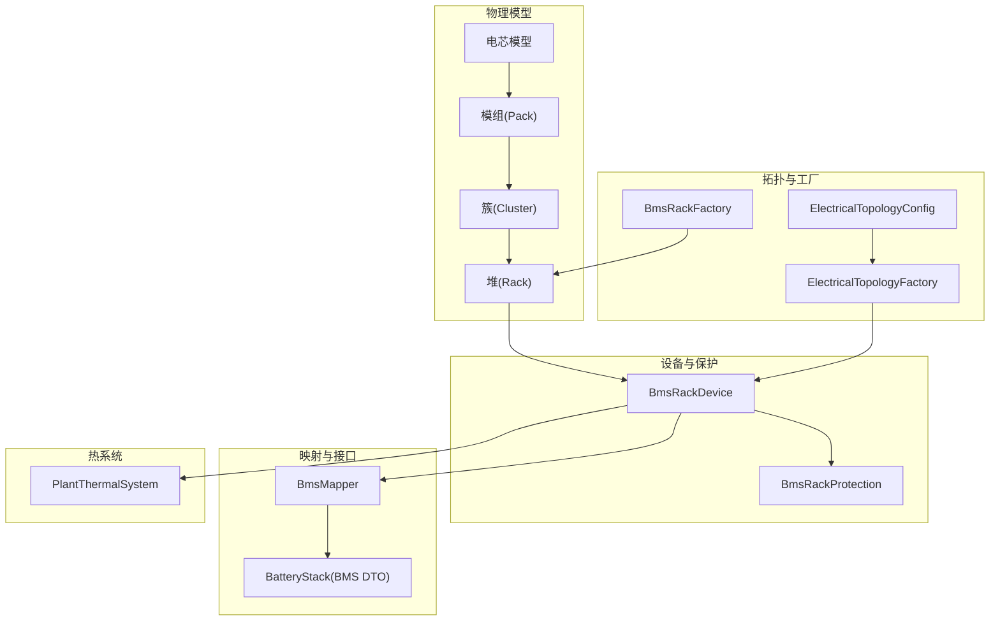
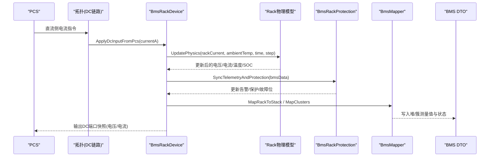
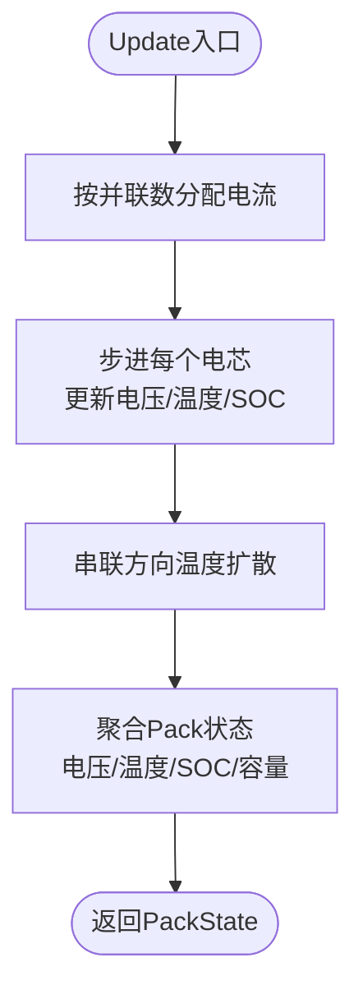
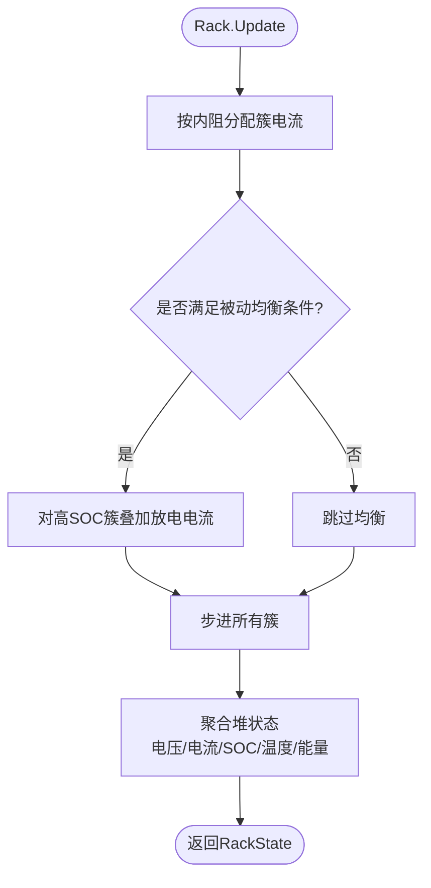
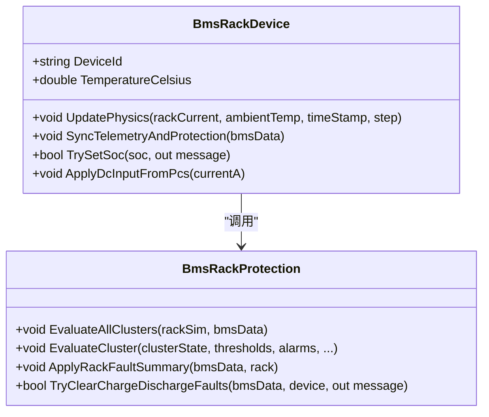
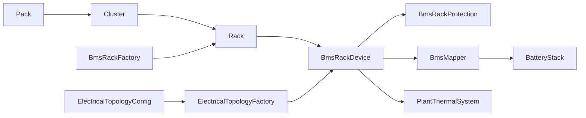
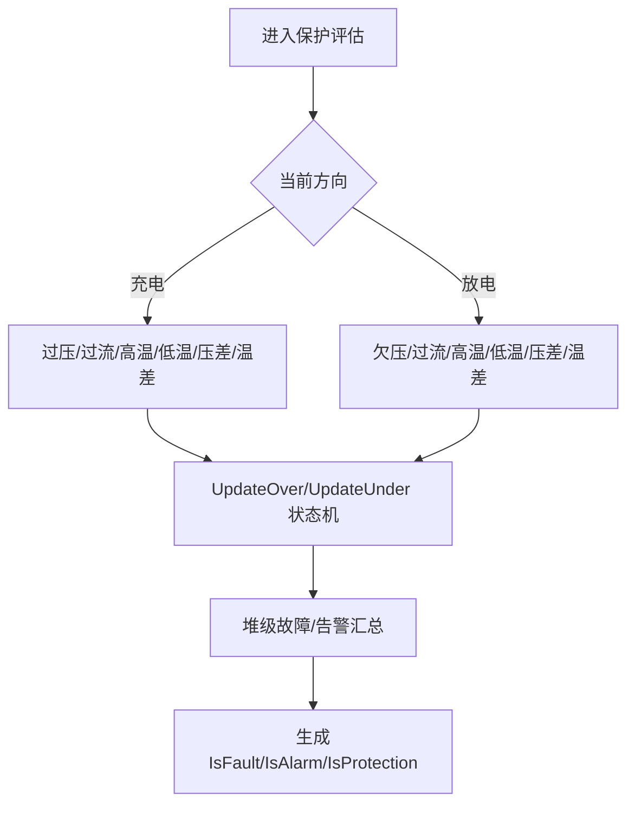

# 电池包模型

<cite>
**本文引用的文件**
- [batteryPackModel.cs](file://EssDeviceSimModel/Battery/batteryPackModel.cs)
- [batteryClusterModel.cs](file://EssDeviceSimModel/Battery/batteryClusterModel.cs)
- [batteryHeapModel.cs](file://EssDeviceSimModel/Battery/batteryHeapModel.cs)
- [BmsRackFactory.cs](file://EssDeviceSimModel/Battery/BmsRackFactory.cs)
- [BmsRackDevice.cs](file://EssDeviceSimModel/Devices/BmsRackDevice.cs)
- [BmsRackProtection.cs](file://EssDeviceSimModel/Devices/BmsRackProtection.cs)
- [BatteryStack.cs](file://EssSimModelApi/Bms/BatteryStack.cs)
- [BmsMapper.cs](file://EssSimModelApi/Mappers/BmsMapper.cs)
- [PlantThermalSystem.cs](file://EssDeviceSimModel/Thermal/PlantThermalSystem.cs)
- [ElectricalTopologyConfig.cs](file://EssDeviceSimModel/Model/ElectricalTopologyConfig.cs)
- [ElectricalTopologyFactory.cs](file://EssDeviceSimModel/Model/ElectricalTopologyFactory.cs)
- [TopologyTemplates.cs](file://Web/Topology/TopologyTemplates.cs)
- [TopologyRuntimeConverter.cs](file://Web/Topology/TopologyRuntimeConverter.cs)
</cite>

## 目录
1. [简介](#简介)
2. [项目结构](#项目结构)
3. [核心组件](#核心组件)
4. [架构总览](#架构总览)
5. [详细组件分析](#详细组件分析)
6. [依赖关系分析](#依赖关系分析)
7. [性能与热管理](#性能与热管理)
8. [故障诊断与保护策略](#故障诊断与保护策略)
9. [配置参数与接口说明](#配置参数与接口说明)
10. [通信协议与数据交换格式](#通信协议与数据交换格式)
11. [常见问题排查](#常见问题排查)
12. [结论](#结论)

## 简介
本文件面向储能仿真系统中的“电池包模型”，系统性阐述从电芯到模组（Pack）、簇（Cluster）、堆（Rack）的自底向上建模方法，覆盖电气拓扑、热管理系统集成、BMS 接口适配、系统级保护策略、状态监控与异常处理。文档同时给出如何配置电池包拓扑、设置保护策略和处理系统级异常的实践指引，并解释与上层系统的通信协议和数据交换格式。

## 项目结构
电池包模型位于 EssDeviceSimModel 与 EssSimModelApi 两大模块中：
- 物理模型层：电芯→模组→簇→堆，包含温度扩散、内阻差异、SOC/SOH 演化、能量统计等。
- 设备与保护层：将物理模型封装为 BMS 设备，执行阈值评估、告警汇总、故障回写。
- 映射与接口层：将物理量映射为 BMS DTO（BatteryManagementSystemData），供 Modbus/遥测管道使用。
- 拓扑与工厂：从配置构建四层电池堆，定义 DC 链路连接 PCS 与 BMS。
- 热系统：计算柜体温度、空调控制、电池欧姆损耗注入。

图表来源
- [batteryHeapModel.cs:10-45](file://EssDeviceSimModel/Battery/batteryHeapModel.cs#L10-L45)
- [batteryClusterModel.cs:9-40](file://EssDeviceSimModel/Battery/batteryClusterModel.cs#L9-L40)
- [batteryPackModel.cs:10-42](file://EssDeviceSimModel/Battery/batteryPackModel.cs#L10-L42)
- [BmsRackDevice.cs:10-38](file://EssDeviceSimModel/Devices/BmsRackDevice.cs#L10-L38)
- [BmsRackProtection.cs:5-10](file://EssDeviceSimModel/Devices/BmsRackProtection.cs#L5-L10)
- [BmsMapper.cs:7-11](file://EssSimModelApi/Mappers/BmsMapper.cs#L7-L11)
- [BatteryStack.cs:7-16](file://EssSimModelApi/Bms/BatteryStack.cs#L7-L16)
- [ElectricalTopologyConfig.cs:3-31](file://EssDeviceSimModel/Model/ElectricalTopologyConfig.cs#L3-L31)
- [ElectricalTopologyFactory.cs:7-55](file://EssDeviceSimModel/Model/ElectricalTopologyFactory.cs#L7-L55)
- [BmsRackFactory.cs:5-32](file://EssDeviceSimModel/Battery/BmsRackFactory.cs#L5-L32)
- [PlantThermalSystem.cs:9-13](file://EssDeviceSimModel/Thermal/PlantThermalSystem.cs#L9-L13)

章节来源
- [batteryHeapModel.cs:10-45](file://EssDeviceSimModel/Battery/batteryHeapModel.cs#L10-L45)
- [batteryClusterModel.cs:9-40](file://EssDeviceSimModel/Battery/batteryClusterModel.cs#L9-L40)
- [batteryPackModel.cs:10-42](file://EssDeviceSimModel/Battery/batteryPackModel.cs#L10-L42)
- [BmsRackDevice.cs:10-38](file://EssDeviceSimModel/Devices/BmsRackDevice.cs#L10-L38)
- [BmsRackProtection.cs:5-10](file://EssDeviceSimModel/Devices/BmsRackProtection.cs#L5-L10)
- [BmsMapper.cs:7-11](file://EssSimModelApi/Mappers/BmsMapper.cs#L7-L11)
- [BatteryStack.cs:7-16](file://EssSimModelApi/Bms/BatteryStack.cs#L7-L16)
- [ElectricalTopologyConfig.cs:3-31](file://EssDeviceSimModel/Model/ElectricalTopologyConfig.cs#L3-L31)
- [ElectricalTopologyFactory.cs:7-55](file://EssDeviceSimModel/Model/ElectricalTopologyFactory.cs#L7-L55)
- [BmsRackFactory.cs:5-32](file://EssDeviceSimModel/Battery/BmsRackFactory.cs#L5-L32)
- [PlantThermalSystem.cs:9-13](file://EssDeviceSimModel/Thermal/PlantThermalSystem.cs#L9-L13)

## 核心组件
- 电芯与模组：模拟单体电压/温度/SOC 演化，考虑并联均流与串联叠加，支持热扩散与不一致性建模。
- 簇：多个模组串联，统计簇级电压/温度/SOC 极值与不平衡度，支持簇内均衡预留接口。
- 堆：多个簇并联，按内阻分配电流，支持簇间被动均衡（高 SOC 簇泄放）。
- BMS 设备：封装 Rack 物理模型，提供 DC 端口、温度感知、SOC 设置、保护评估与遥测同步。
- 保护逻辑：基于阈值与恢复门限的状态机，实现欠压/过压、过流、温度、绝缘、压差/温差等三级保护/告警。
- 映射器：将 Rack/Cluster/Pack/Cell 数据映射到 BMS DTO，供上层 Modbus/遥测读取。
- 拓扑与工厂：从配置创建四层电池堆，定义 DC 链路连接 PCS 与 BMS。
- 热系统：计算柜体温度、空调启停、电池欧姆损耗注入，影响电芯散热环境。

章节来源
- [batteryPackModel.cs:44-215](file://EssDeviceSimModel/Battery/batteryPackModel.cs#L44-L215)
- [batteryClusterModel.cs:42-188](file://EssDeviceSimModel/Battery/batteryClusterModel.cs#L42-L188)
- [batteryHeapModel.cs:89-323](file://EssDeviceSimModel/Battery/batteryHeapModel.cs#L89-L323)
- [BmsRackDevice.cs:10-165](file://EssDeviceSimModel/Devices/BmsRackDevice.cs#L10-L165)
- [BmsRackProtection.cs:71-318](file://EssDeviceSimModel/Devices/BmsRackProtection.cs#L71-L318)
- [BmsMapper.cs:89-181](file://EssSimModelApi/Mappers/BmsMapper.cs#L89-L181)
- [ElectricalTopologyConfig.cs:25-31](file://EssDeviceSimModel/Model/ElectricalTopologyConfig.cs#L25-L31)
- [ElectricalTopologyFactory.cs:7-55](file://EssDeviceSimModel/Model/ElectricalTopologyFactory.cs#L7-L55)
- [BmsRackFactory.cs:5-32](file://EssDeviceSimModel/Battery/BmsRackFactory.cs#L5-L32)
- [PlantThermalSystem.cs:96-140](file://EssDeviceSimModel/Thermal/PlantThermalSystem.cs#L96-L140)

## 架构总览
电池包模型采用分层抽象：
- 物理层：电芯→模组→簇→堆，逐步聚合电压、电流、温度、SOC、SOH、能量等。
- 设备层：BmsRackDevice 暴露统一接口，负责物理推进、端口同步、保护评估、遥测映射。
- 接口层：BmsMapper 将物理量映射为 BatteryManagementSystemData，供 Modbus/遥测管道消费。
- 拓扑层：ElectricalTopologyConfig 定义 DC 链路连接 PCS 与 BMS；ElectricalTopologyFactory 构建网络拓扑。
- 热系统：PlantThermalSystem 计算柜体温度与空调控制，向电芯提供散热环境。

图表来源
- [BmsRackDevice.cs:84-149](file://EssDeviceSimModel/Devices/BmsRackDevice.cs#L84-L149)
- [BmsRackProtection.cs:10-33](file://EssDeviceSimModel/Devices/BmsRackProtection.cs#L10-L33)
- [BmsMapper.cs:89-181](file://EssSimModelApi/Mappers/BmsMapper.cs#L89-L181)
- [ElectricalTopologyConfig.cs:25-31](file://EssDeviceSimModel/Model/ElectricalTopologyConfig.cs#L25-L31)

## 详细组件分析

### 电芯与模组（Pack）
- 串并联结构：二维数组表示串并联，初始化时引入容量/内阻随机差异以模拟不一致性。
- 热扩散：沿串联方向进行一维温度扩散，平滑 Pack 内部温差。
- 状态聚合：计算总电压、电流、单体电压/温度/SOC 极值与均值、健康度、剩余/总容量。
- SOC 设置：支持批量设置 Pack 内所有电芯 SOC，并刷新汇总。

图表来源
- [batteryPackModel.cs:102-203](file://EssDeviceSimModel/Battery/batteryPackModel.cs#L102-L203)

章节来源
- [batteryPackModel.cs:10-42](file://EssDeviceSimModel/Battery/batteryPackModel.cs#L10-L42)
- [batteryPackModel.cs:44-215](file://EssDeviceSimModel/Battery/batteryPackModel.cs#L44-L215)

### 簇（Cluster）
- 多模组串联：每步对每个 Pack 施加相同电流，考虑位置导致的温度差异。
- 状态聚合：计算簇总电压、电流、模组电压/温度/SOC 极值与不平衡度，累计容量与健康度。
- 均衡预留：提供簇级均衡接口（注释示例），便于扩展主动均衡策略。

章节来源
- [batteryClusterModel.cs:9-40](file://EssDeviceSimModel/Battery/batteryClusterModel.cs#L9-L40)
- [batteryClusterModel.cs:42-188](file://EssDeviceSimModel/Battery/batteryClusterModel.cs#L42-L188)

### 堆（Rack）与簇间被动均衡
- 并联电流分配：按各簇内阻倒数比例分配总电流，体现不一致性。
- 被动均衡：当簇间 SOC 差超过启动阈值且满足静置条件时，对高 SOC 簇施加小放电电流（电阻泄放型），降低 SOC 差。
- 状态聚合：计算堆总电压/电流、簇电流不平衡率、SOC/温度极值与差异、累计充放电能量。

图表来源
- [batteryHeapModel.cs:154-229](file://EssDeviceSimModel/Battery/batteryHeapModel.cs#L154-L229)
- [batteryHeapModel.cs:247-309](file://EssDeviceSimModel/Battery/batteryHeapModel.cs#L247-L309)

章节来源
- [batteryHeapModel.cs:10-45](file://EssDeviceSimModel/Battery/batteryHeapModel.cs#L10-L45)
- [batteryHeapModel.cs:89-323](file://EssDeviceSimModel/Battery/batteryHeapModel.cs#L89-L323)

### BMS 设备与保护
- 设备职责：封装 Rack 物理模型，提供 DC 端口读写、温度感知、SOC 设置、保护评估与遥测同步。
- 保护评估：对每个簇进行阈值判断（欠压/过压、过流、温度、绝缘、压差/温差等），维护三级保护/告警状态机。
- 故障汇总：根据堆级 SOC/SOH 与方向性保护，生成 Rack 故障码，并回写物理状态。

图表来源
- [BmsRackDevice.cs:10-165](file://EssDeviceSimModel/Devices/BmsRackDevice.cs#L10-L165)
- [BmsRackProtection.cs:5-318](file://EssDeviceSimModel/Devices/BmsRackProtection.cs#L5-L318)

章节来源
- [BmsRackDevice.cs:10-165](file://EssDeviceSimModel/Devices/BmsRackDevice.cs#L10-L165)
- [BmsRackProtection.cs:71-318](file://EssDeviceSimModel/Devices/BmsRackProtection.cs#L71-L318)

### 映射与 BMS 接口
- 堆级映射：将 Rack 的总电压/电流/功率、SOC/SOH、极值单体信息写入 BatteryStack。
- 簇级映射：将每个簇的单体电压/温度字典、基础测量值写入对应簇 DTO。
- 运行状态：根据告警/功率限值解析堆级运行状态（正常/禁充/禁放/待机/停机）。

章节来源
- [BmsMapper.cs:13-85](file://EssSimModelApi/Mappers/BmsMapper.cs#L13-L85)
- [BmsMapper.cs:89-181](file://EssSimModelApi/Mappers/BmsMapper.cs#L89-L181)
- [BatteryStack.cs:43-197](file://EssSimModelApi/Bms/BatteryStack.cs#L43-L197)

### 拓扑与工厂
- 拓扑配置：定义交流母线、串联链路、直流链路（PCS-BMS 耦合）、设备引用与测量抽头。
- 工厂构建：从 ElectricalTopologyConfig 构建 NetworkTopology，注册 DC 链路默认闭合状态。
- 模板与转换：Web 拓扑模板提供 BMS 节点参数键名；运行时转换器将拓扑节点参数映射为 BmsDeviceConfig。

章节来源
- [ElectricalTopologyConfig.cs:3-31](file://EssDeviceSimModel/Model/ElectricalTopologyConfig.cs#L3-L31)
- [ElectricalTopologyFactory.cs:7-55](file://EssDeviceSimModel/Model/ElectricalTopologyFactory.cs#L7-L55)
- [TopologyTemplates.cs:330-366](file://Web/Topology/TopologyTemplates.cs#L330-L366)
- [TopologyRuntimeConverter.cs:237-253](file://Web/Topology/TopologyRuntimeConverter.cs#L237-L253)

## 依赖关系分析
- 物理模型依赖：Pack 依赖电芯模型；Cluster 依赖 Pack；Rack 依赖 Cluster。
- 设备依赖：BmsRackDevice 依赖 Rack 物理模型、BmsRackProtection、BmsMapper。
- 映射依赖：BmsMapper 依赖 Rack/Cluster/Pack/Cell 状态与 BMS DTO。
- 拓扑依赖：ElectricalTopologyFactory 依赖 ElectricalTopologyConfig；BmsRackFactory 依赖 BmsDeviceConfig。
- 热系统依赖：PlantThermalSystem 依赖 ClimateModel、BmsCabinetThermalZone，并向 Rack 提供散热环境。

图表来源
- [batteryPackModel.cs:44-215](file://EssDeviceSimModel/Battery/batteryPackModel.cs#L44-L215)
- [batteryClusterModel.cs:42-188](file://EssDeviceSimModel/Battery/batteryClusterModel.cs#L42-L188)
- [batteryHeapModel.cs:89-323](file://EssDeviceSimModel/Battery/batteryHeapModel.cs#L89-L323)
- [BmsRackDevice.cs:10-165](file://EssDeviceSimModel/Devices/BmsRackDevice.cs#L10-L165)
- [BmsRackProtection.cs:71-318](file://EssDeviceSimModel/Devices/BmsRackProtection.cs#L71-L318)
- [BmsMapper.cs:89-181](file://EssSimModelApi/Mappers/BmsMapper.cs#L89-L181)
- [ElectricalTopologyConfig.cs:3-31](file://EssDeviceSimModel/Model/ElectricalTopologyConfig.cs#L3-L31)
- [ElectricalTopologyFactory.cs:7-55](file://EssDeviceSimModel/Model/ElectricalTopologyFactory.cs#L7-L55)
- [BmsRackFactory.cs:5-32](file://EssDeviceSimModel/Battery/BmsRackFactory.cs#L5-L32)
- [PlantThermalSystem.cs:96-140](file://EssDeviceSimModel/Thermal/PlantThermalSystem.cs#L96-L140)

章节来源
- [batteryPackModel.cs:44-215](file://EssDeviceSimModel/Battery/batteryPackModel.cs#L44-L215)
- [batteryClusterModel.cs:42-188](file://EssDeviceSimModel/Battery/batteryClusterModel.cs#L42-L188)
- [batteryHeapModel.cs:89-323](file://EssDeviceSimModel/Battery/batteryHeapModel.cs#L89-L323)
- [BmsRackDevice.cs:10-165](file://EssDeviceSimModel/Devices/BmsRackDevice.cs#L10-L165)
- [BmsRackProtection.cs:71-318](file://EssDeviceSimModel/Devices/BmsRackProtection.cs#L71-L318)
- [BmsMapper.cs:89-181](file://EssSimModelApi/Mappers/BmsMapper.cs#L89-L181)
- [ElectricalTopologyConfig.cs:3-31](file://EssDeviceSimModel/Model/ElectricalTopologyConfig.cs#L3-L31)
- [ElectricalTopologyFactory.cs:7-55](file://EssDeviceSimModel/Model/ElectricalTopologyFactory.cs#L7-L55)
- [BmsRackFactory.cs:5-32](file://EssDeviceSimModel/Battery/BmsRackFactory.cs#L5-L32)
- [PlantThermalSystem.cs:96-140](file://EssDeviceSimModel/Thermal/PlantThermalSystem.cs#L96-L140)

## 性能与热管理
- 热扩散与不一致性：Pack 内串联方向温度扩散，Cluster/Rack 引入温度差异，更贴近真实热分布。
- 欧姆损耗估算：PlantThermalSystem.EstimateRackOhmicLossWatts 基于串并联路径与附加内阻计算堆级损耗，用于热注入。
- 空调控制：PlantThermalSystem 支持全局与单柜空调开关、设定点调节，影响柜内空气温度，进而影响电芯散热。
- 性能建议：合理设置 PassiveBalance 参数避免频繁动作；在动态工况下关注 SOC 差与温度差，必要时调整冷却能力。

章节来源
- [batteryPackModel.cs:117-151](file://EssDeviceSimModel/Battery/batteryPackModel.cs#L117-L151)
- [batteryClusterModel.cs:90-105](file://EssDeviceSimModel/Battery/batteryClusterModel.cs#L90-L105)
- [batteryHeapModel.cs:154-229](file://EssDeviceSimModel/Battery/batteryHeapModel.cs#L154-L229)
- [PlantThermalSystem.cs:44-94](file://EssDeviceSimModel/Thermal/PlantThermalSystem.cs#L44-L94)
- [PlantThermalSystem.cs:96-140](file://EssDeviceSimModel/Thermal/PlantThermalSystem.cs#L96-L140)

## 故障诊断与保护策略
- 阈值状态机：UpdateUnder/UpdateOver 实现三级保护/告警切换，支持恢复门限，避免清障后仍超限却仅缓慢爬升的问题。
- 方向性保护：充电/放电方向分别评估过压/欠压、过流、温度等，结合堆级 SOC/SOH 判定故障码。
- 非方向性告警：绝缘、端子高温、高压箱高温、压差/温差等作为二级告警，可能触发待机或停机。
- 故障清除：TryClearChargeDischargeFaults 仅在待机时一次性清除方向性故障，再次充/放电若仍超限将重新触发。

图表来源
- [BmsRackProtection.cs:71-175](file://EssDeviceSimModel/Devices/BmsRackProtection.cs#L71-L175)
- [BmsRackProtection.cs:177-226](file://EssDeviceSimModel/Devices/BmsRackProtection.cs#L177-L226)
- [BmsRackProtection.cs:273-318](file://EssDeviceSimModel/Devices/BmsRackProtection.cs#L273-L318)

章节来源
- [BmsRackProtection.cs:71-318](file://EssDeviceSimModel/Devices/BmsRackProtection.cs#L71-L318)

## 配置参数与接口说明
- 电芯与模组配置：SeriesCount、ParallelCount、NominalVoltage、NominalCapacity、InitialSoc、PackInternalResistance、CoolingEfficiency。
- 簇配置：PackCount、PackConfig、ClusterInternalResistance、MaxVoltageImbalance、MaxTempDifference。
- 堆配置：ClusterCount、ClusterConfig、RackInternalResistance、MaxCurrentImbalance、MaxSOCDifference、PassiveBalance（Enabled、StartSocDelta、StopSocDelta、BalanceCRate、IdleOnly、IdleCurrentThresholdA、BleedAboveMinMargin）。
- 拓扑参数：clusterCount、packCount、cellSeriesCount、cellParallelCount、cellNominalVoltage、cellNominalCapacity、cellInitialSoc、rackInternalResistance。
- 关键接口：
  - BatteryRackSimulator.TrySetSoc：安全设置整堆 SOC（需待机）。
  - BmsRackDevice.TrySetSoc：带充放电方向检查的 SOC 设置。
  - BmsRackProtection.TryClearChargeDischargeFaults：待机时清除方向性故障。
  - PlantThermalSystem.SetHvacEnabled/SetHvacSetpointCelsius：空调控制。

章节来源
- [batteryPackModel.cs:10-21](file://EssDeviceSimModel/Battery/batteryPackModel.cs#L10-L21)
- [batteryClusterModel.cs:9-17](file://EssDeviceSimModel/Battery/batteryClusterModel.cs#L9-L17)
- [batteryHeapModel.cs:47-87](file://EssDeviceSimModel/Battery/batteryHeapModel.cs#L47-L87)
- [BmsRackDevice.cs:98-114](file://EssDeviceSimModel/Devices/BmsRackDevice.cs#L98-L114)
- [BmsRackProtection.cs:231-265](file://EssDeviceSimModel/Devices/BmsRackProtection.cs#L231-L265)
- [PlantThermalSystem.cs:73-94](file://EssDeviceSimModel/Thermal/PlantThermalSystem.cs#L73-L94)
- [TopologyTemplates.cs:342-366](file://Web/Topology/TopologyTemplates.cs#L342-L366)
- [TopologyRuntimeConverter.cs:237-253](file://Web/Topology/TopologyRuntimeConverter.cs#L237-L253)

## 通信协议与数据交换格式
- 数据对象：BatteryManagementSystemData 包含 BatteryStack 列表，每个 Stack 包含 Cluseter 列表及测量值、告警、限制参数。
- 堆级字段：TotalVoltage、Current、Power、SOC、SOH、InsulationPlus/Minus、OperationStatus、MaxChargePower/MaxDischargePower、MaxChargeCurrent/MaxDischargeCurrent 等。
- 簇级字段：Measurements（总电压、电流、SOC、功率、SOH、平均单体电压/温度、最大/最小单体电压/温度及其 ID）、Alarms（各级保护/告警位）、Thresholds（阈值与恢复门限）。
- 映射流程：BmsMapper.MapRackToStack 与 MapClusters 将物理模型数据写入 DTO；BmsMapper.ResolveStackOperationStatus 解析运行状态。
- 拓扑连接：ElectricalTopologyConfig.DcLinks 定义 PCS 与 BMS 的直流链路；ElectricalTopologyFactory.FromConfig 构建拓扑并注册默认闭合状态。

章节来源
- [BatteryStack.cs:43-197](file://EssSimModelApi/Bms/BatteryStack.cs#L43-L197)
- [BmsMapper.cs:89-181](file://EssSimModelApi/Mappers/BmsMapper.cs#L89-L181)
- [ElectricalTopologyConfig.cs:25-31](file://EssDeviceSimModel/Model/ElectricalTopologyConfig.cs#L25-L31)
- [ElectricalTopologyFactory.cs:7-55](file://EssDeviceSimModel/Model/ElectricalTopologyFactory.cs#L7-L55)

## 常见问题排查
- SOC 设置失败：若仍在充/放电，TrySetSoc 会拒绝；需先待机再设置。
- 故障无法清除：方向性故障仅在待机时可一次性清除；若再次充/放电仍超限将重新触发。
- 保护误报：检查阈值与恢复门限设置，确认温度/电压/电流采样范围；关注非方向性告警（绝缘、端子高温、高压箱高温、压差/温差）。
- 热管理失效：确认 PlantThermalSystem.Enabled 与 HVAC 配置；检查柜体空调开关与设定点；核对欧姆损耗注入是否正确。

章节来源
- [BmsRackDevice.cs:98-114](file://EssDeviceSimModel/Devices/BmsRackDevice.cs#L98-L114)
- [BmsRackProtection.cs:231-265](file://EssDeviceSimModel/Devices/BmsRackProtection.cs#L231-L265)
- [PlantThermalSystem.cs:73-94](file://EssDeviceSimModel/Thermal/PlantThermalSystem.cs#L73-L94)

## 结论
该电池包模型通过自底向上的分层抽象，实现了从电芯到堆的完整物理仿真，并结合 BMS 接口适配与系统级保护策略，提供了可靠的遥测映射与故障诊断能力。配合拓扑与工厂机制，可灵活配置不同规模的电池包；热管理系统则确保温度场与能耗的合理性。实际应用中，应合理设置阈值与热管理参数，关注 SOC/温度/电压的不一致性，并通过保护状态机与故障清除机制保障系统安全与稳定运行。