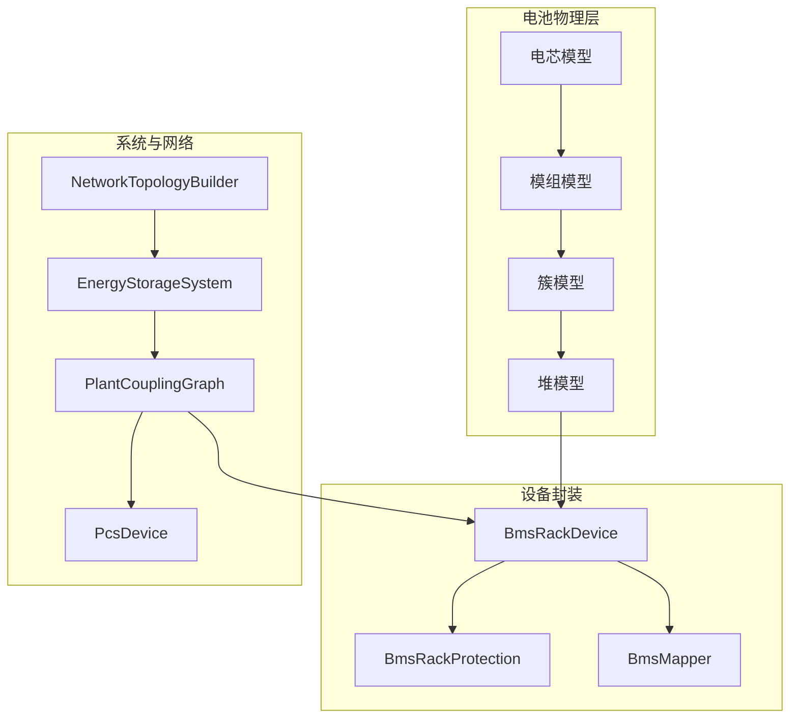
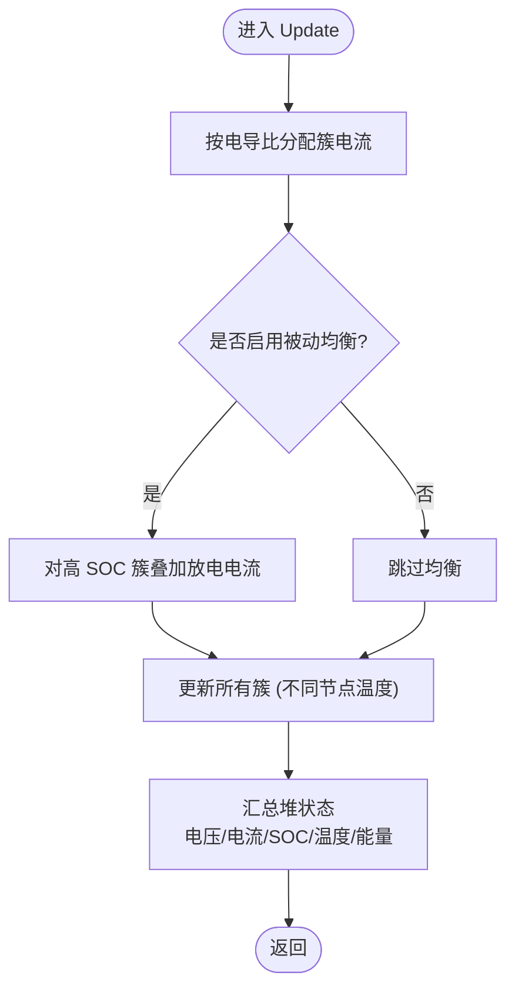
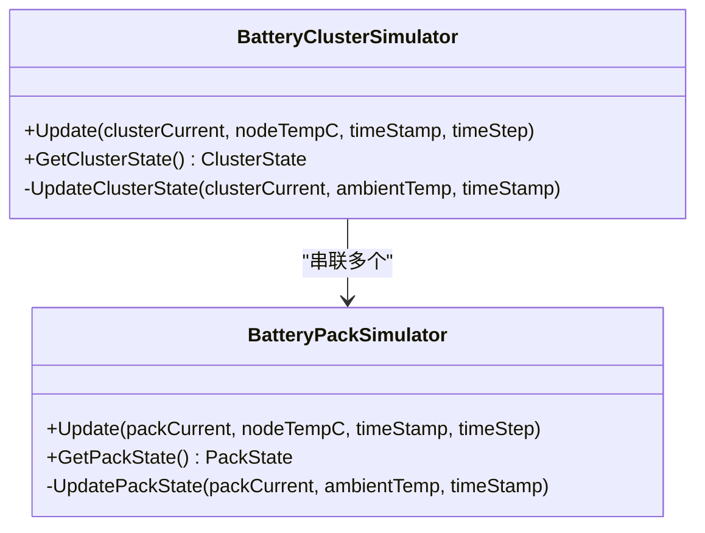
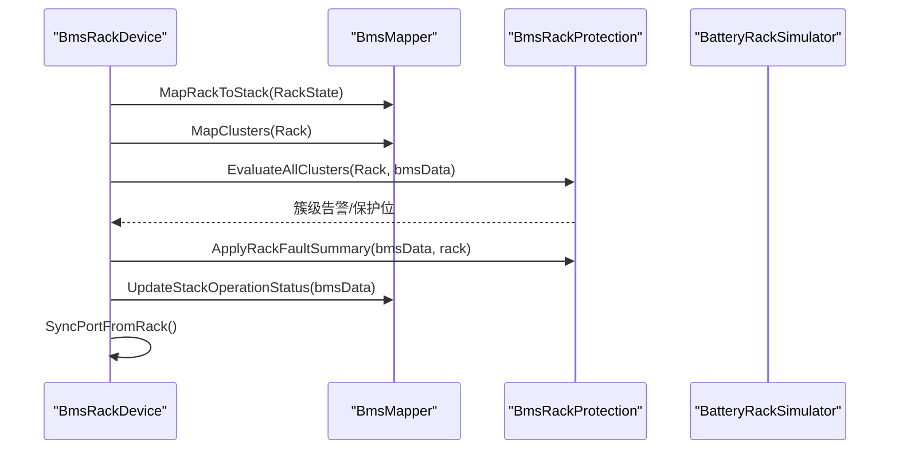
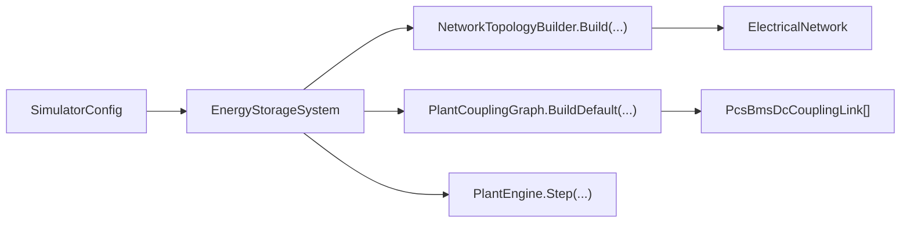
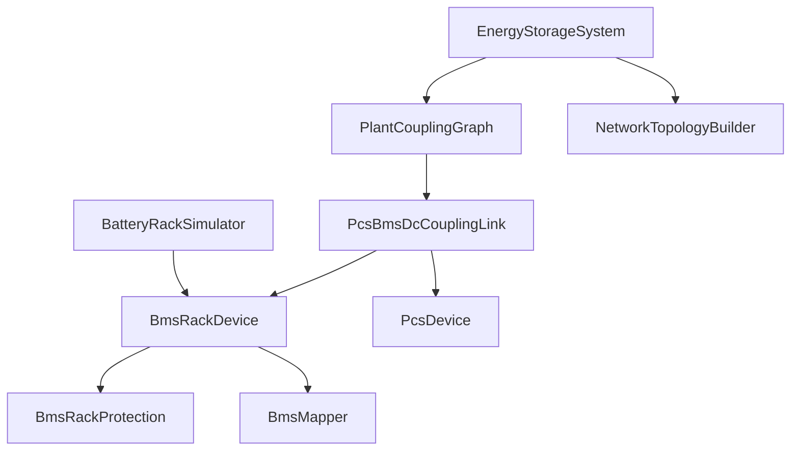

# 电池堆模型

<cite>
**本文引用的文件**
- [batteryHeapModel.cs](file://EssDeviceSimModel/Battery/batteryHeapModel.cs)
- [batteryClusterModel.cs](file://EssDeviceSimModel/Battery/batteryClusterModel.cs)
- [batteryPackModel.cs](file://EssDeviceSimModel/Battery/batteryPackModel.cs)
- [BmsRackFactory.cs](file://EssDeviceSimModel/Battery/BmsRackFactory.cs)
- [BmsRackDevice.cs](file://EssDeviceSimModel/Devices/BmsRackDevice.cs)
- [BmsRackProtection.cs](file://EssDeviceSimModel/Devices/BmsRackProtection.cs)
- [EnergyStorageSys.cs](file://EssDeviceSimModel/EnergyStorageSys.cs)
- [PlantCouplingGraph.cs](file://EssDeviceSimModel/Plant/PlantCouplingGraph.cs)
- [PcsBmsDcCouplingLink.cs](file://EssDeviceSimModel/Plant/PcsBmsDcCouplingLink.cs)
- [PcsDevice.Core.cs](file://EssDeviceSimModel/Devices/PcsDevice.Core.cs)
- [NetworkTopologyBuilder.cs](file://EssDeviceSimModel/Solver/NetworkTopologyBuilder.cs)
- [BmsMapper.cs](file://EssSimModelApi/Mappers/BmsMapper.cs)
- [TopologyRuntimeConverter.cs](file://Web/Topology/TopologyRuntimeConverter.cs)
</cite>

## 目录
1. [简介](#简介)
2. [项目结构](#项目结构)
3. [核心组件](#核心组件)
4. [架构总览](#架构总览)
5. [详细组件分析](#详细组件分析)
6. [依赖关系分析](#依赖关系分析)
7. [性能与优化](#性能与优化)
8. [故障诊断与排障](#故障诊断与排障)
9. [结论](#结论)
10. [附录：配置与接口示例](#附录配置与接口示例)

## 简介
本文件面向“电池堆模型”的系统级设计与实现，覆盖多电池簇协调控制、能量管理、功率分配算法、系统监控、配置管理、状态同步与故障隔离策略，并给出与 PCS 系统的接口协议与实时数据交换流程。文档以代码为依据，提供可追溯的源码路径与图示，帮助读者快速理解并正确使用该模型。

## 项目结构
电池堆模型位于设备仿真层，采用“电芯→模组→簇→堆”四层建模，并通过 BMS 设备封装对外暴露 DC 端口与保护逻辑；PCS 通过直流耦合边与 BMS 交互，形成完整的储能单元。



图表来源
- [batteryHeapModel.cs:9-45](file://EssDeviceSimModel/Battery/batteryHeapModel.cs#L9-L45)
- [batteryClusterModel.cs:9-40](file://EssDeviceSimModel/Battery/batteryClusterModel.cs#L9-L40)
- [batteryPackModel.cs:9-42](file://EssDeviceSimModel/Battery/batteryPackModel.cs#L9-L42)
- [BmsRackDevice.cs:10-39](file://EssDeviceSimModel/Devices/BmsRackDevice.cs#L10-L39)
- [BmsRackProtection.cs:5-33](file://EssDeviceSimModel/Devices/BmsRackProtection.cs#L5-L33)
- [BmsMapper.cs:7-18](file://EssSimModelApi/Mappers/BmsMapper.cs#L7-L18)
- [EnergyStorageSys.cs:24-112](file://EssDeviceSimModel/EnergyStorageSys.cs#L24-L112)
- [PlantCouplingGraph.cs:8-40](file://EssDeviceSimModel/Plant/PlantCouplingGraph.cs#L8-L40)
- [PcsDevice.Core.cs:11-32](file://EssDeviceSimModel/Devices/PcsDevice.Core.cs#L11-L32)
- [NetworkTopologyBuilder.cs:8-108](file://EssDeviceSimModel/Solver/NetworkTopologyBuilder.cs#L8-L108)

章节来源
- [EnergyStorageSys.cs:124-245](file://EssDeviceSimModel/EnergyStorageSys.cs#L124-L245)
- [NetworkTopologyBuilder.cs:10-108](file://EssDeviceSimModel/Solver/NetworkTopologyBuilder.cs#L10-L108)

## 核心组件
- 电池堆模拟器 BatteryRackSimulator：维护多个并联簇，执行电流分配、被动均衡、状态汇总与累计能量统计。
- 簇模拟器 BatteryClusterSimulator：串联若干模组，计算簇电压、温度、SOC 与健康度。
- 模组模拟器 BatteryPackSimulator：串并联电芯，模拟热扩散与容量短板效应。
- BMS 设备 BmsRackDevice：将物理模型映射到 DC 端口，执行保护评估与告警汇总，提供 SOC 设置与并网链路控制。
- 保护逻辑 BmsRackProtection：簇级阈值评估（过压/欠压、过流/欠流、温度、绝缘、压差/温差等），并回写 Rack 故障态。
- 映射器 BmsMapper：将堆/簇状态映射为 BMS DTO，计算运行状态码（正常/禁充/禁放/待机/停机）。
- 耦合图 PlantCouplingGraph 与 PcsBmsDcCouplingLink：建立 PCS↔BMS 直流耦合边，完成环境温、V/I 交换与损耗登记。
- PCS 设备 PcsDevice：实现跟网/离网、功率爬坡、黑启动、保护与交流/直流端口输出。
- 系统编排 EnergyStorageSystem：构建拓扑、初始化设备、驱动主循环与耦合步进。
- 拓扑构建 NetworkTopologyBuilder：生成电气拓扑、DC 链路、设备实例与求解器。

章节来源
- [batteryHeapModel.cs:89-323](file://EssDeviceSimModel/Battery/batteryHeapModel.cs#L89-L323)
- [batteryClusterModel.cs:42-188](file://EssDeviceSimModel/Battery/batteryClusterModel.cs#L42-L188)
- [batteryPackModel.cs:44-215](file://EssDeviceSimModel/Battery/batteryPackModel.cs#L44-L215)
- [BmsRackDevice.cs:14-165](file://EssDeviceSimModel/Devices/BmsRackDevice.cs#L14-L165)
- [BmsRackProtection.cs:8-321](file://EssDeviceSimModel/Devices/BmsRackProtection.cs#L8-L321)
- [BmsMapper.cs:11-232](file://EssSimModelApi/Mappers/BmsMapper.cs#L11-L232)
- [PlantCouplingGraph.cs:11-40](file://EssDeviceSimModel/Plant/PlantCouplingGraph.cs#L11-L40)
- [PcsBmsDcCouplingLink.cs:12-64](file://EssDeviceSimModel/Plant/PcsBmsDcCouplingLink.cs#L12-L64)
- [PcsDevice.Core.cs:15-696](file://EssDeviceSimModel/Devices/PcsDevice.Core.cs#L15-L696)
- [EnergyStorageSys.cs:24-595](file://EssDeviceSimModel/EnergyStorageSys.cs#L24-L595)
- [NetworkTopologyBuilder.cs:8-235](file://EssDeviceSimModel/Solver/NetworkTopologyBuilder.cs#L8-L235)

## 架构总览
电池堆模型在系统层面由“物理模型 + 设备封装 + 耦合边 + 系统编排”构成。每个通道包含一个 PCS 与一个 BMS 设备，二者通过直流耦合边进行 V/I 与环境温度交换；BMS 内部维护堆/簇/模组/电芯的物理状态，并在每步更新后向 PCS 暴露 DC 端口电压与电流。系统主循环通过 EnergyStorageSystem 驱动 PlantEngine，进而调用耦合步进与设备步进。

```mermaid
sequenceDiagram
participant Host as "宿主定时器"
participant ESS as "EnergyStorageSystem"
participant PE as "PlantEngine"
participant CG as "PlantCouplingGraph"
participant Link as "PcsBmsDcCouplingLink"
participant PCS as "PcsDevice"
participant BMS as "BmsRackDevice"
Host->>ESS : ExecuteAsync() 周期触发
ESS->>PE : Step(simTime, elapsed, integrationElapsed)
PE->>CG : StepCouplings(thermal, simTime, elapsed, integrationElapsed)
CG->>Link : Step(...)
Link->>PCS : Update(dcVoltage, isBmsFault, ...)
Link->>BMS : UpdatePhysics(rackCurrent, ambientTemp, ...)
BMS-->>Link : DcSnapshot(V,I), LossWatts
PCS-->>Link : Ac/Dc Port Outputs
Link-->>PE : 记录柜体发热
PE-->>ESS : 完成一步
```

图表来源
- [EnergyStorageSys.cs:473-496](file://EssDeviceSimModel/EnergyStorageSys.cs#L473-L496)
- [PlantCouplingGraph.cs:32-40](file://EssDeviceSimModel/Plant/PlantCouplingGraph.cs#L32-L40)
- [PcsBmsDcCouplingLink.cs:25-64](file://EssDeviceSimModel/Plant/PcsBmsDcCouplingLink.cs#L25-L64)
- [PcsDevice.Core.cs:444-533](file://EssDeviceSimModel/Devices/PcsDevice.Core.cs#L444-L533)
- [BmsRackDevice.cs:87-144](file://EssDeviceSimModel/Devices/BmsRackDevice.cs#L87-L144)

## 详细组件分析

### 电池堆模型（BatteryRackSimulator）
- 拓扑：多个 BatteryClusterSimulator 并联，共享堆端电压；各簇按内阻电导比分配电流。
- 功率分配算法：基于电导比的并联电流分配，考虑簇间内阻差异；支持堆级被动均衡（对高 SOC 簇施加小放电电流，能量以热耗散）。
- 状态汇总：计算堆总电压/电流、簇间电流不平衡比例、电压差异、SOC 差异、温度极值与均值、健康度、剩余能量与累计充放电能量。
- 关键方法：Update、ApplyPassiveBalanceCurrents、CalculateCurrentDistribution、UpdateRackState、TrySetSoc。



图表来源
- [batteryHeapModel.cs:154-175](file://EssDeviceSimModel/Battery/batteryHeapModel.cs#L154-L175)
- [batteryHeapModel.cs:181-229](file://EssDeviceSimModel/Battery/batteryHeapModel.cs#L181-L229)
- [batteryHeapModel.cs:232-309](file://EssDeviceSimModel/Battery/batteryHeapModel.cs#L232-L309)

章节来源
- [batteryHeapModel.cs:89-323](file://EssDeviceSimModel/Battery/batteryHeapModel.cs#L89-L323)

### 簇与模组（BatteryClusterSimulator / BatteryPackSimulator）
- 簇：串联若干模组，计算总电压、温度与 SOC 范围；支持簇内温度差异模拟。
- 模组：串并联电芯，模拟热扩散（相邻电芯温度平滑）、容量短板效应（剩余容量取最弱串联段）。
- 关键方法：Update、UpdateClusterState、UpdatePackState。



图表来源
- [batteryClusterModel.cs:90-153](file://EssDeviceSimModel/Battery/batteryClusterModel.cs#L90-L153)
- [batteryPackModel.cs:100-203](file://EssDeviceSimModel/Battery/batteryPackModel.cs#L100-L203)

章节来源
- [batteryClusterModel.cs:42-188](file://EssDeviceSimModel/Battery/batteryClusterModel.cs#L42-L188)
- [batteryPackModel.cs:44-215](file://EssDeviceSimModel/Battery/batteryPackModel.cs#L44-L215)

### BMS 设备与保护（BmsRackDevice / BmsRackProtection）
- BmsRackDevice：封装堆物理模型，提供 DC 端口写入、SOC 热设、并网链路控制、保护评估与遥测映射。
- BmsRackProtection：簇级阈值评估（过压/欠压、过流/欠流、温度、绝缘、压差/温差、端子/高压箱高温），并汇总 Rack 故障态；支持一次性落级状态机避免清障后不触发问题。
- 关键流程：SyncTelemetryAndProtection → EvaluateAllClusters → ApplyRackFaultSummary → UpdateStackOperationStatus。



图表来源
- [BmsRackDevice.cs:116-144](file://EssDeviceSimModel/Devices/BmsRackDevice.cs#L116-L144)
- [BmsRackProtection.cs:10-33](file://EssDeviceSimModel/Devices/BmsRackProtection.cs#L10-L33)
- [BmsRackProtection.cs:180-226](file://EssDeviceSimModel/Devices/BmsRackProtection.cs#L180-L226)
- [BmsMapper.cs:89-128](file://EssSimModelApi/Mappers/BmsMapper.cs#L89-L128)

章节来源
- [BmsRackDevice.cs:14-165](file://EssDeviceSimModel/Devices/BmsRackDevice.cs#L14-L165)
- [BmsRackProtection.cs:8-321](file://EssDeviceSimModel/Devices/BmsRackProtection.cs#L8-L321)
- [BmsMapper.cs:11-232](file://EssSimModelApi/Mappers/BmsMapper.cs#L11-L232)

### PCS 与直流耦合（PcsDevice / PcsBmsDcCouplingLink）
- PcsDevice：实现跟网/离网模式、功率指令与爬坡、黑启动、保护与 AC/DC 端口输出；根据 DC 电压与功率计算 DC 电流，并根据交流侧 P/Q 与电压计算交流电流。
- PcsBmsDcCouplingLink：每步同步环境温、电池节点温度，读取 BMS 堆状态并驱动 PCS Update；若未并网则置零功率与电流；记录柜体发热。

```mermaid
sequenceDiagram
participant Link as "PcsBmsDcCouplingLink"
participant PCS as "PcsDevice"
participant BMS as "BmsRackDevice"
participant Thermal as "PlantThermalSystem"
Link->>Thermal : GetBmsAmbientCelsius(index)
Link->>BMS : ApplyBatteryNodeTemperature(nodeTemp)
Link->>PCS : ApplyAmbientTemperature(pcsAmbient)
alt 已并网
Link->>PCS : Update(rack.TotalVoltage, rack.IsFault, ...)
PCS-->>Link : DcCurrent
Link->>BMS : UpdatePhysics(-DcCurrent, cabinetAir, ...)
else 未并网
Link->>PCS : Update(0, 0, ...)
Link->>BMS : UpdatePhysics(0, cabinetAir, ...)
end
Link->>Thermal : RecordCabinetHeatWatts(lossWatts)
```

图表来源
- [PcsBmsDcCouplingLink.cs:25-64](file://EssDeviceSimModel/Plant/PcsBmsDcCouplingLink.cs#L25-L64)
- [PcsDevice.Core.cs:444-533](file://EssDeviceSimModel/Devices/PcsDevice.Core.cs#L444-L533)
- [BmsRackDevice.cs:87-144](file://EssDeviceSimModel/Devices/BmsRackDevice.cs#L87-L144)

章节来源
- [PcsDevice.Core.cs:15-696](file://EssDeviceSimModel/Devices/PcsDevice.Core.cs#L15-L696)
- [PcsBmsDcCouplingLink.cs:12-64](file://EssDeviceSimModel/Plant/PcsBmsDcCouplingLink.cs#L12-L64)

### 系统编排与拓扑（EnergyStorageSystem / NetworkTopologyBuilder）
- EnergyStorageSystem：从配置创建 BMS 与 PCS 设备列表，构建电气网络与耦合图，选择前推回代或 Solver 主路径，驱动 PlantEngine 步进。
- NetworkTopologyBuilder：定义母线、断路器、变压器、负载、电表与 DC 链路，组装 ElectricalNetwork 与求解器。



图表来源
- [EnergyStorageSys.cs:124-245](file://EssDeviceSimModel/EnergyStorageSys.cs#L124-L245)
- [NetworkTopologyBuilder.cs:10-108](file://EssDeviceSimModel/Solver/NetworkTopologyBuilder.cs#L10-L108)
- [PlantCouplingGraph.cs:20-29](file://EssDeviceSimModel/Plant/PlantCouplingGraph.cs#L20-L29)

章节来源
- [EnergyStorageSys.cs:124-245](file://EssDeviceSimModel/EnergyStorageSys.cs#L124-L245)
- [NetworkTopologyBuilder.cs:10-108](file://EssDeviceSimModel/Solver/NetworkTopologyBuilder.cs#L10-L108)

## 依赖关系分析
- 电池堆模型依赖簇/模组/电芯模型，向上暴露堆状态；BMS 设备依赖堆模型与保护逻辑，向下映射到 DC 端口。
- PCS 依赖电网状态与功率指令，通过耦合边与 BMS 交换 V/I 与环境温度。
- 系统编排依赖拓扑构建与耦合图，统一调度设备步进与耦合步进。



图表来源
- [batteryHeapModel.cs:89-323](file://EssDeviceSimModel/Battery/batteryHeapModel.cs#L89-L323)
- [BmsRackDevice.cs:14-165](file://EssDeviceSimModel/Devices/BmsRackDevice.cs#L14-L165)
- [PlantCouplingGraph.cs:11-40](file://EssDeviceSimModel/Plant/PlantCouplingLink.cs#L11-L40)
- [PcsDevice.Core.cs:15-696](file://EssDeviceSimModel/Devices/PcsDevice.Core.cs#L15-L696)
- [EnergyStorageSys.cs:124-245](file://EssDeviceSimModel/EnergyStorageSys.cs#L124-L245)
- [NetworkTopologyBuilder.cs:10-108](file://EssDeviceSimModel/Solver/NetworkTopologyBuilder.cs#L10-L108)

章节来源
- [EnergyStorageSys.cs:124-245](file://EssDeviceSimModel/EnergyStorageSys.cs#L124-L245)
- [PlantCouplingGraph.cs:11-40](file://EssDeviceSimModel/Plant/PlantCouplingGraph.cs#L11-L40)
- [PcsDevice.Core.cs:15-696](file://EssDeviceSimModel/Devices/PcsDevice.Core.cs#L15-L696)

## 性能与优化
- 电流分配复杂度：O(N)，N 为簇数量；每次 Update 遍历簇并计算电导和。
- 被动均衡：仅在 SOC 差超过阈值且满足静置条件时激活，避免频繁动作影响效率。
- 热扩散：模组内一维温度扩散，系数可调，平衡精度与性能。
- 保护评估：按簇逐项评估，使用一次性落级状态机减少抖动。
- 建议：合理设置簇内阻差异与均衡参数，避免过大均衡电流导致额外损耗；在高并发场景下注意随机数种子与一致性。

[本节为通用性能讨论，无需特定文件引用]

## 故障诊断与排障
- 常见故障类型：过压/欠压、过流/欠流、温度超限、绝缘异常、压差/温差超限、端子/高压箱高温。
- 故障传播：簇级告警汇总至堆级，再映射为 Rack 故障码；PCS 检测到 BMS 故障会锁存并跳闸。
- 复位策略：待机时可清除充放电方向故障；再次进入充/放电若仍超限将重新触发。
- 排查步骤：
  - 检查簇级阈值与测量值（电压、温度、绝缘）。
  - 确认堆级故障码与保护位。
  - 验证 PCS 模式与外部启停命令。
  - 查看耦合边是否并网（IsLinked）与 DC 端口 V/I。

章节来源
- [BmsRackProtection.cs:71-175](file://EssDeviceSimModel/Devices/BmsRackProtection.cs#L71-L175)
- [BmsRackProtection.cs:180-226](file://EssDeviceSimModel/Devices/BmsRackProtection.cs#L180-L226)
- [BmsRackProtection.cs:231-265](file://EssDeviceSimModel/Devices/BmsRackProtection.cs#L231-L265)
- [PcsDevice.Core.cs:643-693](file://EssDeviceSimModel/Devices/PcsDevice.Core.cs#L643-L693)

## 结论
电池堆模型通过分层建模与设备封装，实现了多簇协调、功率分配、保护与监控的完整闭环。PCS 与 BMS 通过直流耦合边进行实时数据交换，系统编排确保主循环稳定推进。该设计兼顾了可扩展性与工程实用性，适用于大储联调与仿真验证。

[本节为总结性内容，无需特定文件引用]

## 附录：配置与接口示例

### 配置电池堆拓扑
- 通过拓扑运行时转换器将 JSON 参数映射为 BMS 设备配置，包括簇数、模组数、电芯串并联、额定电压/容量、初始 SOC、内阻等。
- 参考路径：[TopologyRuntimeConverter.ToBmsConfig:237-253](file://Web/Topology/TopologyRuntimeConverter.cs#L237-L253)

章节来源
- [TopologyRuntimeConverter.cs:237-253](file://Web/Topology/TopologyRuntimeConverter.cs#L237-L253)

### 设置功率分配策略
- 堆级被动均衡参数：启用开关、启动/停止 SOC 差、均衡倍率、仅静置模式、静置电流门槛、低于最低 SOC 裕度才泄放。
- 参考路径：[RackPassiveBalanceConfig:64-87](file://EssDeviceSimModel/Battery/batteryHeapModel.cs#L64-L87)

章节来源
- [batteryHeapModel.cs:64-87](file://EssDeviceSimModel/Battery/batteryHeapModel.cs#L64-L87)

### 处理系统级故障
- 保护评估与汇总：簇级阈值评估 → 堆级故障码映射 → 运行状态码更新。
- 参考路径：
  - [EvaluateAllClusters:10-33](file://EssDeviceSimModel/Devices/BmsRackProtection.cs#L10-L33)
  - [ApplyRackFaultSummary:180-226](file://EssDeviceSimModel/Devices/BmsRackProtection.cs#L180-L226)
  - [ResolveStackOperationStatus:36-64](file://EssSimModelApi/Mappers/BmsMapper.cs#L36-L64)

章节来源
- [BmsRackProtection.cs:10-33](file://EssDeviceSimModel/Devices/BmsRackProtection.cs#L10-L33)
- [BmsRackProtection.cs:180-226](file://EssDeviceSimModel/Devices/BmsRackProtection.cs#L180-L226)
- [BmsMapper.cs:36-64](file://EssSimModelApi/Mappers/BmsMapper.cs#L36-L64)

### 与 PCS 的接口协议与实时数据交换
- 直流耦合边每步交换：
  - BMS 向 PCS 提供 DC 电压与故障码。
  - PCS 向 BMS 提供 DC 电流与环境温度。
  - 记录柜体发热与损耗。
- 参考路径：[PcsBmsDcCouplingLink.Step:25-64](file://EssDeviceSimModel/Plant/PcsBmsDcCouplingLink.cs#L25-L64)

章节来源
- [PcsBmsDcCouplingLink.cs:25-64](file://EssDeviceSimModel/Plant/PcsBmsDcCouplingLink.cs#L25-L64)