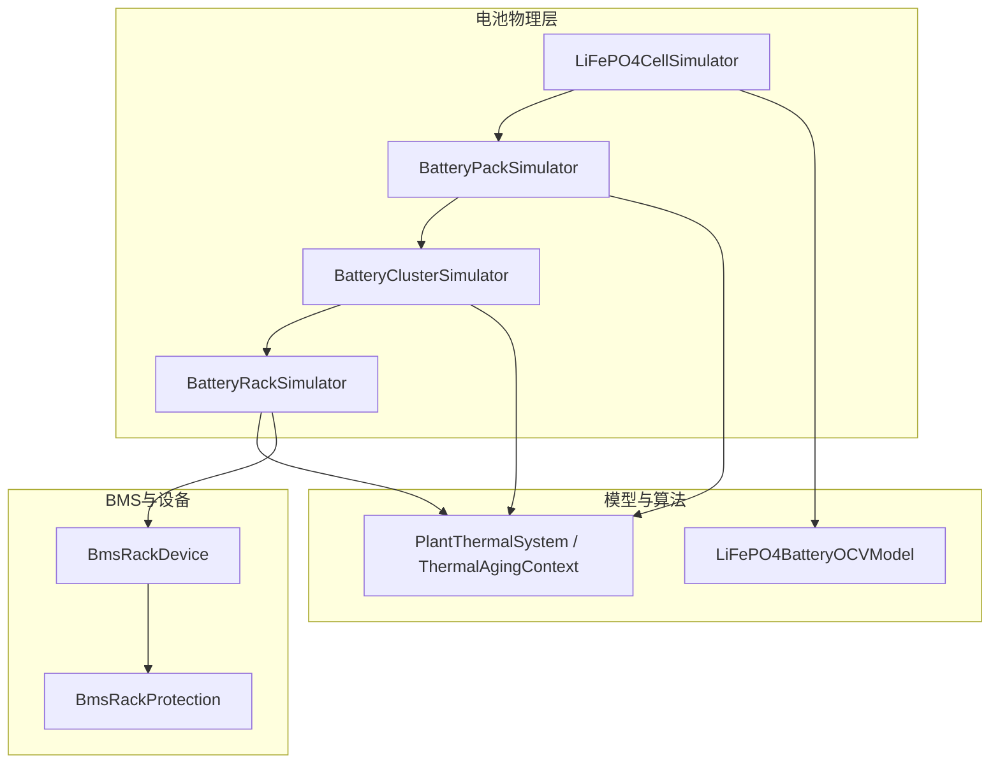
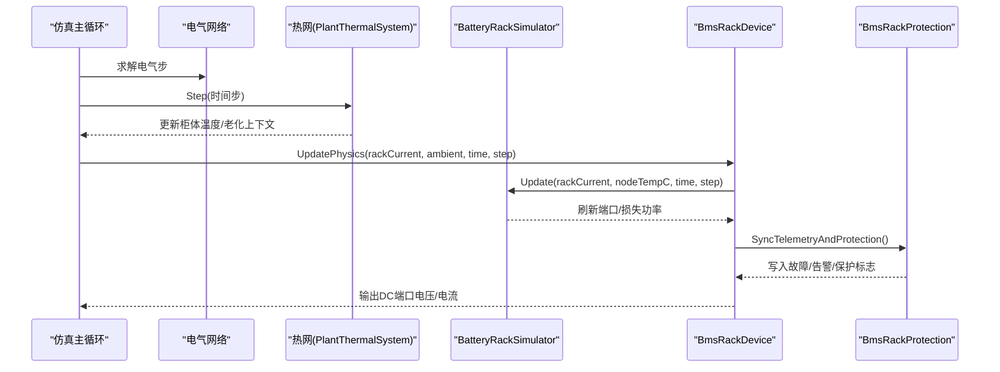
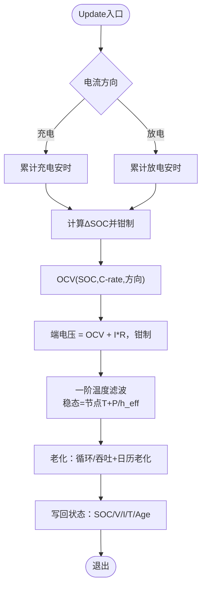
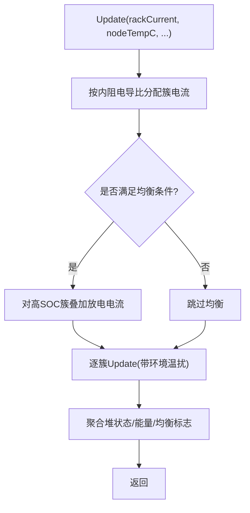
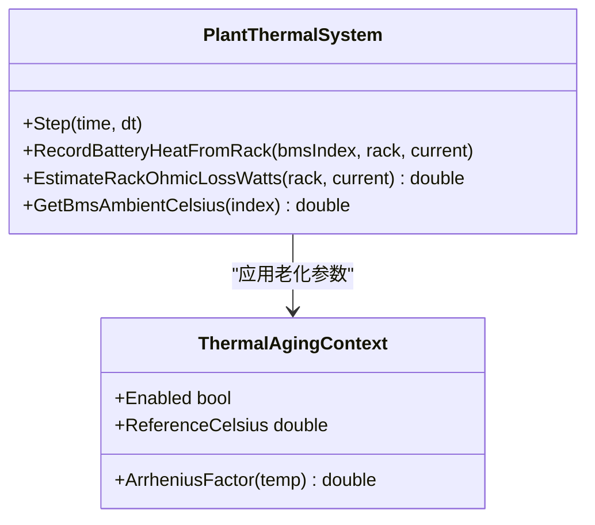
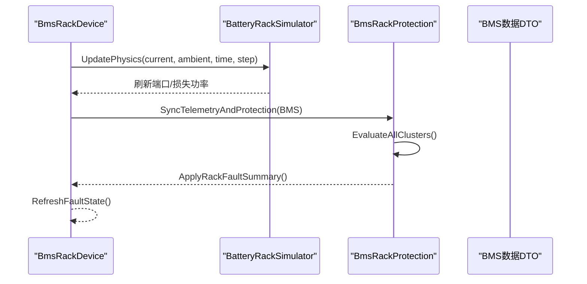
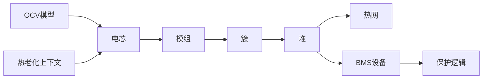

# 电池建模系统

<cite>
**本文引用的文件**
- [batteryCellModel.cs](file://EssDeviceSimModel/Battery/batteryCellModel.cs)
- [OCVModel.cs](file://EssDeviceSimModel/Battery/OCVModel.cs)
- [batteryPackModel.cs](file://EssDeviceSimModel/Battery/batteryPackModel.cs)
- [batteryClusterModel.cs](file://EssDeviceSimModel/Battery/batteryClusterModel.cs)
- [batteryHeapModel.cs](file://EssDeviceSimModel/Battery/batteryHeapModel.cs)
- [BmsRackDevice.cs](file://EssDeviceSimModel/Devices/BmsRackDevice.cs)
- [BmsRackProtection.cs](file://EssDeviceSimModel/Devices/BmsRackProtection.cs)
- [PlantThermalSystem.cs](file://EssDeviceSimModel/Thermal/PlantThermalSystem.cs)
- [ThermalAgingContext.cs](file://EssDeviceSimModel/Thermal/ThermalAgingContext.cs)
- [CellTemperatureModelTests.cs](file://EssSimulator.Tests/Battery/CellTemperatureModelTests.cs)
- [RackPassiveBalanceTests.cs](file://EssSimulator.Tests/Battery/RackPassiveBalanceTests.cs)
</cite>

## 目录
1. [简介](#简介)
2. [项目结构](#项目结构)
3. [核心组件](#核心组件)
4. [架构总览](#架构总览)
5. [详细组件分析](#详细组件分析)
6. [依赖关系分析](#依赖关系分析)
7. [性能考虑](#性能考虑)
8. [故障排查指南](#故障排查指南)
9. [结论](#结论)
10. [附录](#附录)

## 简介
本文件面向储能仿真系统中的“电池建模子系统”，系统性阐述从电芯到电池堆的多层次模型实现，包括：
- 电芯模型：SOC、端电压、温度与老化；
- OCV（开路电压）模型：SOC-电压映射与倍率修正；
- 模组/簇/堆模型：串并联拓扑、热扩散、均衡与保护；
- 热管理与老化：Arrhenius日历老化、柜体热网、节点温度对散热的影响；
- BMS集成与安全保护：阈值评估、故障汇总、PCS并网链路；
- 仿真精度验证与优化建议。

## 项目结构
电池建模相关代码集中在 EssDeviceSimModel 的 Battery、Devices、Thermal 三个子域，并通过测试用例覆盖关键行为。

图表来源
- [batteryCellModel.cs:35-213](file://EssDeviceSimModel/Battery/batteryCellModel.cs#L35-L213)
- [batteryPackModel.cs:44-203](file://EssDeviceSimModel/Battery/batteryPackModel.cs#L44-L203)
- [batteryClusterModel.cs:42-188](file://EssDeviceSimModel/Battery/batteryClusterModel.cs#L42-L188)
- [batteryHeapModel.cs:89-323](file://EssDeviceSimModel/Battery/batteryHeapModel.cs#L89-L323)
- [OCVModel.cs:9-189](file://EssDeviceSimModel/Battery/OCVModel.cs#L9-L189)
- [PlantThermalSystem.cs:13-143](file://EssDeviceSimModel/Thermal/PlantThermalSystem.cs#L13-L143)
- [BmsRackDevice.cs:14-167](file://EssDeviceSimModel/Devices/BmsRackDevice.cs#L14-L167)
- [BmsRackProtection.cs:8-321](file://EssDeviceSimModel/Devices/BmsRackProtection.cs#L8-L321)

章节来源
- [batteryCellModel.cs:35-213](file://EssDeviceSimModel/Battery/batteryCellModel.cs#L35-L213)
- [batteryPackModel.cs:44-203](file://EssDeviceSimModel/Battery/batteryPackModel.cs#L44-L203)
- [batteryClusterModel.cs:42-188](file://EssDeviceSimModel/Battery/batteryClusterModel.cs#L42-L188)
- [batteryHeapModel.cs:89-323](file://EssDeviceSimModel/Battery/batteryHeapModel.cs#L89-L323)
- [OCVModel.cs:9-189](file://EssDeviceSimModel/Battery/OCVModel.cs#L9-L189)
- [PlantThermalSystem.cs:13-143](file://EssDeviceSimModel/Thermal/PlantThermalSystem.cs#L13-L143)
- [BmsRackDevice.cs:14-167](file://EssDeviceSimModel/Devices/BmsRackDevice.cs#L14-L167)
- [BmsRackProtection.cs:8-321](file://EssDeviceSimModel/Devices/BmsRackProtection.cs#L8-L321)

## 核心组件
- 电芯模型：提供 SOC、端电压、温度、老化等状态更新，支持热环境（节点温度）影响散热效率。
- OCV 模型：基于 SOC 查表插值获取开路电压，并叠加充放电倍率的非线性电压偏移；支持电压反算 SOC。
- 模组模型：二维串并联电芯集合，含一维热扩散，聚合统计（电压/温度/SOC/SOH）。
- 簇模型：多个模组的串联，聚合簇级指标，支持簇内不一致性模拟。
- 堆模型：多簇并联，按内阻分配电流，内置被动均衡（高 SOC 簇泄放），累计充放电能量。
- 热管理：气候与柜体热区步进，Arrhenius 日历老化，估算堆欧姆损耗注入热网。
- BMS 设备与保护：将物理量映射为 BMS 数据，执行阈值保护与故障汇总，维护 PCS 并网链路。

章节来源
- [batteryCellModel.cs:35-213](file://EssDeviceSimModel/Battery/batteryCellModel.cs#L35-L213)
- [OCVModel.cs:9-189](file://EssDeviceSimModel/Battery/OCVModel.cs#L9-L189)
- [batteryPackModel.cs:44-203](file://EssDeviceSimModel/Battery/batteryPackModel.cs#L44-L203)
- [batteryClusterModel.cs:42-188](file://EssDeviceSimModel/Battery/batteryClusterModel.cs#L42-L188)
- [batteryHeapModel.cs:89-323](file://EssDeviceSimModel/Battery/batteryHeapModel.cs#L89-L323)
- [PlantThermalSystem.cs:13-143](file://EssDeviceSimModel/Thermal/PlantThermalSystem.cs#L13-L143)
- [BmsRackDevice.cs:14-167](file://EssDeviceSimModel/Devices/BmsRackDevice.cs#L14-L167)
- [BmsRackProtection.cs:8-321](file://EssDeviceSimModel/Devices/BmsRackProtection.cs#L8-L321)

## 架构总览
电池仿真在每步中由上层驱动：先推进电气网络，再推进热网，最后进行 PCS–BMS 耦合与保护评估。

图表来源
- [PlantThermalSystem.cs:58-69](file://EssDeviceSimModel/Thermal/PlantThermalSystem.cs#L58-L69)
- [BmsRackDevice.cs:86-131](file://EssDeviceSimModel/Devices/BmsRackDevice.cs#L86-L131)
- [batteryHeapModel.cs:152-175](file://EssDeviceSimModel/Battery/batteryHeapModel.cs#L152-L175)

## 详细组件分析

### 电芯模型（LiFePO4CellSimulator）
- 功能要点
  - SOC 更新：基于电流与时间步积分，边界钳制至[0,1]。
  - 端电压：OCV(SOC, C-rate, 充/放方向) + 内阻压降，并钳制至最小/最大电压。
  - 温度模型：一阶热容滤波，稳态温度=节点温度+损耗/等效散热系数；散热效率随节点温度升高而降低。
  - 老化：循环/吞吐累积 + Arrhenius 日历老化（可配置）。
  - 热设 SOC：SetSoc 直接设置 SOC、剩余容量与 OCV 电压。
- 复杂度
  - 单步 O(1)，温度与老化计算常数开销。
- 错误处理
  - SOC 越界钳制；电压上下限保护；温度收敛稳定。

图表来源
- [batteryCellModel.cs:90-213](file://EssDeviceSimModel/Battery/batteryCellModel.cs#L90-L213)
- [OCVModel.cs:43-124](file://EssDeviceSimModel/Battery/OCVModel.cs#L43-L124)
- [ThermalAgingContext.cs:27-35](file://EssDeviceSimModel/Thermal/ThermalAgingContext.cs#L27-L35)

章节来源
- [batteryCellModel.cs:35-213](file://EssDeviceSimModel/Battery/batteryCellModel.cs#L35-L213)
- [OCVModel.cs:9-189](file://EssDeviceSimModel/Battery/OCVModel.cs#L9-L189)
- [ThermalAgingContext.cs:5-35](file://EssDeviceSimModel/Thermal/ThermalAgingContext.cs#L5-L35)

### OCV 模型（LiFePO4BatteryOCVModel）
- 功能要点
  - 基于 SOC 查表插值得到开路电压；
  - 根据充/放方向与 C-rate 计算非线性电压偏移（参考 2C）；
  - 支持电压反算 SOC（二分迭代）。
- 复杂度
  - 正向 O(1) 插值；反向 O(logN) 或固定迭代次数。

章节来源
- [OCVModel.cs:9-189](file://EssDeviceSimModel/Battery/OCVModel.cs#L9-L189)

### 模组模型（BatteryPackSimulator）
- 功能要点
  - 二维串并联电芯集合；每步均分并联电流；
  - 串联方向一维热扩散，平滑相邻电芯温差；
  - 聚合统计：总电压、单体极值、平均温度、SOC/SOH、剩余容量（短板效应）。
- 复杂度
  - 每步 O(Ns×Np)。

章节来源
- [batteryPackModel.cs:44-203](file://EssDeviceSimModel/Battery/batteryPackModel.cs#L44-L203)

### 簇模型（BatteryClusterSimulator）
- 功能要点
  - 多个模组的串联；为每个模组引入随机差异；
  - 聚合簇级指标：总电压、电流、电压不平衡、温度差、SOC/SOH、容量。
- 复杂度
  - 每步 O(Npacks)。

章节来源
- [batteryClusterModel.cs:42-188](file://EssDeviceSimModel/Battery/batteryClusterModel.cs#L42-L188)

### 堆模型（BatteryRackSimulator）
- 功能要点
  - 多簇并联，按内阻电导比分配电流；
  - 被动均衡：当簇间 SOC 差超过启动阈值且满足条件（如静置）时，对高 SOC 簇叠加小放电电流（电阻泄放型）；
  - 累计充放电能量（kWh）；聚合堆级指标。
- 复杂度
  - 每步 O(Nclusters)。

图表来源
- [batteryHeapModel.cs:152-229](file://EssDeviceSimModel/Battery/batteryHeapModel.cs#L152-L229)
- [batteryHeapModel.cs:247-309](file://EssDeviceSimModel/Battery/batteryHeapModel.cs#L247-L309)

章节来源
- [batteryHeapModel.cs:89-323](file://EssDeviceSimModel/Battery/batteryHeapModel.cs#L89-L323)

### 热管理与老化
- 热网步进：气候模型与柜体热区步进，提供 BMS 环境温度；记录堆欧姆损耗注入柜体热网。
- 日历老化：Arrhenius 公式相对参考温度加速；可由配置开关。
- 节点温度：作为电芯热环境，节点温度越高，散热效率越低，导致电芯相对节点温升更大。

图表来源
- [PlantThermalSystem.cs:13-143](file://EssDeviceSimModel/Thermal/PlantThermalSystem.cs#L13-L143)
- [ThermalAgingContext.cs:5-35](file://EssDeviceSimModel/Thermal/ThermalAgingContext.cs#L5-L35)

章节来源
- [PlantThermalSystem.cs:13-143](file://EssDeviceSimModel/Thermal/PlantThermalSystem.cs#L13-L143)
- [ThermalAgingContext.cs:5-35](file://EssDeviceSimModel/Thermal/ThermalAgingContext.cs#L5-L35)

### BMS 设备与安全保护
- BmsRackDevice：封装 Rack 物理模型，暴露 DC 端口、温度感知、PCS 并网链路；每步推进物理并同步端口；提供 TrySetSoc（待机限制）。
- BmsRackProtection：簇级阈值评估（过/欠压、过/欠流、温度、绝缘、压差/温差、端子/铜排高温等），状态机回跳避免误判；汇总 Rack 级故障/告警/保护标志。

图表来源
- [BmsRackDevice.cs:86-131](file://EssDeviceSimModel/Devices/BmsRackDevice.cs#L86-L131)
- [BmsRackProtection.cs:10-226](file://EssDeviceSimModel/Devices/BmsRackProtection.cs#L10-L226)

章节来源
- [BmsRackDevice.cs:14-167](file://EssDeviceSimModel/Devices/BmsRackDevice.cs#L14-L167)
- [BmsRackProtection.cs:8-321](file://EssDeviceSimModel/Devices/BmsRackProtection.cs#L8-L321)

## 依赖关系分析
- 低层依赖：电芯依赖 OCV 模型与热老化上下文；模组/簇/堆依次组合。
- 中层依赖：堆依赖热网估算损耗；设备依赖堆与保护逻辑。
- 高层依赖：仿真主循环协调电气、热、BMS 设备。

图表来源
- [batteryCellModel.cs:35-213](file://EssDeviceSimModel/Battery/batteryCellModel.cs#L35-L213)
- [batteryPackModel.cs:44-203](file://EssDeviceSimModel/Battery/batteryPackModel.cs#L44-L203)
- [batteryClusterModel.cs:42-188](file://EssDeviceSimModel/Battery/batteryClusterModel.cs#L42-L188)
- [batteryHeapModel.cs:89-323](file://EssDeviceSimModel/Battery/batteryHeapModel.cs#L89-L323)
- [PlantThermalSystem.cs:13-143](file://EssDeviceSimModel/Thermal/PlantThermalSystem.cs#L13-L143)
- [BmsRackDevice.cs:14-167](file://EssDeviceSimModel/Devices/BmsRackDevice.cs#L14-L167)
- [BmsRackProtection.cs:8-321](file://EssDeviceSimModel/Devices/BmsRackProtection.cs#L8-L321)

章节来源
- [batteryCellModel.cs:35-213](file://EssDeviceSimModel/Battery/batteryCellModel.cs#L35-L213)
- [batteryPackModel.cs:44-203](file://EssDeviceSimModel/Battery/batteryPackModel.cs#L44-L203)
- [batteryClusterModel.cs:42-188](file://EssDeviceSimModel/Battery/batteryClusterModel.cs#L42-L188)
- [batteryHeapModel.cs:89-323](file://EssDeviceSimModel/Battery/batteryHeapModel.cs#L89-L323)
- [PlantThermalSystem.cs:13-143](file://EssDeviceSimModel/Thermal/PlantThermalSystem.cs#L13-L143)
- [BmsRackDevice.cs:14-167](file://EssDeviceSimModel/Devices/BmsRackDevice.cs#L14-L167)
- [BmsRackProtection.cs:8-321](file://EssDeviceSimModel/Devices/BmsRackProtection.cs#L8-L321)

## 性能考虑
- 时间步长与温度模型：一阶滤波与 tau 计算需保证数值稳定；较大步长可能引起过冲，建议结合仿真步长调参。
- 均衡策略：被动均衡仅在静置或小电流下启用，避免与大功率充放电冲突；合理设置 Start/Stop 阈值与 C-rate。
- 热网耦合：堆欧姆损耗估算用于热网注入，注意内阻参数一致性，避免热-电失配。
- 并行度：模组/簇/堆内部均为线性遍历，适合向量化或并行化以提升大规模堆仿真性能。

## 故障排查指南
- 温度异常
  - 现象：电芯温度不收敛或温升过大。
  - 检查：节点温度输入是否正确；散热效率函数是否被高节点温度抑制；内阻与质量参数是否合理。
  - 参考：单元温度独立性与收敛性测试。
- 均衡未生效
  - 现象：簇间 SOC 差不减小。
  - 检查：是否处于 IdleOnly 模式且堆电流超限；Start/Stop 阈值与 BleedAboveMinMargin 设置；平衡 C-rate 是否为正。
- 保护频繁触发
  - 现象：过压/欠压/过流/温度等保护反复置位。
  - 检查：阈值与恢复阈值是否合理；状态机 SnapUnder/SnapOver 行为是否符合预期；PCS 指令是否持续超限。
- 无法热设 SOC
  - 现象：TrySetSoc 失败。
  - 检查：是否在充/放电中；接口要求待机；确认传入 SOC 范围合法。

章节来源
- [CellTemperatureModelTests.cs:28-79](file://EssSimulator.Tests/Battery/CellTemperatureModelTests.cs#L28-L79)
- [RackPassiveBalanceTests.cs:30-109](file://EssSimulator.Tests/Battery/RackPassiveBalanceTests.cs#L30-L109)
- [BmsRackProtection.cs:273-318](file://EssDeviceSimModel/Devices/BmsRackProtection.cs#L273-L318)
- [BmsRackDevice.cs:98-114](file://EssDeviceSimModel/Devices/BmsRackDevice.cs#L98-L114)

## 结论
该电池建模系统以“电芯-模组-簇-堆”四层结构为核心，结合 OCV 模型、温度与老化、被动均衡与 BMS 保护，形成闭环仿真能力。通过合理的参数配置与热-电耦合，可在工程尺度上复现真实电池行为，并为控制策略与安全保护提供可靠基准。

## 附录

### 配置与使用示例（路径指引）
- 配置电芯参数
  - 参考：创建 CellSpecifications 并初始化 LiFePO4CellSimulator。
  - 路径：[batteryCellModel.cs:10-69](file://EssDeviceSimModel/Battery/batteryCellModel.cs#L10-L69)
- 设置充放电策略
  - 参考：在堆/簇/模组层级调用 Update，传入电流、节点温度、时间步。
  - 路径：
    - [batteryHeapModel.cs:152-175](file://EssDeviceSimModel/Battery/batteryHeapModel.cs#L152-L175)
    - [batteryClusterModel.cs:90-105](file://EssDeviceSimModel/Battery/batteryClusterModel.cs#L90-L105)
    - [batteryPackModel.cs:100-155](file://EssDeviceSimModel/Battery/batteryPackModel.cs#L100-L155)
- 处理异常状态
  - 参考：BMS 保护评估与故障汇总；TryClearChargeDischargeFaults 清除方向性故障。
  - 路径：
    - [BmsRackProtection.cs:177-265](file://EssDeviceSimModel/Devices/BmsRackProtection.cs#L177-L265)
    - [BmsRackDevice.cs:116-131](file://EssDeviceSimModel/Devices/BmsRackDevice.cs#L116-L131)

### 仿真精度验证方法
- 单元温度收敛性：对比不同节点温度下的稳态温升，验证一阶热模型。
  - 参考：[CellTemperatureModelTests.cs:46-79](file://EssSimulator.Tests/Battery/CellTemperatureModelTests.cs#L46-L79)
- 被动均衡有效性：在静置条件下观察 SOC 差缩小与 IsPassiveBalancing 标志。
  - 参考：[RackPassiveBalanceTests.cs:60-87](file://EssSimulator.Tests/Battery/RackPassiveBalanceTests.cs#L60-L87)
- OCV 映射一致性：在不同 C-rate 下验证电压-SOC 曲线与反算误差。
  - 参考：[OCVModel.cs:43-108](file://EssDeviceSimModel/Battery/OCVModel.cs#L43-L108)

### 性能优化技巧
- 合理设置时间步长与热时间常数，避免数值不稳定。
- 均衡参数调优：IdleOnly 与阈值配合，减少不必要的能耗与扰动。
- 热网参数校准：确保堆欧姆损耗估算与热网一致，避免热-电失配。
- 大规模仿真：利用数组/并行操作优化模组/簇/堆遍历。