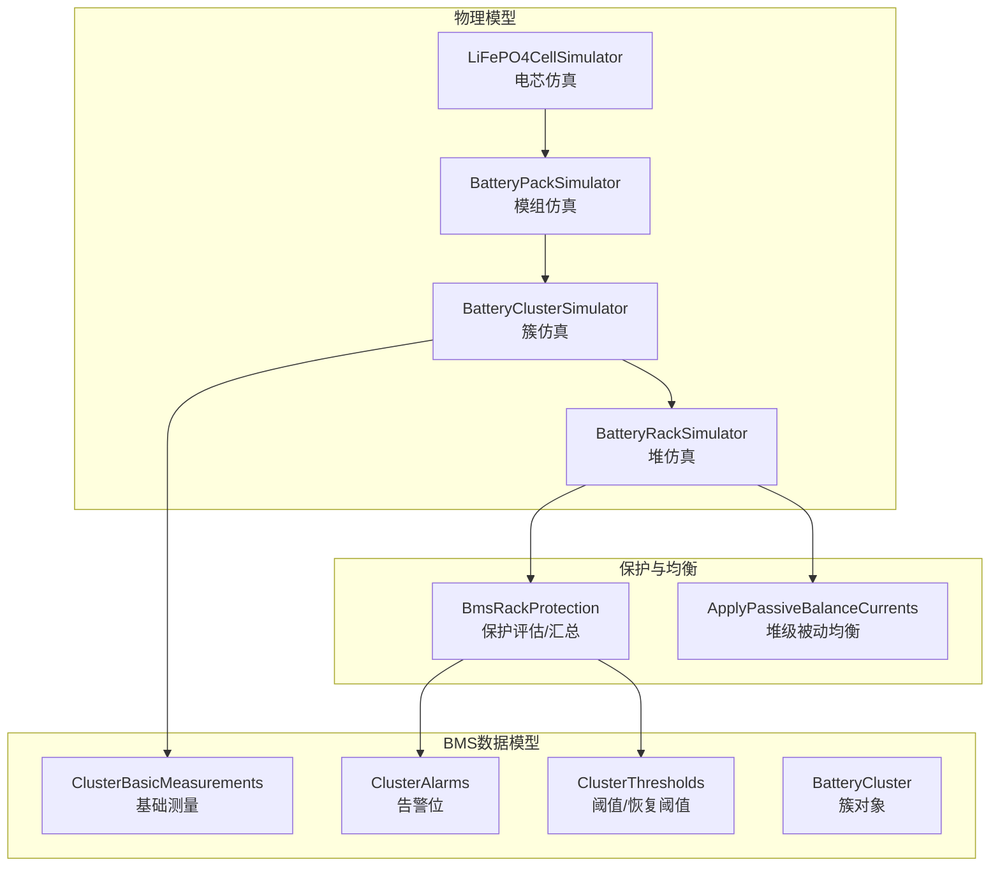
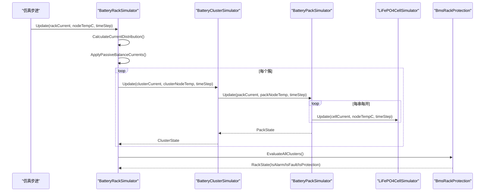
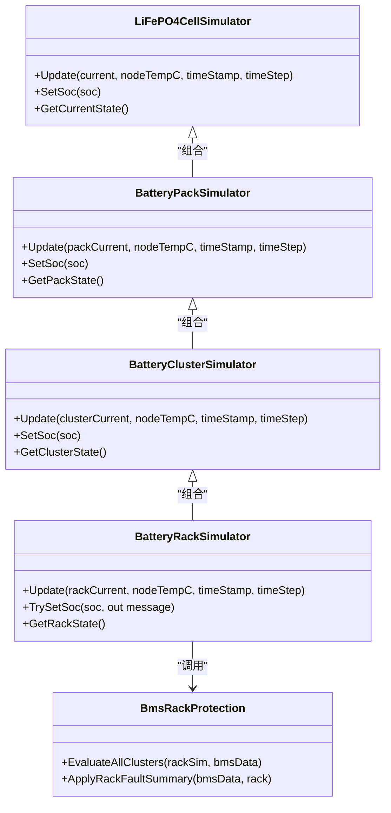

# 电池簇模型

<cite>
**本文引用的文件**
- [batteryClusterModel.cs](file://EssDeviceSimModel/Battery/batteryClusterModel.cs)
- [batteryPackModel.cs](file://EssDeviceSimModel/Battery/batteryPackModel.cs)
- [batteryCellModel.cs](file://EssDeviceSimModel/Battery/batteryCellModel.cs)
- [OCVModel.cs](file://EssDeviceSimModel/Battery/OCVModel.cs)
- [batteryHeapModel.cs](file://EssDeviceSimModel/Battery/batteryHeapModel.cs)
- [BatteryCluster.cs](file://EssSimModelApi/Bms/BatteryCluster.cs)
- [ClusterBasicMeasurements.cs](file://EssSimModelApi/Bms/ClusterBasicMeasurements.cs)
- [ClusterAlarms.cs](file://EssSimModelApi/Bms/ClusterAlarms.cs)
- [ClusterThresholds.cs](file://EssSimModelApi/Bms/ClusterThresholds.cs)
- [BmsRackProtection.cs](file://EssDeviceSimModel/Devices/BmsRackProtection.cs)
</cite>

## 目录
1. [简介](#简介)
2. [项目结构](#项目结构)
3. [核心组件](#核心组件)
4. [架构总览](#架构总览)
5. [详细组件分析](#详细组件分析)
6. [依赖关系分析](#依赖关系分析)
7. [性能与一致性考量](#性能与一致性考量)
8. [故障与安全边界](#故障与安全边界)
9. [使用示例与最佳实践](#使用示例与最佳实践)
10. [结论](#结论)

## 简介
本文件系统化说明电池簇模型的层次化结构、均衡策略、状态聚合与异常处理机制，覆盖从电芯到模组、簇、堆的完整建模链路。重点包括：
- 多电芯串并联配置与热耦合效应
- 簇内一致性监控（电压、温度、SOC）
- 簇级状态管理与保护逻辑
- 堆级被动均衡算法与电流分配
- 配置方法、状态聚合算法、异常处理流程
- 安全边界控制与可观测性

## 项目结构
电池簇相关代码主要分布在以下模块：
- 物理模型层：电芯、模组、簇、堆仿真器
- BMS数据模型层：簇测量、告警、阈值
- 保护与均衡：簇/堆级保护评估与被动均衡

图表来源
- [batteryCellModel.cs:35-177](file://EssDeviceSimModel/Battery/batteryCellModel.cs#L35-L177)
- [batteryPackModel.cs:44-203](file://EssDeviceSimModel/Battery/batteryPackModel.cs#L44-L203)
- [batteryClusterModel.cs:42-153](file://EssDeviceSimModel/Battery/batteryClusterModel.cs#L42-L153)
- [batteryHeapModel.cs:89-311](file://EssDeviceSimModel/Battery/batteryHeapModel.cs#L89-L311)
- [ClusterBasicMeasurements.cs:7-103](file://EssSimModelApi/Bms/ClusterBasicMeasurements.cs#L7-L103)
- [ClusterAlarms.cs:7-451](file://EssSimModelApi/Bms/ClusterAlarms.cs#L7-L451)
- [ClusterThresholds.cs:7-318](file://EssSimModelApi/Bms/ClusterThresholds.cs#L7-L318)
- [BmsRackProtection.cs:71-175](file://EssDeviceSimModel/Devices/BmsRackProtection.cs#L71-L175)

章节来源
- [batteryClusterModel.cs:9-153](file://EssDeviceSimModel/Battery/batteryClusterModel.cs#L9-L153)
- [batteryPackModel.cs:9-203](file://EssDeviceSimModel/Battery/batteryPackModel.cs#L9-L203)
- [batteryCellModel.cs:9-177](file://EssDeviceSimModel/Battery/batteryCellModel.cs#L9-L177)
- [batteryHeapModel.cs:9-311](file://EssDeviceSimModel/Battery/batteryHeapModel.cs#L9-L311)

## 核心组件
- 电芯仿真器：实现SOC、电压、温度、老化、热模型与OCV映射
- 模组仿真器：管理串并联电芯集合，计算模组总压/温/SOC/容量，支持热扩散
- 簇仿真器：串联多个模组，聚合簇级电压、温度、SOC、容量与健康度
- 堆仿真器：并联多个簇，按内阻分配电流，执行堆级被动均衡，统计能量累计
- BMS数据模型：提供簇测量、告警位、阈值与恢复阈值，供保护逻辑读写
- 保护逻辑：基于方向（充/放）与阈值进行三级判定（保护/告警/故障），并汇总至堆级状态

章节来源
- [batteryCellModel.cs:35-177](file://EssDeviceSimModel/Battery/batteryCellModel.cs#L35-L177)
- [batteryPackModel.cs:44-203](file://EssDeviceSimModel/Battery/batteryPackModel.cs#L44-L203)
- [batteryClusterModel.cs:42-153](file://EssDeviceSimModel/Battery/batteryClusterModel.cs#L42-L153)
- [batteryHeapModel.cs:89-311](file://EssDeviceSimModel/Battery/batteryHeapModel.cs#L89-L311)
- [ClusterBasicMeasurements.cs:7-103](file://EssSimModelApi/Bms/ClusterBasicMeasurements.cs#L7-L103)
- [ClusterAlarms.cs:7-451](file://EssSimModelApi/Bms/ClusterAlarms.cs#L7-L451)
- [ClusterThresholds.cs:7-318](file://EssSimModelApi/Bms/ClusterThresholds.cs#L7-L318)
- [BmsRackProtection.cs:71-175](file://EssDeviceSimModel/Devices/BmsRackProtection.cs#L71-L175)

## 架构总览
电池簇模型采用分层仿真+保护评估的架构：
- 底层电芯通过OCV-SOC曲线与内阻、热模型更新端电压与温度
- 模组将串并联电芯聚合为等效单元，考虑热扩散与短板容量
- 簇串联模组，聚合总压、温差、SOC差等一致性指标
- 堆并联簇，按内阻分配电流，并在静置或小电流时执行被动均衡
- 保护逻辑依据方向与阈值对簇进行三级判定，汇总到堆级故障/报警/保护标志

图表来源
- [batteryHeapModel.cs:152-175](file://EssDeviceSimModel/Battery/batteryHeapModel.cs#L152-L175)
- [batteryClusterModel.cs:90-105](file://EssDeviceSimModel/Battery/batteryClusterModel.cs#L90-L105)
- [batteryPackModel.cs:100-155](file://EssDeviceSimModel/Battery/batteryPackModel.cs#L100-L155)
- [batteryCellModel.cs:90-177](file://EssDeviceSimModel/Battery/batteryCellModel.cs#L90-L177)
- [BmsRackProtection.cs:10-33](file://EssDeviceSimModel/Devices/BmsRackProtection.cs#L10-L33)

## 详细组件分析

### 电芯模型（LiFePO4CellSimulator）
- 关键能力
  - OCV-SOC映射：根据SOC与倍率获取端电压，支持充电/放电非线性偏移
  - 一阶热模型：以节点温度为环境，考虑质量、比热容与散热系数，计算稳态温度与时间常数
  - 老化模型：循环次数与安时吞吐累积，结合阿伦尼乌斯日历老化
  - 边界保护：SOC与电压范围钳制
- 复杂度
  - 单步更新O(1)，温度与老化为常数时间
- 优化点
  - 插值与查表开销较小；可通过缓存减少重复计算
- 错误处理
  - SOC越界钳制；电压边界检查；温度滤波避免数值震荡

章节来源
- [batteryCellModel.cs:35-177](file://EssDeviceSimModel/Battery/batteryCellModel.cs#L35-L177)
- [OCVModel.cs:9-189](file://EssDeviceSimModel/Battery/OCVModel.cs#L9-L189)

### 模组模型（BatteryPackSimulator）
- 关键能力
  - 串并联组织：二维数组表示S×P结构，电流均分到并联支路
  - 热扩散：沿串联方向相邻电芯温度平滑，模拟Pack内传热
  - 容量聚合：取最弱串联段容量作为剩余容量（短板效应）
  - 状态聚合：最大/最小/平均电压、温度、SOC，健康度取均值
- 复杂度
  - 更新O(S×P)，热扩散O(S)
- 优化点
  - 并行更新电芯可提升性能；热扩散可限制步长或降低扩散系数
- 错误处理
  - 空集合保护；温度回写前校验

章节来源
- [batteryPackModel.cs:44-203](file://EssDeviceSimModel/Battery/batteryPackModel.cs#L44-L203)

### 簇模型（BatteryClusterSimulator）
- 关键能力
  - 串联模组聚合：总电压为各模组电压之和；SOC取最小模组SOC保守估计
  - 一致性监控：电压不平衡度、温差、SOC差
  - 容量与健康度：总容量按配置与SOH加权；剩余容量取最小模组剩余容量
  - 热环境差异：簇内不同位置引入随机温度扰动
- 复杂度
  - 更新O(Npack)，状态聚合O(Npack)
- 优化点
  - 批量LINQ操作可替换为显式循环以提升性能
- 错误处理
  - 空簇保护；温度与SOC边界检查

章节来源
- [batteryClusterModel.cs:42-153](file://EssDeviceSimModel/Battery/batteryClusterModel.cs#L42-L153)

### 堆模型与均衡（BatteryRackSimulator）
- 关键能力
  - 电流分配：按簇内阻倒数比例分配总电流（电导比）
  - 被动均衡：在静置或小电流条件下，对高SOC簇叠加放电电流，能耗散方式缩小SOC差
  - 能量累计：积分计算累计充电/放电能量（kWh）
  - 状态聚合：簇间电压差、电流不平衡比例、SOC差、温度极值
- 复杂度
  - 电流分配O(Ncluster)；均衡O(Ncluster)；状态聚合O(Ncluster)
- 优化点
  - 均衡仅在IdleOnly条件满足时执行，降低计算负载
- 错误处理
  - 零电导保护；均衡参数合法性检查

章节来源
- [batteryHeapModel.cs:89-311](file://EssDeviceSimModel/Battery/batteryHeapModel.cs#L89-L311)

### BMS数据模型与保护（ClusterBasicMeasurements / ClusterAlarms / ClusterThresholds / BmsRackProtection）
- 关键能力
  - 测量：总压、电流、功率、SOC、SOH、绝缘、最高/最低单体电压与温度、最大允许充放电功率/电流
  - 告警：多级保护/告警/故障位，含过压/欠压、过流、温度、绝缘、压差、温差、低SOC等
  - 阈值：保护/告警/故障三级阈值及恢复阈值，带回滞
  - 保护评估：按充/放方向分别评估，使用UpdateOver/UpdateUnder状态机，支持“一次性落入等级”
  - 汇总：将簇级告警汇总为堆级IsAlarm/IsFault/IsProtection，并结合SOC/SOH规则设置故障码
- 复杂度
  - 评估O(Ncluster)；汇总O(1)
- 优化点
  - 方向门控减少不必要评估；阈值比较向量化
- 错误处理
  - 待机清除方向相关故障；防止误触发

章节来源
- [ClusterBasicMeasurements.cs:7-103](file://EssSimModelApi/Bms/ClusterBasicMeasurements.cs#L7-L103)
- [ClusterAlarms.cs:7-451](file://EssSimModelApi/Bms/ClusterAlarms.cs#L7-L451)
- [ClusterThresholds.cs:7-318](file://EssSimModelApi/Bms/ClusterThresholds.cs#L7-L318)
- [BmsRackProtection.cs:71-175](file://EssDeviceSimModel/Devices/BmsRackProtection.cs#L71-L175)
- [BmsRackProtection.cs:177-226](file://EssDeviceSimModel/Devices/BmsRackProtection.cs#L177-L226)
- [BmsRackProtection.cs:228-318](file://EssDeviceSimModel/Devices/BmsRackProtection.cs#L228-L318)

## 依赖关系分析
- 电芯依赖OCV模型与热老化上下文
- 模组依赖电芯集合与热扩散逻辑
- 簇依赖模组集合与一致性聚合
- 堆依赖簇集合、电流分配与被动均衡
- 保护逻辑依赖BMS数据模型与阈值配置

图表来源
- [batteryCellModel.cs:35-177](file://EssDeviceSimModel/Battery/batteryCellModel.cs#L35-L177)
- [batteryPackModel.cs:44-203](file://EssDeviceSimModel/Battery/batteryPackModel.cs#L44-L203)
- [batteryClusterModel.cs:42-153](file://EssDeviceSimModel/Battery/batteryClusterModel.cs#L42-L153)
- [batteryHeapModel.cs:89-311](file://EssDeviceSimModel/Battery/batteryHeapModel.cs#L89-L311)
- [BmsRackProtection.cs:10-33](file://EssDeviceSimModel/Devices/BmsRackProtection.cs#L10-L33)

章节来源
- [batteryCellModel.cs:35-177](file://EssDeviceSimModel/Battery/batteryCellModel.cs#L35-L177)
- [batteryPackModel.cs:44-203](file://EssDeviceSimModel/Battery/batteryPackModel.cs#L44-L203)
- [batteryClusterModel.cs:42-153](file://EssDeviceSimModel/Battery/batteryClusterModel.cs#L42-L153)
- [batteryHeapModel.cs:89-311](file://EssDeviceSimModel/Battery/batteryHeapModel.cs#L89-L311)
- [BmsRackProtection.cs:10-33](file://EssDeviceSimModel/Devices/BmsRackProtection.cs#L10-L33)

## 性能与一致性考量
- 性能
  - 电芯/模组/簇/堆更新均为线性复杂度，适合实时仿真
  - 被动均衡仅在IdleOnly条件满足时执行，降低CPU占用
  - 热扩散与温度滤波避免高频振荡
- 一致性
  - 簇内电压不平衡度、温差、SOC差用于评估一致性与触发均衡
  - 堆级电流不平衡比例反映并联簇差异
  - 短板容量策略确保保守估计剩余能量
- 热耦合
  - 电芯温度受节点温度影响，Pack内热扩散平滑温差
  - 簇内不同位置引入随机温度扰动，模拟真实热分布

章节来源
- [batteryHeapModel.cs:152-175](file://EssDeviceSimModel/Battery/batteryHeapModel.cs#L152-L175)
- [batteryPackModel.cs:117-151](file://EssDeviceSimModel/Battery/batteryPackModel.cs#L117-L151)
- [batteryClusterModel.cs:90-105](file://EssDeviceSimModel/Battery/batteryClusterModel.cs#L90-L105)
- [batteryCellModel.cs:130-147](file://EssDeviceSimModel/Battery/batteryCellModel.cs#L130-L147)

## 故障与安全边界
- 保护评估
  - 按充/放方向分别评估过压/欠压、过流、温度、绝缘、压差、温差、低SOC
  - 使用UpdateOver/UpdateUnder状态机，支持回滞与“一次性落入等级”
- 安全边界
  - 电芯SOC与电压边界钳制
  - 堆级SOC边界（如充电≥0.95、放电≤0.05）触发故障
  - SOH过低直接置故障
- 异常处理
  - 待机时可清除方向相关故障，避免误触发
  - 零电导保护防止除零异常
  - 均衡参数合法性检查，防止无效操作

章节来源
- [BmsRackProtection.cs:71-175](file://EssDeviceSimModel/Devices/BmsRackProtection.cs#L71-L175)
- [BmsRackProtection.cs:177-226](file://EssDeviceSimModel/Devices/BmsRackProtection.cs#L177-L226)
- [BmsRackProtection.cs:228-318](file://EssDeviceSimModel/Devices/BmsRackProtection.cs#L228-L318)
- [batteryCellModel.cs:111-128](file://EssDeviceSimModel/Battery/batteryCellModel.cs#L111-L128)
- [batteryHeapModel.cs:231-245](file://EssDeviceSimModel/Battery/batteryHeapModel.cs#L231-L245)

## 使用示例与最佳实践
- 构建电池簇
  - 配置模组：设置串并联数、额定电压/容量、初始SOC、内阻与冷却效率
  - 配置簇：设置模组数量、簇内阻、最大电压不平衡与温差
  - 初始化簇仿真器并设置初始SOC
- 设置均衡策略
  - 启用堆级被动均衡：设置StartSocDelta、StopSocDelta、BalanceCRate、IdleOnly与IdleCurrentThresholdA
  - 在静置或小电流条件下自动对高SOC簇施加放电电流
- 处理不一致问题
  - 监测簇内电压不平衡度与温差，若超过阈值可触发均衡或告警
  - 使用TrySetSoc统一设置整堆SOC，刷新状态
- 参考路径
  - 簇配置与初始化：[batteryClusterModel.cs:9-75](file://EssDeviceSimModel/Battery/batteryClusterModel.cs#L9-L75)
  - 堆级被动均衡配置与执行：[batteryHeapModel.cs:47-87](file://EssDeviceSimModel/Battery/batteryHeapModel.cs#L47-L87)、[batteryHeapModel.cs:152-175](file://EssDeviceSimModel/Battery/batteryHeapModel.cs#L152-L175)
  - 保护评估与汇总：[BmsRackProtection.cs:71-175](file://EssDeviceSimModel/Devices/BmsRackProtection.cs#L71-L175)、[BmsRackProtection.cs:177-226](file://EssDeviceSimModel/Devices/BmsRackProtection.cs#L177-L226)

章节来源
- [batteryClusterModel.cs:9-75](file://EssDeviceSimModel/Battery/batteryClusterModel.cs#L9-L75)
- [batteryHeapModel.cs:47-87](file://EssDeviceSimModel/Battery/batteryHeapModel.cs#L47-L87)
- [batteryHeapModel.cs:152-175](file://EssDeviceSimModel/Battery/batteryHeapModel.cs#L152-L175)
- [BmsRackProtection.cs:71-175](file://EssDeviceSimModel/Devices/BmsRackProtection.cs#L71-L175)
- [BmsRackProtection.cs:177-226](file://EssDeviceSimModel/Devices/BmsRackProtection.cs#L177-L226)

## 结论
该电池簇模型提供了从电芯到堆的完整仿真链路，具备：
- 精确的电化学与热模型
- 一致的簇内监控与堆级被动均衡
- 完善的方向相关保护与阈值回滞
- 可扩展的配置与可观测性接口
适用于储能系统仿真、BMS策略验证与工程调试场景。