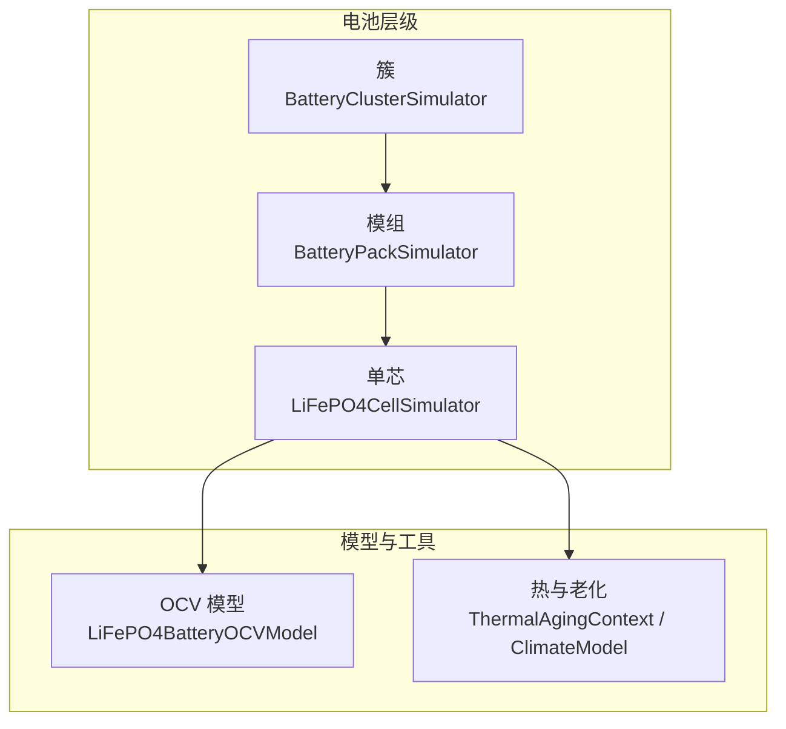
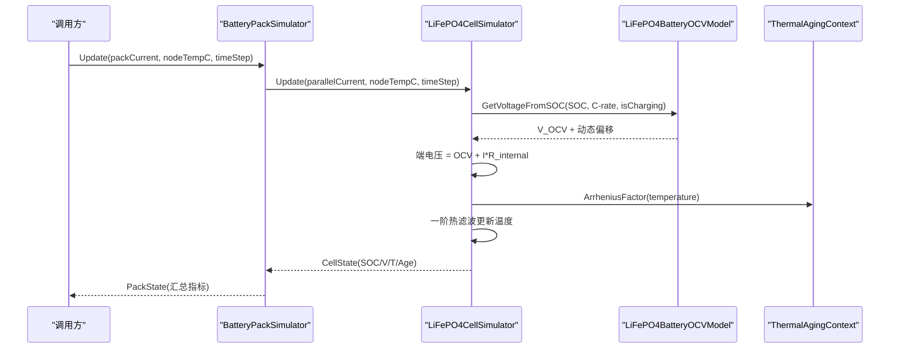
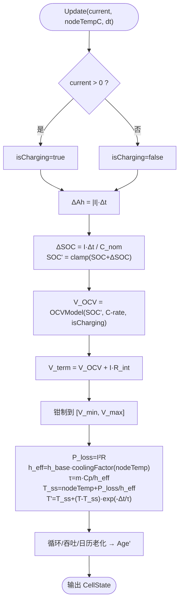
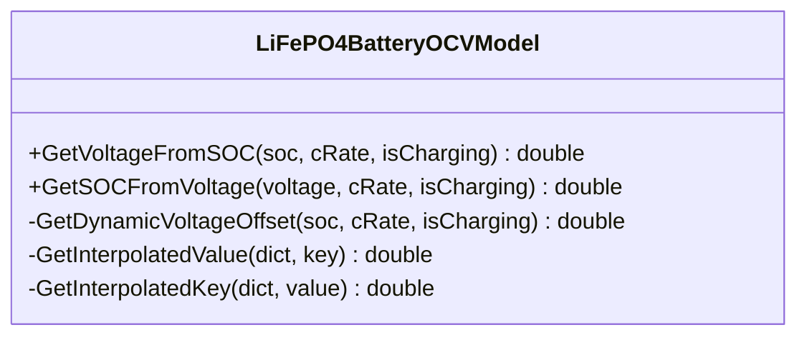
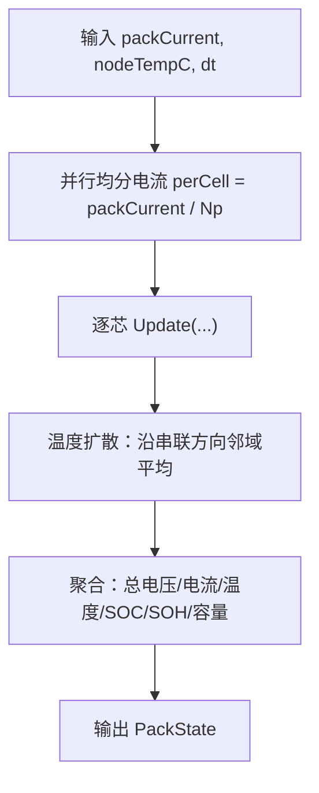
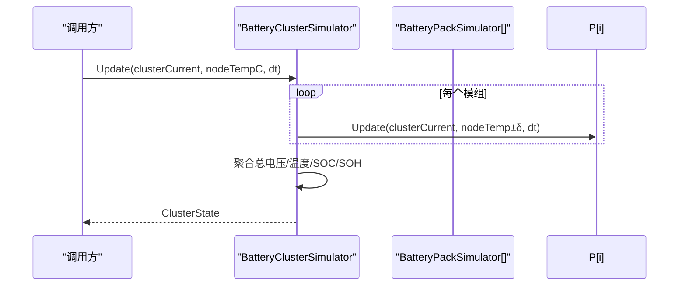
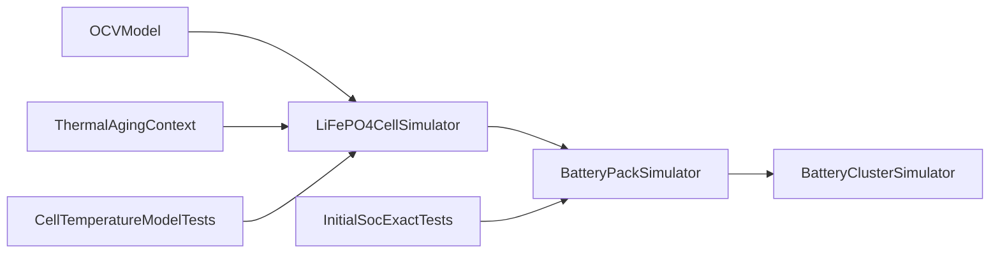

# 电芯模型

<cite>
**本文引用的文件**
- [batteryCellModel.cs](file://EssDeviceSimModel/Battery/batteryCellModel.cs)
- [OCVModel.cs](file://EssDeviceSimModel/Battery/OCVModel.cs)
- [batteryPackModel.cs](file://EssDeviceSimModel/Battery/batteryPackModel.cs)
- [batteryClusterModel.cs](file://EssDeviceSimModel/Battery/batteryClusterModel.cs)
- [ThermalAgingContext.cs](file://EssDeviceSimModel/Thermal/ThermalAgingContext.cs)
- [ClimateModel.cs](file://EssDeviceSimModel/Thermal/ClimateModel.cs)
- [CellTemperatureModelTests.cs](file://EssSimulator.Tests/Battery/CellTemperatureModelTests.cs)
- [InitialSocExactTests.cs](file://EssSimulator.Tests/Battery/InitialSocExactTests.cs)
</cite>

## 目录
1. [简介](#简介)
2. [项目结构](#项目结构)
3. [核心组件](#核心组件)
4. [架构总览](#架构总览)
5. [详细组件分析](#详细组件分析)
6. [依赖关系分析](#依赖关系分析)
7. [性能考虑](#性能考虑)
8. [故障排查指南](#故障排查指南)
9. [结论](#结论)
10. [附录：配置与仿真示例路径](#附录：配置与仿真示例路径)

## 简介
本文件面向储能仿真系统中的 LiFePO4 电池电芯模型，系统性阐述其数学建模原理与实现要点，包括：
- SOC 估算算法与 OCV-SOC 曲线
- 内阻模型与充放电电压计算
- 温度影响的一阶热滤波模型
- 循环与日历老化机制
- CellSpecifications 配置参数与 CellState 状态管理
- 模组与簇的聚合建模、不一致性与热扩散
- 仿真精度验证方法与性能优化建议

该模型以“单芯→模组→簇”的分层方式组织，既支持单体级的高保真仿真，也提供系统级的聚合指标（总电压、SOC/SOH、不平衡度等）。

## 项目结构
电芯相关代码位于 EssDeviceSimModel/Battery 目录下，按层级划分：
- 单芯：LiFePO4CellSimulator、CellSpecifications、CellState、OCV 模型
- 模组：BatteryPackSimulator、PackConfiguration、PackState
- 簇：BatteryClusterSimulator、ClusterConfiguration、ClusterState
- 热与老化：Thermal.ThermalAgingContext、ClimateModel

图表来源
- [batteryCellModel.cs:35-269](file://EssDeviceSimModel/Battery/batteryCellModel.cs#L35-L269)
- [batteryPackModel.cs:44-296](file://EssDeviceSimModel/Battery/batteryPackModel.cs#L44-L296)
- [batteryClusterModel.cs:42-266](file://EssDeviceSimModel/Battery/batteryClusterModel.cs#L42-L266)
- [OCVModel.cs:9-189](file://EssDeviceSimModel/Battery/OCVModel.cs#L9-L189)
- [ThermalAgingContext.cs:5-38](file://EssDeviceSimModel/Thermal/ThermalAgingContext.cs#L5-L38)
- [ClimateModel.cs:5-37](file://EssDeviceSimModel/Thermal/ClimateModel.cs#L5-L37)

章节来源
- [batteryCellModel.cs:9-269](file://EssDeviceSimModel/Battery/batteryCellModel.cs#L9-L269)
- [batteryPackModel.cs:9-296](file://EssDeviceSimModel/Battery/batteryPackModel.cs#L9-L296)
- [batteryClusterModel.cs:9-266](file://EssDeviceSimModel/Battery/batteryClusterModel.cs#L9-L266)
- [OCVModel.cs:9-189](file://EssDeviceSimModel/Battery/OCVModel.cs#L9-L189)
- [ThermalAgingContext.cs:5-38](file://EssDeviceSimModel/Thermal/ThermalAgingContext.cs#L5-L38)
- [ClimateModel.cs:5-37](file://EssDeviceSimModel/Thermal/ClimateModel.cs#L5-L37)

## 核心组件
- 单芯仿真器：负责 SOC 更新、端电压计算、一阶热模型、循环/日历老化。
- OCV 模型：提供 OCV-SOC 曲线插值、动态电压偏移（倍率与充放电方向）、反向 SOC 求解。
- 模组仿真器：串并联电芯集合，模拟不一致性、温度扩散、聚合统计。
- 簇仿真器：多模组串联，聚合簇级指标并支持一致性约束与平衡策略预留。
- 热与老化上下文：Arrhenius 日历老化加速因子、室外气候模型。

章节来源
- [batteryCellModel.cs:35-269](file://EssDeviceSimModel/Battery/batteryCellModel.cs#L35-L269)
- [OCVModel.cs:9-189](file://EssDeviceSimModel/Battery/OCVModel.cs#L9-L189)
- [batteryPackModel.cs:44-296](file://EssDeviceSimModel/Battery/batteryPackModel.cs#L44-L296)
- [batteryClusterModel.cs:42-266](file://EssDeviceSimModel/Battery/batteryClusterModel.cs#L42-L266)
- [ThermalAgingContext.cs:5-38](file://EssDeviceSimModel/Thermal/ThermalAgingContext.cs#L5-L38)
- [ClimateModel.cs:5-37](file://EssDeviceSimModel/Thermal/ClimateModel.cs#L5-L37)

## 架构总览
下图展示从单芯到簇的数据流与控制流，以及 OCV、热与老化的耦合关系。

图表来源
- [batteryPackModel.cs:100-155](file://EssDeviceSimModel/Battery/batteryPackModel.cs#L100-L155)
- [batteryCellModel.cs:90-177](file://EssDeviceSimModel/Battery/batteryCellModel.cs#L90-L177)
- [OCVModel.cs:43-61](file://EssDeviceSimModel/Battery/OCVModel.cs#L43-L61)
- [ThermalAgingContext.cs:27-35](file://EssDeviceSimModel/Thermal/ThermalAgingContext.cs#L27-L35)

## 详细组件分析

### 单芯模型：SOC、内阻、温度与老化
- 状态与配置
  - CellSpecifications：额定容量、额定/极限电压、初始 SOC、内阻、质量、体积。
  - CellState：当前 SOC、端电压、电流、温度、剩余容量、循环次数、老化程度、时间戳。
- SOC 更新
  - 基于电流对时间的积分：ΔSOC = I·Δt / C_nom，边界钳制至 [0,1]。
  - 剩余容量 = C_nom × SOC。
- 电压计算
  - OCV 由 OCV 模型根据 SOC 与倍率（充/放）给出；端电压 = OCV + I × R_internal，并钳制在电压窗口内。
- 温度模型（一阶滤波）
  - 稳态温升 = I²R / h_eff，其中 h_eff = h_base × coolingFactor(nodeTempC)。
  - 热时间常数 τ = m·Cp / h_eff，采用指数滤波：T(t) = T_ss + (T(t-1) − T_ss)·exp(−Δt/τ)。
  - 节点温度越高，散热效率越低，导致相对节点温升更大。
- 老化机制
  - 循环老化：累计充电/放电 Ah，满 1C 各计 0.5 个循环，叠加得到等效循环数。
  - 吞吐老化：基于总安时吞吐量。
  - 日历老化：通过 Arrhenius 因子按年累积，受温度加速。
  - 最终 Age = min(1, 循环+吞吐贡献 + 日历累积)。

图表来源
- [batteryCellModel.cs:90-177](file://EssDeviceSimModel/Battery/batteryCellModel.cs#L90-L177)
- [batteryCellModel.cs:179-213](file://EssDeviceSimModel/Battery/batteryCellModel.cs#L179-L213)
- [ThermalAgingContext.cs:27-35](file://EssDeviceSimModel/Thermal/ThermalAgingContext.cs#L27-L35)

章节来源
- [batteryCellModel.cs:9-269](file://EssDeviceSimModel/Battery/batteryCellModel.cs#L9-L269)
- [ThermalAgingContext.cs:5-38](file://EssDeviceSimModel/Thermal/ThermalAgingContext.cs#L5-L38)

### OCV-SOC 曲线与动态电压偏移
- 开路电压表：以字典存储 SOC→OCV 的离散点，使用线性插值获取任意 SOC 下的 OCV。
- 动态偏移：
  - 针对充/放分别维护最大偏移曲线（SOC→最大偏移量），参考倍率为 2C。
  - 实际偏移 = 最大偏移 × sqrt(min(C-rate/2C, 1))，体现非线性倍率效应。
- 反向求解：给定电压与倍率，二分搜索求 SOC。

图表来源
- [OCVModel.cs:9-189](file://EssDeviceSimModel/Battery/OCVModel.cs#L9-L189)

章节来源
- [OCVModel.cs:9-189](file://EssDeviceSimModel/Battery/OCVModel.cs#L9-L189)

### 模组模型：串并联、不一致性与热扩散
- 配置与状态
  - PackConfiguration：串并联数、单芯额定参数、初始 SOC、模组内阻、冷却效率。
  - PackState：总电压/电流、单体极值与均值、SOC/SOH 统计、剩余/总容量、时间戳。
- 不一致性
  - 初始化时对容量、内阻、冷却效率施加随机扰动，模拟制造差异。
- 热扩散
  - 每步对串联方向进行一维温度扩散，使相邻电芯温度趋近，平滑温差。
- 聚合逻辑
  - 总电压为各串联段平均单体电压之和。
  - 剩余容量取最弱串联段的并联容量之和（短板效应）。
  - SOH 为所有单体健康度的平均。

图表来源
- [batteryPackModel.cs:100-155](file://EssDeviceSimModel/Battery/batteryPackModel.cs#L100-L155)
- [batteryPackModel.cs:157-203](file://EssDeviceSimModel/Battery/batteryPackModel.cs#L157-L203)

章节来源
- [batteryPackModel.cs:9-296](file://EssDeviceSimModel/Battery/batteryPackModel.cs#L9-L296)

### 簇模型：多模组串联与一致性监控
- 配置与状态
  - ClusterConfiguration：模组数量、模组模板、簇总内阻、最大电压不平衡、最大温差。
  - ClusterState：总电压/电流、模组电压/温度/SOC 统计、SOH、剩余/总容量、时间戳。
- 运行流程
  - 每个模组接收相同电流（串联），但赋予小幅温度扰动以模拟位置差异。
  - 聚合得到簇级指标，并以最小模组 SOC 作为保守簇 SOC。
- 平衡控制
  - 预留平衡接口（注释中），可基于电压或 SOC 不平衡执行放电均衡。

图表来源
- [batteryClusterModel.cs:90-153](file://EssDeviceSimModel/Battery/batteryClusterModel.cs#L90-L153)

章节来源
- [batteryClusterModel.cs:9-266](file://EssDeviceSimModel/Battery/batteryClusterModel.cs#L9-L266)

### 热与老化上下文
- ThermalAgingContext
  - 启用开关、参考温度、Arrhenius 系数、参考温度下年日历老化速率。
  - ArrheniusFactor：基于绝对温度的指数加速因子。
- ClimateModel
  - 支持固定温度或正弦日变化（振幅、峰值小时）。

章节来源
- [ThermalAgingContext.cs:5-38](file://EssDeviceSimModel/Thermal/ThermalAgingContext.cs#L5-L38)
- [ClimateModel.cs:5-37](file://EssDeviceSimModel/Thermal/ClimateModel.cs#L5-L37)

## 依赖关系分析
- 单芯依赖 OCV 模型与热老化上下文。
- 模组依赖单芯，并在内部进行温度扩散与聚合。
- 簇依赖模组，聚合簇级指标。
- 测试用例覆盖温度模型行为与初始 SOC 精确性。

图表来源
- [batteryCellModel.cs:35-269](file://EssDeviceSimModel/Battery/batteryCellModel.cs#L35-L269)
- [batteryPackModel.cs:44-296](file://EssDeviceSimModel/Battery/batteryPackModel.cs#L44-L296)
- [batteryClusterModel.cs:42-266](file://EssDeviceSimModel/Battery/batteryClusterModel.cs#L42-L266)
- [OCVModel.cs:9-189](file://EssDeviceSimModel/Battery/OCVModel.cs#L9-L189)
- [ThermalAgingContext.cs:5-38](file://EssDeviceSimModel/Thermal/ThermalAgingContext.cs#L5-L38)
- [CellTemperatureModelTests.cs:1-80](file://EssSimulator.Tests/Battery/CellTemperatureModelTests.cs#L1-L80)
- [InitialSocExactTests.cs:1-34](file://EssSimulator.Tests/Battery/InitialSocExactTests.cs#L1-L34)

章节来源
- [batteryCellModel.cs:35-269](file://EssDeviceSimModel/Battery/batteryCellModel.cs#L35-L269)
- [batteryPackModel.cs:44-296](file://EssDeviceSimModel/Battery/batteryPackModel.cs#L44-L296)
- [batteryClusterModel.cs:42-266](file://EssDeviceSimModel/Battery/batteryClusterModel.cs#L42-L266)
- [OCVModel.cs:9-189](file://EssDeviceSimModel/Battery/OCVModel.cs#L9-L189)
- [ThermalAgingContext.cs:5-38](file://EssDeviceSimModel/Thermal/ThermalAgingContext.cs#L5-L38)
- [CellTemperatureModelTests.cs:1-80](file://EssSimulator.Tests/Battery/CellTemperatureModelTests.cs#L1-L80)
- [InitialSocExactTests.cs:1-34](file://EssSimulator.Tests/Battery/InitialSocExactTests.cs#L1-L34)

## 性能考虑
- 时间步长与热模型稳定性
  - 一阶热滤波的时间常数 τ = m·Cp / h_eff，需保证 Δt ≪ τ 以获得稳定数值解。
  - 大 Δt 会导致过冲或振荡，建议将 Δt 设置为秒级或更小。
- 插值与查找
  - OCV 与偏移曲线使用字典键值查找与线性插值，复杂度近似 O(logN) 或 O(1)（视实现），在高频率步进中应尽量避免重复构造。
- 不一致性与随机数
  - 模组初始化引入随机差异，若需可复现实验，请固定随机种子或移除随机扰动。
- 聚合开销
  - 簇/模组的统计计算涉及多次遍历，建议在大规模系统中按需采样或缓存中间结果。

[本节为通用性能建议，不直接分析具体文件]

## 故障排查指南
- 温度异常偏高/偏低
  - 检查节点温度设置是否合理；高节点温度会降低散热效率，导致电芯相对节点温升增大。
  - 确认内阻与电流乘积产生的发热功率是否过大。
- SOC 漂移
  - 检查电流积分步长与时间步长是否匹配；确保边界钳制生效。
  - 校验 OCV 曲线是否与目标电芯一致。
- 初始 SOC 未生效
  - 确认配置中的初始 SOC 未被遗留的随机范围覆盖；测试用例已验证精确设置。
- 老化过快
  - 检查日历老化参数（ArrheniusB、参考温度、年老化速率）是否过高；确认循环计数逻辑是否符合预期。

章节来源
- [CellTemperatureModelTests.cs:28-79](file://EssSimulator.Tests/Battery/CellTemperatureModelTests.cs#L28-L79)
- [InitialSocExactTests.cs:9-32](file://EssSimulator.Tests/Battery/InitialSocExactTests.cs#L9-L32)

## 结论
该电芯模型以清晰的层级结构与物理一致的数学公式，实现了 LiFePO4 电池的 SOC、电压、温度与老化的综合仿真。通过 OCV 曲线与动态偏移准确刻画倍率特性；一阶热模型与 Arrhenius 日历老化反映温度与时间对寿命的影响；模组与簇层面加入不一致性与热扩散，提升工程可用性。配合单元测试，可对关键行为进行快速验证与回归。

[本节为总结性内容，不直接分析具体文件]

## 附录：配置与仿真示例路径
以下示例展示了如何配置电芯参数、模拟充放电过程与设置温度环境。为避免泄露实现细节，此处仅给出代码片段所在文件与行号，便于查阅。

- 配置电芯规格（额定容量、电压范围、内阻、质量等）
  - 参考路径：[batteryCellModel.cs:9-20](file://EssDeviceSimModel/Battery/batteryCellModel.cs#L9-L20)
- 创建电芯仿真器并设置初始 SOC
  - 参考路径：[batteryCellModel.cs:55-88](file://EssDeviceSimModel/Battery/batteryCellModel.cs#L55-L88)
- 模拟恒流充/放电与静置（含温度环境）
  - 参考路径：[batteryCellModel.cs:90-177](file://EssDeviceSimModel/Battery/batteryCellModel.cs#L90-L177)
- 设置温度环境（节点温度）
  - 参考路径：[batteryCellModel.cs:75-78](file://EssDeviceSimModel/Battery/batteryCellModel.cs#L75-L78)
- 使用 OCV 模型进行电压计算
  - 参考路径：[OCVModel.cs:43-61](file://EssDeviceSimModel/Battery/OCVModel.cs#L43-L61)
- 模组级串并联与温度扩散
  - 参考路径：[batteryPackModel.cs:100-155](file://EssDeviceSimModel/Battery/batteryPackModel.cs#L100-L155)
- 簇级聚合与一致性监控
  - 参考路径：[batteryClusterModel.cs:90-153](file://EssDeviceSimModel/Battery/batteryClusterModel.cs#L90-L153)
- 温度模型精度验证（单元测例）
  - 参考路径：[CellTemperatureModelTests.cs:28-79](file://EssSimulator.Tests/Battery/CellTemperatureModelTests.cs#L28-L79)
- 初始 SOC 精确性验证（单元测例）
  - 参考路径：[InitialSocExactTests.cs:9-32](file://EssSimulator.Tests/Battery/InitialSocExactTests.cs#L9-L32)

[本节为导航性内容，不直接分析具体文件]