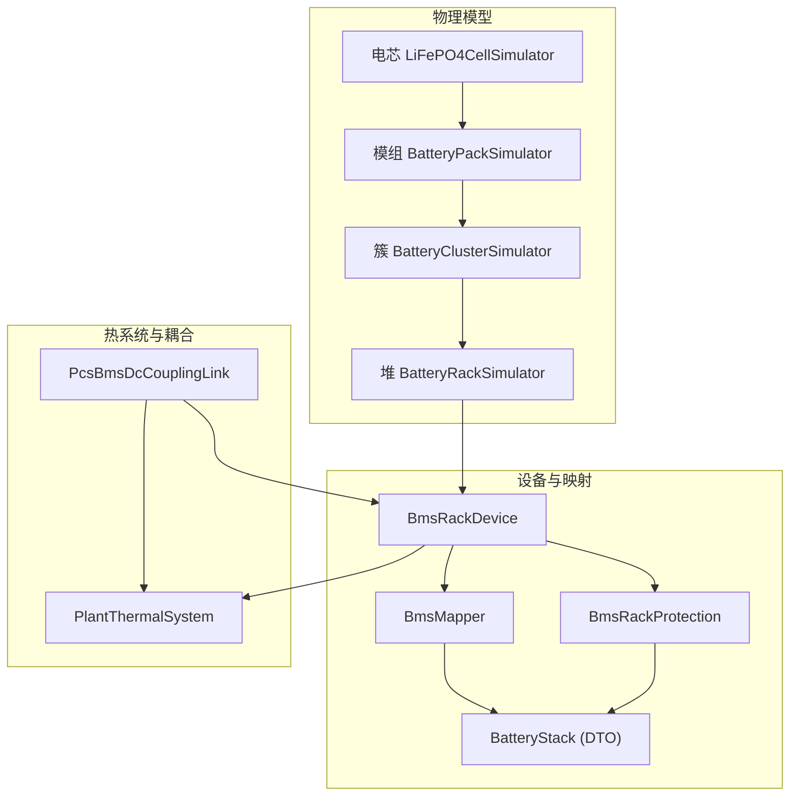
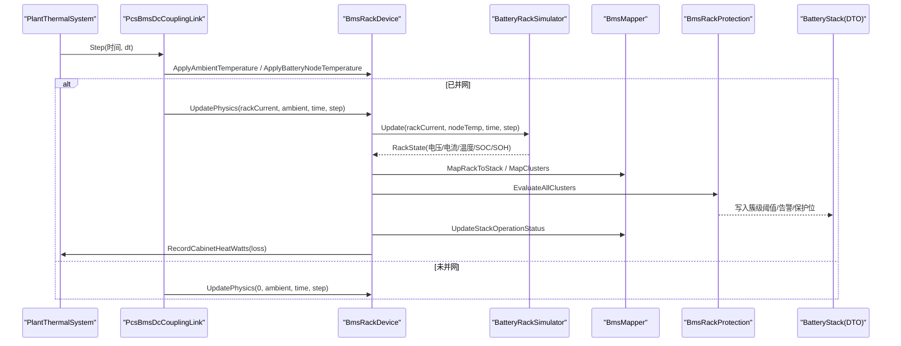
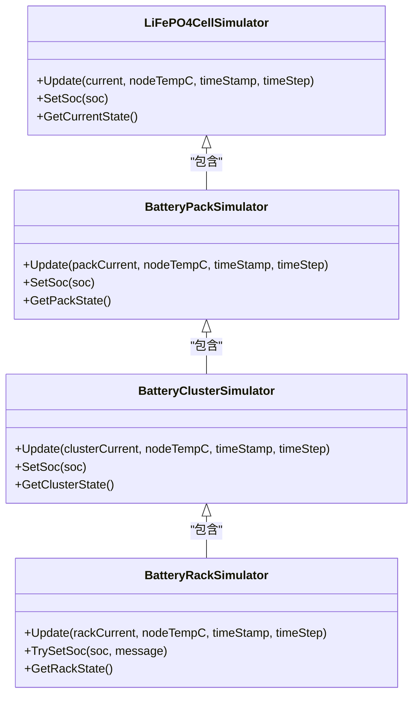
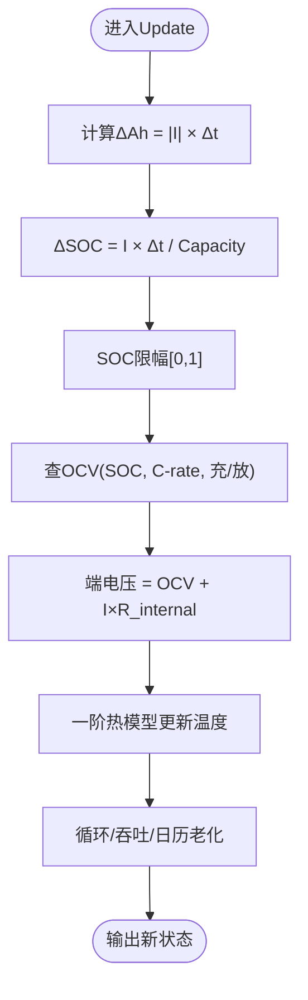
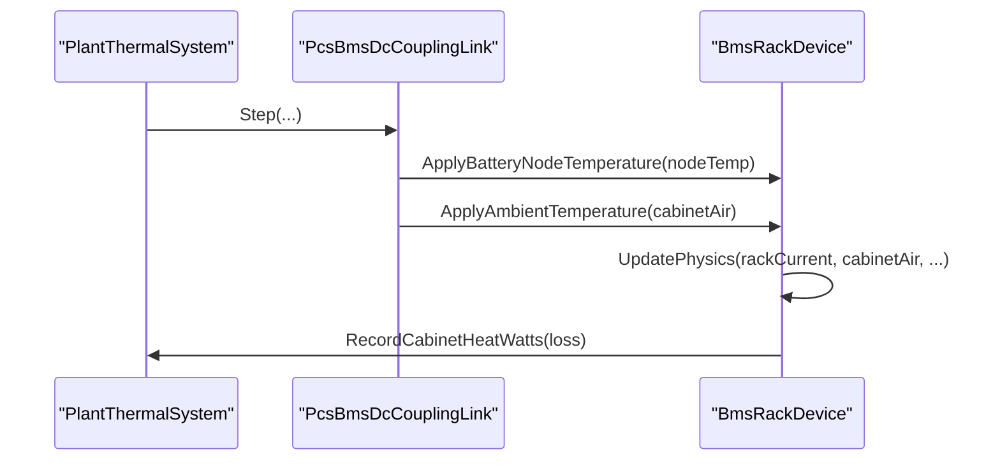
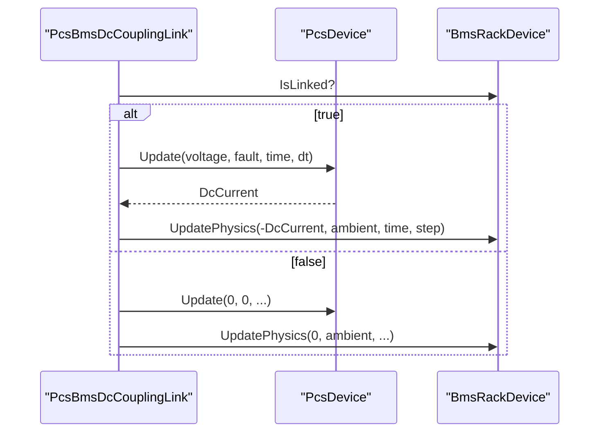
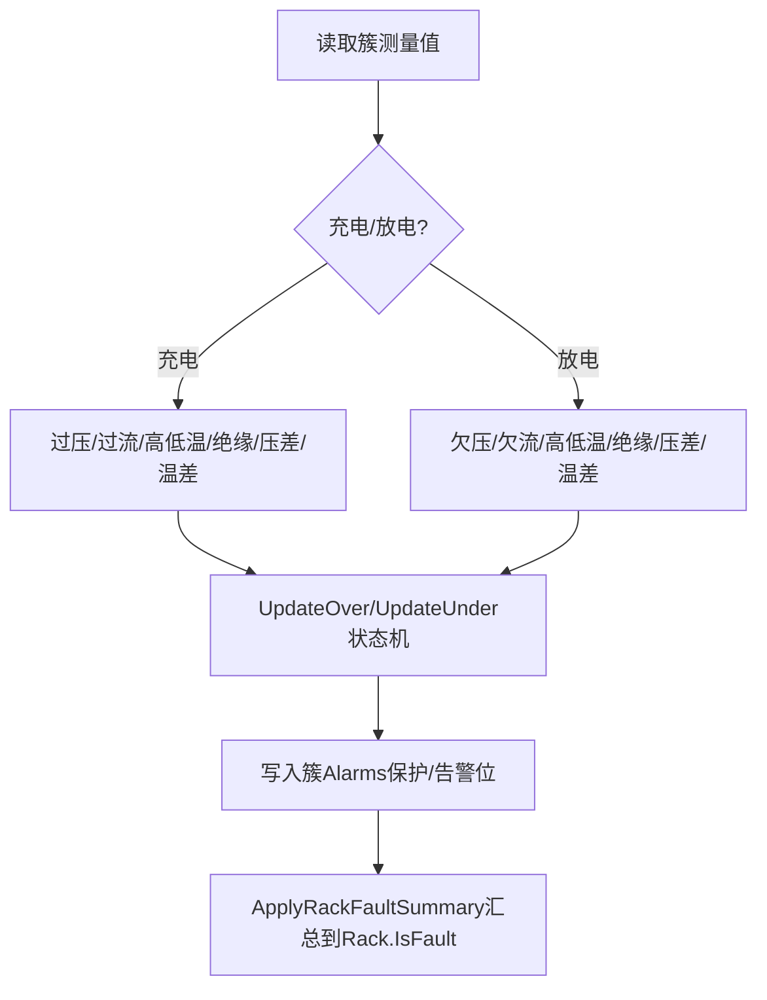
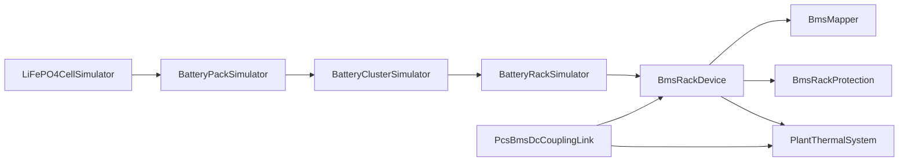

# BMS电池管理系统设备

<cite>
**本文引用的文件**
- [BmsRackDevice.cs](file://EssDeviceSimModel/Devices/BmsRackDevice.cs)
- [batteryCellModel.cs](file://EssDeviceSimModel/Battery/batteryCellModel.cs)
- [batteryPackModel.cs](file://EssDeviceSimModel/Battery/batteryPackModel.cs)
- [batteryClusterModel.cs](file://EssDeviceSimModel/Battery/batteryClusterModel.cs)
- [batteryHeapModel.cs](file://EssDeviceSimModel/Battery/batteryHeapModel.cs)
- [OCVModel.cs](file://EssDeviceSimModel/Battery/OCVModel.cs)
- [BmsRackProtection.cs](file://EssDeviceSimModel/Devices/BmsRackProtection.cs)
- [BatteryStack.cs](file://EssSimModelApi/Bms/BatteryStack.cs)
- [BmsMapper.cs](file://EssSimModelApi/Mappers/BmsMapper.cs)
- [PlantThermalSystem.cs](file://EssDeviceSimModel/Thermal/PlantThermalSystem.cs)
- [PcsBmsDcCouplingLink.cs](file://EssDeviceSimModel/Plant/PcsBmsDcCouplingLink.cs)
- [BmsStateTracker.cs](file://EssDeviceSimModel/Diagnostics/BmsStateTracker.cs)
</cite>

## 目录
1. [简介](#简介)
2. [项目结构](#项目结构)
3. [核心组件](#核心组件)
4. [架构总览](#架构总览)
5. [详细组件分析](#详细组件分析)
6. [依赖关系分析](#依赖关系分析)
7. [性能考量](#性能考量)
8. [故障排查指南](#故障排查指南)
9. [结论](#结论)
10. [附录：配置与使用要点](#附录：配置与使用要点)

## 简介
本文件面向BMS电池管理系统设备的仿真实现，重点解释四层电池堆物理模型（电芯、模组/包、簇、堆）的层次化建模方法，以及状态管理、SOC计算、温度监控与保护机制。同时说明BMS与PCS的直流耦合接口、故障检测逻辑和热管理集成，并提供配置参数、充放电策略和保护告警处理的实践指引。

## 项目结构
围绕BMS设备的关键代码分布在以下模块：
- 物理模型层：电芯、模组（包）、簇、堆的递进建模与状态聚合
- 设备层：BmsRackDevice作为BMS设备对外暴露DC端口、物理步进、遥测映射与保护回写
- 保护与映射：阈值评估、三级保护/二级告警/一级故障汇总，以及将物理状态映射到BMS DTO
- 热系统：气候、柜体热区、电池节点温度、欧姆损耗登记
- PCS-BMS耦合：直流侧V/I交换、并网关联、环境温同步

图表来源
- [BmsRackDevice.cs:14-165](file://EssDeviceSimModel/Devices/BmsRackDevice.cs#L14-L165)
- [batteryHeapModel.cs:89-415](file://EssDeviceSimModel/Battery/batteryHeapModel.cs#L89-L415)
- [BmsMapper.cs:89-181](file://EssSimModelApi/Mappers/BmsMapper.cs#L89-L181)
- [BmsRackProtection.cs:10-175](file://EssDeviceSimModel/Devices/BmsRackProtection.cs#L10-L175)
- [PlantThermalSystem.cs:13-143](file://EssDeviceSimModel/Thermal/PlantThermalSystem.cs#L13-L143)
- [PcsBmsDcCouplingLink.cs:12-67](file://EssDeviceSimModel/Plant/PcsBmsDcCouplingLink.cs#L12-L67)

章节来源
- [BmsRackDevice.cs:14-165](file://EssDeviceSimModel/Devices/BmsRackDevice.cs#L14-L165)
- [batteryHeapModel.cs:89-415](file://EssDeviceSimModel/Battery/batteryHeapModel.cs#L89-L415)

## 核心组件
- 四层物理模型
  - 电芯：LiFePO4CellSimulator，维护SOC、电压、温度、老化、循环计数等；支持一阶热模型与温度相关日历老化
  - 模组（包）：BatteryPackSimulator，串并联组织电芯，执行温度扩散与汇总
  - 簇：BatteryClusterSimulator，串联多个模组，统计电压/温度/SOC差异与健康度
  - 堆：BatteryRackSimulator，并联多个簇，电流按内阻分配，支持簇间被动均衡
- 设备与接口
  - BmsRackDevice：封装Rack物理模型，提供DC端口读写、物理步进、SOC设置、遥测映射与保护回写
- 保护与映射
  - BmsRackProtection：簇级阈值评估（过压/欠压、过流/欠流、高低温、绝缘、压差/温差），三级保护/二级告警/一级故障汇总
  - BmsMapper：将Rack/簇状态映射到BatteryManagementSystemData（含堆DTO），并计算堆运行状态码
- 热系统与耦合
  - PlantThermalSystem：气候与柜体热网络，估算堆欧姆损耗，提供电池节点温度
  - PcsBmsDcCouplingLink：PCS与BMS直流耦合边，负责V/I交换、并网关联与环境温度同步

章节来源
- [batteryCellModel.cs:35-213](file://EssDeviceSimModel/Battery/batteryCellModel.cs#L35-L213)
- [batteryPackModel.cs:44-215](file://EssDeviceSimModel/Battery/batteryPackModel.cs#L44-L215)
- [batteryClusterModel.cs:42-188](file://EssDeviceSimModel/Battery/batteryClusterModel.cs#L42-L188)
- [batteryHeapModel.cs:89-323](file://EssDeviceSimModel/Battery/batteryHeapModel.cs#L89-L323)
- [BmsRackDevice.cs:14-165](file://EssDeviceSimModel/Devices/BmsRackDevice.cs#L14-L165)
- [BmsRackProtection.cs:10-321](file://EssDeviceSimModel/Devices/BmsRackProtection.cs#L10-L321)
- [BmsMapper.cs:13-181](file://EssSimModelApi/Mappers/BmsMapper.cs#L13-L181)
- [PlantThermalSystem.cs:13-143](file://EssDeviceSimModel/Thermal/PlantThermalSystem.cs#L13-L143)
- [PcsBmsDcCouplingLink.cs:12-67](file://EssDeviceSimModel/Plant/PcsBmsDcCouplingLink.cs#L12-L67)

## 架构总览
BMS设备在仿真主循环中每步执行：
1. 热系统推进气候与柜体温度，记录BMS柜体电池节点温度
2. PCS-BMS耦合边根据是否并网，交换V/I，更新PCS与BMS物理模型
3. BmsRackDevice调用Rack.Update进行电芯/模组/簇/堆的物理步进，计算损耗并刷新DC端口
4. 将Rack状态映射为BMS DTO，执行簇级保护评估，汇总Rack故障态，更新堆运行状态码
5. 诊断器记录保护/告警变化原因

图表来源
- [PcsBmsDcCouplingLink.cs:25-64](file://EssDeviceSimModel/Plant/PcsBmsDcCouplingLink.cs#L25-L64)
- [BmsRackDevice.cs:86-131](file://EssDeviceSimModel/Devices/BmsRackDevice.cs#L86-L131)
- [batteryHeapModel.cs:152-175](file://EssDeviceSimModel/Battery/batteryHeapModel.cs#L152-L175)
- [BmsMapper.cs:89-181](file://EssSimModelApi/Mappers/BmsMapper.cs#L89-L181)
- [BmsRackProtection.cs:10-175](file://EssDeviceSimModel/Devices/BmsRackProtection.cs#L10-L175)
- [PlantThermalSystem.cs:96-143](file://EssDeviceSimModel/Thermal/PlantThermalSystem.cs#L96-L143)

## 详细组件分析

### 四层电池堆物理模型
- 电芯（LiFePO4CellSimulator）
  - SOC更新：基于电流对时间的积分，限制在[0,1]
  - 电压计算：OCV-SOC曲线 + 倍率偏移 + 内阻压降
  - 温度模型：一阶滤波，稳态=节点温度+I²R/h_eff，时间常数由质量与散热系数决定；节点温度越高，散热效率越低
  - 老化模型：循环次数与安时吞吐贡献基础老化；启用热老化时叠加Arrhenius加速的日历老化
- 模组（BatteryPackSimulator）
  - 串并联组织电芯，并联均分电流；串联方向温度扩散平滑相邻电芯温差
  - 汇总最小SOC、最大/最小单体电压/温度、健康度等
- 簇（BatteryClusterSimulator）
  - 串联多个模组，统计簇总电压/电流、电压不平衡、温差、SOC范围、健康度
  - 支持簇级平衡预留接口（当前以堆级被动均衡为主）
- 堆（BatteryRackSimulator）
  - 并联多个簇，按内阻电导比分配电流
  - 簇间被动均衡：当SOC差超过启动阈值且满足静置条件，对高SOC簇施加小放电电流泄放能量，直至低于停止阈值
  - 累计充放电能量、剩余/总能量、平均温度等

图表来源
- [batteryCellModel.cs:35-213](file://EssDeviceSimModel/Battery/batteryCellModel.cs#L35-L213)
- [batteryPackModel.cs:44-215](file://EssDeviceSimModel/Battery/batteryPackModel.cs#L44-L215)
- [batteryClusterModel.cs:42-188](file://EssDeviceSimModel/Battery/batteryClusterModel.cs#L42-L188)
- [batteryHeapModel.cs:89-323](file://EssDeviceSimModel/Battery/batteryHeapModel.cs#L89-L323)

章节来源
- [batteryCellModel.cs:90-213](file://EssDeviceSimModel/Battery/batteryCellModel.cs#L90-L213)
- [batteryPackModel.cs:100-215](file://EssDeviceSimModel/Battery/batteryPackModel.cs#L100-L215)
- [batteryClusterModel.cs:90-188](file://EssDeviceSimModel/Battery/batteryClusterModel.cs#L90-L188)
- [batteryHeapModel.cs:152-323](file://EssDeviceSimModel/Battery/batteryHeapModel.cs#L152-L323)

### 电池状态管理与SOC计算
- 堆SOC：取各簇的最小模组SOC的平均值（保守估计）
- 簇SOC：取模组的最小SOC
- 模组SOC：取电芯的最小SOC
- OCV模型：LiFePO4BatteryOCVModel提供SOC↔电压转换，考虑倍率与充放电方向的非线性偏移

图表来源
- [batteryCellModel.cs:90-213](file://EssDeviceSimModel/Battery/batteryCellModel.cs#L90-L213)
- [OCVModel.cs:43-124](file://EssDeviceSimModel/Battery/OCVModel.cs#L43-L124)

章节来源
- [batteryHeapModel.cs:247-309](file://EssDeviceSimModel/Battery/batteryHeapModel.cs#L247-L309)
- [batteryClusterModel.cs:107-153](file://EssDeviceSimModel/Battery/batteryClusterModel.cs#L107-L153)
- [batteryPackModel.cs:157-215](file://EssDeviceSimModel/Battery/batteryPackModel.cs#L157-L215)
- [batteryCellModel.cs:90-213](file://EssDeviceSimModel/Battery/batteryCellModel.cs#L90-L213)
- [OCVModel.cs:43-124](file://EssDeviceSimModel/Battery/OCVModel.cs#L43-L124)

### 温度监控与热管理集成
- 电池节点温度：由PlantThermalSystem计算柜体电池节点温度，通过PcsBmsDcCouplingLink写入BmsRackDevice，影响电芯散热效率
- 环境温度：BmsRackDevice与PCS分别接收各自的环境温度
- 热注入：BmsRackDevice每步计算等效欧姆损耗，登记到对应柜体热区，参与下一热步的温度求解
- 空调控制：可运行时开关或设定柜体空调制冷设定点

图表来源
- [PcsBmsDcCouplingLink.cs:25-64](file://EssDeviceSimModel/Plant/PcsBmsDcCouplingLink.cs#L25-L64)
- [BmsRackDevice.cs:40-93](file://EssDeviceSimModel/Devices/BmsRackDevice.cs#L40-L93)
- [PlantThermalSystem.cs:44-143](file://EssDeviceSimModel/Thermal/PlantThermalSystem.cs#L44-L143)

章节来源
- [PcsBmsDcCouplingLink.cs:25-64](file://EssDeviceSimModel/Plant/PcsBmsDcCouplingLink.cs#L25-L64)
- [BmsRackDevice.cs:40-93](file://EssDeviceSimModel/Devices/BmsRackDevice.cs#L40-L93)
- [PlantThermalSystem.cs:44-143](file://EssDeviceSimModel/Thermal/PlantThermalSystem.cs#L44-L143)

### BMS与PCS的直流耦合接口
- 并网关联：BmsRackDevice.IsLinked控制PCS与BMS直流侧是否关联；断开时DC端口电压强制为0
- V/I交换：耦合边读取Rack总电压，驱动PCS；从PCS获取DC电流，反向写入Rack电流
- 功率降额：不直接做温度降额，仅依据PCS/BMS告警与故障信息决定

图表来源
- [PcsBmsDcCouplingLink.cs:25-64](file://EssDeviceSimModel/Plant/PcsBmsDcCouplingLink.cs#L25-L64)
- [BmsRackDevice.cs:58-93](file://EssDeviceSimModel/Devices/BmsRackDevice.cs#L58-L93)

章节来源
- [PcsBmsDcCouplingLink.cs:25-64](file://EssDeviceSimModel/Plant/PcsBmsDcCouplingLink.cs#L25-L64)
- [BmsRackDevice.cs:58-93](file://EssDeviceSimModel/Devices/BmsRackDevice.cs#L58-L93)

### 故障检测逻辑与保护机制
- 簇级评估：针对过压/欠压、过流/欠流、高低温、绝缘、压差/温差等，采用三档阈值与恢复门限的状态机
- 方向性保护：充电方向与放电方向分别评估，避免误判
- 汇总回写：将簇级保护/告警汇总至堆DTO，再回写到Rack故障态（IsFault）
- 一次性落档：清障后再次评估时按当前值一次性落到对应等级，避免“清完不再触发”

图表来源
- [BmsRackProtection.cs:71-175](file://EssDeviceSimModel/Devices/BmsRackProtection.cs#L71-L175)
- [BmsRackProtection.cs:180-226](file://EssDeviceSimModel/Devices/BmsRackProtection.cs#L180-L226)
- [BmsRackProtection.cs:277-318](file://EssDeviceSimModel/Devices/BmsRackProtection.cs#L277-L318)

章节来源
- [BmsRackProtection.cs:71-321](file://EssDeviceSimModel/Devices/BmsRackProtection.cs#L71-L321)

### 电池老化模型
- 循环与吞吐：基于累计安时吞吐量与循环次数计算基础老化
- 日历老化：启用热老化时，按Arrhenius因子与参考年老化速率累积
- 健康度：SOH=1-Age，用于容量与能量折算

章节来源
- [batteryCellModel.cs:148-213](file://EssDeviceSimModel/Battery/batteryCellModel.cs#L148-L213)
- [batteryHeapModel.cs:268-309](file://EssDeviceSimModel/Battery/batteryHeapModel.cs#L268-L309)

### 均衡控制
- 堆级被动均衡：当簇间SOC差≥启动阈值且满足静置条件，对高SOC簇施加小放电电流泄放能量，直到SOC差≤停止阈值
- 均衡参数：StartSocDelta、StopSocDelta、BalanceCRate、IdleOnly、IdleCurrentThresholdA、BleedAboveMinMargin

章节来源
- [batteryHeapModel.cs:64-87](file://EssDeviceSimModel/Battery/batteryHeapModel.cs#L64-L87)
- [batteryHeapModel.cs:177-229](file://EssDeviceSimModel/Battery/batteryHeapModel.cs#L177-L229)

## 依赖关系分析
- BmsRackDevice依赖BatteryRackSimulator提供物理状态，依赖BmsMapper映射到DTO，依赖BmsRackProtection执行保护评估
- BatteryRackSimulator依赖BatteryClusterSimulator，后者依赖BatteryPackSimulator，最终依赖LiFePO4CellSimulator
- 热系统PlantThermalSystem为BMS提供节点温度与环境温度，并接收BMS损耗登记
- PCS与BMS通过PcsBmsDcCouplingLink耦合，形成闭环控制

图表来源
- [BmsRackDevice.cs:14-165](file://EssDeviceSimModel/Devices/BmsRackDevice.cs#L14-L165)
- [batteryHeapModel.cs:89-415](file://EssDeviceSimModel/Battery/batteryHeapModel.cs#L89-L415)
- [BmsMapper.cs:89-181](file://EssSimModelApi/Mappers/BmsMapper.cs#L89-L181)
- [BmsRackProtection.cs:10-321](file://EssDeviceSimModel/Devices/BmsRackProtection.cs#L10-L321)
- [PlantThermalSystem.cs:13-143](file://EssDeviceSimModel/Thermal/PlantThermalSystem.cs#L13-L143)
- [PcsBmsDcCouplingLink.cs:12-67](file://EssDeviceSimModel/Plant/PcsBmsDcCouplingLink.cs#L12-L67)

章节来源
- [BmsRackDevice.cs:14-165](file://EssDeviceSimModel/Devices/BmsRackDevice.cs#L14-L165)
- [batteryHeapModel.cs:89-415](file://EssDeviceSimModel/Battery/batteryHeapModel.cs#L89-L415)

## 性能考量
- 物理步进复杂度：O(N_cells + N_packs + N_clusters)，主要开销在电芯温度扩散与状态聚合
- 热模型：一阶滤波与Arrhenius日历老化计算轻量，适合实时仿真
- 均衡控制：仅在SOC差超阈值且满足静置条件时激活，降低频繁动作带来的额外计算
- 损耗登记：按等效电阻近似计算堆级欧姆损耗，避免复杂路径追踪

## 故障排查指南
- 保护/告警变化追踪：BmsStateTracker记录三级报警、二级告警与Rack故障态变化及原因推断
- 常见触发点
  - SOC边界：充电≥95%或放电≤5%可能触发方向性故障
  - SOH过低：SOH≤5%触发停机
  - 温度异常：端子/极柱高温、高压箱高温、单体高低温
  - 绝缘异常：绝缘值低于阈值
- 清障流程：待机状态下可清除充放电方向故障，但非方向故障需等待条件恢复

章节来源
- [BmsStateTracker.cs:18-107](file://EssDeviceSimModel/Diagnostics/BmsStateTracker.cs#L18-L107)
- [BmsRackProtection.cs:180-226](file://EssDeviceSimModel/Devices/BmsRackProtection.cs#L180-L226)

## 结论
该BMS设备实现了从电芯到堆的四层物理模型，结合精确的SOC/电压/温度/老化计算，并通过保护阈值状态机与堆级被动均衡保障安全与一致性。PCS-BMS直流耦合接口确保并网时的V/I一致性与安全性，热系统集成使温度对电芯行为的影响得到真实反映。整体架构清晰、可扩展，便于工程联调与测试验证。

## 附录：配置与使用要点
- 配置电池参数
  - 电芯规格：额定容量、额定电压、电压窗口、内阻、质量、体积、初始SOC
  - 模组配置：串并联数、模组内阻、冷却效率
  - 簇配置：模组数量、簇内阻、允许电压不平衡与温差
  - 堆配置：簇数量、堆内阻、电流不平衡与SOC差异阈值、被动均衡参数
- 设置充放电策略
  - 通过PCS控制DC电流，BMS按内阻分配簇电流并执行物理步进
  - 被动均衡仅在静置或小电流条件下对高SOC簇泄放
- 处理保护告警
  - 关注簇级阈值（过压/欠压、过流/欠流、高低温、绝缘、压差/温差）
  - 利用BmsRackProtection的状态机理解保护/告警/故障的切换逻辑
  - 在待机状态下尝试清除方向性故障，观察是否再次触发

章节来源
- [batteryCellModel.cs:10-20](file://EssDeviceSimModel/Battery/batteryCellModel.cs#L10-L20)
- [batteryPackModel.cs:10-21](file://EssDeviceSimModel/Battery/batteryPackModel.cs#L10-L21)
- [batteryClusterModel.cs:10-17](file://EssDeviceSimModel/Battery/batteryClusterModel.cs#L10-L17)
- [batteryHeapModel.cs:47-87](file://EssDeviceSimModel/Battery/batteryHeapModel.cs#L47-L87)
- [BmsRackProtection.cs:71-175](file://EssDeviceSimModel/Devices/BmsRackProtection.cs#L71-L175)
- [BmsRackProtection.cs:231-265](file://EssDeviceSimModel/Devices/BmsRackProtection.cs#L231-L265)