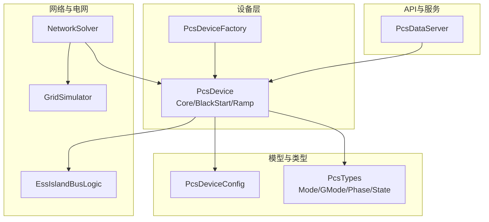
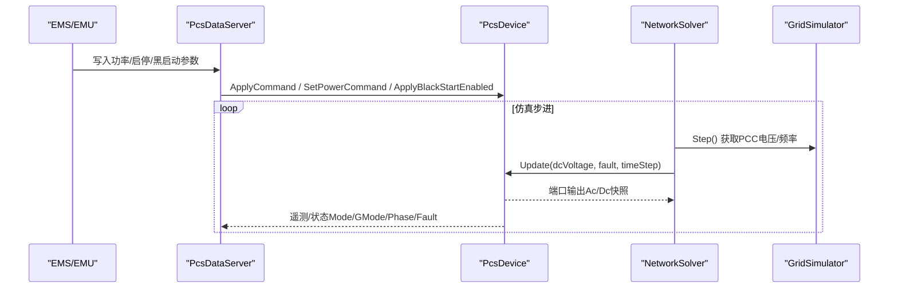
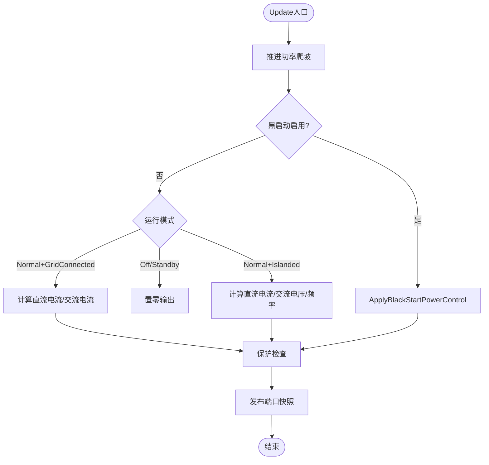
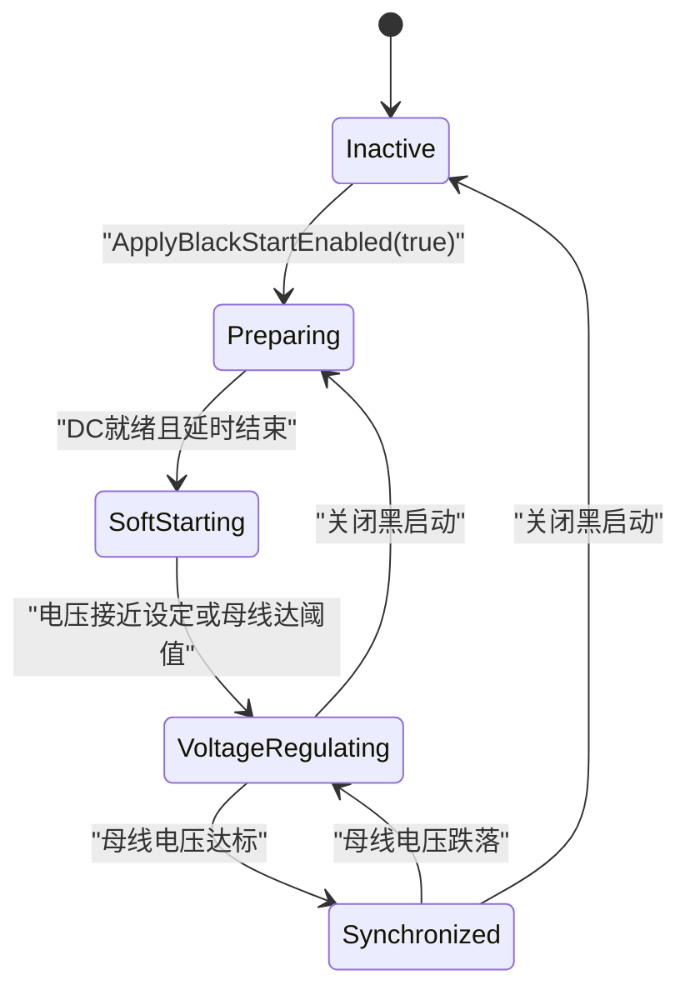
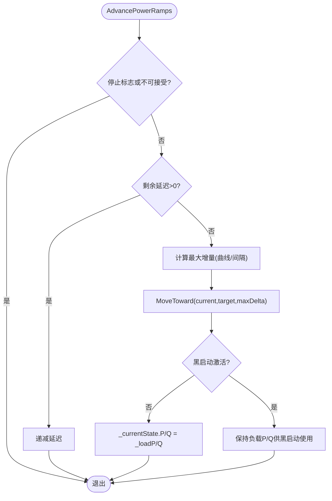
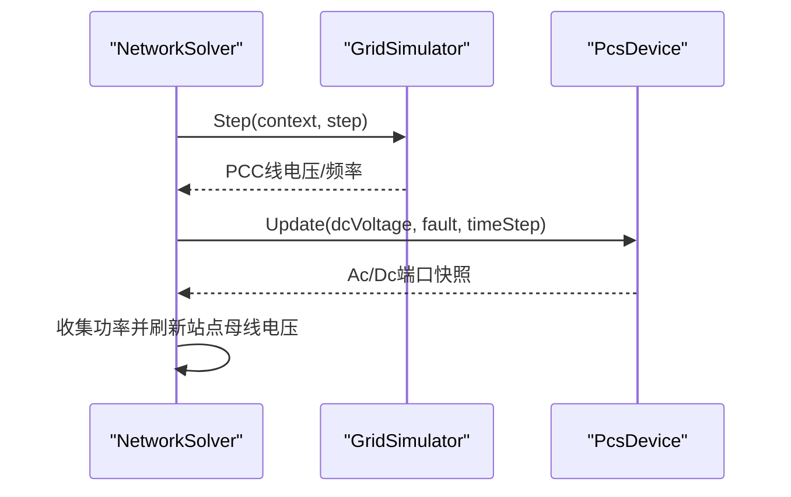
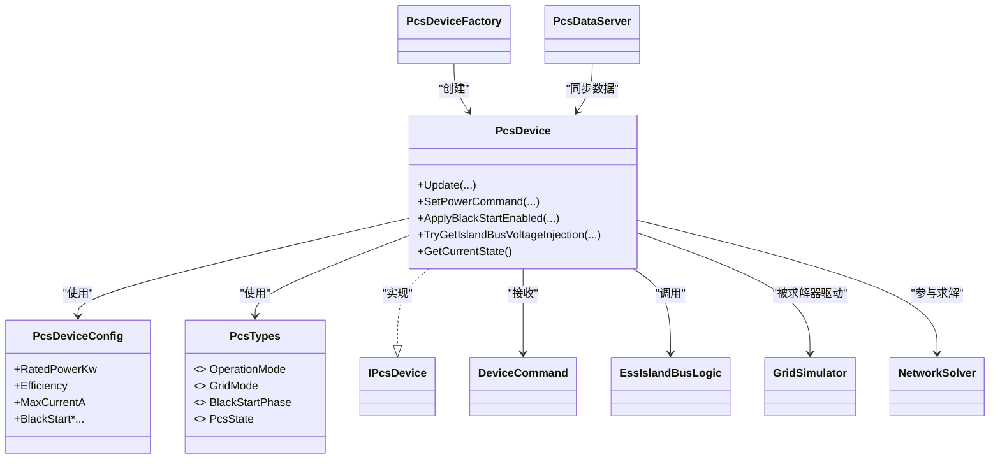

# PCS功率转换系统设备

<cite>
**本文引用的文件**
- [PcsDevice.Core.cs](file://EssDeviceSimModel/Devices/PcsDevice.Core.cs)
- [PcsDevice.BlackStart.cs](file://EssDeviceSimModel/Devices/PcsDevice.BlackStart.cs)
- [PcsDevice.Ramp.cs](file://EssDeviceSimModel/Devices/PcsDevice.Ramp.cs)
- [PcsTypes.cs](file://EssDeviceSimModel/PcsTypes.cs)
- [PcsControlStrategy.cs](file://EssDeviceSimModel/PcsControlStrategy.cs)
- [PcsDeviceConfig.cs](file://EssDeviceSimModel/Model/PcsDeviceConfig.cs)
- [PcsDeviceFactory.cs](file://EssDeviceSimModel/Devices/PcsDeviceFactory.cs)
- [IPcsDevice.cs](file://EssDeviceSimModel/Interface/IPcsDevice.cs)
- [DeviceCommand.cs](file://EssDeviceSimModel/Model/DeviceCommand.cs)
- [EssIslandBusLogic.cs](file://EssDeviceSimModel/EssIslandBusLogic.cs)
- [BlackStartInterlock.cs](file://EssDeviceSimModel/BlackStartInterlock.cs)
- [GridSimulator.cs](file://EssDeviceSimModel/Devices/GridSimulator.cs)
- [NetworkSolver.cs](file://EssDeviceSimModel/Solver/NetworkSolver.cs)
- [PcsDataServer.cs](file://EssSimModelApi/PcsDataServer.cs)
- [PcsBlackStartTests.cs](file://EssSimulator.Tests/Devices/PcsBlackStartTests.cs)
</cite>

## 目录
1. [简介](#简介)
2. [项目结构](#项目结构)
3. [核心组件](#核心组件)
4. [架构总览](#架构总览)
5. [详细组件分析](#详细组件分析)
6. [依赖关系分析](#依赖关系分析)
7. [性能考虑](#性能考虑)
8. [故障排查指南](#故障排查指南)
9. [结论](#结论)
10. [附录：配置与使用示例](#附录配置与使用示例)

## 简介
本文件面向PCS（功率转换系统）设备的仿真实现，围绕PcsDevice的核心建模与控制展开，覆盖双向变流器建模、黑启动建压与频率控制、斜坡控制与功率调节算法、并网/离网模式切换、电压频率控制与同步机制，以及故障保护策略。文档同时提供参数配置、功率限值设置、故障保护实现方法，并给出性能优化与调试建议。

## 项目结构
PCS相关代码主要位于EssDeviceSimModel模块中，按“设备实现”“模型与类型”“求解与传播”“API数据同步”分层组织：
- 设备实现：PcsDevice分三个部分文件（Core/BlackStart/Ramp），分别负责主循环状态更新、黑启动V/f控制、功率爬坡。
- 模型与类型：PcsDeviceConfig定义设备参数；PcsTypes定义运行模式、电网模式、黑启动阶段等枚举与状态结构。
- 求解与传播：GridSimulator提供电网侧电压/频率源；NetworkSolver协调网络求解与PCC电压计算；EssIslandBusLogic提供离网母线电压估算。
- API数据同步：PcsDataServer周期性同步EMS/EMU数据到仿真模型。

图表来源
- [PcsDevice.Core.cs:15-134](file://EssDeviceSimModel/Devices/PcsDevice.Core.cs#L15-L134)
- [PcsDeviceConfig.cs:1-34](file://EssDeviceSimModel/Model/PcsDeviceConfig.cs#L1-L34)
- [PcsTypes.cs:12-36](file://EssDeviceSimModel/PcsTypes.cs#L12-L36)
- [GridSimulator.cs:49-68](file://EssDeviceSimModel/Devices/GridSimulator.cs#L49-L68)
- [NetworkSolver.cs:52-75](file://EssDeviceSimModel/Solver/NetworkSolver.cs#L52-L75)
- [PcsDataServer.cs:48-75](file://EssSimModelApi/PcsDataServer.cs#L48-L75)

章节来源
- [PcsDevice.Core.cs:15-134](file://EssDeviceSimModel/Devices/PcsDevice.Core.cs#L15-L134)
- [PcsDeviceConfig.cs:1-34](file://EssDeviceSimModel/Model/PcsDeviceConfig.cs#L1-L34)
- [PcsTypes.cs:12-36](file://EssDeviceSimModel/PcsTypes.cs#L12-L36)
- [GridSimulator.cs:49-68](file://EssDeviceSimModel/Devices/GridSimulator.cs#L49-L68)
- [NetworkSolver.cs:52-75](file://EssDeviceSimModel/Solver/NetworkSolver.cs#L52-L75)
- [PcsDataServer.cs:48-75](file://EssSimModelApi/PcsDataServer.cs#L48-L75)

## 核心组件
- PcsDevice：实现双向变流器建模、运行模式与电网模式管理、功率指令处理、温度与损耗模型、保护逻辑、黑启动建压与频率控制、离网V/f输出。
- PcsDeviceConfig：集中配置额定功率、效率、直流电压范围、交流额定电压、频率、最大电流、线损系数、爬坡参数、黑启动参数等。
- PcsTypes：定义运行模式（Off/Standby/Normal）、电网模式（GridConnected/Islanded）、黑启动阶段（Preparing/SoftStarting/VoltageRegulating/Synchronized）及PcsState等。
- PcsDeviceFactory：将外部物理配置映射为模型配置并创建PcsDevice实例。
- IPcsDevice：对外暴露的接口，包含电网可用性能力。
- DeviceCommand：统一的设备命令通道（启停、有功/无功设定、孤岛电压、黑启动使能等）。
- EssIslandBusLogic：离网场景下母线电压估算，判断PCS是否处于建压状态。
- BlackStartInterlock：黑启动与断路器联锁，防止短路风险。
- GridSimulator：模拟电网电压/频率源，提供PCC侧电压反馈。
- NetworkSolver：网络求解编排，收集PCS功率并刷新电网与站点母线电压。
- PcsDataServer：后台服务周期同步EMS/EMU数据，应用默认限幅与自动启动策略。

章节来源
- [PcsDevice.Core.cs:15-134](file://EssDeviceSimModel/Devices/PcsDevice.Core.cs#L15-L134)
- [PcsDeviceConfig.cs:1-34](file://EssDeviceSimModel/Model/PcsDeviceConfig.cs#L1-L34)
- [PcsTypes.cs:12-36](file://EssDeviceSimModel/PcsTypes.cs#L12-L36)
- [PcsDeviceFactory.cs:6-41](file://EssDeviceSimModel/Devices/PcsDeviceFactory.cs#L6-L41)
- [IPcsDevice.cs:5-8](file://EssDeviceSimModel/Interface/IPcsDevice.cs#L5-L8)
- [DeviceCommand.cs:3-22](file://EssDeviceSimModel/Model/DeviceCommand.cs#L3-L22)
- [EssIslandBusLogic.cs:5-18](file://EssDeviceSimModel/EssIslandBusLogic.cs#L5-L18)
- [BlackStartInterlock.cs:7-13](file://EssDeviceSimModel/BlackStartInterlock.cs#L7-L13)
- [GridSimulator.cs:49-68](file://EssDeviceSimModel/Devices/GridSimulator.cs#L49-L68)
- [NetworkSolver.cs:52-75](file://EssDeviceSimModel/Solver/NetworkSolver.cs#L52-L75)
- [PcsDataServer.cs:48-75](file://EssSimModelApi/PcsDataServer.cs#L48-L75)

## 架构总览
PCS在仿真中的角色是双向AC/DC转换器，既可在并网模式下跟踪电网电压/频率，也可在离网/黑启动模式下作为电压源建立690V母线。其控制流程如下：
- 每步调用Update，先推进功率爬坡与黑启动阶段，再根据模式计算电气量（直流电流、交流电压/频率/电流），最后执行保护检查与端口发布。
- 电网侧由GridSimulator提供电压/频率源；NetworkSolver汇总各设备功率并刷新PCC与站点母线电压。
- 离网/黑启动时，PCS通过TryGetIslandBusVoltageInjection向网络提供等效电压注入，EssIslandBusLogic用于判定建压状态。

图表来源
- [PcsDataServer.cs:48-75](file://EssSimModelApi/PcsDataServer.cs#L48-L75)
- [PcsDevice.Core.cs:444-533](file://EssDeviceSimModel/Devices/PcsDevice.Core.cs#L444-L533)
- [GridSimulator.cs:49-68](file://EssDeviceSimModel/Devices/GridSimulator.cs#L49-L68)
- [NetworkSolver.cs:52-75](file://EssDeviceSimModel/Solver/NetworkSolver.cs#L52-L75)

## 详细组件分析

### PcsDevice：双向变流器建模与运行控制
- 端口建模：AC端口采用三相连接（星形/三角形），DC端口为直流链路；每步将内部状态转换为端口快照输出。
- 功率指令：SetPowerCommand对有功/无功进行限幅与视在功率校验，并在非Normal或无电网可用时停止爬坡并清零功率。
- 模式与电网模式：TransitionToMode/TransitionToGMode管理运行模式与并网/离网模式切换，失电时自动切离网，恢复时切回并网。
- 电气量计算：
  - 并网模式：直流侧电流按效率折算；交流侧电压/频率跟随电网；交流电流由P/Q与端电压推算。
  - 离网模式：直流侧电流按效率折算；交流电压取自单元母线或有效值；频率在黑启动阶段受控。
- 温度与损耗：简化热模型，按效率损失计算温升，影响保护阈值。
- 保护逻辑：直流过压/欠压、交流过流、超温、孤岛检测、黑启动与电网可用互斥等条件触发跳闸并锁定。

图表来源
- [PcsDevice.Core.cs:444-533](file://EssDeviceSimModel/Devices/PcsDevice.Core.cs#L444-L533)
- [PcsDevice.Core.cs:545-619](file://EssDeviceSimModel/Devices/PcsDevice.Core.cs#L545-L619)
- [PcsDevice.Core.cs:643-693](file://EssDeviceSimModel/Devices/PcsDevice.Core.cs#L643-L693)

章节来源
- [PcsDevice.Core.cs:15-134](file://EssDeviceSimModel/Devices/PcsDevice.Core.cs#L15-L134)
- [PcsDevice.Core.cs:136-159](file://EssDeviceSimModel/Devices/PcsDevice.Core.cs#L136-L159)
- [PcsDevice.Core.cs:314-422](file://EssDeviceSimModel/Devices/PcsDevice.Core.cs#L314-L422)
- [PcsDevice.Core.cs:444-533](file://EssDeviceSimModel/Devices/PcsDevice.Core.cs#L444-L533)
- [PcsDevice.Core.cs:545-619](file://EssDeviceSimModel/Devices/PcsDevice.Core.cs#L545-L619)
- [PcsDevice.Core.cs:643-693](file://EssDeviceSimModel/Devices/PcsDevice.Core.cs#L643-L693)

### 黑启动功能：V/f建压与频率控制
- 阶段机：Preparing→SoftStarting→VoltageRegulating→Synchronized，依据DC就绪、电压斜坡、母线电压阈值与频率目标推进。
- V/f输出：TryGetIslandBusVoltageInjection在离网建压期间提供等效线电压与频率给网络；频率随电压比例爬升，避免冲击。
- 功率控制：根据电压差与无功支撑需求计算目标P/Q，限制最大有功变化率与电流，确保软启动安全。
- 上下文刷新：RefreshBlackStartBusContext读取单元母线电压，判定同步/回落；PublishBlackStartEffectiveVoltage发布有效电压。

图表来源
- [PcsDevice.BlackStart.cs:59-127](file://EssDeviceSimModel/Devices/PcsDevice.BlackStart.cs#L59-L127)
- [PcsDevice.BlackStart.cs:141-192](file://EssDeviceSimModel/Devices/PcsDevice.BlackStart.cs#L141-L192)
- [PcsDevice.BlackStart.cs:197-275](file://EssDeviceSimModel/Devices/PcsDevice.BlackStart.cs#L197-L275)
- [PcsDevice.BlackStart.cs:277-332](file://EssDeviceSimModel/Devices/PcsDevice.BlackStart.cs#L277-L332)

章节来源
- [PcsDevice.BlackStart.cs:11-42](file://EssDeviceSimModel/Devices/PcsDevice.BlackStart.cs#L11-L42)
- [PcsDevice.BlackStart.cs:59-127](file://EssDeviceSimModel/Devices/PcsDevice.BlackStart.cs#L59-L127)
- [PcsDevice.BlackStart.cs:141-192](file://EssDeviceSimModel/Devices/PcsDevice.BlackStart.cs#L141-L192)
- [PcsDevice.BlackStart.cs:197-275](file://EssDeviceSimModel/Devices/PcsDevice.BlackStart.cs#L197-L275)
- [PcsDevice.BlackStart.cs:277-332](file://EssDeviceSimModel/Devices/PcsDevice.BlackStart.cs#L277-L332)

### 斜坡控制与功率调节算法
- 爬坡曲线：支持线性、二次、平方根三种曲线，按间隔与斜率计算每步最大增量，逐步逼近目标P/Q。
- 延迟与停止：可配置初始延迟；在非Normal或无电网可用时停止爬坡并清零功率。
- 黑启动优先：黑启动激活时忽略EMS功率指令，由站用电与建压需求决定P/Q。

图表来源
- [PcsDevice.Ramp.cs:7-78](file://EssDeviceSimModel/Devices/PcsDevice.Ramp.cs#L7-L78)

章节来源
- [PcsDevice.Ramp.cs:7-78](file://EssDeviceSimModel/Devices/PcsDevice.Ramp.cs#L7-L78)

### 与电网交互：电压频率控制与并网同步
- 电网源：GridSimulator提供PCC侧线电压与频率，主断断开时电压归零。
- 同步机制：并网模式下PCS跟踪电网电压/频率；离网模式下由PCS作为电压源建立母线电压。
- 网络求解：NetworkSolver收集PCS/PV/负载功率，刷新电网聚合无功与站点母线电压，驱动后续步骤。

图表来源
- [GridSimulator.cs:49-68](file://EssDeviceSimModel/Devices/GridSimulator.cs#L49-L68)
- [NetworkSolver.cs:52-75](file://EssDeviceSimModel/Solver/NetworkSolver.cs#L52-L75)
- [PcsDevice.Core.cs:444-533](file://EssDeviceSimModel/Devices/PcsDevice.Core.cs#L444-L533)

章节来源
- [GridSimulator.cs:49-68](file://EssDeviceSimModel/Devices/GridSimulator.cs#L49-L68)
- [NetworkSolver.cs:52-75](file://EssDeviceSimModel/Solver/NetworkSolver.cs#L52-L75)
- [PcsDevice.Core.cs:333-348](file://EssDeviceSimModel/Devices/PcsDevice.Core.cs#L333-L348)

### 运行模式切换策略
- Off/Standby：不输出功率，端口置零。
- Normal+GridConnected：跟踪电网，按指令输出P/Q，计算直流与交流电流。
- Normal+Islanded：作为电压源，黑启动阶段按V/f建压；稳态离网时维持设定电压。
- 模式切换：外部启停边沿、电网可用状态变化、黑启动使能等触发模式迁移。

章节来源
- [PcsDevice.Core.cs:351-378](file://EssDeviceSimModel/Devices/PcsDevice.Core.cs#L351-L378)
- [PcsDevice.Core.cs:476-495](file://EssDeviceSimModel/Devices/PcsDevice.Core.cs#L476-L495)
- [PcsDevice.Core.cs:535-619](file://EssDeviceSimModel/Devices/PcsDevice.Core.cs#L535-L619)

### 控制策略扩展点
- SetControlStrategy预留恒功率、恒电流、电压下垂、频率下垂等策略接口，当前以占位形式存在，便于后续扩展。

章节来源
- [PcsControlStrategy.cs:3-9](file://EssDeviceSimModel/PcsControlStrategy.cs#L3-L9)
- [PcsDevice.Core.cs:424-441](file://EssDeviceSimModel/Devices/PcsDevice.Core.cs#L424-L441)

## 依赖关系分析
- PcsDevice依赖：
  - 配置：PcsDeviceConfig（额定、效率、限值、爬坡、黑启动参数）。
  - 类型：PcsTypes（模式、阶段、状态）。
  - 网络：EssIslandBusLogic（离网建压判定）、GridSimulator（电网源）、NetworkSolver（求解编排）。
  - 命令：DeviceCommand（统一输入）。
  - 工厂：PcsDeviceFactory（配置映射与实例化）。
  - 接口：IPcsDevice（对外能力）。
- 外部服务：PcsDataServer周期性同步EMS/EMU数据，应用默认限幅与自动启动。

图表来源
- [PcsDevice.Core.cs:15-134](file://EssDeviceSimModel/Devices/PcsDevice.Core.cs#L15-L134)
- [PcsDeviceConfig.cs:1-34](file://EssDeviceSimModel/Model/PcsDeviceConfig.cs#L1-L34)
- [PcsTypes.cs:12-36](file://EssDeviceSimModel/PcsTypes.cs#L12-L36)
- [PcsDeviceFactory.cs:6-41](file://EssDeviceSimModel/Devices/PcsDeviceFactory.cs#L6-L41)
- [IPcsDevice.cs:5-8](file://EssDeviceSimModel/Interface/IPcsDevice.cs#L5-L8)
- [DeviceCommand.cs:3-22](file://EssDeviceSimModel/Model/DeviceCommand.cs#L3-L22)
- [EssIslandBusLogic.cs:5-18](file://EssDeviceSimModel/EssIslandBusLogic.cs#L5-L18)
- [GridSimulator.cs:49-68](file://EssDeviceSimModel/Devices/GridSimulator.cs#L49-L68)
- [NetworkSolver.cs:52-75](file://EssDeviceSimModel/Solver/NetworkSolver.cs#L52-L75)
- [PcsDataServer.cs:48-75](file://EssSimModelApi/PcsDataServer.cs#L48-L75)

章节来源
- [PcsDevice.Core.cs:15-134](file://EssDeviceSimModel/Devices/PcsDevice.Core.cs#L15-L134)
- [PcsDeviceConfig.cs:1-34](file://EssDeviceSimModel/Model/PcsDeviceConfig.cs#L1-L34)
- [PcsTypes.cs:12-36](file://EssDeviceSimModel/PcsTypes.cs#L12-L36)
- [PcsDeviceFactory.cs:6-41](file://EssDeviceSimModel/Devices/PcsDeviceFactory.cs#L6-L41)
- [IPcsDevice.cs:5-8](file://EssDeviceSimModel/Interface/IPcsDevice.cs#L5-L8)
- [DeviceCommand.cs:3-22](file://EssDeviceSimModel/Model/DeviceCommand.cs#L3-L22)
- [EssIslandBusLogic.cs:5-18](file://EssDeviceSimModel/EssIslandBusLogic.cs#L5-L18)
- [GridSimulator.cs:49-68](file://EssDeviceSimModel/Devices/GridSimulator.cs#L49-L68)
- [NetworkSolver.cs:52-75](file://EssDeviceSimModel/Solver/NetworkSolver.cs#L52-L75)
- [PcsDataServer.cs:48-75](file://EssSimModelApi/PcsDataServer.cs#L48-L75)

## 性能考虑
- 爬坡参数调优：合理设置RampSlope、RampIntervalMs、RampDelayMs，避免频繁大阶跃导致保护误动。
- 黑启动参数：BlackStartVoltageRampVs与BlackStartFrequencyRampHzPerSec需匹配负载特性，防止过冲或建压过慢。
- 效率与损耗：Efficiency影响直流侧电流与温升，过高估计会低估发热，过低则浪费容量。
- 线损系数：GridLossCoefficient影响电网侧功率计量与电压折算，需与实际拓扑一致。
- 采样与步长：仿真步长越小，控制响应越快但计算成本越高；建议在保证稳定性的前提下选择合适步长。

[本节为通用指导，不直接分析具体文件]

## 故障排查指南
- 常见故障类型：
  - 直流过压/欠压：检查DcVoltageRangeMin/Max与电池侧电压。
  - 交流过流：检查MaxCurrent与负载/短路情况。
  - 超温：检查Efficiency与环境温度，降低功率或改善散热。
  - 孤岛检测：并网模式下若电网不可用将触发跳闸。
  - 黑启动互斥：黑启动启用时电网可用将触发故障。
- 故障锁存与复位：
  - 故障跳闸后进入Off并锁存，外部写0清除故障并可重启。
  - SyncExternalRunCommand在收到0时清除锁存并复位孤岛电压与黑启动。
- 联锁保护：
  - BlackStartInterlock在主断与单元高压均合闸时禁止黑启动，防止短路。

章节来源
- [PcsDevice.Core.cs:643-693](file://EssDeviceSimModel/Devices/PcsDevice.Core.cs#L643-L693)
- [PcsDevice.Core.cs:247-280](file://EssDeviceSimModel/Devices/PcsDevice.Core.cs#L247-L280)
- [BlackStartInterlock.cs:7-13](file://EssDeviceSimModel/BlackStartInterlock.cs#L7-L13)

## 结论
PcsDevice提供了完整的PCS仿真能力，涵盖双向变流器建模、黑启动V/f建压、斜坡控制与功率调节、并网/离网模式切换、电压频率控制与同步、以及完善的保护与联锁机制。通过合理的参数配置与调试方法，可在不同运行场景下稳定可靠地模拟PCS行为。

[本节为总结性内容，不直接分析具体文件]

## 附录：配置与使用示例
- 配置PCS参数：
  - 使用PcsDeviceConfig设置额定功率、效率、直流电压范围、交流额定电压、频率、最大电流、线损系数、爬坡与黑启动参数。
  - 通过PcsDeviceFactory将外部物理配置映射为模型配置并创建设备实例。
- 设置功率限值：
  - SetPowerCommand对有功/无功进行限幅，超过额定功率的110%将被拒绝。
  - 黑启动模式下功率由站用电与建压需求决定，忽略EMS指令。
- 实现故障保护：
  - 保护逻辑在每步Update中检查直流电压、交流电流、温度、孤岛与黑启动互斥条件，触发跳闸并锁存。
  - 通过SyncExternalRunCommand在外部写0时清除故障锁存并复位。
- 调试方法：
  - 参考测试用例验证黑启动阶段推进、闭环建压、电流限幅与电压注入行为。
  - 观察PcsState中的Mode/GMode/Phase/Fault字段，结合端口快照定位问题。

章节来源
- [PcsDeviceConfig.cs:1-34](file://EssDeviceSimModel/Model/PcsDeviceConfig.cs#L1-L34)
- [PcsDeviceFactory.cs:6-41](file://EssDeviceSimModel/Devices/PcsDeviceFactory.cs#L6-L41)
- [PcsDevice.Core.cs:381-422](file://EssDeviceSimModel/Devices/PcsDevice.Core.cs#L381-L422)
- [PcsDevice.Core.cs:643-693](file://EssDeviceSimModel/Devices/PcsDevice.Core.cs#L643-L693)
- [PcsBlackStartTests.cs:9-106](file://EssSimulator.Tests/Devices/PcsBlackStartTests.cs#L9-L106)