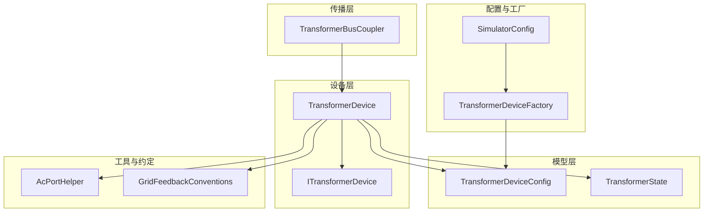
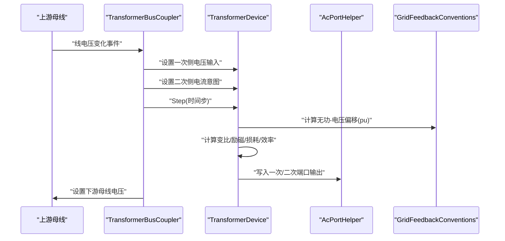
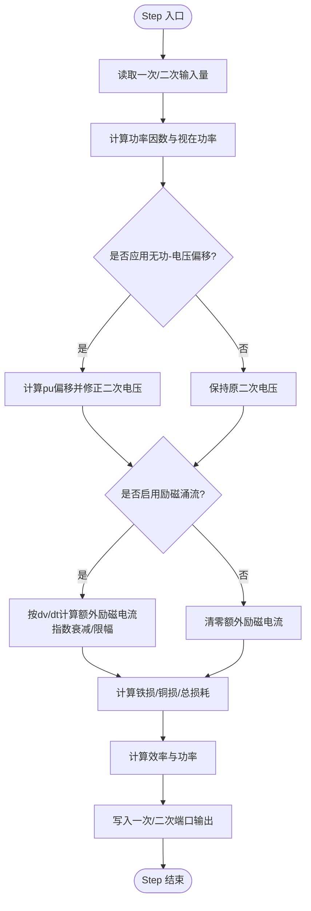
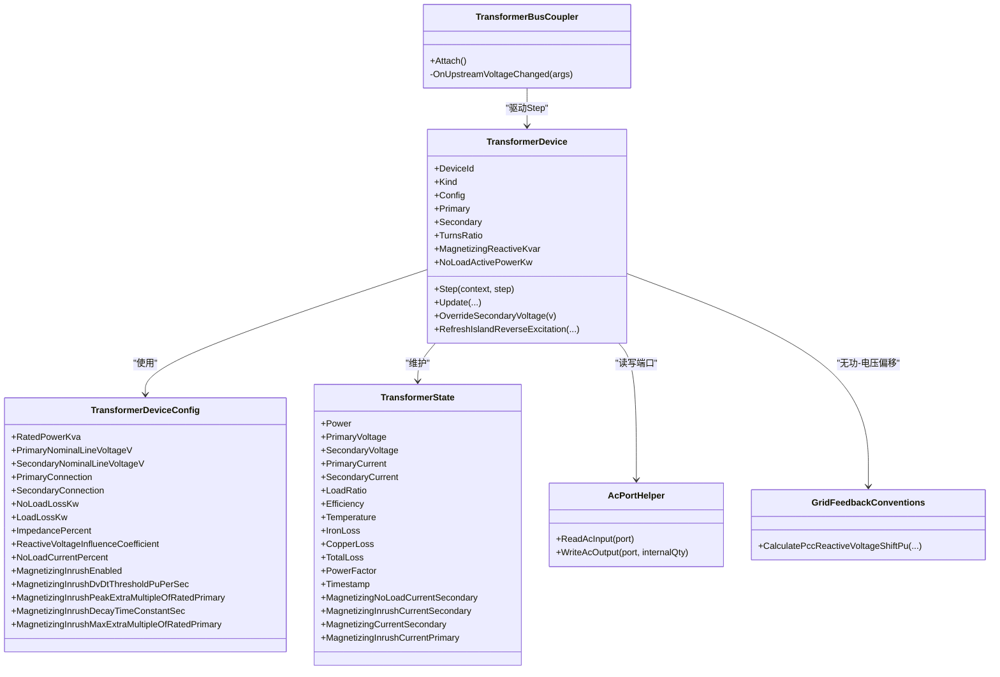

# 变压器设备

<cite>
**本文引用的文件**
- [TransformerDevice.cs](file://EssDeviceSimModel/Devices/TransformerDevice.cs)
- [ITransformerDevice.cs](file://EssDeviceSimModel/Interface/ITransformerDevice.cs)
- [TransformerDeviceConfig.cs](file://EssDeviceSimModel/Model/TransformerDeviceConfig.cs)
- [TransformerState.cs](file://EssDeviceSimModel/Model/TransformerState.cs)
- [TransformerBusCoupler.cs](file://EssDeviceSimModel/Propagation/TransformerBusCoupler.cs)
- [AcPortHelper.cs](file://EssDeviceSimModel/Devices/AcPortHelper.cs)
- [GridFeedbackConventions.cs](file://EssDeviceSimModel/GridFeedbackConventions.cs)
- [PvTransformerMonitor.cs](file://EssDeviceSimModel/Pv/PvTransformerMonitor.cs)
- [SimulatorConfig.cs](file://Configuration/SimulatorConfig.cs)
- [TransformerDeviceFactory.cs](file://EssDeviceSimModel/Devices/TransformerDeviceFactory.cs)
</cite>

## 目录
1. [简介](#简介)
2. [项目结构](#项目结构)
3. [核心组件](#核心组件)
4. [架构总览](#架构总览)
5. [详细组件分析](#详细组件分析)
6. [依赖关系分析](#依赖关系分析)
7. [性能考虑](#性能考虑)
8. [故障排查指南](#故障排查指南)
9. [结论](#结论)
10. [附录：配置与使用示例](#附录：配置与使用示例)

## 简介
本文件面向储能仿真系统中的“变压器设备”，系统性阐述 TransformerDevice 的实现原理，包括电磁耦合建模、阻抗计算与损耗分析；说明电气特性模拟、电压变换比与相位偏移处理；解释保护功能、过载检测与温度监控；并提供参数配置、阈值设置与典型故障场景的处理方法。同时给出选型指导与性能评估方法，帮助读者在工程实践中正确配置与评估变压器模型。

## 项目结构
围绕变压器设备的关键代码分布在以下模块：
- 设备实现与接口：TransformerDevice、ITransformerDevice
- 配置与状态：TransformerDeviceConfig、TransformerState
- 网络传播耦合：TransformerBusCoupler
- 交流端口工具：AcPortHelper
- 无功-电压反馈约定：GridFeedbackConventions
- 箱变温度监控（光伏单元）：PvTransformerMonitor
- 配置映射与工厂：SimulatorConfig、TransformerDeviceFactory

图表来源
- [TransformerDevice.cs:6-34](file://EssDeviceSimModel/Devices/TransformerDevice.cs#L6-L34)
- [ITransformerDevice.cs:1-9](file://EssDeviceSimModel/Interface/ITransformerDevice.cs#L1-L9)
- [TransformerDeviceConfig.cs:1-22](file://EssDeviceSimModel/Model/TransformerDeviceConfig.cs#L1-L22)
- [TransformerState.cs:1-24](file://EssDeviceSimModel/Model/TransformerState.cs#L1-L24)
- [TransformerBusCoupler.cs:1-59](file://EssDeviceSimModel/Propagation/TransformerBusCoupler.cs#L1-L59)
- [AcPortHelper.cs:1-29](file://EssDeviceSimModel/Devices/AcPortHelper.cs#L1-L29)
- [GridFeedbackConventions.cs:1-72](file://EssDeviceSimModel/GridFeedbackConventions.cs#L1-L72)
- [SimulatorConfig.cs:403-444](file://Configuration/SimulatorConfig.cs#L403-L444)
- [TransformerDeviceFactory.cs:1-75](file://EssDeviceSimModel/Devices/TransformerDeviceFactory.cs#L1-L75)

章节来源
- [TransformerDevice.cs:6-34](file://EssDeviceSimModel/Devices/TransformerDevice.cs#L6-L34)
- [TransformerDeviceConfig.cs:1-22](file://EssDeviceSimModel/Model/TransformerDeviceConfig.cs#L1-L22)
- [TransformerState.cs:1-24](file://EssDeviceSimModel/Model/TransformerState.cs#L1-L24)
- [TransformerBusCoupler.cs:1-59](file://EssDeviceSimModel/Propagation/TransformerBusCoupler.cs#L1-L59)
- [AcPortHelper.cs:1-29](file://EssDeviceSimModel/Devices/AcPortHelper.cs#L1-L29)
- [GridFeedbackConventions.cs:1-72](file://EssDeviceSimModel/GridFeedbackConventions.cs#L1-L72)
- [SimulatorConfig.cs:403-444](file://Configuration/SimulatorConfig.cs#L403-L444)
- [TransformerDeviceFactory.cs:1-75](file://EssDeviceSimModel/Devices/TransformerDeviceFactory.cs#L1-L75)

## 核心组件
- TransformerDevice：实现双端口变压器的物理仿真，包含励磁涌流、铁损/铜损、效率、负载率、无功-电压偏移等。
- ITransformerDevice：暴露励磁无功与空载有功能力。
- TransformerDeviceConfig：额定容量、一次/二次额定电压、连接方式、空载/负载损耗、阻抗百分比、无功电压影响系数、空载电流百分比、励磁涌流相关参数。
- TransformerState：运行时状态，包含功率、电压、电流、负载率、效率、温度、损耗、功率因数、励磁分量等。
- TransformerBusCoupler：将上游母线电压与下游电流意图注入变压器，驱动 Step 并更新下游母线电压。
- AcPortHelper：读写交流端口内部量。
- GridFeedbackConventions：提供无功-电压偏移计算与 PCC 电压推导。
- PvTransformerMonitor：箱变油温/绕组温度与告警/跳闸位。
- SimulatorConfig：配置文件映射（Transformer/UnitTransformer）。
- TransformerDeviceFactory：从配置对象创建 TransformerDeviceConfig 与设备实例。

章节来源
- [TransformerDevice.cs:6-34](file://EssDeviceSimModel/Devices/TransformerDevice.cs#L6-L34)
- [ITransformerDevice.cs:1-9](file://EssDeviceSimModel/Interface/ITransformerDevice.cs#L1-L9)
- [TransformerDeviceConfig.cs:1-22](file://EssDeviceSimModel/Model/TransformerDeviceConfig.cs#L1-L22)
- [TransformerState.cs:1-24](file://EssDeviceSimModel/Model/TransformerState.cs#L1-L24)
- [TransformerBusCoupler.cs:1-59](file://EssDeviceSimModel/Propagation/TransformerBusCoupler.cs#L1-L59)
- [AcPortHelper.cs:1-29](file://EssDeviceSimModel/Devices/AcPortHelper.cs#L1-L29)
- [GridFeedbackConventions.cs:1-72](file://EssDeviceSimModel/GridFeedbackConventions.cs#L1-L72)
- [PvTransformerMonitor.cs:1-25](file://EssDeviceSimModel/Pv/PvTransformerMonitor.cs#L1-L25)
- [SimulatorConfig.cs:403-444](file://Configuration/SimulatorConfig.cs#L403-L444)
- [TransformerDeviceFactory.cs:1-75](file://EssDeviceSimModel/Devices/TransformerDeviceFactory.cs#L1-L75)

## 架构总览
变压器设备通过上游母线电压与下游电流意图进行步进求解，输出两侧端口量，并在并网且电网可用时，由无穷大电网吸收励磁与铁损无功，仅传递穿越功率；离网或励磁涌流期间仍输出完整励磁分量。

图表来源
- [TransformerBusCoupler.cs:32-56](file://EssDeviceSimModel/Propagation/TransformerBusCoupler.cs#L32-L56)
- [TransformerDevice.cs:68-88](file://EssDeviceSimModel/Devices/TransformerDevice.cs#L68-L88)
- [TransformerDevice.cs:129-250](file://EssDeviceSimModel/Devices/TransformerDevice.cs#L129-L250)
- [GridFeedbackConventions.cs:61-69](file://EssDeviceSimModel/GridFeedbackConventions.cs#L61-L69)
- [AcPortHelper.cs:7-18](file://EssDeviceSimModel/Devices/AcPortHelper.cs#L7-L18)

## 详细组件分析

### TransformerDevice：电磁耦合、阻抗与损耗
- 电磁耦合建模
  - 基于一次侧线电压与二次侧负载电流，结合变比计算二次侧电压与一次侧等效电流。
  - 空载励磁电流按空载电流百分比与一次侧标称值估算，叠加励磁涌流分量。
  - 无功-电压偏移：根据并网点总无功、额定容量、等效阻抗百分比与影响系数计算 pu 偏移，再乘以 netVoltageFactor 修正二次侧电压。
- 阻抗计算
  - 使用配置的阻抗百分比作为等效 pu 阻抗，参与无功引起的电压偏移计算。
- 损耗分析
  - 铁损：按空载损耗与一次侧电压平方比例计算。
  - 铜损：按负载损耗与负载率的平方计算。
  - 总损耗为铁损与铜损之和，用于效率计算。
- 效率与功率
  - 效率 = 输出功率 / (输出功率 + 总损耗)。
  - 功率方向依据负载电流符号与无功分量确定。
- 励磁涌流
  - 当启用时，根据一次侧电压变化率触发额外励磁电流，具有峰值倍数限制与指数衰减时间常数。
  - 涌流期间，二次侧仍输出完整励磁分量；并网且电网可用且非涌流时，励磁与铁损由电网吸收，端口仅传递穿越功率。

图表来源
- [TransformerDevice.cs:68-88](file://EssDeviceSimModel/Devices/TransformerDevice.cs#L68-L88)
- [TransformerDevice.cs:129-250](file://EssDeviceSimModel/Devices/TransformerDevice.cs#L129-L250)
- [TransformerDevice.cs:256-278](file://EssDeviceSimModel/Devices/TransformerDevice.cs#L256-L278)

章节来源
- [TransformerDevice.cs:68-88](file://EssDeviceSimModel/Devices/TransformerDevice.cs#L68-L88)
- [TransformerDevice.cs:129-250](file://EssDeviceSimModel/Devices/TransformerDevice.cs#L129-L250)
- [TransformerDevice.cs:256-278](file://EssDeviceSimModel/Devices/TransformerDevice.cs#L256-L278)

### 电压变换比与相位偏移处理
- 变比：一次侧额定线电压与二次侧额定线电压之比。
- 二次侧电压：一次侧电压除以变比，再乘以无功-电压偏移因子。
- 相位偏移：通过无功-电压偏移间接体现；若需要显式相角控制，可在上层拓扑中结合频率与同步策略处理。

章节来源
- [TransformerDevice.cs:36-38](file://EssDeviceSimModel/Devices/TransformerDevice.cs#L36-L38)
- [TransformerDevice.cs:186-199](file://EssDeviceSimModel/Devices/TransformerDevice.cs#L186-L199)
- [GridFeedbackConventions.cs:61-69](file://EssDeviceSimModel/GridFeedbackConventions.cs#L61-L69)

### 保护功能、过载检测与温度监控
- 过载检测
  - 负载率 = 二次侧负载电流绝对值 / 二次侧额定电流。
  - 可通过负载率与电流限值在上层逻辑中触发降额或保护动作。
- 温度监控
  - 设备状态包含温度字段；实际温度模型可结合热网络或简化模型（如箱变油温/绕组温度）进行估算。
  - 箱变温度监控提供油温/绕组温度及告警/跳闸位，便于与上位系统对接。
- 保护联动
  - 当检测到过流、高温等条件时，可在上层控制器中执行跳闸或降额；变压器本身不直接执行断路器动作，但会输出状态供上层判断。

章节来源
- [TransformerDevice.cs:224-242](file://EssDeviceSimModel/Devices/TransformerDevice.cs#L224-L242)
- [TransformerState.cs:1-24](file://EssDeviceSimModel/Model/TransformerState.cs#L1-L24)
- [PvTransformerMonitor.cs:1-25](file://EssDeviceSimModel/Pv/PvTransformerMonitor.cs#L1-L25)

### 与网络传播的耦合
- TransformerBusCoupler 负责将上游母线电压与下游电流意图注入变压器，调用 Step 后，将二次侧输出电压写回下游母线。
- 该耦合确保变压器在辐射状网络中的电压传播一致性。

章节来源
- [TransformerBusCoupler.cs:32-56](file://EssDeviceSimModel/Propagation/TransformerBusCoupler.cs#L32-L56)

## 依赖关系分析
- TransformerDevice 依赖：
  - TransformerDeviceConfig：参数来源。
  - TransformerState：运行时状态。
  - AcPortHelper：端口读写。
  - GridFeedbackConventions：无功-电压偏移计算。
- TransformerBusCoupler 依赖：
  - TransformerDevice：驱动仿真步进。
  - ElectricalBusNode：上下游母线节点。
- 配置映射：
  - SimulatorConfig 定义 Transformer/UnitTransformer 配置项。
  - TransformerDeviceFactory 将配置转换为 TransformerDeviceConfig 并创建设备。

图表来源
- [TransformerDevice.cs:6-34](file://EssDeviceSimModel/Devices/TransformerDevice.cs#L6-L34)
- [TransformerDeviceConfig.cs:1-22](file://EssDeviceSimModel/Model/TransformerDeviceConfig.cs#L1-L22)
- [TransformerState.cs:1-24](file://EssDeviceSimModel/Model/TransformerState.cs#L1-L24)
- [TransformerBusCoupler.cs:1-59](file://EssDeviceSimModel/Propagation/TransformerBusCoupler.cs#L1-L59)
- [AcPortHelper.cs:1-29](file://EssDeviceSimModel/Devices/AcPortHelper.cs#L1-L29)
- [GridFeedbackConventions.cs:1-72](file://EssDeviceSimModel/GridFeedbackConventions.cs#L1-L72)

章节来源
- [TransformerDevice.cs:6-34](file://EssDeviceSimModel/Devices/TransformerDevice.cs#L6-L34)
- [TransformerDeviceConfig.cs:1-22](file://EssDeviceSimModel/Model/TransformerDeviceConfig.cs#L1-L22)
- [TransformerState.cs:1-24](file://EssDeviceSimModel/Model/TransformerState.cs#L1-L24)
- [TransformerBusCoupler.cs:1-59](file://EssDeviceSimModel/Propagation/TransformerBusCoupler.cs#L1-L59)
- [AcPortHelper.cs:1-29](file://EssDeviceSimModel/Devices/AcPortHelper.cs#L1-L29)
- [GridFeedbackConventions.cs:1-72](file://EssDeviceSimModel/GridFeedbackConventions.cs#L1-L72)

## 性能考虑
- 计算复杂度
  - 每步主要运算为代数计算与指数衰减，复杂度 O(1)，适合高频仿真步长。
- 数值稳定性
  - 对一次侧标幺电压进行限幅，避免极端值导致数值不稳定。
  - 负载率与电流计算采用绝对值与符号分离，保证方向正确性。
- 性能优化建议
  - 合理设置仿真步长，避免过小步长导致计算开销增大。
  - 在大规模网络中，利用辐射状网络的传播机制减少迭代次数。
  - 对频繁调用的无功-电压偏移计算，可缓存中间结果以减少重复计算。

[本节为通用性能讨论，不直接分析具体文件]

## 故障排查指南
- 常见异常与定位
  - 二次侧电压异常：检查一次侧电压输入、变比配置与无功-电压偏移系数。
  - 励磁涌流过大：检查 dv/dt 阈值、峰值倍数与衰减时间常数；确认是否处于合闸或电压突变场景。
  - 效率过低：检查空载/负载损耗配置与负载率；确认功率因数与无功设定。
  - 温度告警：检查环境温度、负载率与热模型参数；核对箱变温度监控阈值。
- 排查步骤
  - 读取 TransformerState 中的关键量：PrimaryVoltage、SecondaryVoltage、LoadRatio、IronLoss、CopperLoss、TotalLoss、Efficiency、MagnetizingCurrentSecondary。
  - 检查配置项：ImpedancePercent、ReactiveVoltageInfluenceCoefficient、NoLoadLossKw、LoadLossKw、NoLoadCurrentPercent、励磁涌流相关参数。
  - 验证网络传播：确认上游母线电压与下游电流意图是否正确注入。

章节来源
- [TransformerDevice.cs:129-250](file://EssDeviceSimModel/Devices/TransformerDevice.cs#L129-L250)
- [TransformerState.cs:1-24](file://EssDeviceSimModel/Model/TransformerState.cs#L1-L24)
- [PvTransformerMonitor.cs:1-25](file://EssDeviceSimModel/Pv/PvTransformerMonitor.cs#L1-L25)

## 结论
TransformerDevice 提供了完整的变压器电磁耦合、阻抗与损耗建模，支持无功-电压偏移与励磁涌流仿真，能够准确反映并网与离网工况下的行为。配合 TransformerBusCoupler 可实现辐射状网络中的电压传播。通过合理的配置与监控，可满足储能系统中变压器设备的仿真需求，并为保护与调度策略提供可靠数据支撑。

[本节为总结性内容，不直接分析具体文件]

## 附录：配置与使用示例
- 配置变压器参数
  - 在配置文件中设置 Transformer 或 UnitTransformer 节，包括额定容量、一次/二次额定电压、空载/负载损耗、阻抗百分比、无功电压影响系数、空载电流百分比以及励磁涌流相关参数。
  - 使用 TransformerDeviceFactory 将配置转换为 TransformerDeviceConfig 并创建设备实例。
- 设置保护阈值
  - 根据负载率与电流限值设置过载保护阈值；结合温度监控设置油温/绕组温度告警与跳闸阈值。
- 处理故障场景
  - 当检测到过流或高温时，在上层控制器中执行降额或跳闸；在离网或励磁涌流期间，注意励磁分量由设备输出而非电网吸收。

章节来源
- [SimulatorConfig.cs:403-444](file://Configuration/SimulatorConfig.cs#L403-L444)
- [TransformerDeviceFactory.cs:8-72](file://EssDeviceSimModel/Devices/TransformerDeviceFactory.cs#L8-L72)
- [PvTransformerMonitor.cs:1-25](file://EssDeviceSimModel/Pv/PvTransformerMonitor.cs#L1-L25)