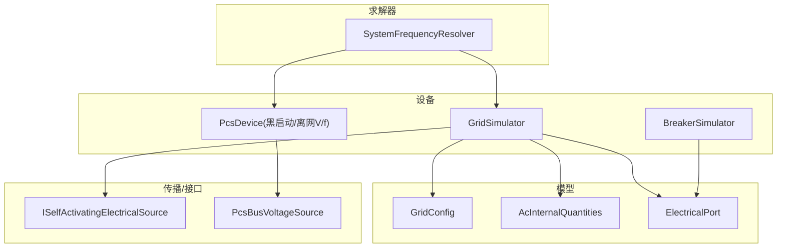
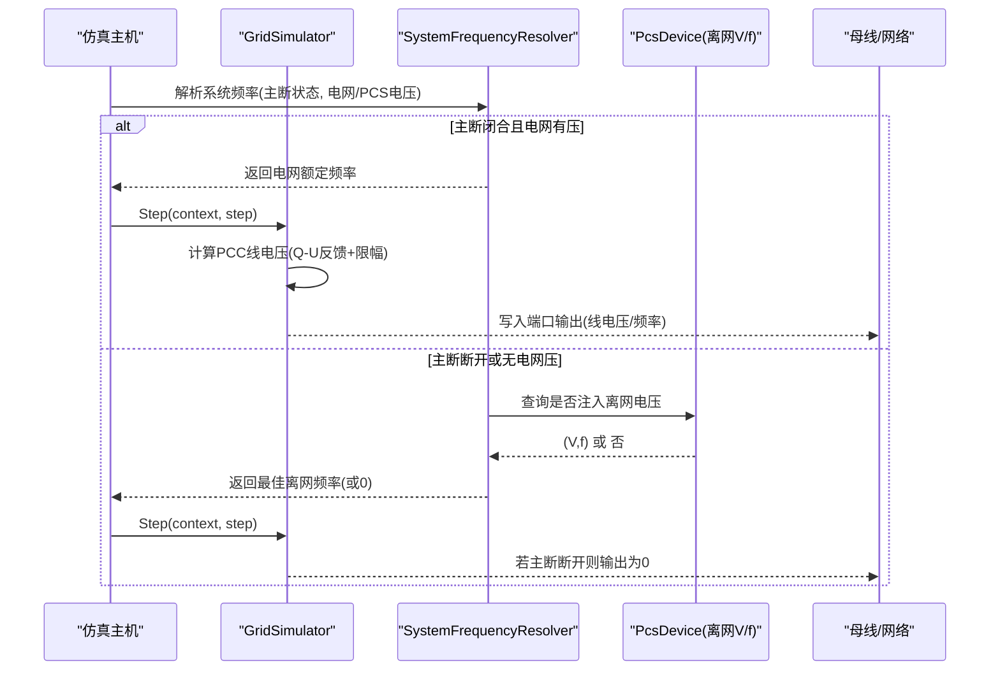
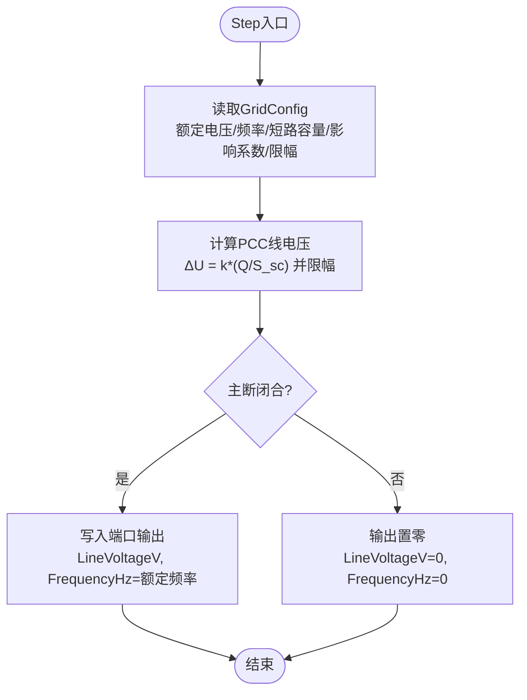
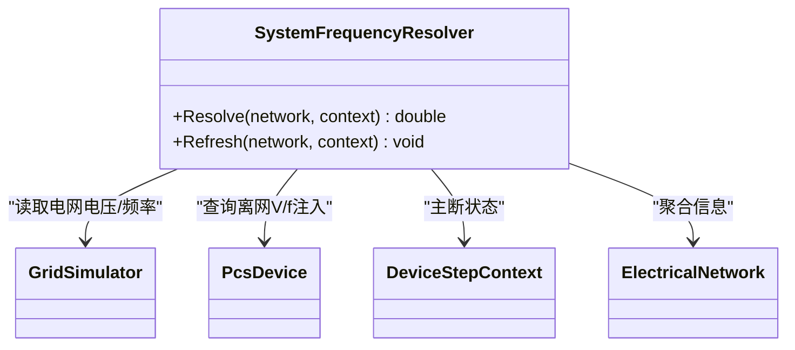
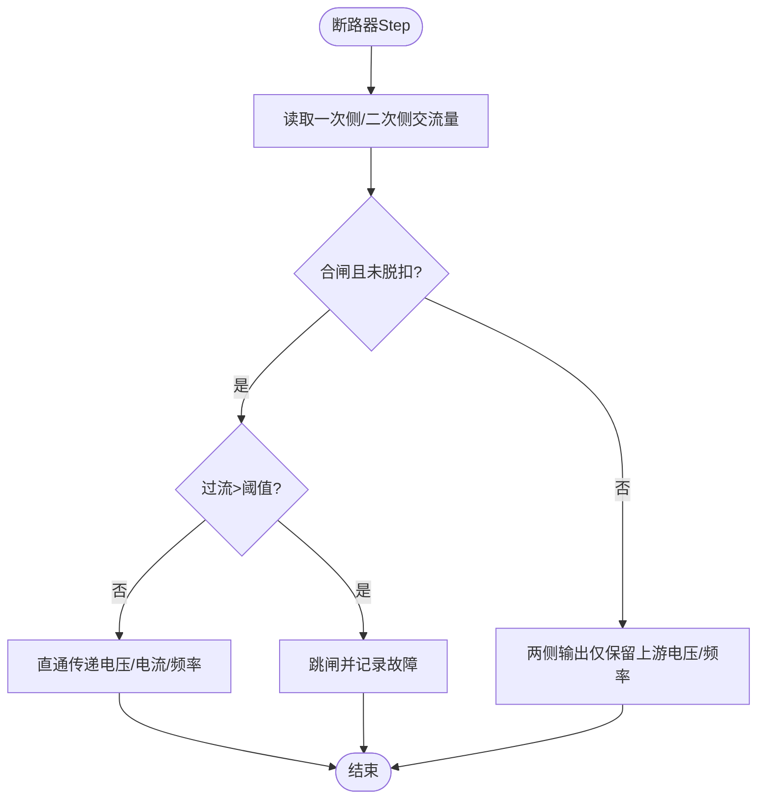
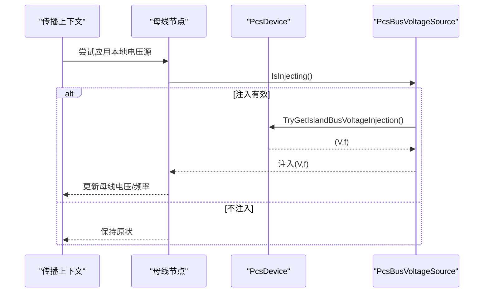
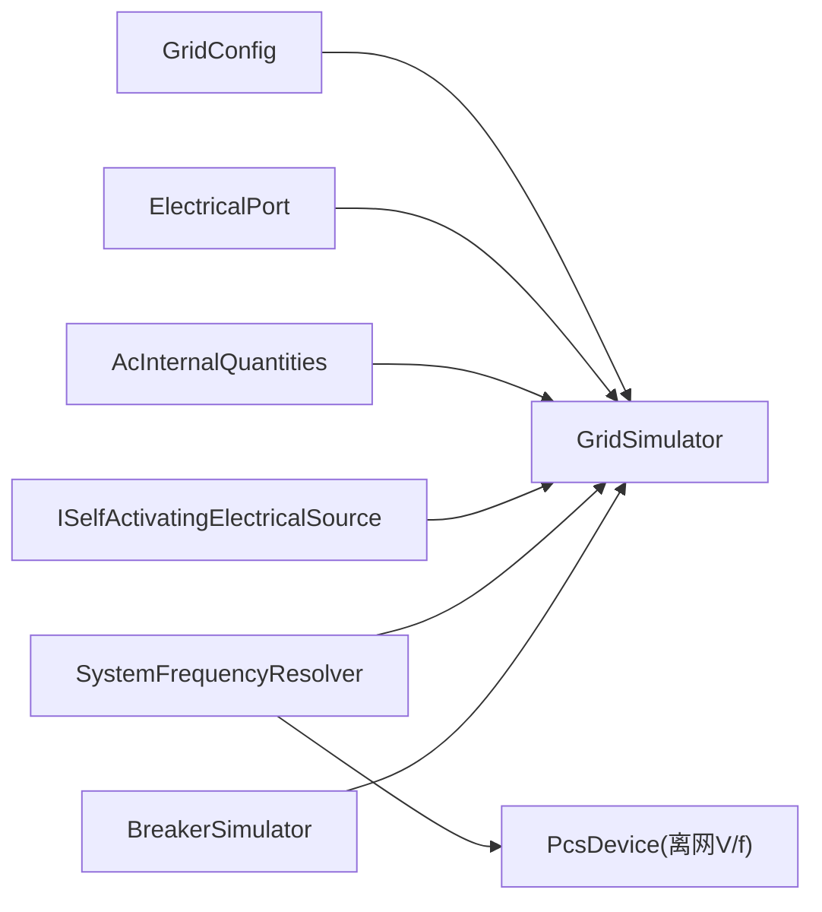

# 电网模拟器

<cite>
**本文引用的文件**
- [GridSimulator.cs](file://EssDeviceSimModel/Devices/GridSimulator.cs)
- [GridConfig.cs](file://EssDeviceSimModel/Model/GridConfig.cs)
- [IGridDevice.cs](file://EssDeviceSimModel/Interface/IGridDevice.cs)
- [ISelfActivatingElectricalSource.cs](file://EssDeviceSimModel/Propagation/ISelfActivatingElectricalSource.cs)
- [AcInternalQuantities.cs](file://EssDeviceSimModel/Model/AcInternalQuantities.cs)
- [ElectricalPort.cs](file://EssDeviceSimModel/Model/ElectricalPort.cs)
- [SystemFrequencyResolver.cs](file://EssDeviceSimModel/Solver/SystemFrequencyResolver.cs)
- [BreakerSimulator.cs](file://EssDeviceSimModel/Devices/BreakerSimulator.cs)
- [PcsBusVoltageSource.cs](file://EssDeviceSimModel/Propagation/PcsBusVoltageSource.cs)
- [PcsDevice.BlackStart.cs](file://EssDeviceSimModel/Devices/PcsDevice.BlackStart.cs)
- [SystemFrequencyResolverTests.cs](file://EssSimulator.Tests/Solver/SystemFrequencyResolverTests.cs)
</cite>

## 目录
1. [简介](#简介)
2. [项目结构](#项目结构)
3. [核心组件](#核心组件)
4. [架构总览](#架构总览)
5. [详细组件分析](#详细组件分析)
6. [依赖关系分析](#依赖关系分析)
7. [性能考虑](#性能考虑)
8. [故障排查指南](#故障排查指南)
9. [结论](#结论)
10. [附录：配置与使用示例](#附录配置与使用示例)

## 简介
本文件面向电网模拟器的实现与使用，重点解释 GridSimulator 的实现原理，包括理想电压源建模、频率控制与电压调节机制；说明电网强度模拟、短路容量计算与故障注入能力；阐述其在微电网与孤岛运行中的作用；并提供配置电网参数、设置故障条件与模拟不同电网条件的实践方法。同时给出稳定性分析与电能质量评估的实用建议。

## 项目结构
围绕电网模拟的核心代码主要位于设备模型与求解传播层：
- 设备层：GridSimulator（电网模拟）、BreakerSimulator（断路器模拟）
- 模型层：GridConfig（电网配置）、AcInternalQuantities（交流内部量）、ElectricalPort（端口快照）
- 接口与传播：ISelfActivatingElectricalSource（自激电源接口）、PcsBusVoltageSource（PCS 作为本地母线电压源）
- 求解器：SystemFrequencyResolver（系统频率解析）
- 测试：SystemFrequencyResolverTests（频率解析行为验证）

图表来源
- [GridSimulator.cs:1-86](file://EssDeviceSimModel/Devices/GridSimulator.cs#L1-L86)
- [GridConfig.cs:1-15](file://EssDeviceSimModel/Model/GridConfig.cs#L1-L15)
- [AcInternalQuantities.cs:1-31](file://EssDeviceSimModel/Model/AcInternalQuantities.cs#L1-L31)
- [ElectricalPort.cs:1-11](file://EssDeviceSimModel/Model/ElectricalPort.cs#L1-L11)
- [ISelfActivatingElectricalSource.cs:1-17](file://EssDeviceSimModel/Propagation/ISelfActivatingElectricalSource.cs#L1-L17)
- [PcsBusVoltageSource.cs:1-26](file://EssDeviceSimModel/Propagation/PcsBusVoltageSource.cs#L1-L26)
- [SystemFrequencyResolver.cs:1-45](file://EssDeviceSimModel/Solver/SystemFrequencyResolver.cs#L1-L45)

章节来源
- [GridSimulator.cs:1-86](file://EssDeviceSimModel/Devices/GridSimulator.cs#L1-L86)
- [GridConfig.cs:1-15](file://EssDeviceSimModel/Model/GridConfig.cs#L1-L15)
- [SystemFrequencyResolver.cs:1-45](file://EssDeviceSimModel/Solver/SystemFrequencyResolver.cs#L1-L45)

## 核心组件
- GridSimulator：实现 IGridDevice 与 ISelfActivatingElectricalSource，提供理想电压源输出，按无功-电压反馈计算并网点线电压，并在主断分闸时置零输出。
- GridConfig：定义额定线电压、连接方式、额定频率、短路容量、最大电压偏移百分比、无功电压影响系数等关键参数。
- AcInternalQuantities：封装三相交流内部量（线电压、线电流、相位角、频率），并可推导有功、无功、视在功率与功率因数。
- ElectricalPort：描述设备的输入/输出端口快照，承载交流域数据。
- BreakerSimulator：模拟断路器合分闸、过流脱扣与故障状态，用于故障注入与保护逻辑。
- SystemFrequencyResolver：根据主断状态与电网/PCS 电压情况解析系统唯一频率源。
- PcsBusVoltageSource：在离网/黑启动 V/f 模式下，将 PCS 作为 690V 母线电压源向局部母线注入电压与频率。

章节来源
- [GridSimulator.cs:1-86](file://EssDeviceSimModel/Devices/GridSimulator.cs#L1-L86)
- [GridConfig.cs:1-15](file://EssDeviceSimModel/Model/GridConfig.cs#L1-L15)
- [AcInternalQuantities.cs:1-31](file://EssDeviceSimModel/Model/AcInternalQuantities.cs#L1-L31)
- [ElectricalPort.cs:1-11](file://EssDeviceSimModel/Model/ElectricalPort.cs#L1-L11)
- [BreakerSimulator.cs:1-116](file://EssDeviceSimModel/Devices/BreakerSimulator.cs#L1-L116)
- [SystemFrequencyResolver.cs:1-45](file://EssDeviceSimModel/Solver/SystemFrequencyResolver.cs#L1-L45)
- [PcsBusVoltageSource.cs:1-26](file://EssDeviceSimModel/Propagation/PcsBusVoltageSource.cs#L1-L26)

## 架构总览
电网模拟器以“理想电压源 + 无功-电压反馈”的方式模拟并网点（PCC）特性，结合断路器与 PCS 的离网能力，支持并网与孤岛两种运行模式。

图表来源
- [SystemFrequencyResolver.cs:1-45](file://EssDeviceSimModel/Solver/SystemFrequencyResolver.cs#L1-L45)
- [GridSimulator.cs:1-86](file://EssDeviceSimModel/Devices/GridSimulator.cs#L1-L86)
- [PcsBusVoltageSource.cs:1-26](file://EssDeviceSimModel/Propagation/PcsBusVoltageSource.cs#L1-L26)
- [PcsDevice.BlackStart.cs:1-36](file://EssDeviceSimModel/Devices/PcsDevice.BlackStart.cs#L1-L36)

## 详细组件分析

### GridSimulator：理想电压源与无功-电压反馈
- 理想电压源建模：每步根据额定频率与计算得到的并网点线电压输出端口快照；当主断打开时直接置零输出，体现与外网的解列。
- 频率控制：频率取自电网额定频率；当无有效电压时频率归零，配合系统频率解析器确保全系统频率一致性。
- 电压调节：通过无功-电压反馈计算 PCC 线电压，公式基于短路容量与无功注入，并限制最大电压偏移百分比，避免越限。
- 端口与内部量：使用 ElectricalPort 与 AcInternalQuantities 传递三相交流量，便于后续功率与电能质量指标推导。

图表来源
- [GridSimulator.cs:1-86](file://EssDeviceSimModel/Devices/GridSimulator.cs#L1-L86)
- [GridConfig.cs:1-15](file://EssDeviceSimModel/Model/GridConfig.cs#L1-L15)
- [AcInternalQuantities.cs:1-31](file://EssDeviceSimModel/Model/AcInternalQuantities.cs#L1-L31)

章节来源
- [GridSimulator.cs:1-86](file://EssDeviceSimModel/Devices/GridSimulator.cs#L1-L86)
- [GridConfig.cs:1-15](file://EssDeviceSimModel/Model/GridConfig.cs#L1-L15)

### 系统频率解析：并网与孤岛切换
- 并网模式：主断闭合且电网有压时，系统频率等于电网额定频率。
- 孤岛模式：主断断开时，从各 PCS 的离网 V/f 注入中选取最高有效电压对应的频率作为系统频率；若无有效注入则频率为 0。
- 该逻辑确保在并网/孤岛切换过程中，全系统频率一致且合理。

图表来源
- [SystemFrequencyResolver.cs:1-45](file://EssDeviceSimModel/Solver/SystemFrequencyResolver.cs#L1-L45)
- [PcsDevice.BlackStart.cs:1-36](file://EssDeviceSimModel/Devices/PcsDevice.BlackStart.cs#L1-L36)

章节来源
- [SystemFrequencyResolver.cs:1-45](file://EssDeviceSimModel/Solver/SystemFrequencyResolver.cs#L1-L45)
- [SystemFrequencyResolverTests.cs:1-62](file://EssSimulator.Tests/Solver/SystemFrequencyResolverTests.cs#L1-L62)

### 断路器与故障注入
- 断路器模拟：支持合闸、分闸、复位脱扣；在合闸且未脱扣状态下检测过流，超过阈值自动跳闸并记录故障码与消息。
- 故障注入：通过命令或外部控制改变断路器状态，可模拟线路断开、短路导致的过流跳闸等场景，配合电网模拟器实现故障传播与保护动作。

图表来源
- [BreakerSimulator.cs:1-116](file://EssDeviceSimModel/Devices/BreakerSimulator.cs#L1-L116)

章节来源
- [BreakerSimulator.cs:1-116](file://EssDeviceSimModel/Devices/BreakerSimulator.cs#L1-L116)

### 离网与黑启动：PCS 作为本地电压源
- 在离网或黑启动 V/f 模式下，PCS 可作为 690V 母线的电压源，向局部母线注入线电压与频率。
- PcsBusVoltageSource 封装了 PCS 的注入能力，供传播层在构建母线电压时使用。

图表来源
- [PcsBusVoltageSource.cs:1-26](file://EssDeviceSimModel/Propagation/PcsBusVoltageSource.cs#L1-L26)
- [PcsDevice.BlackStart.cs:1-36](file://EssDeviceSimModel/Devices/PcsDevice.BlackStart.cs#L1-L36)

章节来源
- [PcsBusVoltageSource.cs:1-26](file://EssDeviceSimModel/Propagation/PcsBusVoltageSource.cs#L1-L26)
- [PcsDevice.BlackStart.cs:1-36](file://EssDeviceSimModel/Devices/PcsDevice.BlackStart.cs#L1-L36)

## 依赖关系分析
- GridSimulator 依赖 GridConfig 提供电网参数，依赖 ElectricalPort 与 AcInternalQuantities 进行数据交换，并通过 ISelfActivatingElectricalSource 被调度器周期激活。
- SystemFrequencyResolver 依赖电网与 PCS 的状态来统一系统频率，保证并网/孤岛切换的一致性。
- BreakerSimulator 与电网模拟器共同构成故障传播路径：断路器过流跳闸会切断下游供电，从而模拟故障隔离。

图表来源
- [GridSimulator.cs:1-86](file://EssDeviceSimModel/Devices/GridSimulator.cs#L1-L86)
- [GridConfig.cs:1-15](file://EssDeviceSimModel/Model/GridConfig.cs#L1-L15)
- [SystemFrequencyResolver.cs:1-45](file://EssDeviceSimModel/Solver/SystemFrequencyResolver.cs#L1-L45)
- [BreakerSimulator.cs:1-116](file://EssDeviceSimModel/Devices/BreakerSimulator.cs#L1-L116)

章节来源
- [GridSimulator.cs:1-86](file://EssDeviceSimModel/Devices/GridSimulator.cs#L1-L86)
- [SystemFrequencyResolver.cs:1-45](file://EssDeviceSimModel/Solver/SystemFrequencyResolver.cs#L1-L45)
- [BreakerSimulator.cs:1-116](file://EssDeviceSimModel/Devices/BreakerSimulator.cs#L1-L116)

## 性能考虑
- 计算复杂度：GridSimulator 每步执行常数时间操作（参数读取、简单算术与赋值），对实时仿真友好。
- 短路容量与限幅：短路容量越大，相同无功引起的电压偏移越小；最大电压偏移限幅防止极端工况下的数值发散。
- 频率解析：系统频率解析遍历 PCS 列表，数量通常有限，开销可控；建议在大规模系统中按需优化扫描范围。
- 断路器过流检测：仅在合闸且未脱扣时检查电流，减少不必要计算。

[本节为通用性能讨论，不直接分析具体文件]

## 故障排查指南
- 频率异常
  - 现象：系统频率为 0 或不符合预期。
  - 排查：确认主断状态与电网电压；若主断断开，检查 PCS 是否处于离网 V/f 注入状态。
  - 参考：系统频率解析逻辑与测试用例。
- 电压偏移异常
  - 现象：PCC 电压偏移过大或过小。
  - 排查：核对短路容量、无功电压影响系数与最大电压偏移百分比；确认总无功注入是否正确设置。
- 断路器误跳闸
  - 现象：正常负载下断路器跳闸。
  - 排查：检查过流阈值设置与采样电流；确认是否存在短路或测量噪声导致瞬时过流。
- 离网无法建压
  - 现象：主断断开后母线无电压或频率异常。
  - 排查：确认 PCS 是否进入软启/调压/同步阶段；检查离网注入电压与频率是否有效。

章节来源
- [SystemFrequencyResolver.cs:1-45](file://EssDeviceSimModel/Solver/SystemFrequencyResolver.cs#L1-L45)
- [SystemFrequencyResolverTests.cs:1-62](file://EssSimulator.Tests/Solver/SystemFrequencyResolverTests.cs#L1-L62)
- [BreakerSimulator.cs:1-116](file://EssDeviceSimModel/Devices/BreakerSimulator.cs#L1-L116)
- [PcsDevice.BlackStart.cs:1-36](file://EssDeviceSimModel/Devices/PcsDevice.BlackStart.cs#L1-L36)

## 结论
GridSimulator 以简洁高效的理想电压源模型实现了并网点电压与频率的仿真，结合无功-电压反馈与短路容量参数，能够准确反映电网强度对电压的影响。配合断路器与 PCS 的离网能力，系统可在并网与孤岛之间平滑切换，满足微电网与黑启动场景需求。通过合理的参数配置与故障注入，可实现多种电网条件与稳定性分析。

[本节为总结性内容，不直接分析具体文件]

## 附录：配置与使用示例
- 配置电网参数
  - 设置额定线电压、额定频率、短路容量、最大电压偏移百分比、无功电压影响系数与连接方式。
  - 参考：GridConfig 字段定义。
- 设置总无功注入
  - 通过接口设置并网点总无功（kvar），以驱动 Q-U 反馈计算 PCC 线电压。
  - 参考：IGridDevice 接口方法。
- 模拟并网运行
  - 保持主断闭合，确保电网有压；系统频率由电网额定频率决定。
  - 参考：SystemFrequencyResolver 逻辑与测试用例。
- 模拟孤岛运行
  - 断开主断，使 PCS 进入离网 V/f 模式并向 690V 母线注入电压与频率。
  - 参考：PcsBusVoltageSource 与 PCS 黑启动逻辑。
- 故障注入
  - 通过断路器命令合/分闸或触发过流跳闸，模拟线路断开或短路故障。
  - 参考：BreakerSimulator 的命令处理与 Step 流程。
- 电能质量评估
  - 利用 AcInternalQuantities 提供的线电压、线电流、相位角与频率，推导有功、无功、视在功率与功率因数，评估电压偏差、频率偏差与功率因数等指标。
  - 参考：AcInternalQuantities 属性与转换器。

章节来源
- [GridConfig.cs:1-15](file://EssDeviceSimModel/Model/GridConfig.cs#L1-L15)
- [IGridDevice.cs:1-10](file://EssDeviceSimModel/Interface/IGridDevice.cs#L1-L10)
- [SystemFrequencyResolver.cs:1-45](file://EssDeviceSimModel/Solver/SystemFrequencyResolver.cs#L1-L45)
- [PcsBusVoltageSource.cs:1-26](file://EssDeviceSimModel/Propagation/PcsBusVoltageSource.cs#L1-L26)
- [PcsDevice.BlackStart.cs:1-36](file://EssDeviceSimModel/Devices/PcsDevice.BlackStart.cs#L1-L36)
- [BreakerSimulator.cs:1-116](file://EssDeviceSimModel/Devices/BreakerSimulator.cs#L1-L116)
- [AcInternalQuantities.cs:1-31](file://EssDeviceSimModel/Model/AcInternalQuantities.cs#L1-L31)