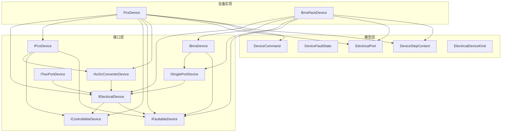
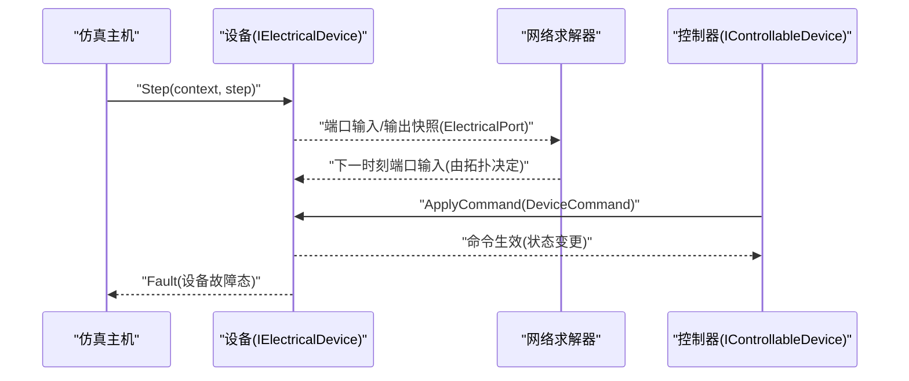
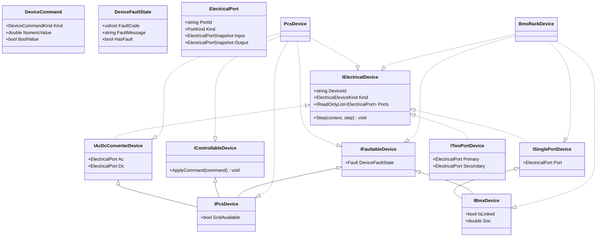
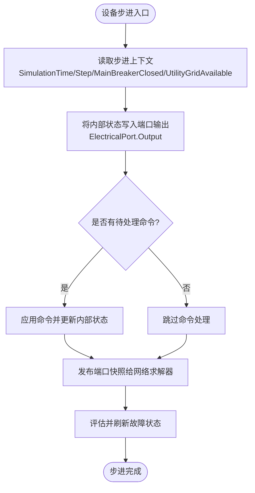
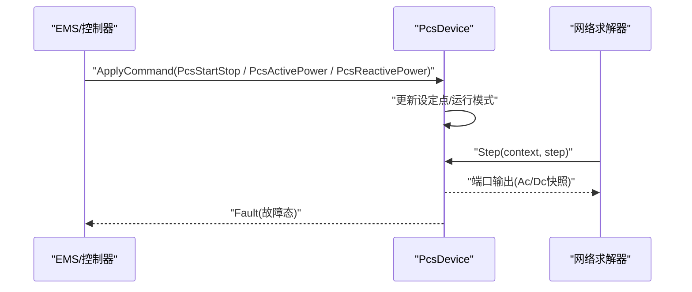
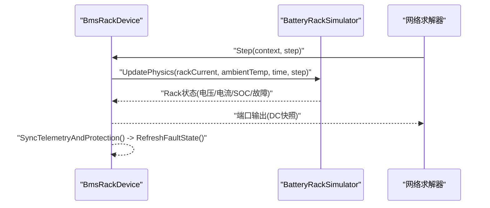
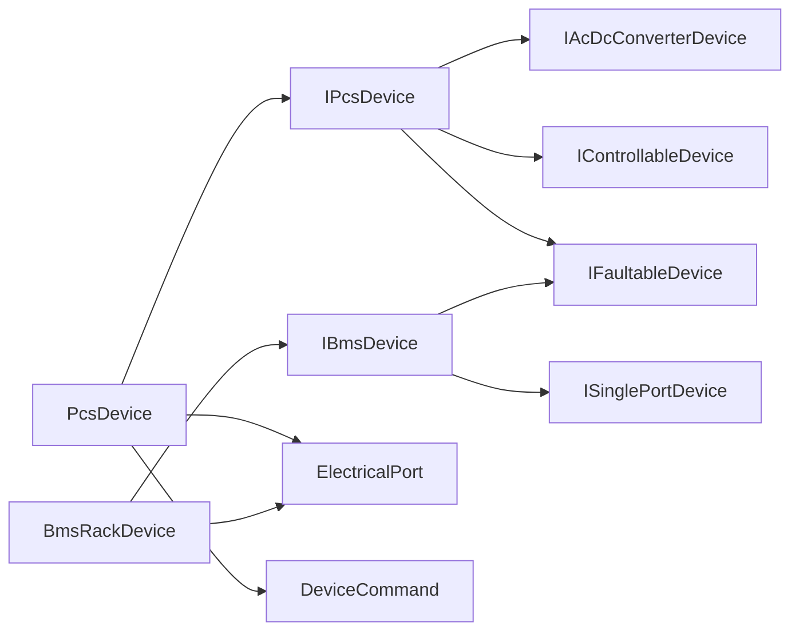

# 设备接口规范

<cite>
**本文引用的文件**
- [IElectricalDevice.cs](file://EssDeviceSimModel/Interface/IElectricalDevice.cs)
- [IControllableDevice.cs](file://EssDeviceSimModel/Interface/IControllableDevice.cs)
- [IFaultableDevice.cs](file://EssDeviceSimModel/Interface/IFaultableDevice.cs)
- [IPcsDevice.cs](file://EssDeviceSimModel/Interface/IPcsDevice.cs)
- [IBmsDevice.cs](file://EssDeviceSimModel/Interface/IBmsDevice.cs)
- [IAcDcConverterDevice.cs](file://EssDeviceSimModel/Interface/IAcDcConverterDevice.cs)
- [ISinglePortDevice.cs](file://EssDeviceSimModel/Interface/ISinglePortDevice.cs)
- [ITwoPortDevice.cs](file://EssDeviceSimModel/Interface/ITwoPortDevice.cs)
- [DeviceCommand.cs](file://EssDeviceSimModel/Model/DeviceCommand.cs)
- [DeviceState.cs](file://EssDeviceSimModel/Model/DeviceState.cs)
- [ElectricalPort.cs](file://EssDeviceSimModel/Model/ElectricalPort.cs)
- [DeviceStepContext.cs](file://EssDeviceSimModel/Model/DeviceStepContext.cs)
- [ElectricalDeviceKind.cs](file://EssDeviceSimModel/Model/ElectricalDeviceKind.cs)
- [PcsDevice.Core.cs](file://EssDeviceSimModel/Devices/PcsDevice.Core.cs)
- [BmsRackDevice.cs](file://EssDeviceSimModel/Devices/BmsRackDevice.cs)
</cite>

## 目录
1. [简介](#简介)
2. [项目结构](#项目结构)
3. [核心组件](#核心组件)
4. [架构总览](#架构总览)
5. [详细组件分析](#详细组件分析)
6. [依赖关系分析](#依赖关系分析)
7. [性能考虑](#性能考虑)
8. [故障排查指南](#故障排查指南)
9. [结论](#结论)
10. [附录](#附录)

## 简介
本规范面向储能仿真系统中的“设备”抽象，定义统一的设备接口、生命周期管理、状态同步与事件驱动机制。通过 IElectricalDevice、IControllableDevice、IFaultableDevice 等核心接口，系统实现了设备建模的解耦与可扩展性；同时以 DeviceCommand、DeviceFaultState、ElectricalPort 等模型承载控制指令、故障态与电气端口数据交换。文档将深入解释设计原则、实现要求、设备间通信协议、错误处理策略，并提供自定义设备接入、注册到仿真引擎以及处理设备事件的实践建议与优化要点。

## 项目结构
- 接口层：位于 EssDeviceSimModel/Interface，定义设备能力边界（电气、可控、可故障、单/双端口、交直流变换等）。
- 模型层：位于 EssDeviceSimModel/Model，定义设备命令、故障状态、步进上下文、端口快照、设备类型枚举等。
- 设备实现：位于 EssDeviceSimModel/Devices，提供 PCS、BMS 等具体设备实现，遵循接口契约并参与仿真步进。
- 其他支撑：Solver、Propagation、Thermal 等模块负责网络求解、信号传播与热耦合，但本规范聚焦设备接口与交互。

图表来源
- [IElectricalDevice.cs:1-14](file://EssDeviceSimModel/Interface/IElectricalDevice.cs#L1-L14)
- [IControllableDevice.cs:1-10](file://EssDeviceSimModel/Interface/IControllableDevice.cs#L1-L10)
- [IFaultableDevice.cs:1-10](file://EssDeviceSimModel/Interface/IFaultableDevice.cs#L1-L10)
- [IPcsDevice.cs:1-10](file://EssDeviceSimModel/Interface/IPcsDevice.cs#L1-L10)
- [IBmsDevice.cs:1-11](file://EssDeviceSimModel/Interface/IBmsDevice.cs#L1-L11)
- [IAcDcConverterDevice.cs:1-11](file://EssDeviceSimModel/Interface/IAcDcConverterDevice.cs#L1-L11)
- [ISinglePortDevice.cs:1-10](file://EssDeviceSimModel/Interface/ISinglePortDevice.cs#L1-L10)
- [ITwoPortDevice.cs:1-11](file://EssDeviceSimModel/Interface/ITwoPortDevice.cs#L1-L11)
- [DeviceCommand.cs:1-24](file://EssDeviceSimModel/Model/DeviceCommand.cs#L1-L24)
- [DeviceState.cs:1-16](file://EssDeviceSimModel/Model/DeviceState.cs#L1-L16)
- [ElectricalPort.cs:1-11](file://EssDeviceSimModel/Model/ElectricalPort.cs#L1-L11)
- [DeviceStepContext.cs:1-11](file://EssDeviceSimModel/Model/DeviceStepContext.cs#L1-L11)
- [ElectricalDeviceKind.cs:1-14](file://EssDeviceSimModel/Model/ElectricalDeviceKind.cs#L1-L14)
- [PcsDevice.Core.cs:1-200](file://EssDeviceSimModel/Devices/PcsDevice.Core.cs#L1-L200)
- [BmsRackDevice.cs:1-167](file://EssDeviceSimModel/Devices/BmsRackDevice.cs#L1-L167)

章节来源
- [IElectricalDevice.cs:1-14](file://EssDeviceSimModel/Interface/IElectricalDevice.cs#L1-L14)
- [IControllableDevice.cs:1-10](file://EssDeviceSimModel/Interface/IControllableDevice.cs#L1-L10)
- [IFaultableDevice.cs:1-10](file://EssDeviceSimModel/Interface/IFaultableDevice.cs#L1-L10)
- [IPcsDevice.cs:1-10](file://EssDeviceSimModel/Interface/IPcsDevice.cs#L1-L10)
- [IBmsDevice.cs:1-11](file://EssDeviceSimModel/Interface/IBmsDevice.cs#L1-L11)
- [IAcDcConverterDevice.cs:1-11](file://EssDeviceSimModel/Interface/IAcDcConverterDevice.cs#L1-L11)
- [ISinglePortDevice.cs:1-10](file://EssDeviceSimModel/Interface/ISinglePortDevice.cs#L1-L10)
- [ITwoPortDevice.cs:1-11](file://EssDeviceSimModel/Interface/ITwoPortDevice.cs#L1-L11)
- [DeviceCommand.cs:1-24](file://EssDeviceSimModel/Model/DeviceCommand.cs#L1-L24)
- [DeviceState.cs:1-16](file://EssDeviceSimModel/Model/DeviceState.cs#L1-L16)
- [ElectricalPort.cs:1-11](file://EssDeviceSimModel/Model/ElectricalPort.cs#L1-L11)
- [DeviceStepContext.cs:1-11](file://EssDeviceSimModel/Model/DeviceStepContext.cs#L1-L11)
- [ElectricalDeviceKind.cs:1-14](file://EssDeviceSimModel/Model/ElectricalDeviceKind.cs#L1-L14)
- [PcsDevice.Core.cs:1-200](file://EssDeviceSimModel/Devices/PcsDevice.Core.cs#L1-L200)
- [BmsRackDevice.cs:1-167](file://EssDeviceSimModel/Devices/BmsRackDevice.cs#L1-L167)

## 核心组件
- IElectricalDevice：所有电气设备的统一入口，暴露设备标识、类型、端口集合与步进方法 Step(context, step)。
- IControllableDevice：为设备提供 ApplyCommand(command) 的统一控制入口，支持开关、功率设点、黑启动等命令。
- IFaultableDevice：暴露 Fault 属性，用于对外发布设备故障码与消息。
- IPcsDevice：组合交直流转换能力、可控性与可故障性，并暴露电网可用性 GridAvailable。
- IBmsDevice：单端口设备，叠加电池管理系统语义（是否链接、SOC）与故障能力。
- IAcDcConverterDevice、ISinglePortDevice、ITwoPortDevice：按端口数量与拓扑角色对设备进行细分，便于网络求解器识别与连接。

章节来源
- [IElectricalDevice.cs:1-14](file://EssDeviceSimModel/Interface/IElectricalDevice.cs#L1-L14)
- [IControllableDevice.cs:1-10](file://EssDeviceSimModel/Interface/IControllableDevice.cs#L1-L10)
- [IFaultableDevice.cs:1-10](file://EssDeviceSimModel/Interface/IFaultableDevice.cs#L1-L10)
- [IPcsDevice.cs:1-10](file://EssDeviceSimModel/Interface/IPcsDevice.cs#L1-L10)
- [IBmsDevice.cs:1-11](file://EssDeviceSimModel/Interface/IBmsDevice.cs#L1-L11)
- [IAcDcConverterDevice.cs:1-11](file://EssDeviceSimModel/Interface/IAcDcConverterDevice.cs#L1-L11)
- [ISinglePortDevice.cs:1-10](file://EssDeviceSimModel/Interface/ISinglePortDevice.cs#L1-L10)
- [ITwoPortDevice.cs:1-11](file://EssDeviceSimModel/Interface/ITwoPortDevice.cs#L1-L11)

## 架构总览
设备在仿真主循环中通过 Step(context, step) 被调度，内部将物理状态写入 ElectricalPort 的 Input/Output 快照，供网络求解器读取与计算。控制命令通过 ApplyCommand 进入设备，设备根据命令更新内部状态并在后续 Step 中反映到端口输出。故障信息通过 Fault 属性对外暴露，供上层监控或保护逻辑消费。

图表来源
- [IElectricalDevice.cs:1-14](file://EssDeviceSimModel/Interface/IElectricalDevice.cs#L1-L14)
- [IControllableDevice.cs:1-10](file://EssDeviceSimModel/Interface/IControllableDevice.cs#L1-L10)
- [ElectricalPort.cs:1-11](file://EssDeviceSimModel/Model/ElectricalPort.cs#L1-L11)
- [DeviceCommand.cs:1-24](file://EssDeviceSimModel/Model/DeviceCommand.cs#L1-L24)
- [DeviceState.cs:1-16](file://EssDeviceSimModel/Model/DeviceState.cs#L1-L16)

## 详细组件分析

### 设备接口与模型类图

图表来源
- [IElectricalDevice.cs:1-14](file://EssDeviceSimModel/Interface/IElectricalDevice.cs#L1-L14)
- [IControllableDevice.cs:1-10](file://EssDeviceSimModel/Interface/IControllableDevice.cs#L1-L10)
- [IFaultableDevice.cs:1-10](file://EssDeviceSimModel/Interface/IFaultableDevice.cs#L1-L10)
- [IPcsDevice.cs:1-10](file://EssDeviceSimModel/Interface/IPcsDevice.cs#L1-L10)
- [IBmsDevice.cs:1-11](file://EssDeviceSimModel/Interface/IBmsDevice.cs#L1-L11)
- [IAcDcConverterDevice.cs:1-11](file://EssDeviceSimModel/Interface/IAcDcConverterDevice.cs#L1-L11)
- [ISinglePortDevice.cs:1-10](file://EssDeviceSimModel/Interface/ISinglePortDevice.cs#L1-L10)
- [ITwoPortDevice.cs:1-11](file://EssDeviceSimModel/Interface/ITwoPortDevice.cs#L1-L11)
- [DeviceCommand.cs:1-24](file://EssDeviceSimModel/Model/DeviceCommand.cs#L1-L24)
- [DeviceState.cs:1-16](file://EssDeviceSimModel/Model/DeviceState.cs#L1-L16)
- [ElectricalPort.cs:1-11](file://EssDeviceSimModel/Model/ElectricalPort.cs#L1-L11)
- [PcsDevice.Core.cs:1-200](file://EssDeviceSimModel/Devices/PcsDevice.Core.cs#L1-L200)
- [BmsRackDevice.cs:1-167](file://EssDeviceSimModel/Devices/BmsRackDevice.cs#L1-L167)

### 设备生命周期与步进流程
- 初始化：设备构造时创建端口、配置参数、初始状态。
- 步进：每步调用 Step(context, step)，将内部物理量写入端口输出，供网络求解器使用。
- 控制：外部通过 ApplyCommand 下发命令，设备更新内部设定点或状态。
- 故障：设备维护 Fault 状态，随保护逻辑刷新。
- 退出：仿真结束时释放资源（若需要）。

图表来源
- [DeviceStepContext.cs:1-11](file://EssDeviceSimModel/Model/DeviceStepContext.cs#L1-L11)
- [ElectricalPort.cs:1-11](file://EssDeviceSimModel/Model/ElectricalPort.cs#L1-L11)
- [DeviceCommand.cs:1-24](file://EssDeviceSimModel/Model/DeviceCommand.cs#L1-L24)
- [DeviceState.cs:1-16](file://EssDeviceSimModel/Model/DeviceState.cs#L1-L16)

章节来源
- [DeviceStepContext.cs:1-11](file://EssDeviceSimModel/Model/DeviceStepContext.cs#L1-L11)
- [ElectricalPort.cs:1-11](file://EssDeviceSimModel/Model/ElectricalPort.cs#L1-L11)
- [DeviceCommand.cs:1-24](file://EssDeviceSimModel/Model/DeviceCommand.cs#L1-L24)
- [DeviceState.cs:1-16](file://EssDeviceSimModel/Model/DeviceState.cs#L1-L16)

### PCS 设备实现要点
- 端口：具备 AC 与 DC 两个端口，Step 中将内部有功/无功、电压、频率等转换为端口输出快照。
- 控制：支持启停、有功/无功设点等命令，内部维护设定点与爬坡曲线。
- 故障：暴露 Fault 属性，包含故障码与消息。
- 电网可用：通过 GridAvailable 暴露当前并网可用性。

图表来源
- [PcsDevice.Core.cs:1-200](file://EssDeviceSimModel/Devices/PcsDevice.Core.cs#L1-L200)
- [DeviceCommand.cs:1-24](file://EssDeviceSimModel/Model/DeviceCommand.cs#L1-L24)
- [ElectricalPort.cs:1-11](file://EssDeviceSimModel/Model/ElectricalPort.cs#L1-L11)

章节来源
- [PcsDevice.Core.cs:1-200](file://EssDeviceSimModel/Devices/PcsDevice.Core.cs#L1-L200)

### BMS 设备实现要点
- 端口：单端口（直流），Step 时将 Rack 物理状态映射到端口输出。
- 链接与 SOC：IsLinked 表示是否与 PCS 链路连通；Soc 为堆级平均 SOC。
- 保护：同步遥测并评估簇级/Rack 级保护，刷新故障态。
- 温度：支持电池节点温度与环境温度输入，影响热损耗估算。

图表来源
- [BmsRackDevice.cs:1-167](file://EssDeviceSimModel/Devices/BmsRackDevice.cs#L1-L167)
- [DeviceStepContext.cs:1-11](file://EssDeviceSimModel/Model/DeviceStepContext.cs#L1-L11)
- [ElectricalPort.cs:1-11](file://EssDeviceSimModel/Model/ElectricalPort.cs#L1-L11)

章节来源
- [BmsRackDevice.cs:1-167](file://EssDeviceSimModel/Devices/BmsRackDevice.cs#L1-L167)

### 设备间通信协议与数据交换格式
- 端口快照：ElectricalPort.Input/Output 作为设备与网络之间的数据交换载体，包含交流/直流域的物理量。
- 命令格式：DeviceCommand 统一封装命令种类与数值/布尔值，适用于开关、功率设点、黑启动等。
- 故障格式：DeviceFaultState 提供故障码与消息，便于上层统一处理。
- 步进上下文：DeviceStepContext 提供仿真时间、步长、主断路器闭合状态、电网可用性等全局信息。

章节来源
- [ElectricalPort.cs:1-11](file://EssDeviceSimModel/Model/ElectricalPort.cs#L1-L11)
- [DeviceCommand.cs:1-24](file://EssDeviceSimModel/Model/DeviceCommand.cs#L1-L24)
- [DeviceState.cs:1-16](file://EssDeviceSimModel/Model/DeviceState.cs#L1-L16)
- [DeviceStepContext.cs:1-11](file://EssDeviceSimModel/Model/DeviceStepContext.cs#L1-L11)

### 错误处理策略
- 故障上报：设备通过 Fault 属性持续暴露最新故障码与消息，上层可据此进行告警或保护动作。
- 命令校验：设备应在 ApplyCommand 中对非法命令进行拒绝或限幅，避免状态不一致。
- 步进鲁棒性：Step 中应保证即使内部状态异常也能输出合理的端口快照，防止网络求解器崩溃。

章节来源
- [IFaultableDevice.cs:1-10](file://EssDeviceSimModel/Interface/IFaultableDevice.cs#L1-L10)
- [DeviceState.cs:1-16](file://EssDeviceSimModel/Model/DeviceState.cs#L1-L16)
- [PcsDevice.Core.cs:1-200](file://EssDeviceSimModel/Devices/PcsDevice.Core.cs#L1-L200)
- [BmsRackDevice.cs:1-167](file://EssDeviceSimModel/Devices/BmsRackDevice.cs#L1-L167)

## 依赖关系分析
- 接口依赖：IPcsDevice 依赖 IAcDcConverterDevice、IControllableDevice、IFaultableDevice；IBmsDevice 依赖 ISinglePortDevice、IFaultableDevice。
- 模型依赖：设备实现依赖 DeviceCommand、DeviceFaultState、ElectricalPort、DeviceStepContext。
- 运行时依赖：设备在 Step 中与网络求解器通过端口快照交互，形成紧耦合的数据通道。

图表来源
- [IPcsDevice.cs:1-10](file://EssDeviceSimModel/Interface/IPcsDevice.cs#L1-L10)
- [IAcDcConverterDevice.cs:1-11](file://EssDeviceSimModel/Interface/IAcDcConverterDevice.cs#L1-L11)
- [IControllableDevice.cs:1-10](file://EssDeviceSimModel/Interface/IControllableDevice.cs#L1-L10)
- [IFaultableDevice.cs:1-10](file://EssDeviceSimModel/Interface/IFaultableDevice.cs#L1-L10)
- [IBmsDevice.cs:1-11](file://EssDeviceSimModel/Interface/IBmsDevice.cs#L1-L11)
- [ISinglePortDevice.cs:1-10](file://EssDeviceSimModel/Interface/ISinglePortDevice.cs#L1-L10)
- [ElectricalPort.cs:1-11](file://EssDeviceSimModel/Model/ElectricalPort.cs#L1-L11)
- [DeviceCommand.cs:1-24](file://EssDeviceSimModel/Model/DeviceCommand.cs#L1-L24)
- [PcsDevice.Core.cs:1-200](file://EssDeviceSimModel/Devices/PcsDevice.Core.cs#L1-L200)
- [BmsRackDevice.cs:1-167](file://EssDeviceSimModel/Devices/BmsRackDevice.cs#L1-L167)

章节来源
- [IPcsDevice.cs:1-10](file://EssDeviceSimModel/Interface/IPcsDevice.cs#L1-L10)
- [IBmsDevice.cs:1-11](file://EssDeviceSimModel/Interface/IBmsDevice.cs#L1-L11)
- [ElectricalPort.cs:1-11](file://EssDeviceSimModel/Model/ElectricalPort.cs#L1-L11)
- [DeviceCommand.cs:1-24](file://EssDeviceSimModel/Model/DeviceCommand.cs#L1-L24)
- [PcsDevice.Core.cs:1-200](file://EssDeviceSimModel/Devices/PcsDevice.Core.cs#L1-L200)
- [BmsRackDevice.cs:1-167](file://EssDeviceSimModel/Devices/BmsRackDevice.cs#L1-L167)

## 性能考虑
- 端口快照复用：尽量复用 ElectricalPort 对象，减少分配与 GC 压力。
- 命令批处理：合并多次 ApplyCommand 调用，降低锁竞争与状态抖动。
- 步进粒度：合理设置仿真步长，平衡精度与性能。
- 保护评估：将保护评估与端口更新分离，避免在关键路径上进行昂贵计算。
- 温度耦合：热模型更新频率可低于电模型，以降低开销。

[本节为通用指导，不直接分析具体文件]

## 故障排查指南
- 无输出：检查 Step 是否正确写入 ElectricalPort.Output，确认网络求解器是否读取到端口快照。
- 命令无效：核对 DeviceCommand.Kind 与设备支持的命令集，确保 ApplyCommand 分支覆盖。
- 故障持续：查看 Fault.FaultCode 与 FaultMessage，定位保护触发源。
- 端口不一致：对比 ElectricalPort.Input/Output 的域与单位，确保转换正确。

章节来源
- [DeviceCommand.cs:1-24](file://EssDeviceSimModel/Model/DeviceCommand.cs#L1-L24)
- [DeviceState.cs:1-16](file://EssDeviceSimModel/Model/DeviceState.cs#L1-L16)
- [ElectricalPort.cs:1-11](file://EssDeviceSimModel/Model/ElectricalPort.cs#L1-L11)
- [PcsDevice.Core.cs:1-200](file://EssDeviceSimModel/Devices/PcsDevice.Core.cs#L1-L200)
- [BmsRackDevice.cs:1-167](file://EssDeviceSimModel/Devices/BmsRackDevice.cs#L1-L167)

## 结论
本规范通过清晰的接口分层与模型约定，实现了设备建模的可扩展性与仿真系统的稳定性。IElectricalDevice、IControllableDevice、IFaultableDevice 等核心接口定义了设备的能力边界；ElectricalPort、DeviceCommand、DeviceFaultState 等模型统一了数据交换与错误处理。PCS 与 BMS 的具体实现展示了如何在步进中同步状态、响应命令与上报故障。遵循本规范可实现自定义设备的快速接入与集成。

## 附录

### 自定义设备接入步骤（示例）
- 定义设备接口实现：
  - 实现 IElectricalDevice：提供 DeviceId、Kind、Ports、Step。
  - 如需控制：实现 IControllableDevice：实现 ApplyCommand。
  - 如需故障上报：实现 IFaultableDevice：维护 Fault。
  - 按端口角色选择 IAcDcConverterDevice、ISinglePortDevice 或 ITwoPortDevice。
- 在 Step 中：
  - 将内部物理量写入 ElectricalPort.Input/Output。
  - 根据 DeviceStepContext 调整行为（如电网不可用时的离网模式）。
- 在 ApplyCommand 中：
  - 解析 DeviceCommand.Kind 与数值，更新内部设定点或状态。
  - 对非法命令进行拒绝或限幅。
- 在保护逻辑中：
  - 评估阈值与条件，更新 DeviceFaultState。
- 注册到仿真引擎：
  - 将设备实例加入网络拓扑与求解器管理集合（由 Solver/Propagation 模块负责）。
- 处理设备事件：
  - 订阅或轮询 Fault 变化，触发告警或联动控制。

章节来源
- [IElectricalDevice.cs:1-14](file://EssDeviceSimModel/Interface/IElectricalDevice.cs#L1-L14)
- [IControllableDevice.cs:1-10](file://EssDeviceSimModel/Interface/IControllableDevice.cs#L1-L10)
- [IFaultableDevice.cs:1-10](file://EssDeviceSimModel/Interface/IFaultableDevice.cs#L1-L10)
- [IAcDcConverterDevice.cs:1-11](file://EssDeviceSimModel/Interface/IAcDcConverterDevice.cs#L1-L11)
- [ISinglePortDevice.cs:1-10](file://EssDeviceSimModel/Interface/ISinglePortDevice.cs#L1-L10)
- [ITwoPortDevice.cs:1-11](file://EssDeviceSimModel/Interface/ITwoPortDevice.cs#L1-L11)
- [DeviceCommand.cs:1-24](file://EssDeviceSimModel/Model/DeviceCommand.cs#L1-L24)
- [DeviceState.cs:1-16](file://EssDeviceSimModel/Model/DeviceState.cs#L1-L16)
- [ElectricalPort.cs:1-11](file://EssDeviceSimModel/Model/ElectricalPort.cs#L1-L11)
- [DeviceStepContext.cs:1-11](file://EssDeviceSimModel/Model/DeviceStepContext.cs#L1-L11)