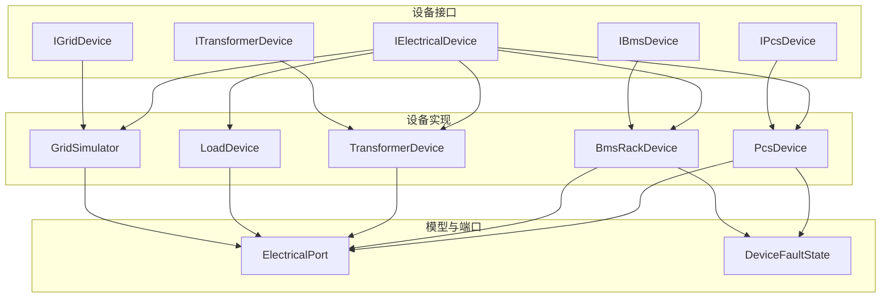
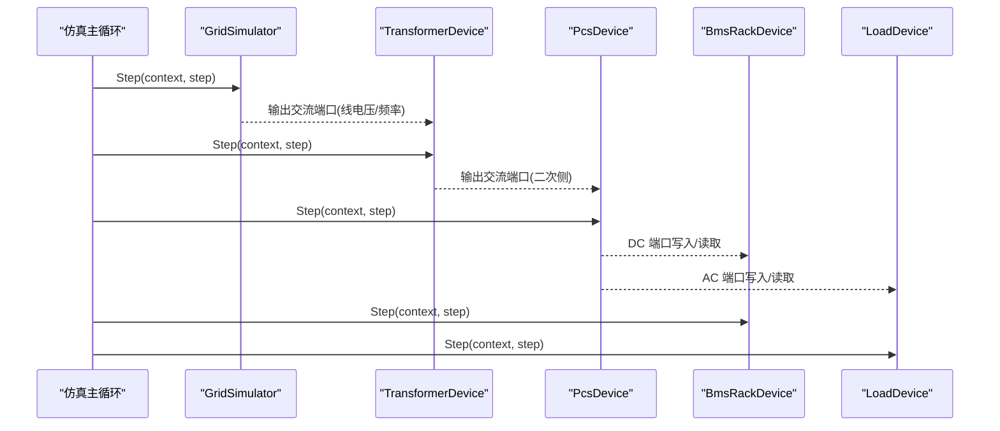
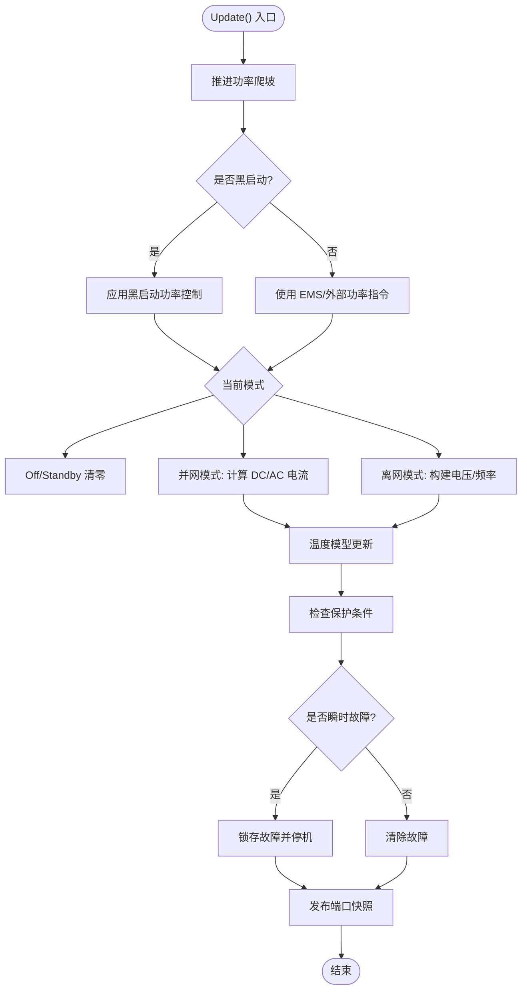
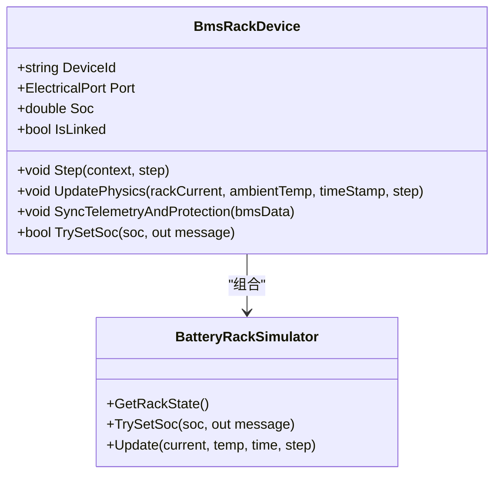
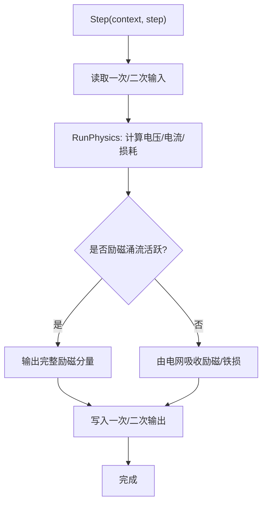
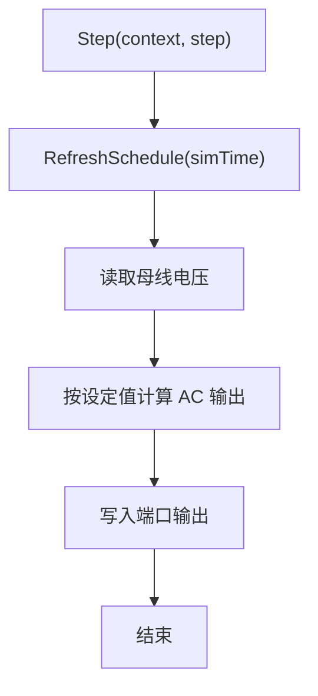
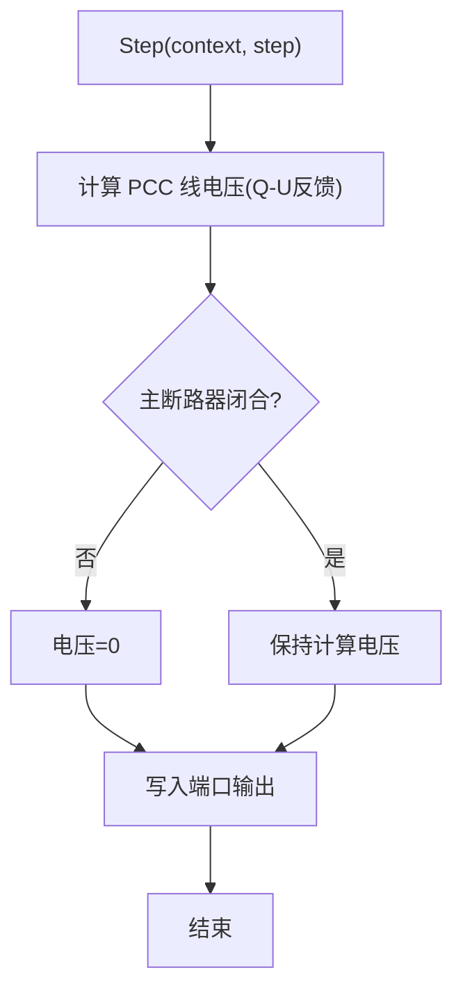
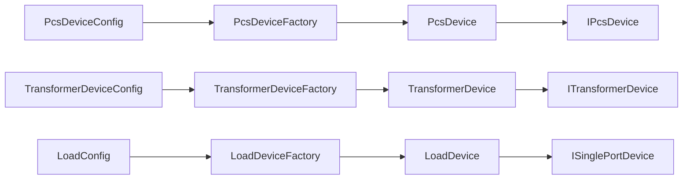

# 设备模型库

<cite>
**本文引用的文件**
- [IElectricalDevice.cs](file://EssDeviceSimModel/Interface/IElectricalDevice.cs)
- [IPcsDevice.cs](file://EssDeviceSimModel/Interface/IPcsDevice.cs)
- [IBmsDevice.cs](file://EssDeviceSimModel/Interface/IBmsDevice.cs)
- [ITransformerDevice.cs](file://EssDeviceSimModel/Interface/ITransformerDevice.cs)
- [IGridDevice.cs](file://EssDeviceSimModel/Interface/IGridDevice.cs)
- [ElectricalPort.cs](file://EssDeviceSimModel/Model/ElectricalPort.cs)
- [DeviceState.cs](file://EssDeviceSimModel/Model/DeviceState.cs)
- [PcsDevice.Core.cs](file://EssDeviceSimModel/Devices/PcsDevice.Core.cs)
- [BmsRackDevice.cs](file://EssDeviceSimModel/Devices/BmsRackDevice.cs)
- [TransformerDevice.cs](file://EssDeviceSimModel/Devices/TransformerDevice.cs)
- [LoadDevice.cs](file://EssDeviceSimModel/Devices/LoadDevice.cs)
- [GridSimulator.cs](file://EssDeviceSimModel/Devices/GridSimulator.cs)
- [PcsDeviceFactory.cs](file://EssDeviceSimModel/Devices/PcsDeviceFactory.cs)
- [TransformerDeviceFactory.cs](file://EssDeviceSimModel/Devices/TransformerDeviceFactory.cs)
- [LoadDeviceFactory.cs](file://EssDeviceSimModel/Devices/LoadDeviceFactory.cs)
- [PcsDeviceConfig.cs](file://EssDeviceSimModel/Model/PcsDeviceConfig.cs)
- [TransformerDeviceConfig.cs](file://EssDeviceSimModel/Model/TransformerDeviceConfig.cs)
</cite>

## 目录
1. [简介](#简介)
2. [项目结构](#项目结构)
3. [核心组件](#核心组件)
4. [架构总览](#架构总览)
5. [详细组件分析](#详细组件分析)
6. [依赖关系分析](#依赖关系分析)
7. [性能考虑](#性能考虑)
8. [故障排查指南](#故障排查指南)
9. [结论](#结论)
10. [附录](#附录)

## 简介
本文件面向“设备模型库”，系统性阐述 BMS 电池管理系统、PCS 功率转换系统、变压器模型、负载模型与电网模拟器的实现细节。内容覆盖：
- 设备接口定义与统一抽象
- 状态管理与控制逻辑（含黑启动、爬坡、保护）
- 通信协议集成要点（通过数据交换管线与映射器）
- 设备生命周期管理、事件驱动与仿真步进
- 设备间耦合方式（电气端口、拓扑传播）
- 自定义设备创建、注册到仿真引擎的示例路径
- 调试工具与测试方法建议

## 项目结构
设备模型库位于 EssDeviceSimModel，采用“接口 + 具体设备 + 配置/工厂”的分层组织：
- Interface：统一的设备抽象（单端口、双端口、可控、可故障等）
- Devices：具体设备实现（BMS、PCS、变压器、负载、电网模拟器）
- Model：通用数据结构（端口快照、设备状态、配置对象）
- Propagation/Solver：电气网络求解与信号传播（与本库设备协同）
- Plant：储能厂级耦合图与热系统（与本库设备协同）

图表来源
- [IElectricalDevice.cs:1-14](file://EssDeviceSimModel/Interface/IElectricalDevice.cs#L1-L14)
- [IPcsDevice.cs:1-10](file://EssDeviceSimModel/Interface/IPcsDevice.cs#L1-L10)
- [IBmsDevice.cs:1-11](file://EssDeviceSimModel/Interface/IBmsDevice.cs#L1-L11)
- [ITransformerDevice.cs:1-9](file://EssDeviceSimModel/Interface/ITransformerDevice.cs#L1-L9)
- [IGridDevice.cs:1-10](file://EssDeviceSimModel/Interface/IGridDevice.cs#L1-L10)
- [ElectricalPort.cs:1-11](file://EssDeviceSimModel/Model/ElectricalPort.cs#L1-L11)
- [DeviceState.cs:1-16](file://EssDeviceSimModel/Model/DeviceState.cs#L1-L16)

章节来源
- [IElectricalDevice.cs:1-14](file://EssDeviceSimModel/Interface/IElectricalDevice.cs#L1-L14)
- [ElectricalPort.cs:1-11](file://EssDeviceSimModel/Model/ElectricalPort.cs#L1-L11)

## 核心组件
- 统一设备抽象
  - IElectricalDevice：所有电气设备的统一步进接口 Step(context, step)，暴露 DeviceId、Kind、Ports。
  - ElectricalPort：设备交流/直流端口输入输出快照容器，用于设备间解耦的数据传递。
  - DeviceFaultState：设备故障码与消息的统一表示。

- 设备类型与职责
  - PcsDevice：交直流变换、跟网/离网、黑启动、功率爬坡、保护、温度模型。
  - BmsRackDevice：电池堆物理推进、簇/堆保护评估、DC 端口同步、SOC 设定。
  - TransformerDevice：双端口变压器模型，含励磁涌流、空载/负载损耗、无功电压偏移。
  - LoadDevice：单端口交流负载，支持计划曲线与随机波动。
  - GridSimulator：无穷大电网源，提供 PCC 侧电压/频率与 Q-U 反馈。

章节来源
- [IElectricalDevice.cs:1-14](file://EssDeviceSimModel/Interface/IElectricalDevice.cs#L1-L14)
- [ElectricalPort.cs:1-11](file://EssDeviceSimModel/Model/ElectricalPort.cs#L1-L11)
- [DeviceState.cs:1-16](file://EssDeviceSimModel/Model/DeviceState.cs#L1-L16)
- [PcsDevice.Core.cs:1-696](file://EssDeviceSimModel/Devices/PcsDevice.Core.cs#L1-L696)
- [BmsRackDevice.cs:1-167](file://EssDeviceSimModel/Devices/BmsRackDevice.cs#L1-L167)
- [TransformerDevice.cs:1-298](file://EssDeviceSimModel/Devices/TransformerDevice.cs#L1-L298)
- [LoadDevice.cs:1-172](file://EssDeviceSimModel/Devices/LoadDevice.cs#L1-L172)
- [GridSimulator.cs:1-86](file://EssDeviceSimModel/Devices/GridSimulator.cs#L1-L86)

## 架构总览
设备通过 ElectricalPort 进行解耦交互，仿真主循环按步调用各设备的 Step(context, step)。PCS 作为核心控制器，协调 BMS 与电网侧；变压器连接高低压侧；负载消耗功率；电网模拟器提供 PCC 参考。

图表来源
- [GridSimulator.cs:47-71](file://EssDeviceSimModel/Devices/GridSimulator.cs#L47-L71)
- [TransformerDevice.cs:68-88](file://EssDeviceSimModel/Devices/TransformerDevice.cs#L68-L88)
- [PcsDevice.Core.cs:155-188](file://EssDeviceSimModel/Devices/PcsDevice.Core.cs#L155-L188)
- [BmsRackDevice.cs:84-144](file://EssDeviceSimModel/Devices/BmsRackDevice.cs#L84-L144)
- [LoadDevice.cs:142-157](file://EssDeviceSimModel/Devices/LoadDevice.cs#L142-L157)

## 详细组件分析

### PCS 功率转换系统（PcsDevice）
- 接口与能力
  - 实现 IPcsDevice（交直流转换器、可控、可故障），具备 GridAvailable 指示。
  - 暴露 AC/DC 两个 ElectricalPort，Step 中发布端口快照。
- 状态机与控制
  - 运行模式：Off/Standby/Normal；并网模式：GridConnected/Islanded。
  - 功率指令 SetPowerCommand 支持限幅、视在功率限制、爬坡（斜率/间隔/延迟）。
  - 黑启动：根据电压建立阶段计算有功/无功需求，控制站用电与励磁涌流。
  - 保护：直流电压越限、交流过流、超温、孤岛检测、黑启动互斥等，触发锁存故障并停机。
- 温度模型
  - 基于效率与散热系数估算温升，影响运行边界。
- 端口发布
  - 并网：AC 电流由 P/Q 与 AcVoltage 推算；DC 电流由效率折算。
  - 离网：以单元母线电压为源，维持频率/电压至目标。

图表来源
- [PcsDevice.Core.cs:444-533](file://EssDeviceSimModel/Devices/PcsDevice.Core.cs#L444-L533)
- [PcsDevice.Core.cs:545-619](file://EssDeviceSimModel/Devices/PcsDevice.Core.cs#L545-L619)
- [PcsDevice.Core.cs:621-693](file://EssDeviceSimModel/Devices/PcsDevice.Core.cs#L621-L693)

章节来源
- [IPcsDevice.cs:1-10](file://EssDeviceSimModel/Interface/IPcsDevice.cs#L1-L10)
- [PcsDevice.Core.cs:1-696](file://EssDeviceSimModel/Devices/PcsDevice.Core.cs#L1-L696)
- [PcsDeviceConfig.cs:1-34](file://EssDeviceSimModel/Model/PcsDeviceConfig.cs#L1-L34)

### BMS 电池管理系统（BmsRackDevice）
- 接口与能力
  - 实现 IBmsDevice（单端口、可故障），暴露 IsLinked、Soc。
  - 维护 DC 端口，将电池堆物理量映射到端口快照。
- 物理推进与保护
  - UpdatePhysics 推进电芯/SOC，估算堆内阻损耗，刷新 DC 端口。
  - SyncTelemetryAndProtection 将 Rack 状态映射到 BMS DTO，评估簇级/Rack 级保护并回写故障态。
- SOC 设定
  - TrySetSoc 仅在待机时允许修改，写透电芯并刷新端口。
- 温度感知
  - 接受电池节点温度，作为热环境参与损耗估算。

图表来源
- [BmsRackDevice.cs:14-167](file://EssDeviceSimModel/Devices/BmsRackDevice.cs#L14-L167)

章节来源
- [IBmsDevice.cs:1-11](file://EssDeviceSimModel/Interface/IBmsDevice.cs#L1-L11)
- [BmsRackDevice.cs:1-167](file://EssDeviceSimModel/Devices/BmsRackDevice.cs#L1-L167)

### 变压器模型（TransformerDevice）
- 接口与能力
  - 实现 ITransformerDevice（双端口），暴露 MagnetizingReactiveKvar、NoLoadActivePowerKw。
  - Primary/Secondary 端口分别对应一次侧与二次侧。
- 物理模型
  - 变比计算、无功电压偏移、空载/负载损耗、励磁涌流（dv/dt 阈值触发，指数衰减）。
  - 当并网且电网可用时，励磁/铁损无功由 PCC 吸收，端口仅传递穿越功率；否则输出完整励磁分量。
- 特殊场景
  - RefreshIslandReverseExcitation 用于离网反向励磁场景，强制二次侧电压。

图表来源
- [TransformerDevice.cs:68-88](file://EssDeviceSimModel/Devices/TransformerDevice.cs#L68-L88)
- [TransformerDevice.cs:129-250](file://EssDeviceSimModel/Devices/TransformerDevice.cs#L129-L250)
- [TransformerDevice.cs:252-283](file://EssDeviceSimModel/Devices/TransformerDevice.cs#L252-L283)

章节来源
- [ITransformerDevice.cs:1-9](file://EssDeviceSimModel/Interface/ITransformerDevice.cs#L1-L9)
- [TransformerDevice.cs:1-298](file://EssDeviceSimModel/Devices/TransformerDevice.cs#L1-L298)
- [TransformerDeviceConfig.cs:1-22](file://EssDeviceSimModel/Model/TransformerDeviceConfig.cs#L1-L22)

### 负载模型（LoadDevice）
- 接口与能力
  - 实现 ISinglePortDevice，单端口交流负载。
  - 支持计划曲线（LoadWindow）与随机波动，可设置有功/无功特性。
- 行为
  - Step 中读取母线电压，按设定值计算输出端口。
  - ComputeLoadCurrentA 用于监视/兼容路径，从功率换算电流。

图表来源
- [LoadDevice.cs:93-157](file://EssDeviceSimModel/Devices/LoadDevice.cs#L93-L157)

章节来源
- [LoadDevice.cs:1-172](file://EssDeviceSimModel/Devices/LoadDevice.cs#L1-L172)

### 电网模拟器（GridSimulator）
- 接口与能力
  - 实现 IGridDevice，单端口交流源，支持聚合无功注入。
  - 提供 NominalLineVoltageV/NominalFrequencyHz 设定。
- 行为
  - Step 中根据短路容量与 Q-U 反馈计算 PCC 线电压，若主断路器断开则置零。
  - 输出频率在有压时等于额定频率，否则为零。

图表来源
- [GridSimulator.cs:47-71](file://EssDeviceSimModel/Devices/GridSimulator.cs#L47-L71)

章节来源
- [IGridDevice.cs:1-10](file://EssDeviceSimModel/Interface/IGridDevice.cs#L1-L10)
- [GridSimulator.cs:1-86](file://EssDeviceSimModel/Devices/GridSimulator.cs#L1-L86)

## 依赖关系分析
- 设备与接口
  - 所有设备均实现 IElectricalDevice，保证统一步进接口。
  - 特定设备实现更细粒度接口：IPcsDevice、IBmsDevice、ITransformerDevice、IGridDevice。
- 端口与快照
  - 设备通过 ElectricalPort 输入/输出 ElectricalPortSnapshot，解耦设备间耦合。
- 配置与工厂
  - 设备配置集中在 Model 层，工厂类负责从上层配置转换为模型配置并创建设备实例。

图表来源
- [PcsDeviceFactory.cs:1-44](file://EssDeviceSimModel/Devices/PcsDeviceFactory.cs#L1-L44)
- [TransformerDeviceFactory.cs:1-75](file://EssDeviceSimModel/Devices/TransformerDeviceFactory.cs#L1-L75)
- [LoadDeviceFactory.cs:1-24](file://EssDeviceSimModel/Devices/LoadDeviceFactory.cs#L1-L24)
- [PcsDeviceConfig.cs:1-34](file://EssDeviceSimModel/Model/PcsDeviceConfig.cs#L1-L34)
- [TransformerDeviceConfig.cs:1-22](file://EssDeviceSimModel/Model/TransformerDeviceConfig.cs#L1-L22)

章节来源
- [PcsDeviceFactory.cs:1-44](file://EssDeviceSimModel/Devices/PcsDeviceFactory.cs#L1-L44)
- [TransformerDeviceFactory.cs:1-75](file://EssDeviceSimModel/Devices/TransformerDeviceFactory.cs#L1-L75)
- [LoadDeviceFactory.cs:1-24](file://EssDeviceSimModel/Devices/LoadDeviceFactory.cs#L1-L24)

## 性能考虑
- 步进与缓存
  - 设备 Step 尽量只做必要计算与端口快照发布，避免重复物理推进。
  - PCS 内部对功率指令加锁，减少并发竞争。
- 损耗与温度
  - 简化热模型（线性冷却、固定热容）降低计算开销。
  - 变压器空载/负载损耗按平方律近似，避免复杂迭代。
- 潮流与传播
  - 通过 ElectricalPort 与 Propagation 模块解耦，减少设备间直接耦合带来的复杂度。
- 黑启动与涌流
  - 励磁涌流采用指数衰减与阈值触发，避免全量电磁暂态仿真。

[本节为通用指导，不直接分析具体文件]

## 故障排查指南
- PCS 常见故障
  - 直流电压越限、交流过流、超温、孤岛检测、黑启动与主网互斥。
  - 故障会锁存并自动撤回外部启停命令，需复位后重启。
- BMS 保护
  - 簇级/Rack 级保护评估后回写故障码，PCS 据此跳闸。
- 变压器
  - 注意励磁涌流期间端口输出包含完整励磁分量；并网时由 PCC 吸收。
- 调试建议
  - 观察设备 Fault 属性与日志（如 PCS 故障变更日志）。
  - 通过端口快照验证 AC/DC 量是否符合预期。
  - 使用工厂创建最小化设备集进行单元测试。

章节来源
- [PcsDevice.Core.cs:643-693](file://EssDeviceSimModel/Devices/PcsDevice.Core.cs#L643-L693)
- [BmsRackDevice.cs:116-131](file://EssDeviceSimModel/Devices/BmsRackDevice.cs#L116-L131)
- [TransformerDevice.cs:252-283](file://EssDeviceSimModel/Devices/TransformerDevice.cs#L252-L283)

## 结论
设备模型库通过统一接口与端口机制，实现了 BMS、PCS、变压器、负载与电网模拟器的高效解耦与协作。PCS 作为核心控制器，协调能量流动与系统稳定；BMS 保障电池安全与状态一致；变压器提供高压侧耦合与损耗建模；负载模拟实际用电；电网模拟器提供 PCC 参考。借助工厂与配置，可快速扩展新设备并接入仿真引擎。

[本节为总结性内容，不直接分析具体文件]

## 附录

### 如何创建自定义设备模型
- 步骤
  1. 选择合适接口：单端口选 ISinglePortDevice，双端口选 ITwoPortDevice，或实现 IElectricalDevice。
  2. 定义 ElectricalPort 输入/输出快照，并在 Step 中读写。
  3. 实现控制逻辑与保护判断，必要时引入温度/损耗模型。
  4. 编写配置对象与工厂，便于从上层配置创建设备。
  5. 在仿真拓扑中注册设备，确保端口正确连接。
- 参考路径
  - 单端口设备示例：[LoadDevice.cs:1-172](file://EssDeviceSimModel/Devices/LoadDevice.cs#L1-L172)
  - 双端口设备示例：[TransformerDevice.cs:1-298](file://EssDeviceSimModel/Devices/TransformerDevice.cs#L1-L298)
  - 交直流设备示例：[PcsDevice.Core.cs:1-696](file://EssDeviceSimModel/Devices/PcsDevice.Core.cs#L1-L696)

### 设备间耦合与注册到仿真引擎
- 耦合方式
  - 通过 ElectricalPort 的 Input/Output 进行数据传递，避免直接引用。
  - 利用 Propagation 模块进行总线耦合与信号路由。
- 注册流程
  - 使用工厂创建设备实例（如 PcsDeviceFactory、TransformerDeviceFactory、LoadDeviceFactory）。
  - 将设备加入仿真拓扑，确保端口连接正确。
  - 在主循环中按序调用各设备 Step。

章节来源
- [PcsDeviceFactory.cs:1-44](file://EssDeviceSimModel/Devices/PcsDeviceFactory.cs#L1-L44)
- [TransformerDeviceFactory.cs:1-75](file://EssDeviceSimModel/Devices/TransformerDeviceFactory.cs#L1-L75)
- [LoadDeviceFactory.cs:1-24](file://EssDeviceSimModel/Devices/LoadDeviceFactory.cs#L1-L24)

### 设备生命周期管理
- 初始化
  - 构造函数中创建端口、初始化状态与配置。
- 步进
  - Step(context, step) 每步执行，发布端口快照。
  - 物理推进（如 PCS.Update、BmsRackDevice.UpdatePhysics）按需调用。
- 终止
  - 清理资源（如有），记录统计信息。

章节来源
- [PcsDevice.Core.cs:82-134](file://EssDeviceSimModel/Devices/PcsDevice.Core.cs#L82-L134)
- [BmsRackDevice.cs:21-29](file://EssDeviceSimModel/Devices/BmsRackDevice.cs#L21-L29)
- [TransformerDevice.cs:13-26](file://EssDeviceSimModel/Devices/TransformerDevice.cs#L13-L26)
- [LoadDevice.cs:15-47](file://EssDeviceSimModel/Devices/LoadDevice.cs#L15-L47)
- [GridSimulator.cs:12-17](file://EssDeviceSimModel/Devices/GridSimulator.cs#L12-L17)

### 事件驱动架构与调试
- 事件
  - PCS 模式/电网模式切换、故障变更通过日志记录，便于追踪。
- 调试
  - 观察设备 Fault 属性与 DisplayLabel。
  - 通过端口快照验证 AC/DC 量。
  - 使用最小化设备集进行单元测试。

章节来源
- [PcsDevice.Core.cs:270-298](file://EssDeviceSimModel/Devices/PcsDevice.Core.cs#L270-L298)
- [BmsRackDevice.cs:151-155](file://EssDeviceSimModel/Devices/BmsRackDevice.cs#L151-L155)