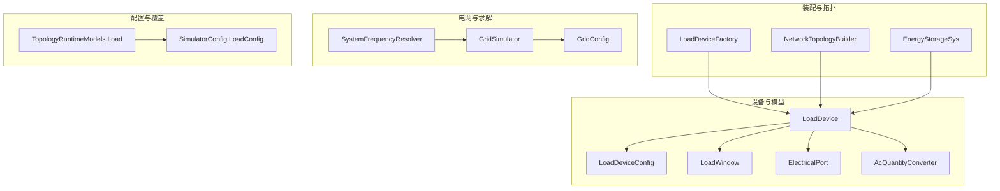
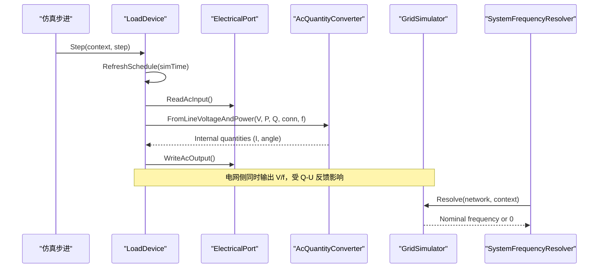
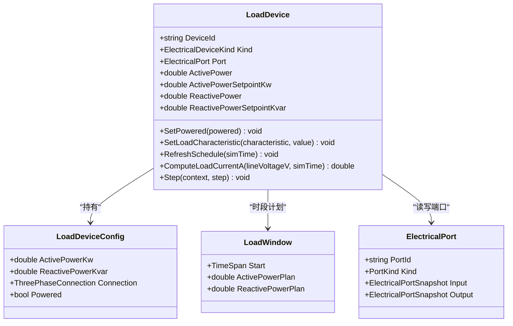
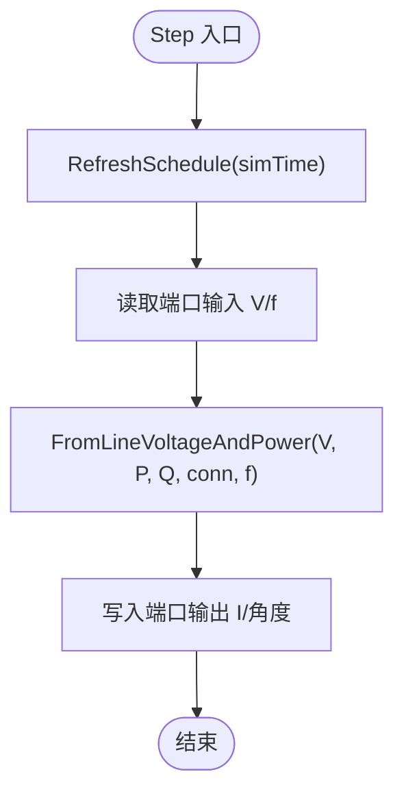
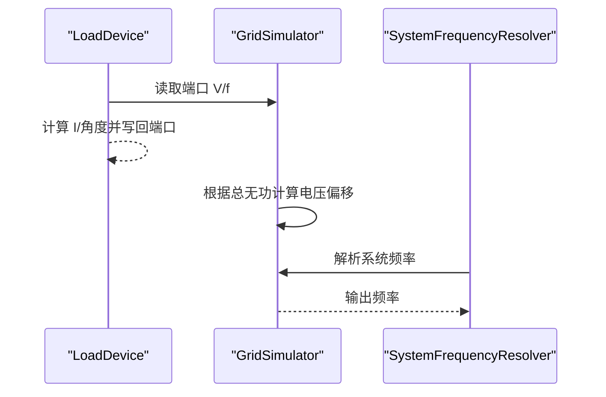
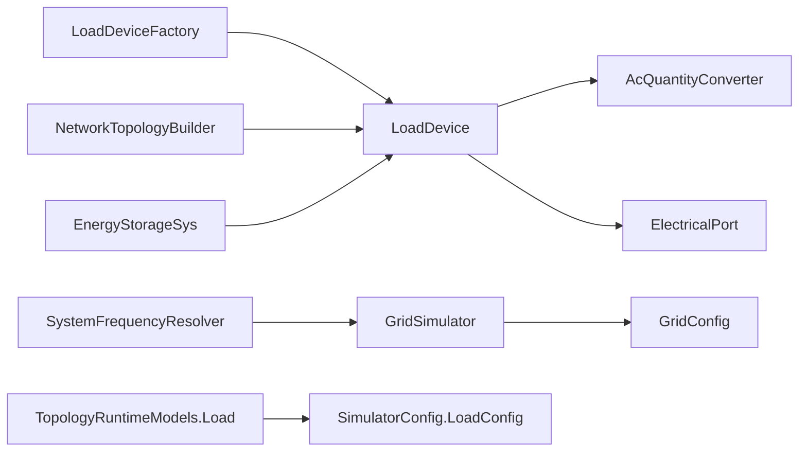

# 负载设备

<cite>
**本文引用的文件**
- [LoadDevice.cs](file://EssDeviceSimModel/Devices/LoadDevice.cs)
- [LoadDeviceFactory.cs](file://EssDeviceSimModel/Devices/LoadDeviceFactory.cs)
- [LoadDeviceConfig.cs](file://EssDeviceSimModel/Model/LoadDeviceConfig.cs)
- [LoadWindow.cs](file://EssDeviceSimModel/Model/LoadWindow.cs)
- [ElectricalPort.cs](file://EssDeviceSimModel/Model/ElectricalPort.cs)
- [AcQuantityConverter.cs](file://EssDeviceSimModel/Model/AcQuantityConverter.cs)
- [ISinglePortDevice.cs](file://EssDeviceSimModel/Interface/ISinglePortDevice.cs)
- [GridSimulator.cs](file://EssDeviceSimModel/Devices/GridSimulator.cs)
- [GridConfig.cs](file://EssDeviceSimModel/Model/GridConfig.cs)
- [SystemFrequencyResolver.cs](file://EssDeviceSimModel/Solver/SystemFrequencyResolver.cs)
- [EnergyStorageSys.cs](file://EssDeviceSimModel/EnergyStorageSys.cs)
- [NetworkTopologyBuilder.cs](file://EssDeviceSimModel/Solver/NetworkTopologyBuilder.cs)
- [TopologyRuntimeModels.cs](file://Web/Topology/TopologyRuntimeModels.cs)
- [SimulatorConfig.cs](file://Configuration/SimulatorConfig.cs)
- [LoadDeviceTests.cs](file://EssSimulator.Tests/Devices/LoadDeviceTests.cs)
</cite>

## 目录
1. [简介](#简介)
2. [项目结构](#项目结构)
3. [核心组件](#核心组件)
4. [架构总览](#架构总览)
5. [详细组件分析](#详细组件分析)
6. [依赖关系分析](#依赖关系分析)
7. [性能与稳定性考量](#性能与稳定性考量)
8. [故障排查指南](#故障排查指南)
9. [结论](#结论)
10. [附录：配置、曲线与控制示例](#附录配置曲线与控制示例)

## 简介
本文件面向负载设备的仿真实现，重点解释 LoadDevice 的工作原理与使用方式。文档涵盖：
- 恒功率负载、恒阻抗负载与动态负载模型的实现思路与代码映射
- 负载配置文件格式与时序计划（时段窗口）的加载与生效机制
- 随机波动与时间序列数据的集成方式
- 负载变化对电网电压、频率及稳定性的影响路径与仿真方法
- 如何定义负载曲线、设置负载模式并实现智能负载控制
- 测试场景与验证方法

## 项目结构
负载设备位于设备模型层，通过工厂从配置创建，并在网络拓扑构建时接入系统。关键文件与职责如下：
- 设备实现：LoadDevice.cs
- 配置与数据模型：LoadDeviceConfig.cs、LoadWindow.cs、ElectricalPort.cs
- 电气量转换：AcQuantityConverter.cs
- 接口契约：ISinglePortDevice.cs
- 工厂与装配：LoadDeviceFactory.cs、NetworkTopologyBuilder.cs、EnergyStorageSys.cs
- 电网与频率：GridSimulator.cs、GridConfig.cs、SystemFrequencyResolver.cs
- 运行时覆盖模型：TopologyRuntimeModels.cs
- 配置项定义：SimulatorConfig.cs
- 单元测试：LoadDeviceTests.cs

图表来源
- [LoadDevice.cs:1-172](file://EssDeviceSimModel/Devices/LoadDevice.cs#L1-L172)
- [LoadDeviceFactory.cs:1-24](file://EssDeviceSimModel/Devices/LoadDeviceFactory.cs#L1-L24)
- [NetworkTopologyBuilder.cs:51-72](file://EssDeviceSimModel/Solver/NetworkTopologyBuilder.cs#L51-L72)
- [EnergyStorageSys.cs:186-213](file://EssDeviceSimModel/EnergyStorageSys.cs#L186-L213)
- [GridSimulator.cs:1-86](file://EssDeviceSimModel/Devices/GridSimulator.cs#L1-L86)
- [GridConfig.cs:1-15](file://EssDeviceSimModel/Model/GridConfig.cs#L1-L15)
- [SystemFrequencyResolver.cs:1-44](file://EssDeviceSimModel/Solver/SystemFrequencyResolver.cs#L1-L44)
- [TopologyRuntimeModels.cs:24-41](file://Web/Topology/TopologyRuntimeModels.cs#L24-L41)
- [SimulatorConfig.cs:440-479](file://Configuration/SimulatorConfig.cs#L440-L479)

章节来源
- [LoadDevice.cs:1-172](file://EssDeviceSimModel/Devices/LoadDevice.cs#L1-L172)
- [LoadDeviceFactory.cs:1-24](file://EssDeviceSimModel/Devices/LoadDeviceFactory.cs#L1-L24)
- [NetworkTopologyBuilder.cs:51-72](file://EssDeviceSimModel/Solver/NetworkTopologyBuilder.cs#L51-L72)
- [EnergyStorageSys.cs:186-213](file://EssDeviceSimModel/EnergyStorageSys.cs#L186-L213)
- [GridSimulator.cs:1-86](file://EssDeviceSimModel/Devices/GridSimulator.cs#L1-L86)
- [GridConfig.cs:1-15](file://EssDeviceSimModel/Model/GridConfig.cs#L1-L15)
- [SystemFrequencyResolver.cs:1-44](file://EssDeviceSimModel/Solver/SystemFrequencyResolver.cs#L1-L44)
- [TopologyRuntimeModels.cs:24-41](file://Web/Topology/TopologyRuntimeModels.cs#L24-L41)
- [SimulatorConfig.cs:440-479](file://Configuration/SimulatorConfig.cs#L440-L479)

## 核心组件
- LoadDevice：单端口交流负载设备，支持有功/无功设定值、时段计划、随机波动、电流计算与步进输出。
- LoadDeviceConfig：负载设备运行配置（有功、无功、接线方式、是否带电）。
- LoadWindow：日内时段计划，按 Start 时刻阶跃保持到下一时刻。
- ElectricalPort：设备端口，承载输入/输出的三相交流快照。
- AcQuantityConverter：P/Q 与相量、线电流、功率因数等电气量换算工具。
- ISinglePortDevice：单端口设备接口约束。
- LoadDeviceFactory：从配置创建负载设备实例。
- GridSimulator 与 GridConfig：电网电压源与 Q-U 反馈、频率源。
- SystemFrequencyResolver：解析当前系统频率（并网或构网孤岛）。
- NetworkTopologyBuilder / EnergyStorageSys：将负载接入网络拓扑与系统装配。
- TopologyRuntimeModels.Load / SimulatorConfig.LoadConfig：运行时覆盖与配置节定义。

章节来源
- [LoadDevice.cs:1-172](file://EssDeviceSimModel/Devices/LoadDevice.cs#L1-L172)
- [LoadDeviceConfig.cs:1-11](file://EssDeviceSimModel/Model/LoadDeviceConfig.cs#L1-L11)
- [LoadWindow.cs:1-12](file://EssDeviceSimModel/Model/LoadWindow.cs#L1-L12)
- [ElectricalPort.cs:1-11](file://EssDeviceSimModel/Model/ElectricalPort.cs#L1-L11)
- [AcQuantityConverter.cs:1-178](file://EssDeviceSimModel/Model/AcQuantityConverter.cs#L1-L178)
- [ISinglePortDevice.cs:1-10](file://EssDeviceSimModel/Interface/ISinglePortDevice.cs#L1-L10)
- [LoadDeviceFactory.cs:1-24](file://EssDeviceSimModel/Devices/LoadDeviceFactory.cs#L1-L24)
- [GridSimulator.cs:1-86](file://EssDeviceSimModel/Devices/GridSimulator.cs#L1-L86)
- [GridConfig.cs:1-15](file://EssDeviceSimModel/Model/GridConfig.cs#L1-L15)
- [SystemFrequencyResolver.cs:1-44](file://EssDeviceSimModel/Solver/SystemFrequencyResolver.cs#L1-L44)
- [NetworkTopologyBuilder.cs:51-72](file://EssDeviceSimModel/Solver/NetworkTopologyBuilder.cs#L51-L72)
- [EnergyStorageSys.cs:186-213](file://EssDeviceSimModel/EnergyStorageSys.cs#L186-L213)
- [TopologyRuntimeModels.cs:24-41](file://Web/Topology/TopologyRuntimeModels.cs#L24-L41)
- [SimulatorConfig.cs:440-479](file://Configuration/SimulatorConfig.cs#L440-L479)

## 架构总览
负载设备作为“恒功率”型交流负载，在每步仿真中读取母线电压与频率，根据设定值与计划时段计算输出电流相量，写入端口供求解器使用。电网侧提供电压源并通过 Q-U 反馈调节电压；频率由系统频率解析器决定（并网取电网频率，孤岛取构网 PCS 频率）。

图表来源
- [LoadDevice.cs:142-157](file://EssDeviceSimModel/Devices/LoadDevice.cs#L142-L157)
- [AcQuantityConverter.cs:62-80](file://EssDeviceSimModel/Model/AcQuantityConverter.cs#L62-L80)
- [GridSimulator.cs:49-71](file://EssDeviceSimModel/Devices/GridSimulator.cs#L49-L71)
- [SystemFrequencyResolver.cs:12-43](file://EssDeviceSimModel/Solver/SystemFrequencyResolver.cs#L12-L43)

## 详细组件分析

### LoadDevice 类图与行为

图表来源
- [LoadDevice.cs:6-172](file://EssDeviceSimModel/Devices/LoadDevice.cs#L6-L172)
- [LoadDeviceConfig.cs:1-11](file://EssDeviceSimModel/Model/LoadDeviceConfig.cs#L1-L11)
- [LoadWindow.cs:1-12](file://EssDeviceSimModel/Model/LoadWindow.cs#L1-L12)
- [ElectricalPort.cs:1-11](file://EssDeviceSimModel/Model/ElectricalPort.cs#L1-L11)

章节来源
- [LoadDevice.cs:6-172](file://EssDeviceSimModel/Devices/LoadDevice.cs#L6-L172)

### 恒功率负载实现
- 设定值：ActivePowerSetpointKw、ReactivePowerSetpointKvar 表示目标有功/无功。
- 计划时段：LoadWindow 列表按 Start 排序，RefreshSchedule 选择当前有效时段并保持到下一刻度。
- 随机波动：每次刷新时，有功叠加 ±0.1 kW 的均匀随机波动，模拟测量/控制噪声。
- 方向约定：有功为负表示从电网取电；正值被钳位为 0，防止负载向电网发电。
- 步进输出：Step 中读取端口输入电压与频率，调用 AcQuantityConverter.FromLineVoltageAndPower 计算输出电流相量并写回端口。

图表来源
- [LoadDevice.cs:142-157](file://EssDeviceSimModel/Devices/LoadDevice.cs#L142-L157)
- [AcQuantityConverter.cs:62-80](file://EssDeviceSimModel/Model/AcQuantityConverter.cs#L62-L80)

章节来源
- [LoadDevice.cs:93-157](file://EssDeviceSimModel/Devices/LoadDevice.cs#L93-L157)
- [AcQuantityConverter.cs:62-80](file://EssDeviceSimModel/Model/AcQuantityConverter.cs#L62-L80)

### 恒阻抗负载实现
- 现有实现以“恒功率”为主，未直接暴露“恒阻抗”模式开关。
- 可通过外部控制策略在每步根据实时电压调整设定值，近似实现恒阻抗特性：
  - 若希望维持恒定阻抗 Z，则设定 P、Q 随 V 变化，使等效阻抗不变。
  - 可在上层控制器中依据端口电压与目标阻抗计算新的 P/Q 设定值，再调用 SetLoadCharacteristic 更新。
- 注意：负载仅允许消耗有功（≤0），因此恒阻抗的有功部分需保持非正。

章节来源
- [LoadDevice.cs:76-91](file://EssDeviceSimModel/Devices/LoadDevice.cs#L76-L91)
- [LoadDevice.cs:123-129](file://EssDeviceSimModel/Devices/LoadDevice.cs#L123-L129)

### 动态负载模型
- 动态性来源于两部分：
  - 时段计划：LoadWindow 列表构成日内阶梯式计划，支持多段不同 P/Q。
  - 随机波动：每步刷新时对有功施加小幅度随机扰动，增强真实感。
- 可通过外部注入的时间序列数据驱动 LoadWindow 或 SetLoadCharacteristic，实现更复杂的动态曲线。

章节来源
- [LoadDevice.cs:108-121](file://EssDeviceSimModel/Devices/LoadDevice.cs#L108-L121)
- [LoadDevice.cs:123-129](file://EssDeviceSimModel/Devices/LoadDevice.cs#L123-L129)

### 负载配置文件与时序数据
- 配置节：LoadConfig 对应 appsettings.json 的 Load 节，包含 ActivePowerPlan（kW，仅允许 ≤0）、ReactivePowerPlan（kvar）。
- 运行时覆盖：TopologyRuntimeModels.TopologyRuntimeOverlay.Load 可覆盖默认负载计划。
- 工厂创建：LoadDeviceFactory.Create 将 LoadConfig 转换为带单一全时段窗口的 LoadDevice。
- 装配位置：NetworkTopologyBuilder 与 EnergyStorageSys 在构建网络时将负载接入系统。

章节来源
- [SimulatorConfig.cs:440-479](file://Configuration/SimulatorConfig.cs#L440-L479)
- [TopologyRuntimeModels.cs:24-41](file://Web/Topology/TopologyRuntimeModels.cs#L24-L41)
- [LoadDeviceFactory.cs:1-24](file://EssDeviceSimModel/Devices/LoadDeviceFactory.cs#L1-L24)
- [NetworkTopologyBuilder.cs:51-72](file://EssDeviceSimModel/Solver/NetworkTopologyBuilder.cs#L51-L72)
- [EnergyStorageSys.cs:186-213](file://EssDeviceSimModel/EnergyStorageSys.cs#L186-L213)

### 负载变化对电网稳定性的影响分析与仿真
- 电压影响：电网侧通过 Q-U 反馈将并网点无功引起的电压偏移反映到输出电压。负载无功变化会改变总无功，从而影响母线电压。
- 频率影响：系统频率由 SystemFrequencyResolver 解析，并网时取电网额定频率，孤岛时取构网 PCS 频率。负载本身不直接改变频率，但会影响潮流分布与构网 PCS 的控制响应。
- 仿真路径：
  - 负载 Step 读取端口 V/f，计算输出电流。
  - 电网 Step 基于总无功计算并网点电压偏移，输出新的 V/f。
  - 频率解析器在每个步骤刷新系统频率，供其他设备使用。

图表来源
- [GridSimulator.cs:49-71](file://EssDeviceSimModel/Devices/GridSimulator.cs#L49-L71)
- [SystemFrequencyResolver.cs:12-43](file://EssDeviceSimModel/Solver/SystemFrequencyResolver.cs#L12-L43)

章节来源
- [GridSimulator.cs:49-71](file://EssDeviceSimModel/Devices/GridSimulator.cs#L49-L71)
- [SystemFrequencyResolver.cs:12-43](file://EssDeviceSimModel/Solver/SystemFrequencyResolver.cs#L12-L43)

### 智能负载控制
- 基本控制：通过 SetLoadCharacteristic("activePower", value) 或 ("reactivePower", value) 直接设定目标值。
- 约束：有功只能为负或零（消耗），正值会被钳位为零。
- 计划切换：RefreshSchedule 会根据当前时间选择有效 LoadWindow，恢复计划控制。
- 外部策略：可结合电压/频率/功率限值等信号，在上层控制器中动态计算 P/Q 设定值并下发。

章节来源
- [LoadDevice.cs:76-91](file://EssDeviceSimModel/Devices/LoadDevice.cs#L76-L91)
- [LoadDevice.cs:93-121](file://EssDeviceSimModel/Devices/LoadDevice.cs#L93-L121)

### 负载测试场景与验证方法
- 断电置零：SetPowered(false) 应强制有功/无功为零。
- 特性覆盖：SetLoadCharacteristic 应覆盖计划并保持随机波动范围。
- 发电拒绝：设置正有功将被拒绝（钳位为零）。
- 时段选择：RefreshSchedule 应选择最晚不超过当前时间的时段。
- 电流计算：ComputeLoadCurrentA 在消耗有功时应返回正值（按约定）。

章节来源
- [LoadDeviceTests.cs:8-71](file://EssSimulator.Tests/Devices/LoadDeviceTests.cs#L8-L71)

## 依赖关系分析
- 设备耦合：LoadDevice 依赖 ElectricalPort 进行端口读写，依赖 AcQuantityConverter 进行电气量换算。
- 装配耦合：LoadDeviceFactory 将配置转换为设备；NetworkTopologyBuilder 与 EnergyStorageSys 将设备加入网络。
- 电网耦合：GridSimulator 提供电压源并受总无功影响；SystemFrequencyResolver 提供系统频率。
- 配置耦合：SimulatorConfig.LoadConfig 与 TopologyRuntimeModels.Load 共同决定负载计划。

图表来源
- [LoadDevice.cs:1-172](file://EssDeviceSimModel/Devices/LoadDevice.cs#L1-L172)
- [AcQuantityConverter.cs:1-178](file://EssDeviceSimModel/Model/AcQuantityConverter.cs#L1-L178)
- [LoadDeviceFactory.cs:1-24](file://EssDeviceSimModel/Devices/LoadDeviceFactory.cs#L1-L24)
- [NetworkTopologyBuilder.cs:51-72](file://EssDeviceSimModel/Solver/NetworkTopologyBuilder.cs#L51-L72)
- [EnergyStorageSys.cs:186-213](file://EssDeviceSimModel/EnergyStorageSys.cs#L186-L213)
- [GridSimulator.cs:1-86](file://EssDeviceSimModel/Devices/GridSimulator.cs#L1-L86)
- [GridConfig.cs:1-15](file://EssDeviceSimModel/Model/GridConfig.cs#L1-L15)
- [SystemFrequencyResolver.cs:1-44](file://EssDeviceSimModel/Solver/SystemFrequencyResolver.cs#L1-L44)
- [TopologyRuntimeModels.cs:24-41](file://Web/Topology/TopologyRuntimeModels.cs#L24-L41)
- [SimulatorConfig.cs:440-479](file://Configuration/SimulatorConfig.cs#L440-L479)

章节来源
- [LoadDevice.cs:1-172](file://EssDeviceSimModel/Devices/LoadDevice.cs#L1-L172)
- [AcQuantityConverter.cs:1-178](file://EssDeviceSimModel/Model/AcQuantityConverter.cs#L1-L178)
- [LoadDeviceFactory.cs:1-24](file://EssDeviceSimModel/Devices/LoadDeviceFactory.cs#L1-L24)
- [NetworkTopologyBuilder.cs:51-72](file://EssDeviceSimModel/Solver/NetworkTopologyBuilder.cs#L51-L72)
- [EnergyStorageSys.cs:186-213](file://EssDeviceSimModel/EnergyStorageSys.cs#L186-L213)
- [GridSimulator.cs:1-86](file://EssDeviceSimModel/Devices/GridSimulator.cs#L1-L86)
- [GridConfig.cs:1-15](file://EssDeviceSimModel/Model/GridConfig.cs#L1-L15)
- [SystemFrequencyResolver.cs:1-44](file://EssDeviceSimModel/Solver/SystemFrequencyResolver.cs#L1-L44)
- [TopologyRuntimeModels.cs:24-41](file://Web/Topology/TopologyRuntimeModels.cs#L24-L41)
- [SimulatorConfig.cs:440-479](file://Configuration/SimulatorConfig.cs#L440-L479)

## 性能与稳定性考量
- 计算复杂度：LoadDevice 每步执行常数时间操作（时段查找、随机数生成、电气量换算），开销低。
- 数值稳定性：AcQuantityConverter 对零电压/零视在功率有保护分支，避免除零与无效结果。
- 随机波动：±0.1 kW 的小扰动有助于模拟真实测量噪声，但不影响整体稳定性。
- 稳定性建议：
  - 合理设置负载无功，避免过大的 Q 引起电压越限。
  - 在孤岛模式下关注频率解析器的有效性，确保构网 PCS 正常建立电压与频率。
  - 对于恒阻抗需求，应在上层控制器中实现稳定的 P/Q 跟踪，避免频繁大幅跳变。

[本节为通用指导，不直接分析具体文件]

## 故障排查指南
- 负载无功率输出：检查 SetPowered 是否为 false；确认 RefreshSchedule 已调用且存在有效 LoadWindow。
- 设定值被拒绝：有功设定为正会被钳位为零；确认传入值为负或零。
- 时段未生效：确认 LoadWindow 的 Start 时间与仿真时间匹配；检查窗口顺序与覆盖逻辑。
- 电压异常：检查电网 Q-U 反馈参数与总无功；确认主断状态与构网 PCS 工作点。
- 频率异常：检查 SystemFrequencyResolver 的解析结果；确认并网或孤岛条件。

章节来源
- [LoadDevice.cs:66-91](file://EssDeviceSimModel/Devices/LoadDevice.cs#L66-L91)
- [LoadDevice.cs:93-121](file://EssDeviceSimModel/Devices/LoadDevice.cs#L93-L121)
- [GridSimulator.cs:49-71](file://EssDeviceSimModel/Devices/GridSimulator.cs#L49-L71)
- [SystemFrequencyResolver.cs:12-43](file://EssDeviceSimModel/Solver/SystemFrequencyResolver.cs#L12-L43)

## 结论
LoadDevice 提供了简洁而强大的负载仿真能力：支持恒功率模式、时段计划、随机波动与电流计算；通过与电网和频率解析器的协作，能够参与完整的电力潮流与稳定性仿真。配合配置与运行时覆盖，可实现灵活的负载建模与控制策略。建议在需要恒阻抗或复杂动态特性时，在上层控制器中实现 P/Q 的动态计算与下发。

[本节为总结，不直接分析具体文件]

## 附录：配置、曲线与控制示例

### 配置节说明（appsettings.json 的 Load 节）
- ActivePowerPlan：有功计划（kW），仅允许 ≤0；负值表示用电消耗。
- ReactivePowerPlan：无功计划（kvar），可正可负。

章节来源
- [SimulatorConfig.cs:440-479](file://Configuration/SimulatorConfig.cs#L440-L479)

### 运行时覆盖（TopologyRuntimeModels.Load）
- 通过 TopologyRuntimeOverlay.Load 字段覆盖默认负载计划，便于工程化部署与动态调整。

章节来源
- [TopologyRuntimeModels.cs:24-41](file://Web/Topology/TopologyRuntimeModels.cs#L24-L41)

### 定义负载曲线（LoadWindow 列表）
- 使用多个 LoadWindow 定义日内不同时段的目标 P/Q；按 Start 排序后，RefreshSchedule 自动选择当前有效时段。
- 示例路径参考：
  - [LoadDevice.cs:35-47](file://EssDeviceSimModel/Devices/LoadDevice.cs#L35-L47)
  - [LoadDevice.cs:108-121](file://EssDeviceSimModel/Devices/LoadDevice.cs#L108-L121)

### 设置负载模式与智能控制
- 计划模式：构造时传入 LoadWindow 列表，启用时段计划。
- 手动模式：调用 SetLoadCharacteristic 直接设定 P/Q，覆盖计划。
- 约束：有功只能为负或零；正值会被钳位。
- 示例路径参考：
  - [LoadDevice.cs:76-91](file://EssDeviceSimModel/Devices/LoadDevice.cs#L76-L91)
  - [LoadDeviceTests.cs:20-43](file://EssSimulator.Tests/Devices/LoadDeviceTests.cs#L20-L43)

### 时间序列数据与随机负载
- 时间序列：可将外部 CSV/数据库中的 P/Q 序列映射为 LoadWindow 或周期性调用 SetLoadCharacteristic 更新设定值。
- 随机负载：LoadDevice 内部自带 ±0.1 kW 的随机波动，用于模拟测量噪声；如需更大扰动，可在上层控制器中叠加。
- 示例路径参考：
  - [LoadDevice.cs:123-129](file://EssDeviceSimModel/Devices/LoadDevice.cs#L123-L129)

### 负载测试场景与验证
- 断电置零：验证 SetPowered(false) 后 P/Q 为零。
- 特性覆盖：验证 SetLoadCharacteristic 覆盖计划并保持波动范围。
- 发电拒绝：验证正有功被拒绝。
- 时段选择：验证 RefreshSchedule 选择正确时段。
- 电流计算：验证 ComputeLoadCurrentA 在消耗有功时返回正值。
- 示例路径参考：
  - [LoadDeviceTests.cs:8-71](file://EssSimulator.Tests/Devices/LoadDeviceTests.cs#L8-L71)