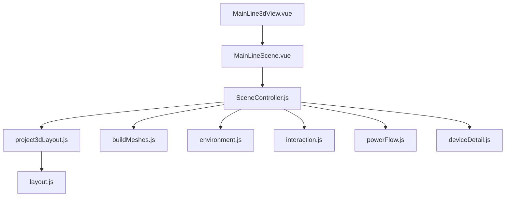
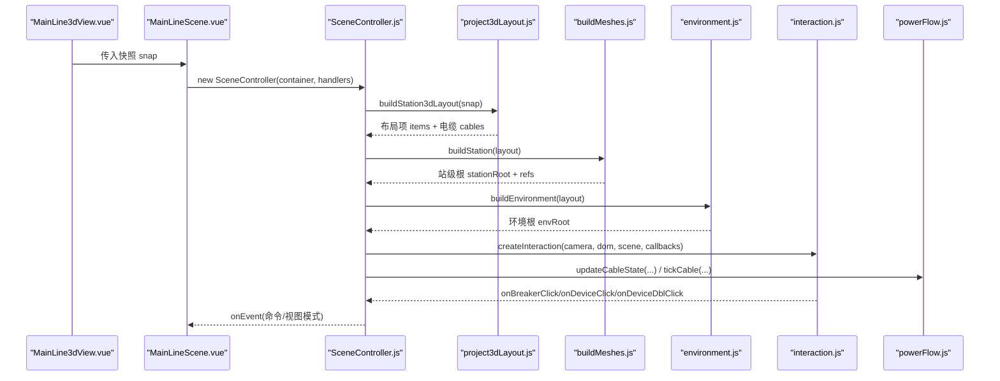
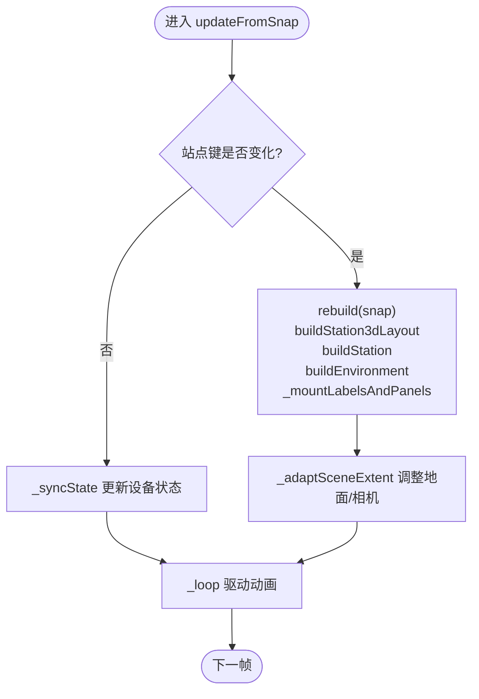
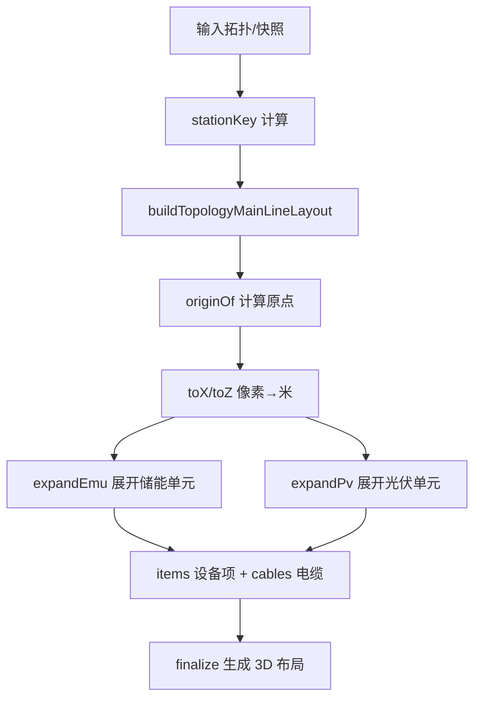
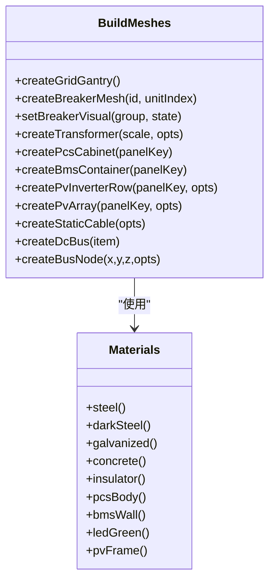
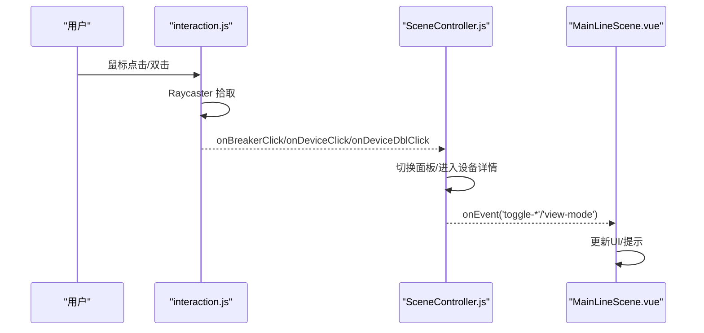
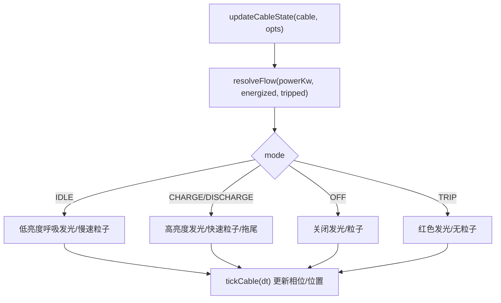
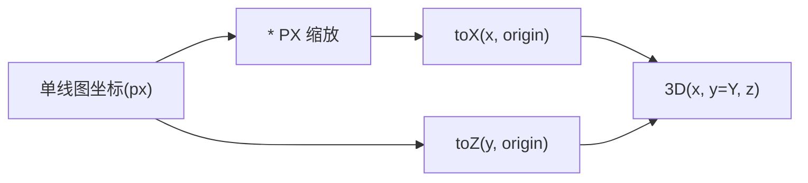
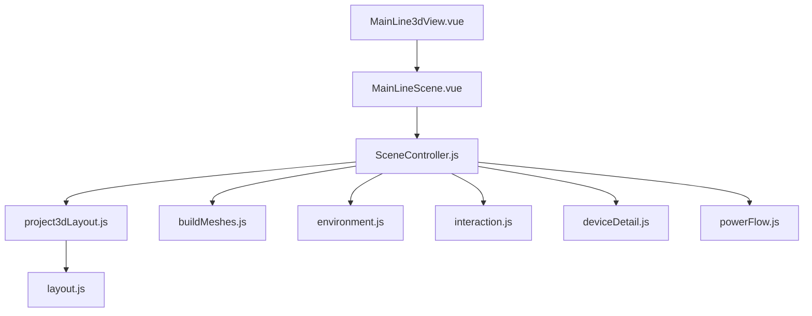

# 3D主接线图可视化

<cite>
**本文引用的文件**
- [MainLineScene.vue](file://Web/src/components/MainLineScene.vue)
- [MainLine3dView.vue](file://Web/src/views/MainLine3dView.vue)
- [SceneController.js](file://Web/src/components/mainline3d/SceneController.js)
- [buildMeshes.js](file://Web/src/components/mainline3d/buildMeshes.js)
- [interaction.js](file://Web/src/components/mainline3d/interaction.js)
- [layout.js](file://Web/src/components/mainline3d/layout.js)
- [project3dLayout.js](file://Web/src/components/mainline3d/project3dLayout.js)
- [powerFlow.js](file://Web/src/components/mainline3d/powerFlow.js)
- [deviceDetail.js](file://Web/src/components/mainline3d/deviceDetail.js)
- [environment.js](file://Web/src/components/mainline3d/environment.js)
</cite>

## 目录
1. [简介](#简介)
2. [项目结构](#项目结构)
3. [核心组件](#核心组件)
4. [架构总览](#架构总览)
5. [详细组件分析](#详细组件分析)
6. [依赖关系分析](#依赖关系分析)
7. [性能与优化](#性能与优化)
8. [故障排查指南](#故障排查指南)
9. [结论](#结论)
10. [附录：开发指南](#附录开发指南)

## 简介
本仓库实现了储能仿真系统的“3D主接线图”可视化，基于 Three.js 构建场景、设备模型与环境，结合 Vue 组件完成交互控制与数据绑定。系统支持全站视角与设备详情视角切换、断路器操作、PCS/BMS/PV 设备面板控制、实时潮流动画、BMS 簇级 SOC/温度可视化等能力。布局由组态拓扑或运行时快照推导，设备模型通过程序化几何体与材质库组合生成，渲染管线包含阴影、雾效、CSS2D 标签与粒子动画。

## 项目结构
3D 主接线图相关代码集中在 Web/src/components/mainline3d 目录下，配合 Vue 视图与控制器形成完整的前端可视化链路：
- 视图层：MainLine3dView.vue（页面入口）、MainLineScene.vue（容器与工具栏）
- 控制器层：SceneController.js（Three.js 场景生命周期、相机、交互、数据同步）
- 布局层：project3dLayout.js（从拓扑/快照推导 3D 布局）、layout.js（坐标常量与通道偏移）
- 模型层：buildMeshes.js（设备模型与材质）、deviceDetail.js（PCS/BMS 剖切详情）
- 环境层：environment.js（地面、道路、绿化、远景）
- 交互层：interaction.js（OrbitControls + Raycaster 点击/双击）
- 动画层：powerFlow.js（电缆路径、流光粒子、状态机）

图表来源
- [MainLine3dView.vue:1-36](file://Web/src/views/MainLine3dView.vue#L1-L36)
- [MainLineScene.vue:59-141](file://Web/src/components/MainLineScene.vue#L59-L141)
- [SceneController.js:55-141](file://Web/src/components/mainline3d/SceneController.js#L55-L141)
- [project3dLayout.js:1-94](file://Web/src/components/mainline3d/project3dLayout.js#L1-L94)
- [buildMeshes.js:1-46](file://Web/src/components/mainline3d/buildMeshes.js#L1-L46)
- [environment.js:222-260](file://Web/src/components/mainline3d/environment.js#L222-L260)
- [interaction.js:1-23](file://Web/src/components/mainline3d/interaction.js#L1-L23)
- [powerFlow.js:1-43](file://Web/src/components/mainline3d/powerFlow.js#L1-L43)
- [deviceDetail.js:785-794](file://Web/src/components/mainline3d/deviceDetail.js#L785-L794)
- [layout.js:1-34](file://Web/src/components/mainline3d/layout.js#L1-L34)

章节来源
- [MainLine3dView.vue:1-36](file://Web/src/views/MainLine3dView.vue#L1-L36)
- [MainLineScene.vue:59-141](file://Web/src/components/MainLineScene.vue#L59-L141)

## 核心组件
- 场景控制器 SceneController：负责 Three.js 场景初始化、相机/灯光/地面、站级/设备详情视图切换、数据更新、标签与面板挂载、循环动画与资源释放。
- 布局模块 project3dLayout.js / layout.js：将组态拓扑或运行快照转换为 3D 布局项与电缆连接信息；提供站点键、坐标常量、通道偏移计算。
- 模型构建 buildMeshes.js：定义材质库与设备模型（电网构架、断路器、变压器、PCS柜、BMS集装箱、逆变器排、光伏方阵、直流母线、汇流点、静态电缆等）。
- 设备详情 deviceDetail.js：构建 PCS/BMS 剖切模型，支持簇级高亮、选中前移、SOC/温度可视化、DC/AC母排发光强度随功率变化。
- 环境 environment.js：程序化水泥地、道路、绿化带、树木、路灯、围栏、天空穹顶与雾环，按布局边界自适应扩展。
- 交互 interaction.js：封装 OrbitControls 与 Raycaster，处理单击/双击/移动事件，区分断路器与设备面板命中。
- 潮流 powerFlow.js：正交刚体路径曲线、TubeGeometry 电缆、粒子与拖尾动画、充放电/待机/跳闸状态机。

章节来源
- [SceneController.js:55-141](file://Web/src/components/mainline3d/SceneController.js#L55-L141)
- [project3dLayout.js:1-94](file://Web/src/components/mainline3d/project3dLayout.js#L1-L94)
- [buildMeshes.js:1-46](file://Web/src/components/mainline3d/buildMeshes.js#L1-L46)
- [deviceDetail.js:785-794](file://Web/src/components/mainline3d/deviceDetail.js#L785-L794)
- [environment.js:222-260](file://Web/src/components/mainline3d/environment.js#L222-L260)
- [interaction.js:1-23](file://Web/src/components/mainline3d/interaction.js#L1-L23)
- [powerFlow.js:1-43](file://Web/src/components/mainline3d/powerFlow.js#L1-L43)

## 架构总览
3D 主接线图采用“视图-控制器-布局-模型-环境-交互-动画”的分层架构：
- 视图层（Vue）仅负责 UI 与事件转发，不直接持有 Three.js 对象。
- 控制器集中管理场景生命周期、数据同步与视图模式切换。
- 布局层解耦拓扑与 3D 坐标，支持运行时动态重建。
- 模型与环境层提供可复用的几何与材质，便于扩展新设备。
- 交互层统一鼠标/触摸事件到业务回调。
- 动画层以状态机驱动电缆颜色、发光与粒子运动。

图表来源
- [MainLine3dView.vue:17-34](file://Web/src/views/MainLine3dView.vue#L17-L34)
- [MainLineScene.vue:223-236](file://Web/src/components/MainLineScene.vue#L223-L236)
- [SceneController.js:279-319](file://Web/src/components/mainline3d/SceneController.js#L279-L319)
- [project3dLayout.js:661-800](file://Web/src/components/mainline3d/project3dLayout.js#L661-L800)
- [buildMeshes.js:487-591](file://Web/src/components/mainline3d/buildMeshes.js#L487-L591)
- [environment.js:222-260](file://Web/src/components/mainline3d/environment.js#L222-L260)
- [interaction.js:9-23](file://Web/src/components/mainline3d/interaction.js#L9-L23)
- [powerFlow.js:206-262](file://Web/src/components/mainline3d/powerFlow.js#L206-L262)

## 详细组件分析

### 场景控制器 SceneController
职责：
- 创建 Three.js 场景、透视相机、WebGLRenderer、CSS2DRenderer。
- 设置灯光（环境光、半球光、方向光+阴影）、地面与雾效。
- 根据站点键判断是否需要重建场景，否则仅同步状态。
- 挂载设备标签与设备面板（CSS2DObject），并维护可见性。
- 处理设备详情模式（BMS 剖切、簇级悬停/选中、电池概览轮询）。
- 适配场景范围（包围盒、相机远裁剪面、地面尺寸）。
- 启动渲染循环，驱动电缆动画与状态更新。

关键流程：
- 构造时初始化渲染器、交互、灯光、地面，调用 rebuild 与 fitAll。
- updateFromSnap 检测站点键变化触发重建，否则 _syncState。
- enterDeviceDetail/exitDeviceDetail 切换站级与设备详情视图，保存/恢复相机与雾参数。
- _mountLabelsAndPanels 为每个锚点创建 CSS2D 标签与 Vue 面板实例。
- _adaptSceneExtent 根据 stationRoot 包围盒调整地面与相机距离。

图表来源
- [SceneController.js:279-319](file://Web/src/components/mainline3d/SceneController.js#L279-L319)
- [SceneController.js:241-264](file://Web/src/components/mainline3d/SceneController.js#L241-L264)
- [SceneController.js:631-684](file://Web/src/components/mainline3d/SceneController.js#L631-L684)
- [SceneController.js:731-773](file://Web/src/components/mainline3d/SceneController.js#L731-L773)

章节来源
- [SceneController.js:55-141](file://Web/src/components/mainline3d/SceneController.js#L55-L141)
- [SceneController.js:279-319](file://Web/src/components/mainline3d/SceneController.js#L279-L319)
- [SceneController.js:631-684](file://Web/src/components/mainline3d/SceneController.js#L631-L684)
- [SceneController.js:731-773](file://Web/src/components/mainline3d/SceneController.js#L731-L773)

### 布局算法与投影计算
- 站点键 stationKey：基于拓扑节点指纹与边集合生成唯一标识，用于判断是否需要重建。
- 拓扑转 3D：expandEmu/expandPv 将单元展开为断路器、变压器、低压母线、PCS/BMS、直流母线、逆变器排、光伏方阵等，并生成贴地正交电缆。
- 坐标映射：toX/toZ 将单线图像素坐标转为 3D 米单位；PX=0.06 为缩放因子。
- 通道偏移：channelX/pvChannelX 决定 A/B 侧设备的左右间距，避免重叠。
- 方阵区布局：placePvArrays 将每块方阵按行列网格排列，并生成方阵至逆变器的 DC 电缆。

图表来源
- [project3dLayout.js:13-24](file://Web/src/components/mainline3d/project3dLayout.js#L13-L24)
- [project3dLayout.js:81-94](file://Web/src/components/mainline3d/project3dLayout.js#L81-L94)
- [project3dLayout.js:117-123](file://Web/src/components/mainline3d/project3dLayout.js#L117-L123)
- [project3dLayout.js:157-341](file://Web/src/components/mainline3d/project3dLayout.js#L157-L341)
- [project3dLayout.js:352-579](file://Web/src/components/mainline3d/project3dLayout.js#L352-L579)
- [layout.js:45-68](file://Web/src/components/mainline3d/layout.js#L45-L68)
- [layout.js:76-86](file://Web/src/components/mainline3d/layout.js#L76-L86)

章节来源
- [project3dLayout.js:1-94](file://Web/src/components/mainline3d/project3dLayout.js#L1-L94)
- [project3dLayout.js:157-341](file://Web/src/components/mainline3d/project3dLayout.js#L157-L341)
- [project3dLayout.js:352-579](file://Web/src/components/mainline3d/project3dLayout.js#L352-L579)
- [layout.js:1-87](file://Web/src/components/mainline3d/layout.js#L1-L87)

### 设备模型构建与材质应用
- 材质库 MAT：定义钢、镀锌、混凝土、绝缘子、PCS/BMS 外观、LED 指示灯、玻璃、光伏框架等材质，统一 metalness/roughness/emissive 配置。
- 设备模型：
  - 电网构架 createGridGantry：门型架、三相绝缘子串、基础墩。
  - 断路器 createBreakerMesh：三相柱式灭弧室、支撑绝缘子、机构箱、状态指示灯。
  - 变压器 createTransformer：油箱、散热器、油枕、套管、基础滚轮。
  - PCS 柜 createPcsCabinet：双开门、百叶、观察窗、状态灯带、铭牌、底座。
  - BMS 集装箱 createBmsContainer：ISO 箱体、波纹侧板、角件、端门、屋顶 HVAC、底座梁。
  - 逆变器排 createPvInverterRow：多列多行紧凑排布。
  - 光伏方阵 createPvArray：InstancedMesh 组件阵列、支架、汇流母线。
  - 直流母线/汇流点 createDcBus/createBusNode：正负管、星型节点。
  - 静态电缆 createStaticCable：正交折线分段圆柱，避免斜切扭曲。
- 视觉更新：setBreakerVisual 根据合分/跳闸改变灭弧室与指示灯材质；setPvArrayVisual 根据辐照度与运行状态调节面板发光。

图表来源
- [buildMeshes.js:10-46](file://Web/src/components/mainline3d/buildMeshes.js#L10-L46)
- [buildMeshes.js:78-119](file://Web/src/components/mainline3d/buildMeshes.js#L78-L119)
- [buildMeshes.js:125-220](file://Web/src/components/mainline3d/buildMeshes.js#L125-L220)
- [buildMeshes.js:226-327](file://Web/src/components/mainline3d/buildMeshes.js#L226-L327)
- [buildMeshes.js:333-477](file://Web/src/components/mainline3d/buildMeshes.js#L333-L477)
- [buildMeshes.js:490-591](file://Web/src/components/mainline3d/buildMeshes.js#L490-L591)
- [buildMeshes.js:648-679](file://Web/src/components/mainline3d/buildMeshes.js#L648-L679)
- [buildMeshes.js:715-758](file://Web/src/components/mainline3d/buildMeshes.js#L715-L758)

章节来源
- [buildMeshes.js:1-800](file://Web/src/components/mainline3d/buildMeshes.js#L1-L800)

### 交互控制功能
- 视角控制：OrbitControls 左键旋转、滚轮缩放、右键平移；支持预设视角（俯视、侧视、复位）。
- 设备选择：Raycaster 命中断路器或设备面板，触发 onBreakerClick/onDeviceClick。
- 设备详情：双击 BMS 进入设备详情视图，支持簇级悬停高亮与选中前移，显示簇信息面板。
- 全屏与键盘：支持全屏切换与 Esc 返回全站。

图表来源
- [interaction.js:9-86](file://Web/src/components/mainline3d/interaction.js#L9-L86)
- [SceneController.js:116-132](file://Web/src/components/mainline3d/SceneController.js#L116-L132)
- [MainLineScene.vue:117-172](file://Web/src/components/MainLineScene.vue#L117-L172)

章节来源
- [interaction.js:1-120](file://Web/src/components/mainline3d/interaction.js#L1-L120)
- [SceneController.js:116-132](file://Web/src/components/mainline3d/SceneController.js#L116-L132)
- [MainLineScene.vue:117-172](file://Web/src/components/MainLineScene.vue#L117-L172)

### 设备详情与动画效果
- PCS 详情：剖切柜体、内部模块、DC/AC 母排、状态灯与功率色带，随功率与运行状态更新发光强度。
- BMS 详情：透明舱体、簇架、电芯 InstancedMesh，支持簇级悬停/选中、最高/最低温单体标记、簇信息浮窗。
- 电池概览轮询：进入 BMS 详情后定时拉取电池簇数据，刷新 SOC 着色与选中簇信息。
- 潮流动画：电缆路径为正交刚体曲线，拐角二次贝塞尔圆角；粒子与拖尾随功率大小与方向流动；状态包括 off/idle/charge/discharge/trip。

图表来源
- [powerFlow.js:26-43](file://Web/src/components/mainline3d/powerFlow.js#L26-L43)
- [powerFlow.js:206-262](file://Web/src/components/mainline3d/powerFlow.js#L206-L262)
- [powerFlow.js:268-314](file://Web/src/components/mainline3d/powerFlow.js#L268-L314)
- [deviceDetail.js:740-783](file://Web/src/components/mainline3d/deviceDetail.js#L740-L783)
- [SceneController.js:698-725](file://Web/src/components/mainline3d/SceneController.js#L698-L725)

章节来源
- [deviceDetail.js:740-783](file://Web/src/components/mainline3d/deviceDetail.js#L740-L783)
- [powerFlow.js:26-43](file://Web/src/components/mainline3d/powerFlow.js#L26-L43)
- [powerFlow.js:206-262](file://Web/src/components/mainline3d/powerFlow.js#L206-L262)
- [powerFlow.js:268-314](file://Web/src/components/mainline3d/powerFlow.js#L268-L314)
- [SceneController.js:698-725](file://Web/src/components/mainline3d/SceneController.js#L698-L725)

### 环境与投影
- 地面与道路：程序化水泥贴图（含噪点、模板缝、粗糙度图），道路中线虚线，路缘石避免共面闪烁。
- 绿化与设施：灌木、乔木、绿篱、路灯（交替点光源）、围栏。
- 天空与雾：天空穹顶与地平线雾环配合场景雾效营造远景虚化。
- 投影计算：toX/toZ 将单线图坐标映射到 3D 米单位；PX=0.06 缩放；Y 轴向上，设备高度与电缆高度遵循 Y.cable/Y.bus 等常量。

图表来源
- [project3dLayout.js:8-16](file://Web/src/components/mainline3d/project3dLayout.js#L8-L16)
- [project3dLayout.js:117-123](file://Web/src/components/mainline3d/project3dLayout.js#L117-L123)
- [environment.js:222-260](file://Web/src/components/mainline3d/environment.js#L222-L260)
- [layout.js:23-34](file://Web/src/components/mainline3d/layout.js#L23-L34)

章节来源
- [environment.js:222-260](file://Web/src/components/mainline3d/environment.js#L222-L260)
- [project3dLayout.js:8-16](file://Web/src/components/mainline3d/project3dLayout.js#L8-L16)
- [layout.js:23-34](file://Web/src/components/mainline3d/layout.js#L23-L34)

## 依赖关系分析
- MainLine3dView.vue 依赖 API 与服务，订阅实时数据并下发控制命令。
- MainLineScene.vue 作为容器，实例化 SceneController 并转发事件。
- SceneController 依赖布局、模型、环境、交互、设备详情与潮流模块。
- 布局模块依赖拓扑转换与光伏方阵尺寸计算。
- 模型模块依赖材质库与潮流模块（电缆）。
- 环境模块依赖布局边界以自适应扩展。
- 交互模块依赖 Three.js 控件与射线检测。
- 设备详情模块独立于站级场景，支持 BMS 簇级可视化。

图表来源
- [MainLine3dView.vue:40-47](file://Web/src/views/MainLine3dView.vue#L40-L47)
- [MainLineScene.vue:59-91](file://Web/src/components/MainLineScene.vue#L59-L91)
- [SceneController.js:1-18](file://Web/src/components/mainline3d/SceneController.js#L1-L18)
- [project3dLayout.js:1-6](file://Web/src/components/mainline3d/project3dLayout.js#L1-L6)
- [buildMeshes.js:1-4](file://Web/src/components/mainline3d/buildMeshes.js#L1-L4)
- [environment.js:1-3](file://Web/src/components/mainline3d/environment.js#L1-L3)
- [interaction.js:1-3](file://Web/src/components/mainline3d/interaction.js#L1-L3)
- [deviceDetail.js:1-3](file://Web/src/components/mainline3d/deviceDetail.js#L1-L3)
- [powerFlow.js:1-3](file://Web/src/components/mainline3d/powerFlow.js#L1-L3)
- [layout.js:1-3](file://Web/src/components/mainline3d/layout.js#L1-L3)

章节来源
- [MainLine3dView.vue:40-47](file://Web/src/views/MainLine3dView.vue#L40-L47)
- [MainLineScene.vue:59-91](file://Web/src/components/MainLineScene.vue#L59-L91)
- [SceneController.js:1-18](file://Web/src/components/mainline3d/SceneController.js#L1-L18)

## 性能与优化
- 渲染优化：
  - 使用 InstancedMesh 绘制光伏组件与 BMS 电芯，减少 draw call。
  - 启用 PCFSoftShadowMap 与合理 shadow map 尺寸，避免过度阴影开销。
  - 限制 pixelRatio 最大为 2，平衡清晰度与性能。
  - 使用 CSS2DRenderer 叠加标签与面板，避免复杂 3D 文本。
- 场景范围自适应：
  - 根据 stationRoot 包围盒调整地面尺寸与相机 far，避免远处渲染浪费。
  - 雾效 near/far 随场景跨度调整，增强远景虚化。
- 动画优化：
  - 仅在 live 状态下更新粒子与拖尾，idle 模式降低速度/透明度。
  - 粒子数量与拖尾长度固定，避免动态扩容。
- 内存管理：
  - 重建场景时显式 dispose 几何体与材质，防止泄漏。
  - 设备详情退出时清理临时标记与面板 DOM。

[本节为通用性能建议，无需特定文件引用]

## 故障排查指南
- 仿真未就绪：页面顶部告警提示 Modbus 设备未注册，需同步点表并重启后端。
- 断路器操作失败：若主断已跳闸或单元断已跳闸，前端会阻止操作并提示。
- 设备面板不显示：检查 panelAnchors 是否存在，确保 refs.labelAnchors/panelAnchors 正确挂载。
- BMS 详情无数据：确认 bmsTopology 配置加载成功，且 getBattery 接口可用。
- 全屏异常：监听 fullscreenchange 事件，确保 resize 后重新设置 WebGL/CSS2D 尺寸。

章节来源
- [MainLine3dView.vue:3-11](file://Web/src/views/MainLine3dView.vue#L3-L11)
- [MainLine3dView.vue:59-86](file://Web/src/views/MainLine3dView.vue#L59-L86)
- [SceneController.js:144-161](file://Web/src/components/mainline3d/SceneController.js#L144-L161)
- [SceneController.js:362-453](file://Web/src/components/mainline3d/SceneController.js#L362-L453)
- [MainLineScene.vue:193-221](file://Web/src/components/MainLineScene.vue#L193-L221)

## 结论
该 3D 主接线图可视化方案通过清晰的层次化架构，将拓扑布局、设备建模、环境构建、交互控制与动画效果有机结合，提供了直观、可交互的储能站三维视图。其优势在于：
- 布局与模型解耦，易于扩展新设备与拓扑。
- 状态驱动的潮流动画与设备指示，提升运维感知。
- 设备详情聚焦关键指标（SOC、温度、功率），辅助诊断。
- 性能优化覆盖渲染、动画与内存管理，保障大规模场景流畅。

[本节为总结性内容，无需特定文件引用]

## 附录：开发指南

### 如何添加新设备模型
- 在 buildMeshes.js 中新增模型函数，复用 MAT 材质库与 box/cyl 辅助函数。
- 在 project3dLayout.js 的 TOPOLOGY_TEMPLATE_3D 中添加模板映射，并在 expandEmu/expandPv 或 drawFallbackNodesAndCables 中生成对应 item。
- 如需面板，设置 panelKey/panelType，并在 SceneController._mountLabelsAndPanels 中处理 props。
- 如需潮流联动，在 powerFlow.js 中定义状态与颜色，并在 SceneController._syncState 中调用 updateCableState。

章节来源
- [buildMeshes.js:10-46](file://Web/src/components/mainline3d/buildMeshes.js#L10-L46)
- [project3dLayout.js:30-41](file://Web/src/components/mainline3d/project3dLayout.js#L30-L41)
- [project3dLayout.js:613-659](file://Web/src/components/mainline3d/project3dLayout.js#L613-L659)
- [SceneController.js:362-453](file://Web/src/components/mainline3d/SceneController.js#L362-L453)
- [powerFlow.js:12-43](file://Web/src/components/mainline3d/powerFlow.js#L12-L43)

### 自定义视觉效果
- 调整材质：在 MAT 中新增或修改 metalness/roughness/emissive，匹配工业风格。
- 调整光照：在 SceneController._setupLights 中调整环境光、半球光、方向光强度与阴影范围。
- 调整雾效：在 SceneController._resizeGround/_adaptSceneExtent 中调整 near/far，营造远近层次。
- 调整动画：在 powerFlow.js 中调整粒子数量、拖尾长度、速度与发光强度。

章节来源
- [buildMeshes.js:10-46](file://Web/src/components/mainline3d/buildMeshes.js#L10-L46)
- [SceneController.js:182-203](file://Web/src/components/mainline3d/SceneController.js#L182-L203)
- [SceneController.js:217-239](file://Web/src/components/mainline3d/SceneController.js#L217-L239)
- [powerFlow.js:139-173](file://Web/src/components/mainline3d/powerFlow.js#L139-L173)

### 调试 3D 场景
- 打开浏览器开发者工具，检查 WebGL 渲染统计与资源占用。
- 在 SceneController 中打印 stationKey 与包围盒，验证布局是否正确。
- 使用 Raycaster 调试点击命中，确认 pickId/panelKey 是否正确标注。
- 逐步禁用阴影/雾/粒子，定位性能瓶颈。
- 检查全屏与 resize 事件，确保 renderer/labelRenderer 尺寸同步。

章节来源
- [SceneController.js:241-264](file://Web/src/components/mainline3d/SceneController.js#L241-L264)
- [interaction.js:24-39](file://Web/src/components/mainline3d/interaction.js#L24-L39)
- [MainLineScene.vue:193-221](file://Web/src/components/MainLineScene.vue#L193-L221)