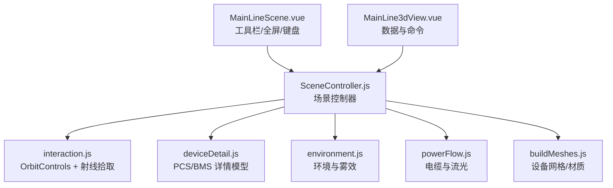
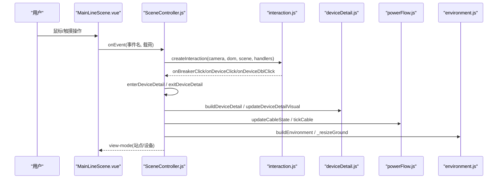
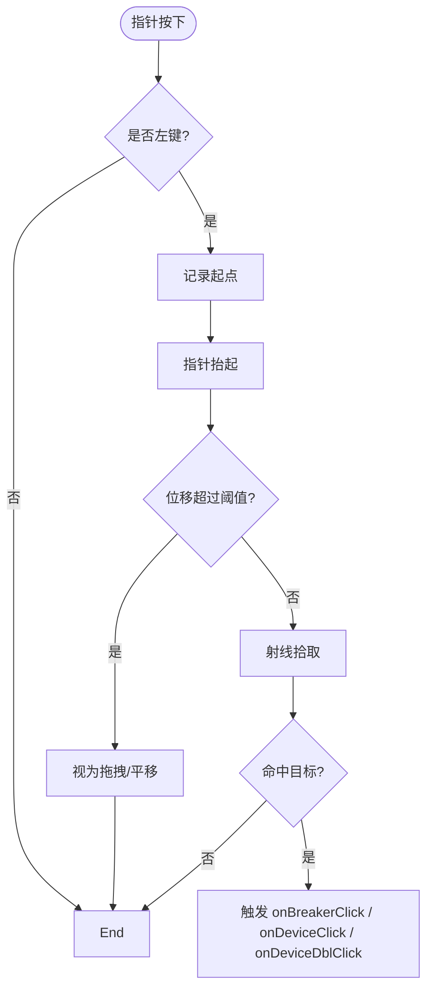
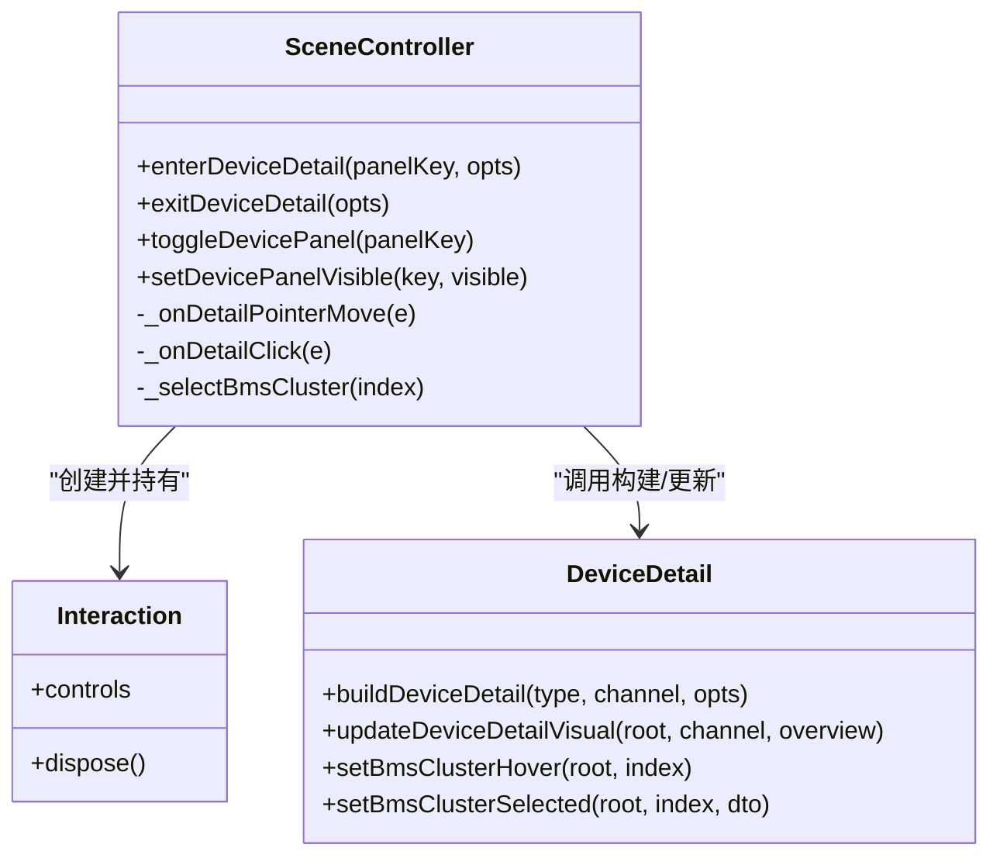
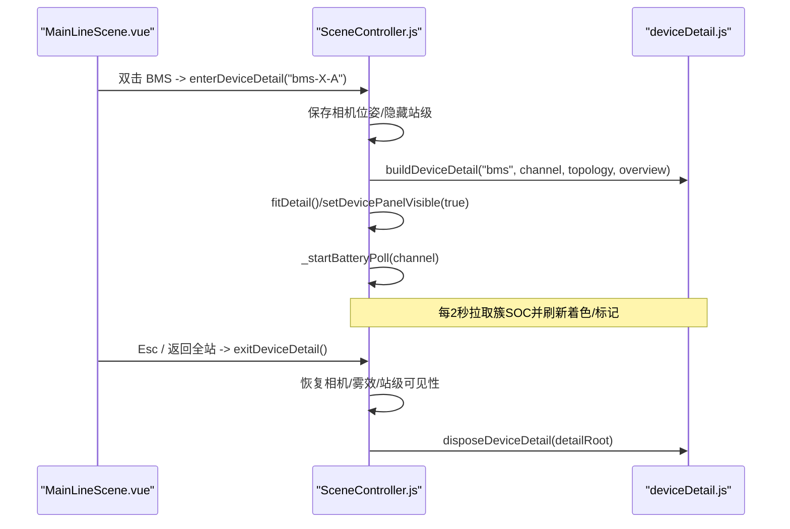
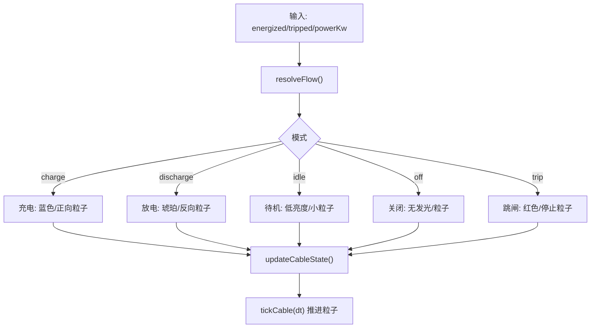
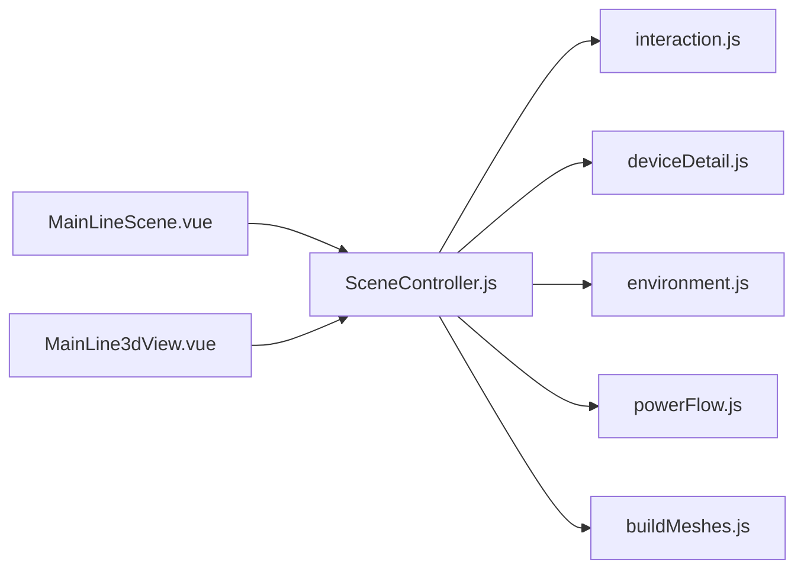

# 交互控制系统

<cite>
**本文引用的文件**
- [SceneController.js](file://Web/src/components/mainline3d/SceneController.js)
- [interaction.js](file://Web/src/components/mainline3d/interaction.js)
- [deviceDetail.js](file://Web/src/components/mainline3d/deviceDetail.js)
- [MainLineScene.vue](file://Web/src/components/MainLineScene.vue)
- [buildMeshes.js](file://Web/src/components/mainline3d/buildMeshes.js)
- [environment.js](file://Web/src/components/mainline3d/environment.js)
- [powerFlow.js](file://Web/src/components/mainline3d/powerFlow.js)
- [MainLine3dView.vue](file://Web/src/views/MainLine3dView.vue)
</cite>

## 目录
1. [简介](#简介)
2. [项目结构](#项目结构)
3. [核心组件](#核心组件)
4. [架构总览](#架构总览)
5. [详细组件分析](#详细组件分析)
6. [依赖关系分析](#依赖关系分析)
7. [性能考虑](#性能考虑)
8. [故障排查指南](#故障排查指南)
9. [结论](#结论)
10. [附录](#附录)

## 简介
本系统为储能仿真系统的 3D 主接线场景交互控制模块，提供鼠标与触摸事件捕获、旋转/缩放/平移等相机控制、设备选择与高亮（射线检测）、BMS/PCS 设备详情模式切换（含视图过渡与信息面板动态加载）、键盘快捷键（如 Esc 返回）以及交互行为的可配置项。同时包含潮流可视化与性能优化策略，确保在复杂电站拓扑下的流畅体验。

## 项目结构
该交互控制系统位于 Web 前端 Vue 工程内，围绕 Three.js 构建 3D 场景，并通过模块化组织职责：
- 场景控制器：负责场景生命周期、相机控制、事件分发、视图模式切换
- 交互层：封装 OrbitControls、指针事件、射线拾取
- 设备详情：PCS/BMS 的剖切模型与实时视觉更新
- 环境渲染：地面、道路、绿化、天空穹顶与雾效
- 潮流管线：电缆路径、流光粒子、状态机
- 视图容器：Vue 组件承载工具栏、全屏、事件桥接

图表来源
- [MainLineScene.vue:1-120](file://Web/src/components/MainLineScene.vue#L1-L120)
- [SceneController.js:55-142](file://Web/src/components/mainline3d/SceneController.js#L55-L142)
- [interaction.js:1-120](file://Web/src/components/mainline3d/interaction.js#L1-L120)
- [deviceDetail.js:785-794](file://Web/src/components/mainline3d/deviceDetail.js#L785-L794)
- [environment.js:222-439](file://Web/src/components/mainline3d/environment.js#L222-L439)
- [powerFlow.js:1-314](file://Web/src/components/mainline3d/powerFlow.js#L1-L314)
- [buildMeshes.js:125-477](file://Web/src/components/mainline3d/buildMeshes.js#L125-L477)

章节来源
- [MainLineScene.vue:1-120](file://Web/src/components/MainLineScene.vue#L1-L120)
- [SceneController.js:55-142](file://Web/src/components/mainline3d/SceneController.js#L55-L142)

## 核心组件
- 场景控制器 SceneController：初始化 Three.js 场景、相机、渲染器、灯光、地面与环境；创建交互层；管理站级/设备级视图模式；挂载标签与浮动面板；处理详情模式的进入/退出与相机过渡；轮询电池簇数据并刷新视觉。
- 交互层 interaction：基于 OrbitControls 实现旋转/缩放/平移；通过 Raycaster 进行点击拾取；区分单击与双击；屏蔽右键菜单；支持 pointermove/leave 事件用于悬停高亮。
- 设备详情 deviceDetail：构建 PCS 柜剖切模型与 BMS 集装箱缩略簇架；根据通道数据更新发光母线、指示灯、功率条；支持簇悬停高亮、选中前移、最高/最低温单体标记与悬浮信息面板。
- 环境 environment：程序化生成水泥地、道路、绿化带、树木、路灯、围栏、天空穹顶与雾环；按布局自适应尺寸与位置。
- 潮流 powerFlow：将功率方向映射为颜色与粒子速度；使用正交刚体路径与圆角曲线；每帧推进粒子与拖尾；支持跳闸/待机/充电/放电状态。
- 构建 buildMeshes：提供断路器、变压器、PCS 柜、BMS 箱、光伏方阵、直流母线、汇流节点等 3D 网格与材质；为可交互对象注入 userData（如 pickId、panelKey）。

章节来源
- [SceneController.js:55-142](file://Web/src/components/mainline3d/SceneController.js#L55-L142)
- [interaction.js:1-120](file://Web/src/components/mainline3d/interaction.js#L1-L120)
- [deviceDetail.js:101-219](file://Web/src/components/mainline3d/deviceDetail.js#L101-L219)
- [environment.js:222-439](file://Web/src/components/mainline3d/environment.js#L222-L439)
- [powerFlow.js:118-200](file://Web/src/components/mainline3d/powerFlow.js#L118-L200)
- [buildMeshes.js:125-477](file://Web/src/components/mainline3d/buildMeshes.js#L125-L477)

## 架构总览
下图展示从用户输入到 3D 场景反馈的整体流程，包括相机控制、射线拾取、设备详情切换与数据驱动更新。

图表来源
- [MainLineScene.vue:117-183](file://Web/src/components/MainLineScene.vue#L117-L183)
- [SceneController.js:116-142](file://Web/src/components/mainline3d/SceneController.js#L116-L142)
- [interaction.js:41-86](file://Web/src/components/mainline3d/interaction.js#L41-L86)
- [deviceDetail.js:785-794](file://Web/src/components/mainline3d/deviceDetail.js#L785-L794)
- [powerFlow.js:206-262](file://Web/src/components/mainline3d/powerFlow.js#L206-L262)
- [environment.js:222-439](file://Web/src/components/mainline3d/environment.js#L222-L439)

## 详细组件分析

### 鼠标与触摸事件捕获与处理（旋转/缩放/平移）
- 相机控制：通过 OrbitControls 启用阻尼、限制极角、设置最小/最大距离，并将左键设为旋转、滚轮缩放、右键平移。
- 指针事件：监听 pointerdown/pointerup/pointermove/pointerleave/doubleclick/contextmenu；在 pointerup 中计算位移容差以区分点击与拖拽；使用 Raycaster 将屏幕坐标转为 NDC 并投射射线，遍历场景子对象获取 userData.pickId 或 panelKey。
- 事件分发：将断路器点击、设备点击、设备双击回调至 SceneController，由控制器决定打开面板或进入详情。

图表来源
- [interaction.js:41-86](file://Web/src/components/mainline3d/interaction.js#L41-L86)
- [SceneController.js:116-132](file://Web/src/components/mainline3d/SceneController.js#L116-L132)

章节来源
- [interaction.js:1-120](file://Web/src/components/mainline3d/interaction.js#L1-L120)
- [SceneController.js:116-132](file://Web/src/components/mainline3d/SceneController.js#L116-L132)

### 设备选择与高亮（射线检测、选中状态、视觉反馈）
- 设备面板：PCS/BMS/PV 等网格在构建时通过 tagPanelPick 注入 panelKey，便于拾取后定位对应面板。
- 断路器：createBreakerMesh 为灭弧室与指示条注入 pickId/unitIndex，点击后调用 setBreakerVisual 更新颜色与发光强度。
- BMS 簇高亮：在详情模式下，维护 hoveredCluster/selectedCluster；悬停时提高不透明度并显示高亮边框与光晕；选中时将簇前移、显示最高/最低温单体标记与簇信息面板。
- 视觉反馈：通过材质 emissive/emissiveIntensity、透明度、几何高亮线、粒子发光等实现即时反馈。

图表来源
- [SceneController.js:631-773](file://Web/src/components/mainline3d/SceneController.js#L631-L773)
- [interaction.js:107-118](file://Web/src/components/mainline3d/interaction.js#L107-L118)
- [deviceDetail.js:600-738](file://Web/src/components/mainline3d/deviceDetail.js#L600-L738)

章节来源
- [buildMeshes.js:125-220](file://Web/src/components/mainline3d/buildMeshes.js#L125-L220)
- [deviceDetail.js:600-738](file://Web/src/components/mainline3d/deviceDetail.js#L600-L738)
- [SceneController.js:481-561](file://Web/src/components/mainline3d/SceneController.js#L481-L561)

### 设备详情模式切换逻辑（视图过渡动画与信息面板动态加载）
- 进入详情：保存当前相机位姿；销毁旧详情根；根据类型构建 PCS 或 BMS 详情模型；隐藏站级场景；调整相机最近/最远距离与雾效范围；放置设备面板；适配相机到详情中心；启动电池簇数据轮询（BMS）。
- 退出详情：恢复站级可见性；还原相机位姿或重新 fitAll；恢复雾效参数；关闭电池轮询；清理详情资源。
- 信息面板：BMS 详情中，选中簇后动态显示簇电压/电流/功率/SOC/SOH/温度等信息；最高/最低温单体以彩色标记与文本提示叠加。

图表来源
- [SceneController.js:631-773](file://Web/src/components/mainline3d/SceneController.js#L631-L773)
- [deviceDetail.js:785-794](file://Web/src/components/mainline3d/deviceDetail.js#L785-L794)
- [MainLineScene.vue:185-191](file://Web/src/components/MainLineScene.vue#L185-L191)

章节来源
- [SceneController.js:631-773](file://Web/src/components/mainline3d/SceneController.js#L631-L773)
- [deviceDetail.js:740-783](file://Web/src/components/mainline3d/deviceDetail.js#L740-L783)
- [MainLineScene.vue:185-191](file://Web/src/components/MainLineScene.vue#L185-L191)

### 键盘快捷键支持（Esc 返回、导航）
- Esc 键：在设备详情模式下按下 Esc 会阻止默认行为并调用 exitDeviceDetail 返回全站视图。
- 工具栏按钮：提供“返回全站”按钮，作为无障碍替代入口。
- 未来可扩展：可在交互层增加方向键导航（如聚焦下一个设备）与 Enter 确认，但当前仓库未实现。

章节来源
- [MainLineScene.vue:185-191](file://Web/src/components/MainLineScene.vue#L185-L191)
- [MainLineScene.vue:15-23](file://Web/src/components/MainLineScene.vue#L15-L23)

### 交互行为的自定义配置（灵敏度、手势识别、无障碍）
- 相机灵敏度：可通过修改 OrbitControls 的 rotateSpeed、dampingFactor、minDistance、maxDistance、maxPolarAngle 等参数调节旋转灵敏度与缩放范围。
- 手势识别：当前基于 Pointer Events 统一处理鼠标与触摸；禁用 contextmenu 避免误触；可通过扩展 onPointerDown/Up 逻辑添加双指缩放/旋转等手势。
- 无障碍访问：提供工具栏“返回全站”按钮；标题与提示文案说明操作方式；建议后续补充 aria-label、tabindex、键盘焦点管理等以提升可访问性。

章节来源
- [interaction.js:10-22](file://Web/src/components/mainline3d/interaction.js#L10-L22)
- [MainLineScene.vue:8-33](file://Web/src/components/MainLineScene.vue#L8-L33)

### 潮流可视化与状态映射
- 状态解析：根据 energized/tripped/powerKw 解析为 off/idle/charge/discharge/trip，并计算方向与幅值。
- 电缆外观：使用正交刚体路径与二次贝塞尔圆角构建 TubeGeometry；根据状态设置颜色与发光强度。
- 粒子与拖尾：每帧推进粒子相位，依据速度与方向更新位置；idle 模式呼吸式闪烁；充/放模式粒子大小与拖尾长度随功率幅值变化。

图表来源
- [powerFlow.js:26-43](file://Web/src/components/mainline3d/powerFlow.js#L26-L43)
- [powerFlow.js:206-262](file://Web/src/components/mainline3d/powerFlow.js#L206-L262)
- [powerFlow.js:268-314](file://Web/src/components/mainline3d/powerFlow.js#L268-L314)

章节来源
- [powerFlow.js:118-200](file://Web/src/components/mainline3d/powerFlow.js#L118-L200)
- [powerFlow.js:206-314](file://Web/src/components/mainline3d/powerFlow.js#L206-L314)

## 依赖关系分析
- SceneController 依赖 interaction 提供相机与拾取能力；依赖 deviceDetail 构建详情模型；依赖 environment 生成环境与雾效；依赖 powerFlow 更新电缆状态；依赖 buildMeshes 生成设备网格。
- MainLineScene 作为 Vue 容器，负责工具栏、全屏、键盘事件与事件转发；MainLine3dView 负责数据获取与命令下发。

图表来源
- [MainLineScene.vue:117-183](file://Web/src/components/MainLineScene.vue#L117-L183)
- [SceneController.js:55-142](file://Web/src/components/mainline3d/SceneController.js#L55-L142)

章节来源
- [MainLineScene.vue:117-183](file://Web/src/components/MainLineScene.vue#L117-L183)
- [SceneController.js:55-142](file://Web/src/components/mainline3d/SceneController.js#L55-L142)

## 性能考虑
- 渲染优化：
  - 使用 InstancedMesh 批量绘制电芯与光伏组件，减少 draw call。
  - 合理设置像素比上限（devicePixelRatio 限 2），降低高分屏压力。
  - 阴影贴图尺寸适中（1024x1024），PCFSoft 柔和阴影。
  - 环境元素按需复用材质与纹理，避免重复创建。
- 交互优化：
  - 射线拾取仅遍历必要对象（详情模式下对簇 pickMesh 集合）。
  - 节流/去抖：电池概览轮询间隔 2s，避免频繁网络请求与重绘。
- 内存管理：
  - 场景重建时显式释放 geometry/material/CSS2DObject 元素引用。
  - 详情模式退出时清理临时标记与粒子对象。
- 兼容性：
  - 使用 Pointer Events 兼容鼠标与触摸；全屏 API 兼容 webkit 前缀。
  - CSS2DRenderer 用于标签与面板，避免复杂 HTML 覆盖问题。

[本节为通用指导，无需特定文件引用]

## 故障排查指南
- 无法点击设备：
  - 检查网格是否注入 panelKey/pickId；确认 Raycaster 是否正确设置 NDC 坐标。
  - 确认 scene.children 是否包含目标对象。
- 详情模式无法进入：
  - 检查 panelKey 解析是否成功（pcs/bms-unit-side 格式）。
  - 确认 detailRoot 构建是否成功，detailType 匹配。
- 电池簇数据不刷新：
  - 检查 _startBatteryPoll 定时器是否运行；getBattery 接口是否可用。
  - 确认 selectedCluster 与 clusterGroups 索引一致。
- 全屏异常：
  - 检查 requestFullscreen/webkitRequestFullscreen 是否被浏览器拦截。
  - 监听 fullscreenchange 事件并调用 resize 刷新渲染。

章节来源
- [interaction.js:29-39](file://Web/src/components/mainline3d/interaction.js#L29-L39)
- [SceneController.js:459-470](file://Web/src/components/mainline3d/SceneController.js#L459-L470)
- [SceneController.js:698-725](file://Web/src/components/mainline3d/SceneController.js#L698-L725)
- [MainLineScene.vue:193-221](file://Web/src/components/MainLineScene.vue#L193-L221)

## 结论
本交互控制系统以 SceneController 为核心，结合 interaction、deviceDetail、environment、powerFlow 与 buildMeshes 等模块，实现了完整的 3D 场景交互闭环：从事件捕获、射线拾取、设备选择与高亮，到详情模式切换、信息面板动态加载与键盘快捷键支持。系统在性能与兼容性方面采取了多项优化措施，适合在复杂储能电站场景中稳定运行。后续可进一步增强无障碍支持与手势识别，提升用户体验。

[本节为总结，无需特定文件引用]

## 附录
- 常用配置项参考：
  - 相机灵敏度：rotateSpeed、dampingFactor、minDistance、maxDistance、maxPolarAngle
  - 潮流颜色：off/idle/charge/discharge/trip
  - 粒子数量与拖尾长度：particleCount、trailCount
- 关键函数路径：
  - 创建交互：createInteraction
  - 构建详情：buildDeviceDetail / buildPcsDetail / buildBmsDetail
  - 更新视觉：updateDeviceDetailVisual / updatePcsDetailVisual / updateBmsDetailVisual
  - 潮流状态：resolveFlow / updateCableState / tickCable
  - 环境构建：buildEnvironment

[本节为参考，无需特定文件引用]