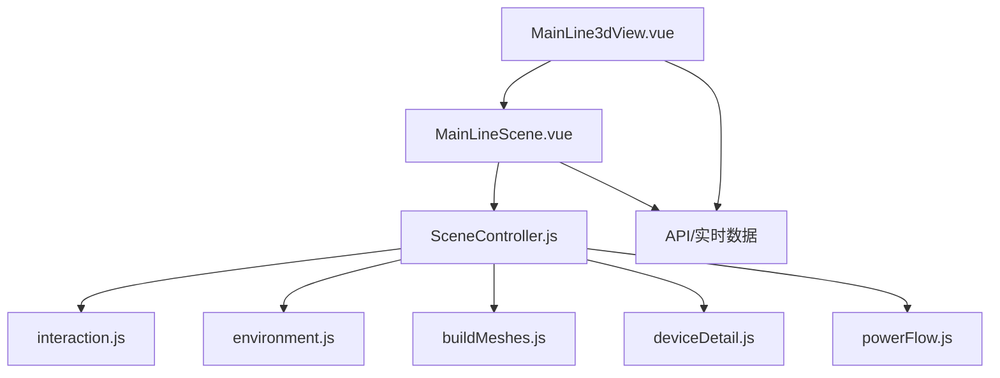
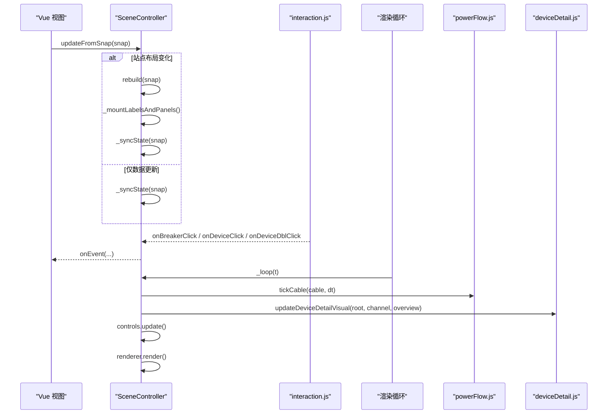
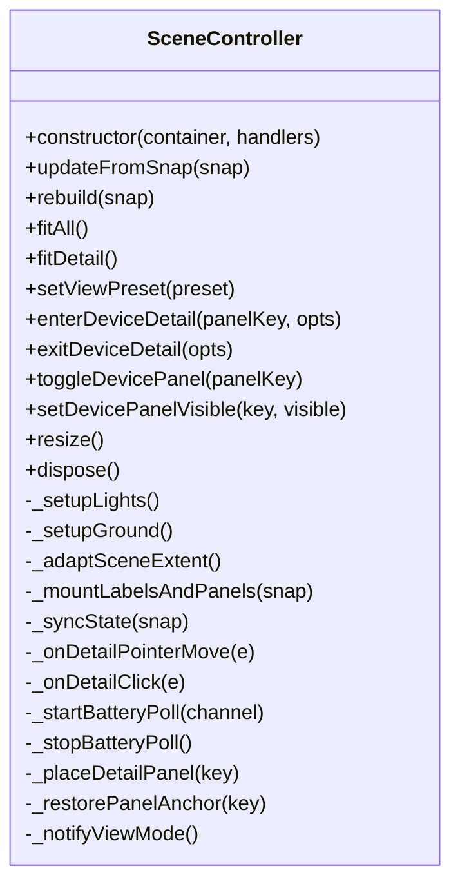
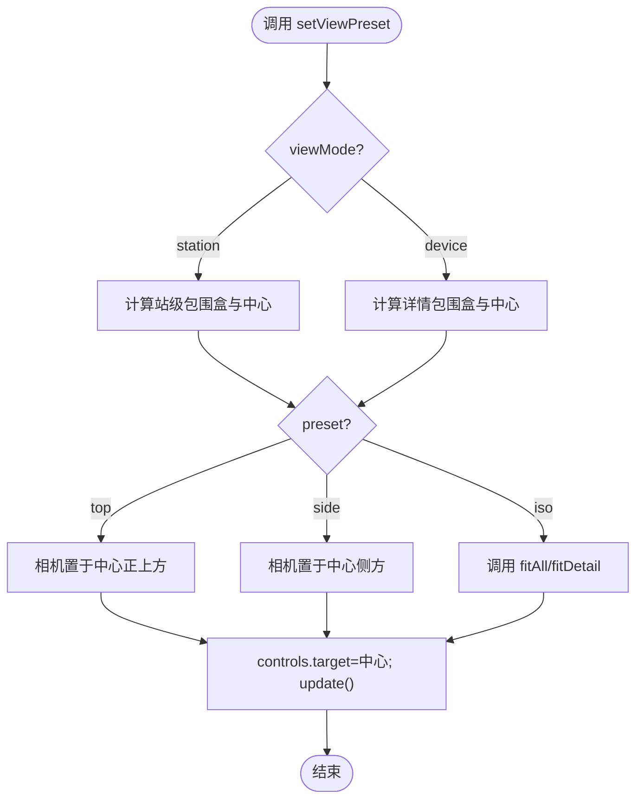
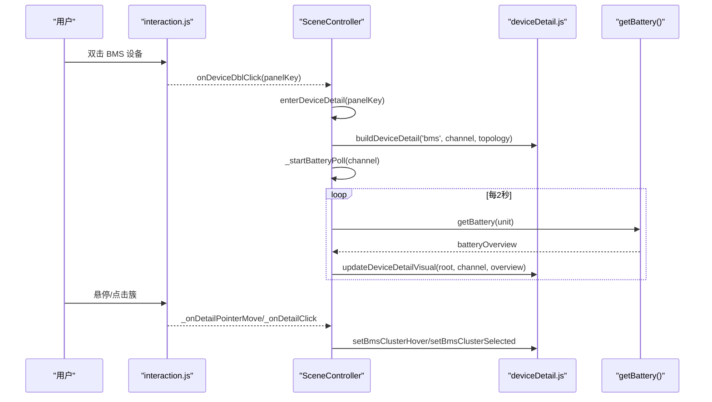
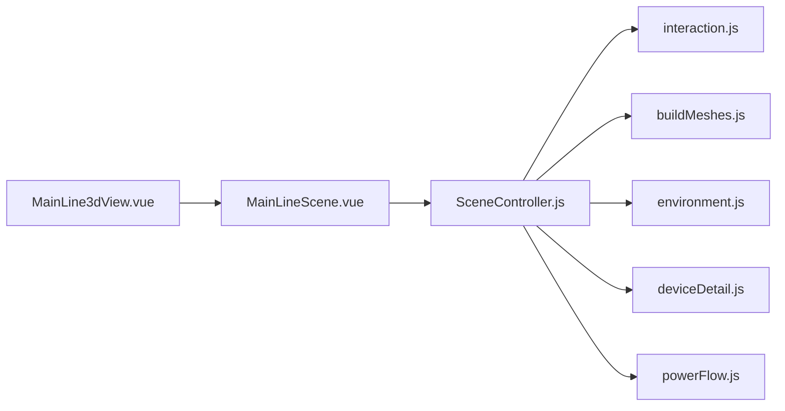

# 场景控制器

<cite>
**本文引用的文件**
- [SceneController.js](file://Web/src/components/mainline3d/SceneController.js)
- [MainLineScene.vue](file://Web/src/components/MainLineScene.vue)
- [MainLine3dView.vue](file://Web/src/views/MainLine3dView.vue)
- [interaction.js](file://Web/src/components/mainline3d/interaction.js)
- [environment.js](file://Web/src/components/mainline3d/environment.js)
- [deviceDetail.js](file://Web/src/components/mainline3d/deviceDetail.js)
- [buildMeshes.js](file://Web/src/components/mainline3d/buildMeshes.js)
- [powerFlow.js](file://Web/src/components/mainline3d/powerFlow.js)
</cite>

## 目录
1. [简介](#简介)
2. [项目结构](#项目结构)
3. [核心组件](#核心组件)
4. [架构总览](#架构总览)
5. [详细组件分析](#详细组件分析)
6. [依赖关系分析](#依赖关系分析)
7. [性能考量](#性能考量)
8. [故障排查指南](#故障排查指南)
9. [结论](#结论)
10. [附录：扩展与优化实践](#附录：扩展与优化实践)

## 简介
本文件面向 Three.js 主接线 3D 场景的控制器实现，聚焦 SceneController 类及其在储能仿真 Web 前端中的职责边界。内容涵盖：
- 3D 场景初始化（渲染器、相机、灯光、地面与环境）
- 相机控制与视角切换算法（俯视、侧视、等轴测复位）
- 渲染循环管理与设备状态同步
- 事件处理机制（断路器、设备面板、BMS 详情交互）
- 设备详情模式与全屏模式支持
- 与 Vue 组件的数据绑定、状态同步与生命周期管理
- 扩展指南（新增视角预设、自定义交互、性能优化）
- 常见问题调试方法与性能监控技巧

## 项目结构
Three.js 场景由多个模块协作完成：
- 控制器：SceneController 负责场景装配、数据驱动更新、交互桥接、视图切换与渲染循环
- 交互层：interaction.js 封装 OrbitControls 与射线拾取，统一单击/双击/悬停事件分发
- 环境：environment.js 生成程序化水泥路面、绿化、路灯、远景雾环等
- 模型：buildMeshes.js 提供 PCS/BMS/光伏阵列/母线/电缆等 3D 构件
- 详情：deviceDetail.js 构建并刷新 PCS/BMS 剖切详情（含簇级高亮、温度标记）
- 潮流：powerFlow.js 计算线缆流向、颜色与粒子动画
- Vue 集成：MainLineScene.vue 作为容器，MainLine3dView.vue 作为页面入口，负责数据拉取、命令下发与全屏适配

图表来源
- [MainLine3dView.vue:1-36](file://Web/src/views/MainLine3dView.vue#L1-L36)
- [MainLineScene.vue:59-250](file://Web/src/components/MainLineScene.vue#L59-L250)
- [SceneController.js:55-142](file://Web/src/components/mainline3d/SceneController.js#L55-L142)

章节来源
- [MainLine3dView.vue:1-274](file://Web/src/views/MainLine3dView.vue#L1-L274)
- [MainLineScene.vue:1-430](file://Web/src/components/MainLineScene.vue#L1-L430)
- [SceneController.js:1-1195](file://Web/src/components/mainline3d/SceneController.js#L1-L1195)

## 核心组件
- SceneController
  - 初始化 WebGL/CSS2D 渲染器、透视相机、灯光与地面
  - 根据快照重建站级场景与环境，挂载标签与设备面板
  - 维护 viewMode（station/device）、detailKey、面板可见性
  - 提供 fitAll/setViewPreset/fitDetail 等视角控制
  - 通过 _syncState 将快照映射到断路器、母线节点、线缆、标签与详情外观
  - 管理 BMS 详情轮询与簇级信息面板
  - 启动 requestAnimationFrame 渲染循环，驱动控制器与动画
- interaction.js
  - 基于 OrbitControls 的旋转/缩放/平移
  - 使用 Raycaster 拾取断路器与设备面板，派发 onBreakerClick/onDeviceClick/onDeviceDblClick
  - 屏蔽右键菜单，处理指针移动/离开以支持详情悬停
- environment.js
  - 程序化生成水泥地、道路、绿化带、路灯、围栏、天空穹顶与雾环
  - 依据布局包围盒自适应尺寸，避免共面闪烁
- buildMeshes.js
  - 提供断路器、变压器、PCS 柜、BMS 集装箱、光伏方阵/逆变器、母线节点、直流母线、静态电缆等
  - setBreakerVisual 与 setPvArrayVisual 驱动视觉状态
- deviceDetail.js
  - 构建 PCS/BMS 剖切详情，支持簇级悬停/选中、高低温单体标记、SOC 着色
  - updateDeviceDetailVisual 按通道与电池概览刷新
- powerFlow.js
  - resolveFlow 判定 off/idle/charge/discharge/trip
  - createPowerCable 创建带圆角路径的管线与粒子系统
  - updateCableState/tickCable 驱动颜色、发光与粒子流动

章节来源
- [SceneController.js:55-142](file://Web/src/components/mainline3d/SceneController.js#L55-L142)
- [interaction.js:1-120](file://Web/src/components/mainline3d/interaction.js#L1-L120)
- [environment.js:222-439](file://Web/src/components/mainline3d/environment.js#L222-L439)
- [buildMeshes.js:125-220](file://Web/src/components/mainline3d/buildMeshes.js#L125-L220)
- [deviceDetail.js:785-819](file://Web/src/components/mainline3d/deviceDetail.js#L785-L819)
- [powerFlow.js:1-314](file://Web/src/components/mainline3d/powerFlow.js#L1-L314)

## 架构总览
SceneController 是“数据→视图”的中枢：Vue 层通过 props.snap 推送最新快照；控制器内部根据 stationKey 决定重建或增量同步；交互事件经 interaction.js 回调至控制器；控制器再触发 onEvent 回传给 Vue 层执行后端指令。

图表来源
- [SceneController.js:279-319](file://Web/src/components/mainline3d/SceneController.js#L279-L319)
- [SceneController.js:835-1058](file://Web/src/components/mainline3d/SceneController.js#L835-L1058)
- [SceneController.js:1149-1176](file://Web/src/components/mainline3d/SceneController.js#L1149-L1176)
- [interaction.js:41-86](file://Web/src/components/mainline3d/interaction.js#L41-L86)
- [powerFlow.js:268-314](file://Web/src/components/mainline3d/powerFlow.js#L268-L314)
- [deviceDetail.js:740-794](file://Web/src/components/mainline3d/deviceDetail.js#L740-L794)

## 详细组件分析

### SceneController 类
- 初始化
  - 创建 THREE.Scene、PerspectiveCamera、WebGLRenderer、CSS2DRenderer
  - 配置阴影、色调映射、输出色彩空间
  - 设置灯光（环境光、半球光、方向光+补光）与地面
  - 创建 interaction 并注册 resize 监听
  - 调用 rebuild/updateFromSnap 并启动渲染循环
- 场景重建与状态同步
  - 根据 stationKey 判断是否重建；重建时销毁旧站级/环境/面板，重新构建布局与模型
  - _syncState 将快照映射到断路器、母线节点、线缆、标签文案与详情外观
- 视角控制
  - fitAll：按 FOV 与包围盒计算合适距离，设置相机位置与目标点
  - fitDetail：针对详情根对象计算距离与缩放范围
  - setViewPreset：支持 top/side/iso 三种预设（全站与详情分别处理）
- 设备详情模式
  - enterDeviceDetail：保存相机、隐藏站级、创建详情根、调整雾效与交互距离、放置面板、开始电池概览轮询
  - exitDeviceDetail：恢复站级可见性、恢复雾效、还原相机或 fitAll
  - BMS 详情：鼠标悬停高亮簇、点击选中簇并显示簇信息面板，定时拉取电池概览并刷新 SOC/温度标记
- 事件与面板
  - 通过 labelObjects 管理 CSS2DObject 与 DOM 面板，支持打开/关闭/定位
  - 双击 BMS 进入详情，双击其他设备切换面板
- 渲染循环
  - requestAnimationFrame 驱动 controls.update、cable.tick、renderer.render(labelRenderer)

图表来源
- [SceneController.js:55-142](file://Web/src/components/mainline3d/SceneController.js#L55-L142)
- [SceneController.js:279-319](file://Web/src/components/mainline3d/SceneController.js#L279-L319)
- [SceneController.js:631-773](file://Web/src/components/mainline3d/SceneController.js#L631-L773)
- [SceneController.js:1067-1147](file://Web/src/components/mainline3d/SceneController.js#L1067-L1147)
- [SceneController.js:1149-1195](file://Web/src/components/mainline3d/SceneController.js#L1149-L1195)

章节来源
- [SceneController.js:55-142](file://Web/src/components/mainline3d/SceneController.js#L55-L142)
- [SceneController.js:279-319](file://Web/src/components/mainline3d/SceneController.js#L279-L319)
- [SceneController.js:631-773](file://Web/src/components/mainline3d/SceneController.js#L631-L773)
- [SceneController.js:835-1058](file://Web/src/components/mainline3d/SceneController.js#L835-L1058)
- [SceneController.js:1067-1147](file://Web/src/components/mainline3d/SceneController.js#L1067-L1147)
- [SceneController.js:1149-1195](file://Web/src/components/mainline3d/SceneController.js#L1149-L1195)

### 视角切换算法
- 全站视角
  - 计算站级包围盒中心与跨度，按 FOV 与宽高比推导合适距离，沿固定方向向量放置相机
  - 预设 top：从上方垂直俯视；side：从侧面斜向观察；iso：回到 fitAll
- 详情视角
  - 以详情根包围盒计算距离，限制最小/最大缩放范围，确保细节可观察
  - 同样支持 top/side/iso 预设

图表来源
- [SceneController.js:1111-1147](file://Web/src/components/mainline3d/SceneController.js#L1111-L1147)
- [SceneController.js:1067-1090](file://Web/src/components/mainline3d/SceneController.js#L1067-L1090)
- [SceneController.js:1092-1109](file://Web/src/components/mainline3d/SceneController.js#L1092-L1109)

章节来源
- [SceneController.js:1067-1147](file://Web/src/components/mainline3d/SceneController.js#L1067-L1147)

### 设备详情模式与 BMS 交互
- 进入详情：隐藏站级、创建详情根、调整雾效与交互范围、放置面板、开始电池概览轮询
- 悬停/点击簇：Raycaster 拾取簇选择框，更新透明度/边框高亮，选中簇前移并显示簇信息面板
- 电池概览：每 2 秒拉取电池簇数据，刷新 SOC 着色与高低温单体标记

图表来源
- [SceneController.js:631-725](file://Web/src/components/mainline3d/SceneController.js#L631-L725)
- [SceneController.js:485-561](file://Web/src/components/mainline3d/SceneController.js#L485-L561)
- [deviceDetail.js:600-738](file://Web/src/components/mainline3d/deviceDetail.js#L600-L738)
- [deviceDetail.js:740-794](file://Web/src/components/mainline3d/deviceDetail.js#L740-L794)

章节来源
- [SceneController.js:485-561](file://Web/src/components/mainline3d/SceneController.js#L485-L561)
- [SceneController.js:631-725](file://Web/src/components/mainline3d/SceneController.js#L631-L773)
- [deviceDetail.js:600-738](file://Web/src/components/mainline3d/deviceDetail.js#L600-L738)
- [deviceDetail.js:740-794](file://Web/src/components/mainline3d/deviceDetail.js#L740-L794)

### 全屏模式支持
- MainLineScene.vue 提供全屏按钮，监听 fullscreenchange/webkitfullscreenchange
- 进入/退出全屏后调用 controller.resize() 刷新 WebGL/CSS2D 尺寸
- 卸载时清理全屏状态与事件

章节来源
- [MainLineScene.vue:193-250](file://Web/src/components/MainLineScene.vue#L193-L250)

### 与 Vue 组件的集成
- 数据绑定
  - MainLine3dView.vue 通过 useRealtime 订阅实时数据，更新 snap
  - MainLineScene.vue 将 snap 作为 props 传入，watch 深度监听并调用 controller.updateFromSnap
- 事件回传
  - SceneController.onEvent 将断路器操作、PCS/BMS/PV 控制事件透传到 Vue，再由 View 层调用 API 下发
- 生命周期
  - 组件挂载时创建控制器，卸载时移除事件并 dispose 控制器释放资源

章节来源
- [MainLine3dView.vue:39-268](file://Web/src/views/MainLine3dView.vue#L39-L268)
- [MainLineScene.vue:59-250](file://Web/src/components/MainLineScene.vue#L59-L250)
- [SceneController.js:1178-1195](file://Web/src/components/mainline3d/SceneController.js#L1178-L1195)

## 依赖关系分析
- SceneController 依赖
  - interaction.js：相机控制与事件拾取
  - buildMeshes.js：设备与环境的 3D 模型
  - environment.js：程序化环境与雾效
  - deviceDetail.js：设备详情构建与刷新
  - powerFlow.js：线缆流向与动画
- Vue 层依赖
  - MainLineScene.vue 持有控制器实例，负责 UI 与全屏
  - MainLine3dView.vue 负责数据获取与命令下发

图表来源
- [SceneController.js:1-18](file://Web/src/components/mainline3d/SceneController.js#L1-L18)
- [MainLineScene.vue:59-92](file://Web/src/components/MainLineScene.vue#L59-L92)
- [MainLine3dView.vue:39-47](file://Web/src/views/MainLine3dView.vue#L39-L47)

章节来源
- [SceneController.js:1-18](file://Web/src/components/mainline3d/SceneController.js#L1-L18)
- [MainLineScene.vue:59-92](file://Web/src/components/MainLineScene.vue#L59-L92)
- [MainLine3dView.vue:39-47](file://Web/src/views/MainLine3dView.vue#L39-L47)

## 性能考量
- 渲染与材质
  - 使用 PCFSoftShadowMap 与 ACESFilmicToneMapping，合理设置像素比上限为 2，避免过高 DPR 导致卡顿
  - 地面与网格按需重建，避免频繁几何体分配
  - 线缆使用 TubeGeometry 与 Points 粒子，仅在通电/充放电时启用粒子与拖尾
- 场景规模
  - 光伏阵列与 BMS 详情大量使用 InstancedMesh 减少 draw call
  - 环境元素数量受布局包围盒约束，避免无界增长
- 更新频率
  - BMS 详情电池概览轮询间隔为 2 秒，降低网络与渲染压力
  - 渲染循环中仅对必要对象进行更新（断路器闪烁、线缆 tick）
- 内存管理
  - 重建与退出详情时显式 dispose 几何体与材质，移除 DOM 节点，防止泄漏

[本节为通用性能建议，不直接分析具体代码行]

## 故障排查指南
- 场景不显示或黑屏
  - 检查 WebGLRenderer 尺寸与 CSS2DRenderer 尺寸是否与容器一致
  - 确认 scene.background/fog 未遮挡主体
  - 参考：[SceneController.js:84-111](file://Web/src/components/mainline3d/SceneController.js#L84-L111)
- 视角无法适配全站
  - 检查 stationRoot 是否存在且包含子对象；_adaptSceneExtent 会基于 Box3 计算
  - 参考：[SceneController.js:244-264](file://Web/src/components/mainline3d/SceneController.js#L244-L264)
- 断路器点击无效
  - 确认模型 userData.pickId/unitIndex 已正确设置，interaction.js 拾取顺序优先断路器
  - 参考：[buildMeshes.js:171-184](file://Web/src/components/mainline3d/buildMeshes.js#L171-L184)、[interaction.js:59-73](file://Web/src/components/mainline3d/interaction.js#L59-L73)
- BMS 详情无数据或簇无高亮
  - 检查 _loadBmsTopology 是否成功加载拓扑；_resolveBmsTopology 是否能匹配 compartmentNumber
  - 确认 getBattery 返回 clusters 字段；updateDeviceDetailVisual 是否正确刷新
  - 参考：[SceneController.js:144-180](file://Web/src/components/mainline3d/SceneController.js#L144-L180)、[deviceDetail.js:740-794](file://Web/src/components/mainline3d/deviceDetail.js#L740-L794)
- 全屏后画面变形
  - 监听 fullscreenchange 后调用 controller.resize()
  - 参考：[MainLineScene.vue:199-204](file://Web/src/components/MainLineScene.vue#L199-L204)

章节来源
- [SceneController.js:84-111](file://Web/src/components/mainline3d/SceneController.js#L84-L111)
- [SceneController.js:244-264](file://Web/src/components/mainline3d/SceneController.js#L244-L264)
- [buildMeshes.js:171-184](file://Web/src/components/mainline3d/buildMeshes.js#L171-L184)
- [interaction.js:59-73](file://Web/src/components/mainline3d/interaction.js#L59-L73)
- [SceneController.js:144-180](file://Web/src/components/mainline3d/SceneController.js#L144-L180)
- [deviceDetail.js:740-794](file://Web/src/components/mainline3d/deviceDetail.js#L740-L794)
- [MainLineScene.vue:199-204](file://Web/src/components/MainLineScene.vue#L199-L204)

## 结论
SceneController 将 Three.js 场景、交互、数据与 Vue 组件有机整合，提供了完整的 3D 主接线可视化能力。其设计清晰分层：控制器负责编排，交互层专注输入，环境与模型模块负责表现，详情模块提供深入洞察。通过合理的视角算法、状态同步与性能优化策略，系统在复杂场景下仍保持流畅体验。

[本节为总结性内容，不直接分析具体代码行]

## 附录：扩展与优化实践

### 添加新的视角预设
- 在 setViewPreset 中增加新分支，定义相机位置与目标点逻辑
- 全站与详情分别处理，确保在不同模式下均能正确定位
- 示例参考：[SceneController.js:1111-1147](file://Web/src/components/mainline3d/SceneController.js#L1111-L1147)

### 自定义交互行为
- 在 interaction.js 中扩展事件处理，例如新增长按、拖拽标注等
- 在 SceneController 中注册对应回调，并通过 onEvent 通知 Vue 层
- 示例参考：[interaction.js:41-86](file://Web/src/components/mainline3d/interaction.js#L41-L86)

### 优化渲染性能
- 降低像素比上限或禁用部分特效（如阴影）在高负载设备
- 减少线缆粒子数量或关闭拖尾效果
- 合并材质与几何体，复用 InstancedMesh
- 示例参考：
  - 像素比与阴影：[SceneController.js:95-103](file://Web/src/components/mainline3d/SceneController.js#L95-L103)
  - 线缆粒子：[powerFlow.js:139-172](file://Web/src/components/mainline3d/powerFlow.js#L139-L172)
  - 详情 InstancedMesh：[deviceDetail.js:472-526](file://Web/src/components/mainline3d/deviceDetail.js#L472-L526)

### 数据绑定与状态同步最佳实践
- 使用 stationKey 区分不同组态，避免不必要的重建
- 增量更新优先于全量重建，减少 DOM 与 GPU 压力
- 详情模式与站级模式切换时注意恢复相机与雾效
- 示例参考：[SceneController.js:279-319](file://Web/src/components/mainline3d/SceneController.js#L279-L319)