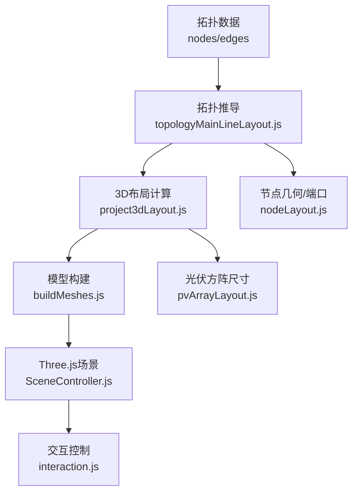
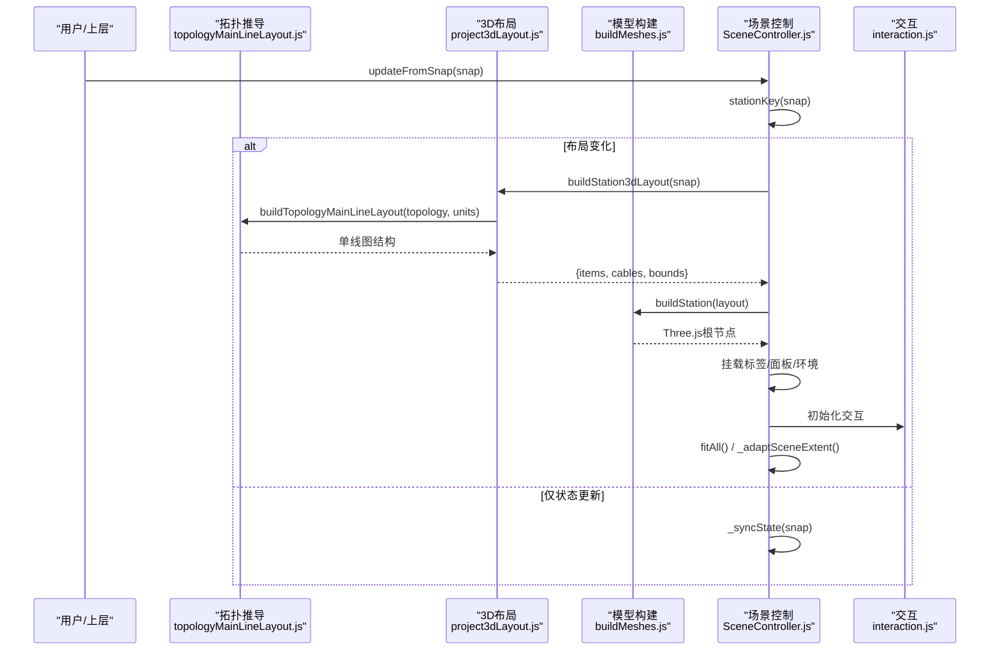
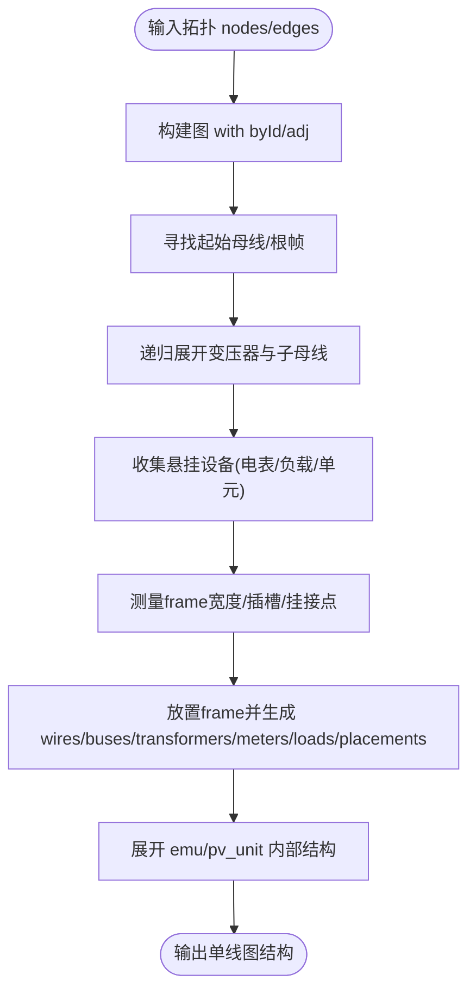
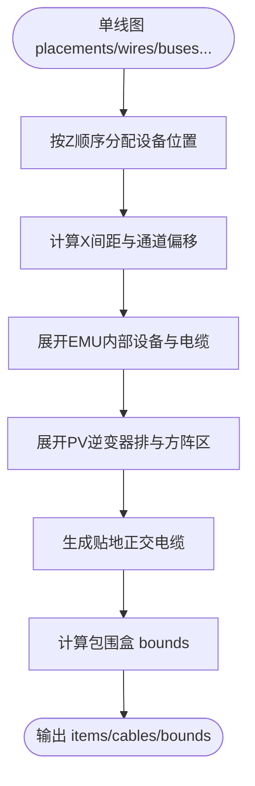
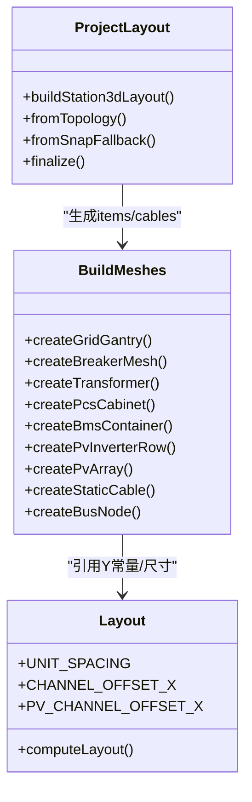
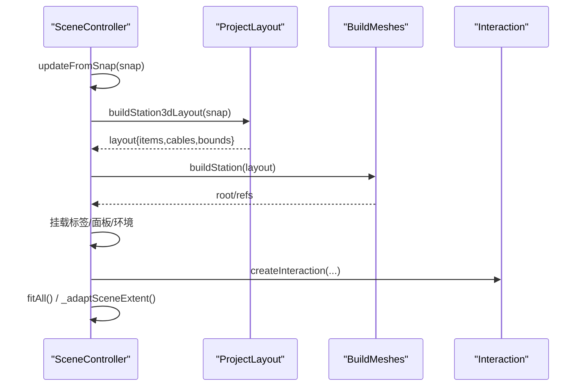
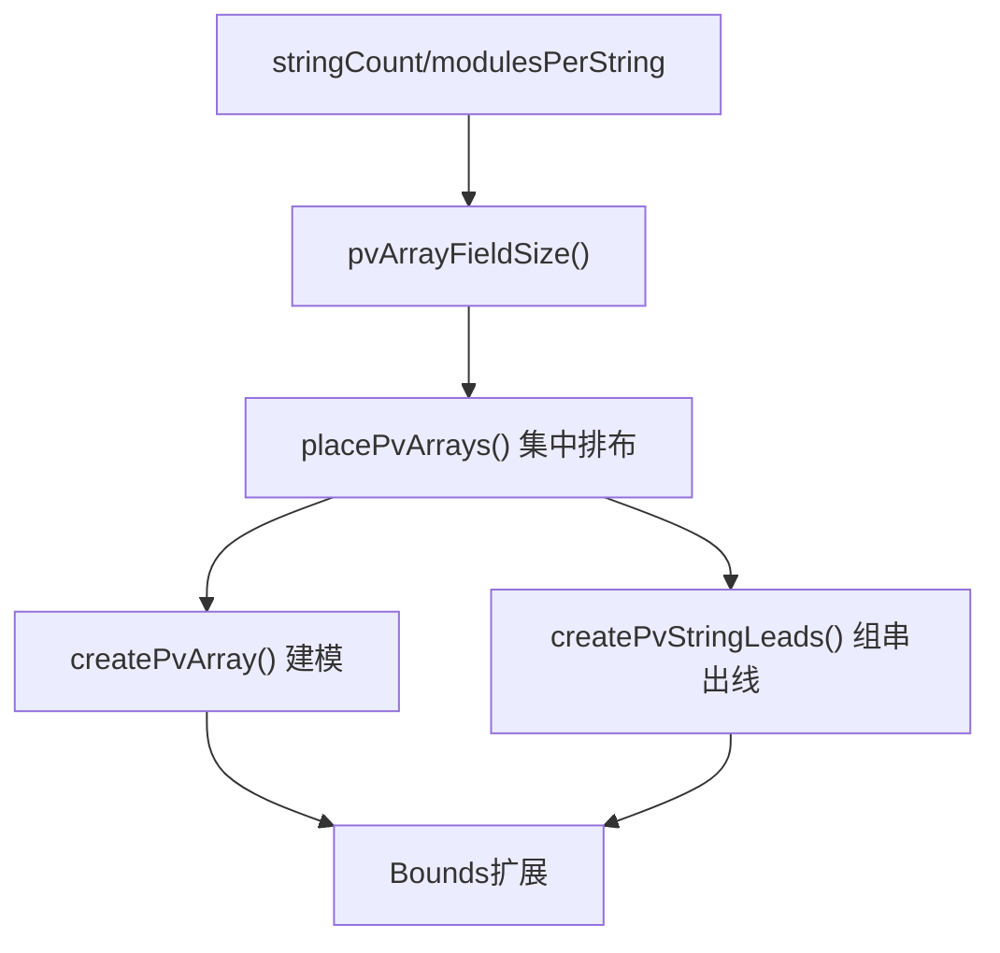
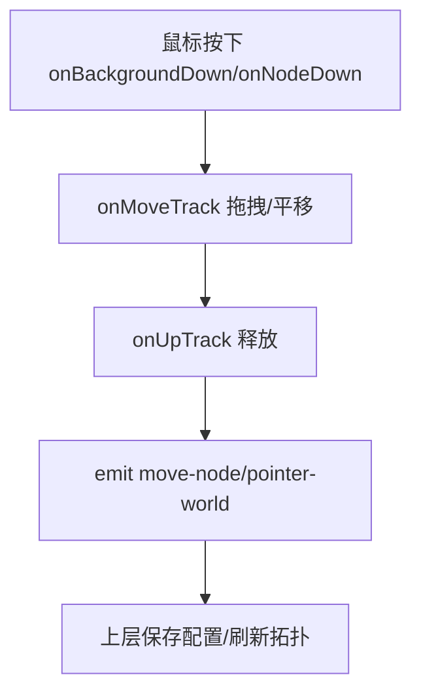
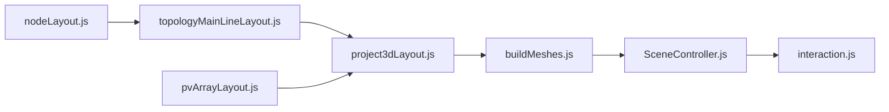

# 布局算法

<cite>
**本文引用的文件**
- [Web/src/components/mainline3d/layout.js](file://Web/src/components/mainline3d/layout.js)
- [Web/src/components/mainline3d/project3dLayout.js](file://Web/src/components/mainline3d/project3dLayout.js)
- [Web/src/components/mainline3d/pvArrayLayout.js](file://Web/src/components/mainline3d/pvArrayLayout.js)
- [Web/src/components/topology/nodeLayout.js](file://Web/src/components/topology/nodeLayout.js)
- [Web/src/components/topology/topologyMainLineLayout.js](file://Web/src/components/topology/topologyMainLineLayout.js)
- [Web/src/components/mainline3d/buildMeshes.js](file://Web/src/components/mainline3d/buildMeshes.js)
- [Web/src/components/mainline3d/SceneController.js](file://Web/src/components/mainline3d/SceneController.js)
- [Web/src/components/mainline3d/interaction.js](file://Web/src/components/mainline3d/interaction.js)
- [Web/src/views/TopologyView.vue](file://Web/src/views/TopologyView.vue)
</cite>

## 目录
1. [简介](#简介)
2. [项目结构](#项目结构)
3. [核心组件](#核心组件)
4. [架构总览](#架构总览)
5. [详细组件分析](#详细组件分析)
6. [依赖关系分析](#依赖关系分析)
7. [性能考量](#性能考量)
8. [故障排查指南](#故障排查指南)
9. [结论](#结论)
10. [附录](#附录)

## 简介
本文件系统性说明储能仿真系统中“3D布局算法”的实现与工作原理，覆盖以下目标：
- 基于拓扑关系的设备自动定位、间距计算与碰撞规避策略
- 将2D拓扑图投影到3D场景的算法流程，保持电气连接直观可读
- 自适应布局：根据屏幕尺寸、设备数量动态调整布局策略
- 手动布局支持：拖拽调整设备位置并保存配置
- 性能优化：增量更新、缓存机制、批量渲染
- 布局验证与错误处理：确保场景可读性与美观性

## 项目结构
3D布局由“拓扑推导 + 3D场站布局 + 模型构建 + 交互控制”四部分组成：
- 拓扑推导：从工程图的节点与连线推导出主接线单线图（含母线、变压器、电表、负载、单元等）
- 3D场站布局：将单线图转换为3D坐标与电缆路径，生成items与cables
- 模型构建：按模板创建3D网格（断路器、变压器、PCS、BMS、光伏方阵等）
- 交互控制：相机、射线拾取、点击/双击事件驱动面板与详情视图

图表来源
- [Web/src/components/topology/topologyMainLineLayout.js:370-793](file://Web/src/components/topology/topologyMainLineLayout.js#L370-L793)
- [Web/src/components/mainline3d/project3dLayout.js:661-974](file://Web/src/components/mainline3d/project3dLayout.js#L661-L974)
- [Web/src/components/mainline3d/buildMeshes.js:1-800](file://Web/src/components/mainline3d/buildMeshes.js#L1-L800)
- [Web/src/components/mainline3d/SceneController.js:55-142](file://Web/src/components/mainline3d/SceneController.js#L55-L142)
- [Web/src/components/mainline3d/pvArrayLayout.js:1-62](file://Web/src/components/mainline3d/pvArrayLayout.js#L1-L62)
- [Web/src/components/topology/nodeLayout.js:1-74](file://Web/src/components/topology/nodeLayout.js#L1-L74)

章节来源
- [Web/src/components/topology/topologyMainLineLayout.js:370-793](file://Web/src/components/topology/topologyMainLineLayout.js#L370-L793)
- [Web/src/components/mainline3d/project3dLayout.js:661-974](file://Web/src/components/mainline3d/project3dLayout.js#L661-L974)
- [Web/src/components/mainline3d/buildMeshes.js:1-800](file://Web/src/components/mainline3d/buildMeshes.js#L1-L800)
- [Web/src/components/mainline3d/SceneController.js:55-142](file://Web/src/components/mainline3d/SceneController.js#L55-L142)
- [Web/src/components/mainline3d/pvArrayLayout.js:1-62](file://Web/src/components/mainline3d/pvArrayLayout.js#L1-L62)
- [Web/src/components/topology/nodeLayout.js:1-74](file://Web/src/components/topology/nodeLayout.js#L1-L74)

## 核心组件
- 拓扑推导器：将工程图（节点+边）解析为结构化单线图，识别母线、变压器、电表、负载及单元（EMU/PV），输出用于3D布局的placements、wires、buses、transformers、meters、loads等。
- 3D布局引擎：把单线图转为3D items（设备项）和cables（电缆），统一Z轴顺序（电网→主断→主变→母线→单元设备），计算X轴间距与通道偏移，生成包围盒bounds。
- 模型构建器：按模板创建3D网格（断路器、变压器、PCS、BMS、光伏方阵、直流母线、汇流点等），并生成贴地正交电缆。
- 场景控制器：管理Three.js场景、相机、光照、地面与环境，负责重建、适配、面板挂载、设备详情切换、实时状态同步。
- 交互层：封装OrbitControls与Raycaster，实现点击/双击设备、断路器操作、指针移动回调。
- 光伏方阵尺寸：依据串数与每串组件数计算方阵占地尺寸，保证布局避让一致。
- 节点几何：定义画布上各模板尺寸、端口位置、颜色等，支撑拓扑绘制与布局。

章节来源
- [Web/src/components/topology/topologyMainLineLayout.js:370-793](file://Web/src/components/topology/topologyMainLineLayout.js#L370-L793)
- [Web/src/components/mainline3d/project3dLayout.js:661-974](file://Web/src/components/mainline3d/project3dLayout.js#L661-L974)
- [Web/src/components/mainline3d/buildMeshes.js:1-800](file://Web/src/components/mainline3d/buildMeshes.js#L1-L800)
- [Web/src/components/mainline3d/SceneController.js:55-142](file://Web/src/components/mainline3d/SceneController.js#L55-L142)
- [Web/src/components/mainline3d/interaction.js:1-120](file://Web/src/components/mainline3d/interaction.js#L1-L120)
- [Web/src/components/mainline3d/pvArrayLayout.js:1-62](file://Web/src/components/mainline3d/pvArrayLayout.js#L1-L62)
- [Web/src/components/topology/nodeLayout.js:1-74](file://Web/src/components/topology/nodeLayout.js#L1-L74)

## 架构总览
下图展示从拓扑到3D场景的完整数据流与控制流：

图表来源
- [Web/src/components/mainline3d/SceneController.js:279-319](file://Web/src/components/mainline3d/SceneController.js#L279-L319)
- [Web/src/components/mainline3d/project3dLayout.js:967-974](file://Web/src/components/mainline3d/project3dLayout.js#L967-L974)
- [Web/src/components/topology/topologyMainLineLayout.js:370-793](file://Web/src/components/topology/topologyMainLineLayout.js#L370-L793)
- [Web/src/components/mainline3d/buildMeshes.js:1-800](file://Web/src/components/mainline3d/buildMeshes.js#L1-L800)

## 详细组件分析

### 拓扑推导：从工程图到主接线单线图
- 构建图结构：以节点ID为键建立邻接表，遍历边填充双向邻接。
- 识别母线与分支：通过acHops跳过断路器透明段，找到相邻设备；classifyXfmr根据电压匹配确定高/低压侧。
- 构建框架：从电网或首条母线出发，递归展开下游变压器与子母线，收集悬挂设备（电表、负载、单元）。
- 测量与放置：计算每个frame宽度、插槽、挂接点，生成wires、buses、transformers、meters、loads、placements。
- 单元展开：对emu/pv_unit按内部结构展开，生成unit布局信息（如PCS/BMS位置、690V母线、直流母线等）。

图表来源
- [Web/src/components/topology/topologyMainLineLayout.js:39-141](file://Web/src/components/topology/topologyMainLineLayout.js#L39-L141)
- [Web/src/components/topology/topologyMainLineLayout.js:148-181](file://Web/src/components/topology/topologyMainLineLayout.js#L148-L181)
- [Web/src/components/topology/topologyMainLineLayout.js:443-616](file://Web/src/components/topology/topologyMainLineLayout.js#L443-L616)
- [Web/src/components/topology/topologyMainLineLayout.js:665-793](file://Web/src/components/topology/topologyMainLineLayout.js#L665-L793)

章节来源
- [Web/src/components/topology/topologyMainLineLayout.js:39-141](file://Web/src/components/topology/topologyMainLineLayout.js#L39-L141)
- [Web/src/components/topology/topologyMainLineLayout.js:148-181](file://Web/src/components/topology/topologyMainLineLayout.js#L148-L181)
- [Web/src/components/topology/topologyMainLineLayout.js:443-616](file://Web/src/components/topology/topologyMainLineLayout.js#L443-L616)
- [Web/src/components/topology/topologyMainLineLayout.js:665-793](file://Web/src/components/topology/topologyMainLineLayout.js#L665-L793)

### 3D布局：从单线图到3D坐标与电缆
- Z轴顺序固定：电网(-22) → 主断(-14) → 主变(-7) → 35kV母线(0) → 单元断(4) → 单元变(9) → 690V母线(13) → PCS(18) → BMS(26)，PV逆变器(18)/方阵(26)。
- X轴间距自适应：单元多时压缩间距避免过宽；计算unitXs、pvXs、busStartX/busEndX。
- 通道偏移：A/B两侧分别设置CHANNEL_OFFSET_X与PV_CHANNEL_OFFSET_X，避免叠板。
- 设备展开：
  - EMU：单元标题、单元断路器、单元变压器、690V母线（可选）、PCS、BMS、直流母线（可选）。
  - PV：单元标题、单元断路器、箱变、逆变器排（A/B分组）、方阵区集中排列。
- 电缆生成：所有设备间走线采用贴地正交路径（先南北后东西再竖直），避免斜线与重叠；母线改为星型汇流点，半径随规模自适应。
- 边界计算：按设备footprint与固定边距推算minX/maxX/minZ/maxZ，供环境与相机自适应。

图表来源
- [Web/src/components/mainline3d/layout.js:3-87](file://Web/src/components/mainline3d/layout.js#L3-L87)
- [Web/src/components/mainline3d/project3dLayout.js:157-579](file://Web/src/components/mainline3d/project3dLayout.js#L157-L579)
- [Web/src/components/mainline3d/project3dLayout.js:941-962](file://Web/src/components/mainline3d/project3dLayout.js#L941-L962)

章节来源
- [Web/src/components/mainline3d/layout.js:3-87](file://Web/src/components/mainline3d/layout.js#L3-L87)
- [Web/src/components/mainline3d/project3dLayout.js:157-579](file://Web/src/components/mainline3d/project3dLayout.js#L157-L579)
- [Web/src/components/mainline3d/project3dLayout.js:941-962](file://Web/src/components/mainline3d/project3dLayout.js#L941-L962)

### 模型构建：设备网格与电缆可视化
- 材质库：钢、混凝土、绝缘子、PCS/BMS外观、光伏框架等，统一工业风格配色。
- 设备模型：
  - 断路器：三相柱式灭弧室+机构箱+指示灯，状态可变色。
  - 变压器：油浸式油箱+散热器+油枕+套管；或箱变外观。
  - PCS柜：双开门、百叶、指示灯、底部进线。
  - BMS集装箱：ISO箱体、波纹侧板、角件、端门、HVAC、底座梁。
  - 光伏方阵：按stringCount/modulesPerString生成组件矩阵，使用InstancedMesh批量渲染。
  - 直流母线：正负双管，长度由挂接规模决定。
  - 汇流点：星型节点，半径随规模自适应，按电压等级着色。
- 电缆路径：groundRoute生成严格正交路径（竖直→南北→东西→竖直），分段圆柱体避免TubeGeometry扭曲。

图表来源
- [Web/src/components/mainline3d/buildMeshes.js:1-800](file://Web/src/components/mainline3d/buildMeshes.js#L1-L800)
- [Web/src/components/mainline3d/layout.js:3-87](file://Web/src/components/mainline3d/layout.js#L3-L87)
- [Web/src/components/mainline3d/project3dLayout.js:661-974](file://Web/src/components/mainline3d/project3dLayout.js#L661-L974)

章节来源
- [Web/src/components/mainline3d/buildMeshes.js:1-800](file://Web/src/components/mainline3d/buildMeshes.js#L1-L800)
- [Web/src/components/mainline3d/layout.js:3-87](file://Web/src/components/mainline3d/layout.js#L3-L87)
- [Web/src/components/mainline3d/project3dLayout.js:661-974](file://Web/src/components/mainline3d/project3dLayout.js#L661-L974)

### 场景控制：重建、适配与交互
- 场景初始化：相机、渲染器、CSS2D标签渲染器、光照、地面、雾效。
- 重建流程：当stationKey变化时，调用buildStation3dLayout生成布局，再buildStation构建3D根节点，挂载标签与面板，适配环境与相机。
- 自适应：根据station包围盒调整地面大小、相机远裁剪面、轨道控制最大距离，避免设备落在画布外。
- 交互：射线拾取断路器与设备面板，单击切换面板/操作断路器，双击进入BMS详情；支持指针移动回调。

图表来源
- [Web/src/components/mainline3d/SceneController.js:55-142](file://Web/src/components/mainline3d/SceneController.js#L55-L142)
- [Web/src/components/mainline3d/SceneController.js:279-319](file://Web/src/components/mainline3d/SceneController.js#L279-L319)
- [Web/src/components/mainline3d/SceneController.js:241-264](file://Web/src/components/mainline3d/SceneController.js#L241-L264)
- [Web/src/components/mainline3d/interaction.js:1-120](file://Web/src/components/mainline3d/interaction.js#L1-L120)

章节来源
- [Web/src/components/mainline3d/SceneController.js:55-142](file://Web/src/components/mainline3d/SceneController.js#L55-L142)
- [Web/src/components/mainline3d/SceneController.js:241-264](file://Web/src/components/mainline3d/SceneController.js#L241-L264)
- [Web/src/components/mainline3d/SceneController.js:279-319](file://Web/src/components/mainline3d/SceneController.js#L279-L319)
- [Web/src/components/mainline3d/interaction.js:1-120](file://Web/src/components/mainline3d/interaction.js#L1-L120)

### 光伏方阵布局与尺寸一致性
- 方阵尺寸：按stringCount与modulesPerString计算rows/cols与fieldW/fieldD，保证建模与布局一致。
- 方阵区排布：集中排在设备区后方网格，行内列向间距与行距固定，避免跨单元重叠。
- 组串出线：每串单独出线至前缘汇流竖排，分层避免重合；主DC电缆贴地正交接入逆变器柜。

图表来源
- [Web/src/components/mainline3d/pvArrayLayout.js:25-60](file://Web/src/components/mainline3d/pvArrayLayout.js#L25-L60)
- [Web/src/components/mainline3d/project3dLayout.js:524-579](file://Web/src/components/mainline3d/project3dLayout.js#L524-L579)
- [Web/src/components/mainline3d/buildMeshes.js:523-642](file://Web/src/components/mainline3d/buildMeshes.js#L523-L642)

章节来源
- [Web/src/components/mainline3d/pvArrayLayout.js:25-60](file://Web/src/components/mainline3d/pvArrayLayout.js#L25-L60)
- [Web/src/components/mainline3d/project3dLayout.js:524-579](file://Web/src/components/mainline3d/project3dLayout.js#L524-L579)
- [Web/src/components/mainline3d/buildMeshes.js:523-642](file://Web/src/components/mainline3d/buildMeshes.js#L523-L642)

### 节点几何与端口定位
- 节点尺寸：不同模板在画布上的宽高定义，用于端口计算与布局。
- 端口位置：根据side与offset计算局部坐标，支撑连线起点/终点定位。
- 颜色映射：模板ID到颜色的映射，辅助可视化区分。

章节来源
- [Web/src/components/topology/nodeLayout.js:1-74](file://Web/src/components/topology/nodeLayout.js#L1-L74)

### 手动布局支持：拖拽与保存
- 2D拓扑编辑：支持背景平移、节点拖拽、吸附网格、连线预览；拖拽结束时emit move-node事件，可持久化保存。
- 3D场景：当前交互层主要支持点击/双击设备与断路器操作，未提供直接拖拽3D设备位置的功能；但可通过修改2D拓扑并重新生成3D布局间接实现手动调整。

图表来源
- [Web/src/views/TopologyView.vue:331-385](file://Web/src/views/TopologyView.vue#L331-L385)
- [Web/src/views/TopologyView.vue:564-607](file://Web/src/views/TopologyView.vue#L564-L607)

章节来源
- [Web/src/views/TopologyView.vue:331-385](file://Web/src/views/TopologyView.vue#L331-L385)
- [Web/src/views/TopologyView.vue:564-607](file://Web/src/views/TopologyView.vue#L564-L607)

## 依赖关系分析
- 拓扑推导依赖节点几何与端口定位，确保连线起点/终点正确。
- 3D布局依赖拓扑推导结果与光伏方阵尺寸，保证设备位置与电缆路径合理。
- 模型构建依赖布局输出的items/cables，按模板生成3D网格与电缆。
- 场景控制依赖布局与模型构建，管理渲染循环、交互与状态同步。
- 交互层依赖场景中的userData标记（pickId/panelKey），实现设备与断路器拾取。

图表来源
- [Web/src/components/topology/nodeLayout.js:1-74](file://Web/src/components/topology/nodeLayout.js#L1-L74)
- [Web/src/components/topology/topologyMainLineLayout.js:370-793](file://Web/src/components/topology/topologyMainLineLayout.js#L370-L793)
- [Web/src/components/mainline3d/project3dLayout.js:661-974](file://Web/src/components/mainline3d/project3dLayout.js#L661-L974)
- [Web/src/components/mainline3d/pvArrayLayout.js:1-62](file://Web/src/components/mainline3d/pvArrayLayout.js#L1-L62)
- [Web/src/components/mainline3d/buildMeshes.js:1-800](file://Web/src/components/mainline3d/buildMeshes.js#L1-L800)
- [Web/src/components/mainline3d/SceneController.js:55-142](file://Web/src/components/mainline3d/SceneController.js#L55-L142)
- [Web/src/components/mainline3d/interaction.js:1-120](file://Web/src/components/mainline3d/interaction.js#L1-L120)

章节来源
- [Web/src/components/topology/nodeLayout.js:1-74](file://Web/src/components/topology/nodeLayout.js#L1-L74)
- [Web/src/components/topology/topologyMainLineLayout.js:370-793](file://Web/src/components/topology/topologyMainLineLayout.js#L370-L793)
- [Web/src/components/mainline3d/project3dLayout.js:661-974](file://Web/src/components/mainline3d/project3dLayout.js#L661-L974)
- [Web/src/components/mainline3d/pvArrayLayout.js:1-62](file://Web/src/components/mainline3d/pvArrayLayout.js#L1-L62)
- [Web/src/components/mainline3d/buildMeshes.js:1-800](file://Web/src/components/mainline3d/buildMeshes.js#L1-L800)
- [Web/src/components/mainline3d/SceneController.js:55-142](file://Web/src/components/mainline3d/SceneController.js#L55-L142)
- [Web/src/components/mainline3d/interaction.js:1-120](file://Web/src/components/mainline3d/interaction.js#L1-L120)

## 性能考量
- 增量更新：sceneKey变化才重建布局与场景；否则仅同步状态（_syncState），减少重绘开销。
- 缓存机制：stationKey基于拓扑节点指纹与边序列，避免重复计算；设备面板状态Map缓存，避免重复创建。
- 批量渲染：光伏方阵使用InstancedMesh批量绘制组件，降低Draw Call；电缆使用BufferGeometry线段与轴对齐圆柱，避免复杂曲面。
- 自适应环境：根据包围盒动态调整地面大小与雾效范围，避免远处过度渲染。
- 标签与面板：CSS2DObject按需挂载/隐藏，减少DOM与渲染压力。

[本节为通用性能讨论，不直接分析具体文件]

## 故障排查指南
- 布局异常（设备重叠/错位）：检查拓扑推导是否正确识别母线与变压器侧；确认单元展开参数（pcsCount/inverterCount/stringCount等）与实际一致。
- 电缆穿模/重叠：确认电缆路径为贴地正交（groundRoute），避免斜线；检查midY分层是否生效。
- 方阵与逆变器重叠：核对pvArrayFieldSize与placePvArrays的行列与间距；确保bounds扩展包含方阵footprint。
- 场景不可见/相机拉远：检查_adaptSceneExtent是否正确计算包围盒并更新camera.far与controls.maxDistance。
- 交互无响应：确认设备mesh的userData.pickId/panelKey已正确标记；检查raycaster拾取顺序与事件绑定。

章节来源
- [Web/src/components/mainline3d/project3dLayout.js:941-962](file://Web/src/components/mainline3d/project3dLayout.js#L941-L962)
- [Web/src/components/mainline3d/buildMeshes.js:764-787](file://Web/src/components/mainline3d/buildMeshes.js#L764-L787)
- [Web/src/components/mainline3d/SceneController.js:241-264](file://Web/src/components/mainline3d/SceneController.js#L241-L264)
- [Web/src/components/mainline3d/interaction.js:35-86](file://Web/src/components/mainline3d/interaction.js#L35-L86)

## 结论
该3D布局算法通过“拓扑推导→3D布局→模型构建→场景控制”的分层设计，实现了从2D工程图到3D可视化的自动化转换。其特点包括：
- 基于拓扑关系的自动定位与间距计算，保持电气连接直观
- 贴地正交电缆与星型母线汇流点，避免视觉混乱
- 自适应布局与包围盒计算，确保场景可读性与美观性
- 增量更新与批量渲染，提升性能
- 手动布局支持（2D拓扑拖拽），间接影响3D布局

未来可扩展方向：
- 3D设备拖拽与碰撞检测增强
- 更精细的碰撞避让与自动重排
- 更多模板与自定义布局策略

[本节为总结性内容，不直接分析具体文件]

## 附录
- 关键常量与函数路径参考：
  - 单位间距与通道偏移：[layout.js:3-87](file://Web/src/components/mainline3d/layout.js#L3-L87)
  - 3D布局主流程：[project3dLayout.js:661-974](file://Web/src/components/mainline3d/project3dLayout.js#L661-L974)
  - 光伏方阵尺寸：[pvArrayLayout.js:25-60](file://Web/src/components/mainline3d/pvArrayLayout.js#L25-L60)
  - 拓扑推导：[topologyMainLineLayout.js:370-793](file://Web/src/components/topology/topologyMainLineLayout.js#L370-L793)
  - 模型构建：[buildMeshes.js:1-800](file://Web/src/components/mainline3d/buildMeshes.js#L1-L800)
  - 场景控制：[SceneController.js:55-142](file://Web/src/components/mainline3d/SceneController.js#L55-L142)
  - 交互控制：[interaction.js:1-120](file://Web/src/components/mainline3d/interaction.js#L1-L120)
  - 节点几何：[nodeLayout.js:1-74](file://Web/src/components/topology/nodeLayout.js#L1-L74)
  - 手动布局（2D）：[TopologyView.vue:331-385](file://Web/src/views/TopologyView.vue#L331-L385)