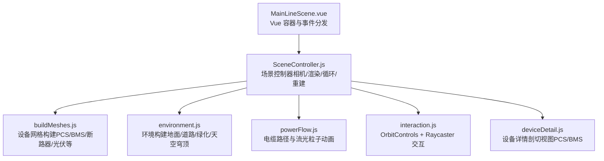
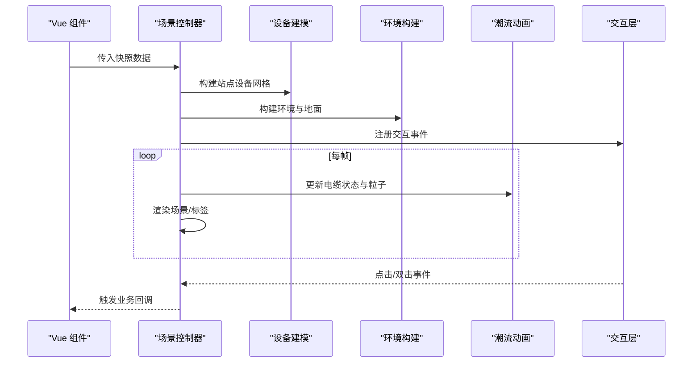
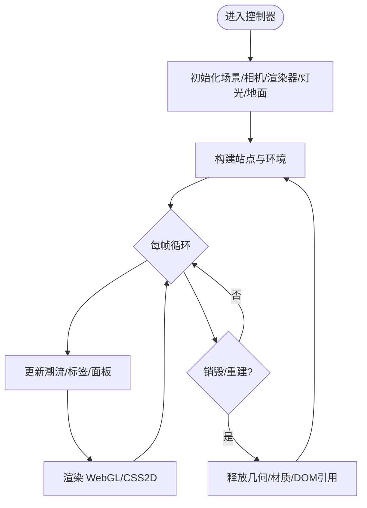
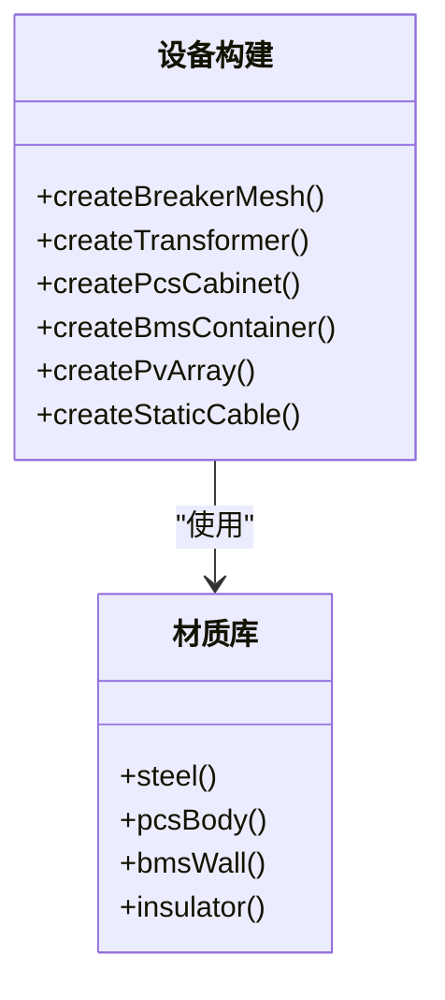
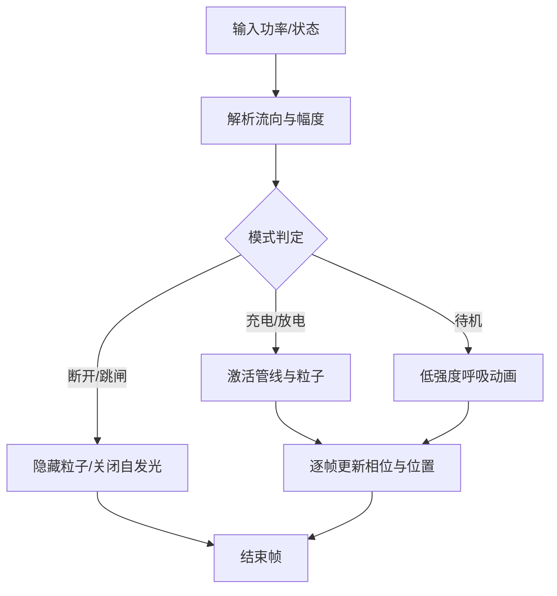
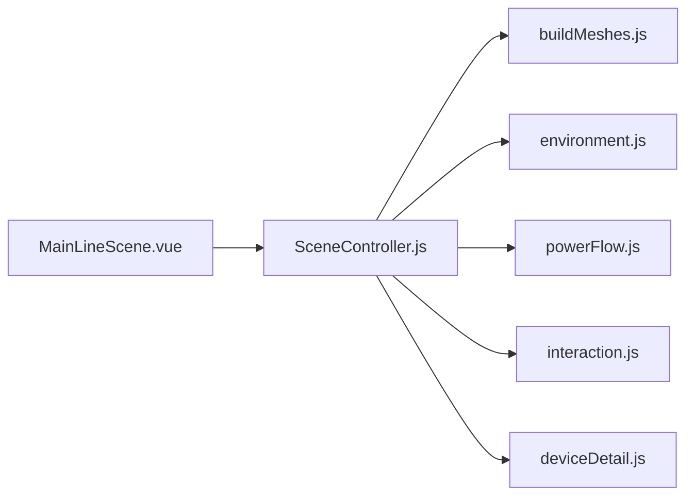

# 性能优化

<cite>
**本文引用的文件**
- [SceneController.js](file://Web/src/components/mainline3d/SceneController.js)
- [buildMeshes.js](file://Web/src/components/mainline3d/buildMeshes.js)
- [powerFlow.js](file://Web/src/components/mainline3d/powerFlow.js)
- [environment.js](file://Web/src/components/mainline3d/environment.js)
- [interaction.js](file://Web/src/components/mainline3d/interaction.js)
- [deviceDetail.js](file://Web/src/components/mainline3d/deviceDetail.js)
- [MainLineScene.vue](file://Web/src/components/MainLineScene.vue)
</cite>

## 目录
1. [简介](#简介)
2. [项目结构](#项目结构)
3. [核心组件](#核心组件)
4. [架构总览](#架构总览)
5. [详细组件分析](#详细组件分析)
6. [依赖关系分析](#依赖关系分析)
7. [性能考量](#性能考量)
8. [故障排查指南](#故障排查指南)
9. [结论](#结论)
10. [附录](#附录)

## 简介
本文件面向 Three.js 驱动的 3D 主接线场景，系统性梳理渲染与内存优化实践，覆盖几何体合并、纹理生成与复用、着色器/材质优化、对象生命周期管理、帧率与交互优化、移动端适配策略，以及常见性能问题的诊断与解决方案。内容基于仓库中 Web 前端 3D 模块的实际实现进行总结与提炼。

## 项目结构
3D 场景由 Vue 组件承载，核心控制器负责场景初始化、构建、更新与销毁；设备模型与环境由独立模块构建；交互与动画由专用模块处理。整体职责清晰、耦合度低，便于针对性优化。

图表来源
- [MainLineScene.vue:59-250](file://Web/src/components/MainLineScene.vue#L59-L250)
- [SceneController.js:55-142](file://Web/src/components/mainline3d/SceneController.js#L55-L142)
- [buildMeshes.js:1-800](file://Web/src/components/mainline3d/buildMeshes.js#L1-L800)
- [environment.js:1-439](file://Web/src/components/mainline3d/environment.js#L1-L439)
- [powerFlow.js:1-314](file://Web/src/components/mainline3d/powerFlow.js#L1-L314)
- [interaction.js:1-120](file://Web/src/components/mainline3d/interaction.js#L1-L120)
- [deviceDetail.js:1-819](file://Web/src/components/mainline3d/deviceDetail.js#L1-L819)

章节来源
- [MainLineScene.vue:59-250](file://Web/src/components/MainLineScene.vue#L59-L250)
- [SceneController.js:55-142](file://Web/src/components/mainline3d/SceneController.js#L55-L142)

## 核心组件
- 场景控制器：封装 Three.js 场景、相机、渲染器、灯光、雾效、标签与面板挂载、视口自适应、重建与销毁、BMS 详情轮询与状态同步。
- 设备建模：提供 PCS、BMS、断路器、变压器、直流母线、交流母线、光伏方阵与组串出线等可复用模型构建函数。
- 环境构建：程序化生成水泥/沥青路面、绿化、路灯、围栏、天空穹顶与地平线雾环，按布局动态缩放。
- 潮流可视化：正交刚体路径的电缆管线与粒子流光，支持充/放/待机/跳闸多种状态。
- 交互系统：基于 OrbitControls 的旋转/缩放/平移，Raycaster 拾取断路器与设备面板，双击进入设备详情。
- 设备详情：PCS/BMS 剖切视图，簇级高亮与选中、温度标记、SOC 着色、实时数据驱动。

章节来源
- [SceneController.js:55-142](file://Web/src/components/mainline3d/SceneController.js#L55-L142)
- [buildMeshes.js:121-758](file://Web/src/components/mainline3d/buildMeshes.js#L121-L758)
- [environment.js:222-439](file://Web/src/components/mainline3d/environment.js#L222-L439)
- [powerFlow.js:118-314](file://Web/src/components/mainline3d/powerFlow.js#L118-L314)
- [interaction.js:9-120](file://Web/src/components/mainline3d/interaction.js#L9-L120)
- [deviceDetail.js:101-794](file://Web/src/components/mainline3d/deviceDetail.js#L101-L794)

## 架构总览
Three.js 渲染管线与业务数据流如下：Vue 组件将快照数据传入控制器，控制器根据布局构建站点与环境，叠加设备详情与标签面板；每帧通过 requestAnimationFrame 驱动动画与状态更新；交互层通过射线拾取触发业务事件。

图表来源
- [MainLineScene.vue:223-250](file://Web/src/components/MainLineScene.vue#L223-L250)
- [SceneController.js:137-142](file://Web/src/components/mainline3d/SceneController.js#L137-L142)
- [SceneController.js:296-319](file://Web/src/components/mainline3d/SceneController.js#L296-L319)
- [powerFlow.js:206-314](file://Web/src/components/mainline3d/powerFlow.js#L206-L314)
- [interaction.js:41-105](file://Web/src/components/mainline3d/interaction.js#L41-L105)

## 详细组件分析

### 场景控制器（SceneController）
- 渲染设置：开启抗锯齿、像素比限制、阴影贴图、色调映射与输出色彩空间，保证视觉质量与性能平衡。
- 视口与雾效：根据站点包围盒自适应地面尺寸与雾效范围，避免远端过度绘制与闪烁。
- 资源管理：在重建/退出详情时遍历释放几何体与材质，清理 CSS2DObject DOM 引用，防止内存泄漏。
- 数据驱动：根据快照键值判断是否重建或仅同步状态，减少不必要的场景重建开销。
- 详情模式：切换至设备详情时调整相机距离与雾效，降低复杂场景下的渲染压力。

图表来源
- [SceneController.js:84-142](file://Web/src/components/mainline3d/SceneController.js#L84-L142)
- [SceneController.js:217-264](file://Web/src/components/mainline3d/SceneController.js#L217-L264)
- [SceneController.js:296-360](file://Web/src/components/mainline3d/SceneController.js#L296-L360)

章节来源
- [SceneController.js:84-142](file://Web/src/components/mainline3d/SceneController.js#L84-L142)
- [SceneController.js:217-264](file://Web/src/components/mainline3d/SceneController.js#L217-L264)
- [SceneController.js:296-360](file://Web/src/components/mainline3d/SceneController.js#L296-L360)

### 设备建模（buildMeshes）
- 材质库：集中定义常用材质工厂，统一金属度/粗糙度/发光强度，便于批量调优。
- 几何复用：大量使用 BoxGeometry/CylinderGeometry 组合，控制分段数与阴影开关，减少过细分段带来的 GPU 压力。
- 实例化渲染：光伏方阵采用 InstancedMesh 批量绘制组件，显著降低 draw call 数量。
- 走线优化：设备间电缆采用正交刚体路径，避免 TubeGeometry 尖角扭曲；静态直流电缆使用轴对齐圆柱段，关闭阴影以减少深度测试开销。
- 可视反馈：断路器状态通过材质颜色与自发光强度切换，直观且低成本。

图表来源
- [buildMeshes.js:10-46](file://Web/src/components/mainline3d/buildMeshes.js#L10-L46)
- [buildMeshes.js:121-758](file://Web/src/components/mainline3d/buildMeshes.js#L121-L758)

章节来源
- [buildMeshes.js:10-46](file://Web/src/components/mainline3d/buildMeshes.js#L10-L46)
- [buildMeshes.js:121-758](file://Web/src/components/mainline3d/buildMeshes.js#L121-L758)

### 环境构建（environment）
- 程序化纹理：Canvas 生成混凝土漫反射与粗糙度贴图，按需重复平铺，避免外部资源加载与显存占用。
- 场景层次：地面、道路、绿化带、路灯、围栏、天空穹顶与地平线雾环分层构建，合理设置接收/投射阴影与透明度。
- 动态适配：根据布局边界计算宽度与纵深，自动调整地面尺寸与雾效范围，保持视觉一致性并减少远端绘制。

章节来源
- [environment.js:3-99](file://Web/src/components/mainline3d/environment.js#L3-L99)
- [environment.js:222-439](file://Web/src/components/mainline3d/environment.js#L222-L439)

### 潮流动画（powerFlow）
- 路径构建：正交折线经圆角软化形成刚体曲线，避免 CatmullRom 导致的下陷与斜切问题。
- 管线与粒子：TubeGeometry 作为基础管线，Points 粒子与拖尾实现能量流动效果；根据功率大小调节速度、尺寸与自发光强度。
- 状态机：OFF/IDLE/CHARGE/DISCHARGE/TRIP 多态切换，控制可见性与动画参数，确保不同工况下的视觉一致性与性能可控。

图表来源
- [powerFlow.js:22-43](file://Web/src/components/mainline3d/powerFlow.js#L22-L43)
- [powerFlow.js:118-200](file://Web/src/components/mainline3d/powerFlow.js#L118-L200)
- [powerFlow.js:206-314](file://Web/src/components/mainline3d/powerFlow.js#L206-L314)

章节来源
- [powerFlow.js:22-43](file://Web/src/components/mainline3d/powerFlow.js#L22-L43)
- [powerFlow.js:118-200](file://Web/src/components/mainline3d/powerFlow.js#L118-L200)
- [powerFlow.js:206-314](file://Web/src/components/mainline3d/powerFlow.js#L206-L314)

### 交互系统（interaction）
- 操作控制：OrbitControls 启用阻尼、极角限制与屏幕空间平移，提升操控体验。
- 拾取逻辑：指针按下/抬起记录位移阈值，避免误触；优先拾取断路器，其次设备面板；双击进入设备详情并抑制后续单击。
- 事件派发：将点击结果转换为业务回调，解耦 UI 与场景逻辑。

章节来源
- [interaction.js:9-120](file://Web/src/components/mainline3d/interaction.js#L9-L120)

### 设备详情（deviceDetail）
- PCS 详情：柜体剖切、内部模块、母排与状态灯，依据运行状态与功率幅值调整发光强度与色带。
- BMS 详情：簇架与电芯矩阵，使用 InstancedMesh 高效绘制；支持簇悬停高亮、选中前移、最高/最低温单体标记；SOC 着色与透明层级控制。
- 资源释放：提供 disposeDeviceDetail 方法，遍历释放几何体与材质，避免详情切换时的内存泄漏。

章节来源
- [deviceDetail.js:101-273](file://Web/src/components/mainline3d/deviceDetail.js#L101-L273)
- [deviceDetail.js:300-794](file://Web/src/components/mainline3d/deviceDetail.js#L300-L794)
- [deviceDetail.js:796-819](file://Web/src/components/mainline3d/deviceDetail.js#L796-L819)

## 依赖关系分析
- MainLineScene.vue 作为入口，创建 SceneController 并监听窗口事件与全屏切换。
- SceneController 依赖 buildMeshes、environment、powerFlow、interaction、deviceDetail 完成场景构建与更新。
- powerFlow 与 deviceDetail 均依赖 Three.js 基础类型与材质/几何体，但彼此无直接耦合。
- interaction 仅依赖 Three.js 与 OrbitControls，通过回调与控制器通信。

图表来源
- [MainLineScene.vue:59-250](file://Web/src/components/MainLineScene.vue#L59-L250)
- [SceneController.js:55-142](file://Web/src/components/mainline3d/SceneController.js#L55-L142)

章节来源
- [MainLineScene.vue:59-250](file://Web/src/components/MainLineScene.vue#L59-L250)
- [SceneController.js:55-142](file://Web/src/components/mainline3d/SceneController.js#L55-L142)

## 性能考量
- 几何体合并与实例化
  - 光伏方阵与 BMS 电芯矩阵采用 InstancedMesh 批量绘制，显著降低 draw call 与 CPU/GPU 开销。
  - 设备间电缆采用轴对齐圆柱段与 LineSegments，避免复杂曲面与过多细分。
- 纹理压缩与生成
  - 环境纹理通过 Canvas 程序化生成并重复平铺，减少外部资源加载与显存占用；必要时可替换为压缩纹理格式以提升加载与采样效率。
- 着色器与材质优化
  - 统一材质工厂，控制金属度/粗糙度/自发光强度；对贴地管线关闭阴影与深度写入，减少光栅化与深度测试成本。
  - 使用 ACES Filmic 色调映射与 sRGB 输出，兼顾视觉与性能。
- 内存管理与对象池
  - 场景重建与详情切换时，遍历释放几何体与材质，清理 CSS2DObject DOM 引用，避免内存泄漏。
  - 建议引入对象池复用频繁创建的 BufferGeometry/Texture，减少 GC 抖动（当前实现以释放为主）。
- 帧率优化
  - 像素比限制为 min(devicePixelRatio, 2)，在高 DPI 设备上平衡清晰度与性能。
  - 根据站点包围盒自适应雾效与地面尺寸，减少远端绘制；详情模式下调整相机距离与雾效范围，降低复杂度。
  - 潮流动画仅在活跃状态下启用粒子与拖尾，待机模式使用低强度呼吸动画。
- 移动端适配
  - 限制像素比与阴影质量；减少光源数量与阴影计算；使用更低的管线细分与粒子数量；禁用不必要的后处理。
  - 触控交互已启用，建议进一步简化 UI 与标签密度，提升滑动与缩放流畅度。
- 异步加载
  - 当前环境纹理为程序化生成，无需网络请求；若引入外部模型/纹理，建议分片加载与懒加载，结合进度提示与降级方案。

[本节为通用性能指导，不直接分析具体文件]

## 故障排查指南
- 卡顿
  - 检查每帧 draw call 与三角形数量，优先使用 InstancedMesh 合并同类几何体。
  - 降低像素比与阴影贴图分辨率；关闭非关键对象的阴影与深度写入。
  - 精简粒子数量与拖尾长度，仅在活跃状态启用。
- 内存溢出
  - 确认场景重建与详情切换时是否正确释放几何体与材质；检查 CSS2DObject 的 DOM 引用是否移除。
  - 避免在高频回调中创建新对象；复用 BufferGeometry/Texture 或使用对象池。
- 兼容性问题
  - 在不同浏览器与设备上验证 WebGL 能力；必要时降级到无阴影或更低画质。
  - 全屏切换与触摸事件需做兼容性处理，确保 resize 与渲染器尺寸同步。

章节来源
- [SceneController.js:321-360](file://Web/src/components/mainline3d/SceneController.js#L321-L360)
- [deviceDetail.js:796-819](file://Web/src/components/mainline3d/deviceDetail.js#L796-L819)
- [MainLineScene.vue:193-250](file://Web/src/components/MainLineScene.vue#L193-L250)

## 结论
该 3D 场景在几何合并、实例化渲染、程序化纹理、材质统一与资源释放方面具备良好基础。通过进一步优化像素比、阴影与粒子数量，引入对象池与异步加载策略，可在移动端与低端设备上获得更稳定的帧率与更低的内存占用。建议在大规模部署前进行性能基准测试与回归验证，确保用户体验与稳定性。

[本节为总结性内容，不直接分析具体文件]

## 附录
- 关键优化点清单
  - 使用 InstancedMesh 批量绘制光伏组件与电芯矩阵。
  - 程序化生成环境纹理并重复平铺，减少外部资源。
  - 限制像素比与阴影质量，关闭非关键对象阴影。
  - 在场景重建与详情切换时彻底释放几何体与材质。
  - 潮流动画仅在活跃状态启用粒子与拖尾。
  - 根据站点包围盒自适应雾效与地面尺寸。
  - 移动端适配：降低画质、简化 UI、禁用不必要后处理。
  - 异步加载：分片与懒加载外部资源，提供降级方案。

[本节为补充信息，不直接分析具体文件]