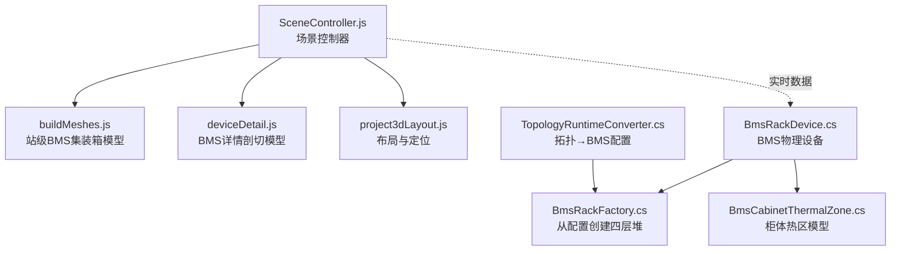
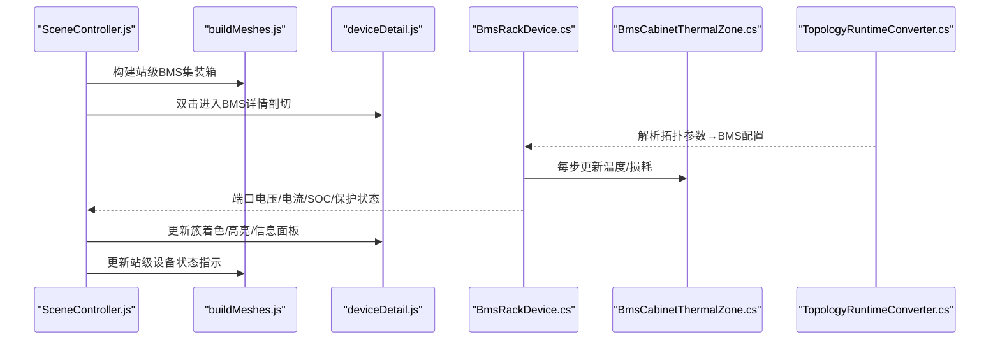
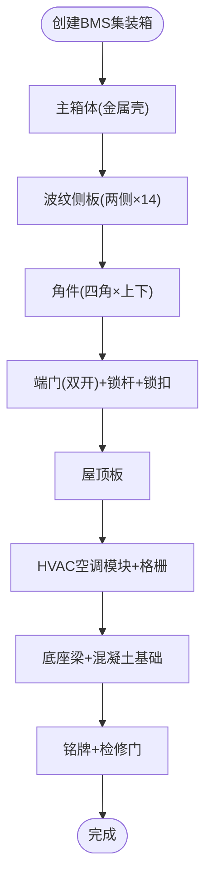
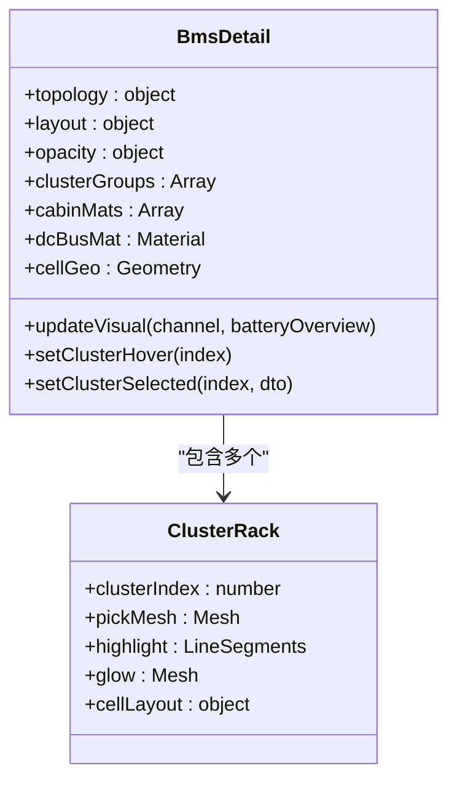
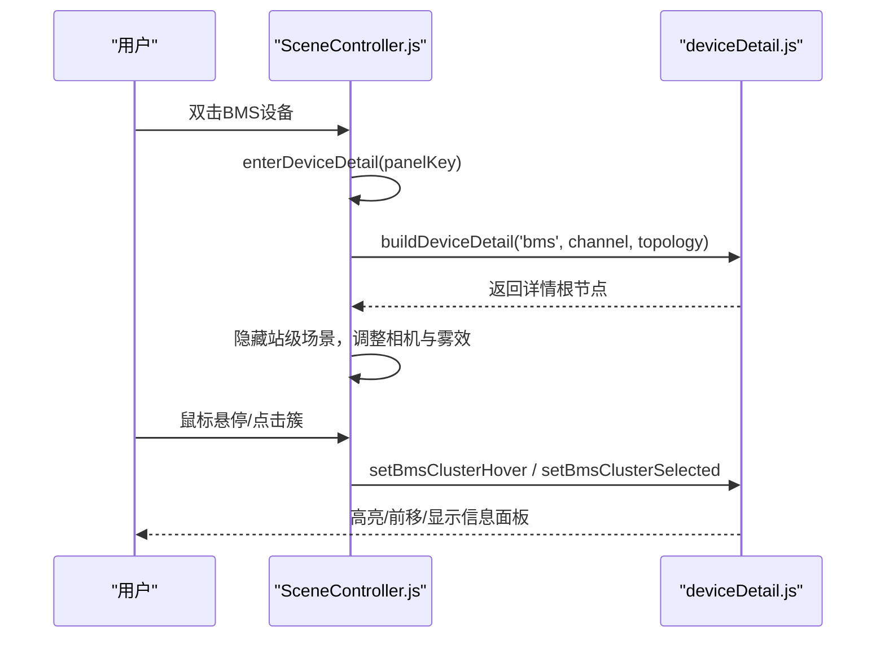
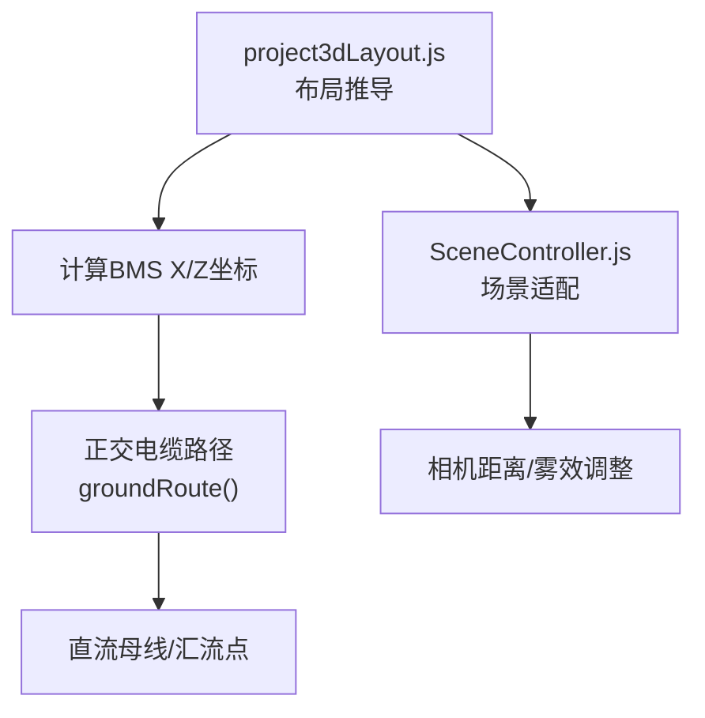
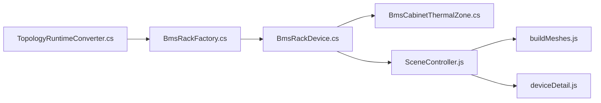

# BMS设备模型

<cite>
**本文引用的文件**
- [buildMeshes.js](file://Web/src/components/mainline3d/buildMeshes.js)
- [deviceDetail.js](file://Web/src/components/mainline3d/deviceDetail.js)
- [SceneController.js](file://Web/src/components/mainline3d/SceneController.js)
- [project3dLayout.js](file://Web/src/components/mainline3d/project3dLayout.js)
- [BmsRackDevice.cs](file://EssDeviceSimModel/Devices/BmsRackDevice.cs)
- [BmsRackFactory.cs](file://EssDeviceSimModel/Battery/BmsRackFactory.cs)
- [BmsCabinetThermalZone.cs](file://EssDeviceSimModel/Thermal/BmsCabinetThermalZone.cs)
- [TopologyRuntimeConverter.cs](file://Web/Topology/TopologyRuntimeConverter.cs)
</cite>

## 目录
1. [简介](#简介)
2. [项目结构](#项目结构)
3. [核心组件](#核心组件)
4. [架构总览](#架构总览)
5. [详细组件分析](#详细组件分析)
6. [依赖关系分析](#依赖关系分析)
7. [性能考虑](#性能考虑)
8. [故障排查指南](#故障排查指南)
9. [结论](#结论)
10. [附录](#附录)

## 简介
本文件面向BMS（电池管理系统）设备的3D可视化与仿真集成，系统性说明：
- BMS集装箱的几何建模：ISO标准箱体、波纹侧板、角件、端门与锁杆、屋顶与HVAC空调。
- 材质配置系统：金属外壳、玻璃窗、状态指示灯、HVAC等视觉效果。
- 交互功能：开门动画、内部结构查看、设备参数显示面板、簇级悬停与选中。
- 场景定位、设备连接关系表示与状态可视化。
- 定制化与扩展方法：通过拓扑与配置快速生成不同规格与配置的BMS设备。

## 项目结构
BMS设备在系统中的呈现由前端3D渲染与后端物理模型共同构成：
- 前端3D模型构建与交互位于 Web/src/components/mainline3d 下的 buildMeshes.js、deviceDetail.js、SceneController.js、project3dLayout.js。
- 后端BMS物理模型、热系统与保护逻辑位于 EssDeviceSimModel 与 EssSimModelApi 相关文件中。
- 拓扑与运行时配置将组态参数映射为BMS设备规格，驱动前后端一致展示。

**图表来源**
- [SceneController.js:116-141](file://Web/src/components/mainline3d/SceneController.js#L116-L141)
- [buildMeshes.js:400-477](file://Web/src/components/mainline3d/buildMeshes.js#L400-L477)
- [deviceDetail.js:300-598](file://Web/src/components/mainline3d/deviceDetail.js#L300-L598)
- [project3dLayout.js:157-200](file://Web/src/components/mainline3d/project3dLayout.js#L157-L200)
- [BmsRackDevice.cs:21-93](file://EssDeviceSimModel/Devices/BmsRackDevice.cs#L21-L93)
- [BmsRackFactory.cs:6-32](file://EssDeviceSimModel/Battery/BmsRackFactory.cs#L6-L32)
- [BmsCabinetThermalZone.cs:1-30](file://EssDeviceSimModel/Thermal/BmsCabinetThermalZone.cs#L1-L30)
- [TopologyRuntimeConverter.cs:237-253](file://Web/Topology/TopologyRuntimeConverter.cs#L237-L253)

**章节来源**
- [SceneController.js:116-141](file://Web/src/components/mainline3d/SceneController.js#L116-L141)
- [buildMeshes.js:400-477](file://Web/src/components/mainline3d/buildMeshes.js#L400-L477)
- [deviceDetail.js:300-598](file://Web/src/components/mainline3d/deviceDetail.js#L300-L598)
- [project3dLayout.js:157-200](file://Web/src/components/mainline3d/project3dLayout.js#L157-L200)
- [BmsRackDevice.cs:21-93](file://EssDeviceSimModel/Devices/BmsRackDevice.cs#L21-L93)
- [BmsRackFactory.cs:6-32](file://EssDeviceSimModel/Battery/BmsRackFactory.cs#L6-L32)
- [BmsCabinetThermalZone.cs:1-30](file://EssDeviceSimModel/Thermal/BmsCabinetThermalZone.cs#L1-L30)
- [TopologyRuntimeConverter.cs:237-253](file://Web/Topology/TopologyRuntimeConverter.cs#L237-L253)

## 核心组件
- BMS集装箱外观模型：ISO箱体、波纹侧板、角件、双开端门+锁杆、屋顶与HVAC、底座梁、铭牌与检修门。
- BMS详情剖切模型：透明舱体、簇架、Pack托盘、电芯实例化网格、DC母线、高低温单体标记、簇信息面板。
- 场景控制器：站级与设备详情模式切换、相机控制、标签与面板挂载、BMS详情交互（悬停/点击）。
- 后端BMS设备：物理仿真、端口同步、保护评估、温度感知、损耗估算。
- 热系统：柜体热区网络（室外-外壳-空气-电池），空调抽热与电池节点温度耦合。
- 拓扑到配置：将拓扑节点参数转换为BMS设备规格（簇数、包数、串并联、初始SOC等）。

**章节来源**
- [buildMeshes.js:400-477](file://Web/src/components/mainline3d/buildMeshes.js#L400-L477)
- [deviceDetail.js:300-598](file://Web/src/components/mainline3d/deviceDetail.js#L300-L598)
- [SceneController.js:481-546](file://Web/src/components/mainline3d/SceneController.js#L481-L546)
- [BmsRackDevice.cs:21-93](file://EssDeviceSimModel/Devices/BmsRackDevice.cs#L21-L93)
- [BmsCabinetThermalZone.cs:1-30](file://EssDeviceSimModel/Thermal/BmsCabinetThermalZone.cs#L1-L30)
- [TopologyRuntimeConverter.cs:237-253](file://Web/Topology/TopologyRuntimeConverter.cs#L237-L253)

## 架构总览
BMS设备在3D场景中由“站级外观”和“设备详情剖切”两部分组成，并通过实时数据驱动状态可视化。后端物理模型提供端口电压/电流、SOC、温度、保护状态等，前端据此更新材质发光强度、颜色与UI面板。

**图表来源**
- [SceneController.js:631-684](file://Web/src/components/mainline3d/SceneController.js#L631-L684)
- [buildMeshes.js:400-477](file://Web/src/components/mainline3d/buildMeshes.js#L400-L477)
- [deviceDetail.js:740-783](file://Web/src/components/mainline3d/deviceDetail.js#L740-L783)
- [BmsRackDevice.cs:84-93](file://EssDeviceSimModel/Devices/BmsRackDevice.cs#L84-L93)
- [BmsCabinetThermalZone.cs:1-30](file://EssDeviceSimModel/Thermal/BmsCabinetThermalZone.cs#L1-L30)
- [TopologyRuntimeConverter.cs:237-253](file://Web/Topology/TopologyRuntimeConverter.cs#L237-L253)

## 详细组件分析

### BMS集装箱几何结构与材质
- ISO标准箱体：长宽高尺寸定义，主壳体使用金属质感材质。
- 波纹侧板：两侧各14条肋条，模拟真实集装箱波纹外观。
- 角件：四角上下共8个角件，深色钢材质。
- 端门与锁杆：双开门加垂直锁杆与锁扣，门材质与壳体区分。
- 屋顶与HVAC：屋顶板与顶部空调模块，空调出风格栅分层。
- 底座梁与铭牌：混凝土底座与三根钢梁，侧面铭牌与检修门。
- 材质库：统一通过MAT工厂函数创建Metalness/Roughness/透明度等属性，支持玻璃窗、LED指示灯等。

**图表来源**
- [buildMeshes.js:400-477](file://Web/src/components/mainline3d/buildMeshes.js#L400-L477)

**章节来源**
- [buildMeshes.js:10-46](file://Web/src/components/mainline3d/buildMeshes.js#L10-L46)
- [buildMeshes.js:400-477](file://Web/src/components/mainline3d/buildMeshes.js#L400-L477)

### BMS详情剖切与内部结构可视化
- 透明舱体：仅保留后墙与顶板，避免透视重影；实心底板确保视觉稳定。
- 簇架与托盘：按拓扑clusterCount/packCount构建多簇多包结构，托盘边框与框架材质区分。
- 电芯实例化：使用InstancedMesh高效绘制大量电芯，按串并联布局排列。
- DC母线：后上方直流母线，发光强度随电流变化。
- 高低温单体标记：选中簇时标注最高温/最低温单体位置与温度值。
- 簇信息面板：悬浮CSS2DObject显示电压、电流、功率、SOC、SOH、均温及极值温度。

**图表来源**
- [deviceDetail.js:300-598](file://Web/src/components/mainline3d/deviceDetail.js#L300-L598)
- [deviceDetail.js:600-738](file://Web/src/components/mainline3d/deviceDetail.js#L600-L738)

**章节来源**
- [deviceDetail.js:300-598](file://Web/src/components/mainline3d/deviceDetail.js#L300-L598)
- [deviceDetail.js:600-738](file://Web/src/components/mainline3d/deviceDetail.js#L600-L738)

### 交互功能：开门动画、内部查看与参数面板
- 开门动画：PCS柜门打开用于详情剖切；BMS详情中舱体采用半透明以直接观察内部结构。
- 内部结构查看：簇级悬停高亮、选中前移并显示高低温单体标记。
- 参数面板：设备面板通过CSS2DObject挂载，显示实时运行参数与控制命令入口。
- 场景模式切换：双击设备进入详情模式，退出时恢复站级视图与相机。

**图表来源**
- [SceneController.js:631-684](file://Web/src/components/mainline3d/SceneController.js#L631-L684)
- [SceneController.js:481-546](file://Web/src/components/mainline3d/SceneController.js#L481-L546)
- [deviceDetail.js:600-738](file://Web/src/components/mainline3d/deviceDetail.js#L600-L738)

**章节来源**
- [SceneController.js:631-684](file://Web/src/components/mainline3d/SceneController.js#L631-L684)
- [SceneController.js:481-546](file://Web/src/components/mainline3d/SceneController.js#L481-L546)
- [deviceDetail.js:600-738](file://Web/src/components/mainline3d/deviceDetail.js#L600-L738)

### 场景定位算法与设备连接关系
- 布局推导：基于单线图像素坐标与比例因子PX转换为3D米制坐标，沿母线均匀排布设备。
- BMS定位：根据EMU单元内BMS节点数量与槽位计算X/Z坐标，保证与PCS/断路器/母线的相对位置正确。
- 连接表示：站级电缆采用正交走线（先南北后东西再竖直），避免斜向连线；直流母线用圆柱体表示。
- 动态适配：根据场景跨度调整地面大小、雾效范围与相机远裁剪面，确保设备不落在画布外。

**图表来源**
- [project3dLayout.js:157-200](file://Web/src/components/mainline3d/project3dLayout.js#L157-L200)
- [buildMeshes.js:764-787](file://Web/src/components/mainline3d/buildMeshes.js#L764-L787)
- [SceneController.js:241-264](file://Web/src/components/mainline3d/SceneController.js#L241-L264)

**章节来源**
- [project3dLayout.js:157-200](file://Web/src/components/mainline3d/project3dLayout.js#L157-L200)
- [buildMeshes.js:764-787](file://Web/src/components/mainline3d/buildMeshes.js#L764-L787)
- [SceneController.js:241-264](file://Web/src/components/mainline3d/SceneController.js#L241-L264)

### 状态可视化效果
- SOC着色：簇级电芯材质颜色与发光强度随SOC变化，低SOC偏红，高SOC偏绿。
- 电流发光：DC母线发光强度与绝对电流成正比，直观反映功率流动。
- 运行模式：PCS/设备状态灯根据运行/待机/充放电切换颜色与亮度。
- 保护告警：BMS保护评估结果回写设备故障态，影响端口输出与界面提示。

**章节来源**
- [deviceDetail.js:740-783](file://Web/src/components/mainline3d/deviceDetail.js#L740-L783)
- [buildMeshes.js:187-220](file://Web/src/components/mainline3d/buildMeshes.js#L187-L220)
- [BmsRackDevice.cs:116-131](file://EssDeviceSimModel/Devices/BmsRackDevice.cs#L116-L131)

### 定制化与扩展方法
- 拓扑参数驱动：通过TopologyRuntimeConverter将拓扑节点参数（clusterCount、packCount、cellSeriesCount、cellParallelCount等）转换为BMS设备配置。
- 配置中心：appsettings中的BMS配置项决定簇/包/串并联、额定电压/容量、初始SOC、内阻等。
- 快速生成：修改拓扑或配置文件即可生成不同规格的BMS设备，无需改动3D模型代码。
- 扩展点：新增设备类型可在buildMeshes.js中添加createXxx函数，并在project3dLayout.js中注册模板映射。

**章节来源**
- [TopologyRuntimeConverter.cs:237-253](file://Web/Topology/TopologyRuntimeConverter.cs#L237-L253)
- [BmsRackFactory.cs:6-32](file://EssDeviceSimModel/Battery/BmsRackFactory.cs#L6-L32)
- [project3dLayout.js:30-41](file://Web/src/components/mainline3d/project3dLayout.js#L30-L41)

## 依赖关系分析
- 前端依赖：SceneController依赖buildMeshes与deviceDetail进行模型构建与详情展示；project3dLayout提供布局与定位。
- 后端依赖：BmsRackDevice依赖BatteryRackSimulator与热系统，提供物理仿真与保护评估；BmsRackFactory从配置创建物理模型。
- 数据流：拓扑→配置→物理模型→端口/状态→前端可视化更新。

**图表来源**
- [TopologyRuntimeConverter.cs:237-253](file://Web/Topology/TopologyRuntimeConverter.cs#L237-L253)
- [BmsRackFactory.cs:6-32](file://EssDeviceSimModel/Battery/BmsRackFactory.cs#L6-L32)
- [BmsRackDevice.cs:21-93](file://EssDeviceSimModel/Devices/BmsRackDevice.cs#L21-L93)
- [BmsCabinetThermalZone.cs:1-30](file://EssDeviceSimModel/Thermal/BmsCabinetThermalZone.cs#L1-L30)
- [SceneController.js:116-141](file://Web/src/components/mainline3d/SceneController.js#L116-L141)
- [buildMeshes.js:400-477](file://Web/src/components/mainline3d/buildMeshes.js#L400-L477)
- [deviceDetail.js:300-598](file://Web/src/components/mainline3d/deviceDetail.js#L300-L598)

**章节来源**
- [TopologyRuntimeConverter.cs:237-253](file://Web/Topology/TopologyRuntimeConverter.cs#L237-L253)
- [BmsRackFactory.cs:6-32](file://EssDeviceSimModel/Battery/BmsRackFactory.cs#L6-L32)
- [BmsRackDevice.cs:21-93](file://EssDeviceSimModel/Devices/BmsRackDevice.cs#L21-L93)
- [BmsCabinetThermalZone.cs:1-30](file://EssDeviceSimModel/Thermal/BmsCabinetThermalZone.cs#L1-L30)
- [SceneController.js:116-141](file://Web/src/components/mainline3d/SceneController.js#L116-L141)
- [buildMeshes.js:400-477](file://Web/src/components/mainline3d/buildMeshes.js#L400-L477)
- [deviceDetail.js:300-598](file://Web/src/components/mainline3d/deviceDetail.js#L300-L598)

## 性能考虑
- 实例化网格：使用InstancedMesh绘制大量电芯，减少Draw Call与内存占用。
- 阴影优化：合理设置castShadow/receiveShadow，避免过多阴影计算导致卡顿。
- 雾效与裁剪：根据场景跨度调整雾效范围与相机far，提升渲染效率。
- 实时更新节流：电池概览数据每2秒轮询一次，避免频繁DOM与材质更新。

[本节为通用性能建议，不直接分析具体文件]

## 故障排查指南
- 详情模式无法进入：检查panelKey解析是否正确（格式应为bms-unitSide），确认detailRoot未为空。
- 簇悬停无响应：确认clusterGroups存在且pickMesh已正确标记，Raycaster目标集合包含pickMesh。
- 状态不刷新：检查_updateDeviceDetailVisual调用是否被触发，确认channel与batteryOverview数据有效。
- 热系统异常：验证BmsCabinetThermalZone初始化参数与实际负载匹配，确认空调冷却逻辑生效。

**章节来源**
- [SceneController.js:459-470](file://Web/src/components/mainline3d/SceneController.js#L459-L470)
- [SceneController.js:481-546](file://Web/src/components/mainline3d/SceneController.js#L481-L546)
- [deviceDetail.js:740-783](file://Web/src/components/mainline3d/deviceDetail.js#L740-L783)
- [BmsCabinetThermalZone.cs:1-30](file://EssDeviceSimModel/Thermal/BmsCabinetThermalZone.cs#L1-L30)

## 结论
本BMS设备模型通过前端3D构建与后端物理仿真紧密结合，实现了高保真外观、可交互详情视图与实时状态可视化。依托拓扑与配置驱动的定制化能力，系统可快速生成不同规格与配置的BMS设备，满足储能电站数字孪生的多样化需求。

[本节为总结性内容，不直接分析具体文件]

## 附录
- 关键API路径参考：
  - 站级BMS集装箱构建：[buildMeshes.js:400-477](file://Web/src/components/mainline3d/buildMeshes.js#L400-L477)
  - BMS详情剖切构建：[deviceDetail.js:300-598](file://Web/src/components/mainline3d/deviceDetail.js#L300-L598)
  - 场景控制器交互：[SceneController.js:481-546](file://Web/src/components/mainline3d/SceneController.js#L481-L546)
  - 布局与定位：[project3dLayout.js:157-200](file://Web/src/components/mainline3d/project3dLayout.js#L157-L200)
  - BMS物理设备：[BmsRackDevice.cs:21-93](file://EssDeviceSimModel/Devices/BmsRackDevice.cs#L21-L93)
  - 热系统模型：[BmsCabinetThermalZone.cs:1-30](file://EssDeviceSimModel/Thermal/BmsCabinetThermalZone.cs#L1-L30)
  - 拓扑到配置：[TopologyRuntimeConverter.cs:237-253](file://Web/Topology/TopologyRuntimeConverter.cs#L237-L253)

[本节为附录引用，不直接分析具体文件]