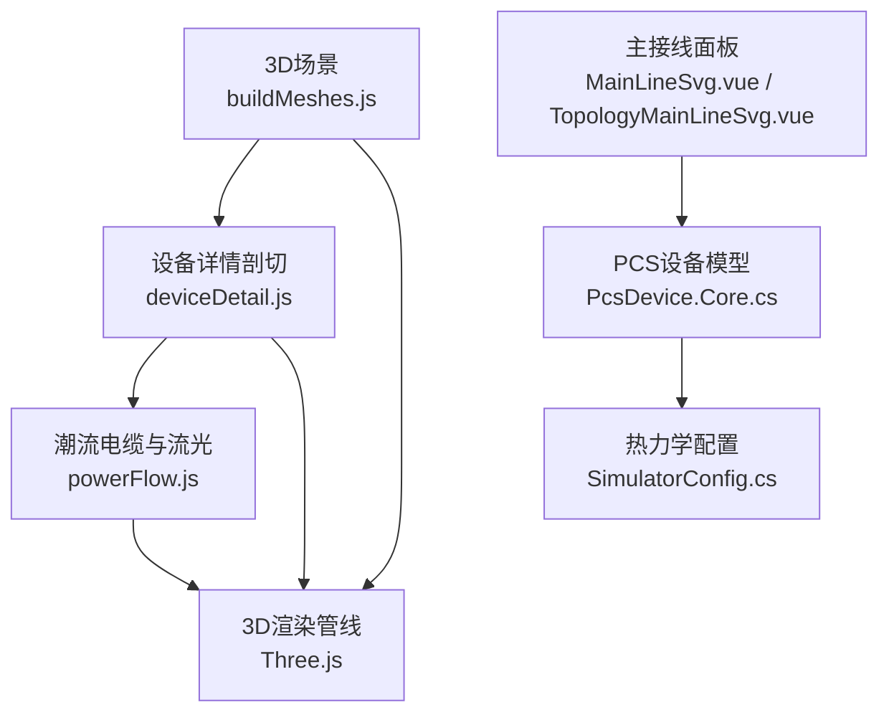
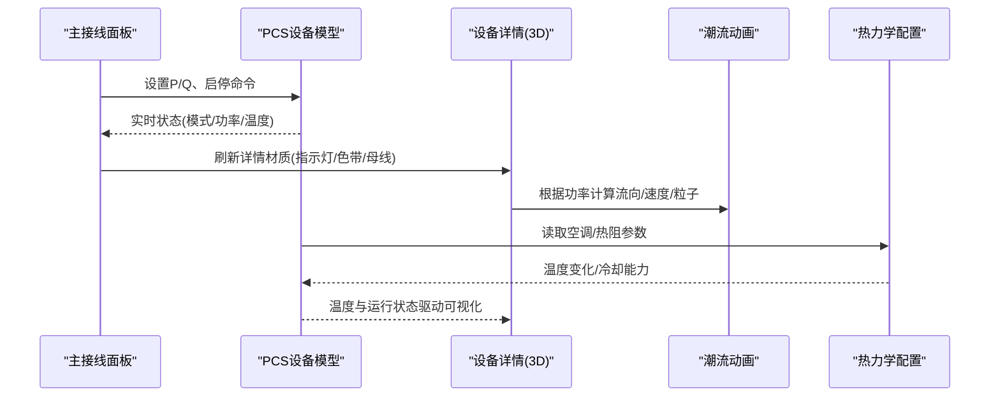
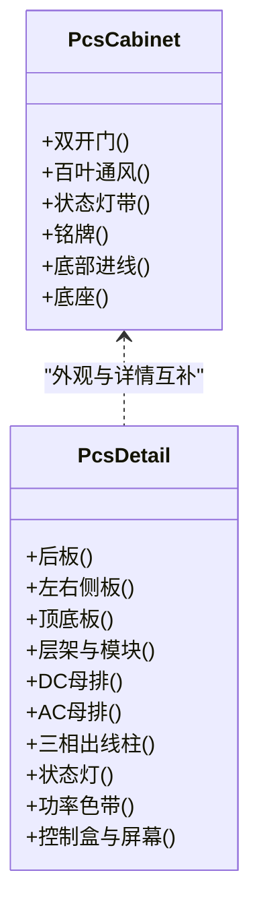
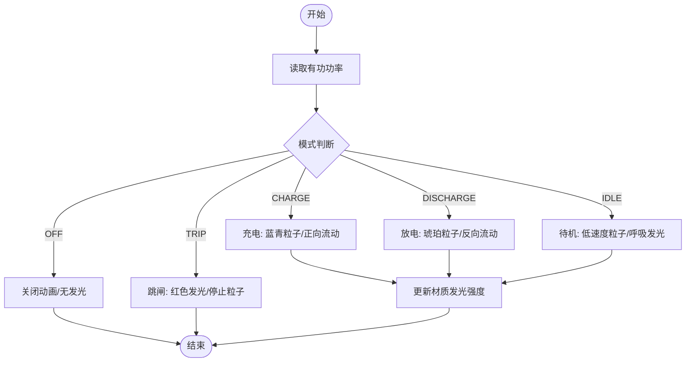
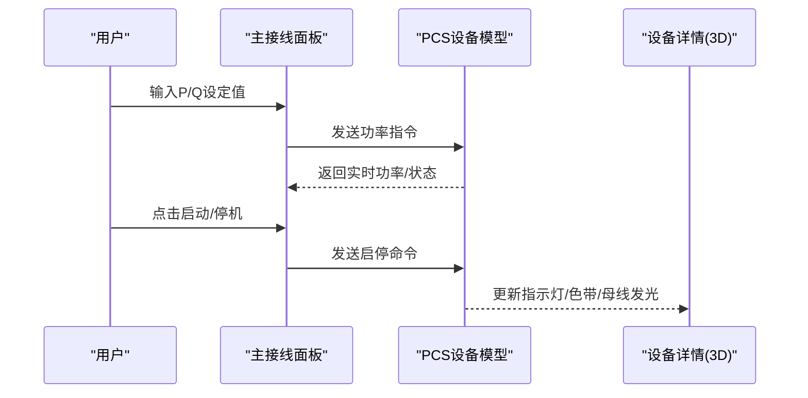
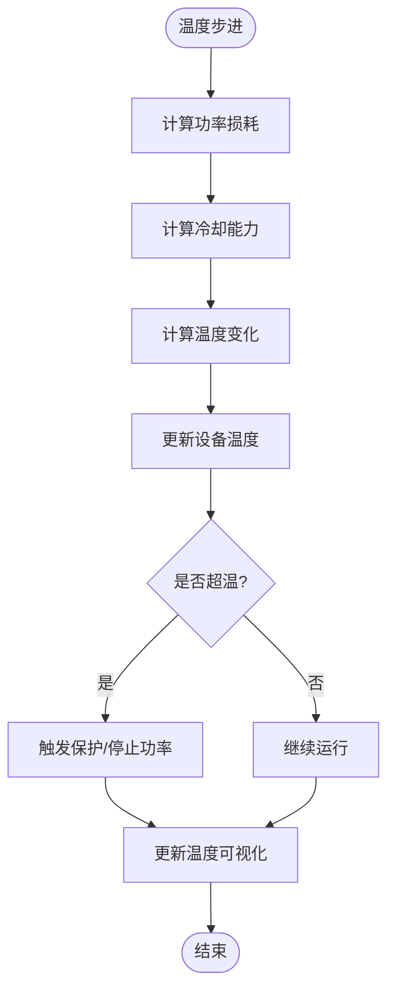
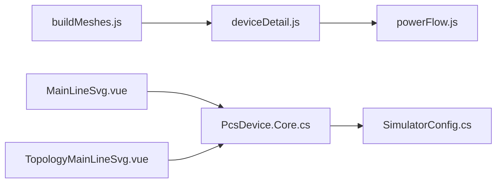

# PCS设备模型

<cite>
**本文引用的文件**
- [buildMeshes.js](file://Web/src/components/mainline3d/buildMeshes.js)
- [deviceDetail.js](file://Web/src/components/mainline3d/deviceDetail.js)
- [powerFlow.js](file://Web/src/components/mainline3d/powerFlow.js)
- [MainLineSvg.vue](file://Web/src/components/MainLineSvg.vue)
- [TopologyMainLineSvg.vue](file://Web/src/components/TopologyMainLineSvg.vue)
- [PcsDevice.Core.cs](file://EssDeviceSimModel/Devices/PcsDevice.Core.cs)
- [SimulatorConfig.cs](file://Configuration/SimulatorConfig.cs)
</cite>

## 目录
1. [简介](#简介)
2. [项目结构](#项目结构)
3. [核心组件](#核心组件)
4. [架构总览](#架构总览)
5. [详细组件分析](#详细组件分析)
6. [依赖关系分析](#依赖关系分析)
7. [性能考虑](#性能考虑)
8. [故障排查指南](#故障排查指南)
9. [结论](#结论)
10. [附录](#附录)

## 简介
本文件面向PCS（功率转换系统）设备的3D数字孪生与可视化，系统性说明PCS柜的几何建模、动态效果、控制面板集成、热力学可视化以及配置与优化方法。内容覆盖：
- PCS柜几何结构：双开门、百叶通风、电气母排与模块布局、显示屏与控制盒
- 动态效果：运行状态指示灯、功率流向动画、温度变化可视化
- 控制面板集成：有功/无功设置、启停控制、界面交互
- 热力学可视化：内部温度分布、冷却系统工作状态
- 配置选项、性能优化策略与外观自定义

## 项目结构
本项目将PCS设备的3D建模与动画逻辑集中在Web前端Three.js模块中，后端提供PCS设备仿真模型与热力学参数。关键路径如下：
- 3D场景与设备网格构建：Web/src/components/mainline3d/buildMeshes.js
- 设备详情剖切与动态更新：Web/src/components/mainline3d/deviceDetail.js
- 潮流电缆与流光动画：Web/src/components/mainline3d/powerFlow.js
- 主接线SVG面板与PCS控制入口：Web/src/components/MainLineSvg.vue、TopologyMainLineSvg.vue
- PCS设备仿真模型与热力学接口：EssDeviceSimModel/Devices/PcsDevice.Core.cs
- 热力学与空调配置：Configuration/SimulatorConfig.cs

图表来源
- [buildMeshes.js:329-393](file://Web/src/components/mainline3d/buildMeshes.js#L329-L393)
- [deviceDetail.js:101-218](file://Web/src/components/mainline3d/deviceDetail.js#L101-L218)
- [powerFlow.js:118-199](file://Web/src/components/mainline3d/powerFlow.js#L118-L199)
- [PcsDevice.Core.cs:82-134](file://EssDeviceSimModel/Devices/PcsDevice.Core.cs#L82-L134)
- [SimulatorConfig.cs:112-135](file://Configuration/SimulatorConfig.cs#L112-L135)

章节来源
- [buildMeshes.js:329-393](file://Web/src/components/mainline3d/buildMeshes.js#L329-L393)
- [deviceDetail.js:101-218](file://Web/src/components/mainline3d/deviceDetail.js#L101-L218)
- [powerFlow.js:118-199](file://Web/src/components/mainline3d/powerFlow.js#L118-L199)
- [MainLineSvg.vue:437-464](file://Web/src/components/MainLineSvg.vue#L437-L464)
- [TopologyMainLineSvg.vue:847-863](file://Web/src/components/TopologyMainLineSvg.vue#L847-L863)
- [PcsDevice.Core.cs:82-134](file://EssDeviceSimModel/Devices/PcsDevice.Core.cs#L82-L134)
- [SimulatorConfig.cs:112-135](file://Configuration/SimulatorConfig.cs#L112-L135)

## 核心组件
- PCS柜外观与细节：
  - 外观柜体：双开门、百叶通风、状态灯带、铭牌、底部进线盖板、底座
  - 详情剖切：后板+左右侧板+顶底、右侧全开左侧半开、内部层架与功率模块、DC/AC母排、三相出线柱、顶部状态灯、功率色带、控制盒与屏幕
- 动态效果：
  - 运行状态指示灯颜色与亮度随运行模式切换
  - 功率流向动画：充电/放电方向、速度、粒子与拖尾
  - 温度可视化：模块发光强度、母线发光强度随功率大小变化
- 控制面板集成：
  - 主接线面板提供有功/无功设定与启停按钮
  - 3D详情视图内嵌控制盒与屏幕示意
- 热力学可视化：
  - PCS设备温度模型与空调制冷参数可配置
  - 通过设备状态与温度阈值触发保护与降额

章节来源
- [buildMeshes.js:329-393](file://Web/src/components/mainline3d/buildMeshes.js#L329-L393)
- [deviceDetail.js:101-218](file://Web/src/components/mainline3d/deviceDetail.js#L101-L218)
- [powerFlow.js:26-43](file://Web/src/components/mainline3d/powerFlow.js#L26-L43)
- [MainLineSvg.vue:437-464](file://Web/src/components/MainLineSvg.vue#L437-L464)
- [TopologyMainLineSvg.vue:847-863](file://Web/src/components/TopologyMainLineSvg.vue#L847-L863)
- [PcsDevice.Core.cs:621-641](file://EssDeviceSimModel/Devices/PcsDevice.Core.cs#L621-L641)
- [SimulatorConfig.cs:112-135](file://Configuration/SimulatorConfig.cs#L112-L135)

## 架构总览
PCS设备3D模型由“外观构建 + 详情剖切 + 潮流动画 + 控制面板 + 热力学”五部分协同完成。外观构建负责静态几何；详情剖切提供内部结构与动态材质；潮流动画基于功率指令驱动粒子与拖尾；控制面板提供用户交互；热力学模型提供温度与冷却参数，影响设备状态与可视化。

图表来源
- [MainLineSvg.vue:437-464](file://Web/src/components/MainLineSvg.vue#L437-L464)
- [TopologyMainLineSvg.vue:847-863](file://Web/src/components/TopologyMainLineSvg.vue#L847-L863)
- [PcsDevice.Core.cs:380-441](file://EssDeviceSimModel/Devices/PcsDevice.Core.cs#L380-L441)
- [deviceDetail.js:225-273](file://Web/src/components/mainline3d/deviceDetail.js#L225-L273)
- [powerFlow.js:206-287](file://Web/src/components/mainline3d/powerFlow.js#L206-L287)
- [SimulatorConfig.cs:112-135](file://Configuration/SimulatorConfig.cs#L112-L135)

## 详细组件分析

### PCS柜几何结构构建
- 外观柜体：
  - 双开门：左右门分别位于正前方两侧，带把手与观察窗
  - 百叶通风：顶部多道横向百叶与侧向竖向百叶，模拟自然对流散热
  - 状态灯带与三色指示灯：用于显示运行/待机/告警
  - 铭牌/品牌条与底部电缆沟盖板：增强工业真实感
- 详情剖切：
  - 前侧开门剖切：右侧门全开、左侧门半开，便于观察内部
  - 内部层架与功率模块：多层货架承载功率模块，模块附带散热器翅片
  - DC/AC母排：后上方直流母排、前下方交流母排，支持发光强度随功率变化
  - 三相出线柱：底部三相端子，便于连接外部电路
  - 顶部状态灯与功率色带：指示运行模式与功率大小
  - 控制盒与屏幕：右侧控制盒内置屏幕，用于本地显示与操作

图表来源
- [buildMeshes.js:329-393](file://Web/src/components/mainline3d/buildMeshes.js#L329-L393)
- [deviceDetail.js:101-218](file://Web/src/components/mainline3d/deviceDetail.js#L101-L218)

章节来源
- [buildMeshes.js:329-393](file://Web/src/components/mainline3d/buildMeshes.js#L329-L393)
- [deviceDetail.js:101-218](file://Web/src/components/mainline3d/deviceDetail.js#L101-L218)

### 动态效果实现
- 运行状态指示灯：
  - 待机/运行/充/放/跳闸等模式对应不同颜色与发光强度
  - 指示灯材质在详情视图中按运行状态实时更新
- 功率流向动画：
  - 依据有功功率符号判断充电/放电方向
  - 电流方向决定粒子流动方向与速度，幅度影响发光强度与粒子尺寸
  - 待机模式下粒子缓慢呼吸，充/放模式下粒子快速流动并带拖尾
- 温度变化可视化：
  - 模块与母线的发光强度随功率大小与运行状态变化
  - 当温度超过阈值时，设备进入保护状态并停止功率指令

图表来源
- [powerFlow.js:26-43](file://Web/src/components/mainline3d/powerFlow.js#L26-L43)
- [powerFlow.js:206-287](file://Web/src/components/mainline3d/powerFlow.js#L206-L287)
- [deviceDetail.js:225-273](file://Web/src/components/mainline3d/deviceDetail.js#L225-L273)

章节来源
- [powerFlow.js:26-43](file://Web/src/components/mainline3d/powerFlow.js#L26-L43)
- [powerFlow.js:206-287](file://Web/src/components/mainline3d/powerFlow.js#L206-L287)
- [deviceDetail.js:225-273](file://Web/src/components/mainline3d/deviceDetail.js#L225-L273)

### 控制面板集成
- 主接线面板：
  - 提供有功设定（kW）、无功设定（kvar）输入框与确认按钮
  - 启动/停机按钮直接触发设备启停命令
- 3D详情视图：
  - 控制盒与屏幕作为本地操作界面示意
  - 屏幕材质透明，便于展示内部结构的同时保留操作区域

图表来源
- [MainLineSvg.vue:437-464](file://Web/src/components/MainLineSvg.vue#L437-L464)
- [TopologyMainLineSvg.vue:847-863](file://Web/src/components/TopologyMainLineSvg.vue#L847-L863)
- [PcsDevice.Core.cs:136-150](file://EssDeviceSimModel/Devices/PcsDevice.Core.cs#L136-L150)
- [deviceDetail.js:225-273](file://Web/src/components/mainline3d/deviceDetail.js#L225-L273)

章节来源
- [MainLineSvg.vue:437-464](file://Web/src/components/MainLineSvg.vue#L437-L464)
- [TopologyMainLineSvg.vue:847-863](file://Web/src/components/TopologyMainLineSvg.vue#L847-L863)
- [PcsDevice.Core.cs:136-150](file://EssDeviceSimModel/Devices/PcsDevice.Core.cs#L136-L150)
- [deviceDetail.js:225-273](file://Web/src/components/mainline3d/deviceDetail.js#L225-L273)

### 热力学可视化
- 温度模型：
  - 基于功率损耗与环境温度计算温度变化
  - 冷却系数与热容参数影响升温速率
- 空调与热阻：
  - 可配置空调制冷功率、目标温度、回差与比例增益
  - 热阻参数定义外壳到空气、电池到空气的热传递
- 可视化映射：
  - 温度升高导致模块与母线发光强度增加
  - 超温触发保护并停止功率指令

图表来源
- [PcsDevice.Core.cs:621-641](file://EssDeviceSimModel/Devices/PcsDevice.Core.cs#L621-L641)
- [SimulatorConfig.cs:112-135](file://Configuration/SimulatorConfig.cs#L112-L135)
- [deviceDetail.js:256-273](file://Web/src/components/mainline3d/deviceDetail.js#L256-L273)

章节来源
- [PcsDevice.Core.cs:621-641](file://EssDeviceSimModel/Devices/PcsDevice.Core.cs#L621-L641)
- [SimulatorConfig.cs:112-135](file://Configuration/SimulatorConfig.cs#L112-L135)
- [deviceDetail.js:256-273](file://Web/src/components/mainline3d/deviceDetail.js#L256-L273)

## 依赖关系分析
- 3D建模与动画：
  - buildMeshes.js提供PCS柜外观与BMS集装箱外观
  - deviceDetail.js提供PCS/BMS详情剖切与动态材质更新
  - powerFlow.js提供潮流电缆与粒子动画
- 控制面板：
  - MainLineSvg.vue与TopologyMainLineSvg.vue提供PCS控制入口
- 设备模型与热力学：
  - PcsDevice.Core.cs提供PCS设备仿真、功率指令、温度模型
  - SimulatorConfig.cs提供热力学与空调配置

图表来源
- [buildMeshes.js:329-393](file://Web/src/components/mainline3d/buildMeshes.js#L329-L393)
- [deviceDetail.js:101-218](file://Web/src/components/mainline3d/deviceDetail.js#L101-L218)
- [powerFlow.js:118-199](file://Web/src/components/mainline3d/powerFlow.js#L118-L199)
- [MainLineSvg.vue:437-464](file://Web/src/components/MainLineSvg.vue#L437-L464)
- [TopologyMainLineSvg.vue:847-863](file://Web/src/components/TopologyMainLineSvg.vue#L847-L863)
- [PcsDevice.Core.cs:82-134](file://EssDeviceSimModel/Devices/PcsDevice.Core.cs#L82-L134)
- [SimulatorConfig.cs:112-135](file://Configuration/SimulatorConfig.cs#L112-L135)

章节来源
- [buildMeshes.js:329-393](file://Web/src/components/mainline3d/buildMeshes.js#L329-L393)
- [deviceDetail.js:101-218](file://Web/src/components/mainline3d/deviceDetail.js#L101-L218)
- [powerFlow.js:118-199](file://Web/src/components/mainline3d/powerFlow.js#L118-L199)
- [MainLineSvg.vue:437-464](file://Web/src/components/MainLineSvg.vue#L437-L464)
- [TopologyMainLineSvg.vue:847-863](file://Web/src/components/TopologyMainLineSvg.vue#L847-L863)
- [PcsDevice.Core.cs:82-134](file://EssDeviceSimModel/Devices/PcsDevice.Core.cs#L82-L134)
- [SimulatorConfig.cs:112-135](file://Configuration/SimulatorConfig.cs#L112-L135)

## 性能考虑
- 几何复杂度：
  - 使用基础几何体组合减少面数，避免过度细分
  - 详情剖切仅在需要时启用，降低常驻场景负载
- 材质与光照：
  - 合理设置金属度与粗糙度，平衡真实感与渲染成本
  - 发光强度与粒子数量根据功率幅度动态调整，避免高负载下闪烁
- 动画性能：
  - 粒子与拖尾数量固定，按运行模式调整可见性与透明度
  - 曲线构建采用刚体折线与圆角，避免复杂插值带来的开销
- 热力学计算：
  - 温度模型简化为线性冷却与热容，保证实时性
  - 空调参数可调，避免过高制冷功率导致数值不稳定

[本节为通用性能建议，不直接引用具体代码]

## 故障排查指南
- 指示灯不亮或颜色异常：
  - 检查设备运行状态与功率指令是否正确下发
  - 确认详情视图中指示灯材质更新逻辑是否被调用
- 功率流向动画方向错误：
  - 核对有功功率符号约定（正放负充）
  - 检查粒子速度与方向计算是否与功率幅度匹配
- 温度可视化不生效：
  - 确认温度模型参数与环境温度设置
  - 检查超温保护是否触发并停止功率指令
- 控制面板无法操作：
  - 验证主接线面板事件绑定与命令下发
  - 检查设备模型是否处于可接受功率指令的状态

章节来源
- [deviceDetail.js:225-273](file://Web/src/components/mainline3d/deviceDetail.js#L225-L273)
- [powerFlow.js:26-43](file://Web/src/components/mainline3d/powerFlow.js#L26-L43)
- [PcsDevice.Core.cs:621-641](file://EssDeviceSimModel/Devices/PcsDevice.Core.cs#L621-L641)
- [MainLineSvg.vue:437-464](file://Web/src/components/MainLineSvg.vue#L437-L464)
- [TopologyMainLineSvg.vue:847-863](file://Web/src/components/TopologyMainLineSvg.vue#L847-L863)

## 结论
PCS设备3D模型通过外观构建、详情剖切、潮流动画、控制面板与热力学可视化的协同，实现了高保真与可交互的数字孪生体验。双开门与百叶通风增强了真实感，动态效果直观反映运行状态与功率流向，控制面板提供便捷的操作入口，热力学模型确保温度变化与冷却系统的可视化。通过合理的配置与优化策略，可在保证性能的前提下实现丰富的自定义外观与功能。

[本节为总结性内容，不直接引用具体代码]

## 附录
- 配置选项：
  - 空调制冷功率、目标温度、回差与比例增益
  - 热阻参数：室外到外壳、外壳到柜内空气、电池到柜内空气
- 自定义外观：
  - 修改材质颜色、金属度与粗糙度以适配不同品牌风格
  - 调整百叶数量与位置以模拟不同通风设计
  - 扩展详情剖切中的内部布局与模块数量

章节来源
- [SimulatorConfig.cs:112-135](file://Configuration/SimulatorConfig.cs#L112-L135)
- [buildMeshes.js:329-393](file://Web/src/components/mainline3d/buildMeshes.js#L329-L393)
- [deviceDetail.js:101-218](file://Web/src/components/mainline3d/deviceDetail.js#L101-L218)