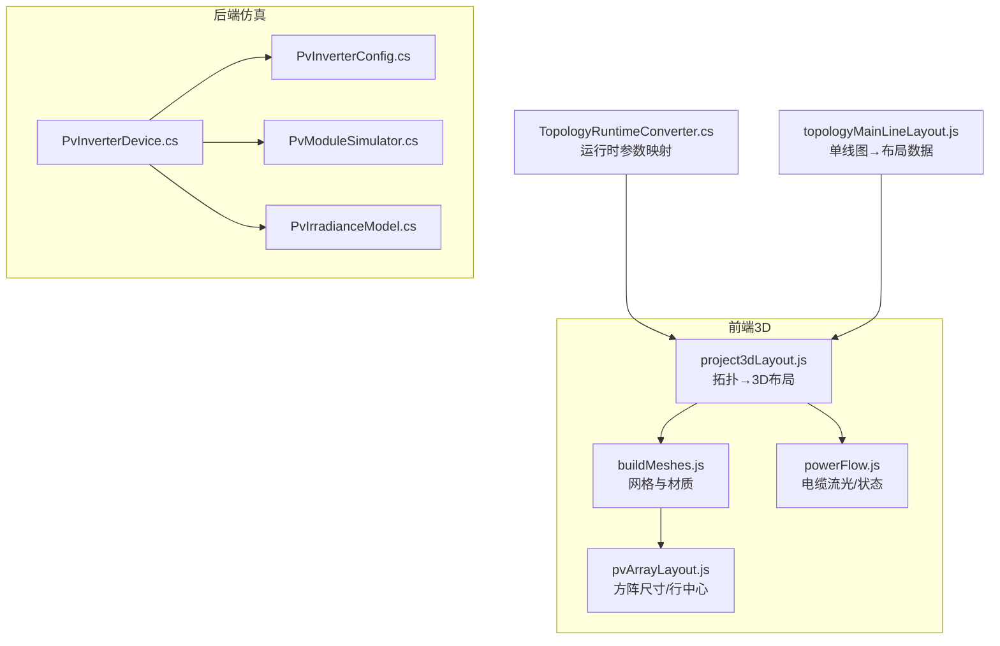
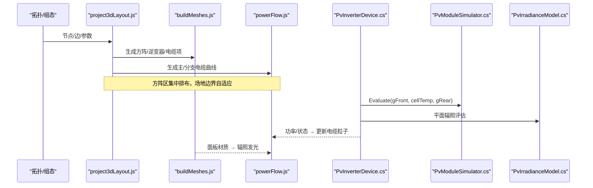
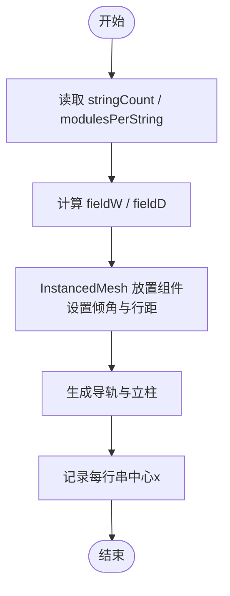
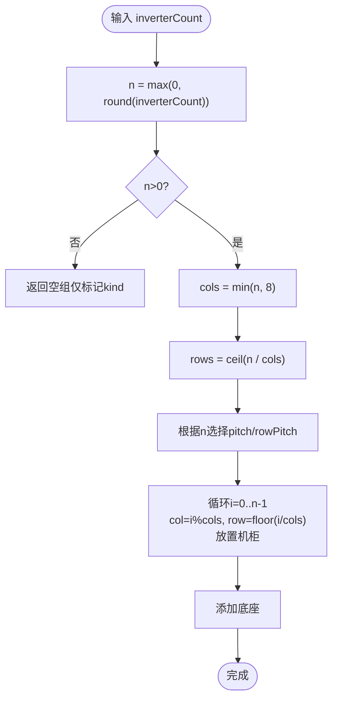
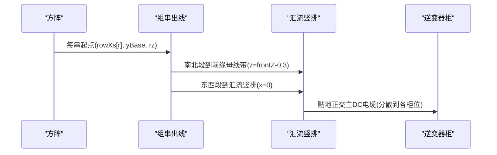
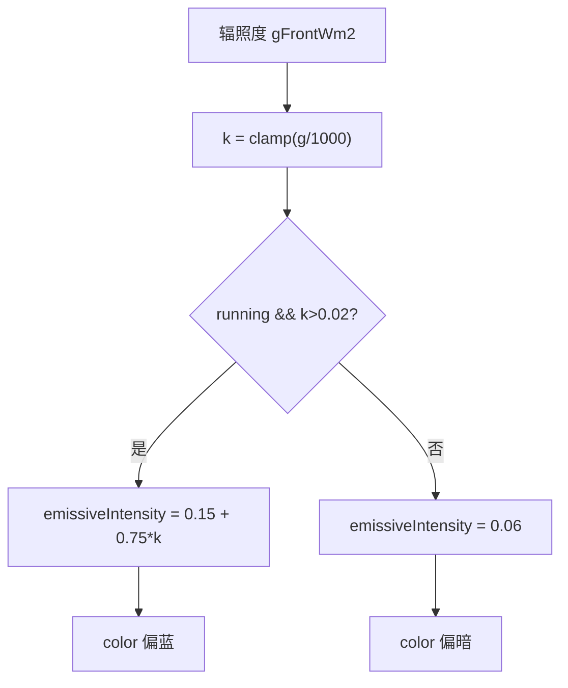
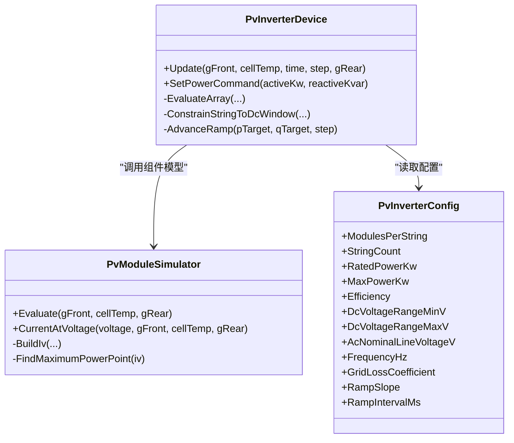
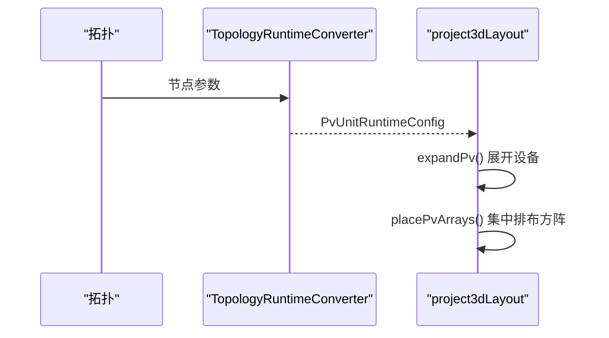
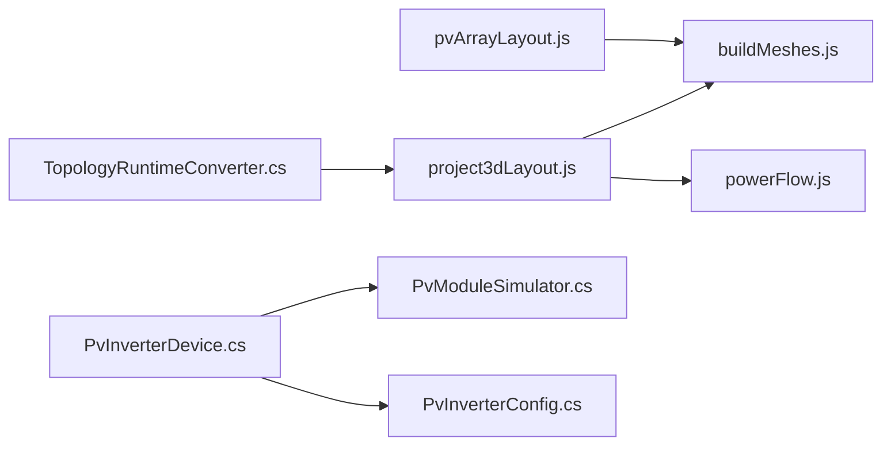

# 光伏系统模型

<cite>
**本文引用的文件**
- [buildMeshes.js](file://Web/src/components/mainline3d/buildMeshes.js)
- [pvArrayLayout.js](file://Web/src/components/mainline3d/pvArrayLayout.js)
- [project3dLayout.js](file://Web/src/components/mainline3d/project3dLayout.js)
- [powerFlow.js](file://Web/src/components/mainline3d/powerFlow.js)
- [PvInverterConfig.cs](file://EssDeviceSimModel/Pv/PvInverterConfig.cs)
- [PvInverterDevice.cs](file://EssDeviceSimModel/Pv/PvInverterDevice.cs)
- [PvModuleSimulator.cs](file://EssDeviceSimModel/Pv/PvModuleSimulator.cs)
- [PvIrradianceModel.cs](file://EssDeviceSimModel/Pv/PvIrradianceModel.cs)
- [TopologyRuntimeConverter.cs](file://Web/Topology/TopologyRuntimeConverter.cs)
- [topologyMainLineLayout.js](file://Web/src/components/topology/topologyMainLineLayout.js)
</cite>

## 目录
1. [简介](#简介)
2. [项目结构](#项目结构)
3. [核心组件](#核心组件)
4. [架构总览](#架构总览)
5. [详细组件分析](#详细组件分析)
6. [依赖关系分析](#依赖关系分析)
7. [性能与渲染优化](#性能与渲染优化)
8. [故障排查指南](#故障排查指南)
9. [结论](#结论)
10. [附录：配置参数速查](#附录：配置参数速查)

## 简介
本文件面向“光伏系统3D模型”的建模、布局、可视化与仿真联动，系统性说明以下能力：
- 光伏方阵几何结构精确建模：组件行列、支架结构与倾角设置。
- 组串逆变器批量生成算法：按不同台数自动分行排布与间距计算。
- 实时可视化：辐照度驱动的发光效果、运行状态指示、功率输出可视化。
- 三维布线：组串出线正交走线与汇流母线自动连接。
- 配置参数、性能优化与大规模阵列渲染策略。

## 项目结构
本项目将“3D场景构建/布局”与“设备仿真内核”解耦：
- 前端3D层（Web）：负责从拓扑/组态推导3D布局、生成网格与电缆、驱动实时动画。
- 后端仿真层（C#）：实现组件/组串/逆变器的电气仿真、MPPT、温度降额、爬坡等。

**图表来源**
- [project3dLayout.js:1-136](file://Web/src/components/mainline3d/project3dLayout.js#L1-L136)
- [buildMeshes.js:520-642](file://Web/src/components/mainline3d/buildMeshes.js#L520-L642)
- [pvArrayLayout.js:1-62](file://Web/src/components/mainline3d/pvArrayLayout.js#L1-L62)
- [powerFlow.js:1-314](file://Web/src/components/mainline3d/powerFlow.js#L1-L314)
- [PvInverterConfig.cs:1-22](file://EssDeviceSimModel/Pv/PvInverterConfig.cs#L1-L22)
- [PvInverterDevice.cs:33-153](file://EssDeviceSimModel/Pv/PvInverterDevice.cs#L33-L153)
- [PvModuleSimulator.cs:32-143](file://EssDeviceSimModel/Pv/PvModuleSimulator.cs#L32-L143)
- [PvIrradianceModel.cs:1-24](file://EssDeviceSimModel/Pv/PvIrradianceModel.cs#L1-L24)
- [TopologyRuntimeConverter.cs:255-277](file://Web/Topology/TopologyRuntimeConverter.cs#L255-L277)
- [topologyMainLineLayout.js:263-289](file://Web/src/components/topology/topologyMainLineLayout.js#L263-L289)

**章节来源**
- [project3dLayout.js:1-136](file://Web/src/components/mainline3d/project3dLayout.js#L1-L136)
- [buildMeshes.js:520-642](file://Web/src/components/mainline3d/buildMeshes.js#L520-L642)
- [pvArrayLayout.js:1-62](file://Web/src/components/mainline3d/pvArrayLayout.js#L1-L62)
- [powerFlow.js:1-314](file://Web/src/components/mainline3d/powerFlow.js#L1-L314)
- [PvInverterConfig.cs:1-22](file://EssDeviceSimModel/Pv/PvInverterConfig.cs#L1-L22)
- [PvInverterDevice.cs:33-153](file://EssDeviceSimModel/Pv/PvInverterDevice.cs#L33-L153)
- [PvModuleSimulator.cs:32-143](file://EssDeviceSimModel/Pv/PvModuleSimulator.cs#L32-L143)
- [PvIrradianceModel.cs:1-24](file://EssDeviceSimModel/Pv/PvIrradianceModel.cs#L1-L24)
- [TopologyRuntimeConverter.cs:255-277](file://Web/Topology/TopologyRuntimeConverter.cs#L255-L277)
- [topologyMainLineLayout.js:263-289](file://Web/src/components/topology/topologyMainLineLayout.js#L263-L289)

## 核心组件
- 方阵几何与布局：基于 stringCount × modulesPerString 的1:1组件矩阵，固定倾角与行距，支撑轨与立柱自动生成。
- 逆变器排布：按 inverterCount 自动分行列，紧凑排列并避免重叠。
- 直流布线：每串独立出线至前缘汇流竖排，再经贴地正交路径接入逆变器柜位。
- 交流侧主/分支电缆：箱变到逆变器排的主干线与各逆变器短分支，统一低高度正交。
- 实时可视化：面板自发光随辐照变化；电缆粒子/拖尾表示充放电流方向与大小；断路器/开关状态灯联动。
- 仿真内核：组件单二极管模型+MPPT搜索；组串电压窗口限幅；逆变器有功/无功爬坡、温度降额、电网联锁。

**章节来源**
- [buildMeshes.js:520-642](file://Web/src/components/mainline3d/buildMeshes.js#L520-L642)
- [project3dLayout.js:352-579](file://Web/src/components/mainline3d/project3dLayout.js#L352-L579)
- [powerFlow.js:1-314](file://Web/src/components/mainline3d/powerFlow.js#L1-L314)
- [PvInverterDevice.cs:128-175](file://EssDeviceSimModel/Pv/PvInverterDevice.cs#L128-L175)
- [PvModuleSimulator.cs:32-143](file://EssDeviceSimModel/Pv/PvModuleSimulator.cs#L32-L143)

## 架构总览
下图展示从拓扑到3D场景与仿真联动的端到端流程：

**图表来源**
- [project3dLayout.js:352-579](file://Web/src/components/mainline3d/project3dLayout.js#L352-L579)
- [buildMeshes.js:520-642](file://Web/src/components/mainline3d/buildMeshes.js#L520-L642)
- [powerFlow.js:1-314](file://Web/src/components/mainline3d/powerFlow.js#L1-L314)
- [PvInverterDevice.cs:128-175](file://EssDeviceSimModel/Pv/PvInverterDevice.cs#L128-L175)
- [PvModuleSimulator.cs:32-143](file://EssDeviceSimModel/Pv/PvModuleSimulator.cs#L32-L143)
- [PvIrradianceModel.cs:1-24](file://EssDeviceSimModel/Pv/PvIrradianceModel.cs#L1-L24)

## 详细组件分析

### 光伏方阵几何与支架建模
- 组件尺寸与间隙：定义单块组件宽/深与横向间隙、相邻排纵向行距，确保倾斜投影不遮挡。
- 占地计算：按 stringCount×modulesPerString 计算 fieldW/fieldD，用于布局避让与场景边界扩展。
- 倾角与安装：固定倾角（约28°），使用 InstancedMesh 批量绘制组件板面，减少Draw Call。
- 支架结构：每行导轨与两侧立柱，贴合倾角旋转，形成稳定支撑。
- 组串定位：记录每行（串）组件中心x坐标，供组串出线起点定位。

**图表来源**
- [pvArrayLayout.js:10-62](file://Web/src/components/mainline3d/pvArrayLayout.js#L10-L62)
- [buildMeshes.js:520-591](file://Web/src/components/mainline3d/buildMeshes.js#L520-L591)

**章节来源**
- [pvArrayLayout.js:10-62](file://Web/src/components/mainline3d/pvArrayLayout.js#L10-L62)
- [buildMeshes.js:520-591](file://Web/src/components/mainline3d/buildMeshes.js#L520-L591)

### 组串逆变器批量生成算法
- 输入：inverterCount（可来自拓扑或运行时配置）。
- 算法：
  - 列数上限为8，行数=ceil(count/cols)。
  - 间距：当count>8时采用更紧凑pitch，否则标准间距。
  - 位置：以排中心对称分布，保证多单元间逆变器排不重叠。
- 输出：逆变器排Group，含底座与门板示意。

**图表来源**
- [buildMeshes.js:487-518](file://Web/src/components/mainline3d/buildMeshes.js#L487-L518)
- [project3dLayout.js:501-517](file://Web/src/components/mainline3d/project3dLayout.js#L501-L517)

**章节来源**
- [buildMeshes.js:487-518](file://Web/src/components/mainline3d/buildMeshes.js#L487-L518)
- [project3dLayout.js:501-517](file://Web/src/components/mainline3d/project3dLayout.js#L501-L517)

### 三维布线：组串出线与汇流母线
- 组串出线：每串一根线，先南北走到方阵前缘母线带，再东西走到汇流竖排；同层y分层避免重合。
- 汇流竖排：位于方阵前缘底部，各串线按不同y接入，下端下探贴地接主DC电缆。
- 静态DC电缆：贴地正交路径（竖直→南北→东西→竖直），轴对齐圆柱段拼接，无斜线。
- 主/分支交流电缆：箱变出线口到逆变器排前方汇流点为主干；每台逆变器短分支接入。

**图表来源**
- [buildMeshes.js:593-642](file://Web/src/components/mainline3d/buildMeshes.js#L593-L642)
- [buildMeshes.js:644-679](file://Web/src/components/mainline3d/buildMeshes.js#L644-L679)
- [project3dLayout.js:465-498](file://Web/src/components/mainline3d/project3dLayout.js#L465-L498)

**章节来源**
- [buildMeshes.js:593-679](file://Web/src/components/mainline3d/buildMeshes.js#L593-L679)
- [project3dLayout.js:465-498](file://Web/src/components/mainline3d/project3dLayout.js#L465-L498)

### 实时可视化：辐照发光、运行状态与功率输出
- 方阵发光：面板材质 emissiveIntensity/color 随辐照度线性变化，运行且辐照>阈值时增强发光。
- 电缆状态：根据功率方向/大小切换颜色与粒子速度，充电/放电/待机/跳闸状态清晰可见。
- 断路器/开关：状态指示灯随合分/跳闸变色，便于快速识别。

**图表来源**
- [buildMeshes.js:681-688](file://Web/src/components/mainline3d/buildMeshes.js#L681-L688)
- [powerFlow.js:26-43](file://Web/src/components/mainline3d/powerFlow.js#L26-L43)
- [powerFlow.js:206-262](file://Web/src/components/mainline3d/powerFlow.js#L206-L262)

**章节来源**
- [buildMeshes.js:681-688](file://Web/src/components/mainline3d/buildMeshes.js#L681-L688)
- [powerFlow.js:26-43](file://Web/src/components/mainline3d/powerFlow.js#L26-L43)
- [powerFlow.js:206-262](file://Web/src/components/mainline3d/powerFlow.js#L206-L262)

### 仿真内核：组件/组串/逆变器
- 组件模型：单二极管I-V，有效辐照考虑双面增益；NOCT估算电池温度；黄金分割法搜索MPPT。
- 组串限制：工作电压被约束在直流窗口[min,max]，越界触发过压/欠压保护。
- 逆变器控制：有功/无功设定受额定/最大容量与视在功率约束；支持爬坡速率与间隔；低温线性降额；电网不可用时停机。
- 运行分类：依据命令、电网、辐照、直流电压、温度等综合判定当前限制原因。

**图表来源**
- [PvModuleSimulator.cs:32-143](file://EssDeviceSimModel/Pv/PvModuleSimulator.cs#L32-L143)
- [PvInverterDevice.cs:33-175](file://EssDeviceSimModel/Pv/PvInverterDevice.cs#L33-L175)
- [PvInverterConfig.cs:1-22](file://EssDeviceSimModel/Pv/PvInverterConfig.cs#L1-L22)

**章节来源**
- [PvModuleSimulator.cs:32-143](file://EssDeviceSimModel/Pv/PvModuleSimulator.cs#L32-L143)
- [PvInverterDevice.cs:33-175](file://EssDeviceSimModel/Pv/PvInverterDevice.cs#L33-L175)
- [PvInverterConfig.cs:1-22](file://EssDeviceSimModel/Pv/PvInverterConfig.cs#L1-L22)

### 拓扑到3D布局的转换
- 运行时参数映射：从拓扑节点参数解析 inverterCount/stringCount/modulesPerString 等，构造运行时配置。
- 布局展开：pv_unit 展开为断路器、箱变、逆变器排与方阵区；A/B分组合理布置，避免跨单元重叠。
- 方阵区集中排布：按 stringCount×modulesPerString 计算占地，统一排在逆变器后方，场地边界自适应扩展。

**图表来源**
- [TopologyRuntimeConverter.cs:255-277](file://Web/Topology/TopologyRuntimeConverter.cs#L255-L277)
- [project3dLayout.js:352-579](file://Web/src/components/mainline3d/project3dLayout.js#L352-L579)
- [topologyMainLineLayout.js:263-289](file://Web/src/components/topology/topologyMainLineLayout.js#L263-L289)

**章节来源**
- [TopologyRuntimeConverter.cs:255-277](file://Web/Topology/TopologyRuntimeConverter.cs#L255-L277)
- [project3dLayout.js:352-579](file://Web/src/components/mainline3d/project3dLayout.js#L352-L579)
- [topologyMainLineLayout.js:263-289](file://Web/src/components/topology/topologyMainLineLayout.js#L263-L289)

## 依赖关系分析
- 布局模块依赖方阵尺寸工具，保证建模与布局一致。
- 3D网格模块依赖布局项，按模板生成具体模型。
- 仿真模块通过配置与组件模型计算可用功率，驱动前端可视化。
- 拓扑转换器桥接前后端参数，确保一致性。

**图表来源**
- [pvArrayLayout.js:1-62](file://Web/src/components/mainline3d/pvArrayLayout.js#L1-L62)
- [buildMeshes.js:520-642](file://Web/src/components/mainline3d/buildMeshes.js#L520-L642)
- [project3dLayout.js:352-579](file://Web/src/components/mainline3d/project3dLayout.js#L352-L579)
- [powerFlow.js:1-314](file://Web/src/components/mainline3d/powerFlow.js#L1-L314)
- [PvInverterDevice.cs:33-175](file://EssDeviceSimModel/Pv/PvInverterDevice.cs#L33-L175)
- [PvModuleSimulator.cs:32-143](file://EssDeviceSimModel/Pv/PvModuleSimulator.cs#L32-L143)
- [PvInverterConfig.cs:1-22](file://EssDeviceSimModel/Pv/PvInverterConfig.cs#L1-L22)
- [TopologyRuntimeConverter.cs:255-277](file://Web/Topology/TopologyRuntimeConverter.cs#L255-L277)

**章节来源**
- [pvArrayLayout.js:1-62](file://Web/src/components/mainline3d/pvArrayLayout.js#L1-L62)
- [buildMeshes.js:520-642](file://Web/src/components/mainline3d/buildMeshes.js#L520-L642)
- [project3dLayout.js:352-579](file://Web/src/components/mainline3d/project3dLayout.js#L352-L579)
- [powerFlow.js:1-314](file://Web/src/components/mainline3d/powerFlow.js#L1-L314)
- [PvInverterDevice.cs:33-175](file://EssDeviceSimModel/Pv/PvInverterDevice.cs#L33-L175)
- [PvModuleSimulator.cs:32-143](file://EssDeviceSimModel/Pv/PvModuleSimulator.cs#L32-L143)
- [PvInverterConfig.cs:1-22](file://EssDeviceSimModel/Pv/PvInverterConfig.cs#L1-L22)
- [TopologyRuntimeConverter.cs:255-277](file://Web/Topology/TopologyRuntimeConverter.cs#L255-L277)

## 性能与渲染优化
- 组件实例化：使用 InstancedMesh 批量绘制方阵组件，显著降低Draw Call与内存占用。
- 正交刚体走线：电缆由轴对齐圆柱段拼接，避免TubeGeometry在拐角扭曲与额外细分。
- 分层与避让：组串出线与支路电缆按y分层，避免视觉重合；方阵区集中排布，场地边界自适应扩展。
- 材质与阴影：贴地电缆关闭投射/接收阴影，减少阴影计算开销；面板材质仅对活跃状态启用较强自发光。
- 规模扩展：方阵行列不设上限，但通过布局避让与场景bounds自适应，避免与逆变器排重叠。

[本节为通用指导，不直接分析具体文件]

## 故障排查指南
- 方阵不显示或尺寸异常：检查 stringCount/modulesPerString 是否为正数；确认 pvArrayFieldSize 返回值与布局占位一致。
- 逆变器排重叠：核对 inverterCount 与 splitCount 逻辑；确认A/B分组偏移与 pitch 设置。
- 组串出线未连接：检查 rowXs 与 busZ 计算；确认 createPvStringLeads 与静态DC电缆起点/终点。
- 电缆状态不更新：确认 powerFlow 的 resolveFlow/updateCableState/tickCable 是否被正确调用；检查 energized/tripped/powerKw 参数。
- 逆变器出力异常：检查直流电压窗口限制、温度降额、电网可用性、爬坡限制与指令范围。

**章节来源**
- [pvArrayLayout.js:25-35](file://Web/src/components/mainline3d/pvArrayLayout.js#L25-L35)
- [buildMeshes.js:593-642](file://Web/src/components/mainline3d/buildMeshes.js#L593-L642)
- [buildMeshes.js:644-679](file://Web/src/components/mainline3d/buildMeshes.js#L644-L679)
- [powerFlow.js:26-43](file://Web/src/components/mainline3d/powerFlow.js#L26-L43)
- [powerFlow.js:206-262](file://Web/src/components/mainline3d/powerFlow.js#L206-L262)
- [PvInverterDevice.cs:177-234](file://EssDeviceSimModel/Pv/PvInverterDevice.cs#L177-L234)

## 结论
本方案实现了从拓扑到3D场景的完整链路：方阵几何精确建模、逆变器批量布局、组串与汇流母线自动布线、以及基于仿真内核的实时可视化。通过实例化网格、正交刚体走线与分层避让，兼顾了大规模阵列的可读性与渲染性能。配置参数集中在拓扑与运行时转换器中，便于工程化部署与动态调整。

[本节为总结性内容，不直接分析具体文件]

## 附录：配置参数速查
- 方阵与组件
  - 组件宽/深/间隙/行距：PV_PANEL_W / PV_PANEL_D / PV_PANEL_GAP_X / PV_ROW_PITCH
  - 方阵尺寸：pvArrayFieldSize(stringCount, modulesPerString)
  - 行中心x：pvArrayRowXs(cols, fieldW)
- 逆变器排布
  - 台数：inverterCount
  - 行列与间距：cols=min(n,8), rows=ceil(n/cols), pitch/rowPitch
- 拓扑/运行时
  - 解析字段：inverterCount, stringCount, modulesPerString, unitXfPrimaryV/SecondaryV, dcVoltageMin/Max, moduleModel
- 仿真内核
  - 组件：单二极管I-V，有效辐照=前向+背面×双玻系数，NOCT温度估算，黄金分割MPPT
  - 逆变器：直流窗口[min,max]，温度降额区间，有功/无功爬坡，视在功率限幅

**章节来源**
- [pvArrayLayout.js:10-62](file://Web/src/components/mainline3d/pvArrayLayout.js#L10-L62)
- [buildMeshes.js:487-518](file://Web/src/components/mainline3d/buildMeshes.js#L487-L518)
- [TopologyRuntimeConverter.cs:255-277](file://Web/Topology/TopologyRuntimeConverter.cs#L255-L277)
- [topologyMainLineLayout.js:263-289](file://Web/src/components/topology/topologyMainLineLayout.js#L263-L289)
- [PvModuleSimulator.cs:25-41](file://EssDeviceSimModel/Pv/PvModuleSimulator.cs#L25-L41)
- [PvInverterDevice.cs:202-245](file://EssDeviceSimModel/Pv/PvInverterDevice.cs#L202-L245)