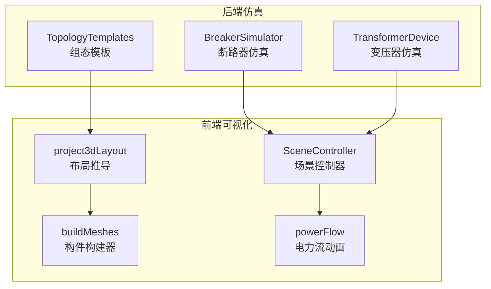
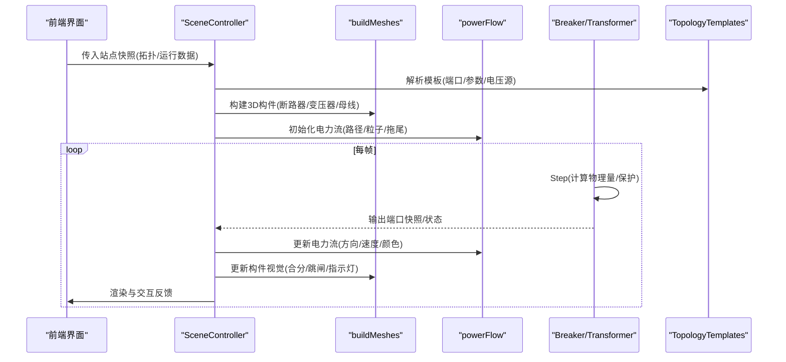
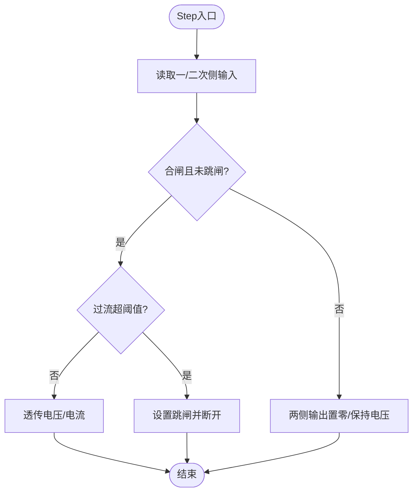
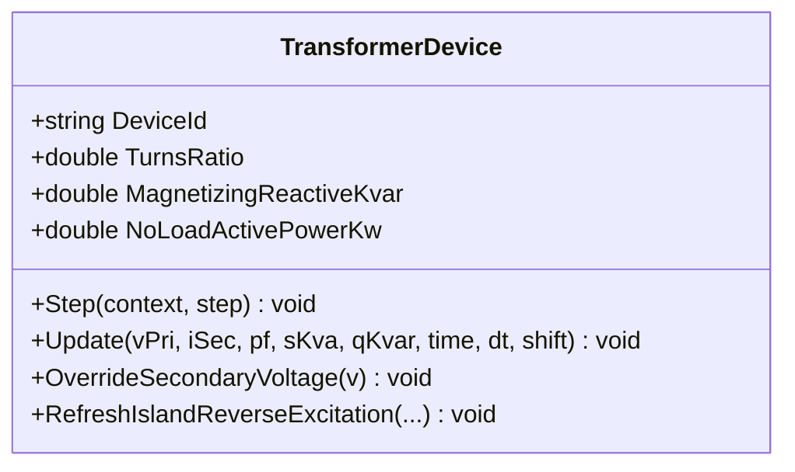
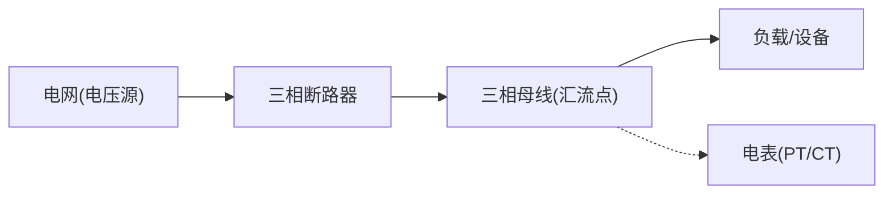
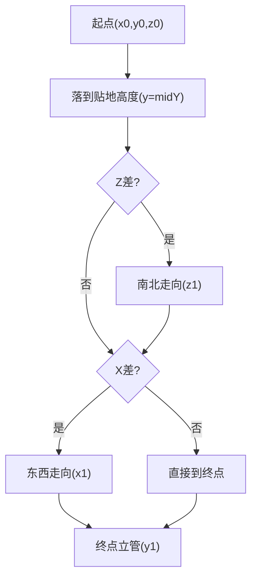
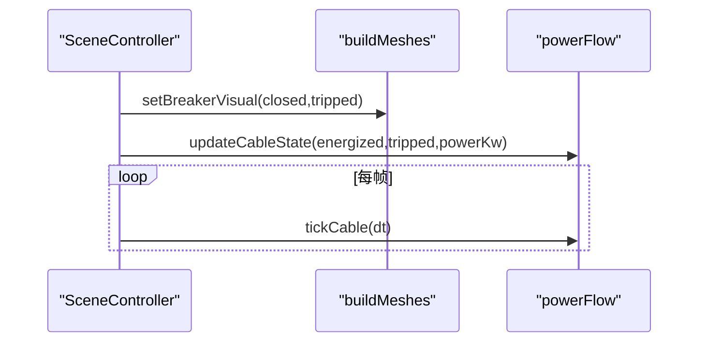
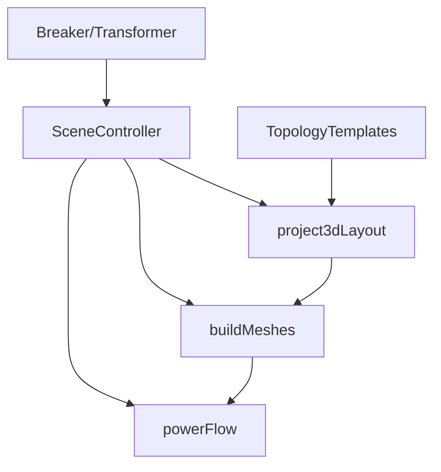

# 电气元件模型

<cite>
**本文引用的文件列表**
- [BreakerSimulator.cs](file://EssDeviceSimModel/Devices/BreakerSimulator.cs)
- [TransformerDevice.cs](file://EssDeviceSimModel/Devices/TransformerDevice.cs)
- [TopologyTemplates.cs](file://Web/Topology/TopologyTemplates.cs)
- [buildMeshes.js](file://Web/src/components/mainline3d/buildMeshes.js)
- [powerFlow.js](file://Web/src/components/mainline3d/powerFlow.js)
- [project3dLayout.js](file://Web/src/components/mainline3d/project3dLayout.js)
- [SceneController.js](file://Web/src/components/mainline3d/SceneController.js)
- [GuiElectricalReader.cs](file://Display/GuiElectricalReader.cs)
- [PcsDisplayLabels.cs](file://EssDeviceSimModel/PcsDisplayLabels.cs)
</cite>

## 目录
1. [简介](#简介)
2. [项目结构](#项目结构)
3. [核心组件](#核心组件)
4. [架构总览](#架构总览)
5. [详细组件分析](#详细组件分析)
6. [依赖关系分析](#依赖关系分析)
7. [性能考虑](#性能考虑)
8. [故障排查指南](#故障排查指南)
9. [结论](#结论)
10. [附录](#附录)

## 简介
本文件面向“储能仿真系统”中的电气元件3D模型与仿真实现，系统性说明断路器、变压器、母线等关键元件的几何建模、状态可视化、连接拓扑与动画效果，并给出标准化接口与扩展方法，便于快速集成新元件类型与自定义配置。重点覆盖：
- 三相柱式断路器的灭弧室、支撑绝缘子、操作机构箱精确建模
- 不同元件合闸/分闸/跳闸状态的颜色变化与指示灯联动
- 电流流向动画（充电/放电/待机/跳闸）与电压等级标识
- 电缆布线算法、节点连接拓扑与三维空间布局
- 开关动作模拟、电弧效果与故障指示系统
- 标准化接口与扩展点，支持新元件类型的快速集成

## 项目结构
本项目采用前后端分离与分层设计：
- 后端仿真层：设备模型（断路器、变压器等）、网络求解、拓扑传播
- 前端可视化层：Three.js 场景控制器、构件构建器、电力流动画、布局推导
- 组态模板层：统一描述元件端口、参数、是否电压源等元信息，驱动前后端一致行为

图表来源
- [BreakerSimulator.cs:6-116](file://EssDeviceSimModel/Devices/BreakerSimulator.cs#L6-L116)
- [TransformerDevice.cs:6-298](file://EssDeviceSimModel/Devices/TransformerDevice.cs#L6-L298)
- [TopologyTemplates.cs:1-395](file://Web/Topology/TopologyTemplates.cs#L1-L395)
- [SceneController.js:55-142](file://Web/src/components/mainline3d/SceneController.js#L55-L142)
- [buildMeshes.js:121-220](file://Web/src/components/mainline3d/buildMeshes.js#L121-L220)
- [powerFlow.js:1-314](file://Web/src/components/mainline3d/powerFlow.js#L1-L314)
- [project3dLayout.js:1-800](file://Web/src/components/mainline3d/project3dLayout.js#L1-L800)

章节来源
- [BreakerSimulator.cs:6-116](file://EssDeviceSimModel/Devices/BreakerSimulator.cs#L6-L116)
- [TransformerDevice.cs:6-298](file://EssDeviceSimModel/Devices/TransformerDevice.cs#L6-L298)
- [TopologyTemplates.cs:1-395](file://Web/Topology/TopologyTemplates.cs#L1-L395)
- [SceneController.js:55-142](file://Web/src/components/mainline3d/SceneController.js#L55-L142)
- [buildMeshes.js:121-220](file://Web/src/components/mainline3d/buildMeshes.js#L121-L220)
- [powerFlow.js:1-314](file://Web/src/components/mainline3d/powerFlow.js#L1-L314)
- [project3dLayout.js:1-800](file://Web/src/components/mainline3d/project3dLayout.js#L1-L800)

## 核心组件
- 断路器仿真：串联交流支路，合闸时透传电压/电流；过流保护触发跳闸并断开；提供命令接口（合闸/分闸/复位）。
- 变压器仿真：一次侧受电、二次侧供电；计算励磁、空载损耗、负载损耗、效率；支持励磁涌流与无功压降补偿；并网时吸收励磁分量。
- 组态模板：定义电网、母线、断路器、变压器、电表、负载、储能单元、光伏单元、BMS、直流母线的端口、参数、默认值与是否电压源。
- 3D构件构建：三相柱式断路器（灭弧室筒、支撑绝缘子串、上下出线套管、操作机构箱、状态指示灯条）；油浸主变（油箱、散热器、油枕、高压/低压套管）；PCS柜、储能集装箱、逆变器排、光伏方阵等。
- 电力流动画：根据功率方向与大小生成颜色、粒子与拖尾，区分待机/充电/放电/跳闸。
- 布局推导：从单线图/运行时快照推导3D站场布局，自动放置设备、母线汇流点、静态/动态电缆路径。
- 场景控制器：管理渲染循环、交互、面板挂载、状态同步、相机适配与细节视图切换。

章节来源
- [BreakerSimulator.cs:6-116](file://EssDeviceSimModel/Devices/BreakerSimulator.cs#L6-L116)
- [TransformerDevice.cs:6-298](file://EssDeviceSimModel/Devices/TransformerDevice.cs#L6-L298)
- [TopologyTemplates.cs:1-395](file://Web/Topology/TopologyTemplates.cs#L1-L395)
- [buildMeshes.js:121-220](file://Web/src/components/mainline3d/buildMeshes.js#L121-L220)
- [powerFlow.js:1-314](file://Web/src/components/mainline3d/powerFlow.js#L1-L314)
- [project3dLayout.js:1-800](file://Web/src/components/mainline3d/project3dLayout.js#L1-L800)
- [SceneController.js:55-142](file://Web/src/components/mainline3d/SceneController.js#L55-L142)

## 架构总览
系统通过“组态模板 + 仿真模型 + 3D构件 + 动画管线”形成闭环：
- 组态模板声明元件拓扑与参数，驱动前后端一致的端口与行为
- 仿真模型在每步中计算物理量（电压、电流、损耗、保护）
- 3D构件按模板与布局生成几何体，绑定材质与交互标记
- 动画管线依据实时数据更新颜色、粒子、发光强度与指示灯

图表来源
- [TopologyTemplates.cs:80-152](file://Web/Topology/TopologyTemplates.cs#L80-L152)
- [buildMeshes.js:121-220](file://Web/src/components/mainline3d/buildMeshes.js#L121-L220)
- [powerFlow.js:206-287](file://Web/src/components/mainline3d/powerFlow.js#L206-L287)
- [BreakerSimulator.cs:28-98](file://EssDeviceSimModel/Devices/BreakerSimulator.cs#L28-L98)
- [TransformerDevice.cs:68-278](file://EssDeviceSimModel/Devices/TransformerDevice.cs#L68-L278)
- [SceneController.js:279-319](file://Web/src/components/mainline3d/SceneController.js#L279-L319)

## 详细组件分析

### 三相柱式断路器（灭弧室、支撑绝缘子、操作机构箱）
- 几何建模
  - 框架与基础垫块：镀锌钢材质与混凝土基座
  - 三相柱：每相由支撑绝缘子串、灭弧室筒、上下出线套管组成
  - 操作机构箱：箱体与门板，附带状态指示灯条
  - 材质与标记：灭弧室筒标记为断路器主体，用于状态着色；指示灯材质用于合分变色
- 状态可视化
  - 合闸：主体绿色自发光，指示灯绿色高亮
  - 分闸：主体红色低亮，指示灯琥珀色
  - 跳闸：主体红色强自发光，指示灯红色高亮
- 仿真逻辑
  - 合闸透传：将一次侧电压与二次侧电流传递到两侧端口
  - 过流保护：超过阈值则跳闸并断开，记录故障码与消息
  - 命令接口：合闸/分闸/复位跳闸

图表来源
- [BreakerSimulator.cs:46-98](file://EssDeviceSimModel/Devices/BreakerSimulator.cs#L46-L98)
- [buildMeshes.js:121-220](file://Web/src/components/mainline3d/buildMeshes.js#L121-L220)

章节来源
- [BreakerSimulator.cs:6-116](file://EssDeviceSimModel/Devices/BreakerSimulator.cs#L6-L116)
- [buildMeshes.js:121-220](file://Web/src/components/mainline3d/buildMeshes.js#L121-L220)

### 变压器（一次/二次侧、励磁、损耗、涌流）
- 几何建模
  - 油箱、片式散热器、油枕、高压/低压套管、基础与滚轮
  - 铭牌区与可选箱变外观
- 仿真逻辑
  - 变比计算、无功压降补偿、空载/负载损耗、效率
  - 励磁涌流：检测一次侧电压上升速率，叠加额外励磁电流，衰减时间常数控制
  - 并网吸收：当主断闭合且电网可用且非涌流期间，励磁/铁损由电网吸收，端口仅传递穿越功率
- 可视化
  - 尺寸随额定容量缩放；套管与散热器体现真实外观

图表来源
- [TransformerDevice.cs:6-298](file://EssDeviceSimModel/Devices/TransformerDevice.cs#L6-L298)

章节来源
- [TransformerDevice.cs:6-298](file://EssDeviceSimModel/Devices/TransformerDevice.cs#L6-L298)

### 母线与节点连接拓扑
- 组态模板
  - 三相母线：上/下各A/B/C拐角，带电判定由上游传递；同一母线禁止两个电压源
  - 直流母线：正/负两路，同极性可挂多台设备
- 3D布局
  - 母线绘制为星型汇流点，半径随挂接规模自适应，颜色按电压等级
  - 支路电缆先南北后东西贴地走线，避免重合；必要时分层高度
- 连接规则
  - 断路器对母线带电判定透明穿越（合闸时允许电压源经断路器给母线供电）
  - 电表一次侧同时表示PT/CT抽头，接入母线即可取电压与电流

图表来源
- [TopologyTemplates.cs:25-78](file://Web/Topology/TopologyTemplates.cs#L25-L78)
- [TopologyTemplates.cs:80-152](file://Web/Topology/TopologyTemplates.cs#L80-L152)
- [project3dLayout.js:717-740](file://Web/src/components/mainline3d/project3dLayout.js#L717-L740)

章节来源
- [TopologyTemplates.cs:25-152](file://Web/Topology/TopologyTemplates.cs#L25-L152)
- [project3dLayout.js:717-740](file://Web/src/components/mainline3d/project3dLayout.js#L717-L740)

### 电缆布线算法与三维空间布局
- 静态电缆
  - 正交刚体走线：起点立管→贴地先南北后东西→终点立管；每段轴对齐圆柱，避免斜切扭曲
  - 地面路由函数保证严格正交，避免重叠与穿模
- 动态电力流电缆
  - 基于折线路径构建曲线，拐角处插入二次贝塞尔圆角
  - 粒子与拖尾沿曲线分布，速度与大小随功率幅值变化
- 布局推导
  - 从单线图/运行时快照推导设备位置、母线汇流点、电缆连接
  - 复合模板（储能单元、光伏单元）展开内部设备与连线

图表来源
- [buildMeshes.js:644-787](file://Web/src/components/mainline3d/buildMeshes.js#L644-L787)
- [powerFlow.js:51-113](file://Web/src/components/mainline3d/powerFlow.js#L51-L113)
- [project3dLayout.js:130-136](file://Web/src/components/mainline3d/project3dLayout.js#L130-L136)

章节来源
- [buildMeshes.js:644-787](file://Web/src/components/mainline3d/buildMeshes.js#L644-L787)
- [powerFlow.js:51-113](file://Web/src/components/mainline3d/powerFlow.js#L51-L113)
- [project3dLayout.js:130-136](file://Web/src/components/mainline3d/project3dLayout.js#L130-L136)

### 状态可视化与动画效果
- 断路器状态
  - 合闸：绿色主体+绿色指示灯
  - 分闸：红色主体+琥珀指示灯
  - 跳闸：红色强自发光+红色高亮指示灯
- 电力流动画
  - 模式：关闭/待机/充电/放电/跳闸
  - 颜色：待机绿、充电蓝青、放电琥珀、跳闸红
  - 粒子与拖尾：速度随功率幅值变化，待机呼吸闪烁
- 电压等级标识
  - 母线汇流点半径与颜色随电压等级自适应
  - 标签显示kV/V单位，便于识别

图表来源
- [buildMeshes.js:187-220](file://Web/src/components/mainline3d/buildMeshes.js#L187-L220)
- [powerFlow.js:206-287](file://Web/src/components/mainline3d/powerFlow.js#L206-L287)
- [SceneController.js:279-319](file://Web/src/components/mainline3d/SceneController.js#L279-L319)

章节来源
- [buildMeshes.js:187-220](file://Web/src/components/mainline3d/buildMeshes.js#L187-L220)
- [powerFlow.js:206-287](file://Web/src/components/mainline3d/powerFlow.js#L206-L287)
- [SceneController.js:279-319](file://Web/src/components/mainline3d/SceneController.js#L279-L319)

### 故障指示系统与开关动作模拟
- 断路器跳闸：过流保护触发，记录故障码与消息，3D指示灯红色高亮
- PCS故障锁定：故障类型与消息锁定，状态变更日志记录
- 黑启动与运行状态：状态标签与GUI格式化，反映运行阶段与黑启标志

章节来源
- [BreakerSimulator.cs:46-98](file://EssDeviceSimModel/Devices/BreakerSimulator.cs#L46-L98)
- [PcsDisplayLabels.cs:42-76](file://EssDeviceSimModel/PcsDisplayLabels.cs#L42-L76)
- [GuiElectricalReader.cs:57-122](file://Display/GuiElectricalReader.cs#L57-L122)

### 标准化接口与扩展方法
- 组态模板扩展
  - 新增模板需定义ID、名称、分类、描述、端口集合、参数定义与默认值
  - 指定是否电压源，以及端口相位、侧向、偏移与电压参数键
- 3D构件扩展
  - 在构建器中新增构件函数，返回Group并设置userData标记（kind、pickId、unitIndex等）
  - 提供状态更新函数以响应仿真状态（如setBreakerVisual）
- 电力流扩展
  - 通过updateCableState与tickCable统一更新颜色、粒子、拖尾
  - 新增模式需在resolveFlow中定义颜色与行为
- 布局扩展
  - 在project3dLayout中扩展展开逻辑，添加设备项与电缆项
  - 使用addCable与addItem统一注册，确保星型母线与正交走线规则

章节来源
- [TopologyTemplates.cs:1-395](file://Web/Topology/TopologyTemplates.cs#L1-L395)
- [buildMeshes.js:121-220](file://Web/src/components/mainline3d/buildMeshes.js#L121-L220)
- [powerFlow.js:26-43](file://Web/src/components/mainline3d/powerFlow.js#L26-L43)
- [project3dLayout.js:157-341](file://Web/src/components/mainline3d/project3dLayout.js#L157-L341)

## 依赖关系分析
- 组件耦合
  - SceneController依赖buildMeshes、powerFlow、project3dLayout进行场景重建与状态同步
  - BreakerSimulator与TransformerDevice通过ElectricalPort与AcInternalQuantities交换数据
  - TopologyTemplates为前后端共享的元数据源，驱动布局与构件生成
- 外部依赖
  - Three.js用于3D渲染与动画
  - Vue与CSS2DRenderer用于标签与面板挂载
- 潜在循环依赖
  - 通过模块边界（SceneController作为协调者）避免循环引用
  - 仿真与可视化通过快照与事件解耦

图表来源
- [SceneController.js:55-142](file://Web/src/components/mainline3d/SceneController.js#L55-L142)
- [buildMeshes.js:121-220](file://Web/src/components/mainline3d/buildMeshes.js#L121-L220)
- [powerFlow.js:1-314](file://Web/src/components/mainline3d/powerFlow.js#L1-L314)
- [project3dLayout.js:1-800](file://Web/src/components/mainline3d/project3dLayout.js#L1-L800)
- [TopologyTemplates.cs:1-395](file://Web/Topology/TopologyTemplates.cs#L1-L395)

章节来源
- [SceneController.js:55-142](file://Web/src/components/mainline3d/SceneController.js#L55-L142)
- [buildMeshes.js:121-220](file://Web/src/components/mainline3d/buildMeshes.js#L121-L220)
- [powerFlow.js:1-314](file://Web/src/components/mainline3d/powerFlow.js#L1-L314)
- [project3dLayout.js:1-800](file://Web/src/components/mainline3d/project3dLayout.js#L1-L800)
- [TopologyTemplates.cs:1-395](file://Web/Topology/TopologyTemplates.cs#L1-L395)

## 性能考虑
- 渲染优化
  - 使用阴影贴图与色调映射提升视觉效果，但需注意像素比限制
  - 贴地电缆不投射阴影，避免“被埋”感与性能开销
  - 粒子与拖尾使用BufferGeometry与PointsMaterial，减少Draw Call
- 动画性能
  - 仅在live状态下更新粒子位置与透明度
  - 待机模式使用呼吸动画，降低频率
- 布局性能
  - 母线汇流点替代长条母线管，减少几何复杂度
  - 正交走线避免复杂曲线，降低TubeGeometry分段数

[本节为通用指导，无需特定文件来源]

## 故障排查指南
- 断路器跳闸
  - 检查过流阈值配置与仿真电流；确认命令未误触发分闸
  - 3D指示灯红色高亮，需复位跳闸
- 电力流异常
  - 确认energized与tripped状态；检查功率方向与幅值
  - 颜色与粒子未更新时，检查updateCableState调用与mode映射
- 布局错位
  - 检查单线图坐标与模板参数；确认母线汇流点与支路电缆终点一致
  - 静态电缆重叠时，调整midY分层或设备间距
- 变压器异常
  - 检查一次/二次电压匹配与变比；确认并网条件与励磁涌流参数

章节来源
- [BreakerSimulator.cs:46-98](file://EssDeviceSimModel/Devices/BreakerSimulator.cs#L46-L98)
- [powerFlow.js:206-287](file://Web/src/components/mainline3d/powerFlow.js#L206-L287)
- [project3dLayout.js:717-740](file://Web/src/components/mainline3d/project3dLayout.js#L717-L740)
- [TransformerDevice.cs:68-278](file://EssDeviceSimModel/Devices/TransformerDevice.cs#L68-L278)

## 结论
本系统通过统一的组态模板、精确的仿真模型与丰富的3D可视化，实现了断路器、变压器、母线等电气元件的高保真建模与动态展示。三相柱式断路器的灭弧室、支撑绝缘子与操作机构箱得到精细还原；状态可视化与电力流动画直观呈现合分/跳闸与充放电路径；电缆布线算法与布局推导确保三维空间合理与高效。标准化接口与扩展方法支持新元件的快速集成与自定义配置，满足工程化需求。

[本节为总结性内容，无需特定文件来源]

## 附录
- 术语表
  - 合闸：开关闭合，允许电流通过
  - 分闸：开关断开，阻断电流
  - 跳闸：保护动作导致开关断开并记录故障
  - 励磁涌流：变压器通电瞬间产生的大电流
  - 星型接线：多支路汇聚于一点，简化母线绘制
- 参考路径
  - 断路器仿真：[BreakerSimulator.cs:6-116](file://EssDeviceSimModel/Devices/BreakerSimulator.cs#L6-L116)
  - 变压器仿真：[TransformerDevice.cs:6-298](file://EssDeviceSimModel/Devices/TransformerDevice.cs#L6-L298)
  - 组态模板：[TopologyTemplates.cs:1-395](file://Web/Topology/TopologyTemplates.cs#L1-L395)
  - 3D构件：[buildMeshes.js:121-220](file://Web/src/components/mainline3d/buildMeshes.js#L121-L220)
  - 电力流动画：[powerFlow.js:1-314](file://Web/src/components/mainline3d/powerFlow.js#L1-L314)
  - 布局推导：[project3dLayout.js:1-800](file://Web/src/components/mainline3d/project3dLayout.js#L1-L800)
  - 场景控制器：[SceneController.js:55-142](file://Web/src/components/mainline3d/SceneController.js#L55-L142)

[本节为补充信息，无需特定文件来源]