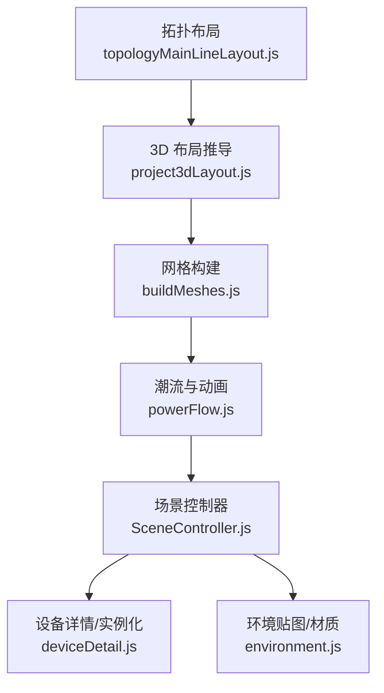
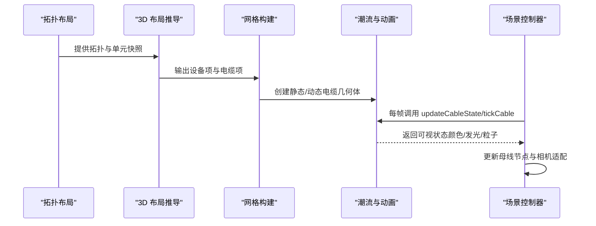
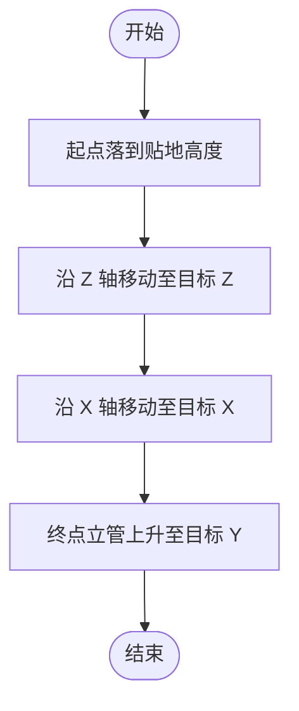
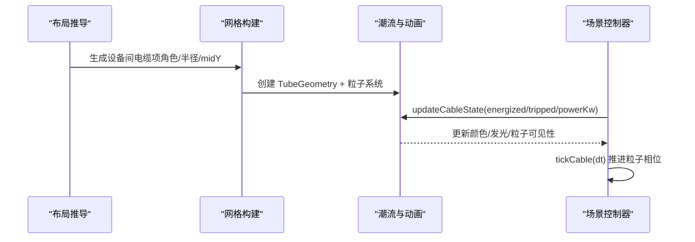
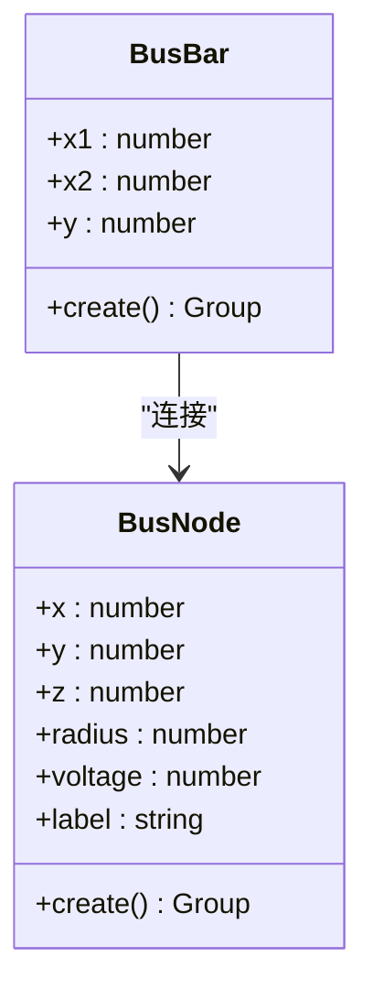
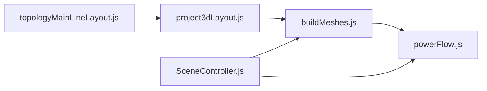

# 电缆布线系统

<cite>
**本文引用的文件**
- [buildMeshes.js](file://Web/src/components/mainline3d/buildMeshes.js)
- [powerFlow.js](file://Web/src/components/mainline3d/powerFlow.js)
- [project3dLayout.js](file://Web/src/components/mainline3d/project3dLayout.js)
- [SceneController.js](file://Web/src/components/mainline3d/SceneController.js)
- [deviceDetail.js](file://Web/src/components/mainline3d/deviceDetail.js)
- [environment.js](file://Web/src/components/mainline3d/environment.js)
- [topologyMainLineLayout.js](file://Web/src/components/topology/topologyMainLineLayout.js)
- [project3dLayout.test.mjs](file://Web/src/components/mainline3d/project3dLayout.test.mjs)
</cite>

## 目录
1. [简介](#简介)
2. [项目结构](#项目结构)
3. [核心组件](#核心组件)
4. [架构总览](#架构总览)
5. [详细组件分析](#详细组件分析)
6. [依赖关系分析](#依赖关系分析)
7. [性能考虑](#性能考虑)
8. [故障诊断指南](#故障诊断指南)
9. [结论](#结论)
10. [附录](#附录)

## 简介
本文件面向储能仿真系统的“电缆布线子系统”，聚焦以下目标：
- 静态直流电缆的正交走线算法：贴地路径规划、竖直段处理与拐角优化。
- 设备间电缆的动态布线逻辑：起点到终点的自动路径计算与碰撞规避策略。
- 电缆的视觉表现：不同电压等级的颜色编码、截面大小与材质效果。
- 性能优化：实例化渲染、LOD管理与内存占用控制。
- 配置选项、手动调整方法与故障诊断工具。

该子系统由前端 3D 可视化模块实现，基于 Three.js，负责从组态拓扑与运行时数据推导 3D 布局、生成电缆几何体并驱动实时动画与状态显示。

## 项目结构
与电缆布线相关的核心代码集中在 Web 前端的 mainline3d 组件中：
- 布局推导：将单线图拓扑转换为 3D 场景中的设备位置与连线信息。
- 网格构建：根据布局生成设备模型与电缆几何体（静态/动态）。
- 潮流与动画：根据运行功率与开关状态更新电缆颜色、发光与粒子流动。
- 场景控制器：在每帧驱动状态更新、相机适配与交互。

图表来源
- [topologyMainLineLayout.js:370-394](file://Web/src/components/topology/topologyMainLineLayout.js#L370-L394)
- [project3dLayout.js:661-799](file://Web/src/components/mainline3d/project3dLayout.js#L661-L799)
- [buildMeshes.js:644-787](file://Web/src/components/mainline3d/buildMeshes.js#L644-L787)
- [powerFlow.js:115-200](file://Web/src/components/mainline3d/powerFlow.js#L115-L200)
- [SceneController.js:919-946](file://Web/src/components/mainline3d/SceneController.js#L919-L946)

章节来源
- [project3dLayout.js:1-136](file://Web/src/components/mainline3d/project3dLayout.js#L1-L136)
- [buildMeshes.js:1-46](file://Web/src/components/mainline3d/buildMeshes.js#L1-L46)

## 核心组件
- 静态直流电缆生成器：按正交规则生成贴地路径，避免斜线与尖角扭曲。
- 设备间动态电缆：基于刚体折线+圆角曲线，支持流光与方向指示。
- 母线节点与横管：按电压等级配色，半径随规模自适应。
- 布局推导：从拓扑图生成设备与电缆项，统一接入星型母线汇流点。
- 场景控制器：每帧更新电缆状态（通电/跳闸/充放电），驱动粒子与发光。

章节来源
- [buildMeshes.js:644-787](file://Web/src/components/mainline3d/buildMeshes.js#L644-L787)
- [powerFlow.js:115-200](file://Web/src/components/mainline3d/powerFlow.js#L115-L200)
- [project3dLayout.js:661-799](file://Web/src/components/mainline3d/project3dLayout.js#L661-L799)
- [SceneController.js:919-946](file://Web/src/components/mainline3d/SceneController.js#L919-L946)

## 架构总览
整体流程如下：
1. 读取拓扑与单元快照，构建主接线布局（含母线、断路器、变压器、单元等）。
2. 为每个设备生成 3D 模型，并为连接关系生成电缆项（静态或动态）。
3. 对静态直流电缆使用正交贴地算法；对设备间电缆使用刚体折线+圆角曲线。
4. 每帧根据运行数据更新电缆状态（颜色、发光、粒子流动）。
5. 通过实例化渲染与环境贴图提升性能与真实感。

图表来源
- [project3dLayout.js:661-799](file://Web/src/components/mainline3d/project3dLayout.js#L661-L799)
- [buildMeshes.js:644-787](file://Web/src/components/mainline3d/buildMeshes.js#L644-L787)
- [powerFlow.js:115-200](file://Web/src/components/mainline3d/powerFlow.js#L115-L200)
- [SceneController.js:919-946](file://Web/src/components/mainline3d/SceneController.js#L919-L946)

## 详细组件分析

### 静态直流电缆：贴地正交走线算法
- 算法要点
  - 路径分段：起点立管→贴地高度→先南北（Z）→再东西（X）→终点立管。
  - 严格轴对齐：每段仅改变一个坐标轴，避免斜线与 TubeGeometry 尖角扭曲。
  - 贴地高度：默认 midY（可配置），端点允许小范围立管高度差。
  - 去重与容差：相邻点距离小于阈值时不重复添加，避免冗余段。
- 视觉效果
  - 每段为圆柱体 Mesh，禁用阴影以减少“被埋”感。
  - 无能量流光，保持静态 DC 电缆简洁直观。
- 关键函数与参数
  - createStaticCable：接收起点/终点坐标、半径、颜色、midY。
  - groundRoute：内部路径规划，eps 容差控制点合并。

图表来源
- [buildMeshes.js:764-787](file://Web/src/components/mainline3d/buildMeshes.js#L764-L787)

章节来源
- [buildMeshes.js:644-787](file://Web/src/components/mainline3d/buildMeshes.js#L644-L787)
- [project3dLayout.test.mjs:347-364](file://Web/src/components/mainline3d/project3dLayout.test.mjs#L347-L364)

### 设备间电缆：动态布线与碰撞规避
- 路径生成
  - 输入为正交折线点集，构建刚体曲线：直线段 + 二次贝塞尔圆角。
  - 圆角半径受限于相邻段长度比例，避免过度弯曲。
- 碰撞规避策略
  - 通过分层 midY 与设备排布偏移，减少同层线缆重叠。
  - 分支电缆短段分散到逆变器柜位，避免中心重合。
  - 母线支路重定向到母线汇流点（星型接线），统一汇聚。
- 可视化与动画
  - 根据功率方向与大小设置颜色、发光强度与粒子速度。
  - 待机/充电/放电/跳闸模式分别对应不同视觉效果。

图表来源
- [project3dLayout.js:198-321](file://Web/src/components/mainline3d/project3dLayout.js#L198-L321)
- [powerFlow.js:115-200](file://Web/src/components/mainline3d/powerFlow.js#L115-L200)
- [SceneController.js:919-946](file://Web/src/components/mainline3d/SceneController.js#L919-L946)

章节来源
- [powerFlow.js:51-113](file://Web/src/components/mainline3d/powerFlow.js#L51-L113)
- [project3dLayout.js:198-321](file://Web/src/components/mainline3d/project3dLayout.js#L198-L321)
- [project3dLayout.test.mjs:287-316](file://Web/src/components/mainline3d/project3dLayout.test.mjs#L287-L316)

### 母线节点与横管：电压等级配色与规模自适应
- 颜色编码
  - 高压（≥35kV）：铜色主体 + 琥珀环。
  - 中压（≥1kV）：琥珀主体 + 亮黄环。
  - 低压（≤1kV）：橙色主体 + 亮黄环。
- 规模自适应
  - 母线节点半径随挂接规模（长度/设备数）自适应，避免过小不可见。
- 横管与节点
  - 横管为水平圆柱，两端或一端连接母线节点。
  - 节点作为星型汇聚点，简化多支路连接。

图表来源
- [buildMeshes.js:794-818](file://Web/src/components/mainline3d/buildMeshes.js#L794-L818)
- [buildMeshes.js:740-758](file://Web/src/components/mainline3d/buildMeshes.js#L740-L758)

章节来源
- [buildMeshes.js:740-818](file://Web/src/components/mainline3d/buildMeshes.js#L740-L818)

### 布局推导与电缆项生成
- 从拓扑到 3D 布局
  - 解析电网、母线、断路器、变压器、单元（EMU/PV）等节点。
  - 生成设备项与电缆项，统一接入母线汇流点。
- 电缆项属性
  - 角色（role）：标识用途（如 unit-drop、pcs-feed、pv-inv-main/branch、dc-link）。
  - 静态标志（static）：是否使用静态正交算法。
  - 半径（radius）：按用途设定粗细。
  - 分层 midY：避免同层重叠。
- 光伏方阵区
  - 每台逆变器一块方阵，集中排布于设备区后方。
  - 方阵串线分层接入前缘汇流竖排，再经主 DC 电缆接入逆变器柜。

章节来源
- [project3dLayout.js:661-799](file://Web/src/components/mainline3d/project3dLayout.js#L661-L799)
- [project3dLayout.js:524-579](file://Web/src/components/mainline3d/project3dLayout.js#L524-L579)
- [topologyMainLineLayout.js:370-394](file://Web/src/components/topology/topologyMainLineLayout.js#L370-L394)

## 依赖关系分析
- 模块耦合
  - project3dLayout.js 依赖 topologyMainLineLayout.js 生成主接线布局。
  - buildMeshes.js 依赖 powerFlow.js 创建动态电缆与动画。
  - SceneController.js 驱动 powerFlow.js 的状态更新与动画推进。
- 外部依赖
  - Three.js：几何体、材质、粒子系统、曲线与场景管理。
- 潜在循环依赖
  - 当前结构为单向依赖，未见循环引用。

图表来源
- [project3dLayout.js:661-799](file://Web/src/components/mainline3d/project3dLayout.js#L661-L799)
- [buildMeshes.js:644-787](file://Web/src/components/mainline3d/buildMeshes.js#L644-L787)
- [powerFlow.js:115-200](file://Web/src/components/mainline3d/powerFlow.js#L115-L200)
- [SceneController.js:919-946](file://Web/src/components/mainline3d/SceneController.js#L919-L946)

章节来源
- [project3dLayout.js:1-136](file://Web/src/components/mainline3d/project3dLayout.js#L1-L136)
- [buildMeshes.js:1-46](file://Web/src/components/mainline3d/buildMeshes.js#L1-L46)

## 性能考虑
- 实例化渲染
  - 光伏组件使用 InstancedMesh 批量绘制，显著降低 draw call。
  - 电池簇细节使用实例化矩阵更新，避免重复几何体创建。
- LOD 管理
  - 动态电缆使用固定分段数与粒子数量，避免过高复杂度。
  - 静态电缆使用低面数圆柱（8 段），减少顶点与着色开销。
- 内存占用控制
  - 设备详情销毁时释放几何体与材质，防止内存泄漏。
  - 环境贴图程序化生成，避免加载大纹理。
- 渲染优化
  - 贴地电缆禁用阴影，减少阴影计算。
  - 使用 polygonOffset 避免深度冲突导致的闪烁。

章节来源
- [buildMeshes.js:520-591](file://Web/src/components/mainline3d/buildMeshes.js#L520-L591)
- [deviceDetail.js:796-818](file://Web/src/components/mainline3d/deviceDetail.js#L796-L818)
- [environment.js:1-34](file://Web/src/components/mainline3d/environment.js#L1-L34)
- [buildMeshes.js:644-679](file://Web/src/components/mainline3d/buildMeshes.js#L644-L679)

## 故障诊断指南
- 常见问题
  - 电缆未显示：检查电缆项 role 与 static 标志是否正确，确认起点/终点坐标有效。
  - 路径异常：验证 midY 分层是否合理，避免同层重叠导致遮挡。
  - 动画不生效：确认 SceneController 每帧调用 updateCableState 与 tickCable。
- 调试方法
  - 使用测试用例断言：验证静态电缆段数、轴对齐与贴地高度。
  - 检查母线节点颜色与半径是否符合电压等级与规模。
  - 观察设备详情销毁流程，确保资源释放。
- 配置调整
  - 调整 midY 以改变贴地高度，避免与其他设备干涉。
  - 调整 radius 以区分主干与分支电缆。
  - 修改 cornerRadius 以控制动态电缆圆角平滑度。

章节来源
- [project3dLayout.test.mjs:347-364](file://Web/src/components/mainline3d/project3dLayout.test.mjs#L347-L364)
- [project3dLayout.test.mjs:287-316](file://Web/src/components/mainline3d/project3dLayout.test.mjs#L287-L316)
- [SceneController.js:919-946](file://Web/src/components/mainline3d/SceneController.js#L919-L946)

## 结论
本电缆布线系统通过严格的正交走线算法与动态曲线建模，实现了静态直流电缆与设备间电缆的高效可视化。结合电压等级配色、规模自适应与实例化渲染，系统在性能与真实感之间取得平衡。通过分层 midY 与星型母线汇流点设计，有效避免了碰撞与重叠问题。未来可扩展更多碰撞检测与自动路由优化策略，进一步提升复杂场景下的布线质量。

## 附录
- 配置选项
  - midY：贴地高度，影响静态电缆路径。
  - radius：电缆半径，区分主干与分支。
  - cornerRadius：动态电缆圆角半径，控制平滑度。
  - voltage：母线节点电压，决定颜色编码。
- 手动调整方法
  - 在布局推导阶段调整设备位置与电缆项属性。
  - 通过 SceneController 更新运行数据以驱动动画。
- 故障诊断工具
  - 单元测试断言：验证路径正确性与视觉一致性。
  - 资源释放检查：确保设备详情销毁时释放内存。