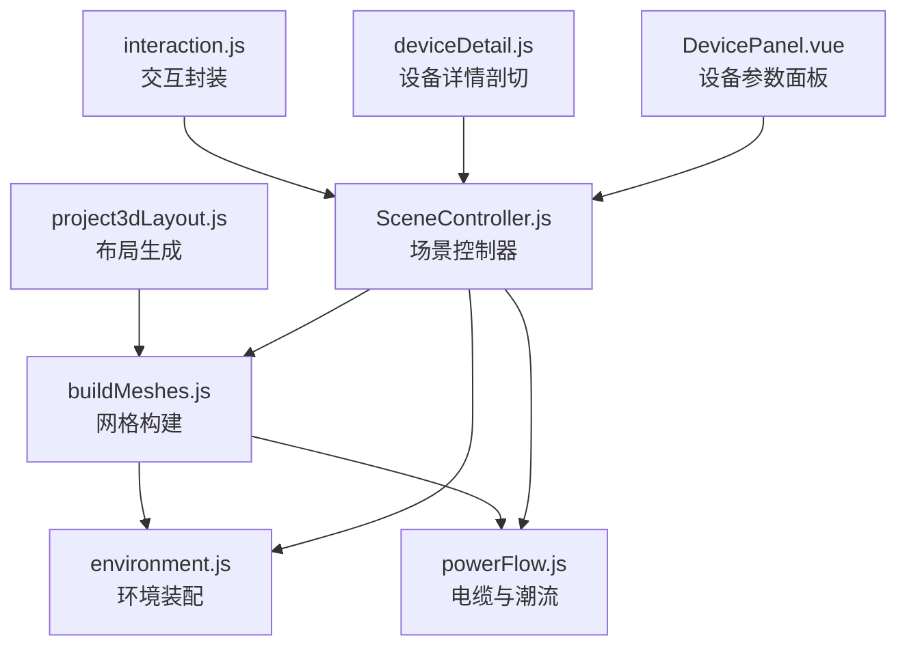
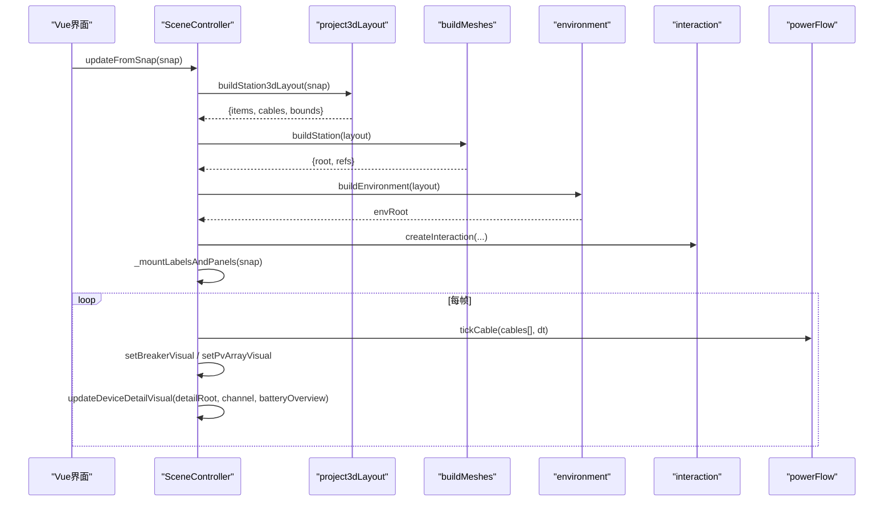
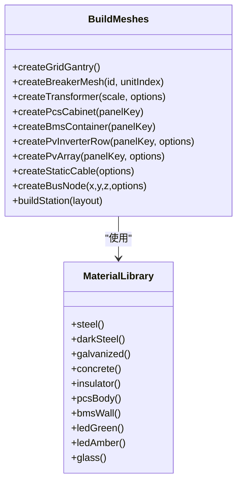
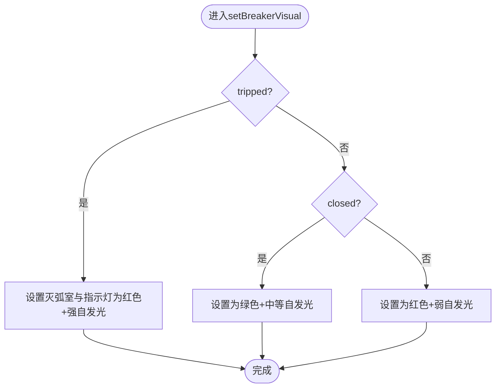
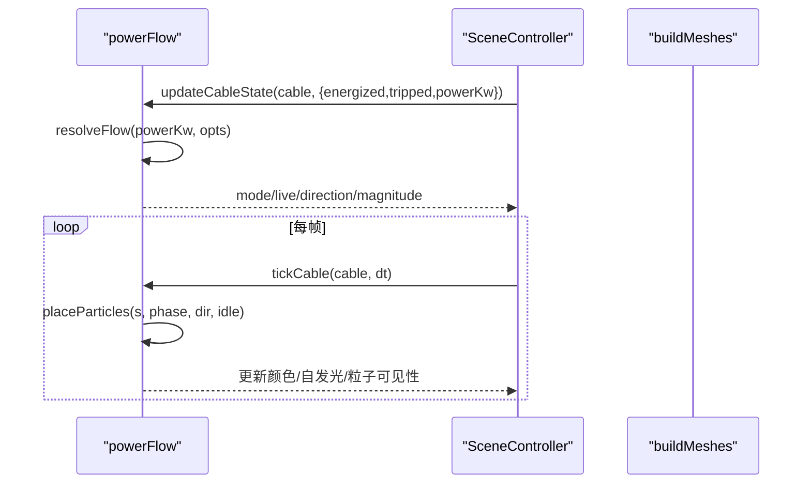
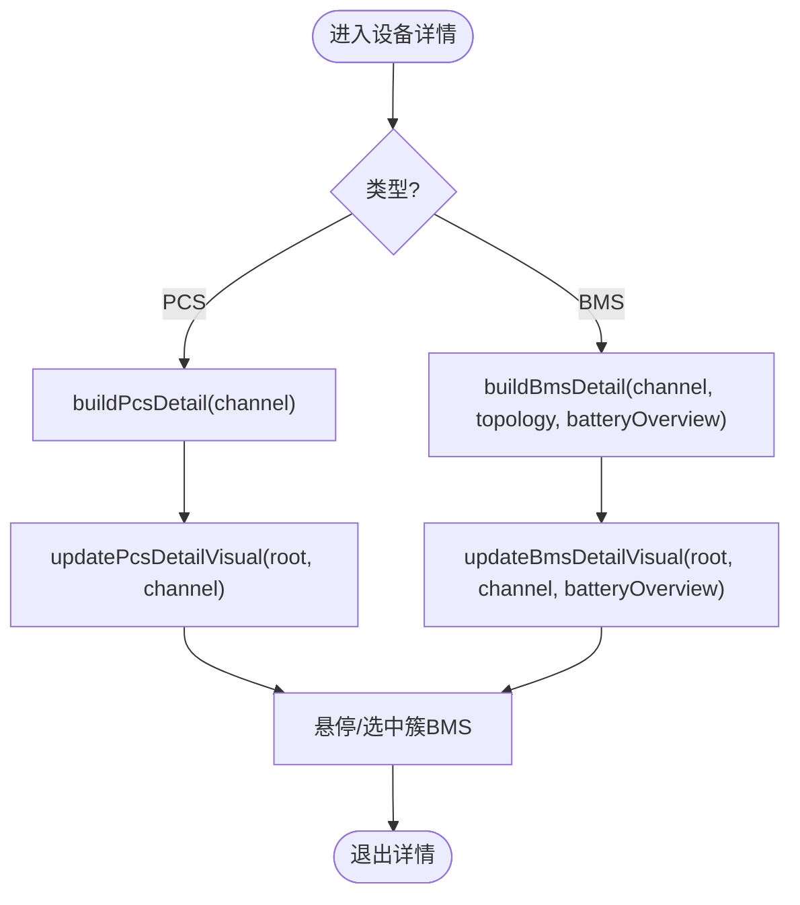
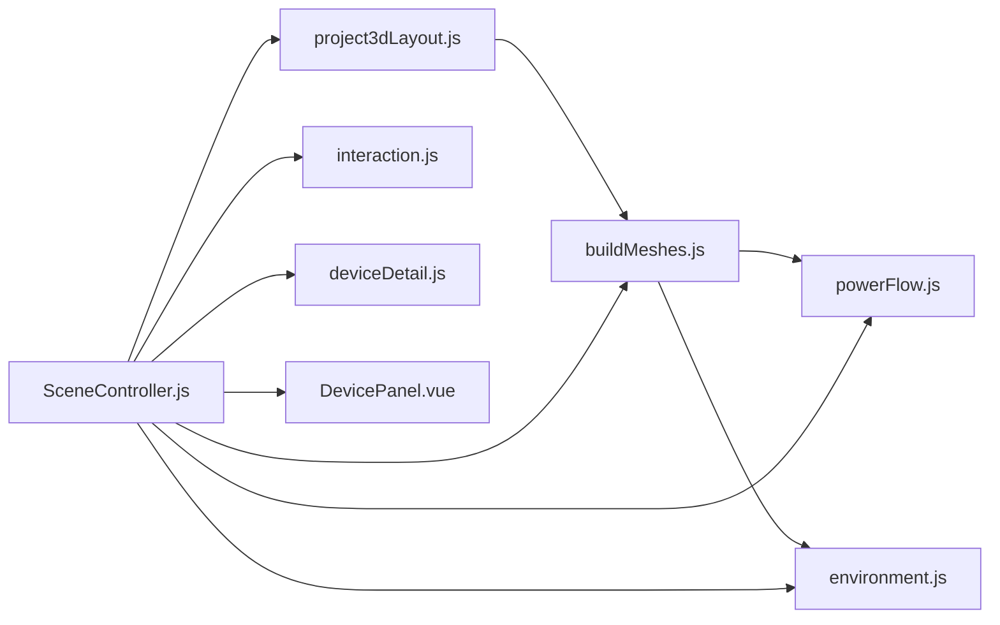

# 设备模型构建

<cite>
**本文引用的文件**
- [buildMeshes.js](file://Web/src/components/mainline3d/buildMeshes.js)
- [deviceDetail.js](file://Web/src/components/mainline3d/deviceDetail.js)
- [SceneController.js](file://Web/src/components/mainline3d/SceneController.js)
- [environment.js](file://Web/src/components/mainline3d/environment.js)
- [interaction.js](file://Web/src/components/mainline3d/interaction.js)
- [powerFlow.js](file://Web/src/components/mainline3d/powerFlow.js)
- [layout.js](file://Web/src/components/mainline3d/layout.js)
- [project3dLayout.js](file://Web/src/components/mainline3d/project3dLayout.js)
- [DevicePanel.vue](file://Web/src/components/mainline3d/DevicePanel.vue)
</cite>

## 目录
1. [简介](#简介)
2. [项目结构](#项目结构)
3. [核心组件](#核心组件)
4. [架构总览](#架构总览)
5. [详细组件分析](#详细组件分析)
6. [依赖关系分析](#依赖关系分析)
7. [性能考虑](#性能考虑)
8. [故障排查指南](#故障排查指南)
9. [结论](#结论)
10. [附录：新设备类型开发指南](#附录新设备类型开发指南)

## 简介
本文件面向储能仿真系统的3D主接线可视化，系统性说明各类设备（BMS舱、PCS柜、变压器、断路器、母线、电缆等）的几何建模实现、材质系统、状态指示与动画、层次结构与变换矩阵管理，以及设备细节面板的实现方式。同时提供新增设备类型的完整开发指南，涵盖几何体创建、材质配置与交互逻辑集成。

## 项目结构
3D主接线场景由“布局生成 → 网格构建 → 环境装配 → 交互控制 → 实时刷新”构成。关键模块职责如下：
- 布局生成：将组态拓扑或快照转换为3D布局项与连线
- 网格构建：按模板实例化设备网格、母线节点、电缆等
- 环境装配：程序化生成地面、道路、绿化、路灯、天空穹顶等
- 交互控制：OrbitControls + Raycaster 处理点击、双击、悬停
- 实时刷新：根据实时数据更新设备外观、潮流动画、详情面板

图表来源
- [project3dLayout.js:1-120](file://Web/src/components/mainline3d/project3dLayout.js#L1-L120)
- [buildMeshes.js:862-1007](file://Web/src/components/mainline3d/buildMeshes.js#L862-L1007)
- [environment.js:222-439](file://Web/src/components/mainline3d/environment.js#L222-L439)
- [powerFlow.js:118-200](file://Web/src/components/mainline3d/powerFlow.js#L118-L200)
- [SceneController.js:55-142](file://Web/src/components/mainline3d/SceneController.js#L55-L142)
- [interaction.js:1-120](file://Web/src/components/mainline3d/interaction.js#L1-L120)
- [deviceDetail.js:785-794](file://Web/src/components/mainline3d/deviceDetail.js#L785-L794)
- [DevicePanel.vue:1-82](file://Web/src/components/mainline3d/DevicePanel.vue#L1-L82)

章节来源
- [project3dLayout.js:1-120](file://Web/src/components/mainline3d/project3dLayout.js#L1-L120)
- [buildMeshes.js:862-1007](file://Web/src/components/mainline3d/buildMeshes.js#L862-L1007)
- [environment.js:222-439](file://Web/src/components/mainline3d/environment.js#L222-L439)
- [powerFlow.js:118-200](file://Web/src/components/mainline3d/powerFlow.js#L118-L200)
- [SceneController.js:55-142](file://Web/src/components/mainline3d/SceneController.js#L55-L142)
- [interaction.js:1-120](file://Web/src/components/mainline3d/interaction.js#L1-L120)
- [deviceDetail.js:785-794](file://Web/src/components/mainline3d/deviceDetail.js#L785-L794)
- [DevicePanel.vue:1-82](file://Web/src/components/mainline3d/DevicePanel.vue#L1-L82)

## 核心组件
- 网格构建器：集中定义材质库与设备工厂函数，按模板ID实例化设备网格
- 场景控制器：初始化Three.js渲染管线、灯光、地面、交互、标签与面板挂载，驱动循环刷新
- 环境生成器：程序化混凝土贴图、道路、绿化、路灯、天空穹顶与雾环
- 交互管理器：封装OrbitControls与Raycaster，统一处理单击/双击/悬停事件
- 设备详情：独立于全站场景的剖切视图，支持BMS簇级高亮、SOC着色、温度标记
- 潮流与电缆：正交刚体路径、圆角软化、粒子流光与尾迹，按功率方向与大小动态更新

章节来源
- [buildMeshes.js:10-46](file://Web/src/components/mainline3d/buildMeshes.js#L10-L46)
- [SceneController.js:55-142](file://Web/src/components/mainline3d/SceneController.js#L55-L142)
- [environment.js:101-144](file://Web/src/components/mainline3d/environment.js#L101-L144)
- [interaction.js:1-120](file://Web/src/components/mainline3d/interaction.js#L1-L120)
- [deviceDetail.js:101-219](file://Web/src/components/mainline3d/deviceDetail.js#L101-L219)
- [powerFlow.js:118-200](file://Web/src/components/mainline3d/powerFlow.js#L118-L200)

## 架构总览

图表来源
- [SceneController.js:279-319](file://Web/src/components/mainline3d/SceneController.js#L279-L319)
- [project3dLayout.js:967-974](file://Web/src/components/mainline3d/project3dLayout.js#L967-L974)
- [buildMeshes.js:897-1007](file://Web/src/components/mainline3d/buildMeshes.js#L897-L1007)
- [environment.js:222-439](file://Web/src/components/mainline3d/environment.js#L222-L439)
- [powerFlow.js:268-314](file://Web/src/components/mainline3d/powerFlow.js#L268-L314)

## 详细组件分析

### 设备网格构建与材质系统
- 材质库：集中定义金属、绝缘子、玻璃、LED指示灯等材质，使用标准PBR属性（metalness/roughness/emissive）
- 设备工厂：按模板ID映射到具体构建函数，如断路器、变压器、PCS柜、BMS舱、光伏方阵、直流母线、汇流点等
- 标签与拾取：通过userData注入pickId、panelKey、unitIndex等，用于交互拾取与面板绑定
- 层次结构：每个设备为THREE.Group，内部mesh按父子关系组织，位置与旋转在局部坐标系中设置

图表来源
- [buildMeshes.js:10-46](file://Web/src/components/mainline3d/buildMeshes.js#L10-L46)
- [buildMeshes.js:125-185](file://Web/src/components/mainline3d/buildMeshes.js#L125-L185)
- [buildMeshes.js:226-291](file://Web/src/components/mainline3d/buildMeshes.js#L226-L291)
- [buildMeshes.js:333-394](file://Web/src/components/mainline3d/buildMeshes.js#L333-L394)
- [buildMeshes.js:400-477](file://Web/src/components/mainline3d/buildMeshes.js#L400-L477)
- [buildMeshes.js:523-591](file://Web/src/components/mainline3d/buildMeshes.js#L523-L591)
- [buildMeshes.js:794-860](file://Web/src/components/mainline3d/buildMeshes.js#L794-L860)
- [buildMeshes.js:862-1007](file://Web/src/components/mainline3d/buildMeshes.js#L862-L1007)

章节来源
- [buildMeshes.js:10-46](file://Web/src/components/mainline3d/buildMeshes.js#L10-L46)
- [buildMeshes.js:125-185](file://Web/src/components/mainline3d/buildMeshes.js#L125-L185)
- [buildMeshes.js:226-291](file://Web/src/components/mainline3d/buildMeshes.js#L226-L291)
- [buildMeshes.js:333-394](file://Web/src/components/mainline3d/buildMeshes.js#L333-L394)
- [buildMeshes.js:400-477](file://Web/src/components/mainline3d/buildMeshes.js#L400-L477)
- [buildMeshes.js:523-591](file://Web/src/components/mainline3d/buildMeshes.js#L523-L591)
- [buildMeshes.js:794-860](file://Web/src/components/mainline3d/buildMeshes.js#L794-L860)
- [buildMeshes.js:862-1007](file://Web/src/components/mainline3d/buildMeshes.js#L862-L1007)

### 断路器视觉与状态指示
- 三相柱式断路器：灭弧室筒、支撑绝缘子、操作机构箱、状态指示灯条
- 状态映射：合闸→绿色发光；分闸→红色发光；跳闸→强红发光并提高自发光强度
- 交互：通过pickId与unitIndex识别点击目标，触发主控切换

图表来源
- [buildMeshes.js:187-220](file://Web/src/components/mainline3d/buildMeshes.js#L187-L220)

章节来源
- [buildMeshes.js:125-185](file://Web/src/components/mainline3d/buildMeshes.js#L125-L185)
- [buildMeshes.js:187-220](file://Web/src/components/mainline3d/buildMeshes.js#L187-L220)

### 变压器与PCS柜建模
- 油浸主变：油箱、片式散热器、油枕、高压/低压套管、基础滚轮、铭牌区
- 单元箱变：预制舱外观、高低压仓分隔线、百叶通风、仓门把手、顶部散热罩、出线套管小柱
- PCS柜：双开门、观察窗、顶部与侧向百叶、状态灯带、底部进线盖板、底座

章节来源
- [buildMeshes.js:226-291](file://Web/src/components/mainline3d/buildMeshes.js#L226-L291)
- [buildMeshes.js:294-327](file://Web/src/components/mainline3d/buildMeshes.js#L294-L327)
- [buildMeshes.js:333-394](file://Web/src/components/mainline3d/buildMeshes.js#L333-L394)

### BMS舱与光伏方阵
- BMS舱：ISO箱体、波纹侧板、端门锁杆、屋顶空调、侧检修门、铭牌、底座梁
- 光伏方阵：组件行列由stringCount/modulesPerString决定，使用InstancedMesh提升性能；每串单独出线至前缘汇流竖排，避免重合

章节来源
- [buildMeshes.js:400-477](file://Web/src/components/mainline3d/buildMeshes.js#L400-L477)
- [buildMeshes.js:523-591](file://Web/src/components/mainline3d/buildMeshes.js#L523-L591)
- [buildMeshes.js:600-642](file://Web/src/components/mainline3d/buildMeshes.js#L600-L642)

### 电缆与潮流动画
- 静态电缆：贴地正交走线，仅轴对齐圆柱段，无能量流光
- 动态电缆：正交折线→刚体直线段+拐角二次贝塞尔圆角；TubeGeometry生成管体；粒子与尾迹模拟能量流动
- 潮流解析：根据有功功率符号判断充/放电方向，结合是否带电与跳闸状态确定模式
- 刷新循环：tickCable按dt推进相位，更新粒子位置与自发光脉动

图表来源
- [powerFlow.js:26-43](file://Web/src/components/mainline3d/powerFlow.js#L26-L43)
- [powerFlow.js:118-200](file://Web/src/components/mainline3d/powerFlow.js#L118-L200)
- [powerFlow.js:206-262](file://Web/src/components/mainline3d/powerFlow.js#L206-L262)
- [powerFlow.js:268-314](file://Web/src/components/mainline3d/powerFlow.js#L268-L314)

章节来源
- [powerFlow.js:118-200](file://Web/src/components/mainline3d/powerFlow.js#L118-L200)
- [powerFlow.js:206-262](file://Web/src/components/mainline3d/powerFlow.js#L206-L262)
- [powerFlow.js:268-314](file://Web/src/components/mainline3d/powerFlow.js#L268-L314)

### 设备细节面板（PCS/BMS剖切）
- PCS详情：柜体剖切、层架与功率模块、DC/AC母排、三相出线柱、状态灯与功率色带、控制盒屏幕
- BMS详情：透明舱体、簇架与电芯阵列（InstancedMesh）、簇级悬停高亮与选中前移、最高/最低温单体标记、簇信息面板
- 实时更新：根据通道数据更新PCS运行模式、BMS SOC着色与电流发光强度

图表来源
- [deviceDetail.js:101-219](file://Web/src/components/mainline3d/deviceDetail.js#L101-L219)
- [deviceDetail.js:300-598](file://Web/src/components/mainline3d/deviceDetail.js#L300-L598)
- [deviceDetail.js:740-794](file://Web/src/components/mainline3d/deviceDetail.js#L740-L794)

章节来源
- [deviceDetail.js:101-219](file://Web/src/components/mainline3d/deviceDetail.js#L101-L219)
- [deviceDetail.js:300-598](file://Web/src/components/mainline3d/deviceDetail.js#L300-L598)
- [deviceDetail.js:740-794](file://Web/src/components/mainline3d/deviceDetail.js#L740-L794)

### 环境与光照
- 程序化混凝土贴图：噪点、骨料斑点、模板缝、细裂纹；粗糙度图增强真实感
- 场景元素：水泥垫、巡视道路、路缘、绿化带、树木灌木、路灯（部分带点光源）、围栏、天空穹顶、地平线雾环
- 自适应范围：依据布局边界计算宽度与纵深，调整地面尺寸与雾效距离

章节来源
- [environment.js:4-99](file://Web/src/components/mainline3d/environment.js#L4-L99)
- [environment.js:222-439](file://Web/src/components/mainline3d/environment.js#L222-L439)

### 交互与事件分发
- OrbitControls：阻尼、极角限制、缩放范围、鼠标按钮映射
- Raycaster拾取：优先识别断路器（pickId），其次设备面板（panelKey）
- 双击BMS：进入设备详情；单击设备：切换面板显示/隐藏
- 悬停BMS详情：簇级高亮与光标变化

章节来源
- [interaction.js:1-120](file://Web/src/components/mainline3d/interaction.js#L1-L120)
- [SceneController.js:116-142](file://Web/src/components/mainline3d/SceneController.js#L116-L142)
- [SceneController.js:485-561](file://Web/src/components/mainline3d/SceneController.js#L485-L561)

### 设备参数面板（DevicePanel.vue）
- 展示PCS/BMS/PV/PV-Arry的关键参数与操作按钮
- 双向绑定输入框与目标值，触发启停、设功、设无功、清故障等事件
- 样式区分PCS/BMS/PV三类面板，支持悬浮高亮

章节来源
- [DevicePanel.vue:1-82](file://Web/src/components/mainline3d/DevicePanel.vue#L1-L82)
- [DevicePanel.vue:84-291](file://Web/src/components/mainline3d/DevicePanel.vue#L84-L291)
- [DevicePanel.vue:293-423](file://Web/src/components/mainline3d/DevicePanel.vue#L293-L423)

## 依赖关系分析

图表来源
- [project3dLayout.js:967-974](file://Web/src/components/mainline3d/project3dLayout.js#L967-L974)
- [buildMeshes.js:897-1007](file://Web/src/components/mainline3d/buildMeshes.js#L897-L1007)
- [SceneController.js:55-142](file://Web/src/components/mainline3d/SceneController.js#L55-L142)

章节来源
- [project3dLayout.js:967-974](file://Web/src/components/mainline3d/project3dLayout.js#L967-L974)
- [buildMeshes.js:897-1007](file://Web/src/components/mainline3d/buildMeshes.js#L897-L1007)
- [SceneController.js:55-142](file://Web/src/components/mainline3d/SceneController.js#L55-L142)

## 性能考虑
- 使用InstancedMesh批量绘制光伏组件与BMS电芯，减少draw call
- 贴地电缆避免阴影投射与接收，降低阴影计算开销
- 环境元素数量与路灯点光源按需分布，控制性能
- 相机远裁剪面与雾效随场景跨度自适应，避免无效渲染
- 面板与标签使用CSS2DObject，避免复杂UI叠加带来的GPU压力

[本节为通用指导，不直接分析具体文件]

## 故障排查指南
- 设备不可见：检查buildStation是否正确添加mesh到scene；确认position与rotation未导致设备位于地面以下或被遮挡
- 交互失效：确认mesh.userData.pickId或panelKey已正确设置；interaction.js中raycaster拾取顺序与事件监听是否正常
- 潮流动画异常：检查updateCableState传入的energized/tripped/powerKw是否符合约定；tickCable是否在每帧调用
- 详情面板不刷新：确认enterDeviceDetail/exitDeviceDetail流程；BMS详情需启动电池概览轮询（_startBatteryPoll）
- 材质闪烁：避免共面几何重叠；合理设置polygonOffset与renderOrder

章节来源
- [interaction.js:35-86](file://Web/src/components/mainline3d/interaction.js#L35-L86)
- [powerFlow.js:206-262](file://Web/src/components/mainline3d/powerFlow.js#L206-L262)
- [SceneController.js:631-725](file://Web/src/components/mainline3d/SceneController.js#L631-L725)

## 结论
该3D主接线可视化系统通过“布局生成—网格构建—环境装配—交互控制—实时刷新”的清晰分层，实现了储能站设备的逼真建模与动态表现。材质系统采用PBR标准，状态指示与动画直观反映设备运行工况；设备详情面板提供深入的参数与交互能力。整体架构具备良好的扩展性，便于新增设备类型与功能模块。

[本节为总结性内容，不直接分析具体文件]

## 附录：新设备类型开发指南
新增设备类型需完成以下四步：

1. 几何体创建
- 在buildMeshes.js中添加新的createXxxMesh函数，返回THREE.Group，包含必要mesh与userData（kind、pickId、panelKey等）
- 若为复合设备，可组合多个基础几何体（box/cyl/自定义）并按父子关系组织

2. 材质配置
- 在MAT材质库中添加对应材质工厂函数，设置color/metalness/roughness/emissive等属性
- 如需状态指示，预留indicatorMat或bodyMat以便后续更新

3. 模板注册
- 在TEMPLATE_MODELS中注册新模板ID到构建函数的映射
- 在buildStation中处理特殊逻辑（如附加labelAnchor或panelAnchor）

4. 交互与刷新
- 在interaction.js中确保拾取能命中新设备（userData.pickId或panelKey）
- 在SceneController中实现状态更新函数（如setXxxVisual），并在每帧或数据变更时调用
- 如需详情面板，参考deviceDetail.js实现剖切视图与实时更新

示例路径参考
- 几何构建：[buildMeshes.js:125-185](file://Web/src/components/mainline3d/buildMeshes.js#L125-L185)
- 材质库：[buildMeshes.js:10-46](file://Web/src/components/mainline3d/buildMeshes.js#L10-L46)
- 模板注册：[buildMeshes.js:862-891](file://Web/src/components/mainline3d/buildMeshes.js#L862-L891)
- 交互拾取：[interaction.js:59-86](file://Web/src/components/mainline3d/interaction.js#L59-L86)
- 详情面板：[deviceDetail.js:785-794](file://Web/src/components/mainline3d/deviceDetail.js#L785-L794)

章节来源
- [buildMeshes.js:10-46](file://Web/src/components/mainline3d/buildMeshes.js#L10-L46)
- [buildMeshes.js:125-185](file://Web/src/components/mainline3d/buildMeshes.js#L125-L185)
- [buildMeshes.js:862-891](file://Web/src/components/mainline3d/buildMeshes.js#L862-L891)
- [interaction.js:59-86](file://Web/src/components/mainline3d/interaction.js#L59-L86)
- [deviceDetail.js:785-794](file://Web/src/components/mainline3d/deviceDetail.js#L785-L794)