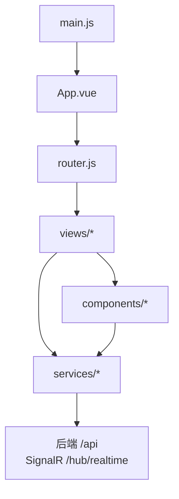
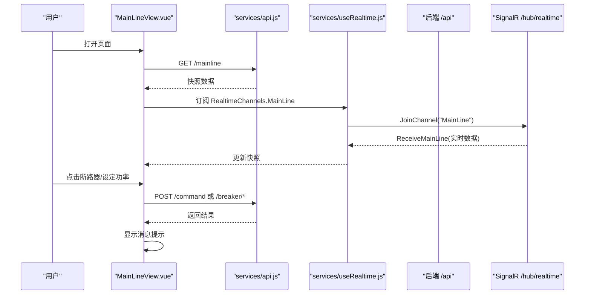
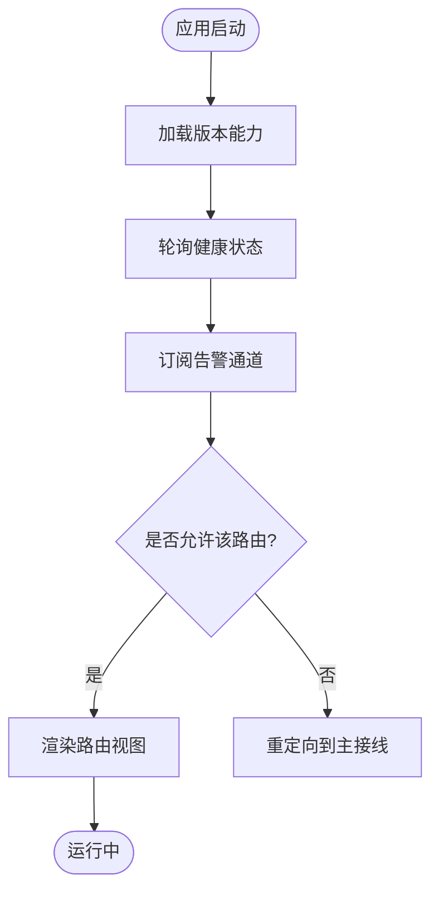
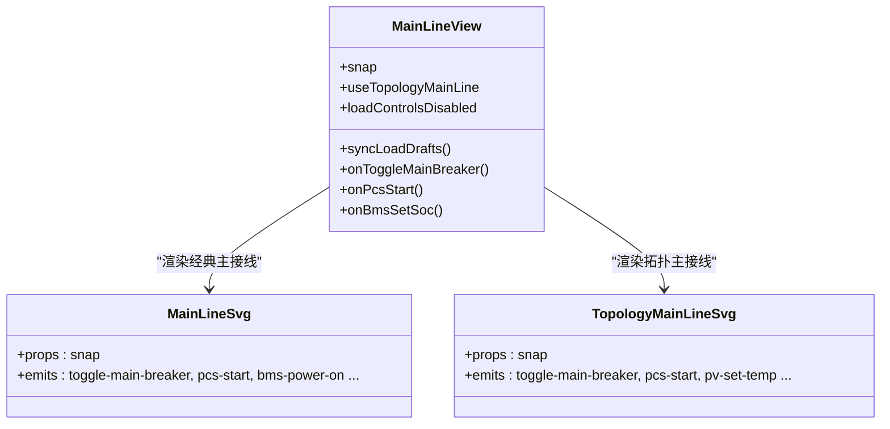
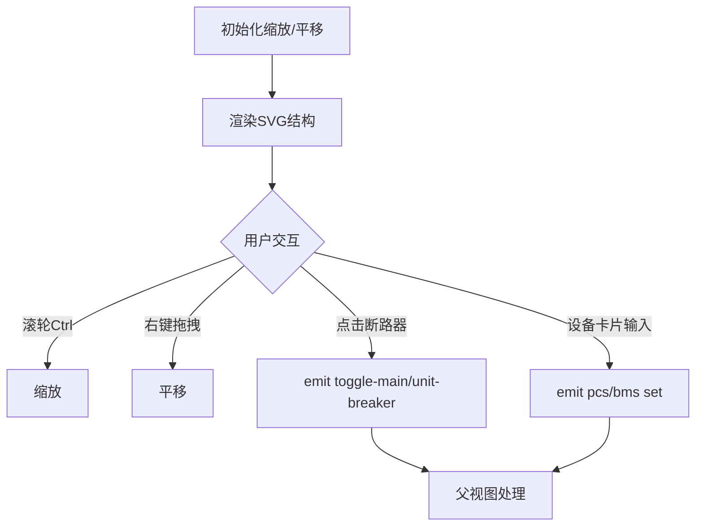
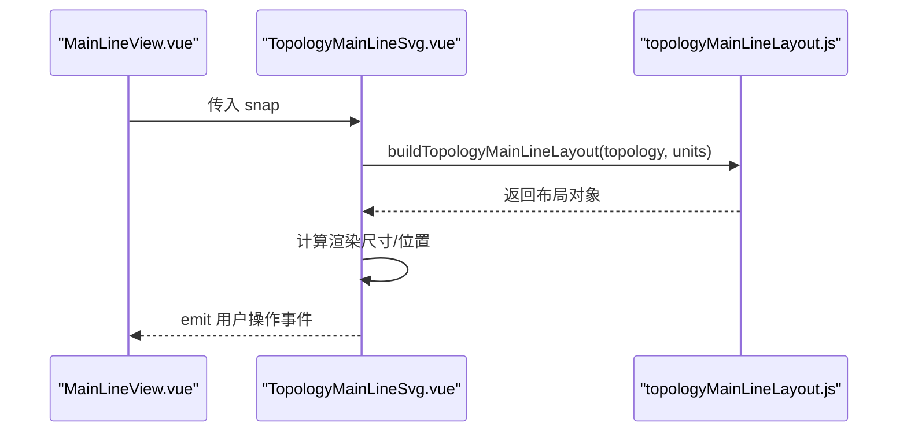
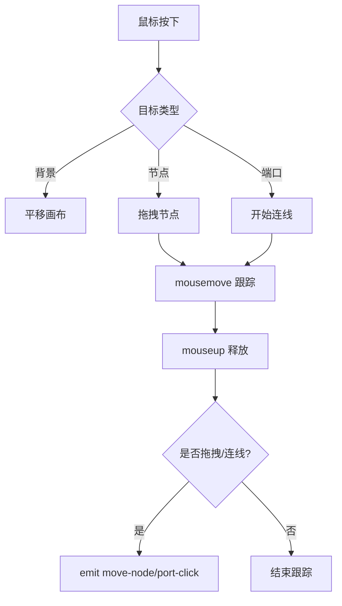
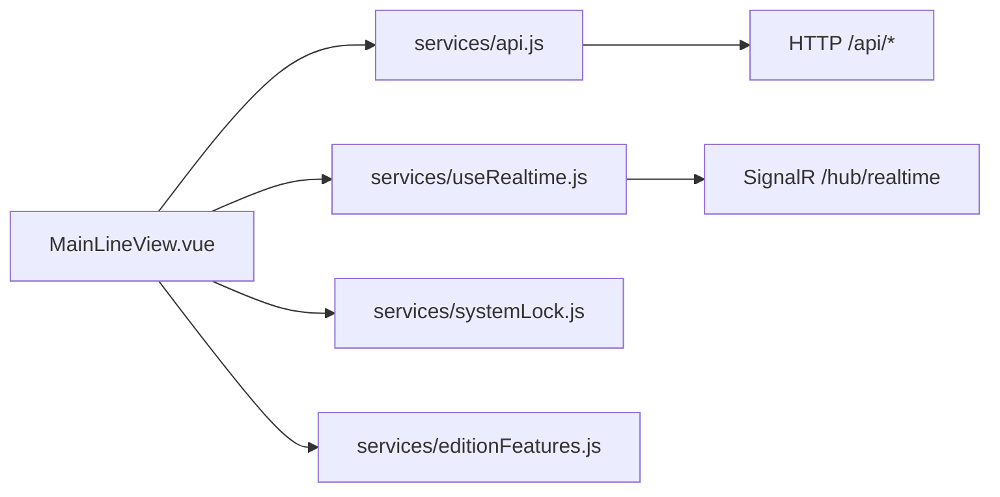
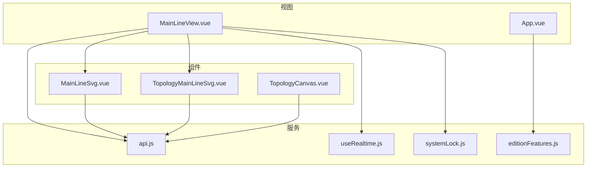

# Vue组件架构

<cite>
**本文引用的文件**
- [main.js](file://Web/src/main.js)
- [App.vue](file://Web/src/App.vue)
- [router.js](file://Web/src/router.js)
- [package.json](file://Web/package.json)
- [MainLineView.vue](file://Web/src/views/MainLineView.vue)
- [MainLineSvg.vue](file://Web/src/components/MainLineSvg.vue)
- [TopologyMainLineSvg.vue](file://Web/src/components/TopologyMainLineSvg.vue)
- [TopologyCanvas.vue](file://Web/src/components/topology/TopologyCanvas.vue)
- [api.js](file://Web/src/services/api.js)
- [useRealtime.js](file://Web/src/services/useRealtime.js)
- [systemLock.js](file://Web/src/services/systemLock.js)
- [editionFeatures.js](file://Web/src/services/editionFeatures.js)
- [app.css](file://Web/src/styles/app.css)
</cite>

## 目录
1. [简介](#简介)
2. [项目结构](#项目结构)
3. [核心组件](#核心组件)
4. [架构总览](#架构总览)
5. [详细组件分析](#详细组件分析)
6. [依赖关系分析](#依赖关系分析)
7. [性能考量](#性能考量)
8. [故障排查指南](#故障排查指南)
9. [结论](#结论)
10. [附录：扩展与最佳实践](#附录：扩展与最佳实践)

## 简介
本仓库前端采用 Vue 3 + Vite，使用组合式 API（Composition API）组织页面与组件。整体以“应用外壳 + 侧边导航 + 路由视图”的布局为基础，通过服务层封装 HTTP 与 SignalR 实时通信，结合可复用拓扑与主接线可视化组件，实现储能仿真系统的监控、组态编辑与运维工具能力。文档聚焦于组件层次结构、路由配置、页面组织方式、核心组件设计模式（组合式API、事件驱动通信、状态管理）、图标系统、拓扑组件与可复用组件的实现，并给出开发规范、样式组织与性能优化建议，以及扩展指南（新增组件、集成第三方库、测试方法）。

## 项目结构
前端代码位于 Web/src，主要目录与职责如下：
- src/main.js：应用入口，注册 Element Plus、全局图标、国际化语言包、路由与主题样式，启动应用。
- src/App.vue：应用外壳，包含顶部状态栏、左侧菜单、路由视图容器与系统锁定遮罩。
- src/router.js：基于 vue-router 的路由表与前置守卫，按版本能力控制路由访问。
- src/views/*：页面级视图，如主接线、电池、告警、命令输入等。
- src/components/*：可复用组件，包括主接线 SVG、拓扑画布、3D场景控制器封装等。
- src/services/*：服务层，封装 axios 请求、SignalR 频道订阅、版本能力加载、系统锁状态等。
- src/styles/app.css：全局样式与通用 UI 样式。

图表来源
- [main.js:1-24](file://Web/src/main.js#L1-L24)
- [App.vue:1-150](file://Web/src/App.vue#L1-L150)
- [router.js:1-42](file://Web/src/router.js#L1-L42)

章节来源
- [main.js:1-24](file://Web/src/main.js#L1-L24)
- [package.json:1-26](file://Web/package.json#L1-L26)

## 核心组件
- 应用外壳 App.vue：负责全局状态（就绪、告警、系统锁定）、菜单可见性（基于版本能力）、路由挂载与全屏遮罩。
- 主接线视图 MainLineView.vue：聚合概览指标、两种主接线渲染（经典SVG与拓扑SVG），处理断路器、PCS/BMS/PV 操作，并通过 useRealtime 订阅实时数据。
- 主接线 SVG 组件 MainLineSvg.vue：纯展示+交互的 SVG 单线图，支持缩放、平移、点击断路器、设备卡片内嵌表单设定功率/SOC。
- 拓扑主接线 TopologyMainLineSvg.vue：根据工程组态动态生成布局与连线，渲染电网、母线、变压器、电表、负载、单元（EMU/PV）及 PCS/BMS 卡片。
- 拓扑画布 TopologyCanvas.vue：拖拽节点、缩放平移、端口连线、网格吸附、选择与问题高亮，用于组态编辑。
- 服务层 api.js：统一 axios 实例、拦截器、REST 接口与 SignalR Hub 连接；useRealtime.js：封装频道订阅与生命周期管理；systemLock.js：全局系统锁定状态；editionFeatures.js：版本能力开关与路由权限校验。

章节来源
- [App.vue:1-150](file://Web/src/App.vue#L1-L150)
- [MainLineView.vue:1-655](file://Web/src/views/MainLineView.vue#L1-L655)
- [MainLineSvg.vue:1-740](file://Web/src/components/MainLineSvg.vue#L1-L740)
- [TopologyMainLineSvg.vue:1-800](file://Web/src/components/TopologyMainLineSvg.vue#L1-L800)
- [TopologyCanvas.vue:1-475](file://Web/src/components/topology/TopologyCanvas.vue#L1-L475)
- [api.js:1-88](file://Web/src/services/api.js#L1-L88)
- [useRealtime.js:1-39](file://Web/src/services/useRealtime.js#L1-L39)
- [systemLock.js:1-47](file://Web/src/services/systemLock.js#L1-L47)
- [editionFeatures.js:1-49](file://Web/src/services/editionFeatures.js#L1-L49)

## 架构总览
前端采用“视图-组件-服务”的分层架构：
- 视图层（views）：页面编排与业务逻辑编排，调用服务获取数据，监听实时推送，触发用户操作。
- 组件层（components）：可复用的可视化与交互组件，通过 props 接收数据，通过 emits 向上抛出事件。
- 服务层（services）：网络请求、实时通信、全局状态与能力开关，被视图与组件共享。

图表来源
- [MainLineView.vue:165-592](file://Web/src/views/MainLineView.vue#L165-L592)
- [api.js:14-88](file://Web/src/services/api.js#L14-L88)
- [useRealtime.js:8-39](file://Web/src/services/useRealtime.js#L8-L39)

## 详细组件分析

### 应用外壳 App.vue
- 功能：顶部状态（就绪/告警）、侧边菜单（按版本能力显示）、路由视图容器、系统锁定遮罩。
- 组合式API：ref/reactive 管理 ready、alert、features；onMounted 轮询健康、加载版本能力、订阅告警通道。
- 组件间通信：通过 services 暴露的全局状态 systemLock 与 editionFeatures 控制界面行为。
- 错误处理：健康检查与告警订阅失败时忽略异常，保证界面可用。

图表来源
- [App.vue:105-149](file://Web/src/App.vue#L105-L149)
- [editionFeatures.js:17-49](file://Web/src/services/editionFeatures.js#L17-L49)
- [router.js:26-39](file://Web/src/router.js#L26-L39)

章节来源
- [App.vue:1-150](file://Web/src/App.vue#L1-L150)
- [editionFeatures.js:1-49](file://Web/src/services/editionFeatures.js#L1-L49)
- [router.js:1-42](file://Web/src/router.js#L1-L42)

### 主接线视图 MainLineView.vue
- 功能：电站概览指标、两种主接线渲染切换（经典SVG/拓扑SVG）、传播母线与设备明细表格、用户操作（断路器、PCS/BMS/PV 控制、负载与电网设定）。
- 组合式API：ref/computed 管理快照与草稿值；useRealtime 订阅实时数据；格式化函数统一数值展示。
- 组件间通信：向子组件 MainLineSvg/TopologyMainLineSvg 传递 snap 数据，通过事件回调处理用户操作。
- 错误处理：命令执行失败时通过 ElMessage 提示；参数校验防止非法输入。

图表来源
- [MainLineView.vue:1-655](file://Web/src/views/MainLineView.vue#L1-L655)
- [MainLineSvg.vue:162-183](file://Web/src/components/MainLineSvg.vue#L162-L183)
- [TopologyMainLineSvg.vue:405-425](file://Web/src/components/TopologyMainLineSvg.vue#L405-L425)

章节来源
- [MainLineView.vue:1-655](file://Web/src/views/MainLineView.vue#L1-L655)

### 主接线 SVG 组件 MainLineSvg.vue
- 功能：SVG 绘制电网、母线、断路器、单元变、PCS/BMS 支路；支持缩放、平移、点击断路器；设备卡片内嵌表单设定功率/SOC。
- 组合式API：ref 管理缩放与平移状态；computed 计算尺寸与样式；defineComponent/h 构建局部符号（变压器、断路器、设备框）。
- 组件间通信：通过 $emit 将用户操作上抛给父视图；内部使用 draft 缓存输入值提升交互体验。
- 性能考虑：使用 will-change: transform 优化平移；局部 re-render 仅影响相关区域。

图表来源
- [MainLineSvg.vue:162-740](file://Web/src/components/MainLineSvg.vue#L162-L740)

章节来源
- [MainLineSvg.vue:1-740](file://Web/src/components/MainLineSvg.vue#L1-L740)

### 拓扑主接线 TopologyMainLineSvg.vue
- 功能：根据工程组态数据动态生成布局（电网、母线、变压器、电表、负载、单元），渲染 PCS/BMS/PV 卡片，支持断路器与设备控制。
- 组合式API：computed 计算布局；defineComponent/h 构建符号与卡片；事件透传至父视图。
- 数据流：从 snap.topology 与 snap.units 构建 layout，再映射为 SVG 元素；实时数据通过父视图传入。
- 可扩展性：新增设备类型只需在布局与渲染分支中添加对应逻辑。

图表来源
- [TopologyMainLineSvg.vue:386-445](file://Web/src/components/TopologyMainLineSvg.vue#L386-L445)

章节来源
- [TopologyMainLineSvg.vue:1-800](file://Web/src/components/TopologyMainLineSvg.vue#L1-L800)

### 拓扑画布 TopologyCanvas.vue
- 功能：节点拖拽、缩放平移、端口连线、网格吸附、选择与问题高亮、连线预览。
- 组合式API：ref 管理画布状态；watch 监听 linking 状态以绑定窗口事件；ResizeObserver 自适应尺寸。
- 交互流程：鼠标按下判断背景/节点/端口，分别进入平移、拖拽、连线模式；释放时提交移动或完成连线。
- 性能优化：仅在必要时绑定 window 事件；使用 computed 计算连线路径减少重复计算。

图表来源
- [TopologyCanvas.vue:152-427](file://Web/src/components/topology/TopologyCanvas.vue#L152-L427)

章节来源
- [TopologyCanvas.vue:1-475](file://Web/src/components/topology/TopologyCanvas.vue#L1-L475)

### 服务层与状态管理
- api.js：axios 实例封装，统一 baseURL、超时与错误拦截；提供 REST 接口与 SignalR Hub 连接。
- useRealtime.js：封装频道订阅与生命周期，自动加入/离开频道，组件卸载时清理监听。
- systemLock.js：全局响应式状态，提供 lock/update/unlock/isLocked 方法，用于系统重新初始化时的交互阻断与进度展示。
- editionFeatures.js：从 /api/config 加载版本能力，提供路由权限校验。

图表来源
- [api.js:1-88](file://Web/src/services/api.js#L1-L88)
- [useRealtime.js:1-39](file://Web/src/services/useRealtime.js#L1-L39)
- [systemLock.js:1-47](file://Web/src/services/systemLock.js#L1-L47)
- [editionFeatures.js:1-49](file://Web/src/services/editionFeatures.js#L1-L49)

章节来源
- [api.js:1-88](file://Web/src/services/api.js#L1-L88)
- [useRealtime.js:1-39](file://Web/src/services/useRealtime.js#L1-L39)
- [systemLock.js:1-47](file://Web/src/services/systemLock.js#L1-L47)
- [editionFeatures.js:1-49](file://Web/src/services/editionFeatures.js#L1-L49)

## 依赖关系分析
- 外部依赖：Vue 3、vue-router、Element Plus、@element-plus/icons-vue、axios、@microsoft/signalr、echarts、three（3D场景）。
- 模块耦合：视图依赖服务层进行数据获取与实时通信；组件通过 props/emits 与视图解耦；服务层对后端接口与 SignalR 进行抽象。
- 潜在循环依赖：无直接循环导入；路由与服务之间通过函数调用而非模块引用，避免循环。

图表来源
- [MainLineView.vue:165-592](file://Web/src/views/MainLineView.vue#L165-L592)
- [App.vue:105-149](file://Web/src/App.vue#L105-L149)
- [MainLineSvg.vue:162-183](file://Web/src/components/MainLineSvg.vue#L162-L183)
- [TopologyMainLineSvg.vue:405-425](file://Web/src/components/TopologyMainLineSvg.vue#L405-L425)
- [TopologyCanvas.vue:152-168](file://Web/src/components/topology/TopologyCanvas.vue#L152-L168)
- [api.js:1-88](file://Web/src/services/api.js#L1-L88)
- [useRealtime.js:1-39](file://Web/src/services/useRealtime.js#L1-L39)
- [systemLock.js:1-47](file://Web/src/services/systemLock.js#L1-L47)
- [editionFeatures.js:1-49](file://Web/src/services/editionFeatures.js#L1-L49)

章节来源
- [package.json:1-26](file://Web/package.json#L1-L26)

## 性能考量
- 虚拟滚动与分页：列表数据量大时可考虑分页或虚拟滚动（当前使用 el-table 静态渲染，适合中等数据量）。
- 实时数据更新：useRealtime 在组件卸载时清理监听，避免内存泄漏；Snap 数据通过 ref 更新，注意深比较开销。
- SVG 渲染优化：使用 computed 计算布局与样式，减少重复计算；will-change: transform 提升平移性能。
- 按需加载：路由组件使用动态 import，减少首屏体积；3D 场景按需引入 SceneController。
- 网络请求：axios 设置超时与错误拦截，避免长时间阻塞；SignalR 自动重连提升稳定性。

[本节为通用性能指导，不直接分析具体文件]

## 故障排查指南
- 健康检查失败：App.vue 轮询 /health 失败时保持界面可用，检查后端服务状态。
- 实时连接失败：useRealtime 捕获异常并记录日志，检查 /hub/realtime 可达性与跨域配置。
- 命令执行失败：MainLineView.vue 通过 ElMessage 提示错误信息，检查 /command 接口与权限。
- 系统锁定：systemLock 阻止路由跳转与交互，确认后端重启流程与前端进度更新是否正常。
- 版本能力限制：editionFeatures 控制路由可见性，检查 /api/config 返回的 edition 字段。

章节来源
- [App.vue:121-149](file://Web/src/App.vue#L121-L149)
- [useRealtime.js:13-33](file://Web/src/services/useRealtime.js#L13-L33)
- [MainLineView.vue:321-357](file://Web/src/views/MainLineView.vue#L321-L357)
- [systemLock.js:15-47](file://Web/src/services/systemLock.js#L15-L47)
- [editionFeatures.js:17-49](file://Web/src/services/editionFeatures.js#L17-L49)

## 结论
本项目采用清晰的分层架构与组合式 API，实现了主接线可视化、拓扑编辑与实时数据驱动的储能仿真前端。通过服务层抽象网络与实时通信，组件间通过 props/emits 解耦，便于扩展与维护。版本能力与系统锁定机制提升了用户体验与安全性。建议在后续迭代中进一步优化大数据列表渲染、增强错误边界与单元测试覆盖。

[本节为总结性内容，不直接分析具体文件]

## 附录：扩展与最佳实践

### 组件开发规范
- 使用组合式 API：优先使用 ref/reactive/computed/watch 管理状态与副作用。
- 明确 props 与 emits：组件接口清晰，避免隐式依赖。
- 事件命名规范：动词+名词（如 toggle-main-breaker、pcs-set-power）。
- 样式组织：使用 scoped CSS 与全局 app.css 分离，避免样式污染。
- 错误处理：用户操作失败时提供友好提示，避免静默失败。

### 图标系统
- 全局注册 Element Plus 图标：main.js 中批量注册 @element-plus/icons-vue。
- 自定义图标：BatteryStackIcon.vue 作为业务图标示例，可在菜单与按钮中使用。
- 扩展新图标：新增 .vue 图标文件并在需要处引入或使用全局注册。

章节来源
- [main.js:1-24](file://Web/src/main.js#L1-L24)
- [App.vue:16-70](file://Web/src/App.vue#L16-L70)

### 状态管理
- 轻量状态：使用 ref/reactive 管理组件内状态。
- 全局状态：systemLock.js 提供全局锁定状态；editionFeatures.js 提供版本能力。
- 实时状态：useRealtime.js 管理 SignalR 频道订阅与生命周期。

章节来源
- [systemLock.js:1-47](file://Web/src/services/systemLock.js#L1-L47)
- [editionFeatures.js:1-49](file://Web/src/services/editionFeatures.js#L1-L49)
- [useRealtime.js:1-39](file://Web/src/services/useRealtime.js#L1-L39)

### 样式组织
- 全局样式：app.css 定义基础布局、颜色、字体与通用组件样式。
- 组件样式：使用 scoped CSS 隔离样式，避免冲突。
- 主题扩展：通过 CSS 变量或类名扩展主题，保持风格一致。

章节来源
- [app.css:1-160](file://Web/src/styles/app.css#L1-L160)

### 性能优化最佳实践
- 懒加载：路由组件动态 import，减少首屏体积。
- 防抖节流：高频操作（如缩放、拖拽）使用节流或防抖。
- 计算缓存：使用 computed 缓存复杂计算结果。
- 资源清理：组件卸载时移除事件监听与定时器，避免内存泄漏。

[本节为通用性能指导，不直接分析具体文件]

### 组件扩展指南
- 创建新组件：在 components 目录下新建 .vue 文件，定义 props/emits，使用组合式 API。
- 集成第三方库：在 main.js 或组件内按需引入，避免全局污染。
- 测试组件：使用 Vue Test Utils 编写单元测试，模拟 props/emits 与异步操作。
- 接入路由：在 router.js 添加路由项，并在 App.vue 菜单中增加入口。

[本节为通用扩展指导，不直接分析具体文件]