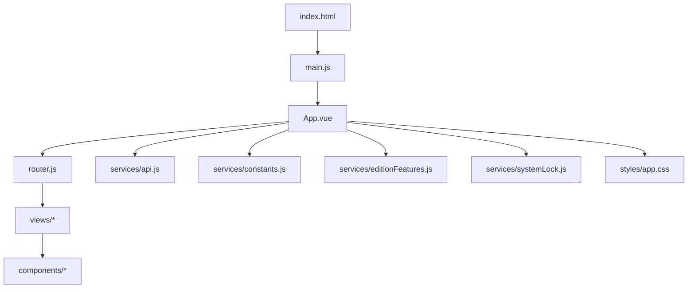
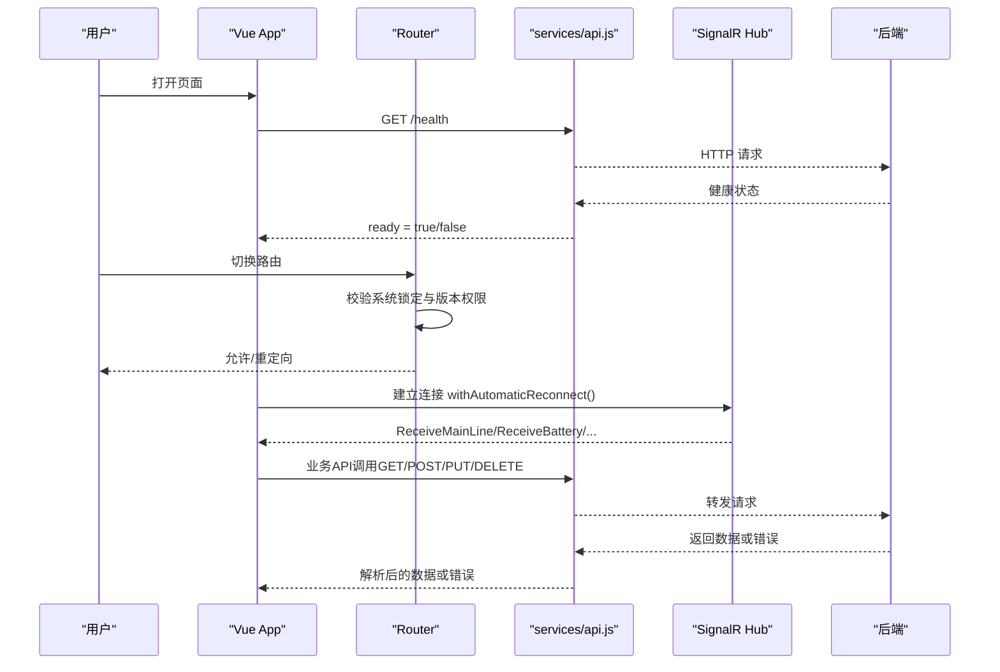
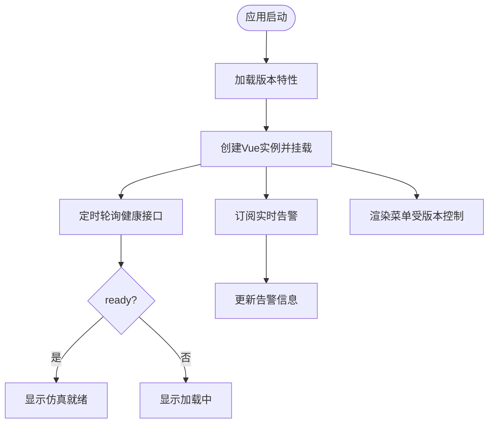
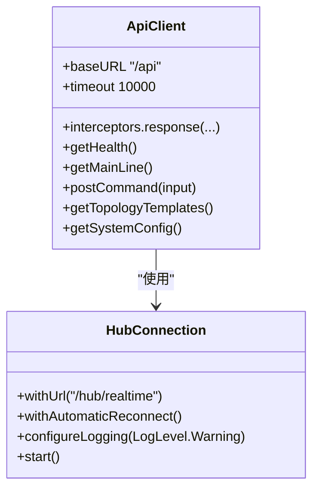
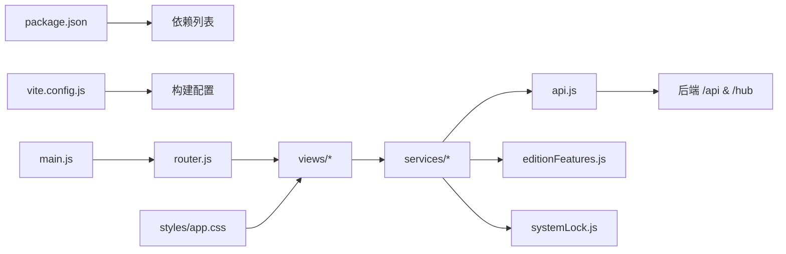

# 前端开发指南

<cite>
**本文引用的文件**
- [Web/package.json](file://Web/package.json)
- [Web/vite.config.js](file://Web/vite.config.js)
- [Web/index.html](file://Web/index.html)
- [Web/src/main.js](file://Web/src/main.js)
- [Web/src/App.vue](file://Web/src/App.vue)
- [Web/src/router.js](file://Web/src/router.js)
- [Web/src/services/api.js](file://Web/src/services/api.js)
- [Web/src/services/constants.js](file://Web/src/services/constants.js)
- [Web/src/services/editionFeatures.js](file://Web/src/services/editionFeatures.js)
- [Web/src/services/systemLock.js](file://Web/src/services/systemLock.js)
- [Web/src/styles/app.css](file://Web/src/styles/app.css)
- [Web/src/views/MainLineView.vue](file://Web/src/views/MainLineView.vue)
</cite>

## 目录
1. [简介](#简介)
2. [项目结构](#项目结构)
3. [核心组件](#核心组件)
4. [架构总览](#架构总览)
5. [详细组件分析](#详细组件分析)
6. [依赖关系分析](#依赖关系分析)
7. [性能考虑](#性能考虑)
8. [故障排查指南](#故障排查指南)
9. [结论](#结论)
10. [附录](#附录)

## 简介
本指南面向储能仿真系统的前端开发者，覆盖开发环境搭建、依赖管理、构建与部署配置；详细说明 Vite 配置、项目结构与代码组织规范；解释 API 服务封装、错误处理与实时通信机制；提供 CSS 样式规范、主题定制与响应式设计建议；并给出开发工作流（提交、测试、部署）以及常见问题排查和性能调优建议。

## 项目结构
前端位于 Web 目录下，采用 Vue 3 + Vite 技术栈，使用 Element Plus 作为 UI 组件库，ECharts 用于图表展示，Three.js 用于 3D 可视化，SignalR 实现实时数据推送。入口为 index.html，应用由 main.js 引导，路由由 router.js 管理，页面视图集中在 views，通用能力下沉到 services，样式统一在 styles。

**图示来源**
- [Web/index.html:1-13](file://Web/index.html#L1-L13)
- [Web/src/main.js:1-24](file://Web/src/main.js#L1-L24)
- [Web/src/App.vue:1-150](file://Web/src/App.vue#L1-L150)
- [Web/src/router.js:1-42](file://Web/src/router.js#L1-L42)
- [Web/src/services/api.js:1-88](file://Web/src/services/api.js#L1-L88)
- [Web/src/services/constants.js:1-18](file://Web/src/services/constants.js#L1-L18)
- [Web/src/services/editionFeatures.js:1-49](file://Web/src/services/editionFeatures.js#L1-L49)
- [Web/src/services/systemLock.js:1-47](file://Web/src/services/systemLock.js#L1-L47)
- [Web/src/styles/app.css:1-160](file://Web/src/styles/app.css#L1-L160)

**章节来源**
- [Web/package.json:1-26](file://Web/package.json#L1-L26)
- [Web/vite.config.js:1-29](file://Web/vite.config.js#L1-L29)
- [Web/index.html:1-13](file://Web/index.html#L1-L13)

## 核心组件
- 应用启动与全局初始化：main.js 负责创建 Vue 实例、注册 Element Plus 及图标、加载版本特性、挂载路由与样式。
- 根布局与状态：App.vue 提供顶部栏、侧边菜单、主内容区，集成健康检查、告警提示、系统锁定遮罩与进度条。
- 路由与权限：router.js 定义页面路由，并在导航守卫中根据版本特性控制可访问页面。
- API 与服务：services/api.js 封装 HTTP 请求与 SignalR 连接，集中暴露业务接口；constants.js 定义实时方法名与通道；editionFeatures.js 拉取并缓存版本能力；systemLock.js 提供系统重新初始化时的全局锁与进度。
- 样式体系：styles/app.css 定义全局布局、卡片、指标网格、日志查看器、主接线 SVG 样式等。

**章节来源**
- [Web/src/main.js:1-24](file://Web/src/main.js#L1-L24)
- [Web/src/App.vue:1-150](file://Web/src/App.vue#L1-L150)
- [Web/src/router.js:1-42](file://Web/src/router.js#L1-L42)
- [Web/src/services/api.js:1-88](file://Web/src/services/api.js#L1-L88)
- [Web/src/services/constants.js:1-18](file://Web/src/services/constants.js#L1-L18)
- [Web/src/services/editionFeatures.js:1-49](file://Web/src/services/editionFeatures.js#L1-L49)
- [Web/src/services/systemLock.js:1-47](file://Web/src/services/systemLock.js#L1-L47)
- [Web/src/styles/app.css:1-160](file://Web/src/styles/app.css#L1-L160)

## 架构总览
前端通过 Vite 开发服务器提供本地调试，自动代理 /api 与 /hub 到后端；构建产物输出至 wwwroot，供后端静态托管。运行时通过 axios 调用 REST API，通过 SignalR Hub 订阅实时数据（如主接线、电池、告警、命令进度）。版本特性从 /api/config 获取，控制菜单与路由可见性。系统级操作（如系统重新初始化）通过 systemLock 进行交互保护与进度反馈。

**图示来源**
- [Web/vite.config.js:15-21](file://Web/vite.config.js#L15-L21)
- [Web/src/services/api.js:1-88](file://Web/src/services/api.js#L1-L88)
- [Web/src/router.js:26-39](file://Web/src/router.js#L26-L39)
- [Web/src/App.vue:121-147](file://Web/src/App.vue#L121-L147)

## 详细组件分析

### 应用启动与全局初始化（main.js）
- 功能要点：
  - 异步加载版本特性，确保菜单与路由权限正确。
  - 注册 Element Plus 中文语言包与全部图标。
  - 挂载路由与应用容器。
- 设计模式：
  - 模块化导入与按需注册，避免全局污染。
  - 启动流程解耦，便于扩展初始化逻辑。

**章节来源**
- [Web/src/main.js:1-24](file://Web/src/main.js#L1-L24)

### 根布局与状态管理（App.vue）
- 功能要点：
  - 顶部状态栏显示仿真就绪状态与严重告警倒计时。
  - 侧边菜单按版本特性动态显示功能入口。
  - 主区域承载路由视图。
  - 系统锁定遮罩阻止交互并展示进度。
- 数据流：
  - 定时轮询健康接口更新 ready。
  - 首次加载版本特性并更新菜单可见性。
  - 订阅 SignalR 告警事件更新 alert。

**图示来源**
- [Web/src/App.vue:1-150](file://Web/src/App.vue#L1-L150)

**章节来源**
- [Web/src/App.vue:1-150](file://Web/src/App.vue#L1-L150)

### 路由与权限控制（router.js）
- 功能要点：
  - 懒加载各视图组件，减少首屏体积。
  - beforeEach 守卫：
    - 若系统处于锁定状态且路径变更，则阻止跳转。
    - 加载版本特性后判断目标路由是否允许访问，否则重定向到主页。
- 最佳实践：
  - 将路由元信息与版本特性结合，保证前后端能力一致。

**章节来源**
- [Web/src/router.js:1-42](file://Web/src/router.js#L1-L42)

### API 服务封装（services/api.js）
- HTTP 客户端：
  - 基于 axios 创建实例，设置基础路径与超时。
  - 响应拦截器统一提取错误消息并抛出。
- 接口分类：
  - 健康与配置：/health, /config, /protocol, /autotest, /pointmaps
  - 主接线与设备：/mainline, /battery, /cells, /alarms, /connections
  - 断路器与链接：/link, /breaker
  - 白盒切片：/droop-slices/*
  - 组态编辑：/topology/*
  - 系统配置：/system/*
- 实时通信：
  - 使用 @microsoft/signalr 的 HubConnectionBuilder 建立连接，启用自动重连与日志级别控制。
  - 单例化连接以避免重复建立。

**图示来源**
- [Web/src/services/api.js:1-88](file://Web/src/services/api.js#L1-L88)

**章节来源**
- [Web/src/services/api.js:1-88](file://Web/src/services/api.js#L1-L88)

### 实时常量与通道（services/constants.js）
- 定义 SignalR 方法名与通道名称，集中管理实时事件标识，便于跨模块引用与维护。

**章节来源**
- [Web/src/services/constants.js:1-18](file://Web/src/services/constants.js#L1-L18)

### 版本特性控制（services/editionFeatures.js）
- 功能要点：
  - 从 /api/config 拉取 edition 能力字段，缓存结果。
  - 提供 isEditionRouteAllowed 判断路由是否允许访问。
  - 对特定路由（3D、组态编辑、白盒切片）进行能力门控。
- 设计要点：
  - 只请求一次配置，避免频繁网络开销。
  - 失败时回退默认值，保证界面可用。

**章节来源**
- [Web/src/services/editionFeatures.js:1-49](file://Web/src/services/editionFeatures.js#L1-L49)

### 系统锁定与进度（services/systemLock.js）
- 功能要点：
  - 提供 lockSystem、updateSystemProgress、unlockSystem 等方法。
  - 暴露 readonly 的状态对象，供视图层绑定进度与阶段文案。
  - 限制进度范围，防止异常输入导致 UI 异常。
- 使用场景：
  - 系统重新初始化期间，禁止路由切换与交互，展示全屏遮罩与进度条。

**章节来源**
- [Web/src/services/systemLock.js:1-47](file://Web/src/services/systemLock.js#L1-L47)

### 样式规范与主题（styles/app.css）
- 全局布局：
  - 使用 Flexbox 构建头部、侧边栏与主内容区，确保自适应与滚动行为合理。
- 组件样式：
  - 卡片、指标网格、在线/离线标签、日志查看器等通用样式。
  - 主接线 SVG 样式类，统一线宽、颜色与文本样式。
- 主题定制：
  - 通过 CSS 变量或集中色板（如蓝色系 #1e6abc、背景 #f5f7fa）快速调整主题。
  - 可通过覆盖 Element Plus 样式或使用自定义类名实现差异化主题。
- 响应式建议：
  - 利用 grid 的 auto-fill/minmax 实现指标网格自适应。
  - 在小屏幕下适当缩减侧边栏宽度或折叠菜单。

**章节来源**
- [Web/src/styles/app.css:1-160](file://Web/src/styles/app.css#L1-L160)

### 视图示例：主接线页（views/MainLineView.vue）
- 功能要点：
  - 展示电站概览指标（电压、频率、负载功率等），支持设定电网电压/频率与负载功率。
  - 根据工程模式与组态数据选择经典 SVG 或拓扑主接线组件。
  - 表格展示传播母线节点、交流设备与储能单元明细。
- 数据交互：
  - 通过 api.js 获取快照数据，并通过 useRealtime 订阅实时更新。
  - 触发断路器切换、PCS/PV/BMS 控制命令。

**章节来源**
- [Web/src/views/MainLineView.vue:1-200](file://Web/src/views/MainLineView.vue#L1-L200)

## 依赖关系分析
- 运行时依赖：
  - Vue 3、Element Plus、axios、echarts、three、@microsoft/signalr、vue-router。
- 开发依赖：
  - vite、@vitejs/plugin-vue。
- 关键耦合点：
  - api.js 同时承担 HTTP 与 SignalR 职责，需保持接口稳定。
  - editionFeatures.js 与 router.js、App.vue 强耦合，决定功能可见性。
  - systemLock.js 与 App.vue 视图强耦合，影响交互与导航。

**图示来源**
- [Web/package.json:1-26](file://Web/package.json#L1-L26)
- [Web/vite.config.js:1-29](file://Web/vite.config.js#L1-L29)
- [Web/src/main.js:1-24](file://Web/src/main.js#L1-L24)
- [Web/src/router.js:1-42](file://Web/src/router.js#L1-L42)
- [Web/src/services/api.js:1-88](file://Web/src/services/api.js#L1-L88)
- [Web/src/services/editionFeatures.js:1-49](file://Web/src/services/editionFeatures.js#L1-L49)
- [Web/src/services/systemLock.js:1-47](file://Web/src/services/systemLock.js#L1-L47)
- [Web/src/styles/app.css:1-160](file://Web/src/styles/app.css#L1-L160)

**章节来源**
- [Web/package.json:1-26](file://Web/package.json#L1-L26)
- [Web/vite.config.js:1-29](file://Web/vite.config.js#L1-L29)

## 性能考虑
- 构建优化：
  - 使用 Vite 的 chunkSizeWarningLimit 控制分包大小，避免单个 chunk 过大。
  - 输出目录指向 wwwroot，便于后端静态托管与缓存策略。
- 网络优化：
  - 使用懒加载路由减少首屏资源。
  - 复用 SignalR 连接，避免重复握手。
  - 合理设置 axios 超时与重试策略（可在拦截器中扩展）。
- 渲染优化：
  - 大表格与图表数据分页/节流更新，避免频繁重绘。
  - 使用 computed 与 ref 精确更新，减少不必要的 re-render。
- 主题与样式：
  - 尽量复用样式类，避免重复样式计算。
  - 使用 CSS Grid/Flexbox 提升布局性能。

[本节为通用指导，不直接分析具体文件]

## 故障排查指南
- 无法连接后端：
  - 检查 Vite 代理配置是否正确（/api 与 /hub）。
  - 确认后端服务地址与端口，必要时修改环境变量 VITE_BACKEND。
- 实时数据未更新：
  - 检查 SignalR 连接是否成功建立，查看浏览器控制台日志。
  - 确认订阅的方法名与通道名与后端一致。
- 路由被重定向：
  - 检查版本特性是否加载成功，确认 isEditionRouteAllowed 的判断逻辑。
  - 系统锁定状态下会阻止路由切换，等待解锁后再试。
- 样式异常：
  - 检查 app.css 是否被正确引入，Element Plus 样式是否加载。
  - 注意覆盖顺序与 specificity 冲突。
- 构建失败：
  - 检查依赖版本兼容性，清理 node_modules 后重装。
  - 关注 Vite 警告与错误信息，定位问题模块。

**章节来源**
- [Web/vite.config.js:15-21](file://Web/vite.config.js#L15-L21)
- [Web/src/services/api.js:71-85](file://Web/src/services/api.js#L71-L85)
- [Web/src/router.js:26-39](file://Web/src/router.js#L26-L39)
- [Web/src/App.vue:121-147](file://Web/src/App.vue#L121-L147)

## 结论
本项目采用现代前端技术栈，结构清晰、职责分明。通过统一的 API 封装与实时通信机制，实现了高效的数据交互；借助版本特性控制与系统锁定机制，提升了用户体验与安全性。建议在后续迭代中继续完善错误处理、监控埋点与性能指标采集，持续优化构建与运行体验。

[本节为总结性内容，不直接分析具体文件]

## 附录

### 开发环境搭建
- 前置条件：Node.js 环境（建议使用 LTS 版本）。
- 安装依赖：进入 Web 目录执行 npm install。
- 启动开发服务器：npm run dev，默认端口 5173，代理 /api 与 /hub 到后端。
- 预览构建产物：npm run preview。

**章节来源**
- [Web/package.json:6-10](file://Web/package.json#L6-L10)
- [Web/vite.config.js:15-21](file://Web/vite.config.js#L15-L21)

### 依赖管理与版本策略
- 生产依赖：Vue 3、Element Plus、axios、echarts、three、@microsoft/signalr、vue-router。
- 开发依赖：vite、@vitejs/plugin-vue。
- 建议：固定依赖版本，定期升级并回归测试；使用 lock 文件确保一致性。

**章节来源**
- [Web/package.json:11-24](file://Web/package.json#L11-L24)

### 构建与部署
- 构建命令：npm run build，产物输出至 ../wwwroot。
- 部署方式：将 wwwroot 交由后端静态托管或通过 CDN 分发。
- 环境变量：通过 VITE_BACKEND 指定后端地址，便于多环境切换。

**章节来源**
- [Web/vite.config.js:23-27](file://Web/vite.config.js#L23-L27)
- [Web/vite.config.js:5-6](file://Web/vite.config.js#L5-L6)

### 代码组织规范
- 目录划分：
  - src/components：可复用组件（含 icons、mainline3d、topology）。
  - src/views：页面级组件，按功能模块划分。
  - src/services：业务服务与工具（API、常量、版本特性、系统锁）。
  - src/styles：全局样式与主题。
- 命名约定：
  - 组件使用 PascalCase，服务使用 camelCase。
  - 常量集中管理，避免硬编码字符串。
- 导入规范：
  - 使用别名 @ 引用 src 目录，简化路径。

**章节来源**
- [Web/vite.config.js:10-13](file://Web/vite.config.js#L10-L13)
- [Web/src/services/constants.js:1-18](file://Web/src/services/constants.js#L1-L18)

### 开发工作流程
- 分支策略：
  - 功能分支开发，合并前进行代码审查与测试。
- 提交规范：
  - 提交信息包含功能描述与关联任务编号。
- 测试执行：
  - 单元测试与集成测试（如有），确保核心逻辑稳定。
- 发布流程：
  - 构建产物验证后部署至预发环境，回归通过后上线。

[本节为通用流程建议，不直接分析具体文件]

### 常见问题排查
- 代理失效：
  - 检查 vite.config.js 的 server.proxy 配置，确认后端地址与协议。
- 信号连接断开：
  - 启用 withAutomaticReconnect，观察重连日志。
- 样式错乱：
  - 检查 Element Plus 版本与样式引入顺序，必要时局部覆盖样式。
- 构建体积过大：
  - 分析打包报告，拆分第三方库，按需引入组件。

**章节来源**
- [Web/vite.config.js:15-21](file://Web/vite.config.js#L15-L21)
- [Web/src/services/api.js:71-85](file://Web/src/services/api.js#L71-L85)