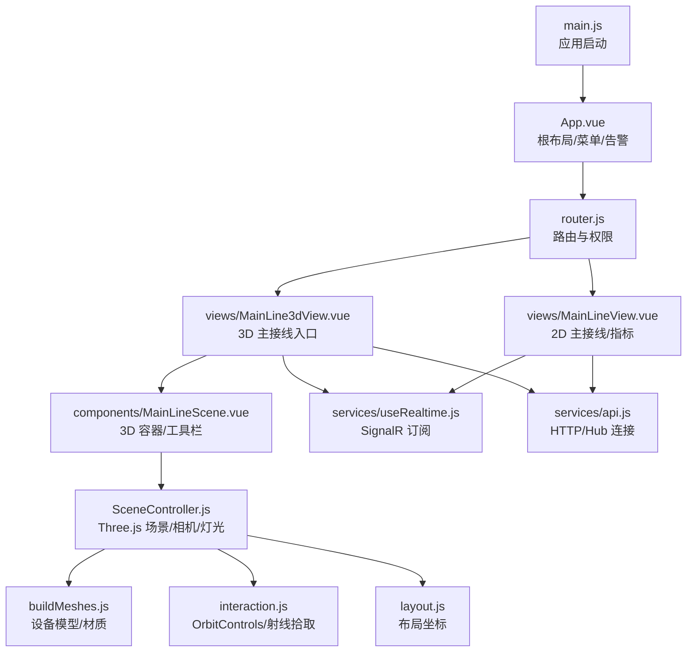
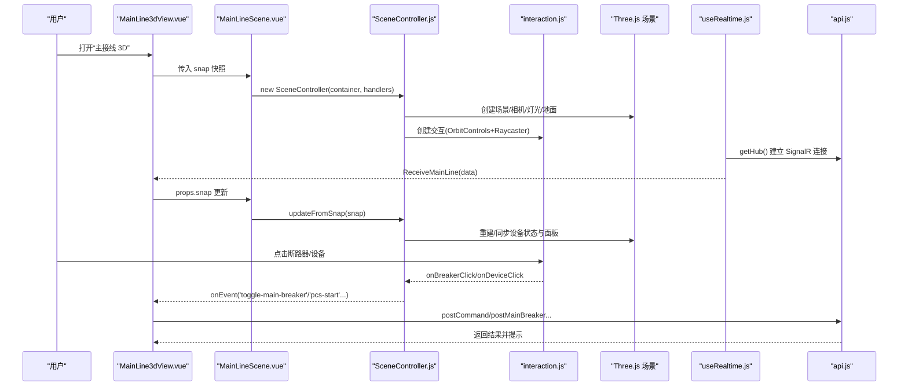
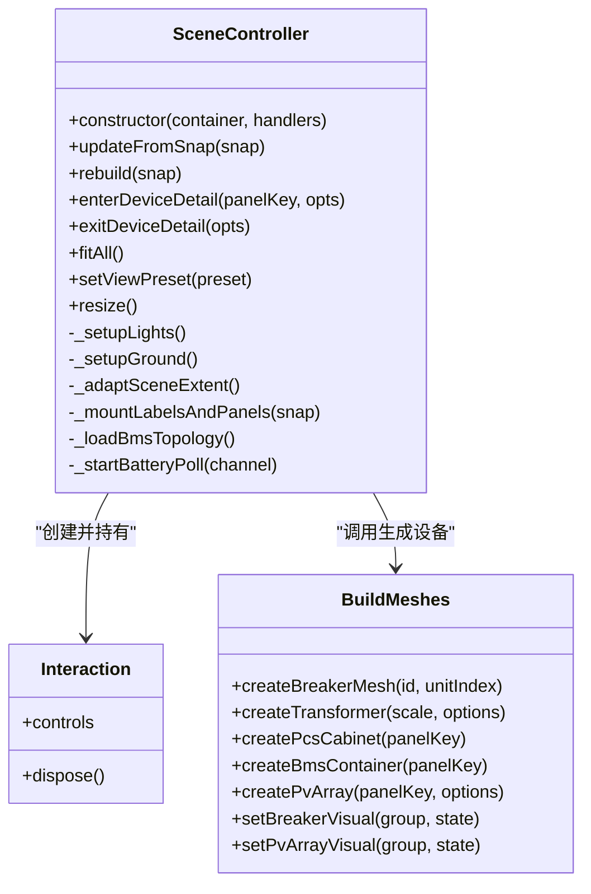
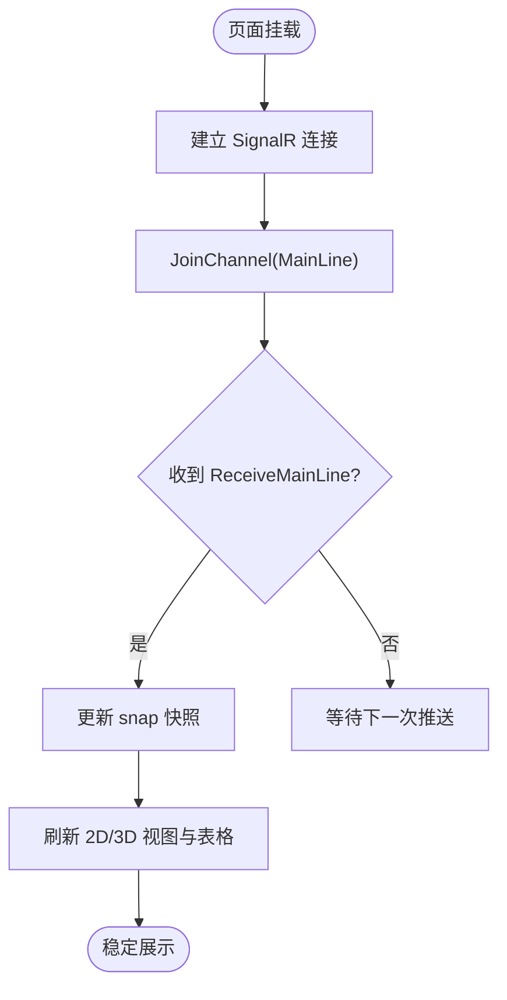
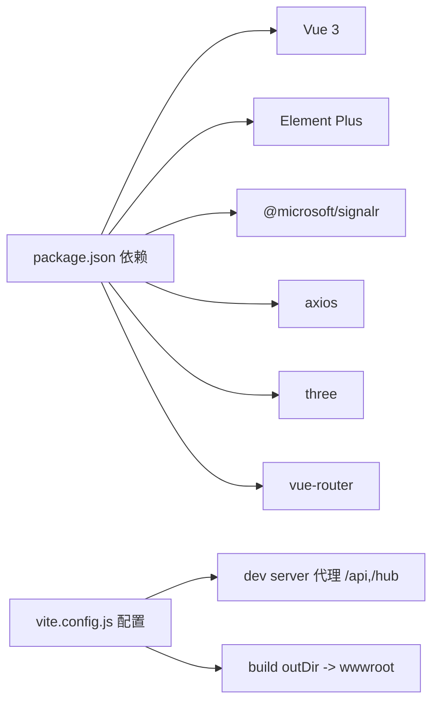

# 前端界面

<cite>
**本文引用的文件**
- [Web/src/main.js](file://Web/src/main.js)
- [Web/src/App.vue](file://Web/src/App.vue)
- [Web/src/router.js](file://Web/src/router.js)
- [Web/package.json](file://Web/package.json)
- [Web/vite.config.js](file://Web/vite.config.js)
- [Web/src/views/MainLine3dView.vue](file://Web/src/views/MainLine3dView.vue)
- [Web/src/components/MainLineScene.vue](file://Web/src/components/MainLineScene.vue)
- [Web/src/components/mainline3d/SceneController.js](file://Web/src/components/mainline3d/SceneController.js)
- [Web/src/components/mainline3d/buildMeshes.js](file://Web/src/components/mainline3d/buildMeshes.js)
- [Web/src/components/mainline3d/interaction.js](file://Web/src/components/mainline3d/interaction.js)
- [Web/src/components/mainline3d/layout.js](file://Web/src/components/mainline3d/layout.js)
- [Web/src/services/useRealtime.js](file://Web/src/services/useRealtime.js)
- [Web/src/services/api.js](file://Web/src/services/api.js)
- [Web/src/views/MainLineView.vue](file://Web/src/views/MainLineView.vue)
- [Web/src/styles/app.css](file://Web/src/styles/app.css)
</cite>

## 目录
1. [简介](#简介)
2. [项目结构](#项目结构)
3. [核心组件](#核心组件)
4. [架构总览](#架构总览)
5. [详细组件分析](#详细组件分析)
6. [依赖关系分析](#依赖关系分析)
7. [性能考虑](#性能考虑)
8. [故障排查指南](#故障排查指南)
9. [结论](#结论)
10. [附录](#附录)

## 简介
本文件面向储能仿真系统的前端界面，重点说明：
- 3D 主接线图的实现：Three.js 集成、设备建模与渲染、交互控制（旋转/缩放/平移、点击断路器、双击 BMS 进入详情）。
- 实时监控界面：数据展示、图表绘制（SVG 单线图/拓扑图）、告警显示。
- Vue.js 组件架构、状态管理与实时数据更新机制（SignalR 频道订阅）。
- UI 组件使用示例、样式定制选项与响应式设计指南。
- 前端开发环境搭建与调试方法。

## 项目结构
前端基于 Vue 3 + Vite 构建，采用模块化组织：
- 入口与路由：main.js 初始化应用、注册 Element Plus 与图标；router.js 定义页面路由与鉴权拦截。
- 视图层：MainLineView.vue（2D 主接线与指标面板）、MainLine3dView.vue（3D 主接线入口）。
- 3D 场景：MainLineScene.vue 封装 Three.js 控制器 SceneController.js，负责场景生命周期、相机、灯光、地面、标签与交互。
- 设备建模：buildMeshes.js 提供断路器、变压器、PCS、BMS、光伏方阵等模型与材质库。
- 交互控制：interaction.js 封装 OrbitControls + Raycaster，处理单击/双击/移动事件。
- 布局常量：layout.js 定义站点布局坐标与间距。
- 实时通信：useRealtime.js 封装 SignalR 频道订阅；api.js 统一 HTTP/SSE 接口。
- 样式：app.css 全局主题与布局。

**图示来源**
- [Web/src/main.js:1-24](file://Web/src/main.js#L1-L24)
- [Web/src/App.vue:1-150](file://Web/src/App.vue#L1-L150)
- [Web/src/router.js:1-42](file://Web/src/router.js#L1-L42)
- [Web/src/views/MainLineView.vue:1-655](file://Web/src/views/MainLineView.vue#L1-L655)
- [Web/src/views/MainLine3dView.vue:1-274](file://Web/src/views/MainLine3dView.vue#L1-L274)
- [Web/src/components/MainLineScene.vue:1-430](file://Web/src/components/MainLineScene.vue#L1-L430)
- [Web/src/components/mainline3d/SceneController.js:1-800](file://Web/src/components/mainline3d/SceneController.js#L1-L800)
- [Web/src/components/mainline3d/buildMeshes.js:1-800](file://Web/src/components/mainline3d/buildMeshes.js#L1-L800)
- [Web/src/components/mainline3d/interaction.js:1-120](file://Web/src/components/mainline3d/interaction.js#L1-L120)
- [Web/src/components/mainline3d/layout.js:1-87](file://Web/src/components/mainline3d/layout.js#L1-L87)
- [Web/src/services/useRealtime.js:1-39](file://Web/src/services/useRealtime.js#L1-L39)
- [Web/src/services/api.js:1-88](file://Web/src/services/api.js#L1-L88)

**章节来源**
- [Web/src/main.js:1-24](file://Web/src/main.js#L1-L24)
- [Web/src/App.vue:1-150](file://Web/src/App.vue#L1-L150)
- [Web/src/router.js:1-42](file://Web/src/router.js#L1-L42)
- [Web/package.json:1-26](file://Web/package.json#L1-L26)
- [Web/vite.config.js:1-29](file://Web/vite.config.js#L1-L29)

## 核心组件
- 应用壳 App.vue：顶部状态栏（就绪/告警）、侧边导航菜单（按版本特性动态显示）、系统锁定遮罩（重初始化时禁止操作）。
- 3D 主接线 MainLineScene.vue：封装 Three.js 场景生命周期、全屏切换、工具栏预设视角、事件分发到父级。
- 3D 控制器 SceneController.js：创建场景、相机、渲染器、灯光、地面、标签与设备面板；管理站级/设备级视图切换；电池簇详情轮询。
- 设备建模 buildMeshes.js：断路器、主变、PCS、BMS、光伏方阵、电缆、汇流点等模型与材质库。
- 交互 interaction.js：鼠标左键旋转、滚轮缩放、右键平移；单击断路器/设备、双击 BMS 进入详情；指针移动高亮。
- 布局 layout.js：站点 Z/Y 轴布局常量、单元间距、通道偏移、计算总线范围。
- 实时监控 useRealtime.js：封装 SignalR 频道加入/离开与回调绑定，自动清理。
- API api.js：统一 axios 请求与 SignalR Hub 连接，暴露健康检查、主接线快照、命令下发等接口。

**章节来源**
- [Web/src/App.vue:1-150](file://Web/src/App.vue#L1-L150)
- [Web/src/components/MainLineScene.vue:1-430](file://Web/src/components/MainLineScene.vue#L1-L430)
- [Web/src/components/mainline3d/SceneController.js:1-800](file://Web/src/components/mainline3d/SceneController.js#L1-L800)
- [Web/src/components/mainline3d/buildMeshes.js:1-800](file://Web/src/components/mainline3d/buildMeshes.js#L1-L800)
- [Web/src/components/mainline3d/interaction.js:1-120](file://Web/src/components/mainline3d/interaction.js#L1-L120)
- [Web/src/components/mainline3d/layout.js:1-87](file://Web/src/components/mainline3d/layout.js#L1-L87)
- [Web/src/services/useRealtime.js:1-39](file://Web/src/services/useRealtime.js#L1-L39)
- [Web/src/services/api.js:1-88](file://Web/src/services/api.js#L1-L88)

## 架构总览
前端通过 Vue 组件树组织页面，3D 主接线由 MainLineScene 承载 SceneController，后者驱动 Three.js 场景与交互。实时数据通过 SignalR 频道推送至视图，视图将数据映射为 3D 可视化或 2D 表格/图表。

**图示来源**
- [Web/src/views/MainLine3dView.vue:1-274](file://Web/src/views/MainLine3dView.vue#L1-L274)
- [Web/src/components/MainLineScene.vue:1-430](file://Web/src/components/MainLineScene.vue#L1-L430)
- [Web/src/components/mainline3d/SceneController.js:1-800](file://Web/src/components/mainline3d/SceneController.js#L1-L800)
- [Web/src/components/mainline3d/interaction.js:1-120](file://Web/src/components/mainline3d/interaction.js#L1-L120)
- [Web/src/services/useRealtime.js:1-39](file://Web/src/services/useRealtime.js#L1-L39)
- [Web/src/services/api.js:1-88](file://Web/src/services/api.js#L1-L88)

## 详细组件分析

### 3D 主接线图（Three.js 集成）
- 场景初始化：创建 PerspectiveCamera、WebGLRenderer（抗锯齿、阴影、色调映射、输出色彩空间），叠加 CSS2DRenderer 用于标签与悬浮面板。
- 灯光与环境：环境光、半球光、方向光（带阴影）、填充光；地面平面与雾效随场景跨度自适应。
- 设备建模：断路器（三相柱式灭弧室+机构箱+指示灯）、主变（油箱+散热器+油枕+套管）、PCS（双开门+百叶+指示灯）、BMS（集装箱+角件+门+空调）、光伏方阵（InstancedMesh 组件阵列+支架+串线+汇流排）。
- 交互控制：OrbitControls 限制极角与距离；Raycaster 拾取断路器/设备；单击触发断路器切换或设备面板；双击 BMS 进入设备详情；指针移动高亮簇信息。
- 视图模式：站级视图与设备级视图切换，保存/恢复相机位置与目标；退出详情时恢复雾效与地面尺寸。
- 电池详情：根据配置加载 BMS 拓扑，轮询电池簇概览，更新电芯着色与簇信息浮窗。

**图示来源**
- [Web/src/components/mainline3d/SceneController.js:1-800](file://Web/src/components/mainline3d/SceneController.js#L1-L800)
- [Web/src/components/mainline3d/interaction.js:1-120](file://Web/src/components/mainline3d/interaction.js#L1-L120)
- [Web/src/components/mainline3d/buildMeshes.js:1-800](file://Web/src/components/mainline3d/buildMeshes.js#L1-L800)

**章节来源**
- [Web/src/components/mainline3d/SceneController.js:1-800](file://Web/src/components/mainline3d/SceneController.js#L1-L800)
- [Web/src/components/mainline3d/buildMeshes.js:1-800](file://Web/src/components/mainline3d/buildMeshes.js#L1-L800)
- [Web/src/components/mainline3d/interaction.js:1-120](file://Web/src/components/mainline3d/interaction.js#L1-L120)
- [Web/src/components/mainline3d/layout.js:1-87](file://Web/src/components/mainline3d/layout.js#L1-L87)

### 实时监控界面（数据展示/图表/告警）
- 数据源：通过 SignalR 频道 RealtimeChannels.MainLine 接收 ReceiveMainLine 事件，实时更新 snap 快照。
- 展示内容：PCC 电压、频率、35kV 母线、主断路器状态、求解模式、电表功率、交流设备相量、储能单元明细等。
- 图表绘制：2D 主接线以 SVG 呈现（支持工程模式下的 TopologyMainLineSvg），结合状态与数值标注。
- 告警显示：App.vue 顶部状态栏显示严重告警倒计时；各视图内通过 ElMessage 反馈操作结果。

**图示来源**
- [Web/src/services/useRealtime.js:1-39](file://Web/src/services/useRealtime.js#L1-L39)
- [Web/src/views/MainLineView.vue:1-655](file://Web/src/views/MainLineView.vue#L1-L655)
- [Web/src/App.vue:1-150](file://Web/src/App.vue#L1-L150)

**章节来源**
- [Web/src/views/MainLineView.vue:1-655](file://Web/src/views/MainLineView.vue#L1-L655)
- [Web/src/App.vue:1-150](file://Web/src/App.vue#L1-L150)
- [Web/src/services/useRealtime.js:1-39](file://Web/src/services/useRealtime.js#L1-L39)

### Vue.js 组件架构与状态管理
- 组件分层：App.vue（布局/菜单/告警）→ views/*（业务视图）→ components/*（通用/3D 容器）→ services/*（API/实时通信）。
- 状态管理：使用 Vue ref/reactive 维护局部状态；snap 作为 3D/2D 共享数据源；通过 watch 深度监听更新 3D 场景。
- 实时数据更新：useRealtime 在 mounted 时加入频道并绑定回调，beforeUnmount 时解绑并离开频道，避免内存泄漏。
- 路由与权限：router.js 在进入前加载版本特性，校验当前路由是否允许访问；系统锁定期间阻止路由切换。

**章节来源**
- [Web/src/App.vue:1-150](file://Web/src/App.vue#L1-L150)
- [Web/src/router.js:1-42](file://Web/src/router.js#L1-L42)
- [Web/src/services/useRealtime.js:1-39](file://Web/src/services/useRealtime.js#L1-L39)
- [Web/src/components/MainLineScene.vue:1-430](file://Web/src/components/MainLineScene.vue#L1-L430)

### 3D 设备渲染与交互控制
- 设备渲染：buildMeshes.js 提供丰富的工业风格材质与几何体组合，支持断路器状态指示、光伏方阵发光强度随辐照度变化。
- 交互控制：interaction.js 封装点击/双击/移动事件，区分断路器与设备面板的拾取逻辑；SceneController 根据 panelKey 打开/关闭设备面板。
- 设备详情：双击 BMS 进入设备详情视图，暂停站级可见性，调整相机距离与雾效；轮询电池簇数据，更新簇信息与温度异常提示。

**章节来源**
- [Web/src/components/mainline3d/buildMeshes.js:1-800](file://Web/src/components/mainline3d/buildMeshes.js#L1-L800)
- [Web/src/components/mainline3d/interaction.js:1-120](file://Web/src/components/mainline3d/interaction.js#L1-L120)
- [Web/src/components/mainline3d/SceneController.js:1-800](file://Web/src/components/mainline3d/SceneController.js#L1-L800)

### UI 组件使用示例与样式定制
- 组件使用：Element Plus 的 Tag、Menu、Button、Alert、Table、Progress 等；图标来自 @element-plus/icons-vue。
- 样式定制：app.css 定义全局字体、背景、卡片、指标网格、在线/离线标签颜色；3D 视图内自定义悬浮标签与集群信息浮窗样式。
- 响应式设计：主区域使用 flex 布局，侧栏固定宽度；3D 视口高度使用 min(78vh, 820px)，适配不同屏幕；全屏模式下工具栏与视口自适应。

**章节来源**
- [Web/src/styles/app.css:1-160](file://Web/src/styles/app.css#L1-L160)
- [Web/src/components/MainLineScene.vue:253-430](file://Web/src/components/MainLineScene.vue#L253-L430)
- [Web/src/App.vue:1-150](file://Web/src/App.vue#L1-L150)

## 依赖关系分析
- 运行时依赖：Vue 3、Element Plus、@microsoft/signalr、axios、echarts（备用）、three、vue-router。
- 构建配置：Vite 插件 vue，别名 @ 指向 src；开发服务器端口 5173，代理 /api 与 /hub 到后端；构建输出到 wwwroot。

**图示来源**
- [Web/package.json:1-26](file://Web/package.json#L1-L26)
- [Web/vite.config.js:1-29](file://Web/vite.config.js#L1-L29)

**章节来源**
- [Web/package.json:1-26](file://Web/package.json#L1-L26)
- [Web/vite.config.js:1-29](file://Web/vite.config.js#L1-L29)

## 性能考虑
- 3D 渲染优化：
  - 使用 InstancedMesh 批量绘制光伏组件，减少 draw call。
  - 合理设置像素比（devicePixelRatio 上限为 2），降低高分屏压力。
  - 启用 PCFSoftShadowMap 与 ACESFilmicToneMapping，平衡质量与性能。
  - 雾效近远裁剪避免远处过多几何体渲染。
- 资源释放：
  - 场景重建时显式 dispose 几何体与材质，避免内存泄漏。
  - 设备详情退出时停止电池轮询定时器。
- 实时数据：
  - SignalR 自动重连，避免频繁断连重连开销。
  - 视图卸载时及时 off 事件与 LeaveChannel，减少无效推送。

[本节为通用指导，不直接分析具体文件]

## 故障排查指南
- 信号连接失败：
  - 现象：useRealtime 打印“SignalR 连接失败”。
  - 排查：确认 vite 代理 /hub 指向后端；检查后端 RealtimeHub 是否正常；浏览器网络面板查看 ws 连接。
- 3D 场景无显示：
  - 现象：视口空白或报错。
  - 排查：检查 viewportRef 是否存在；确认 SceneController 构造函数参数；查看 WebGL 上下文是否可用；检查 CSS2DRenderer 是否覆盖正确。
- 断路器操作失败：
  - 现象：ElMessage 提示错误。
  - 排查：确认主断路器未跳闸；检查 postMainBreaker/postUnitBreaker 返回值；查看后端日志。
- 电池详情无数据：
  - 现象：进入 BMS 详情后无簇信息。
  - 排查：检查 getConfig 返回 bmsTopology；确认 getBattery(unit) 接口可达；查看 _startBatteryPoll 定时器是否运行。

**章节来源**
- [Web/src/services/useRealtime.js:1-39](file://Web/src/services/useRealtime.js#L1-L39)
- [Web/src/components/mainline3d/SceneController.js:140-180](file://Web/src/components/mainline3d/SceneController.js#L140-L180)
- [Web/src/views/MainLine3dView.vue:59-95](file://Web/src/views/MainLine3dView.vue#L59-L95)
- [Web/src/services/api.js:1-88](file://Web/src/services/api.js#L1-L88)

## 结论
该前端界面以 Vue 3 为核心，结合 Three.js 实现了高保真 3D 主接线图，并通过 SignalR 实时推送数据驱动 2D/3D 可视化。组件化架构清晰，职责分离明确；设备建模丰富，交互自然；实时数据链路健壮，具备完善的错误提示与资源管理机制。后续可进一步扩展更多设备类型与可视化维度，提升性能与可维护性。

## 附录
- 开发环境搭建：
  - 安装依赖：npm install
  - 启动开发服务器：npm run dev（端口 5173，代理 /api 与 /hub 到后端）
  - 构建生产包：npm run build（输出到 wwwroot）
  - 预览构建产物：npm run preview
- 调试建议：
  - 使用浏览器开发者工具 Network 面板观察 SignalR 连接与 API 请求。
  - 在 SceneController 中增加 console.log 跟踪场景重建与设备状态同步。
  - 针对 3D 性能问题，使用 Performance 面板分析帧率与 GPU 占用。

**章节来源**
- [Web/vite.config.js:1-29](file://Web/vite.config.js#L1-L29)
- [Web/package.json:1-26](file://Web/package.json#L1-L26)
- [Web/src/components/mainline3d/SceneController.js:1-800](file://Web/src/components/mainline3d/SceneController.js#L1-L800)