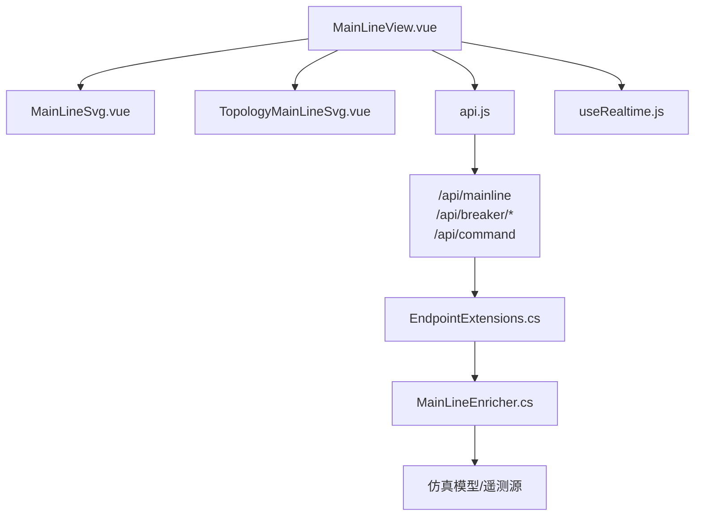
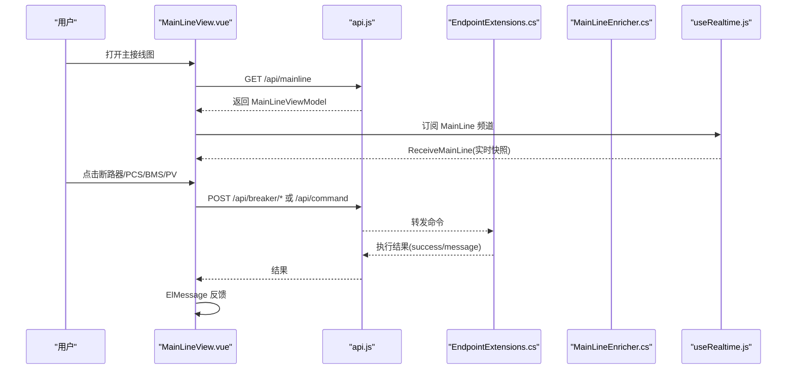
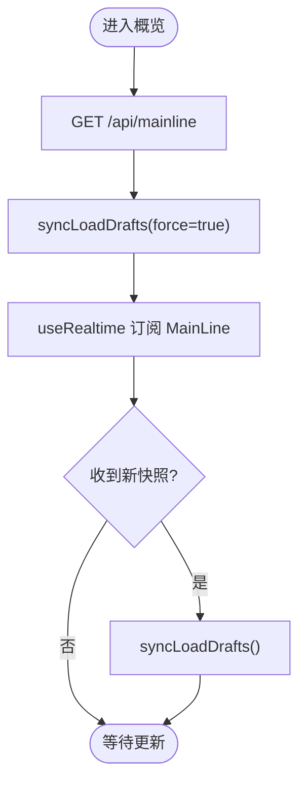
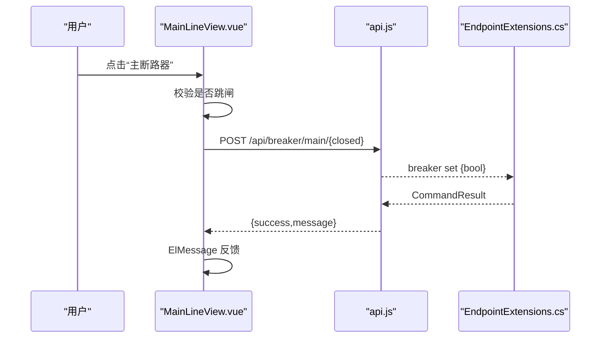
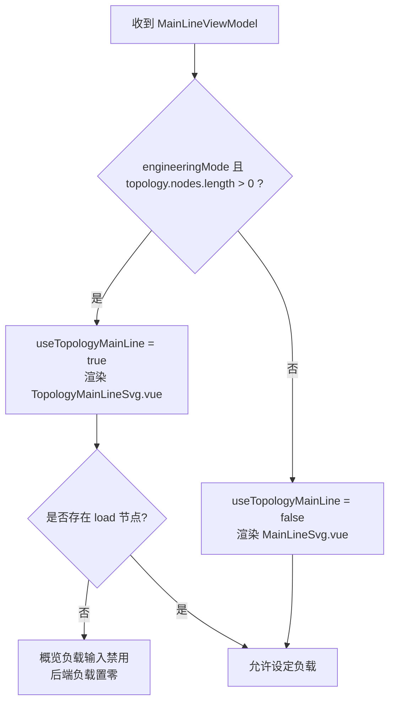
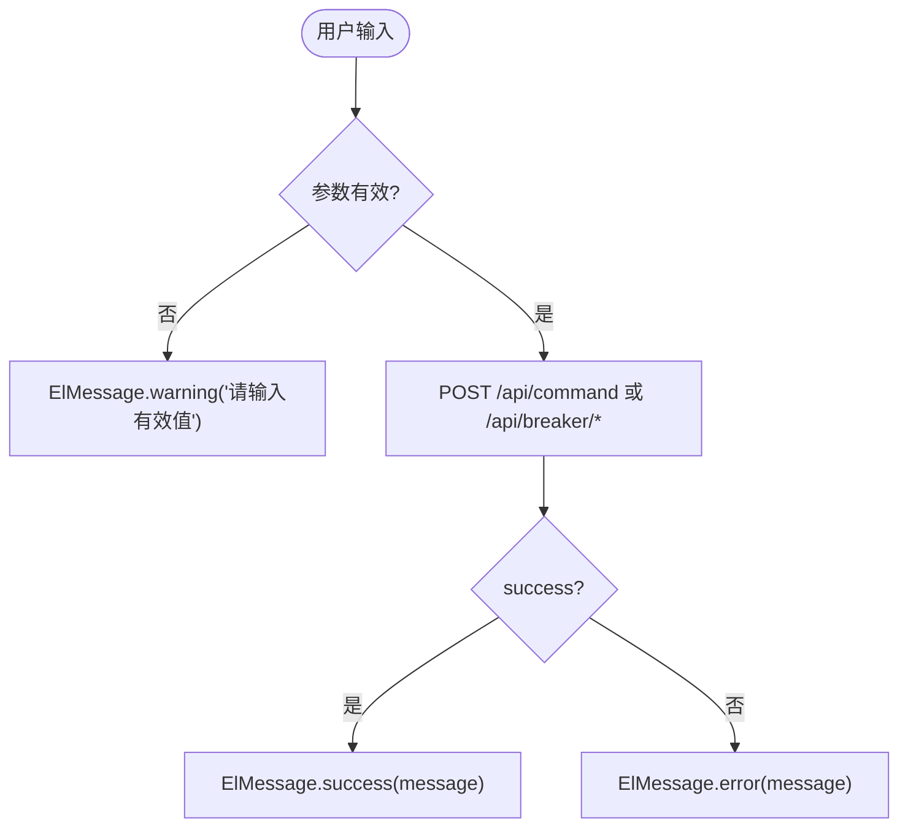
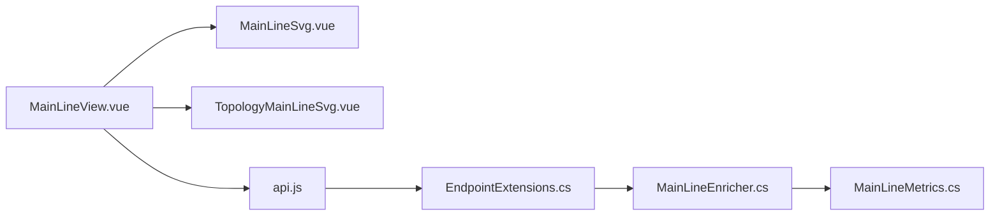

# 主接线图视图

<cite>
**本文引用的文件**
- [MainLineView.vue](file://Web/src/views/MainLineView.vue)
- [MainLineSvg.vue](file://Web/src/components/MainLineSvg.vue)
- [TopologyMainLineSvg.vue](file://Web/src/components/TopologyMainLineSvg.vue)
- [TopologyCanvas.vue](file://Web/src/components/topology/TopologyCanvas.vue)
- [api.js](file://Web/src/services/api.js)
- [useRealtime.js](file://Web/src/services/useRealtime.js)
- [EndpointExtensions.cs](file://Web/EndpointExtensions.cs)
- [MainLineEnricher.cs](file://Web/MainLineEnricher.cs)
- [MainLineMetrics.cs](file://Display/MainLineMetrics.cs)
</cite>

## 目录
1. [简介](#简介)
2. [项目结构](#项目结构)
3. [核心组件](#核心组件)
4. [架构总览](#架构总览)
5. [详细组件分析](#详细组件分析)
6. [依赖关系分析](#依赖关系分析)
7. [性能考虑](#性能考虑)
8. [故障排查指南](#故障排查指南)
9. [结论](#结论)
10. [附录](#附录)

## 简介
本文件面向“主接线图视图”的前后端实现，系统性说明电站概览数据的展示逻辑（PCC电压、电网频率、母线状态等）、电气主接线的交互能力（断路器操作、PCS控制、BMS管理）、拓扑模式与经典模式的切换逻辑与差异、设备控制命令的调用方式（参数校验、错误处理、用户反馈），以及响应式数据绑定与实时更新的实现细节。

## 项目结构
主接线图视图由前端页面、两种渲染组件（经典单线图与工程拓扑图）、后端聚合器与API端点组成：
- 页面层：MainLineView.vue 负责概览指标、表格、模式选择与事件编排。
- 渲染层：
  - MainLineSvg.vue：经典单线图，固定布局，适合快速浏览与基础控制。
  - TopologyMainLineSvg.vue：工程拓扑图，按组态动态生成站侧结构与单元支路，支持更丰富的设备卡片与提示。
- 服务层：
  - api.js：HTTP 请求封装与 SignalR Hub 连接。
  - useRealtime.js：SignalR 频道订阅与生命周期管理。
- 后端：
  - EndpointExtensions.cs：定义 /api/mainline、断路器控制、通用命令执行等端点。
  - MainLineEnricher.cs：从仿真模型读取遥测并组装 ViewModel，附加工程拓扑信息。
  - MainLineMetrics.cs：提供可观测 metric 解析（用于测试/驱动）。



**图表来源**
- [MainLineView.vue:165-176](file://Web/src/views/MainLineView.vue#L165-L176)
- [MainLineSvg.vue:162-183](file://Web/src/components/MainLineSvg.vue#L162-L183)
- [TopologyMainLineSvg.vue:405-425](file://Web/src/components/TopologyMainLineSvg.vue#L405-L425)
- [api.js:14-35](file://Web/src/services/api.js#L14-L35)
- [EndpointExtensions.cs:25-26](file://Web/EndpointExtensions.cs#L25-L26)
- [EndpointExtensions.cs:228-248](file://Web/EndpointExtensions.cs#L228-L248)
- [MainLineEnricher.cs:10-18](file://Web/MainLineEnricher.cs#L10-L18)

**章节来源**
- [MainLineView.vue:1-176](file://Web/src/views/MainLineView.vue#L1-L176)
- [MainLineSvg.vue:1-183](file://Web/src/components/MainLineSvg.vue#L1-L183)
- [TopologyMainLineSvg.vue:1-425](file://Web/src/components/TopologyMainLineSvg.vue#L1-L425)
- [api.js:1-88](file://Web/src/services/api.js#L1-L88)
- [useRealtime.js:1-39](file://Web/src/services/useRealtime.js#L1-L39)
- [EndpointExtensions.cs:25-26](file://Web/EndpointExtensions.cs#L25-L26)
- [EndpointExtensions.cs:228-248](file://Web/EndpointExtensions.cs#L228-L248)
- [MainLineEnricher.cs:10-18](file://Web/MainLineEnricher.cs#L10-L18)

## 核心组件
- 电站概览指标：PCC 电压、系统频率、35kV 母线电压、主断路器状态、求解模式、电表 P/Q、电网设定 V/F、35kV 负载 P/Q。
- 电气主接线：
  - 经典模式：固定 220kV→主变→35kV 母线→多单元（单元断/单元变/690V 母线/PCS/BMS）的单线图。
  - 拓扑模式：基于组态工程自动构建站侧（电网/串联断路器/母线/变压器/电表/负载）与单元支路，动态显示设备卡片与提示。
- 交互能力：
  - 断路器：主断路器与单元断路器开合。
  - PCS：启动/停机、有功/无功设定。
  - BMS：上电/下电、故障清除、SOC 设定。
  - PV：启动/停机、有功/无功设定、温度/入射角设定。
- 实时更新：通过 SignalR 频道接收主接线快照，驱动响应式 UI。

**章节来源**
- [MainLineView.vue:1-163](file://Web/src/views/MainLineView.vue#L1-L163)
- [MainLineSvg.vue:41-139](file://Web/src/components/MainLineSvg.vue#L41-L139)
- [TopologyMainLineSvg.vue:39-349](file://Web/src/components/TopologyMainLineSvg.vue#L39-L349)
- [MainLineEnricher.cs:42-69](file://Web/MainLineEnricher.cs#L42-L69)

## 架构总览
主接线图的数据流与控制流如下：
- 数据获取：页面初始化时调用 GET /api/mainline，后端通过 MainLineEnricher 聚合遥测与工程拓扑信息，返回 ViewModel。
- 实时更新：使用 useRealtime 订阅 RealtimeChannels.MainLine，接收 ReceiveMainLine 事件，刷新 snap 数据。
- 控制命令：断路器与通用命令通过 POST /api/breaker/* 与 /api/command 下发，后端经 WebCommandExecutor 执行并返回结果；前端统一用 ElMessage 反馈。



**图表来源**
- [MainLineView.vue:579-591](file://Web/src/views/MainLineView.vue#L579-L591)
- [api.js:14-35](file://Web/src/services/api.js#L14-L35)
- [EndpointExtensions.cs:25-26](file://Web/EndpointExtensions.cs#L25-L26)
- [EndpointExtensions.cs:228-248](file://Web/EndpointExtensions.cs#L228-L248)
- [useRealtime.js:13-33](file://Web/src/services/useRealtime.js#L13-L33)

## 详细组件分析

### 电站概览数据展示与格式化
- 关键指标：
  - PCC 电压：fmtVolt(snap.pccLineVoltageV)，单位自动 kV/V。
  - 电网频率：fmtHz(snap.systemFrequencyHz)。
  - 35kV 母线：fmtVolt(snap.stationBus35LineVoltageV)。
  - 主断路器：根据 closed/tripped 显示“合/分/跳闸”，优先使用 mainBreakerLabel。
  - 求解模式：propagationEnabled 为真显示“径向传播”，否则“Legacy”。
  - 电表 P/Q：fmtKw/fmtKvar 格式化。
  - 电网设定 V/F：输入框双向绑定 gridVDraft/gridFDraft，Enter 或点击“设定”触发 onSetGridVoltage/onSetGridFrequency。
  - 35kV 负载 P/Q：在工程模式且无负载节点时禁用输入，避免误改。
- 数据同步：
  - 初始加载后调用 syncLoadDrafts(true) 将设定值回填到输入框。
  - 收到实时快照后再次同步，确保输入框与后端一致。



**图表来源**
- [MainLineView.vue:190-219](file://Web/src/views/MainLineView.vue#L190-L219)
- [MainLineView.vue:579-591](file://Web/src/views/MainLineView.vue#L579-L591)

**章节来源**
- [MainLineView.vue:1-163](file://Web/src/views/MainLineView.vue#L1-L163)
- [MainLineView.vue:190-219](file://Web/src/views/MainLineView.vue#L190-L219)
- [MainLineView.vue:579-591](file://Web/src/views/MainLineView.vue#L579-L591)

### 电气主接线交互功能
- 断路器操作：
  - 主断路器：onToggleMainBreaker 检查是否已跳闸，若未跳闸则调用 postMainBreaker(next)。
  - 单元断路器：onToggleUnitBreaker 检查单元断路器是否跳闸，再调用 postUnitBreaker(unit, next)。
- PCS 控制：
  - 启动/停机：onPcsStart/onPcsStop 调用 runChannelCommand(`esscmd pcs{N} start/stop`)。
  - 有功/无功设定：onPcsSetPower/onPcsSetReactive 校验数值，解析 emuUnit 与 ytPoint，调用 `dpc simEmu{N}.{ytX} set {raw}`。
- BMS 管理：
  - 上电/下电：onBmsPowerOn/onBmsPowerOff 调用 `esscmd setbms{N} power on/off`。
  - 故障清除：onBmsFaultClear 调用 `esscmd bms{N} fault clear`。
  - SOC 设定：onBmsSetSoc 校验范围 0~100，调用 `esscmd setbms{N} soc {pct}`。
- 光伏控制（拓扑模式）：
  - 启动/停机：onPvStart/onPvStop 设置 simPv{N}.yt4。
  - 有功/无功：onPvSetPower/onPvSetReactive 设置 simPv{N}.yt5/yt7。
  - 温度/角度：onPvSetTemp/onPvSetAngle 设置 array temperature/angle。



**图表来源**
- [MainLineView.vue:330-357](file://Web/src/views/MainLineView.vue#L330-L357)
- [api.js:31-35](file://Web/src/services/api.js#L31-L35)
- [EndpointExtensions.cs:228-240](file://Web/EndpointExtensions.cs#L228-L240)

**章节来源**
- [MainLineView.vue:321-524](file://Web/src/views/MainLineView.vue#L321-L524)
- [MainLineSvg.vue:107-138](file://Web/src/components/MainLineSvg.vue#L107-L138)
- [TopologyMainLineSvg.vue:148-349](file://Web/src/components/TopologyMainLineSvg.vue#L148-L349)

### 拓扑模式与经典模式切换逻辑
- 切换条件：useTopologyMainLine = !!(snap.engineeringMode && snap.topology?.nodes?.length)。
- 行为差异：
  - 经典模式（MainLineSvg.vue）：固定布局，显示 220kV→主变→35kV 母线→单元支路，支持断路器与 PCS/BMS 基本控制。
  - 拓扑模式（TopologyMainLineSvg.vue）：根据组态工程动态生成站侧与单元结构，支持更多设备卡片（箱变、方阵、PCS/BMS），并在运行时缺失时显示占位提示。
- 负载控制冻结：当工程模式且组态中不存在负载节点时，概览中的 35kV 负载输入被禁用，同时后端将负载置零。



**图表来源**
- [MainLineView.vue:173-180](file://Web/src/views/MainLineView.vue#L173-L180)
- [MainLineEnricher.cs:72-105](file://Web/MainLineEnricher.cs#L72-L105)

**章节来源**
- [MainLineView.vue:173-180](file://Web/src/views/MainLineView.vue#L173-L180)
- [MainLineEnricher.cs:72-105](file://Web/MainLineEnricher.cs#L72-L105)

### 设备控制命令调用方式
- 参数验证：
  - 数值型：Number.isFinite 校验，PCS/PV 功率需符合范围（PV 有功≥0）。
  - 范围校验：BMS SOC 0~100，电网频率 (0, 75]，电网电压>0。
  - 设备解析：PCS 通过 pcsNumber 解析 emuUnit 与 ytPoint；PV 通过 pvNumber/side 解析目标。
- 错误处理：
  - 网络异常：axios 拦截器抛出 Error，统一 catch 后用 ElMessage.error 提示。
  - 业务失败：postCommand/postMainBreaker/postUnitBreaker 返回 {success,message}，根据 success 显示 success/error。
- 用户反馈：
  - 所有命令执行后通过 ElMessage 即时反馈成功或失败原因。



**图表来源**
- [MainLineView.vue:378-410](file://Web/src/views/MainLineView.vue#L378-L410)
- [MainLineView.vue:512-524](file://Web/src/views/MainLineView.vue#L512-L524)
- [MainLineView.vue:558-577](file://Web/src/views/MainLineView.vue#L558-L577)
- [api.js:6-12](file://Web/src/services/api.js#L6-L12)

**章节来源**
- [MainLineView.vue:378-410](file://Web/src/views/MainLineView.vue#L378-L410)
- [MainLineView.vue:512-524](file://Web/src/views/MainLineView.vue#L512-L524)
- [MainLineView.vue:558-577](file://Web/src/views/MainLineView.vue#L558-L577)
- [api.js:6-12](file://Web/src/services/api.js#L6-L12)

### 响应式数据绑定与实时更新机制
- 响应式绑定：
  - Vue ref/computed 管理 snap、loadPDraft/loadQDraft/gridVDraft/gridFDraft 等状态。
  - 表单输入 v-model 双向绑定，Enter 键触发设定函数。
- 实时更新：
  - 使用 useRealtime 订阅 RealtimeChannels.MainLine，监听 ReceiveMainLine。
  - 收到新快照后直接替换 snap.value，并调用 syncLoadDrafts() 保持输入框与后端一致。
- 信号通道：
  - getHub() 建立 SignalR 连接，JoinChannel/LeaveChannel 管理订阅生命周期。

```mermaid
sequenceDiagram
participant V as "MainLineView.vue"
participant RT as "useRealtime.js"
participant H as "SignalR Hub"
V->>RT : useRealtime(MainLine, handlers)
RT->>H : JoinChannel("MainLine")
H-->>RT : ReceiveMainLine(data)
RT-->>V : callback(data)
V->>V : snap.value = data; syncLoadDrafts()
```

**图表来源**
- [MainLineView.vue:586-591](file://Web/src/views/MainLineView.vue#L586-L591)
- [useRealtime.js:13-33](file://Web/src/services/useRealtime.js#L13-L33)
- [api.js:71-85](file://Web/src/services/api.js#L71-L85)

**章节来源**
- [MainLineView.vue:579-591](file://Web/src/views/MainLineView.vue#L579-L591)
- [useRealtime.js:1-39](file://Web/src/services/useRealtime.js#L1-L39)
- [api.js:71-85](file://Web/src/services/api.js#L71-L85)

## 依赖关系分析
- 前端依赖：
  - MainLineView.vue 依赖 MainLineSvg.vue 与 TopologyMainLineSvg.vue 进行渲染。
  - 两者均依赖 api.js 进行 HTTP 请求与 SignalR 连接。
  - useRealtime.js 提供统一的频道订阅能力。
- 后端依赖：
  - EndpointExtensions.cs 暴露 /api/mainline、断路器控制、通用命令执行。
  - MainLineEnricher.cs 聚合遥测与工程拓扑信息，构造 ViewModel。
  - MainLineMetrics.cs 提供 metric 解析（主要用于测试/驱动）。



**图表来源**
- [MainLineView.vue:165-176](file://Web/src/views/MainLineView.vue#L165-L176)
- [api.js:14-35](file://Web/src/services/api.js#L14-L35)
- [EndpointExtensions.cs:25-26](file://Web/EndpointExtensions.cs#L25-L26)
- [MainLineEnricher.cs:10-18](file://Web/MainLineEnricher.cs#L10-L18)
- [MainLineMetrics.cs:8-96](file://Display/MainLineMetrics.cs#L8-L96)

**章节来源**
- [MainLineView.vue:165-176](file://Web/src/views/MainLineView.vue#L165-L176)
- [api.js:14-35](file://Web/src/services/api.js#L14-L35)
- [EndpointExtensions.cs:25-26](file://Web/EndpointExtensions.cs#L25-L26)
- [MainLineEnricher.cs:10-18](file://Web/MainLineEnricher.cs#L10-L18)
- [MainLineMetrics.cs:8-96](file://Display/MainLineMetrics.cs#L8-L96)

## 性能考虑
- 渲染优化：
  - SVG 缩放与平移使用 transform 与 will-change 提升性能。
  - 拓扑模式根据组态动态计算布局，减少不必要的 DOM 节点。
- 数据更新：
  - SignalR 推送仅包含必要字段，前端按需同步输入框草稿值，避免频繁重绘。
- 指令节流：
  - 用户输入前进行本地校验，减少无效网络请求。

[本节为通用指导，不直接分析具体文件]

## 故障排查指南
- 网络连接问题：
  - SignalR 连接失败会在控制台输出警告，检查 /hub/realtime 可达性。
- 命令执行失败：
  - 检查 axios 拦截器抛出的错误消息，确认后端返回的 message。
  - 断路器操作前检查是否已跳闸，避免非法操作。
- 参数校验失败：
  - 功率、SOC、频率、电压等需满足范围要求，注意单位转换（kV→V、Hz 范围）。
- 工程模式异常：
  - 若组态加载失败，不影响主接线遥测；检查 TopologyStore 与 runtime mode。

**章节来源**
- [useRealtime.js:21-23](file://Web/src/services/useRealtime.js#L21-L23)
- [api.js:6-12](file://Web/src/services/api.js#L6-L12)
- [MainLineView.vue:330-357](file://Web/src/views/MainLineView.vue#L330-L357)
- [MainLineEnricher.cs:72-105](file://Web/MainLineEnricher.cs#L72-L105)

## 结论
主接线图视图通过前后端协作实现了电站概览指标的可视化、电气主接线的交互式控制、以及工程拓扑的动态渲染。其核心优势在于：
- 清晰的职责划分：页面编排、渲染组件、服务层、后端聚合器各司其职。
- 强大的交互能力：断路器、PCS、BMS、PV 的控制链路完整，参数校验与用户反馈完善。
- 灵活的显示模式：经典模式与拓扑模式无缝切换，适配不同工程场景。
- 高效的实时更新：SignalR 推送保障数据时效性，响应式绑定确保界面一致性。

[本节为总结性内容，不直接分析具体文件]

## 附录
- 常用格式化函数：
  - fmtVolt：自动单位转换（kV/V）。
  - fmtHz：频率格式化。
  - fmtKw/fmtKvar：功率格式化。
  - fmtPhasor/fmtPhasorViPhi：相量信息格式化。
- 可观测 metric（用于测试/驱动）：
  - mainBreaker.closed
  - load.activePowerKw | load.reactivePowerKvar
  - unit.{N}.breaker.closed
  - unit.{N}.pcsA.activePowerKw | unit.{N}.pcsB.activePowerKw
  - unit.{N}.bmsA.soc | unit.{N}.bmsB.soc

**章节来源**
- [MainLineView.vue:221-244](file://Web/src/views/MainLineView.vue#L221-L244)
- [MainLineMetrics.cs:98-106](file://Display/MainLineMetrics.cs#L98-L106)