# 命令执行处理

<cite>
**本文引用的文件**
- [CommandProcessor.cs](file://Display/CommandProcessor.cs)
- [WebCommandExecutor.cs](file://Web/WebCommandExecutor.cs)
- [EssCommand.cs](file://Display/EssCommand.cs)
- [BreakerCommand.cs](file://Display/BreakerCommand.cs)
- [DataPointChangeCommand.cs](file://Display/DataPointChangeCommand.cs)
- [DpcAutoTestCommand.cs](file://Display/DpcAutoTestCommand.cs)
- [CommandResult.cs](file://Display/CommandResult.cs)
- [ModbusSimServer.cs](file://Protocol/ModbusSimServer.cs)
- [IModbusRegisterServer.cs](file://Protocol/IModbusRegisterServer.cs)
- [ModbusPointMap.cs](file://Protocol/Modbus/ModbusPointMap.cs)
- [PcsDevice.Core.cs](file://EssDeviceSimModel/Devices/PcsDevice.Core.cs)
- [BmsRackDevice.cs](file://EssDeviceSimModel/Devices/BmsRackDevice.cs)
- [EndpointExtensions.cs](file://Web/EndpointExtensions.cs)
</cite>

## 目录
1. [简介](#简介)
2. [项目结构](#项目结构)
3. [核心组件](#核心组件)
4. [架构总览](#架构总览)
5. [详细组件分析](#详细组件分析)
6. [依赖关系分析](#依赖关系分析)
7. [性能考虑](#性能考虑)
8. [故障排查指南](#故障排查指南)
9. [结论](#结论)
10. [附录](#附录)

## 简介
本文件面向“命令执行处理”能力，系统性说明统一命令执行函数的实现与调用链，覆盖参数验证、API调用、错误处理、用户反馈、异步进度推送等完整流程；并详述断路器操作、PCS控制、BMS管理、光伏控制等典型设备控制命令的执行逻辑。同时解释 Modbus 地址解析机制（PCS编号到设备的映射、YT点地址计算思路），以及命令参数的数值范围、类型与业务校验规则。最后给出错误处理与用户提示的实现方式，以及异步请求与响应结果的处理逻辑。

## 项目结构
命令执行从 Web 层进入，统一交由 CommandProcessor 路由到具体命令处理器，再由命令处理器调用仿真模型或 Modbus 服务完成实际动作。关键路径如下：
- Web 入口：WebCommandExecutor 封装 CommandProcessor，并提供 dpctest 的异步执行与进度推送。
- 命令分发：CommandProcessor 将输入拆分为命令名与参数，查找并执行对应 ICommand 实现。
- 命令实现：
  - esscmd：负载、链路状态、电网参数、PCS启停、BMS并网/SOC、光伏温度/角度等。
  - breaker：主断路器合分闸。
  - dpc：数据点变位（堆级/簇级）。
  - dpctest：自动化测试用例执行（支持 sleep/dpc 步骤）。
- 后端执行：通过 IModbusRegisterServer 访问 Modbus 寄存器，或直接调用设备模型（如 PcsDevice、BmsRackDevice）。

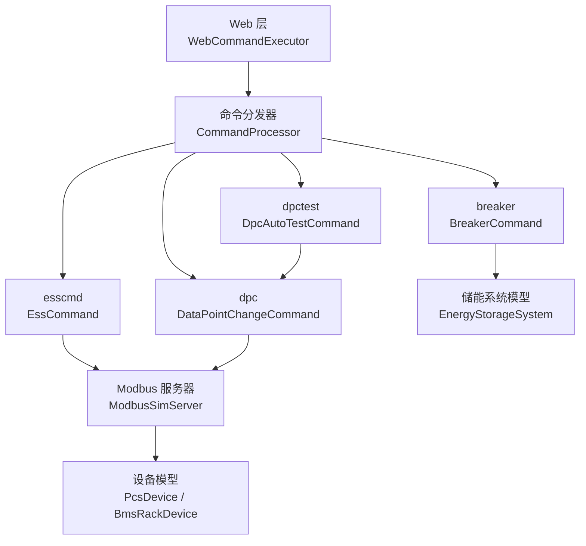

**图表来源**
- [WebCommandExecutor.cs:6-32](file://Web/WebCommandExecutor.cs#L6-L32)
- [CommandProcessor.cs:7-40](file://Display/CommandProcessor.cs#L7-L40)
- [ModbusSimServer.cs:29-70](file://Protocol/ModbusSimServer.cs#L29-L70)

**章节来源**
- [WebCommandExecutor.cs:6-32](file://Web/WebCommandExecutor.cs#L6-L32)
- [CommandProcessor.cs:7-40](file://Display/CommandProcessor.cs#L7-L40)

## 核心组件
- CommandProcessor：统一命令解析与分发，提供失败与未知命令的统一返回。
- WebCommandExecutor：复用 CommandProcessor，暴露同步 Execute 与异步 ExecuteDpcTestAsync，并通过 SignalR 推送进度。
- EssCommand：聚合多类设备控制命令（负载、链路、电网、PCS、BMS、光伏）。
- BreakerCommand：断路器 set 操作。
- DataPointChangeCommand：通用数据点读写（堆级/簇级），含帮助信息与批量写入。
- DpcAutoTestCommand：加载 autotest.json，顺序执行步骤，支持 sleep 与 dpc 子命令。
- ModbusSimServer：Modbus TCP 从站门面，负责点表索引、数据同步、注册表读写、在线控制。
- IModbusRegisterServer：统一的寄存器读写接口，供命令与管道使用。
- PcsDevice/BmsRackDevice：设备物理模型，接收控制指令并更新电气/热状态。

**章节来源**
- [CommandProcessor.cs:7-40](file://Display/CommandProcessor.cs#L7-L40)
- [WebCommandExecutor.cs:6-58](file://Web/WebCommandExecutor.cs#L6-L58)
- [EssCommand.cs:11-79](file://Display/EssCommand.cs#L11-L79)
- [BreakerCommand.cs:7-33](file://Display/BreakerCommand.cs#L7-L33)
- [DataPointChangeCommand.cs:8-131](file://Display/DataPointChangeCommand.cs#L8-L131)
- [DpcAutoTestCommand.cs:11-85](file://Display/DpcAutoTestCommand.cs#L11-L85)
- [ModbusSimServer.cs:29-175](file://Protocol/ModbusSimServer.cs#L29-L175)
- [IModbusRegisterServer.cs:1-19](file://Protocol/IModbusRegisterServer.cs#L1-L19)
- [PcsDevice.Core.cs:136-150](file://EssDeviceSimModel/Devices/PcsDevice.Core.cs#L136-L150)
- [BmsRackDevice.cs:98-114](file://EssDeviceSimModel/Devices/BmsRackDevice.cs#L98-L114)

## 架构总览
命令执行的整体时序如下：
- 前端发起命令请求（HTTP/SignalR）。
- WebCommandExecutor 调用 CommandProcessor.ProcessCommand 进行解析与分发。
- 具体命令处理器执行参数校验与业务逻辑，必要时调用 ModbusSimServer 或设备模型。
- 结果以 CommandResult 返回，Web 层将其转换为 HTTP 响应或 SignalR 事件。

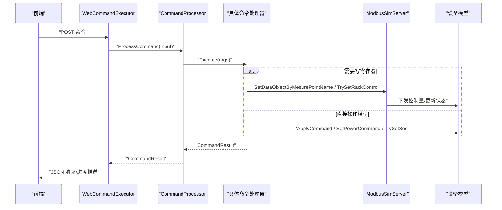

**图表来源**
- [WebCommandExecutor.cs:28-58](file://Web/WebCommandExecutor.cs#L28-L58)
- [CommandProcessor.cs:18-40](file://Display/CommandProcessor.cs#L18-L40)
- [ModbusSimServer.cs:144-175](file://Protocol/ModbusSimServer.cs#L144-L175)
- [PcsDevice.Core.cs:136-150](file://EssDeviceSimModel/Devices/PcsDevice.Core.cs#L136-L150)

## 详细组件分析

### 统一命令执行函数（CommandProcessor）
- 功能：空输入检查、按空格拆分命令与参数、大小写不敏感的命令名匹配、异常捕获并包装为失败结果。
- 关键点：
  - 空命令返回失败消息。
  - 未知命令返回 Unknown 结果，包含可用命令列表。
  - 执行异常被捕获并转为失败消息，避免上层崩溃。

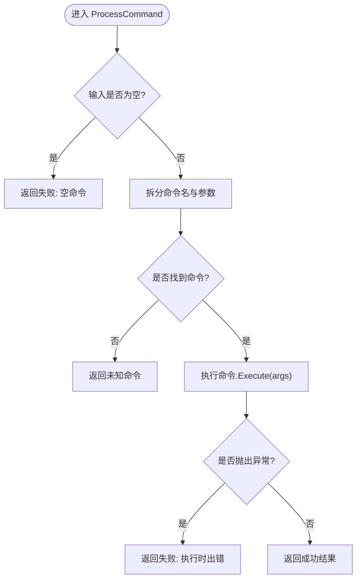

**图表来源**
- [CommandProcessor.cs:18-40](file://Display/CommandProcessor.cs#L18-L40)

**章节来源**
- [CommandProcessor.cs:18-40](file://Display/CommandProcessor.cs#L18-L40)

### Web 层命令执行器（WebCommandExecutor）
- 同步执行：委托给 CommandProcessor，返回 CommandResult。
- 异步执行：dpctest 测试用例，逐步通过回调推送进度到 SignalR 频道。
- 可用性：暴露 AvailableCommands 供前端查询。

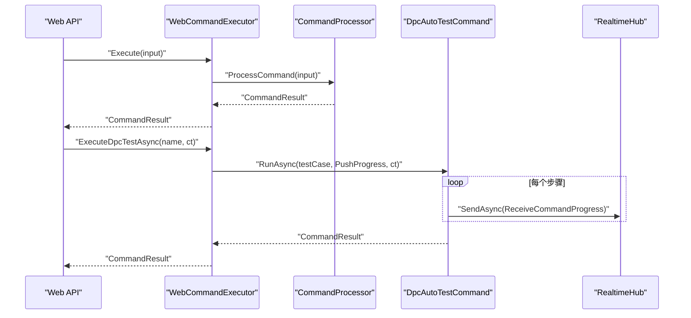

**图表来源**
- [WebCommandExecutor.cs:28-58](file://Web/WebCommandExecutor.cs#L28-L58)
- [DpcAutoTestCommand.cs:42-85](file://Display/DpcAutoTestCommand.cs#L42-L85)

**章节来源**
- [WebCommandExecutor.cs:28-58](file://Web/WebCommandExecutor.cs#L28-L58)
- [DpcAutoTestCommand.cs:42-85](file://Display/DpcAutoTestCommand.cs#L42-L85)

### 断路器操作命令（BreakerCommand）
- 用法：breaker set <true|false>
- 参数校验：必须两个参数，第二个为布尔值。
- 执行逻辑：获取 EnergyStorageSystem 实例，调用 SetMainBreakerClosed。
- 反馈：成功消息包含合闸/分闸状态。

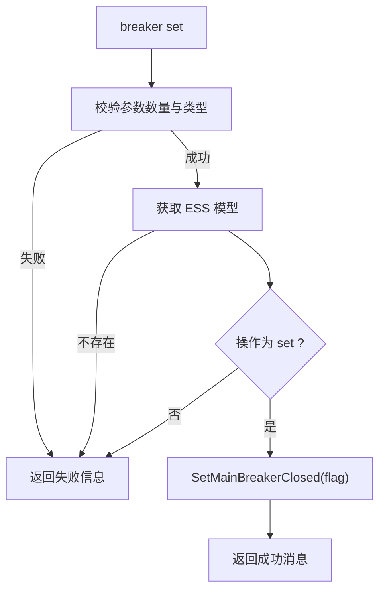

**图表来源**
- [BreakerCommand.cs:12-33](file://Display/BreakerCommand.cs#L12-L33)

**章节来源**
- [BreakerCommand.cs:12-33](file://Display/BreakerCommand.cs#L12-L33)

### 数据点变位命令（DataPointChangeCommand）
- 用法：
  - 堆级：dpc <device>.<datapoint> set|get [value]
  - 簇级：dpc <device>.r<N>.<datapoint> set <原始值> 或 r* 写全部簇
- 参数校验：
  - 点名格式正则匹配（dev.r<rack>.point）。
  - 操作仅支持 set/get（簇级目前仅支持 set）。
  - set 缺少值时报错。
- 执行逻辑：
  - 堆级：判断控制点或数据点，分别写入控制寄存器或数据存储区。
  - 簇级：根据 rackToken 解析目标簇集合，逐个调用 TrySetRackControl，支持越界中断。
- 反馈：
  - 成功消息包含时间戳、设备点名、写入值及说明。
  - 失败消息包含原因（找不到设备、点不存在、簇索引格式错误等）。

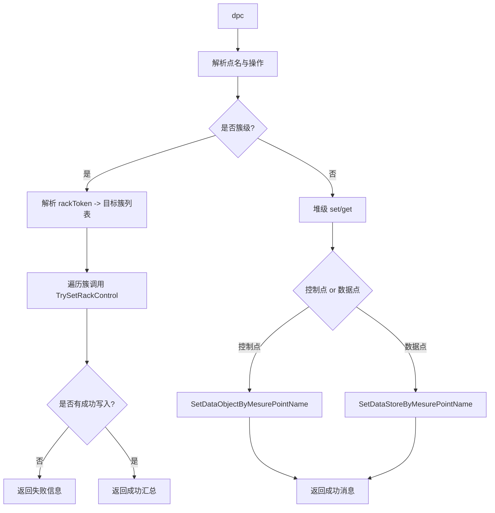

**图表来源**
- [DataPointChangeCommand.cs:31-226](file://Display/DataPointChangeCommand.cs#L31-L226)

**章节来源**
- [DataPointChangeCommand.cs:31-226](file://Display/DataPointChangeCommand.cs#L31-L226)

### 综合设备控制命令（EssCommand）
- 子命令：
  - setLoad activePower/reactivePower <数值>：设置负载有功/无功，有功限制 ≤0。
  - link pcsN|bmsN|em on/off/status：开启/关闭协议链路或查看状态。
  - setGrid frequency/voltage <数值>：设定仿真电网频率/电压。
  - pcsN start/stop：通过 dpc 写 EMU yx3/yx5 控制点实现 PCS 启停。
  - setbmsN power on/off：BMS 物理并网/离网。
  - setbmsN soc <0~1|%>：热设整堆 SOC，需待机且电流为 0。
  - bmsN fault clear：清除方向内部故障。
  - setpvN array A|B temperature|angle <数值>：设定光伏方阵温度/入射角。
- 参数校验：
  - 子命令格式严格校验（如 bmsN、pcsN、setpvN）。
  - 数值类型与范围校验（SOC 0~1 或 0~100，有功 ≤0）。
  - 设备存在性校验（模拟器主机中是否存在对应对象）。
- 执行逻辑：
  - 通过 SimulatorHost 获取模型或服务，调用相应方法。
  - 对 Modbus 服务进行在线控制或数据失效刷新。
- 反馈：
  - 成功消息包含操作结果与附加说明。
  - 失败消息包含具体原因（参数错误、设备不存在、操作失败等）。

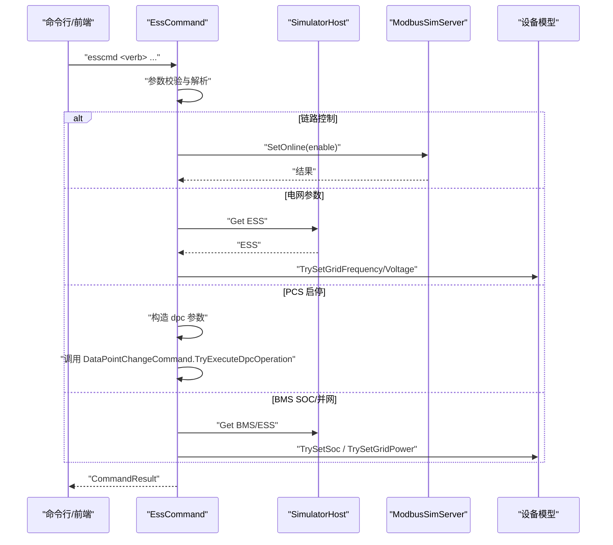

**图表来源**
- [EssCommand.cs:16-47](file://Display/EssCommand.cs#L16-L47)
- [EssCommand.cs:115-171](file://Display/EssCommand.cs#L115-L171)
- [EssCommand.cs:173-321](file://Display/EssCommand.cs#L173-L321)
- [EssCommand.cs:361-476](file://Display/EssCommand.cs#L361-L476)

**章节来源**
- [EssCommand.cs:16-47](file://Display/EssCommand.cs#L16-L47)
- [EssCommand.cs:115-171](file://Display/EssCommand.cs#L115-L171)
- [EssCommand.cs:173-321](file://Display/EssCommand.cs#L173-L321)
- [EssCommand.cs:361-476](file://Display/EssCommand.cs#L361-L476)

### 自动化测试命令（DpcAutoTestCommand）
- 功能：加载 autotest.json，顺序执行步骤，支持 sleep 与 dpc 子命令。
- 异步执行：RunAsync 通过回调上报进度，Web 层通过 SignalR 推送。
- 错误处理：步骤失败立即返回失败结果，包含失败步骤与原因。

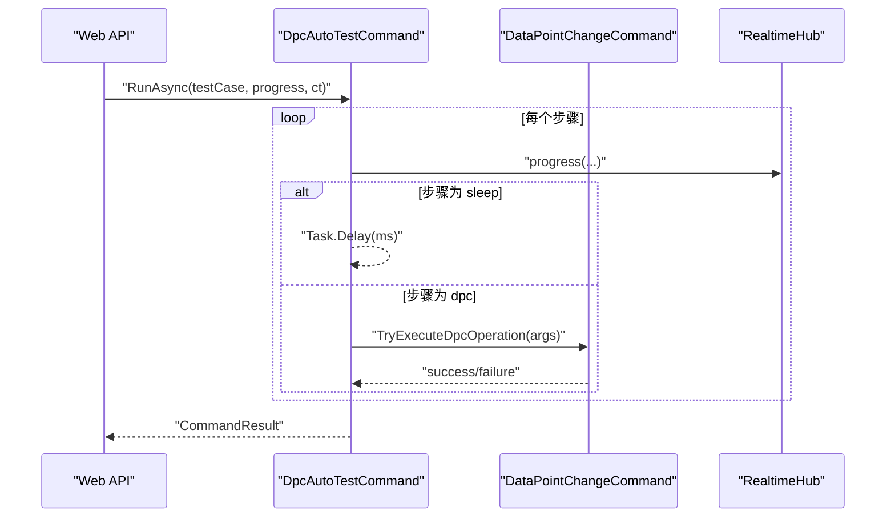

**图表来源**
- [DpcAutoTestCommand.cs:42-85](file://Display/DpcAutoTestCommand.cs#L42-L85)

**章节来源**
- [DpcAutoTestCommand.cs:42-85](file://Display/DpcAutoTestCommand.cs#L42-L85)

### Modbus 地址解析机制
- 点表加载：ModbusPointMap 从 CSV 读取点位表，建立 data/control/rack 点表索引，并按 ModelSim 列解析模型参数。
- 设备 ID 替换：根据 serverName 中的数字替换 ModelSim 中的占位符（如 bmsdeviceId、pvDeviceId、emuDeviceId）。
- 簇级点表：BMS 设备在 clusterCount > 0 时加载 bms_rack.csv，生成 RackControlMaps/RackDataMaps。
- 寄存器写入：
  - 堆级：SetDataObjectByMesurePointName/SetDataStoreByMesurePointName。
  - 簇级：TrySetRackControl 通过 RackControlPipeline 逐簇写入。
- YT 点地址计算：由 ModbusPointMap 的 Address 字段与 FunctionCode 决定；命令侧通过 ParamName 间接寻址，无需手动计算地址。

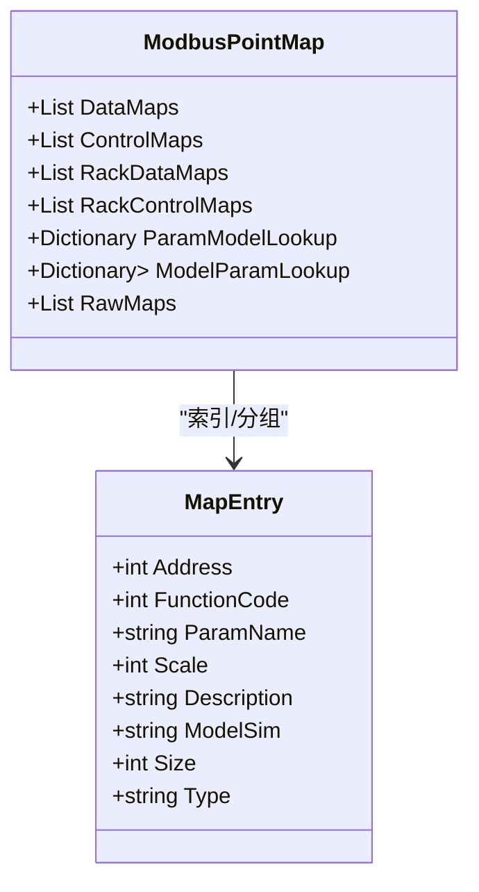

**图表来源**
- [ModbusPointMap.cs:15-50](file://Protocol/Modbus/ModbusPointMap.cs#L15-L50)
- [ModbusPointMap.cs:52-102](file://Protocol/Modbus/ModbusPointMap.cs#L52-L102)
- [ModbusPointMap.cs:104-123](file://Protocol/Modbus/ModbusPointMap.cs#L104-L123)
- [ModbusSimServer.cs:13-23](file://Protocol/ModbusSimServer.cs#L13-L23)

**章节来源**
- [ModbusPointMap.cs:15-123](file://Protocol/Modbus/ModbusPointMap.cs#L15-L123)
- [ModbusSimServer.cs:13-23](file://Protocol/ModbusSimServer.cs#L13-L23)

### 设备控制命令执行逻辑
- PCS 控制：
  - ApplyCommand 接收 DeviceCommand，处理启停与功率指令。
  - SetPowerCommand 进行限幅与视在功率检查，设置待执行功率。
  - Update 中根据模式与电网状态计算交流/直流端口输出。
- BMS 管理：
  - TrySetSoc 要求待机（电流为 0），成功后刷新 DC 端口。
  - SyncTelemetryAndProtection 评估保护并回写 Rack 故障态。
- 断路器：
  - 通过 EnergyStorageSystem.SetMainBreakerClosed 控制主断路器。

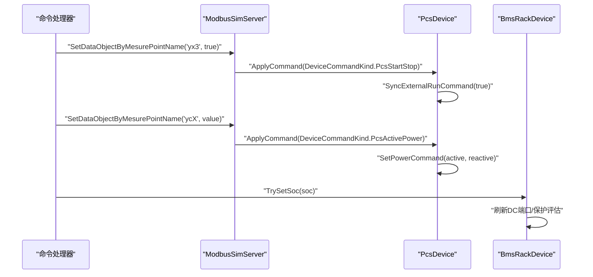

**图表来源**
- [PcsDevice.Core.cs:136-150](file://EssDeviceSimModel/Devices/PcsDevice.Core.cs#L136-L150)
- [PcsDevice.Core.cs:381-422](file://EssDeviceSimModel/Devices/PcsDevice.Core.cs#L381-L422)
- [BmsRackDevice.cs:98-114](file://EssDeviceSimModel/Devices/BmsRackDevice.cs#L98-L114)

**章节来源**
- [PcsDevice.Core.cs:136-150](file://EssDeviceSimModel/Devices/PcsDevice.Core.cs#L136-L150)
- [PcsDevice.Core.cs:381-422](file://EssDeviceSimModel/Devices/PcsDevice.Core.cs#L381-L422)
- [BmsRackDevice.cs:98-114](file://EssDeviceSimModel/Devices/BmsRackDevice.cs#L98-L114)

## 依赖关系分析
- 命令层依赖：
  - WebCommandExecutor 依赖 CommandProcessor 与各 ICommand 实现。
  - EssCommand 依赖 SimulatorHost、ModbusSimServer、设备模型。
- 数据交换层依赖：
  - ModbusSimServer 依赖 ModbusPointMap、DataExchangeSession/ModbusDataSync。
  - DataExchangeSession 依赖 Catalog、Pipeline、ShadowStore。
- 设备模型依赖：
  - PcsDevice 与 BmsRackDevice 作为仿真核心，接收控制并更新状态。

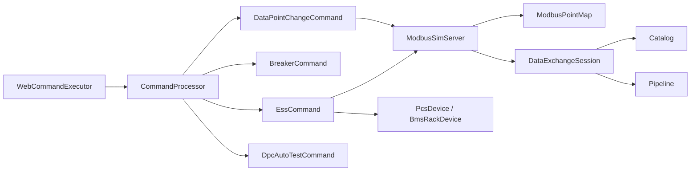

**图表来源**
- [WebCommandExecutor.cs:6-32](file://Web/WebCommandExecutor.cs#L6-L32)
- [CommandProcessor.cs:7-40](file://Display/CommandProcessor.cs#L7-L40)
- [ModbusSimServer.cs:29-70](file://Protocol/ModbusSimServer.cs#L29-L70)
- [ModbusPointMap.cs:15-50](file://Protocol/Modbus/ModbusPointMap.cs#L15-L50)

**章节来源**
- [WebCommandExecutor.cs:6-32](file://Web/WebCommandExecutor.cs#L6-L32)
- [CommandProcessor.cs:7-40](file://Display/CommandProcessor.cs#L7-L40)
- [ModbusSimServer.cs:29-70](file://Protocol/ModbusSimServer.cs#L29-L70)
- [ModbusPointMap.cs:15-50](file://Protocol/Modbus/ModbusPointMap.cs#L15-L50)

## 性能考虑
- 命令解析与分发为 O(1) 字典查找，开销极低。
- 簇级批量写入采用循环逐簇调用，若 rackToken 为 *，遇到越界即停止，避免无效遍历。
- Modbus 写入通过 SuppressWriteNotifications 抑制通知，减少重复触发。
- 异步 dpctest 通过 Task.Delay 与回调推送，避免阻塞主线程。

[本节为一般性指导，不直接分析具体文件]

## 故障排查指南
- 常见错误与提示：
  - 空命令/未知命令：CommandProcessor 返回失败或 Unknown。
  - 参数不足或类型错误：各命令处理器返回明确失败消息（如布尔解析失败、数值无效）。
  - 设备不存在：SimulatorHost 查询失败，返回超出范围或未就绪提示。
  - 点不存在：DataPointChangeCommand 提示点不支持或为簇级控制点需改用 r<N> 语法。
  - 簇索引越界：TrySetRackControl 返回越界信息，r* 模式下自动终止。
  - 链路不可用：EssCommand.link 无法上线/下线，返回失败。
- 调试建议：
  - 使用 dpc help 查看用法与示例。
  - 使用 esscmd link status 查看协议链路状态。
  - 检查 Modbus 服务是否在线（IsOnline）。
  - 对于 dpctest，查看 SignalR 进度推送日志定位失败步骤。

**章节来源**
- [CommandProcessor.cs:18-40](file://Display/CommandProcessor.cs#L18-L40)
- [DataPointChangeCommand.cs:31-131](file://Display/DataPointChangeCommand.cs#L31-L131)
- [EssCommand.cs:361-476](file://Display/EssCommand.cs#L361-L476)
- [ModbusSimServer.cs:114-131](file://Protocol/ModbusSimServer.cs#L114-L131)

## 结论
本系统通过 CommandProcessor 统一命令入口，结合 WebCommandExecutor 提供同步与异步执行能力，实现了断路器、PCS、BMS、光伏等多类设备控制的完整闭环。参数校验严谨、错误提示清晰、Modbus 地址解析透明化，便于运维与自动化测试。异步进度推送提升了用户体验，适合复杂测试场景。整体架构清晰、扩展性强，便于新增命令与设备类型。

[本节为总结性内容，不直接分析具体文件]

## 附录
- 命令结果模型：CommandResult 提供 Success、Message、Data 等字段，Web 层将其序列化为 JSON 返回前端。
- Web 端展示：前端 CommandView.vue 将 success 标记用于显示成功/失败消息，并维护历史输出。

**章节来源**
- [CommandResult.cs:3-30](file://Display/CommandResult.cs#L3-L30)
- [EndpointExtensions.cs:328-335](file://Web/EndpointExtensions.cs#L328-L335)