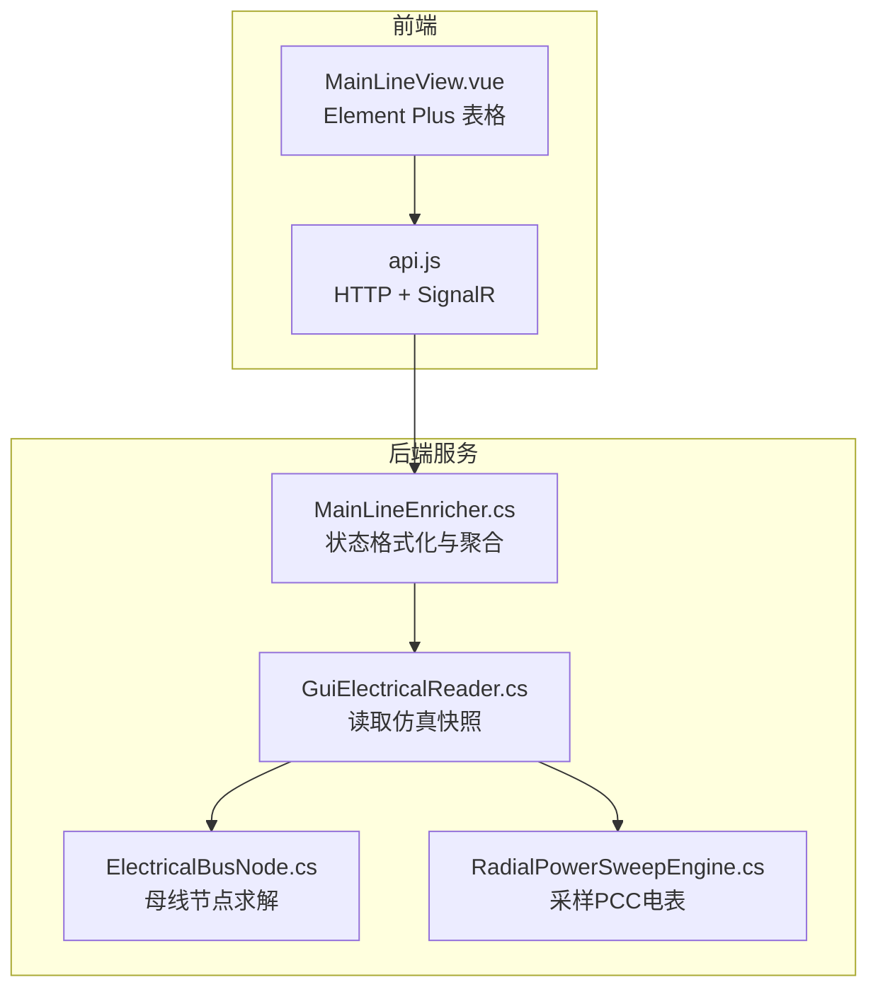
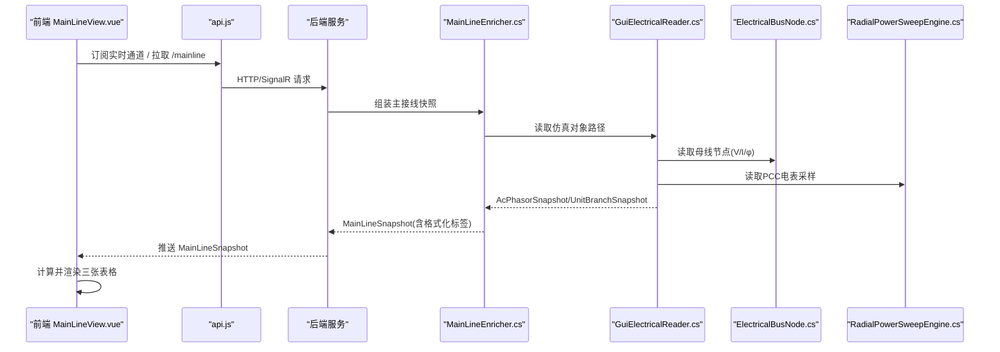
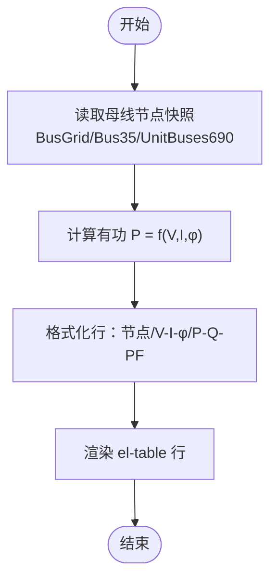
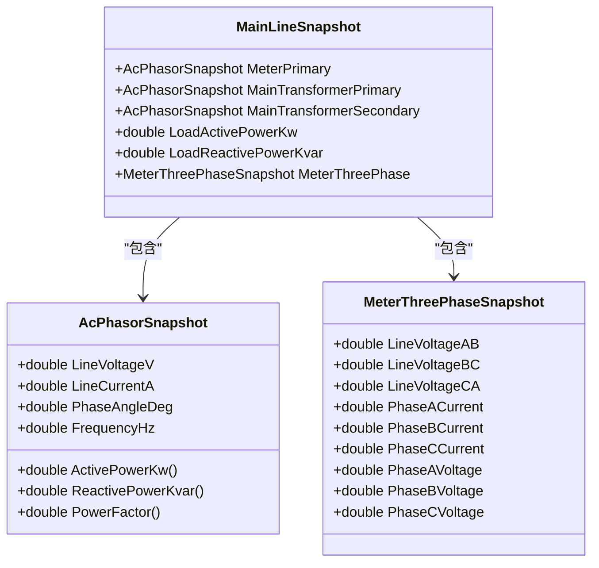
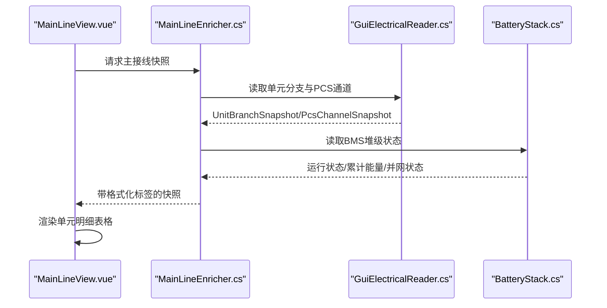
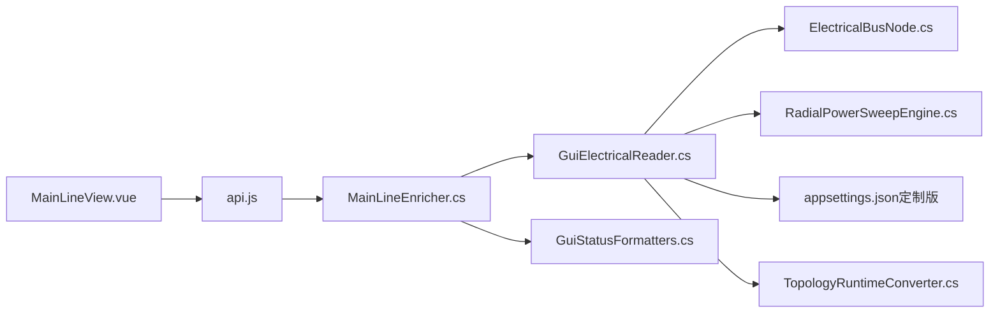

# 数据表格展示

<cite>
**本文引用的文件**
- [MainLineView.vue](file://Web/src/views/MainLineView.vue)
- [GuiElectricalReader.cs](file://Display/GuiElectricalReader.cs)
- [ElectricalBusNode.cs](file://EssDeviceSimModel/Propagation/ElectricalBusNode.cs)
- [RadialPowerSweepEngine.cs](file://EssDeviceSimModel/Propagation/RadialPowerSweepEngine.cs)
- [MainLineEnricher.cs](file://Web/MainLineEnricher.cs)
- [GuiStatusFormatters.cs](file://Display/GuiStatusFormatters.cs)
- [BatteryManagementSystemData.cs](file://EssSimModelApi/Bms/BatteryManagementSystemData.cs)
- [BatteryStack.cs](file://EssSimModelApi/Bms/BatteryStack.cs)
- [TopologyRuntimeConverter.cs](file://Web/Topology/TopologyRuntimeConverter.cs)
- [appsettings.json（定制版）](file://configs/定制版.appsettings.json)
- [api.js](file://Web/src/services/api.js)
</cite>

## 目录
1. [简介](#简介)
2. [项目结构](#项目结构)
3. [核心组件](#核心组件)
4. [架构总览](#架构总览)
5. [详细组件分析](#详细组件分析)
6. [依赖关系分析](#依赖关系分析)
7. [性能考虑](#性能考虑)
8. [故障排查指南](#故障排查指南)
9. [结论](#结论)
10. [附录](#附录)

## 简介
本文件聚焦储能仿真系统的前端“数据表格展示”能力，覆盖三类关键表格：
- 传播母线节点表格：展示各母线的相量信息（电压、电流、相位角）与功率信息（有功、无功、功率因数）。
- 交流设备表格：展示 PCC 电表、主变压器一次侧/二次侧、35kV 负载等关键设备的参数。
- 储能单元明细表格：综合展示单元断路器状态、PCS 通道状态、BMS 舱状态等信息。

同时说明数据格式化和计算逻辑（相量计算、功率计算、状态标签生成），以及 Element Plus 表格的使用与自定义列渲染实现细节。

## 项目结构
前端通过实时通道获取主接线快照，后端从仿真内核读取电气量并组装为统一的数据模型，再经 Web API 推送至前端进行表格渲染。

图表来源
- [MainLineView.vue:131-161](file://Web/src/views/MainLineView.vue#L131-L161)
- [api.js:14-34](file://Web/src/services/api.js#L14-L34)
- [MainLineEnricher.cs:162-177](file://Web/MainLineEnricher.cs#L162-L177)
- [GuiElectricalReader.cs:94-189](file://Display/GuiElectricalReader.cs#L94-L189)
- [ElectricalBusNode.cs:16-47](file://EssDeviceSimModel/Propagation/ElectricalBusNode.cs#L16-L47)
- [RadialPowerSweepEngine.cs:290-320](file://EssDeviceSimModel/Propagation/RadialPowerSweepEngine.cs#L290-L320)

章节来源
- [MainLineView.vue:131-161](file://Web/src/views/MainLineView.vue#L131-L161)
- [api.js:14-34](file://Web/src/services/api.js#L14-L34)

## 核心组件
- 传播母线节点表格
  - 数据来源：后端 MainLineSnapshot.BusGrid / Bus35Propagation / Units[].Bus690。
  - 显示字段：节点标识、相量（线电压/线电流/相位角/频率）、功率（有功/无功/功率因数）。
  - 计算逻辑：前端基于 V/I/φ 计算有功；无功在部分场景由后端提供或按默认值处理。
- 交流设备表格
  - 数据来源：MeterPrimary/MeterThreePhase、MainTransformerPrimary/Secondary、LoadActivePowerKw/ReactivePowerKvar。
  - 显示字段：设备名、总相量、三相线电压、三相相电流、功率。
- 储能单元明细表格
  - 数据来源：Units[] 中每个单元的断路器、单元变、PCS 通道、BMS 通道。
  - 显示字段：单元号、单元断/单元变、PCS-A/B、舱-A/B（含状态、目标/实际功率、模式、累计能量等）。

章节来源
- [MainLineView.vue:261-319](file://Web/src/views/MainLineView.vue#L261-L319)
- [GuiElectricalReader.cs:54-91](file://Display/GuiElectricalReader.cs#L54-L91)
- [MainLineEnricher.cs:162-177](file://Web/MainLineEnricher.cs#L162-L177)

## 架构总览
下图展示了从仿真内核到前端表格的端到端数据流，包括母线节点求解、PCC 电表采样、状态格式化与前端渲染。

图表来源
- [MainLineView.vue:579-591](file://Web/src/views/MainLineView.vue#L579-L591)
- [api.js:14-34](file://Web/src/services/api.js#L14-L34)
- [GuiElectricalReader.cs:94-189](file://Display/GuiElectricalReader.cs#L94-L189)
- [ElectricalBusNode.cs:16-47](file://EssDeviceSimModel/Propagation/ElectricalBusNode.cs#L16-L47)
- [RadialPowerSweepEngine.cs:290-320](file://EssDeviceSimModel/Propagation/RadialPowerSweepEngine.cs#L290-L320)
- [MainLineEnricher.cs:162-177](file://Web/MainLineEnricher.cs#L162-L177)

## 详细组件分析

### 传播母线节点表格
- 数据结构
  - 节点标识：busId（来自总线节点对象）。
  - 相量：lineVoltageV、lineCurrentA、phaseAngleDeg、frequencyHz。
  - 功率：p（kW）、q（kvar）、pf（功率因数）。
- 显示内容
  - 节点列：显示 busId。
  - 相量列：以“线电压 / 线电流 / φ° / 频率 Hz”形式呈现。
  - 功率列：以“P x kW Q y kvar PF z”形式呈现。
- 计算逻辑
  - 有功功率 p = f(V, I, φ)，使用交流量转换器计算。
  - 无功 q 与 pf 在部分场景由后端提供；若未提供，前端可留空或按默认策略处理。
- 实现要点
  - 前端 computed 将 BusGrid、Bus35Propagation、Units[].Bus690 汇总为行数组。
  - 使用 Element Plus 表格列模板渲染自定义文本。

图表来源
- [MainLineView.vue:261-279](file://Web/src/views/MainLineView.vue#L261-L279)
- [GuiElectricalReader.cs:23-28](file://Display/GuiElectricalReader.cs#L23-L28)
- [ElectricalBusNode.cs:35-47](file://EssDeviceSimModel/Propagation/ElectricalBusNode.cs#L35-L47)

章节来源
- [MainLineView.vue:261-279](file://Web/src/views/MainLineView.vue#L261-L279)
- [GuiElectricalReader.cs:23-28](file://Display/GuiElectricalReader.cs#L23-L28)
- [ElectricalBusNode.cs:35-47](file://EssDeviceSimModel/Propagation/ElectricalBusNode.cs#L35-L47)

### 交流设备表格
- 展示逻辑
  - PCC 电表：显示总相量、三相线电压、三相相电流、功率（P/Q）。
  - 主变一次侧/二次侧：显示总相量与功率（P/Q）。
  - 35kV 负载：显示功率（P/Q）。
- 数据来源
  - MeterPrimary 与 MeterThreePhase：来自仿真对象的电测量。
  - MainTransformerPrimary/Secondary：主变两侧端口内部量。
  - LoadActivePowerKw/ReactivePowerKvar：负载设定与实际值。
- 数据格式化
  - 相量：统一为“线电压 / 线电流 / φ°”。
  - 三相量：Uab/Ubc/Uca 与 Ia/Ib/Ic 分别拼接显示。
  - 功率：以“P x kW Q y kvar”形式呈现。

图表来源
- [GuiElectricalReader.cs:4-21](file://Display/GuiElectricalReader.cs#L4-L21)
- [GuiElectricalReader.cs:81-91](file://Display/GuiElectricalReader.cs#L81-L91)
- [GuiElectricalReader.cs:54-79](file://Display/GuiElectricalReader.cs#L54-L79)

章节来源
- [MainLineView.vue:281-310](file://Web/src/views/MainLineView.vue#L281-L310)
- [GuiElectricalReader.cs:54-91](file://Display/GuiElectricalReader.cs#L54-L91)

### 储能单元明细表格
- 展示内容
  - 单元号：UNIT 编号。
  - 单元断/单元变：断路器状态（合/分/跳闸）与单元变二次侧相量。
  - PCS-A/B：设备状态、启停控制、黑启动、目标/实际有功/无功、电网模式、交流线路状态。
  - 舱-A/B：BMS 紧凑状态、运行状态、累计充放能量、并网状态、黑启动状态。
- 数据来源
  - UnitBranchSnapshot：断路器、单元变、690V 母线、PCS 通道。
  - PcsChannelSnapshot：PCS 输出相量、功率、模式、黑启动标志。
  - BMS 数据：BatteryManagementSystemData 与 BatteryStack 中的堆级指标。
- 状态标签生成
  - 断路器：合/分/跳闸。
  - PCS：设备状态、启停、黑启动开关、目标/实际功率、电网模式。
  - BMS：运行状态、累计能量、并网状态、黑启动状态。
- 实现要点
  - 前端 computed 将 units 映射为表格行，调用格式化函数拼接多字段字符串。
  - 后端 MainLineEnricher 对 PCS 通道进行状态格式化，便于前端直接展示。

图表来源
- [MainLineView.vue:312-319](file://Web/src/views/MainLineView.vue#L312-L319)
- [MainLineEnricher.cs:162-177](file://Web/MainLineEnricher.cs#L162-L177)
- [GuiElectricalReader.cs:141-162](file://Display/GuiElectricalReader.cs#L141-L162)
- [BatteryStack.cs:25-41](file://EssSimModelApi/Bms/BatteryStack.cs#L25-L41)

章节来源
- [MainLineView.vue:312-319](file://Web/src/views/MainLineView.vue#L312-L319)
- [MainLineEnricher.cs:162-177](file://Web/MainLineEnricher.cs#L162-L177)
- [GuiElectricalReader.cs:141-162](file://Display/GuiElectricalReader.cs#L141-L162)
- [BatteryStack.cs:25-41](file://EssSimModelApi/Bms/BatteryStack.cs#L25-L41)

### 数据格式化和计算逻辑
- 相量计算
  - 使用交流量转换器根据 V、I、φ 计算有功、无功与功率因数。
  - 当缺少三相量时，采用平衡假设回填，保证界面始终有线电压/相电流。
- 功率计算
  - 有功：P = f(V, I, φ)。
  - 无功：Q = f(V, I, φ)。
  - 功率因数：PF = f(P, Q) 或直接由转换器提供。
- 状态标签生成
  - 断路器：合/分/跳闸。
  - PCS：设备状态、启停控制、黑启动、目标/实际功率、电网模式。
  - BMS：运行状态、累计能量、并网状态、黑启动状态。
- 配置影响
  - PCC 电表一次/二次额定值、精度等级等由配置文件决定，影响采样与上报。

章节来源
- [GuiElectricalReader.cs:192-214](file://Display/GuiElectricalReader.cs#L192-L214)
- [GuiStatusFormatters.cs:57-83](file://Display/GuiStatusFormatters.cs#L57-L83)
- [GuiStatusFormatters.cs:230-242](file://Display/GuiStatusFormatters.cs#L230-L242)
- [TopologyRuntimeConverter.cs:76-97](file://Web/Topology/TopologyRuntimeConverter.cs#L76-L97)
- [appsettings.json（定制版）:53-76](file://configs/定制版.appsettings.json#L53-L76)

### Element Plus 表格组件与自定义列渲染
- 使用方式
  - 使用 el-table 绑定数据源（busRows、acRows、unitRows）。
  - 使用 el-table-column 定义列，prop 绑定基础字段。
  - 使用 #default 插槽自定义复杂列渲染（如相量、功率、状态组合）。
- 自定义列渲染
  - 相量列：拼接“线电压 / 线电流 / φ° / 频率 Hz”。
  - 功率列：拼接“P x kW Q y kvar PF z”。
  - 状态列：拼接多个状态字段（设备状态、启停、黑启动、模式等）。
- 交互与提示
  - 输入框与按钮用于设定负载、电网电压/频率等。
  - 错误与成功消息通过 ElMessage 提示。

章节来源
- [MainLineView.vue:131-161](file://Web/src/views/MainLineView.vue#L131-L161)
- [MainLineView.vue:221-255](file://Web/src/views/MainLineView.vue#L221-L255)
- [MainLineView.vue:526-577](file://Web/src/views/MainLineView.vue#L526-L577)

## 依赖关系分析
- 前端依赖
  - MainLineView.vue 依赖 api.js 提供的 HTTP 与 SignalR 接口。
  - 表格渲染依赖后端返回的 MainLineSnapshot 结构。
- 后端依赖
  - MainLineEnricher.cs 依赖 GuiStatusFormatters.cs 进行状态格式化。
  - GuiElectricalReader.cs 依赖仿真内核对象路径读取电气量。
  - ElectricalBusNode.cs 提供母线节点求解与功率贡献聚合。
  - RadialPowerSweepEngine.cs 负责 PCC 电表采样。
- 外部配置
  - appsettings.json（定制版）定义 PCC 电表、主变等额定参数。
  - TopologyRuntimeConverter.cs 将组态工程转换为运行时配置。

图表来源
- [MainLineView.vue:579-591](file://Web/src/views/MainLineView.vue#L579-L591)
- [api.js:14-34](file://Web/src/services/api.js#L14-L34)
- [MainLineEnricher.cs:162-177](file://Web/MainLineEnricher.cs#L162-L177)
- [GuiElectricalReader.cs:94-189](file://Display/GuiElectricalReader.cs#L94-L189)
- [ElectricalBusNode.cs:16-47](file://EssDeviceSimModel/Propagation/ElectricalBusNode.cs#L16-L47)
- [RadialPowerSweepEngine.cs:290-320](file://EssDeviceSimModel/Propagation/RadialPowerSweepEngine.cs#L290-L320)
- [GuiStatusFormatters.cs:57-83](file://Display/GuiStatusFormatters.cs#L57-L83)
- [TopologyRuntimeConverter.cs:76-97](file://Web/Topology/TopologyRuntimeConverter.cs#L76-L97)
- [appsettings.json（定制版）:53-76](file://configs/定制版.appsettings.json#L53-L76)

章节来源
- [MainLineView.vue:579-591](file://Web/src/views/MainLineView.vue#L579-L591)
- [api.js:14-34](file://Web/src/services/api.js#L14-L34)
- [MainLineEnricher.cs:162-177](file://Web/MainLineEnricher.cs#L162-L177)
- [GuiElectricalReader.cs:94-189](file://Display/GuiElectricalReader.cs#L94-L189)
- [ElectricalBusNode.cs:16-47](file://EssDeviceSimModel/Propagation/ElectricalBusNode.cs#L16-L47)
- [RadialPowerSweepEngine.cs:290-320](file://EssDeviceSimModel/Propagation/RadialPowerSweepEngine.cs#L290-L320)
- [GuiStatusFormatters.cs:57-83](file://Display/GuiStatusFormatters.cs#L57-L83)
- [TopologyRuntimeConverter.cs:76-97](file://Web/Topology/TopologyRuntimeConverter.cs#L76-L97)
- [appsettings.json（定制版）:53-76](file://configs/定制版.appsettings.json#L53-L76)

## 性能考虑
- 前端渲染
  - 使用 computed 缓存表格行数据，减少重复计算。
  - 自定义列渲染尽量轻量，避免复杂 DOM 操作。
- 数据传输
  - 通过 SignalR 实时推送，降低轮询开销。
  - 合理分页与限制更新频率，避免频繁重绘。
- 后端计算
  - 母线节点求解与功率贡献聚合在仿真步内完成，避免额外阻塞。
  - 电表采样与状态格式化按需执行，减少不必要计算。

[本节为通用指导，不直接分析具体文件]

## 故障排查指南
- 表格无数据
  - 检查 SignalR 连接是否正常，确认 /hub/realtime 已建立。
  - 验证后端是否返回 MainLineSnapshot，字段是否为空。
- 相量/功率异常
  - 检查仿真内核对象路径是否正确，确保 V/I/φ 有效。
  - 确认交流量转换器参数（频率、连接方式）与配置一致。
- 状态标签不正确
  - 核对断路器状态、PCS 模式、BMS 运行状态来源路径。
  - 检查状态格式化函数是否被正确调用。
- 配置问题
  - 校验 PCC 电表一次/二次额定值、精度等级等配置项。
  - 确认拓扑转换后的运行时配置与预期一致。

章节来源
- [MainLineView.vue:579-591](file://Web/src/views/MainLineView.vue#L579-L591)
- [GuiElectricalReader.cs:192-214](file://Display/GuiElectricalReader.cs#L192-L214)
- [GuiStatusFormatters.cs:230-242](file://Display/GuiStatusFormatters.cs#L230-L242)
- [TopologyRuntimeConverter.cs:76-97](file://Web/Topology/TopologyRuntimeConverter.cs#L76-L97)
- [appsettings.json（定制版）:53-76](file://configs/定制版.appsettings.json#L53-L76)

## 结论
本系统通过后端统一读取仿真内核电气量并进行状态格式化，前端使用 Element Plus 表格进行直观展示。传播母线节点表格、交流设备表格与储能单元明细表格共同构成主接线监控的核心视图。通过合理的计算逻辑与格式化策略，用户可快速获取关键参数与设备状态，支持运维与调试需求。

[本节为总结性内容，不直接分析具体文件]

## 附录
- 相关 API
  - 获取主接线快照：/mainline
  - 发送命令：/command
  - 断路器控制：/breaker/main/{closed}、/breaker/unit/{unit}/{closed}
- 实时通道
  - SignalR Hub：/hub/realtime
  - 频道与方法：ReceiveMainLine

章节来源
- [api.js:14-34](file://Web/src/services/api.js#L14-L34)
- [api.js:71-85](file://Web/src/services/api.js#L71-L85)