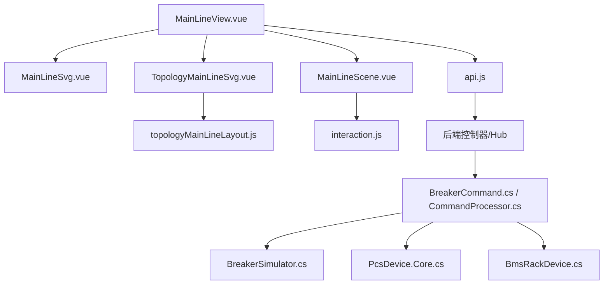
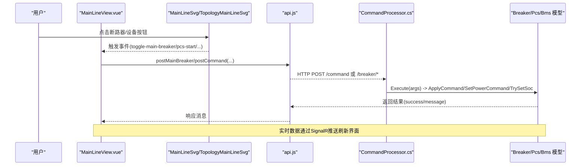
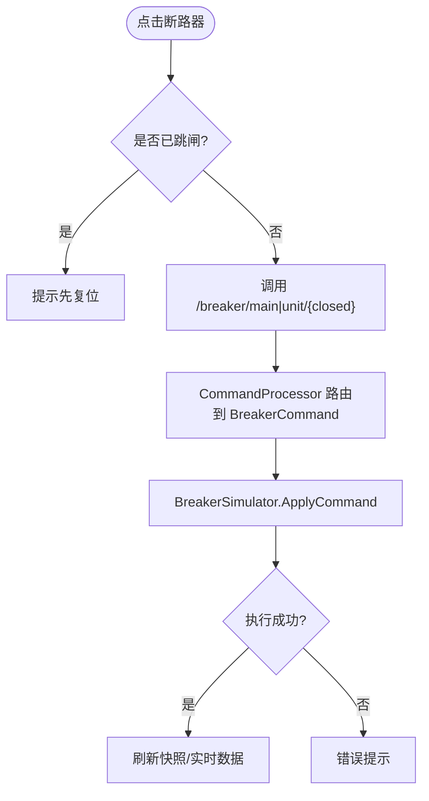
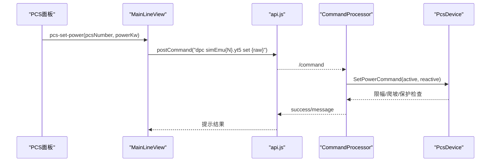
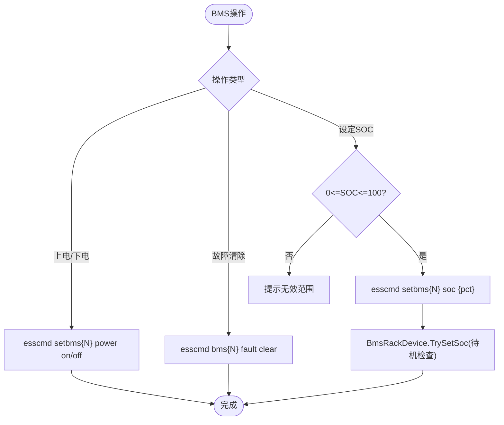
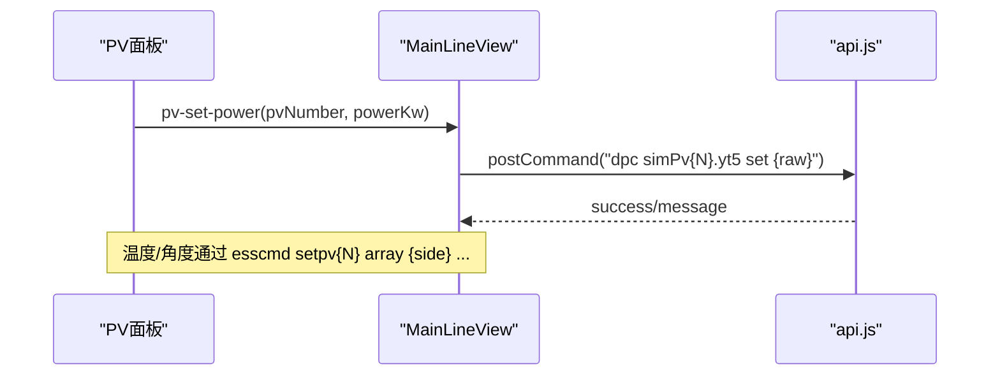
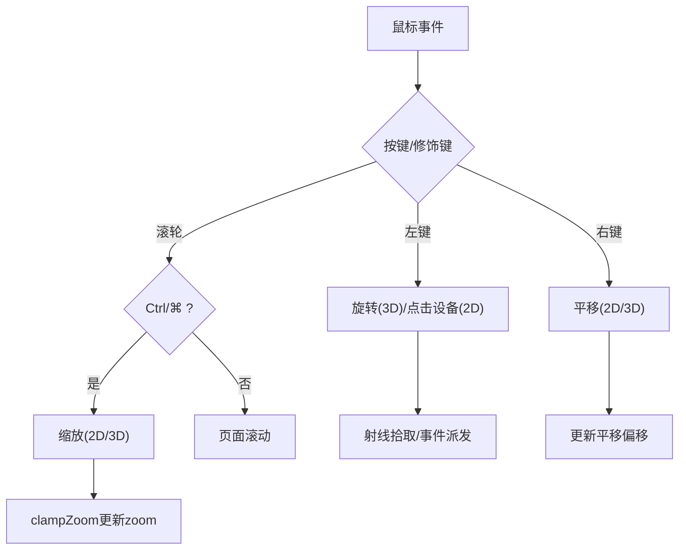
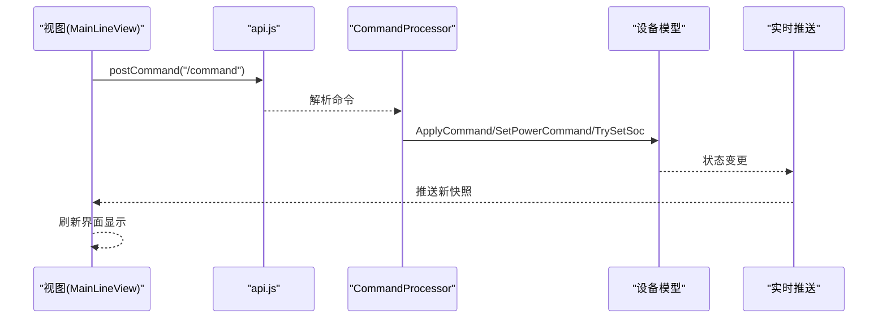
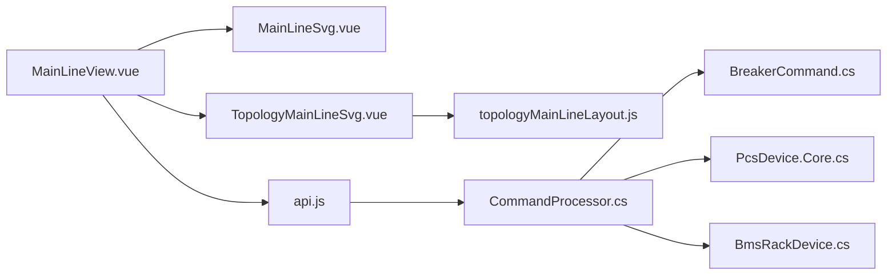

# 电气主接线交互

<cite>
**本文引用的文件**
- [MainLineView.vue](file://Web/src/views/MainLineView.vue)
- [MainLineSvg.vue](file://Web/src/components/MainLineSvg.vue)
- [TopologyMainLineSvg.vue](file://Web/src/components/TopologyMainLineSvg.vue)
- [topologyMainLineLayout.js](file://Web/src/components/topology/topologyMainLineLayout.js)
- [MainLineScene.vue](file://Web/src/components/MainLineScene.vue)
- [interaction.js](file://Web/src/components/mainline3d/interaction.js)
- [BreakerCommand.cs](file://Display/BreakerCommand.cs)
- [CommandProcessor.cs](file://Display/CommandProcessor.cs)
- [BreakerSimulator.cs](file://EssDeviceSimModel/Devices/BreakerSimulator.cs)
- [PcsDevice.Core.cs](file://EssDeviceSimModel/Devices/PcsDevice.Core.cs)
- [BmsRackDevice.cs](file://EssDeviceSimModel/Devices/BmsRackDevice.cs)
- [api.js](file://Web/src/services/api.js)
</cite>

## 目录
1. [简介](#简介)
2. [项目结构](#项目结构)
3. [核心组件](#核心组件)
4. [架构总览](#架构总览)
5. [详细组件分析](#详细组件分析)
6. [依赖关系分析](#依赖关系分析)
7. [性能考虑](#性能考虑)
8. [故障排查指南](#故障排查指南)
9. [结论](#结论)

## 简介
本文件面向“电气主接线交互”功能，覆盖两种显示与操作模式：经典单线图模式与工程拓扑模式；并详细说明断路器操作、PCS设备控制、BMS设备管理、光伏系统控制以及鼠标交互实现。同时给出事件处理到命令执行的完整流程说明，帮助读者理解从前端点击到后端模型更新的端到端链路。

## 项目结构
- 前端视图层
  - MainLineView.vue：页面入口，根据运行态决定是否使用“工程拓扑模式”，统一派发事件到具体视图组件。
  - MainLineSvg.vue：经典单线图（固定布局），提供断路器点击、PCS/BMS控件、缩放平移等交互。
  - TopologyMainLineSvg.vue：工程拓扑模式（由组态图推导布局），支持更丰富的站侧结构与单元展开。
  - topologyMainLineLayout.js：将拓扑工程节点/边解析为可渲染的单线图布局（母线、变压器、电表、负载、单元）。
  - MainLineScene.vue：3D场景容器，负责全屏、视角切换、事件分发。
  - interaction.js：Three.js OrbitControls 与射线拾取，实现左键旋转、滚轮缩放、右键平移、单击/双击设备。
- 后端命令与仿真模型
  - BreakerCommand.cs / CommandProcessor.cs：命令行处理器，解析 breaker 命令并调用储能系统模型。
  - BreakerSimulator.cs：断路器仿真器，实现合分闸、跳闸复位、过流保护。
  - PcsDevice.Core.cs：PCS设备模型，实现启停、有功/无功设定、爬坡、黑启动、保护等。
  - BmsRackDevice.cs：BMS电池舱模型，实现上电/下电、故障清除、SOC设定、热管理与端口同步。
- Web API 与实时数据
  - api.js：封装 REST 接口与 SignalR Hub，用于获取主接线快照、下发命令、建立实时推送通道。

图表来源
- [MainLineView.vue:86-129](file://Web/src/views/MainLineView.vue#L86-L129)
- [MainLineSvg.vue:1-160](file://Web/src/components/MainLineSvg.vue#L1-L160)
- [TopologyMainLineSvg.vue:1-384](file://Web/src/components/TopologyMainLineSvg.vue#L1-L384)
- [topologyMainLineLayout.js:370-793](file://Web/src/components/topology/topologyMainLineLayout.js#L370-L793)
- [MainLineScene.vue:1-250](file://Web/src/components/MainLineScene.vue#L1-L250)
- [interaction.js:1-44](file://Web/src/components/mainline3d/interaction.js#L1-L44)
- [api.js:14-35](file://Web/src/services/api.js#L14-L35)

章节来源
- [MainLineView.vue:86-129](file://Web/src/views/MainLineView.vue#L86-L129)
- [MainLineSvg.vue:1-160](file://Web/src/components/MainLineSvg.vue#L1-L160)
- [TopologyMainLineSvg.vue:1-384](file://Web/src/components/TopologyMainLineSvg.vue#L1-L384)
- [topologyMainLineLayout.js:370-793](file://Web/src/components/topology/topologyMainLineLayout.js#L370-L793)
- [MainLineScene.vue:1-250](file://Web/src/components/MainLineScene.vue#L1-L250)
- [interaction.js:1-44](file://Web/src/components/mainline3d/interaction.js#L1-L44)
- [api.js:14-35](file://Web/src/services/api.js#L14-L35)

## 核心组件
- 视图与交互
  - 经典单线图：固定站侧骨架（电网-主变-35kV母线-多单元），每个单元含单元断路器、单元变、690V母线、PCS-A/B、BMS舱。
  - 工程拓扑模式：由组态工程自动推导站侧骨架（母线、变压器、电表、负载）与单元展开，支持虚线框分组、运行时缺失占位提示。
- 设备模型
  - 断路器：合闸/分闸/跳闸复位，过流保护触发后需复位。
  - PCS：启停控制、有功/无功设定、爬坡限制、黑启动构网、温度与电流保护。
  - BMS：上电/下电、故障清除、SOC设定（需在待机状态）、热网络与端口同步。
- 命令与API
  - 前端通过 api.js 调用 /breaker/* 与 /command 接口，后端 CommandProcessor 路由到具体命令执行器，最终驱动仿真模型。

章节来源
- [MainLineSvg.vue:1-160](file://Web/src/components/MainLineSvg.vue#L1-L160)
- [TopologyMainLineSvg.vue:1-384](file://Web/src/components/TopologyMainLineSvg.vue#L1-L384)
- [BreakerSimulator.cs:28-98](file://EssDeviceSimModel/Devices/BreakerSimulator.cs#L28-L98)
- [PcsDevice.Core.cs:136-150](file://EssDeviceSimModel/Devices/PcsDevice.Core.cs#L136-L150)
- [BmsRackDevice.cs:98-114](file://EssDeviceSimModel/Devices/BmsRackDevice.cs#L98-L114)
- [api.js:31-35](file://Web/src/services/api.js#L31-L35)

## 架构总览
下图展示从用户交互到设备模型更新的完整链路：

图表来源
- [MainLineView.vue:330-524](file://Web/src/views/MainLineView.vue#L330-L524)
- [MainLineSvg.vue:52-138](file://Web/src/components/MainLineSvg.vue#L52-L138)
- [TopologyMainLineSvg.vue:61-348](file://Web/src/components/TopologyMainLineSvg.vue#L61-L348)
- [api.js:31-35](file://Web/src/services/api.js#L31-L35)
- [CommandProcessor.cs:18-40](file://Display/CommandProcessor.cs#L18-L40)
- [BreakerCommand.cs:12-32](file://Display/BreakerCommand.cs#L12-L32)

## 详细组件分析

### 两种模式的功能差异
- 经典单线图模式
  - 固定站侧结构：220kV电网→主变→35kV母线→多个储能单元（单元断路器、单元变、690V母线、PCS-A/B、BMS舱）。
  - 交互：左键点击断路器切换状态；右键拖拽平移；Ctrl/⌘+滚轮缩放；PCS/BMS面板内输入设定值并点击“设定”。
  - 适用：快速演示、通用配置、无需工程组态。
- 工程拓扑模式
  - 动态站侧结构：由拓扑工程节点/边推导母线、变压器、电表、负载位置，单元按设备类型展开（EMU/PV）。
  - 交互：同样支持右键平移与Ctrl/⌘+滚轮缩放；主断点击在组态中标记为主断的断路器生效；单元断点击对应单元断路器；PCS/BMS/PV控件与经典模式一致。
  - 优势：随工程变化自动适配，支持运行时缺失占位提示、分组虚线框、负载与电表可视化。

章节来源
- [MainLineSvg.vue:1-160](file://Web/src/components/MainLineSvg.vue#L1-L160)
- [TopologyMainLineSvg.vue:1-384](file://Web/src/components/TopologyMainLineSvg.vue#L1-L384)
- [topologyMainLineLayout.js:370-793](file://Web/src/components/topology/topologyMainLineLayout.js#L370-L793)
- [MainLineView.vue:86-129](file://Web/src/views/MainLineView.vue#L86-L129)

### 断路器操作功能
- 主断路器合分闸控制
  - 前端：MainLineView.onToggleMainBreaker 调用 postMainBreaker(next)，若已跳闸则提示先复位。
  - 后端：/breaker/main/{closed} 接口触发 BreakerCommand.Execute，调用 EnergyStorageSystem.SetMainBreakerClosed(flag)。
  - 模型：BreakerSimulator.ApplyCommand 处理 Close/Open/ResetTrip，并在过流时置跳闸。
- 单元断路器操作
  - 前端：点击单元断路器触发 toggle-unit-breaker，调用 postUnitBreaker(unitIndex+1, next)。
  - 模型：同主断逻辑，受单元级保护与联锁约束。

图表来源
- [MainLineView.vue:330-357](file://Web/src/views/MainLineView.vue#L330-L357)
- [BreakerCommand.cs:12-32](file://Display/BreakerCommand.cs#L12-L32)
- [BreakerSimulator.cs:28-98](file://EssDeviceSimModel/Devices/BreakerSimulator.cs#L28-L98)

章节来源
- [MainLineView.vue:330-357](file://Web/src/views/MainLineView.vue#L330-L357)
- [BreakerCommand.cs:12-32](file://Display/BreakerCommand.cs#L12-L32)
- [BreakerSimulator.cs:28-98](file://EssDeviceSimModel/Devices/BreakerSimulator.cs#L28-L98)

### PCS设备控制功能
- 启动/停止控制
  - 前端：pcs-start/pcs-stop 事件 → runChannelCommand(`esscmd pcs{N} start/stop`) → /command 接口。
  - 模型：PcsDevice.ApplyCommand(DeviceCommandKind.PcsStartStop) 同步外部启停位，进入/退出 Off/Normal/Standby 模式。
- 有功/无功功率设定
  - 前端：PCS面板输入P/Q，resolvePcsModbus 解析 emuUnit 与 ytPoint，调用 dpc simEmu{N}.yt{point} set {raw}。
  - 模型：PcsDevice.SetPowerCommand(active, reactive) 进行限幅、视在功率校验、爬坡延迟与停止请求处理。
- 黑启动与保护
  - 模型：PcsDevice 支持黑启动构网、孤岛/并网模式切换、温度与过流保护、故障锁存与自动撤回启停令。

图表来源
- [MainLineView.vue:370-410](file://Web/src/views/MainLineView.vue#L370-L410)
- [api.js:31-35](file://Web/src/services/api.js#L31-L35)
- [PcsDevice.Core.cs:136-150](file://EssDeviceSimModel/Devices/PcsDevice.Core.cs#L136-L150)
- [PcsDevice.Core.cs:380-422](file://EssDeviceSimModel/Devices/PcsDevice.Core.cs#L380-L422)

章节来源
- [MainLineView.vue:370-410](file://Web/src/views/MainLineView.vue#L370-L410)
- [PcsDevice.Core.cs:136-150](file://EssDeviceSimModel/Devices/PcsDevice.Core.cs#L136-L150)
- [PcsDevice.Core.cs:380-422](file://EssDeviceSimModel/Devices/PcsDevice.Core.cs#L380-L422)

### BMS设备管理功能
- 电源开关
  - 前端：bms-power-on/bms-power-off → runChannelCommand(`esscmd setbms{N} power on/off`)。
- 故障复位
  - 前端：bms-fault-clear → runChannelCommand(`esscmd bms{N} fault clear`)。
- SOC设定
  - 前端：bms-set-soc → runChannelCommand(`esscmd setbms{N} soc {pct}`)，校验范围 0~100。
- 模型行为
  - BmsRackDevice.TrySetSoc：仅在待机（无充放电电流）时允许修改SOC，否则提示先待机；更新后同步DC端口电压。

图表来源
- [MainLineView.vue:500-524](file://Web/src/views/MainLineView.vue#L500-L524)
- [BmsRackDevice.cs:98-114](file://EssDeviceSimModel/Devices/BmsRackDevice.cs#L98-L114)

章节来源
- [MainLineView.vue:500-524](file://Web/src/views/MainLineView.vue#L500-L524)
- [BmsRackDevice.cs:98-114](file://EssDeviceSimModel/Devices/BmsRackDevice.cs#L98-L114)

### 光伏系统控制功能
- 逆变器启停
  - 前端：pv-start/pv-stop → runChannelCommand(`dpc simPv{N}.yt4 set 1/0`)。
- 功率设定
  - 有功：pv-set-power → `dpc simPv{N}.yt5 set {raw}`，要求功率≥0。
  - 无功：pv-set-reactive → `dpc simPv{N}.yt7 set {raw}`。
- 温度与角度调节
  - 温度：pv-set-temp → `esscmd setpv{N} array {side} temperature {℃}`。
  - 角度：pv-set-angle → `esscmd setpv{N} array {side} angle {°}`。

图表来源
- [MainLineView.vue:417-498](file://Web/src/views/MainLineView.vue#L417-L498)

章节来源
- [MainLineView.vue:417-498](file://Web/src/views/MainLineView.vue#L417-L498)

### 鼠标交互操作的实现细节
- 经典单线图（MainLineSvg.vue）
  - 左键：点击断路器区域触发 toggle-main-breaker/toggle-unit-breaker。
  - 右键：按下后拖拽平移（isPanning=true，记录起始坐标并实时更新 panX/panY）。
  - 滚轮：按住 Ctrl/⌘ 才缩放，普通滚轮交由页面滚动；缩放范围 MIN_ZOOM~MAX_ZOOM。
- 工程拓扑模式（TopologyMainLineSvg.vue）
  - 交互与经典模式一致：右键平移、Ctrl/⌘+滚轮缩放；主断/单元断点击绑定到组态中的断路器节点。
- 3D场景（MainLineScene.vue + interaction.js）
  - 左键：旋转视角（OrbitControls LEFT=ROTATE）。
  - 中键：缩放（MIDDLE=DOLLY）。
  - 右键：平移（RIGHT=PAN）。
  - 单击：射线拾取断路器/设备面板，触发 onBreakerClick/onDeviceClick。
  - 双击：进入设备详情（如BMS舱），view-mode 事件切换 detailKey。

图表来源
- [MainLineSvg.vue:216-249](file://Web/src/components/MainLineSvg.vue#L216-L249)
- [TopologyMainLineSvg.vue:464-489](file://Web/src/components/TopologyMainLineSvg.vue#L464-L489)
- [interaction.js:10-22](file://Web/src/components/mainline3d/interaction.js#L10-L22)
- [MainLineScene.vue:117-172](file://Web/src/components/MainLineScene.vue#L117-L172)

章节来源
- [MainLineSvg.vue:216-249](file://Web/src/components/MainLineSvg.vue#L216-L249)
- [TopologyMainLineSvg.vue:464-489](file://Web/src/components/TopologyMainLineSvg.vue#L464-L489)
- [interaction.js:10-22](file://Web/src/components/mainline3d/interaction.js#L10-L22)
- [MainLineScene.vue:117-172](file://Web/src/components/MainLineScene.vue#L117-L172)

### 事件处理和命令执行的完整流程
- 事件捕获
  - 2D视图：MainLineSvg/TopologyMainLineSvg 通过 @click/@contextmenu/@wheel 捕获用户操作，向上 emit 事件至 MainLineView。
  - 3D视图：MainLineScene 通过 SceneController 与 interaction.js 拾取对象，onEvent 分发到 MainLineScene 的 emit。
- 命令构建与发送
  - MainLineView 根据事件类型构建命令字符串（如 esscmd pcs{N} start、dpc simEmu{N}.yt5 set ...），调用 postCommand 或专用 /breaker/* 接口。
- 后端处理
  - CommandProcessor 解析命令名与参数，查找 ICommand 实现并执行；BreakerCommand 直接操作 EnergyStorageSystem 主断。
- 模型更新与反馈
  - 设备模型（Breaker/Pcs/Bms）应用命令，更新内部状态与端口输出；通过实时推送（SignalR）刷新前端快照，用户看到最新状态。

图表来源
- [MainLineView.vue:321-524](file://Web/src/views/MainLineView.vue#L321-L524)
- [CommandProcessor.cs:18-40](file://Display/CommandProcessor.cs#L18-L40)
- [BreakerCommand.cs:12-32](file://Display/BreakerCommand.cs#L12-L32)
- [PcsDevice.Core.cs:136-150](file://EssDeviceSimModel/Devices/PcsDevice.Core.cs#L136-L150)
- [BmsRackDevice.cs:98-114](file://EssDeviceSimModel/Devices/BmsRackDevice.cs#L98-L114)

章节来源
- [MainLineView.vue:321-524](file://Web/src/views/MainLineView.vue#L321-L524)
- [CommandProcessor.cs:18-40](file://Display/CommandProcessor.cs#L18-L40)
- [BreakerCommand.cs:12-32](file://Display/BreakerCommand.cs#L12-L32)
- [PcsDevice.Core.cs:136-150](file://EssDeviceSimModel/Devices/PcsDevice.Core.cs#L136-L150)
- [BmsRackDevice.cs:98-114](file://EssDeviceSimModel/Devices/BmsRackDevice.cs#L98-L114)

## 依赖关系分析
- 前端依赖
  - MainLineView 依赖两个视图组件与 api.js；根据运行态选择渲染路径。
  - TopologyMainLineSvg 依赖 topologyMainLineLayout.js 生成布局。
  - MainLineScene 依赖 Three.js 与 interaction.js 实现3D交互。
- 后端依赖
  - CommandProcessor 依赖 ICommand 集合；BreakerCommand 依赖 EnergyStorageSystem。
  - 设备模型（Breaker/Pcs/Bms）被 CommandProcessor 间接调用或通过其他命令管线驱动。
- 数据流
  - 实时数据通过 SignalR Hub 推送至前端，刷新 MainLineView 的 snap 数据，驱动视图重绘。

图表来源
- [MainLineView.vue:86-129](file://Web/src/views/MainLineView.vue#L86-L129)
- [TopologyMainLineSvg.vue:386-445](file://Web/src/components/TopologyMainLineSvg.vue#L386-L445)
- [topologyMainLineLayout.js:370-793](file://Web/src/components/topology/topologyMainLineLayout.js#L370-L793)
- [api.js:31-35](file://Web/src/services/api.js#L31-L35)
- [CommandProcessor.cs:18-40](file://Display/CommandProcessor.cs#L18-L40)

章节来源
- [MainLineView.vue:86-129](file://Web/src/views/MainLineView.vue#L86-L129)
- [TopologyMainLineSvg.vue:386-445](file://Web/src/components/TopologyMainLineSvg.vue#L386-L445)
- [topologyMainLineLayout.js:370-793](file://Web/src/components/topology/topologyMainLineLayout.js#L370-L793)
- [api.js:31-35](file://Web/src/services/api.js#L31-L35)
- [CommandProcessor.cs:18-40](file://Display/CommandProcessor.cs#L18-L40)

## 性能考虑
- 视图渲染
  - 2D SVG 使用 computed 计算尺寸与样式，避免频繁重排；缩放与平移通过 transform 提升性能。
  - 3D场景使用 OrbitControls 阻尼与距离限制，减少过度旋转与缩放带来的抖动。
- 命令执行
  - PCS 功率设定包含限幅与视在功率校验，避免超限导致模型不稳定；爬坡延迟与停止请求减少突变。
- 实时推送
  - 使用 SignalR Hub 推送主接线快照，前端仅更新必要字段，降低UI压力。

[本节为通用指导，不直接分析具体文件]

## 故障排查指南
- 断路器无法操作
  - 现象：提示“已跳闸，请先复位”。
  - 排查：确认主断/单元断是否处于跳闸状态；通过后端命令复位或等待保护恢复。
  - 参考：MainLineView 对 tripped 状态的拦截逻辑。
- PCS设定无效
  - 现象：设定P/Q后无变化。
  - 排查：确认PCS处于 Normal 且电网可用；检查视在功率是否超限；查看是否有故障锁存。
  - 参考：PcsDevice.SetPowerCommand 的限制与保护逻辑。
- BMS SOC设定失败
  - 现象：提示“当前仍在充/放电，请先待机后再修改 SOC”。
  - 排查：确保BMS舱处于待机状态；再尝试设定。
  - 参考：BmsRackDevice.TrySetSoc 的待机检查。
- 3D交互异常
  - 现象：左键无法点击设备或视角异常。
  - 排查：检查 interaction.js 的 OrbitControls 配置与射线拾取；确认 DOM 元素尺寸与全屏状态。
  - 参考：MainLineScene 的事件分发与 fullscreen 同步。

章节来源
- [MainLineView.vue:330-357](file://Web/src/views/MainLineView.vue#L330-L357)
- [PcsDevice.Core.cs:380-422](file://EssDeviceSimModel/Devices/PcsDevice.Core.cs#L380-L422)
- [BmsRackDevice.cs:98-114](file://EssDeviceSimModel/Devices/BmsRackDevice.cs#L98-L114)
- [MainLineScene.vue:193-250](file://Web/src/components/MainLineScene.vue#L193-L250)

## 结论
本系统通过前后端协同实现了电气主接线的双模式交互：经典单线图适用于快速演示与通用配置，工程拓扑模式则随组态工程自动适配复杂站侧结构。断路器、PCS、BMS与光伏系统的控制均通过统一的事件-命令管道传递至仿真模型，结合实时推送实现高保真交互体验。合理的鼠标交互设计与模型保护机制确保了操作的直观性与安全性。

[本节为总结性内容，不直接分析具体文件]