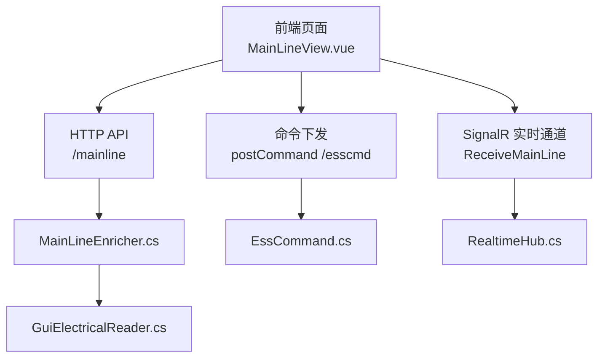
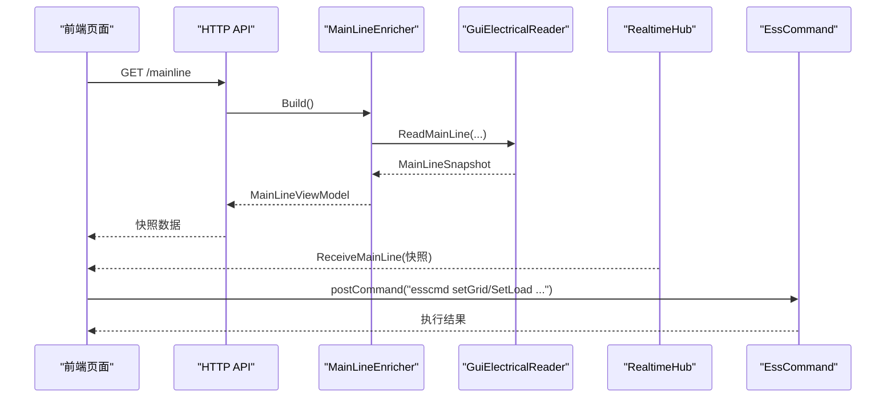
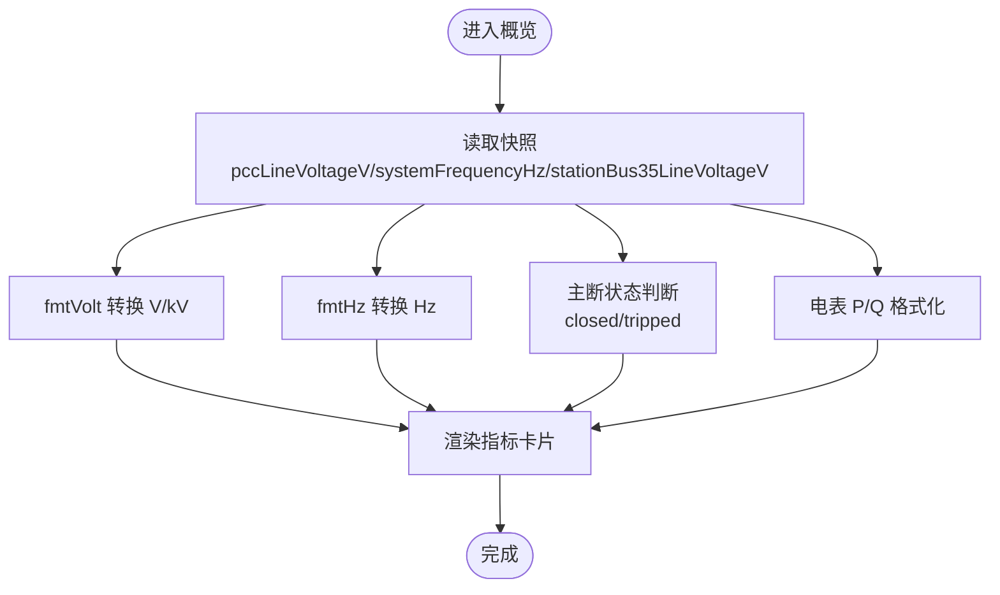
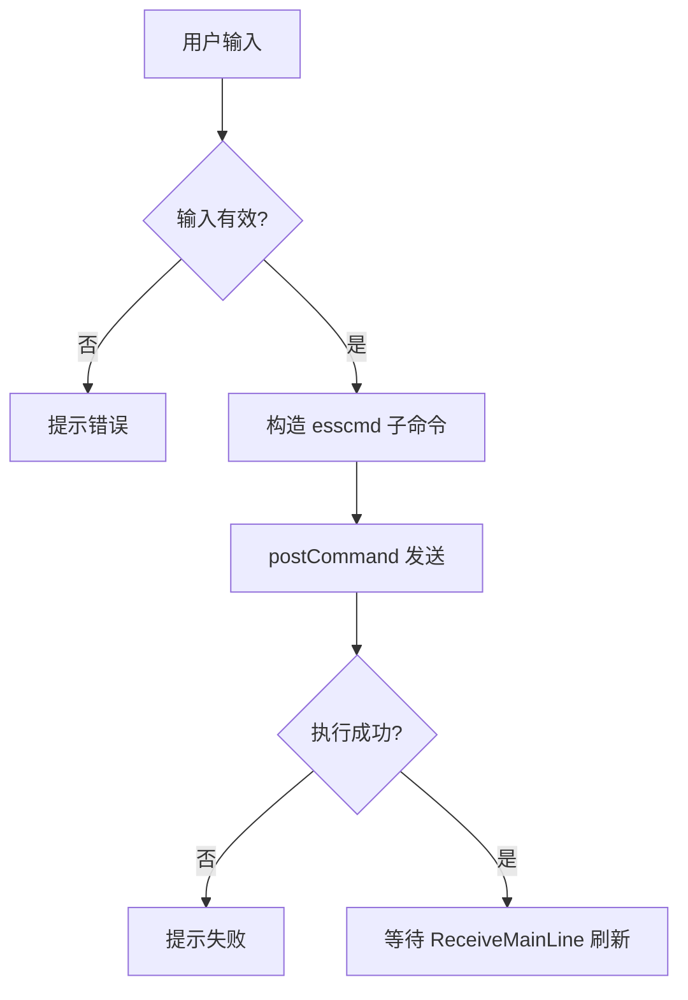
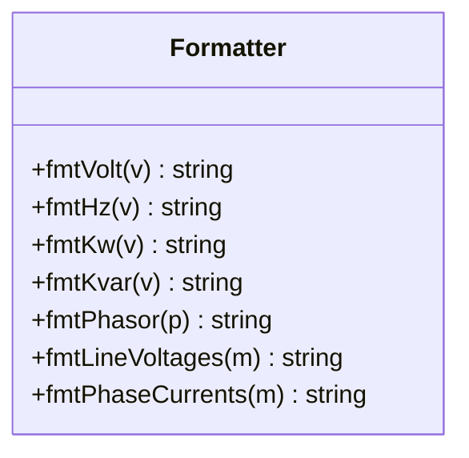
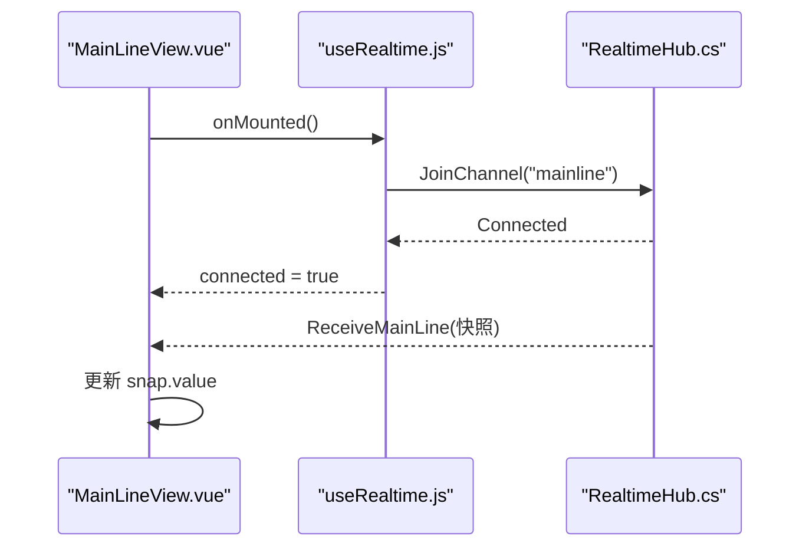
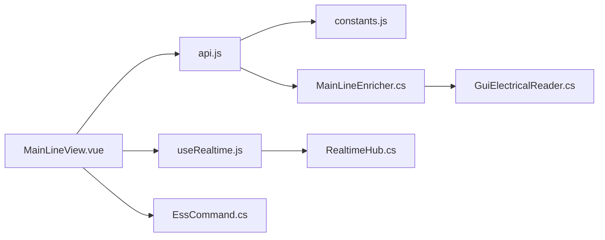

# 电站概览显示

<cite>
**本文引用的文件**
- [MainLineView.vue](file://Web/src/views/MainLineView.vue)
- [TopologyMainLineSvg.vue](file://Web/src/components/TopologyMainLineSvg.vue)
- [useRealtime.js](file://Web/src/services/useRealtime.js)
- [api.js](file://Web/src/services/api.js)
- [constants.js](file://Web/src/services/constants.js)
- [GuiElectricalReader.cs](file://Display/GuiElectricalReader.cs)
- [MainLineMetrics.cs](file://Display/MainLineMetrics.cs)
- [MainLineEnricher.cs](file://Web/MainLineEnricher.cs)
- [RealtimeHub.cs](file://Web/RealtimeHub.cs)
- [EssCommand.cs](file://Display/EssCommand.cs)
</cite>

## 目录
1. [简介](#简介)
2. [项目结构](#项目结构)
3. [核心组件](#核心组件)
4. [架构总览](#架构总览)
5. [详细组件分析](#详细组件分析)
6. [依赖关系分析](#依赖关系分析)
7. [性能考虑](#性能考虑)
8. [故障排查指南](#故障排查指南)
9. [结论](#结论)

## 简介
本文件面向“电站概览显示”功能，系统性说明关键指标的展示逻辑与交互机制，包括：
- 关键指标实时显示：PCC 电压、电网频率、35kV 母线电压、主断路器状态、电表 P/Q、求解模式等。
- 可编辑参数设定：电网电压设定（kV）、电网频率设定（Hz）、35kV 负载有功/无功设定（kW/kvar）。
- 数据格式化：电压单位自动切换（V/kV）、功率单位（kW/kvar）、频率（Hz）等。
- 输入验证与错误处理：前端校验范围与类型，后端命令执行与反馈。
- 响应式数据绑定与实时更新：基于 SignalR 的频道订阅与前端响应式更新。

## 项目结构
电站概览显示由前后端协同实现：
- 前端页面 MainLineView.vue 负责指标卡片、可编辑参数输入、表单校验、指令发送与实时数据绑定。
- 前端组件 TopologyMainLineSvg.vue 在拓扑视图中复用相同的格式化函数，统一展示 PCC、频率、设定值等。
- 实时推送 RealtimeHub.cs + useRealtime.js 提供 SignalR 通道订阅与消息分发。
- 后端读取器 GuiElectricalReader.cs 从仿真模型中聚合主接线快照，包含 PCC、35kV 母线、主断、系统频率、负载设定等。
- 命令处理器 EssCommand.cs 解析并执行 setGrid/setLoad 等指令，完成参数下发与结果返回。
- Web 增强器 MainLineEnricher.cs 将底层快照转换为视图模型，供 API 输出给前端。

图表来源
- [MainLineView.vue:1-200](file://Web/src/views/MainLineView.vue#L1-L200)
- [TopologyMainLineSvg.vue:23-59](file://Web/src/components/TopologyMainLineSvg.vue#L23-L59)
- [useRealtime.js:1-38](file://Web/src/services/useRealtime.js#L1-L38)
- [api.js:14-35](file://Web/src/services/api.js#L14-L35)
- [GuiElectricalReader.cs:54-190](file://Display/GuiElectricalReader.cs#L54-L190)
- [MainLineEnricher.cs:10-18](file://Web/MainLineEnricher.cs#L10-L18)
- [RealtimeHub.cs:10-34](file://Web/RealtimeHub.cs#L10-L34)
- [EssCommand.cs:115-140](file://Display/EssCommand.cs#L115-L140)

章节来源
- [MainLineView.vue:1-200](file://Web/src/views/MainLineView.vue#L1-L200)
- [TopologyMainLineSvg.vue:23-59](file://Web/src/components/TopologyMainLineSvg.vue#L23-L59)
- [useRealtime.js:1-38](file://Web/src/services/useRealtime.js#L1-L38)
- [api.js:14-35](file://Web/src/services/api.js#L14-L35)
- [GuiElectricalReader.cs:54-190](file://Display/GuiElectricalReader.cs#L54-L190)
- [MainLineEnricher.cs:10-18](file://Web/MainLineEnricher.cs#L10-L18)
- [RealtimeHub.cs:10-34](file://Web/RealtimeHub.cs#L10-L34)
- [EssCommand.cs:115-140](file://Display/EssCommand.cs#L115-L140)

## 核心组件
- 前端概览页 MainLineView.vue：展示关键指标与可编辑参数，绑定实时数据，发起命令。
- 拓扑组件 TopologyMainLineSvg.vue：复用格式化函数，在拓扑图上叠加 PCC、频率、设定值等信息。
- 实时服务 useRealtime.js：封装 SignalR 连接、频道加入/离开、方法回调注册。
- 后端读取器 GuiElectricalReader.cs：聚合主接线快照，含 PCC、35kV、主断、系统频率、负载设定等。
- 命令处理器 EssCommand.cs：解析 setGrid/setLoad 等命令，进行参数校验与下发。
- 增强器 MainLineEnricher.cs：将快照转换为视图模型，补充 PCS/BMS 展示字段。
- 实时中心 RealtimeHub.cs：定义频道常量与 Join/Leave 能力，供前端订阅 ReceiveMainLine。

章节来源
- [MainLineView.vue:1-200](file://Web/src/views/MainLineView.vue#L1-L200)
- [TopologyMainLineSvg.vue:23-59](file://Web/src/components/TopologyMainLineSvg.vue#L23-L59)
- [useRealtime.js:1-38](file://Web/src/services/useRealtime.js#L1-L38)
- [GuiElectricalReader.cs:54-190](file://Display/GuiElectricalReader.cs#L54-L190)
- [EssCommand.cs:115-140](file://Display/EssCommand.cs#L115-L140)
- [MainLineEnricher.cs:10-18](file://Web/MainLineEnricher.cs#L10-L18)
- [RealtimeHub.cs:10-34](file://Web/RealtimeHub.cs#L10-L34)

## 架构总览
电站概览的数据流分为两条主线：
- 只读数据流：后端通过 GuiElectricalReader 读取仿真模型，构建 MainLineSnapshot，经 MainLineEnricher 转为视图模型，API 返回给前端；同时通过 RealtimeHub 以 ReceiveMainLine 推送更新。
- 写操作流：前端对可编辑参数进行校验后，调用 postCommand 发送 esscmd 子命令，后端 EssCommand 解析并执行，成功后刷新快照。

图表来源
- [MainLineView.vue:165-200](file://Web/src/views/MainLineView.vue#L165-L200)
- [api.js:14-35](file://Web/src/services/api.js#L14-L35)
- [MainLineEnricher.cs:10-18](file://Web/MainLineEnricher.cs#L10-L18)
- [GuiElectricalReader.cs:96-190](file://Display/GuiElectricalReader.cs#L96-L190)
- [RealtimeHub.cs:10-34](file://Web/RealtimeHub.cs#L10-L34)
- [EssCommand.cs:115-140](file://Display/EssCommand.cs#L115-L140)

## 详细组件分析

### 关键指标展示逻辑
- PCC 电压：来自快照 pccLineVoltageV，前端使用 fmtVolt 自动按阈值切换 V/kV 显示。
- 电网频率：来自 systemFrequencyHz，前端使用 fmtHz 显示为 Hz。
- 35kV 母线：来自 stationBus35LineVoltageV，同样使用 fmtVolt 显示。
- 主断路器状态：根据 mainBreakerClosed/mainBreakerTripped 计算标签“合/分/跳闸”。
- 求解模式：propagationEnabled 为真时显示“径向传播”，否则“Legacy”。
- 电表 P/Q：meterPrimary.activePowerKw/reactivePowerKvar，使用 fmtKw/fmtKvar 显示。

图表来源
- [MainLineView.vue:5-12](file://Web/src/views/MainLineView.vue#L5-L12)
- [MainLineView.vue:221-227](file://Web/src/views/MainLineView.vue#L221-L227)
- [GuiElectricalReader.cs:54-79](file://Display/GuiElectricalReader.cs#L54-L79)

章节来源
- [MainLineView.vue:5-12](file://Web/src/views/MainLineView.vue#L5-L12)
- [MainLineView.vue:221-227](file://Web/src/views/MainLineView.vue#L221-L227)
- [GuiElectricalReader.cs:54-79](file://Display/GuiElectricalReader.cs#L54-L79)

### 可编辑参数设定功能
- 电网电压设定：用户输入 kV，前端校验为正数，乘以 1000 转换为 V，调用 esscmd setGrid voltage。
- 电网频率设定：用户输入 Hz，前端校验范围 (0, 75]，调用 esscmd setGrid frequency。
- 35kV 负载 P：用户输入 kW，必须 ≤0（负值表示消耗），调用 esscmd setLoad activePower。
- 35kV 负载 Q：用户输入 kvar，允许正负，调用 esscmd setLoad reactivePower。
- 工程模式保护：若未配置负载节点，负载相关输入禁用并提示。

图表来源
- [MainLineView.vue:13-82](file://Web/src/views/MainLineView.vue#L13-L82)
- [MainLineView.vue:526-577](file://Web/src/views/MainLineView.vue#L526-L577)
- [EssCommand.cs:115-140](file://Display/EssCommand.cs#L115-L140)

章节来源
- [MainLineView.vue:13-82](file://Web/src/views/MainLineView.vue#L13-L82)
- [MainLineView.vue:526-577](file://Web/src/views/MainLineView.vue#L526-L577)
- [EssCommand.cs:115-140](file://Display/EssCommand.cs#L115-L140)

### 数据格式化实现
- 电压格式化：大于等于 1000 显示为 kV，否则显示为 V，保留一位小数。
- 频率格式化：保留两位小数，附加 Hz 单位。
- 功率格式化：有功 kW、无功 kvar，均保留一位小数。
- 相量格式化：组合线电压、电流、相位角、频率，便于设备详情展示。
- 三相量格式化：分别展示 Uab/Ubc/Uca 与 Ia/Ib/Ic。

图表来源
- [MainLineView.vue:221-244](file://Web/src/views/MainLineView.vue#L221-L244)
- [TopologyMainLineSvg.vue:515-521](file://Web/src/components/TopologyMainLineSvg.vue#L515-L521)

章节来源
- [MainLineView.vue:221-244](file://Web/src/views/MainLineView.vue#L221-L244)
- [TopologyMainLineSvg.vue:515-521](file://Web/src/components/TopologyMainLineSvg.vue#L515-L521)

### 用户输入验证与错误处理
- 电网电压：要求正数，单位 kV，内部转换为 V。
- 电网频率：要求 (0, 75] Hz。
- 负载有功：必须 ≤0，提示“只能消耗不能释放”。
- 工程模式限制：当无负载节点时，负载输入禁用并提示。
- 错误提示：使用 ElMessage 弹出警告或错误信息。

章节来源
- [MainLineView.vue:526-577](file://Web/src/views/MainLineView.vue#L526-L577)
- [MainLineView.vue:177-180](file://Web/src/views/MainLineView.vue#L177-L180)

### 响应式数据绑定与实时更新机制
- 初始加载：onMounted 获取一次快照 getMainLine。
- 实时订阅：useRealtime 订阅 RealtimeChannels.MainLine，接收 ReceiveMainLine 事件并更新 snap。
- 信号中心：RealtimeHub 提供 JoinChannel/LeaveChannel，前端在挂载时加入频道，卸载时退出。
- 组态视图：TopologyMainLineSvg 也复用相同快照，确保单线图与拓扑图一致。

图表来源
- [MainLineView.vue:579-591](file://Web/src/views/MainLineView.vue#L579-L591)
- [useRealtime.js:1-38](file://Web/src/services/useRealtime.js#L1-L38)
- [RealtimeHub.cs:10-34](file://Web/RealtimeHub.cs#L10-L34)

章节来源
- [MainLineView.vue:579-591](file://Web/src/views/MainLineView.vue#L579-L591)
- [useRealtime.js:1-38](file://Web/src/services/useRealtime.js#L1-L38)
- [RealtimeHub.cs:10-34](file://Web/RealtimeHub.cs#L10-L34)

## 依赖关系分析
- 前端依赖：
  - api.js：HTTP 请求封装与 SignalR Hub 连接。
  - constants.js：实时方法与频道常量。
  - useRealtime.js：频道订阅与生命周期管理。
- 后端依赖：
  - GuiElectricalReader.cs：从仿真模型读取电气量。
  - MainLineEnricher.cs：构建视图模型。
  - RealtimeHub.cs：实时推送通道。
  - EssCommand.cs：命令解析与执行。

图表来源
- [MainLineView.vue:165-200](file://Web/src/views/MainLineView.vue#L165-L200)
- [api.js:1-88](file://Web/src/services/api.js#L1-L88)
- [constants.js:1-18](file://Web/src/services/constants.js#L1-L18)
- [useRealtime.js:1-38](file://Web/src/services/useRealtime.js#L1-L38)
- [MainLineEnricher.cs:10-18](file://Web/MainLineEnricher.cs#L10-L18)
- [GuiElectricalReader.cs:96-190](file://Display/GuiElectricalReader.cs#L96-L190)
- [RealtimeHub.cs:10-34](file://Web/RealtimeHub.cs#L10-L34)
- [EssCommand.cs:115-140](file://Display/EssCommand.cs#L115-L140)

章节来源
- [MainLineView.vue:165-200](file://Web/src/views/MainLineView.vue#L165-L200)
- [api.js:1-88](file://Web/src/services/api.js#L1-L88)
- [constants.js:1-18](file://Web/src/services/constants.js#L1-L18)
- [useRealtime.js:1-38](file://Web/src/services/useRealtime.js#L1-L38)
- [MainLineEnricher.cs:10-18](file://Web/MainLineEnricher.cs#L10-L18)
- [GuiElectricalReader.cs:96-190](file://Display/GuiElectricalReader.cs#L96-L190)
- [RealtimeHub.cs:10-34](file://Web/RealtimeHub.cs#L10-L34)
- [EssCommand.cs:115-140](file://Display/EssCommand.cs#L115-L140)

## 性能考虑
- 实时推送采用频道分组，避免无关数据占用带宽。
- 前端仅在必要时发起初始 HTTP 请求，后续依赖 SignalR 增量更新。
- 格式化函数轻量且无副作用，适合高频渲染。
- 后端读取器集中聚合快照，减少多次分散查询。

[本节为通用指导，不直接分析具体文件]

## 故障排查指南
- 实时数据不更新：检查 SignalR 连接是否建立，确认已加入 mainline 频道，查看浏览器控制台是否有连接错误。
- 设定失败：检查输入是否符合范围（如频率 (0, 75]、负载有功 ≤0），查看后端命令返回消息。
- 工程模式禁用负载：确认拓扑中是否配置了负载节点，若未配置则概览负载输入将被禁用。
- 断路器不可操作：若主断或单元断处于跳闸状态，需先复位再操作。

章节来源
- [MainLineView.vue:526-577](file://Web/src/views/MainLineView.vue#L526-L577)
- [MainLineView.vue:177-180](file://Web/src/views/MainLineView.vue#L177-L180)
- [RealtimeHub.cs:10-34](file://Web/RealtimeHub.cs#L10-L34)

## 结论
电站概览显示通过前后端协作实现了关键指标的实时展示与可编辑参数的安全设定。前端负责友好的交互与格式化，后端负责数据聚合与命令执行，SignalR 保障低延迟的实时更新。整体设计清晰、职责分明，具备良好的可扩展性与可维护性。

[本节为总结，不直接分析具体文件]