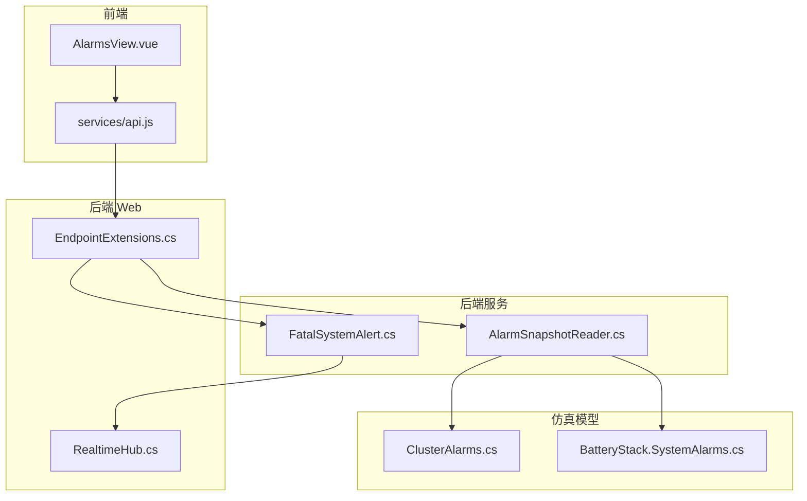
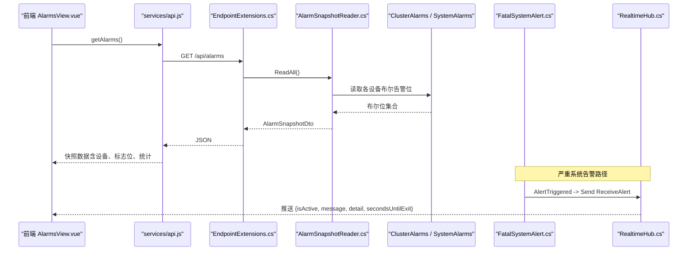
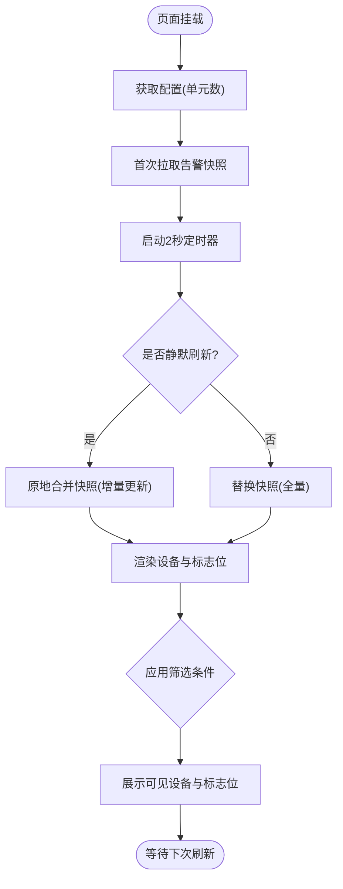
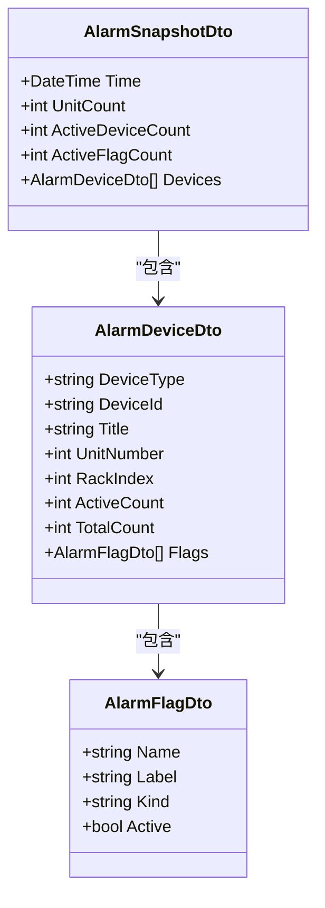
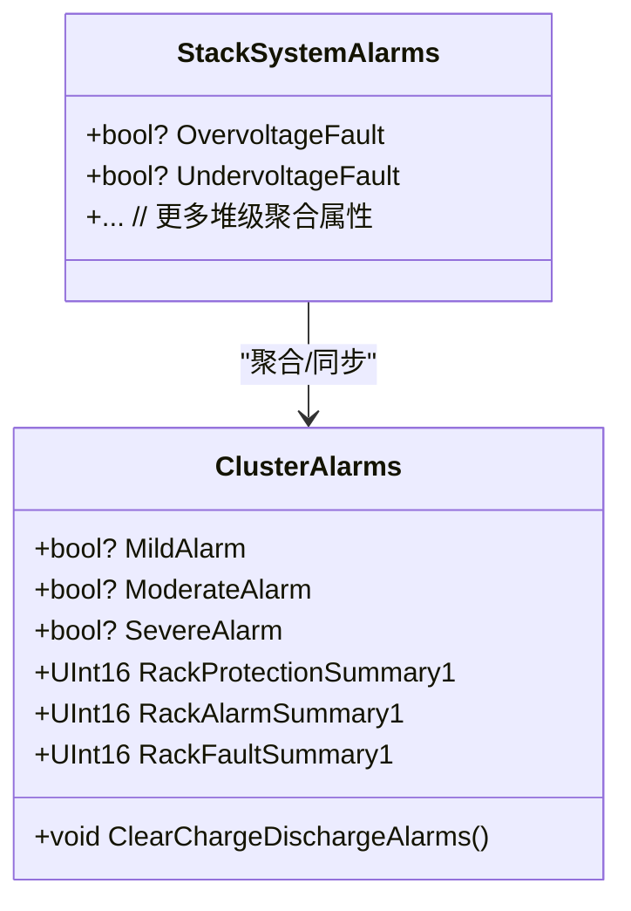
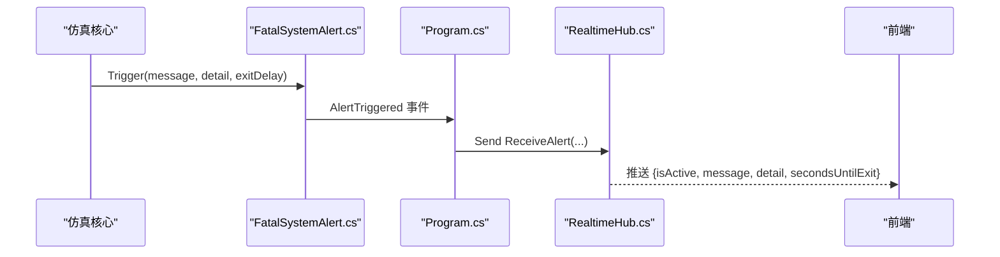
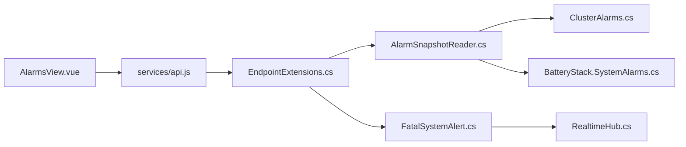

# 告警管理视图

<cite>
**本文引用的文件**
- [AlarmsView.vue](file://Web/src/views/AlarmsView.vue)
- [api.js](file://Web/src/services/api.js)
- [AlarmSnapshotReader.cs](file://Web/AlarmSnapshotReader.cs)
- [ClusterAlarms.cs](file://EssSimModelApi/Bms/ClusterAlarms.cs)
- [BatteryStack.SystemAlarms.cs](file://EssSimModelApi/Bms/BatteryStack.SystemAlarms.cs)
- [FatalSystemAlert.cs](file://Display/FatalSystemAlert.cs)
- [RealtimeHub.cs](file://Web/RealtimeHub.cs)
- [EndpointExtensions.cs](file://Web/EndpointExtensions.cs)
- [Program.cs](file://Program.cs)
</cite>

## 目录
1. [简介](#简介)
2. [项目结构](#项目结构)
3. [核心组件](#核心组件)
4. [架构总览](#架构总览)
5. [详细组件分析](#详细组件分析)
6. [依赖关系分析](#依赖关系分析)
7. [性能与实时性](#性能与实时性)
8. [故障排查指南](#故障排查指南)
9. [结论](#结论)
10. [附录：告警级别与分类规则](#附录：告警级别与分类规则)

## 简介
本文件面向“告警管理视图”，系统性说明告警数据的采集、分类与展示机制，覆盖实时告警与历史快照的获取方式；明确告警级别定义（严重、重要、一般等）及处理策略；解释确认、复位、清除的操作流程与后端交互；并给出过滤、搜索、导出以及统计分析的实现要点。文档同时提供时序图、流程图与类图，帮助读者快速理解前后端协作与数据流转。

## 项目结构
告警管理视图由前端页面、API 服务层、后端快照读取器、模型层与实时推送通道组成：
- 前端：Vue 组件负责筛选、刷新、折叠与可视化展示。
- API 层：统一封装 HTTP 请求与 SignalR 连接。
- 后端：通过 REST 接口暴露设备告警快照；通过 SignalR 推送严重系统级告警。
- 模型层：BMS 簇/堆与 PCS 的布尔型告警位集合，支持聚合与汇总。
- 实时通道：SignalR Hub 用于进程级严重告警的全局推送。

图表来源
- [AlarmsView.vue:1-262](file://Web/src/views/AlarmsView.vue#L1-L262)
- [api.js:1-88](file://Web/src/services/api.js#L1-L88)
- [EndpointExtensions.cs:35-66](file://Web/EndpointExtensions.cs#L35-L66)
- [AlarmSnapshotReader.cs:211-448](file://Web/AlarmSnapshotReader.cs#L211-L448)
- [ClusterAlarms.cs:1-451](file://EssSimModelApi/Bms/ClusterAlarms.cs#L1-L451)
- [BatteryStack.SystemAlarms.cs:1-333](file://EssSimModelApi/Bms/BatteryStack.SystemAlarms.cs#L1-L333)
- [FatalSystemAlert.cs:1-87](file://Display/FatalSystemAlert.cs#L1-L87)
- [RealtimeHub.cs:1-59](file://Web/RealtimeHub.cs#L1-L59)

章节来源
- [AlarmsView.vue:1-262](file://Web/src/views/AlarmsView.vue#L1-L262)
- [api.js:1-88](file://Web/src/services/api.js#L1-L88)
- [EndpointExtensions.cs:35-66](file://Web/EndpointExtensions.cs#L35-L66)
- [AlarmSnapshotReader.cs:211-448](file://Web/AlarmSnapshotReader.cs#L211-L448)
- [ClusterAlarms.cs:1-451](file://EssSimModelApi/Bms/ClusterAlarms.cs#L1-L451)
- [BatteryStack.SystemAlarms.cs:1-333](file://EssSimModelApi/Bms/BatteryStack.SystemAlarms.cs#L1-L333)
- [FatalSystemAlert.cs:1-87](file://Display/FatalSystemAlert.cs#L1-L87)
- [RealtimeHub.cs:1-59](file://Web/RealtimeHub.cs#L1-L59)

## 核心组件
- 前端告警视图：提供设备维度筛选（BMS/PCS）、舱号筛选、类型筛选（故障/告警/保护/其他）、仅显示已触发、折叠无告警设备等能力；自动轮询刷新，增量合并避免闪烁。
- 后端告警快照：按单元、簇、堆、PCS 扫描布尔型告警位，生成统一快照 DTO，包含设备列表、活跃计数与时间戳。
- BMS 告警模型：簇/堆级布尔位集合，支持聚合与汇总，提供充放电方向告警/故障/保护的批量清除方法。
- 严重系统告警：进程级安全事件，通过事件驱动推送到前端，附带倒计时与退出动作。
- 实时推送通道：SignalR Hub 提供频道分组与全局推送，用于严重告警与后续扩展。

章节来源
- [AlarmsView.vue:66-189](file://Web/src/views/AlarmsView.vue#L66-L189)
- [AlarmSnapshotReader.cs:9-448](file://Web/AlarmSnapshotReader.cs#L9-L448)
- [ClusterAlarms.cs:109-451](file://EssSimModelApi/Bms/ClusterAlarms.cs#L109-L451)
- [BatteryStack.SystemAlarms.cs:8-333](file://EssSimModelApi/Bms/BatteryStack.SystemAlarms.cs#L8-L333)
- [FatalSystemAlert.cs:11-87](file://Display/FatalSystemAlert.cs#L11-L87)
- [RealtimeHub.cs:10-59](file://Web/RealtimeHub.cs#L10-L59)

## 架构总览
告警数据从仿真模型中读取为布尔位，经后端快照读取器聚合为设备级告警清单，再经由 REST 接口返回给前端；严重系统级告警通过 SignalR 主动推送至前端。

图表来源
- [AlarmsView.vue:158-189](file://Web/src/views/AlarmsView.vue#L158-L189)
- [api.js:21-27](file://Web/src/services/api.js#L21-L27)
- [EndpointExtensions.cs:54-66](file://Web/EndpointExtensions.cs#L54-L66)
- [AlarmSnapshotReader.cs:211-248](file://Web/AlarmSnapshotReader.cs#L211-L248)
- [ClusterAlarms.cs:109-451](file://EssSimModelApi/Bms/ClusterAlarms.cs#L109-L451)
- [BatteryStack.SystemAlarms.cs:8-333](file://EssSimModelApi/Bms/BatteryStack.SystemAlarms.cs#L8-L333)
- [FatalSystemAlert.cs:19-56](file://Display/FatalSystemAlert.cs#L19-L56)
- [RealtimeHub.cs:16-21](file://Web/RealtimeHub.cs#L16-L21)

## 详细组件分析

### 前端告警视图（AlarmsView.vue）
- 数据获取与刷新：
  - 首次加载时调用配置接口获取单元数量，随后拉取告警快照。
  - 每 2 秒定时静默刷新，使用原地合并策略更新设备与标志位，避免整表替换导致的 UI 闪烁。
- 筛选与展示：
  - 设备类型筛选：全部/BMS/PCS。
  - 舱号筛选：动态下拉。
  - 告警类型筛选：故障/告警/保护/其他。
  - 仅显示已触发：隐藏未触发的标志位。
  - 折叠无告警设备：默认折叠，若无匹配则回退到至少展示堆级卡片以便排查。
- 状态统计：
  - 顶部标签显示触发设备数与触发位总数，颜色随是否有活动告警变化。
- 错误处理：
  - 刷新失败时通过消息提示用户。

图表来源
- [AlarmsView.vue:66-189](file://Web/src/views/AlarmsView.vue#L66-L189)

章节来源
- [AlarmsView.vue:1-262](file://Web/src/views/AlarmsView.vue#L1-L262)

### 后端告警快照（AlarmSnapshotReader.cs）
- 数据源：
  - BMS 堆：读取 BatteryStack.SystemAlarms 下的布尔位。
  - BMS 簇：读取 ClusterAlarms 下的布尔位。
  - PCS：按已知标签集枚举布尔位，排除控制开关等无关字段。
- 分类与排序：
  - 根据字段名后缀或关键词将告警归类为 fault/alarm/protection/other。
  - 按类别优先级排序（故障优先），便于高优问题先见。
- 设备构建：
  - 为每个设备生成唯一 ID、标题、单元号、机架索引、标志位列表与活跃计数。
- 聚合统计：
  - 计算活跃设备数与活跃标志位总数，供前端统计标签展示。

图表来源
- [AlarmSnapshotReader.cs:9-37](file://Web/AlarmSnapshotReader.cs#L9-L37)

章节来源
- [AlarmSnapshotReader.cs:211-448](file://Web/AlarmSnapshotReader.cs#L211-L448)

### BMS 告警模型（ClusterAlarms.cs / BatteryStack.SystemAlarms.cs）
- 告警级别定义：
  - 轻微告警、中等告警、严重告警（簇级）。
  - 电压、电流、绝缘、温度、SOC、采样、通信、接触器、电池箱等多维告警/故障/保护位。
- 聚合与下发：
  - 堆级属性对簇级属性进行“任一为真”的聚合，写操作同步到所有簇。
- 汇总与清除：
  - 提供保护/报警/故障的多位汇总值。
  - 提供按充/放方向批量清除相关告警/故障的方法，便于复位操作。

图表来源
- [ClusterAlarms.cs:109-451](file://EssSimModelApi/Bms/ClusterAlarms.cs#L109-L451)
- [BatteryStack.SystemAlarms.cs:8-333](file://EssSimModelApi/Bms/BatteryStack.SystemAlarms.cs#L8-L333)

章节来源
- [ClusterAlarms.cs:109-451](file://EssSimModelApi/Bms/ClusterAlarms.cs#L109-L451)
- [BatteryStack.SystemAlarms.cs:8-333](file://EssSimModelApi/Bms/BatteryStack.SystemAlarms.cs#L8-L333)

### 严重系统告警与实时推送（FatalSystemAlert.cs / RealtimeHub.cs / Program.cs）
- 触发机制：
  - 当发生安全联锁违规等严重事件时，触发事件并记录消息、详情与退出倒计时。
- 推送机制：
  - 订阅事件后，通过 SignalR 向所有客户端推送 ReceiveAlert，携带活动状态、消息、详情与剩余秒数。
- 初始化推送：
  - 前端连接 Hub 时，服务端主动推送一次当前快照，便于前端立即呈现严重告警。

图表来源
- [FatalSystemAlert.cs:19-56](file://Display/FatalSystemAlert.cs#L19-L56)
- [Program.cs:466-494](file://Program.cs#L466-L494)
- [RealtimeHub.cs:16-21](file://Web/RealtimeHub.cs#L16-L21)

章节来源
- [FatalSystemAlert.cs:11-87](file://Display/FatalSystemAlert.cs#L11-L87)
- [Program.cs:466-494](file://Program.cs#L466-L494)
- [RealtimeHub.cs:10-59](file://Web/RealtimeHub.cs#L10-L59)

### 告警确认、复位与清除
- 确认：
  - 当前视图以“仅显示已触发”作为确认态的视觉辅助；确认行为通常由业务侧在外部系统中完成，前端可据此切换筛选。
- 复位：
  - 针对 BMS 簇/堆的充/放方向告警/故障，可通过模型提供的批量清除方法进行复位（例如 ClearChargeDischargeAlarms）。
- 清除：
  - 对于非方向相关的告警/故障，需结合具体设备逻辑进行清零；PCS 告警位多为只读状态反映，需依据设备实际协议处理。
- 后端交互：
  - 复位/清除通常通过命令接口（POST /api/command）下发指令，再由设备侧执行并更新模型状态；视图通过下一次快照刷新体现结果。

章节来源
- [ClusterAlarms.cs:329-365](file://EssSimModelApi/Bms/ClusterAlarms.cs#L329-L365)
- [api.js:31-35](file://Web/src/services/api.js#L31-L35)
- [AlarmsView.vue:158-189](file://Web/src/views/AlarmsView.vue#L158-L189)

### 过滤、搜索与导出
- 过滤：
  - 设备类型、舱号、告警类型、仅活动项、折叠无告警设备。
- 搜索：
  - 当前实现基于筛选组合；如需关键字搜索，可在前端对设备标题或标志位标签进行本地过滤。
- 导出：
  - 可将当前快照数据（devices、flags、统计）序列化为 CSV/JSON 导出；建议在现有刷新流程基础上增加导出按钮，复用 getAlarms 的数据。

章节来源
- [AlarmsView.vue:6-28](file://Web/src/views/AlarmsView.vue#L6-L28)
- [AlarmsView.vue:83-115](file://Web/src/views/AlarmsView.vue#L83-L115)
- [AlarmSnapshotReader.cs:211-248](file://Web/AlarmSnapshotReader.cs#L211-L248)

### 统计分析与趋势查看
- 当前统计：
  - 活跃设备数、活跃标志位数、设备级活跃/总数对比。
- 趋势查看：
  - 可在前端维护最近 N 次快照的历史数组，绘制时间序列折线图（如活跃设备数、各类告警占比）。
  - 后端可扩展历史存储（内存/数据库）并提供分页查询接口，以支撑更长时间跨度的趋势分析。

章节来源
- [AlarmsView.vue:23-28](file://Web/src/views/AlarmsView.vue#L23-L28)
- [AlarmSnapshotReader.cs:241-248](file://Web/AlarmSnapshotReader.cs#L241-L248)

## 依赖关系分析
- 前端依赖：
  - services/api.js 提供统一的 HTTP 与 SignalR 连接。
  - AlarmsView.vue 依赖 getAlarms/getConfig 等接口。
- 后端依赖：
  - EndpointExtensions.cs 映射 REST 路由，调用 AlarmSnapshotReader 与 FatalSystemAlert。
  - AlarmSnapshotReader 依赖仿真模型（ClusterAlarms、SystemAlarms）与仿真数据访问。
- 实时依赖：
  - Program.cs 订阅 FatalSystemAlert 事件并通过 RealtimeHub 推送。

图表来源
- [AlarmsView.vue:66-189](file://Web/src/views/AlarmsView.vue#L66-L189)
- [api.js:21-27](file://Web/src/services/api.js#L21-L27)
- [EndpointExtensions.cs:54-66](file://Web/EndpointExtensions.cs#L54-L66)
- [AlarmSnapshotReader.cs:211-248](file://Web/AlarmSnapshotReader.cs#L211-L248)
- [ClusterAlarms.cs:109-451](file://EssSimModelApi/Bms/ClusterAlarms.cs#L109-L451)
- [BatteryStack.SystemAlarms.cs:8-333](file://EssSimModelApi/Bms/BatteryStack.SystemAlarms.cs#L8-L333)
- [FatalSystemAlert.cs:19-56](file://Display/FatalSystemAlert.cs#L19-L56)
- [RealtimeHub.cs:16-21](file://Web/RealtimeHub.cs#L16-L21)

章节来源
- [EndpointExtensions.cs:35-66](file://Web/EndpointExtensions.cs#L35-L66)
- [Program.cs:466-494](file://Program.cs#L466-L494)

## 性能与实时性
- 前端优化：
  - 原地合并快照，减少重渲染开销。
  - 静默刷新避免阻塞用户交互。
  - 折叠无告警设备降低 DOM 节点数量。
- 后端优化：
  - 反射缓存布尔属性，避免重复反射。
  - 按需读取设备与簇数量，跳过不存在设备。
- 实时性：
  - 2 秒轮询满足大多数监控场景；严重告警通过 SignalR 即时推送。
- 建议：
  - 若设备规模扩大，可增加分页/懒加载与增量推送。
  - 对高频刷新场景，考虑节流与去抖。

[本节为通用指导，不直接分析具体文件]

## 故障排查指南
- 前端无法获取告警：
  - 检查网络与权限，确认 /api/alarms 可达。
  - 查看浏览器控制台错误信息，确认拦截器抛出的错误消息。
- 数据为空或不更新：
  - 确认仿真设备是否就绪（单元数、簇数量）。
  - 检查后端日志，确认 SnapshotReader 是否成功读取模型变量。
- 严重告警未推送：
  - 检查 SignalR 连接是否建立，确认 Hub 路由与中间件配置。
  - 查看 Program.cs 中的事件订阅是否生效。

章节来源
- [api.js:6-12](file://Web/src/services/api.js#L6-L12)
- [EndpointExtensions.cs:54-66](file://Web/EndpointExtensions.cs#L54-L66)
- [RealtimeHub.cs:16-21](file://Web/RealtimeHub.cs#L16-L21)
- [Program.cs:466-494](file://Program.cs#L466-L494)

## 结论
告警管理视图通过“前端筛选+后端快照+实时推送”的组合，实现了设备级告警的集中展示与快速定位。BMS 簇/堆与 PCS 的布尔告警位被统一抽象为设备标志位，并按级别分类排序，便于运维人员快速识别高风险问题。严重系统级告警通过 SignalR 即时推送，确保关键事件不被遗漏。未来可扩展历史趋势、导出与更细粒度的确认/复位流程，进一步提升运维效率。

[本节为总结，不直接分析具体文件]

## 附录：告警级别与分类规则
- 级别定义：
  - 严重：对应 Protection/Prohibited 或高影响故障，优先展示与处理。
  - 重要：对应 Fault，表示设备异常或失效。
  - 一般：对应 Alarm/Warning，表示运行偏离正常但尚未达到故障。
  - 其他：不属于上述类别的标志位。
- 分类规则：
  - 根据字段名后缀或关键词判定类别，并在前端以不同标签与颜色区分。
- 处理策略：
  - 严重：立即关注，必要时触发进程退出倒计时。
  - 重要：尽快处理，结合设备逻辑复位或隔离。
  - 一般：记录并跟踪，结合阈值调整或巡检。
  - 其他：视具体情况评估。

章节来源
- [AlarmSnapshotReader.cs:410-434](file://Web/AlarmSnapshotReader.cs#L410-L434)
- [ClusterAlarms.cs:109-112](file://EssSimModelApi/Bms/ClusterAlarms.cs#L109-L112)
- [FatalSystemAlert.cs:27-56](file://Display/FatalSystemAlert.cs#L27-L56)