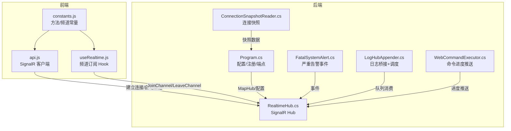
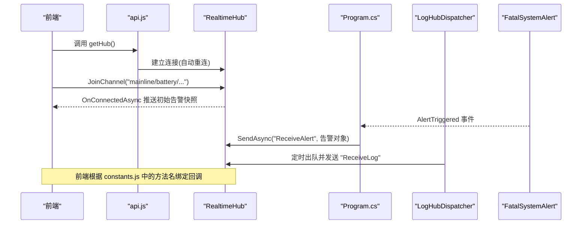
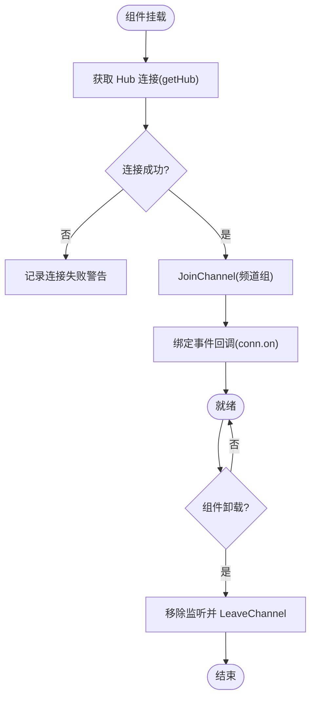
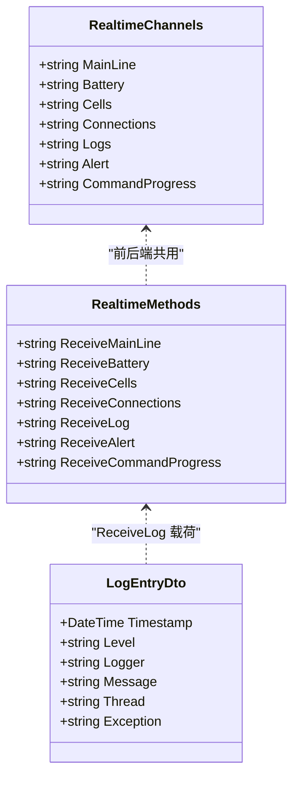
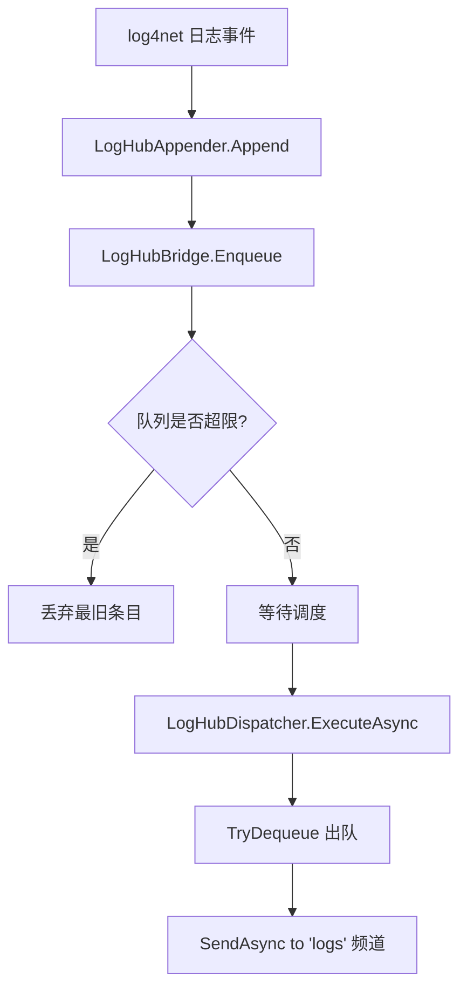
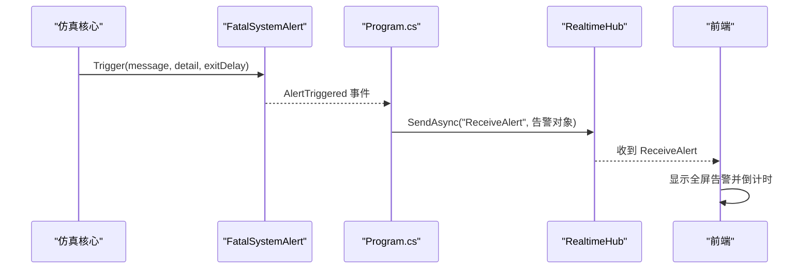
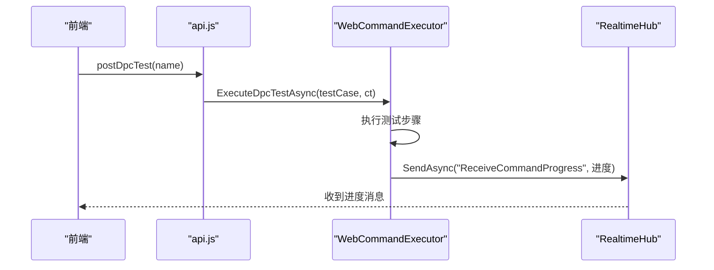
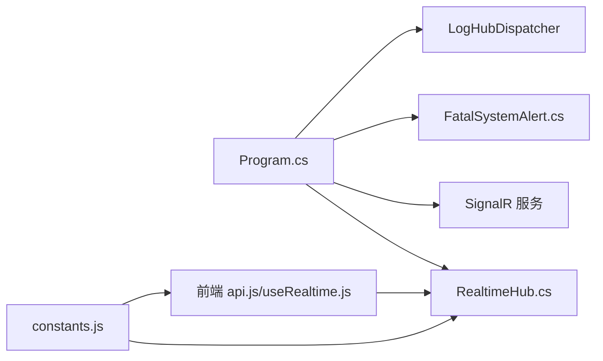

# 实时数据通信

<cite>
**本文引用的文件**
- [Program.cs](file://Program.cs)
- [RealtimeHub.cs](file://Web/RealtimeHub.cs)
- [LogHubAppender.cs](file://Web/LogHubAppender.cs)
- [FatalSystemAlert.cs](file://Display/FatalSystemAlert.cs)
- [api.js](file://Web/src/services/api.js)
- [useRealtime.js](file://Web/src/services/useRealtime.js)
- [constants.js](file://Web/src/services/constants.js)
- [ConnectionSnapshotReader.cs](file://Web/ConnectionSnapshotReader.cs)
- [WebCommandExecutor.cs](file://Web/WebCommandExecutor.cs)
</cite>

## 目录
1. [简介](#简介)
2. [项目结构](#项目结构)
3. [核心组件](#核心组件)
4. [架构总览](#架构总览)
5. [详细组件分析](#详细组件分析)
6. [依赖关系分析](#依赖关系分析)
7. [性能考虑](#性能考虑)
8. [故障排查指南](#故障排查指南)
9. [结论](#结论)
10. [附录：代码示例与协议约定](#附录代码示例与协议约定)

## 简介
本文件面向储能仿真系统的实时数据通信能力，聚焦 SignalR 连接管理、频道订阅模式、前后端事件协议、状态监控与性能调优。系统通过 ASP.NET Core SignalR Hub 提供实时推送能力，前端使用 @microsoft/signalr 建立长连接并订阅不同频道（主接线、电池、单体、连接、日志、告警、命令进度等）。后端将仿真运行时的遥测、告警、日志与命令执行进度以分组广播的方式推送到前端，实现低延迟的可视化与控制反馈。

## 项目结构
实时通信相关的关键位置如下：
- 后端 SignalR Hub 与频道常量定义位于 Web/RealtimeHub.cs
- 日志到 SignalR 的桥接与后台推送服务位于 Web/LogHubAppender.cs
- 应用启动、SignalR 注册、CORS、中间件与端点映射位于 Program.cs
- 前端 SignalR 客户端封装与自动重连逻辑位于 Web/src/services/api.js
- 前端频道订阅 Hook 位于 Web/src/services/useRealtime.js
- 前后端共享的事件名与频道名常量位于 Web/src/services/constants.js
- 连接信息快照读取用于展示网络与服务监听状态位于 Web/ConnectionSnapshotReader.cs
- 命令执行进度推送位于 Web/WebCommandExecutor.cs

**图表来源**
- [Program.cs:398-494](file://Program.cs#L398-L494)
- [RealtimeHub.cs:10-58](file://Web/RealtimeHub.cs#L10-L58)
- [LogHubAppender.cs:9-75](file://Web/LogHubAppender.cs#L9-L75)
- [FatalSystemAlert.cs:11-87](file://Display/FatalSystemAlert.cs#L11-L87)
- [api.js:71-85](file://Web/src/services/api.js#L71-L85)
- [useRealtime.js:8-36](file://Web/src/services/useRealtime.js#L8-L36)
- [constants.js:1-18](file://Web/src/services/constants.js#L1-L18)
- [ConnectionSnapshotReader.cs:34-84](file://Web/ConnectionSnapshotReader.cs#L34-L84)
- [WebCommandExecutor.cs:34-57](file://Web/WebCommandExecutor.cs#L34-L57)

**章节来源**
- [Program.cs:398-494](file://Program.cs#L398-L494)
- [RealtimeHub.cs:10-58](file://Web/RealtimeHub.cs#L10-L58)
- [LogHubAppender.cs:9-75](file://Web/LogHubAppender.cs#L9-L75)
- [FatalSystemAlert.cs:11-87](file://Display/FatalSystemAlert.cs#L11-L87)
- [api.js:71-85](file://Web/src/services/api.js#L71-L85)
- [useRealtime.js:8-36](file://Web/src/services/useRealtime.js#L8-L36)
- [constants.js:1-18](file://Web/src/services/constants.js#L1-L18)
- [ConnectionSnapshotReader.cs:34-84](file://Web/ConnectionSnapshotReader.cs#L34-L84)
- [WebCommandExecutor.cs:34-57](file://Web/WebCommandExecutor.cs#L34-L57)

## 核心组件
- SignalR Hub（RealtimeHub）：提供 JoinChannel/LeaveChannel 分组订阅，OnConnectedAsync 默认推送一次全量告警快照；定义频道与方法名常量及日志 DTO。
- 日志桥接（LogHubAppender + LogHubDispatcher）：log4net Appender 将日志事件转换为 DTO 入队，后台服务按固定周期出队并通过 SignalR 向 logs 频道推送。
- 严重告警（FatalSystemAlert）：进程级安全事件触发后通过事件通知，Program 中订阅并转发至 SignalR 的 ReceiveAlert 通道。
- 前端客户端（api.js）：基于 HubConnectionBuilder 建立连接，启用 withAutomaticReconnect 自动重连，统一暴露 getHub() 单例。
- 前端订阅 Hook（useRealtime.js）：在组件挂载时加入频道组并绑定回调，卸载时解绑并离开频道。
- 命令进度（WebCommandExecutor.cs）：在执行 DPC 测试等耗时任务时，周期性向 cmdprogress 频道推送进度消息。
- 连接快照（ConnectionSnapshotReader.cs）：聚合网络接口、服务端监听、客户端连接状态与链路状态，供前端查询。

**章节来源**
- [RealtimeHub.cs:10-58](file://Web/RealtimeHub.cs#L10-L58)
- [LogHubAppender.cs:9-75](file://Web/LogHubAppender.cs#L9-L75)
- [FatalSystemAlert.cs:11-87](file://Display/FatalSystemAlert.cs#L11-L87)
- [api.js:71-85](file://Web/src/services/api.js#L71-L85)
- [useRealtime.js:8-36](file://Web/src/services/useRealtime.js#L8-L36)
- [WebCommandExecutor.cs:34-57](file://Web/WebCommandExecutor.cs#L34-L57)
- [ConnectionSnapshotReader.cs:34-84](file://Web/ConnectionSnapshotReader.cs#L34-L84)

## 架构总览
SignalR 作为实时通信总线，后端通过 IHubContext<RealtimeHub> 主动推送消息，前端通过 HubConnection 订阅频道并处理事件。关键流程包括：
- 应用启动时注册 SignalR 服务、CORS、中间件与 /hub/realtime 端点
- 订阅 FatalSystemAlert 事件，将严重告警通过 ReceiveAlert 推送给所有客户端
- 日志通过 log4net Appender 入队，后台服务定时出队并发送到 logs 频道
- 前端使用 useRealtime Hook 加入频道组并绑定接收方法，组件卸载时清理

**图表来源**
- [Program.cs:466-494](file://Program.cs#L466-L494)
- [RealtimeHub.cs:16-21](file://Web/RealtimeHub.cs#L16-L21)
- [LogHubAppender.cs:51-75](file://Web/LogHubAppender.cs#L51-L75)
- [FatalSystemAlert.cs:19-45](file://Display/FatalSystemAlert.cs#L19-L45)
- [api.js:71-85](file://Web/src/services/api.js#L71-L85)

## 详细组件分析

### SignalR 连接管理与重连
- 连接建立：前端通过 HubConnectionBuilder.withUrl("/hub/realtime").withAutomaticReconnect() 建立连接，并在失败时清空缓存以便重试。
- 频道订阅：useRealtime Hook 在挂载时调用 JoinChannel(groupName)，支持 channel.extra 形式的细粒度分组（如 battery.1）。
- 断开与清理：组件卸载时移除事件监听并调用 LeaveChannel(groupName)。
- 错误处理：连接失败时记录警告；推送失败在后端被 try/catch 忽略，避免影响主流程。

**图表来源**
- [api.js:71-85](file://Web/src/services/api.js#L71-L85)
- [useRealtime.js:8-36](file://Web/src/services/useRealtime.js#L8-L36)

**章节来源**
- [api.js:71-85](file://Web/src/services/api.js#L71-L85)
- [useRealtime.js:8-36](file://Web/src/services/useRealtime.js#L8-L36)

### 实时数据订阅模式（频道与消息）
- 频道定义：RealtimeChannels 包含 mainline、battery、cells、connections、logs、alert、cmdprogress 等。
- 方法定义：RealtimeMethods 包含 ReceiveMainLine、ReceiveBattery、ReceiveCells、ReceiveConnections、ReceiveAlert、ReceiveCommandProgress 等。
- 订阅方式：前端通过 useRealtime(channel, handlers) 加入频道并绑定对应方法回调；后端通过 Clients.Group(channel).SendAsync(method, payload) 推送。
- 数据同步：连接建立时默认推送一次告警快照，便于前端初始化；后续由后端按需推送变化数据。

**图表来源**
- [RealtimeHub.cs:24-58](file://Web/RealtimeHub.cs#L24-L58)
- [constants.js:1-18](file://Web/src/services/constants.js#L1-L18)

**章节来源**
- [RealtimeHub.cs:24-58](file://Web/RealtimeHub.cs#L24-L58)
- [constants.js:1-18](file://Web/src/services/constants.js#L1-L18)

### 日志推送管道
- 采集：log4net Appender 将 LoggingEvent 转换为 LogEntryDto 并入队。
- 背压：队列最大长度限制，超出时丢弃最旧条目，防止内存增长。
- 推送：后台服务 LogHubDispatcher 循环出队并通过 SignalR 发送到 logs 频道。

**图表来源**
- [LogHubAppender.cs:9-75](file://Web/LogHubAppender.cs#L9-L75)

**章节来源**
- [LogHubAppender.cs:9-75](file://Web/LogHubAppender.cs#L9-L75)

### 严重告警推送
- 触发：FatalSystemAlert.Trigger 设置激活状态、消息、详情与退出倒计时，并发出 AlertTriggered 事件。
- 转发：Program 中订阅事件，通过 IHubContext<RealtimeHub>.Clients.All.SendAsync 向所有客户端推送 ReceiveAlert。
- 初始化：RealtimeHub.OnConnectedAsync 默认向新连接客户端发送一次当前告警快照。

**图表来源**
- [FatalSystemAlert.cs:27-56](file://Display/FatalSystemAlert.cs#L27-L56)
- [Program.cs:466-481](file://Program.cs#L466-L481)
- [RealtimeHub.cs:16-21](file://Web/RealtimeHub.cs#L16-L21)

**章节来源**
- [FatalSystemAlert.cs:27-56](file://Display/FatalSystemAlert.cs#L27-L56)
- [Program.cs:466-481](file://Program.cs#L466-L481)
- [RealtimeHub.cs:16-21](file://Web/RealtimeHub.cs#L16-L21)

### 命令执行与进度推送
- 入口：前端通过 REST 接口 postDpcTest(name) 触发测试用例。
- 执行：后端 WebCommandExecutor.ExecuteDpcTestAsync 异步执行，并在过程中调用 PushProgress。
- 推送：PushProgress 向 cmdprogress 频道发送 ReceiveCommandProgress，携带步骤信息与时间戳。

**图表来源**
- [api.js:31-35](file://Web/src/services/api.js#L31-L35)
- [WebCommandExecutor.cs:34-57](file://Web/WebCommandExecutor.cs#L34-L57)

**章节来源**
- [api.js:31-35](file://Web/src/services/api.js#L31-L35)
- [WebCommandExecutor.cs:34-57](file://Web/WebCommandExecutor.cs#L34-L57)

### 连接状态监控
- 后端提供 ConnectionSnapshotReader.Read 聚合网络接口、服务器监听信息、客户端连接状态与链路状态。
- 前端可通过 REST 接口获取该快照，用于展示当前连接拓扑与状态。

**章节来源**
- [ConnectionSnapshotReader.cs:34-84](file://Web/ConnectionSnapshotReader.cs#L34-L84)

## 依赖关系分析
- Program.cs 负责：
  - 注册 SignalR 服务与最大消息大小限制
  - 配置 CORS 允许的来源
  - 注册中间件与 /hub/realtime 端点
  - 订阅 FatalSystemAlert 事件并转发到 SignalR
- RealtimeHub.cs 提供：
  - 分组订阅 JoinChannel/LeaveChannel
  - 连接时默认推送告警快照
  - 频道与方法名常量
- LogHubAppender.cs 提供：
  - 日志到 SignalR 的桥接与后台推送
- 前端 api.js 提供：
  - SignalR 客户端单例与自动重连
- 前端 useRealtime.js 提供：
  - 生命周期内订阅与退订
- constants.js 提供：
  - 前后端一致的方法名与频道名

**图表来源**
- [Program.cs:398-494](file://Program.cs#L398-L494)
- [RealtimeHub.cs:10-58](file://Web/RealtimeHub.cs#L10-L58)
- [LogHubAppender.cs:51-75](file://Web/LogHubAppender.cs#L51-L75)
- [api.js:71-85](file://Web/src/services/api.js#L71-L85)
- [useRealtime.js:8-36](file://Web/src/services/useRealtime.js#L8-L36)
- [constants.js:1-18](file://Web/src/services/constants.js#L1-L18)

**章节来源**
- [Program.cs:398-494](file://Program.cs#L398-L494)
- [RealtimeHub.cs:10-58](file://Web/RealtimeHub.cs#L10-L58)
- [LogHubAppender.cs:51-75](file://Web/LogHubAppender.cs#L51-L75)
- [api.js:71-85](file://Web/src/services/api.js#L71-L85)
- [useRealtime.js:8-36](file://Web/src/services/useRealtime.js#L8-L36)
- [constants.js:1-18](file://Web/src/services/constants.js#L1-L18)

## 性能考虑
- 消息大小限制：SignalR 最大接收消息大小已设置为 64KB，避免过大负载导致传输失败或内存压力。
- 日志背压：日志队列最大长度为 2000，超过时丢弃最旧条目，保证系统稳定性。
- 推送频率：日志推送后台服务每约 150ms 轮询一次队列，平衡实时性与 CPU 占用。
- 频道分组：通过 JoinChannel/LeaveChannel 精确控制推送范围，减少无关流量。
- 自动重连：前端启用 withAutomaticReconnect，提高网络波动下的鲁棒性。
- JSON 序列化：启用 camelCase 与 IncludeFields，简化前后端字段映射。

[本节为通用指导，不直接分析具体文件]

## 故障排查指南
- 连接失败
  - 检查 CORS 配置是否放行前端来源
  - 确认 /hub/realtime 端点已注册
  - 查看浏览器控制台与后端日志
- 频道未收到消息
  - 确认前端已调用 JoinChannel 并绑定对应方法
  - 检查后端是否正确发送到目标频道
- 日志不更新
  - 确认 log4net 已加载配置并注册 LogHubAppender
  - 检查队列是否积压过多导致丢包
- 告警未显示
  - 确认 FatalSystemAlert 事件已触发且 Program 中已订阅
  - 检查前端是否正确处理 ReceiveAlert

**章节来源**
- [Program.cs:385-494](file://Program.cs#L385-L494)
- [LogHubAppender.cs:9-75](file://Web/LogHubAppender.cs#L9-L75)
- [FatalSystemAlert.cs:19-56](file://Display/FatalSystemAlert.cs#L19-L56)
- [api.js:71-85](file://Web/src/services/api.js#L71-L85)

## 结论
本系统通过 SignalR 实现了高可用的实时数据通信：后端以频道分组推送遥测、告警、日志与命令进度，前端以 Hook 化方式订阅并自动管理生命周期。结合自动重连、背压与消息大小限制，系统在复杂网络与高吞吐场景下具备良好稳定性。建议在生产环境中持续监控连接状态与队列长度，并根据业务需求调整推送频率与频道粒度。

[本节为总结，不直接分析具体文件]

## 附录：代码示例与协议约定

### 建立 SignalR 连接（前端）
- 使用 getHub() 获取单例连接，内部已启用自动重连与日志级别过滤
- 参考路径：[api.js:71-85](file://Web/src/services/api.js#L71-L85)

### 订阅频道与事件（前端）
- 在组件挂载时调用 useRealtime(channel, handlers)，自动 JoinChannel 并绑定回调
- 组件卸载时自动移除监听并 LeaveChannel
- 参考路径：[useRealtime.js:8-36](file://Web/src/services/useRealtime.js#L8-L36)

### 后端频道与方法名（前后端约定）
- 频道：mainline、battery、cells、connections、logs、alert、cmdprogress
- 方法：ReceiveMainLine、ReceiveBattery、ReceiveCells、ReceiveConnections、ReceiveLog、ReceiveAlert、ReceiveCommandProgress
- 参考路径：
  - [RealtimeHub.cs:24-58](file://Web/RealtimeHub.cs#L24-L58)
  - [constants.js:1-18](file://Web/src/services/constants.js#L1-L18)

### 发送命令与接收进度（前后端）
- 前端通过 REST 接口 postDpcTest(name) 触发测试
- 后端在执行过程中向 cmdprogress 频道推送 ReceiveCommandProgress
- 参考路径：
  - [api.js:31-35](file://Web/src/services/api.js#L31-L35)
  - [WebCommandExecutor.cs:34-57](file://Web/WebCommandExecutor.cs#L34-L57)

### 告警推送（后端）
- 严重告警触发后通过事件转发到 SignalR 的 ReceiveAlert
- 连接建立时默认推送一次当前告警快照
- 参考路径：
  - [FatalSystemAlert.cs:27-56](file://Display/FatalSystemAlert.cs#L27-L56)
  - [Program.cs:466-481](file://Program.cs#L466-L481)
  - [RealtimeHub.cs:16-21](file://Web/RealtimeHub.cs#L16-L21)

### 日志推送（后端）
- log4net Appender 将日志转换为 DTO 入队，后台服务定时出队并发送到 logs 频道
- 参考路径：[LogHubAppender.cs:9-75](file://Web/LogHubAppender.cs#L9-L75)