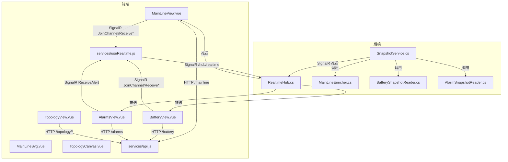
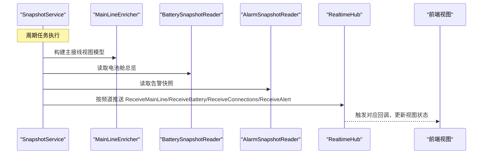
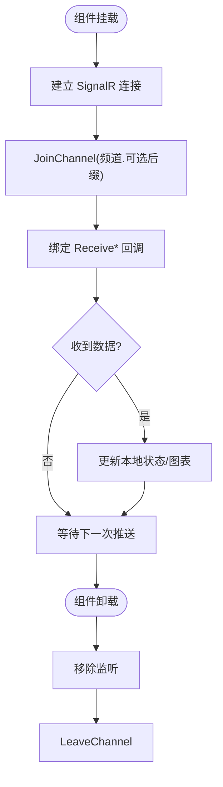
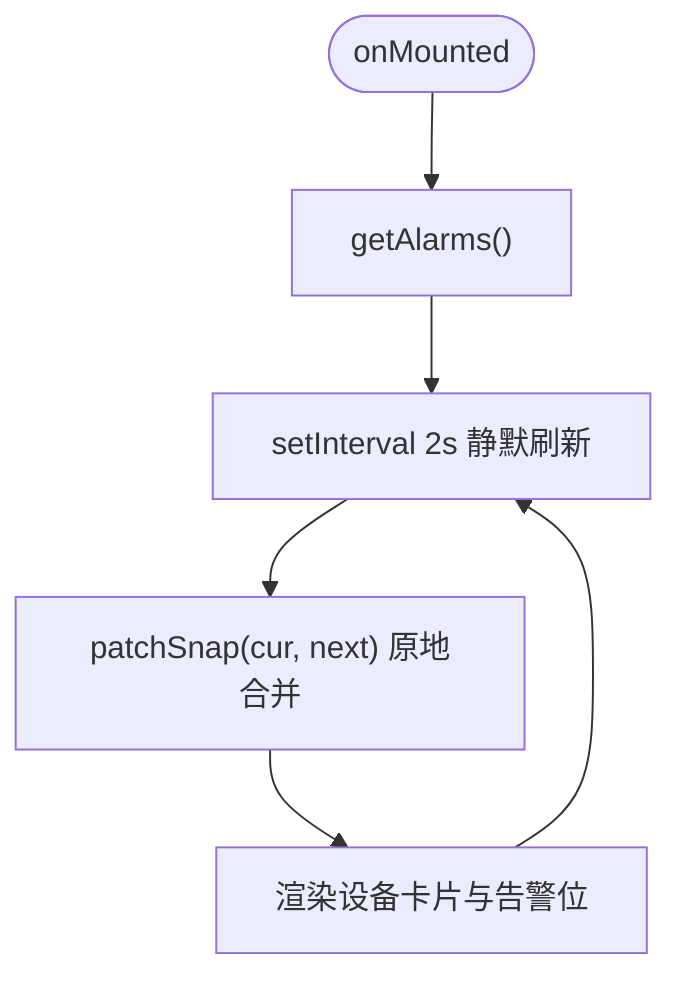
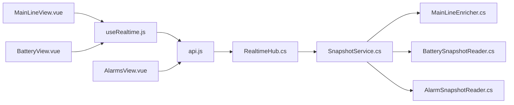

# 实时监控界面

<cite>
**本文引用的文件**
- [RealtimeHub.cs](file://Web/RealtimeHub.cs)
- [SnapshotService.cs](file://Web/SnapshotService.cs)
- [MainLineEnricher.cs](file://Web/MainLineEnricher.cs)
- [BatterySnapshotReader.cs](file://Web/BatterySnapshotReader.cs)
- [AlarmSnapshotReader.cs](file://Web/AlarmSnapshotReader.cs)
- [api.js](file://Web/src/services/api.js)
- [useRealtime.js](file://Web/src/services/useRealtime.js)
- [constants.js](file://Web/src/services/constants.js)
- [MainLineView.vue](file://Web/src/views/MainLineView.vue)
- [MainLineSvg.vue](file://Web/src/components/MainLineSvg.vue)
- [TopologyView.vue](file://Web/src/views/TopologyView.vue)
- [TopologyCanvas.vue](file://Web/src/components/topology/TopologyCanvas.vue)
- [BatteryView.vue](file://Web/src/views/BatteryView.vue)
- [AlarmsView.vue](file://Web/src/views/AlarmsView.vue)
</cite>

## 目录
1. [简介](#简介)
2. [项目结构](#项目结构)
3. [核心组件](#核心组件)
4. [架构总览](#架构总览)
5. [详细组件分析](#详细组件分析)
6. [依赖关系分析](#依赖关系分析)
7. [性能考虑](#性能考虑)
8. [故障排查指南](#故障排查指南)
9. [结论](#结论)
10. [附录：界面定制与扩展指南](#附录界面定制与扩展指南)

## 简介
本文件面向“储能仿真系统”的实时监控界面，系统性说明实时数据接收与更新机制（SignalR 连接管理、频道订阅、状态同步）、各监控视图功能（主接线图、电池监控、告警等）、数据绑定与图表绘制、用户交互处理，以及响应式数据流、错误处理和性能优化策略。文末提供界面定制指南，包括样式修改、组件扩展和新增监控视图的开发方法。

## 项目结构
前端采用 Vue 单页应用，后端为 ASP.NET Core Web API + SignalR Hub。实时数据通过 SignalR 推送，HTTP 接口用于初始快照与指令下发。关键目录与职责：
- Web/RealtimeHub.cs：定义 SignalR Hub、频道与方法常量，负责按频道分组推送。
- Web/SnapshotService.cs：后台服务周期采样仿真状态并通过 SignalR 推送主接线、连接、电池舱等数据。
- Web/MainLineEnricher.cs：将底层电气快照增强为主接线视图所需的数据模型。
- Web/BatterySnapshotReader.cs：读取电池舱总览与单体电压快照。
- Web/AlarmSnapshotReader.cs：聚合 BMS/PCS 告警位并生成告警快照。
- Web/src/services/*：HTTP 客户端封装、SignalR 连接复用、频道与方法常量。
- Web/src/views/*：页面级视图（主接线、拓扑、电池、告警等）。
- Web/src/components/*：可复用可视化组件（SVG 主接线、拓扑画布等）。



**图示来源**
- [RealtimeHub.cs:1-59](file://Web/RealtimeHub.cs#L1-L59)
- [SnapshotService.cs:1-133](file://Web/SnapshotService.cs#L1-L133)
- [MainLineEnricher.cs:1-388](file://Web/MainLineEnricher.cs#L1-L388)
- [BatterySnapshotReader.cs:1-204](file://Web/BatterySnapshotReader.cs#L1-L204)
- [AlarmSnapshotReader.cs:1-450](file://Web/AlarmSnapshotReader.cs#L1-L450)
- [api.js:1-88](file://Web/src/services/api.js#L1-L88)
- [useRealtime.js:1-39](file://Web/src/services/useRealtime.js#L1-L39)
- [MainLineView.vue:1-655](file://Web/src/views/MainLineView.vue#L1-L655)
- [MainLineSvg.vue:1-740](file://Web/src/components/MainLineSvg.vue#L1-L740)
- [TopologyView.vue:1-926](file://Web/src/views/TopologyView.vue#L1-L926)
- [TopologyCanvas.vue:1-200](file://Web/src/components/topology/TopologyCanvas.vue#L1-L200)

**章节来源**
- [RealtimeHub.cs:1-59](file://Web/RealtimeHub.cs#L1-L59)
- [SnapshotService.cs:1-133](file://Web/SnapshotService.cs#L1-L133)
- [api.js:1-88](file://Web/src/services/api.js#L1-L88)
- [useRealtime.js:1-39](file://Web/src/services/useRealtime.js#L1-L39)

## 核心组件
- SignalR 推送通道：RealtimeHub 提供频道加入/离开能力，并在连接时推送一次全量告警快照；定义统一的频道与方法名常量，便于前后端一致。
- 后台采样器：SnapshotService 作为 BackgroundService，周期性采集仿真状态，构建主接线、连接、电池舱快照，并按频道推送给前端。
- 数据增强与读取：MainLineEnricher 将基础电气快照增强为视图模型；BatterySnapshotReader 读取电池舱总览与单体电压；AlarmSnapshotReader 聚合告警位。
- 前端服务层：api.js 封装 HTTP 请求与 SignalR 连接复用；useRealtime.js 提供统一订阅 Hook，自动加入频道、绑定回调、卸载清理。
- 视图与组件：MainLineView 展示电站概览与主接线图；BatteryView 展示电池舱总览与簇分布图；AlarmsView 展示设备告警/故障；TopologyView/TopologyCanvas 提供组态编辑与连线。

**章节来源**
- [RealtimeHub.cs:1-59](file://Web/RealtimeHub.cs#L1-L59)
- [SnapshotService.cs:1-133](file://Web/SnapshotService.cs#L1-L133)
- [MainLineEnricher.cs:1-388](file://Web/MainLineEnricher.cs#L1-L388)
- [BatterySnapshotReader.cs:1-204](file://Web/BatterySnapshotReader.cs#L1-L204)
- [AlarmSnapshotReader.cs:1-450](file://Web/AlarmSnapshotReader.cs#L1-L450)
- [api.js:1-88](file://Web/src/services/api.js#L1-L88)
- [useRealtime.js:1-39](file://Web/src/services/useRealtime.js#L1-L39)

## 架构总览
实时数据流从后端采样到前端渲染的关键路径如下：



**图示来源**
- [SnapshotService.cs:46-133](file://Web/SnapshotService.cs#L46-L133)
- [MainLineEnricher.cs:10-70](file://Web/MainLineEnricher.cs#L10-L70)
- [BatterySnapshotReader.cs:71-150](file://Web/BatterySnapshotReader.cs#L71-L150)
- [AlarmSnapshotReader.cs:211-248](file://Web/AlarmSnapshotReader.cs#L211-L248)
- [RealtimeHub.cs:10-46](file://Web/RealtimeHub.cs#L10-L46)

## 详细组件分析

### 实时数据接收与更新机制
- 连接管理
  - 前端通过 api.js 中的 getHub() 建立唯一的 SignalR 连接，启用自动重连，连接地址为 /hub/realtime。
  - useRealtime.js 在组件挂载时调用 JoinChannel 加入频道，并注册回调；组件卸载时移除监听并 LeaveChannel。
- 频道与消息
  - 频道：mainline、battery、cells、connections、alert、cmdprogress。
  - 方法：ReceiveMainLine、ReceiveBattery、ReceiveCells、ReceiveConnections、ReceiveAlert、ReceiveCommandProgress。
- 状态同步
  - 主接线：SnapshotService 周期推送主接线快照，MainLineView 直接替换 snap 并同步输入草稿值。
  - 电池：按单元号分组推送，BatteryView 仅更新当前选中单元数据并重绘图表。
  - 告警：连接时推送一次全量告警；AlarmsView 定时轮询 /alarms 并原地 patch 避免闪烁。



**图示来源**
- [api.js:71-85](file://Web/src/services/api.js#L71-L85)
- [useRealtime.js:8-36](file://Web/src/services/useRealtime.js#L8-L36)
- [RealtimeHub.cs:10-46](file://Web/RealtimeHub.cs#L10-L46)
- [SnapshotService.cs:103-130](file://Web/SnapshotService.cs#L103-L130)

**章节来源**
- [api.js:1-88](file://Web/src/services/api.js#L1-L88)
- [useRealtime.js:1-39](file://Web/src/services/useRealtime.js#L1-L39)
- [RealtimeHub.cs:1-59](file://Web/RealtimeHub.cs#L1-L59)
- [SnapshotService.cs:1-133](file://Web/SnapshotService.cs#L1-L133)

### 主接线图视图（MainLineView）
- 功能要点
  - 电站概览：PCC 电压、频率、母线电压、主断路器状态、求解模式、电表功率、电网设定值、负载设定。
  - 电气主接线：支持两种渲染模式（经典 SVG 或工程模式拓扑），显示断路器、变压器、PCS/BMS 支路信息，支持启停、设定功率/无功、BMS 上电/下电/故障清除/SOC 设定。
  - 传播节点与设备明细：表格化展示母线相量、交流设备三相电压电流与功率。
- 数据绑定与交互
  - 初始化通过 HTTP 获取主接线快照，随后通过 useRealtime 订阅 ReceiveMainLine 实时更新。
  - 输入框草稿值与后端设定值双向同步，避免重复提交。
  - 断路器操作前校验跳闸状态，防止误操作。
- 图表与布局
  - MainLineSvg 使用 SVG 绘制主接线，支持缩放、平移、点击断路器、分支内 PCS/BMS 控件。
  - 工程模式下根据 TopologyStore 动态切换渲染逻辑。

```mermaid
sequenceDiagram
participant V as "MainLineView"
participant S as "SnapshotService"
participant H as "RealtimeHub"
participant C as "MainLineSvg"
V->>V : onMounted -> getMainLine()
V->>H : useRealtime("mainline", {ReceiveMainLine})
S->>H : SendAsync(ReceiveMainLine, mainline)
H-->>V : ReceiveMainLine(data)
V->>V : snap.value = data; syncLoadDrafts()
V->>C : 传递 snap 进行渲染
```

**图示来源**
- [MainLineView.vue:579-591](file://Web/src/views/MainLineView.vue#L579-L591)
- [SnapshotService.cs:103-108](file://Web/SnapshotService.cs#L103-L108)
- [RealtimeHub.cs:36-46](file://Web/RealtimeHub.cs#L36-L46)
- [MainLineSvg.vue:162-183](file://Web/src/components/MainLineSvg.vue#L162-L183)

**章节来源**
- [MainLineView.vue:1-655](file://Web/src/views/MainLineView.vue#L1-L655)
- [MainLineSvg.vue:1-740](file://Web/src/components/MainLineSvg.vue#L1-L740)
- [MainLineEnricher.cs:10-70](file://Web/MainLineEnricher.cs#L10-L70)

### 电池监控视图（BatteryView）
- 功能要点
  - 选择单元后展示电池舱总览：总压、总流、SOC/SOH、最高/最低单体位置、并网/黑启动状态。
  - 簇列表：展示各簇电压、电流、功率、SOC/SOH、单体平均/极值。
  - 图表：ECharts 柱状+折线组合图，展示 SOC 与功率分布。
- 数据流
  - 初始加载通过 HTTP 获取电池数据，随后通过 SignalR 订阅 ReceiveBattery 频道（带单元号后缀）。
  - 单元切换时退出旧组、加入新组，并重新加载数据与重绘图表。
- 性能优化
  - 图表实例复用，仅在数据变化时 setOption。
  - 组播按单元号细分，减少无关流量。

```mermaid
sequenceDiagram
participant BV as "BatteryView"
participant H as "RealtimeHub"
participant S as "SnapshotService"
BV->>BV : onMounted -> getBattery(unit)
BV->>H : JoinChannel("battery.{unit}")
S->>H : SendAsync(ReceiveBattery, overview)
H-->>BV : ReceiveBattery(data)
BV->>BV : data.value = data; renderChart()
```

**图示来源**
- [BatteryView.vue:111-123](file://Web/src/views/BatteryView.vue#L111-L123)
- [SnapshotService.cs:113-123](file://Web/SnapshotService.cs#L113-L123)
- [RealtimeHub.cs:24-34](file://Web/RealtimeHub.cs#L24-L34)

**章节来源**
- [BatteryView.vue:1-133](file://Web/src/views/BatteryView.vue#L1-L133)
- [BatterySnapshotReader.cs:71-150](file://Web/BatterySnapshotReader.cs#L71-L150)

### 告警视图（AlarmsView）
- 功能要点
  - 设备筛选：全部/BMS/PCS，按单元、类型过滤，仅显示已触发、折叠无告警设备。
  - 告警位卡片：绿=未触发，红=已触发；统计触发设备数与触发位数。
  - 自动刷新：定时器每 2 秒静默刷新，避免整表替换导致的闪烁。
- 数据流
  - 初始加载 /alarms，之后定时静默刷新；使用原地 patch 合并新旧快照，提升稳定性。
- 错误处理
  - 刷新失败时提示错误；静默刷新失败不阻断 UI。



**图示来源**
- [AlarmsView.vue:158-185](file://Web/src/views/AlarmsView.vue#L158-L185)
- [AlarmsView.vue:131-156](file://Web/src/views/AlarmsView.vue#L131-L156)
- [AlarmSnapshotReader.cs:211-248](file://Web/AlarmSnapshotReader.cs#L211-L248)

**章节来源**
- [AlarmsView.vue:1-262](file://Web/src/views/AlarmsView.vue#L1-L262)
- [AlarmSnapshotReader.cs:1-450](file://Web/AlarmSnapshotReader.cs#L1-L450)

### 拓扑视图（TopologyView/TopologyCanvas）
- 功能要点
  - 拖拽模板/设备库到画布，点端口连线，支持撤销/重做、保存工程、校验问题高亮。
  - 标准拓扑向导：一键生成电网→主断→母线→储能/光伏单元的径向骨架。
- 交互流程
  - 端口点击进入连线模式，二次点击目标端口完成连线；后端校验通过后更新工程。
  - 属性面板编辑节点参数，变更标记为脏，保存前进行校验。

```mermaid
sequenceDiagram
participant TV as "TopologyView"
participant TC as "TopologyCanvas"
participant API as "api.js"
TC->>TV : port-click({nodeId, portId})
TV->>TV : linking = {nodeId, portId}
TC->>TV : port-click({toNodeId, toPortId})
TV->>API : postTopologyConnect(project, edge)
API-->>TV : validation + project
TV->>TV : applyProject(res.project); clearValidation()
```

**图示来源**
- [TopologyView.vue:648-719](file://Web/src/views/TopologyView.vue#L648-L719)
- [TopologyCanvas.vue:119-145](file://Web/src/components/topology/TopologyCanvas.vue#L119-L145)
- [api.js:47-63](file://Web/src/services/api.js#L47-L63)

**章节来源**
- [TopologyView.vue:1-926](file://Web/src/views/TopologyView.vue#L1-L926)
- [TopologyCanvas.vue:1-200](file://Web/src/components/topology/TopologyCanvas.vue#L1-L200)

## 依赖关系分析
- 前后端耦合点
  - 频道与方法名：RealtimeChannels/RealtimeMethods 在前端 constants.js 与后端 RealtimeHub.cs 中保持一致。
  - 数据模型：MainLineViewModel、BatteryOverviewDto、AlarmSnapshotDto 由后端构建，前端消费。
- 组件内聚性
  - MainLineView 高内聚于主接线业务，MainLineSvg 专注渲染与交互。
  - BatteryView 聚焦电池总览与图表，使用 ECharts 独立实例。
  - AlarmsView 聚合告警位，使用原地 patch 降低 DOM 抖动。
- 外部依赖
  - SignalR 自动重连、Axios 拦截器统一错误处理。
  - Element Plus 提供 UI 组件与消息提示。



**图示来源**
- [RealtimeHub.cs:1-59](file://Web/RealtimeHub.cs#L1-L59)
- [SnapshotService.cs:1-133](file://Web/SnapshotService.cs#L1-L133)
- [MainLineEnricher.cs:1-388](file://Web/MainLineEnricher.cs#L1-L388)
- [BatterySnapshotReader.cs:1-204](file://Web/BatterySnapshotReader.cs#L1-L204)
- [AlarmSnapshotReader.cs:1-450](file://Web/AlarmSnapshotReader.cs#L1-L450)
- [api.js:1-88](file://Web/src/services/api.js#L1-L88)
- [useRealtime.js:1-39](file://Web/src/services/useRealtime.js#L1-L39)
- [MainLineView.vue:1-655](file://Web/src/views/MainLineView.vue#L1-L655)
- [BatteryView.vue:1-133](file://Web/src/views/BatteryView.vue#L1-L133)
- [AlarmsView.vue:1-262](file://Web/src/views/AlarmsView.vue#L1-L262)

**章节来源**
- [RealtimeHub.cs:1-59](file://Web/RealtimeHub.cs#L1-L59)
- [SnapshotService.cs:1-133](file://Web/SnapshotService.cs#L1-L133)
- [api.js:1-88](file://Web/src/services/api.js#L1-L88)
- [useRealtime.js:1-39](file://Web/src/services/useRealtime.js#L1-L39)

## 性能考虑
- 推送频率控制
  - SnapshotService 默认 200ms 周期，下限 50ms，可通过配置调整；支持 RequestImmediatePush 即时推帧以响应控制侧变更。
- 频道细分
  - 电池数据按单元号分组推送，避免全量广播造成带宽浪费。
- 前端渲染优化
  - 主接线 SVG 使用 transform 平移与缩放，减少重排；图表实例复用，按需 setOption。
  - 告警视图使用原地 patch 合并，避免整表替换导致闪烁。
- 连接与错误
  - SignalR 自动重连；Axios 拦截器统一错误消息；组件卸载时清理监听与组播成员。

[本节为通用指导，无需特定文件引用]

## 故障排查指南
- SignalR 连接失败
  - 检查 getHub() 是否成功建立连接；确认 /hub/realtime 路由可用；查看浏览器控制台日志。
- 数据不更新
  - 确认 useRealtime 是否正确 JoinChannel；检查后端 SnapshotService 是否运行；核对频道与方法名一致性。
- 主接线操作无效
  - 断路器跳闸时需先复位；负载设定需工程模式且存在负载节点；PCS/BMS 命令需解析到有效 Modbus 点位。
- 告警视图闪烁或丢失
  - 确保使用 patchSnap 原地合并；检查后端返回的设备 ID 是否稳定。

**章节来源**
- [api.js:6-12](file://Web/src/services/api.js#L6-L12)
- [useRealtime.js:13-33](file://Web/src/services/useRealtime.js#L13-L33)
- [SnapshotService.cs:35-44](file://Web/SnapshotService.cs#L35-L44)
- [MainLineView.vue:330-357](file://Web/src/views/MainLineView.vue#L330-L357)
- [AlarmsView.vue:131-156](file://Web/src/views/AlarmsView.vue#L131-L156)

## 结论
该监控系统通过 SignalR 实现低延迟、细粒度的实时数据推送，结合后端采样器与数据增强模块，为前端提供丰富、一致的视图数据。主接线、电池、告警等视图各司其职，既满足日常监控需求，又具备可扩展性与良好的用户体验。通过频道分组、原地合并、图表复用等手段，系统在大数据量场景下仍保持流畅。

[本节为总结性内容，无需特定文件引用]

## 附录：界面定制与扩展指南
- 样式修改
  - 全局样式位于 Web/src/styles/app.css；组件内样式使用 scoped CSS，注意 foreignObject 内 HTML 样式不可 scoped。
  - 主接线 SVG 颜色与尺寸可在 MainLineSvg.vue 中调整常量（如 UNIT_WIDTH、MARGIN_*、BRANCH.*）。
- 组件扩展
  - 在主接线中添加新设备：扩展 MainLineEnricher 的视图模型，并在 MainLineSvg.vue 中增加绘制逻辑与交互事件。
  - 新增图表：参考 BatteryView.vue 使用 ECharts，注意实例复用与销毁。
- 新增监控视图
  - 新建 Vue 视图文件，使用 useRealtime.js 订阅相应频道，通过 api.js 发起 HTTP 请求获取初始数据。
  - 遵循现有模式：初始化加载、SignalR 实时更新、错误提示、组件卸载清理。
- 新增频道与方法
  - 在后端 RealtimeHub.cs 添加频道与方法常量；在 SnapshotService.cs 中实现推送逻辑；在前端 constants.js 与 useRealtime.js 中保持一致。
- 工程模式与拓扑
  - 通过 TopologyView.vue 与 TopologyCanvas.vue 扩展模板与连线规则；后端校验逻辑在 Web/Topology/* 中维护。

**章节来源**
- [MainLineSvg.vue:255-274](file://Web/src/components/MainLineSvg.vue#L255-L274)
- [MainLineSvg.vue:516-740](file://Web/src/components/MainLineSvg.vue#L516-L740)
- [BatteryView.vue:64-82](file://Web/src/views/BatteryView.vue#L64-L82)
- [RealtimeHub.cs:24-46](file://Web/RealtimeHub.cs#L24-L46)
- [SnapshotService.cs:103-130](file://Web/SnapshotService.cs#L103-L130)
- [TopologyView.vue:1-200](file://Web/src/views/TopologyView.vue#L1-L200)