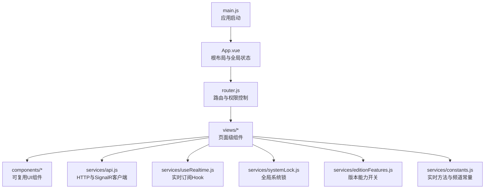
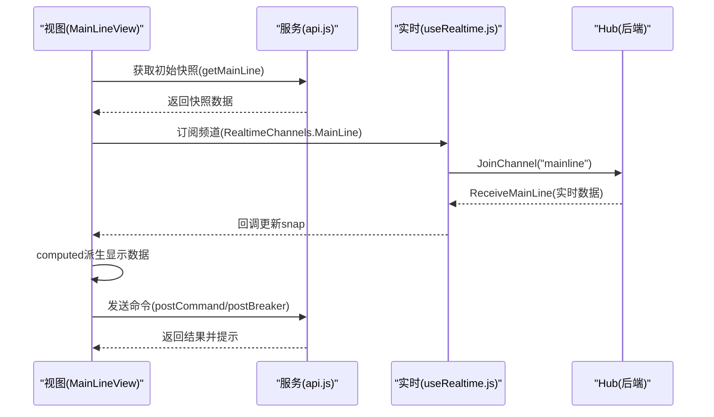
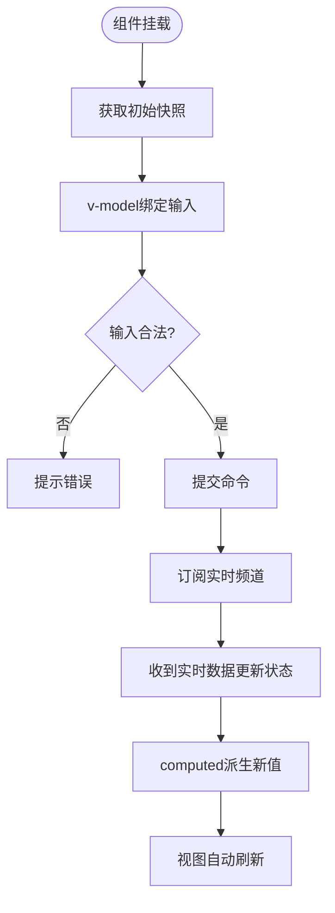
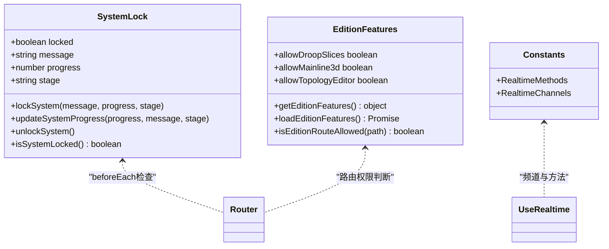
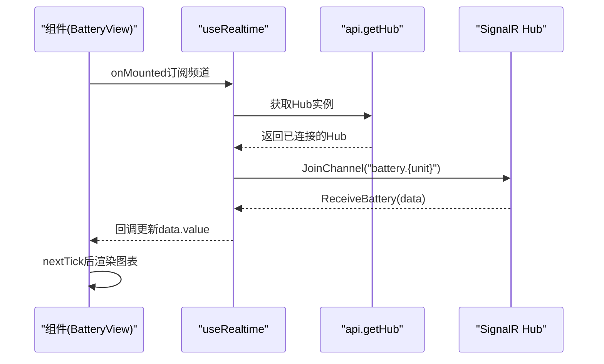
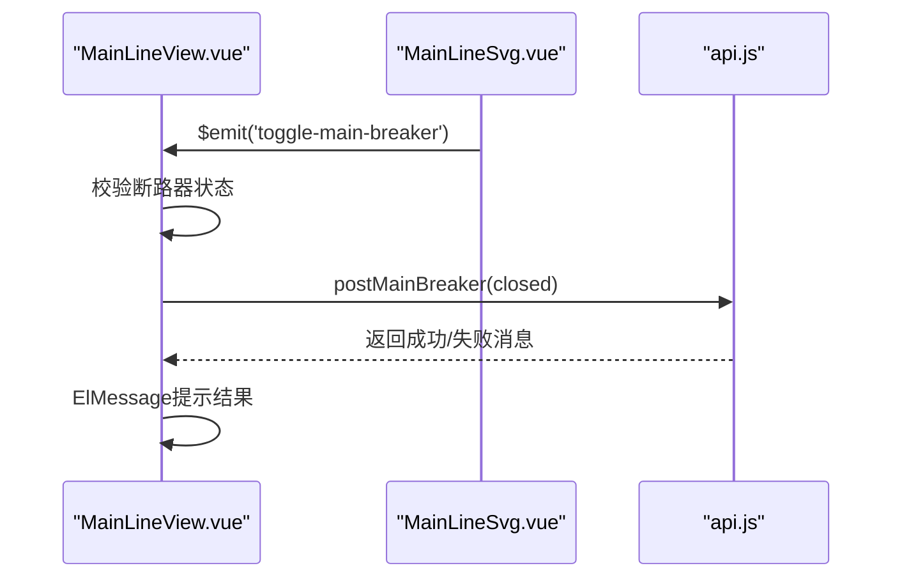
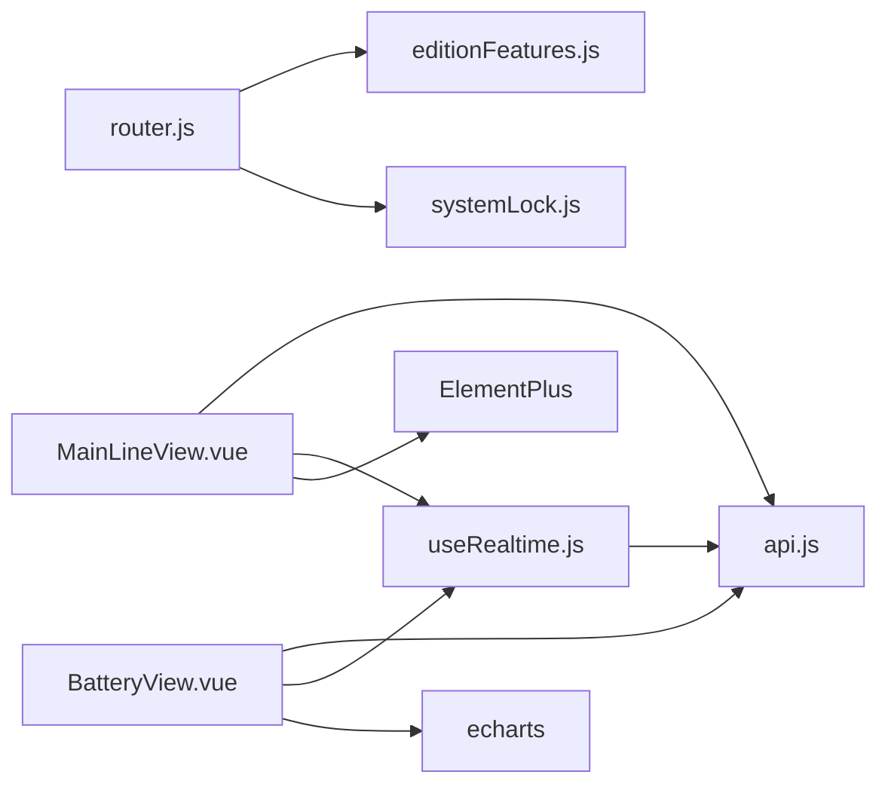

# 数据绑定和状态管理

<cite>
**本文引用的文件**
- [App.vue](file://Web/src/App.vue)
- [main.js](file://Web/src/main.js)
- [router.js](file://Web/src/router.js)
- [api.js](file://Web/src/services/api.js)
- [useRealtime.js](file://Web/src/services/useRealtime.js)
- [systemLock.js](file://Web/src/services/systemLock.js)
- [editionFeatures.js](file://Web/src/services/editionFeatures.js)
- [constants.js](file://Web/src/services/constants.js)
- [MainLineView.vue](file://Web/src/views/MainLineView.vue)
- [BatteryView.vue](file://Web/src/views/BatteryView.vue)
- [MainLineSvg.vue](file://Web/src/components/MainLineSvg.vue)
</cite>

## 目录
1. [简介](#简介)
2. [项目结构](#项目结构)
3. [核心组件](#核心组件)
4. [架构总览](#架构总览)
5. [详细组件分析](#详细组件分析)
6. [依赖关系分析](#依赖关系分析)
7. [性能考虑](#性能考虑)
8. [故障排查指南](#故障排查指南)
9. [结论](#结论)

## 简介
本文件聚焦于前端（Vue）的数据绑定与状态管理，覆盖以下主题：
- Vue 组件中的数据绑定机制：响应式数据更新、视图同步、表单双向绑定。
- 全局状态管理模式：轻量级 Store（模块内 ref/reactive）、跨组件共享状态、系统锁与版本能力等。
- 实时数据流处理：SignalR 频道订阅、数据转换与格式化、缓存与去重策略。
- 组件间通信模式：事件传递、属性绑定、方法调用。
- 性能优化策略：虚拟滚动、懒加载、数据去重、图表按需渲染与销毁。

## 项目结构
前端采用 Vue 3 + Element Plus + Vue Router + ECharts 的组合，服务层通过 Axios 访问 REST API，并通过 SignalR 接收实时推送。路由守卫结合“版本能力”控制页面可见性；全局系统锁用于在系统重新初始化时锁定交互。

图示来源
- [main.js:11-23](file://Web/src/main.js#L11-L23)
- [App.vue:105-149](file://Web/src/App.vue#L105-L149)
- [router.js:21-39](file://Web/src/router.js#L21-L39)
- [api.js:71-85](file://Web/src/services/api.js#L71-L85)
- [useRealtime.js:8-35](file://Web/src/services/useRealtime.js#L8-L35)
- [systemLock.js:1-47](file://Web/src/services/systemLock.js#L1-L47)
- [editionFeatures.js:1-49](file://Web/src/services/editionFeatures.js#L1-L49)
- [constants.js:1-18](file://Web/src/services/constants.js#L1-L18)

章节来源
- [main.js:11-23](file://Web/src/main.js#L11-L23)
- [App.vue:105-149](file://Web/src/App.vue#L105-L149)
- [router.js:21-39](file://Web/src/router.js#L21-L39)

## 核心组件
- 应用入口与全局状态
  - main.js 负责创建 Vue 应用、注册图标库、ElementPlus 国际化、挂载路由与根组件。
  - App.vue 维护全局就绪状态、告警信息、版本能力开关，并展示系统锁遮罩。
- 路由与权限
  - router.js 定义路由表，并在 beforeEach 中根据系统锁与版本能力进行跳转拦截。
- 服务层
  - api.js 封装 Axios 请求与 SignalR Hub 连接，提供统一接口与实时通道获取。
  - useRealtime.js 提供 Hook 以订阅频道、自动退订，屏蔽连接细节。
  - systemLock.js 提供全局系统锁状态与进度更新。
  - editionFeatures.js 拉取并缓存版本能力，供路由与界面使用。
  - constants.js 集中定义实时方法与频道常量。
- 页面与组件
  - MainLineView.vue 主接线页：聚合快照、计算派生数据、处理用户操作、订阅实时数据。
  - BatteryView.vue 电池页：单元切换、图表渲染、按单元订阅实时数据。
  - MainLineSvg.vue 主接线 SVG 组件：缩放平移、断路器点击、向父组件派发事件。

章节来源
- [main.js:11-23](file://Web/src/main.js#L11-L23)
- [App.vue:105-149](file://Web/src/App.vue#L105-L149)
- [router.js:21-39](file://Web/src/router.js#L21-L39)
- [api.js:1-88](file://Web/src/services/api.js#L1-L88)
- [useRealtime.js:8-35](file://Web/src/services/useRealtime.js#L8-L35)
- [systemLock.js:1-47](file://Web/src/services/systemLock.js#L1-L47)
- [editionFeatures.js:1-49](file://Web/src/services/editionFeatures.js#L1-L49)
- [constants.js:1-18](file://Web/src/services/constants.js#L1-L18)
- [MainLineView.vue:165-592](file://Web/src/views/MainLineView.vue#L165-L592)
- [BatteryView.vue:45-132](file://Web/src/views/BatteryView.vue#L45-L132)
- [MainLineSvg.vue:162-200](file://Web/src/components/MainLineSvg.vue#L162-L200)

## 架构总览
前端采用“页面级状态 + 轻量全局状态 + 实时推送”的混合模式：
- 页面级状态：每个视图维护自己的响应式数据（如 snap、data），通过 computed 派生展示数据。
- 全局状态：systemLock 与 editionFeatures 作为跨组件共享的全局状态，分别用于系统锁与功能开关。
- 实时数据：通过 SignalR 频道订阅，将后端推送直接映射到页面状态，实现视图自动更新。
- 组件通信：父子组件通过 props 传递数据、通过 $emit 传递事件；跨页面通过路由与服务层协作。

图示来源
- [MainLineView.vue:579-591](file://Web/src/views/MainLineView.vue#L579-L591)
- [api.js:14-35](file://Web/src/services/api.js#L14-L35)
- [useRealtime.js:13-33](file://Web/src/services/useRealtime.js#L13-L33)
- [constants.js:1-18](file://Web/src/services/constants.js#L1-L18)

## 详细组件分析

### 数据绑定与响应式更新
- 双向绑定与输入校验
  - 主接线页使用 v-model 绑定电网电压、频率与负载设定值，并在提交前进行数值范围校验，避免非法输入。
  - 当工程模式未配置负载时，相关输入框被禁用并置灰，防止误操作。
- 响应式派生
  - 大量展示字段通过 computed 从基础快照派生，例如断路器标签、交流设备行、母线节点行等，确保数据变化时视图自动刷新。
- 实时更新
  - 通过 useRealtime Hook 订阅 SignalR 频道，收到数据后直接替换页面状态，触发视图更新。
  - 对草稿值（draft）与服务器设定值进行同步，避免 UI 抖动。

图示来源
- [MainLineView.vue:173-219](file://Web/src/views/MainLineView.vue#L173-L219)
- [MainLineView.vue:579-591](file://Web/src/views/MainLineView.vue#L579-L591)

章节来源
- [MainLineView.vue:165-592](file://Web/src/views/MainLineView.vue#L165-L592)

### 全局状态管理模式
- 系统锁（systemLock.js）
  - 使用 reactive 维护 locked、message、progress、stage 等状态，并提供 lockSystem/updateSystemProgress/unlockSystem/isSystemLocked 等方法。
  - 路由守卫在系统锁定时阻止页面切换，保障系统重新初始化过程的一致性。
- 版本能力（editionFeatures.js）
  - 通过 getConfig 拉取能力开关并缓存，避免重复请求；提供 isEditionRouteAllowed 判断路由是否允许访问。
- 实时通道常量（constants.js）
  - 集中定义实时方法与频道名，便于统一管理与扩展。

图示来源
- [systemLock.js:1-47](file://Web/src/services/systemLock.js#L1-L47)
- [editionFeatures.js:1-49](file://Web/src/services/editionFeatures.js#L1-L49)
- [constants.js:1-18](file://Web/src/services/constants.js#L1-L18)
- [router.js:26-39](file://Web/src/router.js#L26-L39)

章节来源
- [systemLock.js:1-47](file://Web/src/services/systemLock.js#L1-L47)
- [editionFeatures.js:1-49](file://Web/src/services/editionFeatures.js#L1-L49)
- [router.js:26-39](file://Web/src/router.js#L26-L39)

### 实时数据流处理
- 连接与订阅
  - api.js 中的 getHub 单例化 SignalR 连接，支持自动重连；useRealtime.js 在组件挂载时加入频道，卸载时移除监听并离开频道。
- 数据转换与格式化
  - 页面内定义多种格式化工具函数（如电压、频率、功率、相量等），在模板或表格列中使用，保证一致显示。
- 缓存与去重
  - 版本能力加载使用 Promise 缓存，避免重复请求。
  - 主接线页对草稿值与服务器设定值进行对比，仅在变化时更新输入框，减少不必要的重绘。

图示来源
- [useRealtime.js:8-35](file://Web/src/services/useRealtime.js#L8-L35)
- [api.js:71-85](file://Web/src/services/api.js#L71-L85)
- [BatteryView.vue:105-123](file://Web/src/views/BatteryView.vue#L105-L123)

章节来源
- [useRealtime.js:8-35](file://Web/src/services/useRealtime.js#L8-L35)
- [api.js:71-85](file://Web/src/services/api.js#L71-L85)
- [BatteryView.vue:105-123](file://Web/src/views/BatteryView.vue#L105-L123)

### 组件间通信模式
- 属性绑定（Props）
  - MainLineSvg.vue 通过 props 接收快照数据，内部基于 props 计算布局与样式。
- 事件传递（$emit）
  - MainLineSvg.vue 在用户交互（如点击断路器、设置功率）时向上派发事件，由父组件 MainLineView.vue 处理业务逻辑并调用服务层。
- 方法调用
  - 页面组件调用 services/api.js 暴露的方法进行 HTTP 请求与命令下发，统一错误提示。

图示来源
- [MainLineSvg.vue:169-183](file://Web/src/components/MainLineSvg.vue#L169-L183)
- [MainLineView.vue:330-342](file://Web/src/views/MainLineView.vue#L330-L342)
- [api.js:31-35](file://Web/src/services/api.js#L31-L35)

章节来源
- [MainLineSvg.vue:169-183](file://Web/src/components/MainLineSvg.vue#L169-L183)
- [MainLineView.vue:330-342](file://Web/src/views/MainLineView.vue#L330-L342)
- [api.js:31-35](file://Web/src/services/api.js#L31-L35)

## 依赖关系分析
- 页面与服务的耦合
  - 视图组件依赖 services/api.js 提供的 HTTP 与 SignalR 接口，以及 useRealtime.js 的订阅能力。
  - 路由依赖 editionFeatures.js 的能力判断与 systemLock.js 的系统锁状态。
- 组件间的解耦
  - 通过 props/$emit 明确数据流向与事件边界，降低组件间直接耦合。
- 外部依赖
  - axios 用于 HTTP 请求，@microsoft/signalr 用于实时通信，echarts 用于图表渲染。

图示来源
- [MainLineView.vue:165-592](file://Web/src/views/MainLineView.vue#L165-L592)
- [BatteryView.vue:45-132](file://Web/src/views/BatteryView.vue#L45-L132)
- [useRealtime.js:8-35](file://Web/src/services/useRealtime.js#L8-L35)
- [api.js:1-88](file://Web/src/services/api.js#L1-L88)
- [router.js:21-39](file://Web/src/router.js#L21-L39)
- [editionFeatures.js:1-49](file://Web/src/services/editionFeatures.js#L1-L49)
- [systemLock.js:1-47](file://Web/src/services/systemLock.js#L1-L47)

章节来源
- [MainLineView.vue:165-592](file://Web/src/views/MainLineView.vue#L165-L592)
- [BatteryView.vue:45-132](file://Web/src/views/BatteryView.vue#L45-L132)
- [useRealtime.js:8-35](file://Web/src/services/useRealtime.js#L8-L35)
- [api.js:1-88](file://Web/src/services/api.js#L1-L88)
- [router.js:21-39](file://Web/src/router.js#L21-L39)
- [editionFeatures.js:1-49](file://Web/src/services/editionFeatures.js#L1-L49)
- [systemLock.js:1-47](file://Web/src/services/systemLock.js#L1-L47)

## 性能考虑
- 懒加载与按需渲染
  - 路由采用动态导入，减少首屏包体积。
  - 图表在数据可用后再初始化，并在组件卸载时销毁，避免内存泄漏。
- 数据去重与最小化更新
  - 对草稿值与服务器设定值进行对比，仅在变化时更新输入框，减少不必要的 DOM 更新。
  - 版本能力加载使用 Promise 缓存，避免重复网络请求。
- 虚拟化与大数据集
  - 当前列表使用 Element Plus Table，若数据量增长，可考虑虚拟滚动方案（如 vue-virtual-scroller）以降低渲染开销。
- 实时数据节流
  - 可在 useRealtime 回调中加入节流或合并策略，避免高频推送导致频繁重渲染。

[本节为通用性能建议，不直接分析具体文件]

## 故障排查指南
- 实时连接失败
  - 现象：页面无法收到实时数据。
  - 排查：检查 getHub 的连接与重连逻辑，确认频道名称是否正确；查看浏览器控制台是否有 SignalR 连接错误。
- 系统锁导致路由不可用
  - 现象：切换路由被拦截。
  - 排查：确认 systemLock.locked 状态，必要时调用 unlockSystem 解锁；检查路由 beforeEach 中的锁判断。
- 版本能力未生效
  - 现象：某些菜单或路由不可见。
  - 排查：检查 /api/config 返回的 edition 字段；确认 editionFeatures 的缓存与路由权限判断。
- 输入校验失败
  - 现象：提交命令时报错。
  - 排查：检查输入值的类型与范围校验逻辑，确保符合业务约束。

章节来源
- [useRealtime.js:13-33](file://Web/src/services/useRealtime.js#L13-L33)
- [systemLock.js:15-47](file://Web/src/services/systemLock.js#L15-L47)
- [editionFeatures.js:17-49](file://Web/src/services/editionFeatures.js#L17-L49)
- [MainLineView.vue:526-577](file://Web/src/views/MainLineView.vue#L526-L577)

## 结论
该前端采用轻量级的全局状态与页面级状态相结合的模式，配合 SignalR 实时推送，实现了高效的数据绑定与视图同步。通过统一的 API 封装与 Hook 抽象，简化了实时订阅与错误处理；借助路由守卫与系统锁，保障了关键流程的一致性与安全性。未来可进一步引入虚拟滚动、数据节流与更细粒度的状态管理，以应对更大规模的数据与更高的实时性要求。