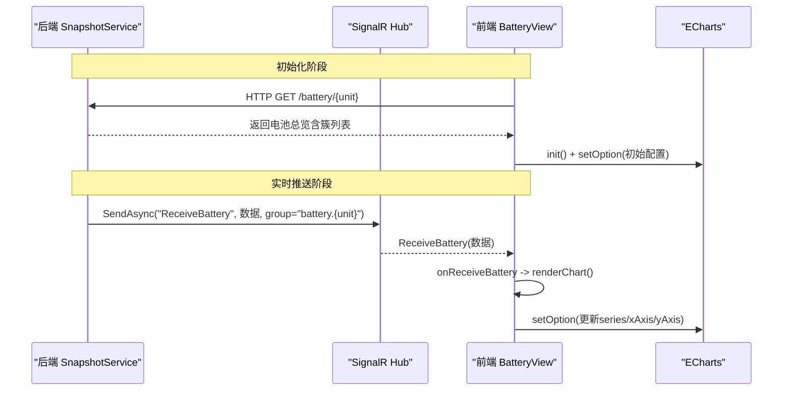
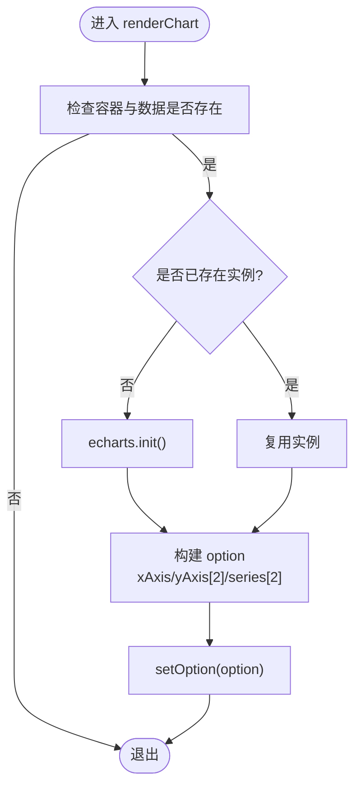
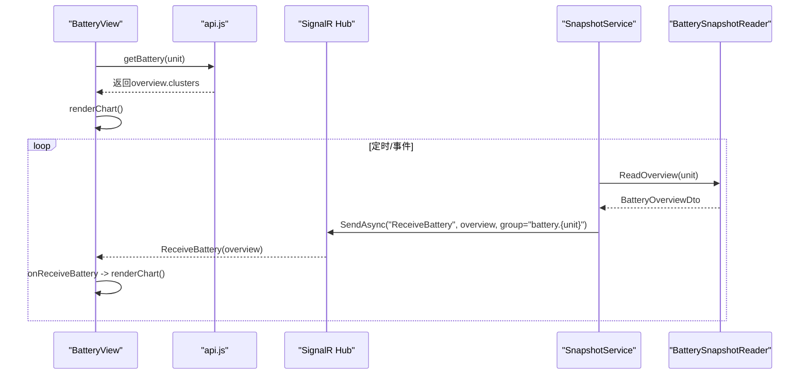
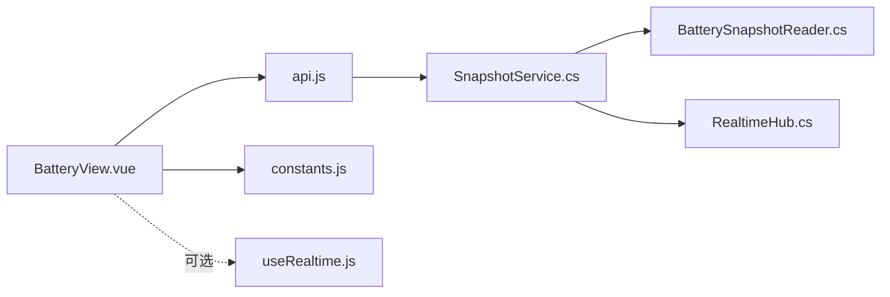

# SOC功率分布图表

<cite>
**本文引用的文件**
- [BatteryView.vue](file://Web/src/views/BatteryView.vue)
- [api.js](file://Web/src/services/api.js)
- [constants.js](file://Web/src/services/constants.js)
- [useRealtime.js](file://Web/src/services/useRealtime.js)
- [RealtimeHub.cs](file://Web/RealtimeHub.cs)
- [SnapshotService.cs](file://Web/SnapshotService.cs)
- [BatterySnapshotReader.cs](file://Web/BatterySnapshotReader.cs)
</cite>

## 目录
1. [简介](#简介)
2. [项目结构](#项目结构)
3. [核心组件](#核心组件)
4. [架构总览](#架构总览)
5. [详细组件分析](#详细组件分析)
6. [依赖关系分析](#依赖关系分析)
7. [性能考虑](#性能考虑)
8. [故障排查指南](#故障排查指南)
9. [结论](#结论)
10. [附录](#附录)

## 简介
本文件面向SOC功率分布图表，系统性说明ECharts图表的配置与渲染逻辑、双Y轴设计（SOC百分比与功率千瓦）、数据绑定机制（簇级SOC与功率的实时推送）、交互能力（图例切换、工具提示、缩放）、样式定制（颜色方案、字体、响应式布局）以及性能优化策略（数据采样与渲染频率控制）。文档同时覆盖前后端数据链路：前端通过SignalR订阅电池频道，后端定时读取快照并广播至对应单元组。

## 项目结构
SOC功率分布图表位于“电池舱总览”页面中，使用ECharts绘制“簇 SOC / 功率分布”。前端负责初始化图表、订阅实时数据、更新配置；后端提供REST接口获取初始快照，并通过SignalR Hub按单元分组推送实时数据。

```mermaid
graph TB
subgraph "前端"
BV["BatteryView.vue"]
API["services/api.js"]
CONST["services/constants.js"]
RT["services/useRealtime.js"]
end
subgraph "后端"
HUB["RealtimeHub.cs"]
SVC["SnapshotService.cs"]
RDR["BatterySnapshotReader.cs"]
end
BV --> API
BV --> CONST
BV -.可选复用.-> RT
API --> |HTTP GET /battery/{unit}| SVC
SVC --> RDR
SVC --> HUB
HUB --> |SignalR ReceiveBattery| BV
```

**图示来源**
- [BatteryView.vue:38-82](file://Web/src/views/BatteryView.vue#L38-L82)
- [api.js:14-27](file://Web/src/services/api.js#L14-L27)
- [constants.js:1-17](file://Web/src/services/constants.js#L1-L17)
- [useRealtime.js:1-38](file://Web/src/services/useRealtime.js#L1-L38)
- [RealtimeHub.cs:10-46](file://Web/RealtimeHub.cs#L10-L46)
- [SnapshotService.cs:113-132](file://Web/SnapshotService.cs#L113-L132)
- [BatterySnapshotReader.cs:69-150](file://Web/BatterySnapshotReader.cs#L69-L150)

**章节来源**
- [BatteryView.vue:38-82](file://Web/src/views/BatteryView.vue#L38-L82)
- [api.js:14-27](file://Web/src/services/api.js#L14-L27)
- [RealtimeHub.cs:10-46](file://Web/RealtimeHub.cs#L10-L46)
- [SnapshotService.cs:113-132](file://Web/SnapshotService.cs#L113-L132)
- [BatterySnapshotReader.cs:69-150](file://Web/BatterySnapshotReader.cs#L69-L150)

## 核心组件
- 前端视图 BatteryView.vue：负责ECharts实例创建、双Y轴配置、系列绑定、图例与工具提示、实时数据接收与重绘。
- 服务层 api.js：封装HTTP请求与SignalR连接管理，暴露getBattery/getHub等接口。
- 常量 constants.js：统一SignalR方法与频道名，避免硬编码。
- 实时订阅 useRealtime.js：可复用的Hook，自动加入/离开频道并在卸载时清理。
- 后端 RealtimeHub.cs：SignalR Hub，提供JoinChannel/LeaveChannel与频道/方法常量。
- 后端 SnapshotService.cs：定时或事件驱动读取快照，按单元分组推送ReceiveBattery。
- 后端 BatterySnapshotReader.cs：从仿真运行时读取各簇SOC、功率等指标，组装DTO。

**章节来源**
- [BatteryView.vue:45-132](file://Web/src/views/BatteryView.vue#L45-L132)
- [api.js:1-88](file://Web/src/services/api.js#L1-L88)
- [constants.js:1-17](file://Web/src/services/constants.js#L1-L17)
- [useRealtime.js:1-38](file://Web/src/services/useRealtime.js#L1-L38)
- [RealtimeHub.cs:10-46](file://Web/RealtimeHub.cs#L10-L46)
- [SnapshotService.cs:113-132](file://Web/SnapshotService.cs#L113-L132)
- [BatterySnapshotReader.cs:27-48](file://Web/BatterySnapshotReader.cs#L27-L48)

## 架构总览
下图展示从后端快照到前端图表更新的完整时序：后端读取簇级SOC与功率，通过SignalR推送到指定单元组；前端订阅后更新状态并重绘ECharts。



**图示来源**
- [SnapshotService.cs:113-132](file://Web/SnapshotService.cs#L113-L132)
- [RealtimeHub.cs:10-46](file://Web/RealtimeHub.cs#L10-L46)
- [BatteryView.vue:58-98](file://Web/src/views/BatteryView.vue#L58-L98)

## 详细组件分析

### ECharts图表配置与渲染
- 容器与实例：在DOM就绪后初始化ECharts实例，复用同一实例进行增量更新。
- 双Y轴设计：
  - 左Y轴：数值型，名称为“SOC(%)”，范围0-100，用于显示簇SOC。
  - 右Y轴：数值型，名称为“功率(kW)”，用于显示簇功率。
- X轴：分类轴，标签为“簇{clusterId}”。
- 系列：
  - 柱状图：名称“SOC(%)”，数据来自簇SOC。
  - 折线图：名称“功率(kW)”，绑定右侧Y轴，数据来自簇功率。
- 交互：
  - 工具提示：触发方式为axis，便于对比同簇SOC与功率。
  - 图例：默认启用，支持点击切换显示/隐藏系列。
  - 缩放：可通过ECharts内置dataZoom扩展实现（见“性能与交互增强”小节）。



**图示来源**
- [BatteryView.vue:64-82](file://Web/src/views/BatteryView.vue#L64-L82)

**章节来源**
- [BatteryView.vue:64-82](file://Web/src/views/BatteryView.vue#L64-L82)

### 数据绑定与实时更新机制
- 初始加载：调用getBattery(unit)获取当前单元的电池总览，包含clusters数组（每个簇含soc、powerKw等字段），随后渲染图表。
- 实时推送：
  - 前端通过SignalR订阅频道“battery.{unit}”，监听ReceiveBattery事件。
  - 收到数据后，若unitNumber匹配则更新本地状态并调用renderChart重绘。
- 后端推送：
  - SnapshotService遍历所有单元，读取Overview并发送到对应组“battery.{unit}”。
  - BatterySnapshotReader将簇级SOC、功率等指标聚合为DTO。



**图示来源**
- [api.js:14-27](file://Web/src/services/api.js#L14-L27)
- [BatteryView.vue:58-98](file://Web/src/views/BatteryView.vue#L58-L98)
- [SnapshotService.cs:113-132](file://Web/SnapshotService.cs#L113-L132)
- [BatterySnapshotReader.cs:69-150](file://Web/BatterySnapshotReader.cs#L69-L150)

**章节来源**
- [BatteryView.vue:58-98](file://Web/src/views/BatteryView.vue#L58-L98)
- [SnapshotService.cs:113-132](file://Web/SnapshotService.cs#L113-L132)
- [BatterySnapshotReader.cs:69-150](file://Web/BatterySnapshotReader.cs#L69-L150)

### 交互功能
- 图例切换：通过legend.data定义系列名，用户可点击图例项切换显示/隐藏。
- 工具提示：tooltip.trigger设为axis，鼠标悬停时显示该簇的SOC与功率。
- 缩放操作：可在option中添加dataZoom以支持X轴时间/类别滚动与区间选择（见“性能与交互增强”）。

**章节来源**
- [BatteryView.vue:68-81](file://Web/src/views/BatteryView.vue#L68-L81)

### 样式定制选项
- 颜色方案：可通过series[i].itemStyle.color自定义柱/线颜色；也可通过全局theme或echarts.registerTheme注册主题。
- 字体设置：通过textStyle配置全局字体族、字号与颜色；坐标轴标签可通过axisLabel.textStyle单独设置。
- 响应式布局：
  - 容器宽度设置为100%，高度固定或自适应。
  - 监听窗口resize，调用chart.resize()保持比例。
  - grid.left/right/top/bottom可根据屏幕尺寸动态调整。

**章节来源**
- [BatteryView.vue:38-41](file://Web/src/views/BatteryView.vue#L38-L41)
- [BatteryView.vue:68-81](file://Web/src/views/BatteryView.vue#L68-L81)

### 性能优化策略
- 数据采样：
  - 对高频推送场景，可在前端做降采样（如每N帧更新一次）或在后端降低推送频率。
  - 对长序列X轴，可使用dataZoom限制可见范围，减少渲染压力。
- 渲染频率控制：
  - 使用requestAnimationFrame节流setOption调用，避免频繁重绘。
  - 合并多次数据变更，批量更新series数据。
- 内存与资源：
  - 组件卸载时调用chart.dispose()释放资源。
  - 避免重复init实例，复用已有实例。

**章节来源**
- [BatteryView.vue:125-131](file://Web/src/views/BatteryView.vue#L125-L131)

## 依赖关系分析
- 前端依赖：
  - BatteryView.vue依赖api.js获取初始数据与SignalR连接，依赖constants.js中的方法与频道常量。
  - 可选复用useRealtime.js简化订阅生命周期管理。
- 后端依赖：
  - SnapshotService.cs依赖BatterySnapshotReader.cs读取仿真运行时数据。
  - RealtimeHub.cs提供SignalR分组广播能力。



**图示来源**
- [BatteryView.vue:45-132](file://Web/src/views/BatteryView.vue#L45-L132)
- [api.js:1-88](file://Web/src/services/api.js#L1-L88)
- [constants.js:1-17](file://Web/src/services/constants.js#L1-L17)
- [useRealtime.js:1-38](file://Web/src/services/useRealtime.js#L1-L38)
- [SnapshotService.cs:113-132](file://Web/SnapshotService.cs#L113-L132)
- [RealtimeHub.cs:10-46](file://Web/RealtimeHub.cs#L10-L46)
- [BatterySnapshotReader.cs:69-150](file://Web/BatterySnapshotReader.cs#L69-L150)

**章节来源**
- [BatteryView.vue:45-132](file://Web/src/views/BatteryView.vue#L45-L132)
- [api.js:1-88](file://Web/src/services/api.js#L1-L88)
- [SnapshotService.cs:113-132](file://Web/SnapshotService.cs#L113-L132)
- [RealtimeHub.cs:10-46](file://Web/RealtimeHub.cs#L10-L46)
- [BatterySnapshotReader.cs:69-150](file://Web/BatterySnapshotReader.cs#L69-L150)

## 性能考虑
- 推送频率：后端SnapshotService可按需调整推送周期，避免过高频率导致前端抖动。
- 前端节流：结合requestAnimationFrame或防抖函数限制setOption调用频率。
- 数据裁剪：当簇数量较多时，仅渲染关键指标或分页/分片展示。
- 内存管理：确保组件销毁时释放图表实例与SignalR订阅。

[本节为通用性能建议，不直接分析具体代码文件]

## 故障排查指南
- 图表不显示：
  - 检查容器ref是否正确挂载，实例是否成功init。
  - 确认data.value.clusters非空且格式正确。
- 实时数据未更新：
  - 确认前端已调用joinGroup并订阅ReceiveBattery。
  - 检查后端是否向正确的group（battery.{unit}）推送。
- 单位或数值异常：
  - 核对BatterySnapshotReader中SOC/SOH是否已转换为百分比，功率是否为kW。
- 内存泄漏：
  - 确保onBeforeUnmount中dispose图表并移除SignalR监听。

**章节来源**
- [BatteryView.vue:111-131](file://Web/src/views/BatteryView.vue#L111-L131)
- [SnapshotService.cs:113-132](file://Web/SnapshotService.cs#L113-L132)
- [BatterySnapshotReader.cs:69-150](file://Web/BatterySnapshotReader.cs#L69-L150)

## 结论
SOC功率分布图表通过ECharts的双Y轴清晰呈现簇级SOC与功率，配合SignalR实现低延迟的实时刷新。前端采用简洁的数据绑定与增量更新策略，后端通过分组推送精准控制流量。通过合理的样式定制与性能优化，可在大规模簇场景下保持流畅交互与稳定渲染。

## 附录
- 扩展建议：
  - 添加dataZoom实现X轴滚动与区间选择。
  - 引入主题与配色方案，提升可读性。
  - 增加趋势历史曲线（时间序列）以观察SOC变化轨迹。
- 参考路径：
  - 图表配置与渲染：[BatteryView.vue:64-82](file://Web/src/views/BatteryView.vue#L64-L82)
  - 实时推送通道与方法：[constants.js:1-17](file://Web/src/services/constants.js#L1-L17)、[RealtimeHub.cs:24-46](file://Web/RealtimeHub.cs#L24-L46)
  - 数据源与DTO结构：[BatterySnapshotReader.cs:27-48](file://Web/BatterySnapshotReader.cs#L27-L48)、[BatterySnapshotReader.cs:69-150](file://Web/BatterySnapshotReader.cs#L69-L150)