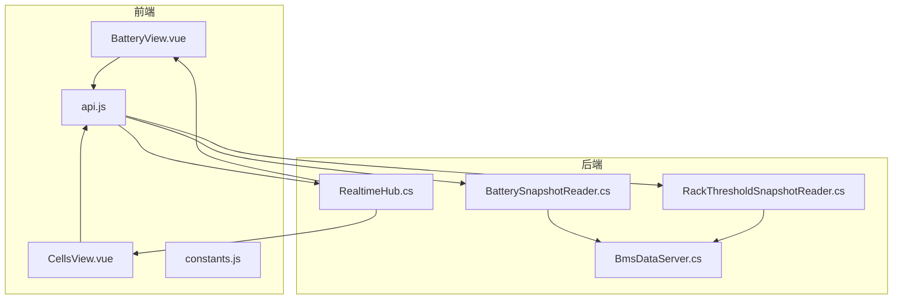
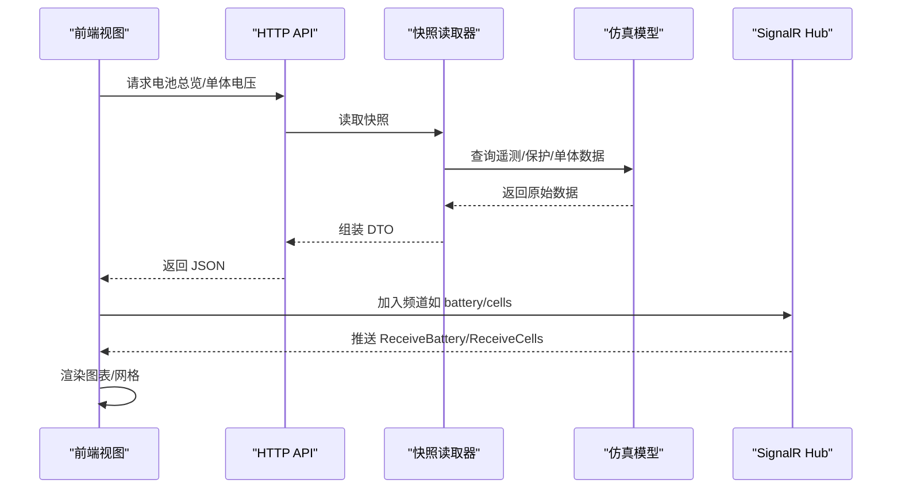
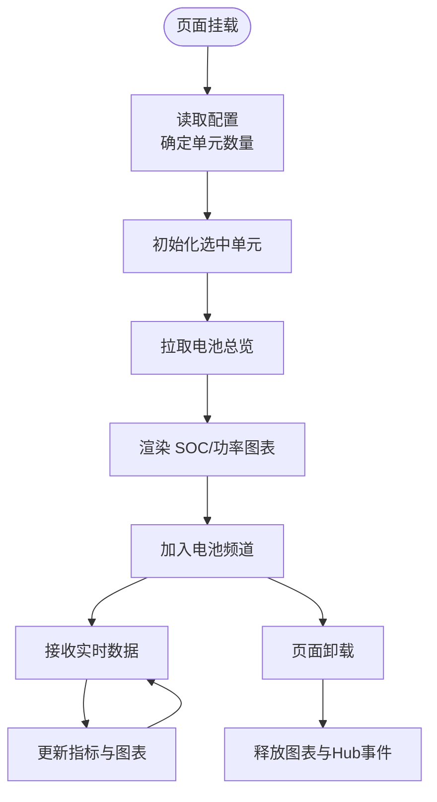
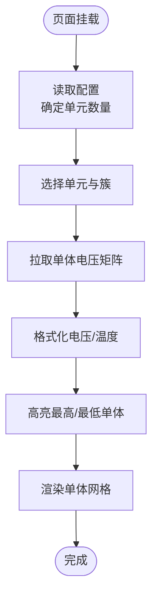
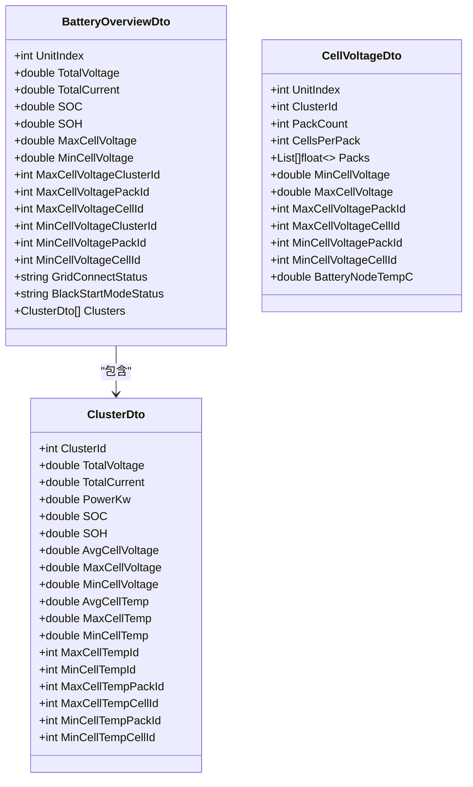
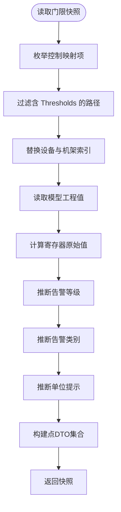
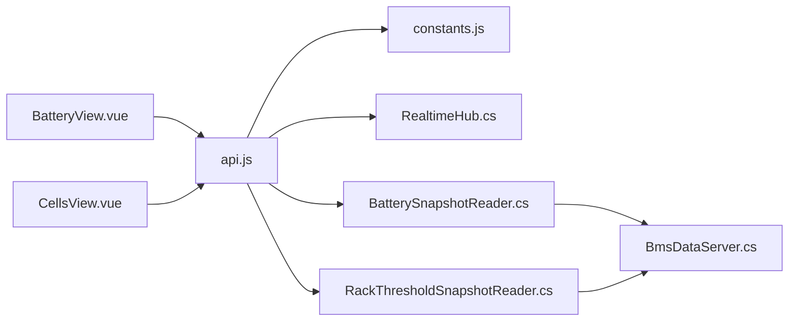

# 电池监控视图

<cite>
**本文引用的文件**
- [BatteryView.vue](file://Web/src/views/BatteryView.vue)
- [CellsView.vue](file://Web/src/views/CellsView.vue)
- [api.js](file://Web/src/services/api.js)
- [constants.js](file://Web/src/services/constants.js)
- [BatterySnapshotReader.cs](file://Web/BatterySnapshotReader.cs)
- [RackThresholdSnapshotReader.cs](file://Web/RackThresholdSnapshotReader.cs)
- [RealtimeHub.cs](file://Web/RealtimeHub.cs)
- [BmsDataServer.cs](file://EssSimModelApi/BmsDataServer.cs)
</cite>

## 目录
1. [简介](#简介)
2. [项目结构](#项目结构)
3. [核心组件](#核心组件)
4. [架构总览](#架构总览)
5. [详细组件分析](#详细组件分析)
6. [依赖关系分析](#依赖关系分析)
7. [性能考虑](#性能考虑)
8. [故障排查指南](#故障排查指南)
9. [结论](#结论)
10. [附录](#附录)

## 简介
本文件面向“电池监控视图”的端到端实现，覆盖以下目标：
- 电池堆状态的可视化展示：SOC、温度、电压等关键参数的实时监控。
- 电芯级别的监控：单体电压、温度分布与健康状态（SOH）分析。
- 电池簇与电池包的层次化数据结构：数据聚合与展示逻辑。
- 告警处理机制：阈值设置、告警分类与用户通知。
- 性能分析与历史数据查看：基于现有能力的说明与扩展建议。

该视图由前端 Vue 页面、后端快照读取器、实时推送通道以及 BMS 数据服务共同构成，形成从模型到界面的完整链路。

## 项目结构
围绕电池监控的前后端关键文件组织如下：
- 前端视图：
  - 舱级总览：BatteryView.vue 展示总压、总流、SOC/SOH、最高/最低单体位置、并离网与黑启动状态，并以图表呈现各簇 SOC 与功率分布。
  - 电芯明细：CellsView.vue 以网格形式展示单体电压，标注最高/最低单体位置，显示电池节点温度。
- 前端服务：
  - api.js 提供 HTTP 接口封装与 SignalR Hub 连接管理。
  - constants.js 定义实时频道与方法名常量。
- 后端快照：
  - BatterySnapshotReader.cs 负责从仿真模型中读取电池舱总览与单体电压矩阵。
  - RackThresholdSnapshotReader.cs 负责读取 BMS 告警门限元数据与当前工程值，用于告警配置与诊断。
- 实时通道：
  - RealtimeHub.cs 提供 SignalR 分组订阅能力与统一方法名常量。
- BMS 数据服务：
  - BmsDataServer.cs 周期性同步物理模型到 BMS 数据对象，支撑上层快照与告警。

**图示来源**
- [BatteryView.vue:1-133](file://Web/src/views/BatteryView.vue#L1-L133)
- [CellsView.vue:1-108](file://Web/src/views/CellsView.vue#L1-L108)
- [api.js:1-88](file://Web/src/services/api.js#L1-L88)
- [constants.js:1-18](file://Web/src/services/constants.js#L1-L18)
- [BatterySnapshotReader.cs:1-204](file://Web/BatterySnapshotReader.cs#L1-L204)
- [RackThresholdSnapshotReader.cs:1-209](file://Web/RackThresholdSnapshotReader.cs#L1-L209)
- [RealtimeHub.cs:1-59](file://Web/RealtimeHub.cs#L1-L59)
- [BmsDataServer.cs:1-110](file://EssSimModelApi/BmsDataServer.cs#L1-L110)

**章节来源**
- [BatteryView.vue:1-133](file://Web/src/views/BatteryView.vue#L1-L133)
- [CellsView.vue:1-108](file://Web/src/views/CellsView.vue#L1-L108)
- [api.js:1-88](file://Web/src/services/api.js#L1-L88)
- [constants.js:1-18](file://Web/src/services/constants.js#L1-L18)
- [BatterySnapshotReader.cs:1-204](file://Web/BatterySnapshotReader.cs#L1-L204)
- [RackThresholdSnapshotReader.cs:1-209](file://Web/RackThresholdSnapshotReader.cs#L1-L209)
- [RealtimeHub.cs:1-59](file://Web/RealtimeHub.cs#L1-L59)
- [BmsDataServer.cs:1-110](file://EssSimModelApi/BmsDataServer.cs#L1-L110)

## 核心组件
- 电池舱总览视图（BatteryView.vue）
  - 展示单元选择、总压/总流/SOC/SOH、最高/最低单体定位、并离网与黑启动模式。
  - 使用 ECharts 绘制各簇 SOC 柱状图与功率折线图。
  - 通过 SignalR 订阅电池频道，接收实时数据更新。
- 电芯明细视图（CellsView.vue）
  - 按包与单体维度展示电压矩阵，高亮最高/最低单体位置。
  - 显示电池节点温度标签，辅助判断热状态。
- 快照读取器（BatterySnapshotReader.cs）
  - 读取电池舱总览与单体电压矩阵，计算簇级功率、平均/极值单体电压与温度，并解析最高/最低单体的包与单体编号。
- 告警门限快照（RackThresholdSnapshotReader.cs）
  - 读取 BMS 告警门限点表元数据与当前工程值，自动推断告警等级、类别与单位提示，支持恢复型告警识别。
- 实时通道（RealtimeHub.cs）
  - 提供 JoinChannel/LeaveChannel 分组订阅，统一方法名常量，便于前后端一致通信。
- BMS 数据服务（BmsDataServer.cs）
  - 周期性将物理模型遥测与保护状态同步至 BMS 数据对象，为快照与告警提供数据源。

**章节来源**
- [BatteryView.vue:1-133](file://Web/src/views/BatteryView.vue#L1-L133)
- [CellsView.vue:1-108](file://Web/src/views/CellsView.vue#L1-L108)
- [BatterySnapshotReader.cs:1-204](file://Web/BatterySnapshotReader.cs#L1-L204)
- [RackThresholdSnapshotReader.cs:1-209](file://Web/RackThresholdSnapshotReader.cs#L1-L209)
- [RealtimeHub.cs:1-59](file://Web/RealtimeHub.cs#L1-L59)
- [BmsDataServer.cs:1-110](file://EssSimModelApi/BmsDataServer.cs#L1-L110)

## 架构总览
电池监控视图的数据流分为“拉取快照”和“实时推送”两条路径：
- 拉取快照：前端调用 API 获取电池舱总览或单体电压矩阵，后端通过快照读取器从仿真模型中提取数据并返回。
- 实时推送：前端通过 SignalR 加入指定频道，后端在合适时机推送电池数据，前端实时更新界面。

**图示来源**
- [api.js:14-24](file://Web/src/services/api.js#L14-L24)
- [BatterySnapshotReader.cs:71-201](file://Web/BatterySnapshotReader.cs#L71-L201)
- [RealtimeHub.cs:10-46](file://Web/RealtimeHub.cs#L10-L46)
- [BatteryView.vue:45-133](file://Web/src/views/BatteryView.vue#L45-L133)
- [CellsView.vue:44-84](file://Web/src/views/CellsView.vue#L44-L84)

## 详细组件分析

### 电池舱总览视图（BatteryView.vue）
- 功能要点
  - 单元选择：根据配置动态计算可用单元数，切换时重新加载数据并加入对应频道。
  - 指标展示：总压、总流、SOC、SOH、最高/最低单体及其定位信息、并离网与黑启动模式。
  - 图表渲染：ECharts 绘制各簇 SOC 柱状图与功率折线图，双 Y 轴分别表示百分比与功率。
  - 实时刷新：通过 SignalR 订阅 ReceiveBattery，仅对当前单元数据进行增量更新。
- 数据绑定与交互
  - 初始化时读取配置确定单元数量，默认选中第一个单元。
  - watch 监听单元变化，离开旧频道并加入新频道，再触发一次全量加载。
  - 卸载时释放图表实例与 Hub 事件，避免内存泄漏。

**图示来源**
- [BatteryView.vue:45-133](file://Web/src/views/BatteryView.vue#L45-L133)

**章节来源**
- [BatteryView.vue:1-133](file://Web/src/views/BatteryView.vue#L1-L133)
- [api.js:14-24](file://Web/src/services/api.js#L14-L24)
- [constants.js:1-18](file://Web/src/services/constants.js#L1-L18)

### 电芯明细视图（CellsView.vue）
- 功能要点
  - 单元与簇选择：支持选择具体单元与簇，点击刷新按钮重新拉取数据。
  - 单体电压网格：按包与单体维度展示电压，空值显示占位符，正常/最高/最低单体以不同样式区分。
  - 温度标签：显示电池节点温度，辅助判断热状态。
- 数据处理
  - 格式化电压与温度，非正数视为无效。
  - 根据最高/最低单体索引计算包与单体位置，应用样式类。

**图示来源**
- [CellsView.vue:44-84](file://Web/src/views/CellsView.vue#L44-L84)

**章节来源**
- [CellsView.vue:1-108](file://Web/src/views/CellsView.vue#L1-L108)
- [api.js:14-24](file://Web/src/services/api.js#L14-L24)

### 快照读取器（BatterySnapshotReader.cs）
- 电池舱总览读取
  - 路径构造：bms{unit}.BatteryStacks[0] 作为根路径。
  - 指标提取：总压、总流、SOC/SOH、最高/最低单体电压及定位信息。
  - 簇级聚合：遍历簇列表，读取测量值（电流、电压、SOC/SOH、平均/极值单体电压与温度），计算功率（V×A/1000）。
  - 温度定位：根据 Max/Min CellTempId 换算包与单体编号。
- 单体电压矩阵读取
  - 固定结构：4 包 × 104 节（可通过 PackCount 优化）。
  - 逐单体读取：通过集群内单体电压数组获取每节电压，异常时置零。
  - 温度节点：从 ess._bmsRackDevices 读取电池节点温度，用于热状态评估。

**图示来源**
- [BatterySnapshotReader.cs:6-67](file://Web/BatterySnapshotReader.cs#L6-L67)

**章节来源**
- [BatterySnapshotReader.cs:71-201](file://Web/BatterySnapshotReader.cs#L71-L201)

### 告警门限快照（RackThresholdSnapshotReader.cs）
- 功能要点
  - 点表元数据：参数名、地址、缩放比例、类型、描述、属性名、是否恢复型告警、类别、单位提示。
  - 工程值与原始值：从模型路径读取当前工程值，并按缩放比例计算寄存器原始值。
  - 告警等级检测：根据描述或属性名后缀推断一级/二级/三级告警。
  - 告警类别检测：基于关键词匹配（如过压、欠压、过流、温度、绝缘、压差等）。
  - 单位提示：根据类别与缩放比例给出单位或换算提示。
- 使用场景
  - 为阈值设置界面提供可编辑的元数据与当前值。
  - 为告警分类与统计提供结构化信息。

**图示来源**
- [RackThresholdSnapshotReader.cs:38-115](file://Web/RackThresholdSnapshotReader.cs#L38-L115)
- [RackThresholdSnapshotReader.cs:149-195](file://Web/RackThresholdSnapshotReader.cs#L149-L195)

**章节来源**
- [RackThresholdSnapshotReader.cs:1-209](file://Web/RackThresholdSnapshotReader.cs#L1-L209)

### 实时通道（RealtimeHub.cs）
- 功能要点
  - 分组订阅：JoinChannel/LeaveChannel 支持按频道（mainline/battery/cells/connections/alert/cmdprogress）订阅。
  - 方法名常量：Receive* 系列方法名集中管理，保证前后端一致性。
  - 初始推送：连接建立后推送系统告警快照，便于前端初始化。
- 使用方式
  - 前端在页面挂载时建立 Hub 连接，按需加入频道，并在卸载时移除事件与频道。

**章节来源**
- [RealtimeHub.cs:1-59](file://Web/RealtimeHub.cs#L1-L59)
- [constants.js:1-18](file://Web/src/services/constants.js#L1-L18)

### BMS 数据服务（BmsDataServer.cs）
- 功能要点
  - 周期同步：以 100 ms 周期将物理模型遥测与保护状态同步到 BMS 数据对象。
  - 空调控制：将 BMS 空调开关与设定温度写回热模型，影响电池节点温度。
  - 数据注册：为每个 BMS 设备生成样本数据并注册到宿主存储，供快照读取器访问。
- 与监控的关系
  - 为电池总览与单体电压提供稳定的数据源。
  - 为告警与保护状态提供基础数据。

**章节来源**
- [BmsDataServer.cs:1-110](file://EssSimModelApi/BmsDataServer.cs#L1-L110)

## 依赖关系分析
- 前端依赖
  - BatteryView.vue 依赖 api.js 的 getBattery/getConfig/getHub 与 constants.js 的频道与方法名。
  - CellsView.vue 依赖 api.js 的 getCells/getConfig。
- 后端依赖
  - BatterySnapshotReader.cs 依赖 GuiSimDataAccess 与 SimServer 访问仿真模型。
  - RackThresholdSnapshotReader.cs 依赖 ModbusSimServer 与 SimulatorHost 读取点表与模型值。
  - RealtimeHub.cs 提供 SignalR 分组能力，被前端订阅。
  - BmsDataServer.cs 为快照与告警提供数据源。

**图示来源**
- [BatteryView.vue:45-133](file://Web/src/views/BatteryView.vue#L45-L133)
- [CellsView.vue:44-84](file://Web/src/views/CellsView.vue#L44-L84)
- [api.js:14-88](file://Web/src/services/api.js#L14-L88)
- [constants.js:1-18](file://Web/src/services/constants.js#L1-L18)
- [BatterySnapshotReader.cs:71-201](file://Web/BatterySnapshotReader.cs#L71-L201)
- [RackThresholdSnapshotReader.cs:38-115](file://Web/RackThresholdSnapshotReader.cs#L38-L115)
- [RealtimeHub.cs:10-46](file://Web/RealtimeHub.cs#L10-L46)
- [BmsDataServer.cs:1-110](file://EssSimModelApi/BmsDataServer.cs#L1-L110)

**章节来源**
- [BatteryView.vue:45-133](file://Web/src/views/BatteryView.vue#L45-L133)
- [CellsView.vue:44-84](file://Web/src/views/CellsView.vue#L44-L84)
- [api.js:14-88](file://Web/src/services/api.js#L14-L88)
- [constants.js:1-18](file://Web/src/services/constants.js#L1-L18)
- [BatterySnapshotReader.cs:71-201](file://Web/BatterySnapshotReader.cs#L71-L201)
- [RackThresholdSnapshotReader.cs:38-115](file://Web/RackThresholdSnapshotReader.cs#L38-L115)
- [RealtimeHub.cs:10-46](file://Web/RealtimeHub.cs#L10-L46)
- [BmsDataServer.cs:1-110](file://EssSimModelApi/BmsDataServer.cs#L1-L110)

## 性能考虑
- 前端渲染
  - ECharts 图表仅在数据变更时更新，避免频繁重绘。
  - 单体网格采用条件样式类，减少 DOM 操作复杂度。
- 网络传输
  - 使用 SignalR 分组订阅，仅接收当前单元相关数据，降低带宽占用。
  - API 超时设置为 10 秒，避免长时间阻塞。
- 后端读取
  - 快照读取器批量读取簇与单体数据，尽量减少跨层调用次数。
  - 单体电压读取时对异常进行容错处理，避免单次失败影响整体。
- 建议优化
  - 对高频更新的单体网格可采用虚拟滚动或分页加载。
  - 对图表数据可进行降采样以减少渲染压力。
  - 对快照读取增加缓存策略，减少重复模型访问。

## 故障排查指南
- 前端常见问题
  - 无法获取配置：检查 getConfig 接口连通性与权限。
  - 实时数据未更新：确认已加入正确频道且 Hub 连接成功；检查浏览器控制台错误。
  - 图表不渲染：确保 chartEl 存在且数据非空；检查 ECharts 初始化与销毁逻辑。
- 后端常见问题
  - 快照为空：检查模型路径是否正确；确认 BmsDataServer 已启动并完成数据同步。
  - 告警门限缺失：检查点表映射是否包含 Thresholds 路径；确认设备与机架索引替换正确。
  - 单体电压读取失败：捕获异常并记录日志；验证集群内单体数组长度与索引范围。
- 定位步骤
  - 在前端打开开发者工具，观察 Network 与 Console 输出。
  - 在后端检查日志，确认快照读取与模型访问是否正常。
  - 逐步缩小问题范围：先验证 API 返回，再验证实时推送，最后检查渲染逻辑。

**章节来源**
- [BatteryView.vue:105-133](file://Web/src/views/BatteryView.vue#L105-L133)
- [CellsView.vue:73-84](file://Web/src/views/CellsView.vue#L73-L84)
- [api.js:6-12](file://Web/src/services/api.js#L6-L12)
- [BatterySnapshotReader.cs:181-198](file://Web/BatterySnapshotReader.cs#L181-L198)
- [RackThresholdSnapshotReader.cs:72-87](file://Web/RackThresholdSnapshotReader.cs#L72-L87)

## 结论
电池监控视图通过前后端协作实现了从模型到界面的完整数据链路：
- 舱级总览提供宏观指标与趋势图表，便于快速掌握电池堆运行状态。
- 电芯明细提供微观单体电压分布与温度信息，支持精细化诊断。
- 告警门限快照为阈值管理与告警分类提供结构化数据，提升运维效率。
- 实时推送与快照拉取相结合，兼顾即时性与可靠性。
建议在后续迭代中引入历史数据存储与回放能力，进一步完善性能分析与故障回溯。

## 附录
- 关键数据字段说明
  - 电池舱总览：总压、总流、SOC、SOH、最高/最低单体电压及定位、并离网与黑启动模式。
  - 簇级指标：总压、总流、功率、SOC、SOH、平均/极值单体电压与温度、温度定位。
  - 单体电压矩阵：按包与单体维度组织的电压数组，附带最高/最低单体定位与电池节点温度。
  - 告警门限：参数名、地址、缩放比例、类型、描述、属性名、等级、类别、单位提示、工程值与原始值。
- 扩展建议
  - 历史数据：增加时间序列存储与查询接口，支持趋势分析与对比。
  - 健康评估：结合 SOH 与温度分布，提供健康评分与退化趋势预测。
  - 告警联动：与控制系统联动，实现告警自动处置与恢复流程。