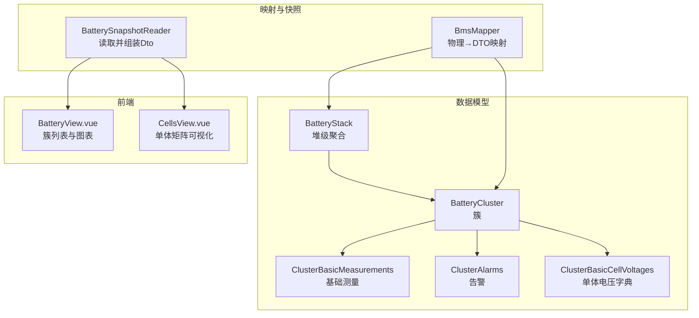
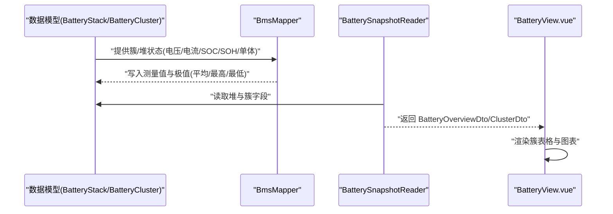
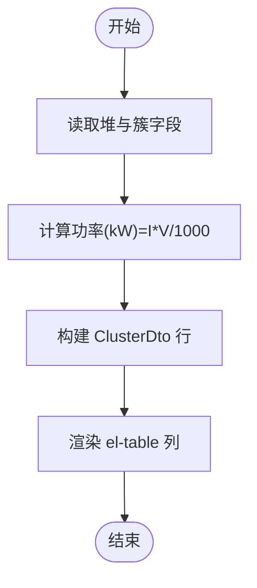
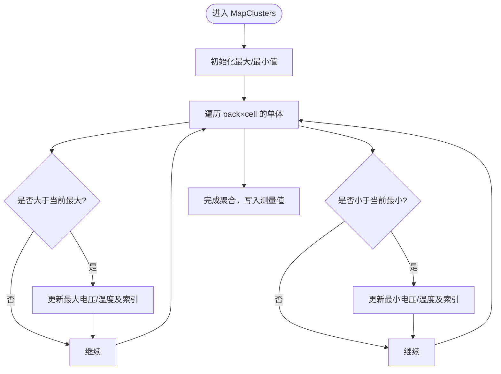
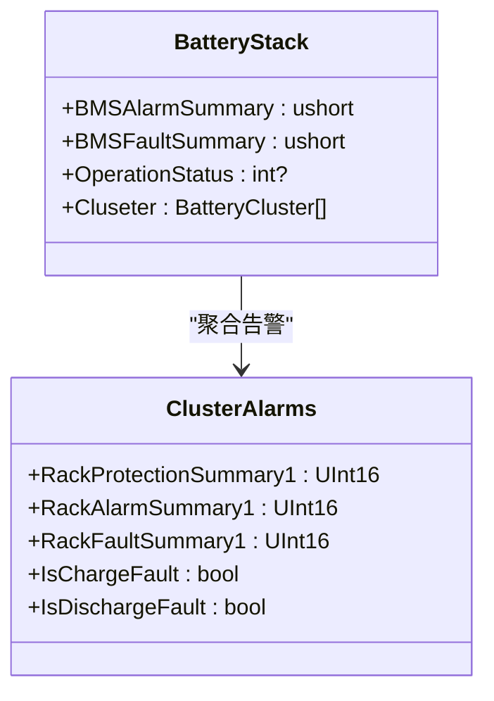
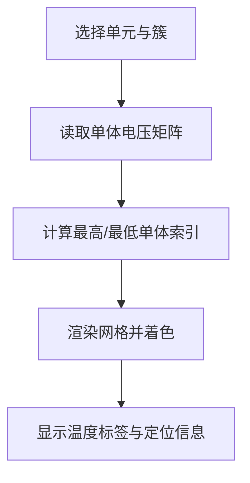
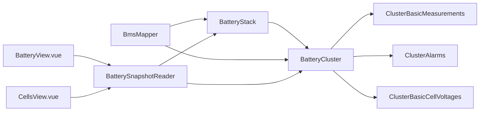

# 电池簇监控表格

<cite>
**本文引用的文件**
- [BatteryCluster.cs](file://EssSimModelApi/Bms/BatteryCluster.cs)
- [ClusterBasicMeasurements.cs](file://EssSimModelApi/Bms/ClusterBasicMeasurements.cs)
- [ClusterAlarms.cs](file://EssSimModelApi/Bms/ClusterAlarms.cs)
- [ClusterBasicCellVoltages.cs](file://EssSimModelApi/Bms/ClusterBasicCellVoltages.cs)
- [BatteryStack.cs](file://EssSimModelApi/Bms/BatteryStack.cs)
- [BmsMapper.cs](file://EssSimModelApi/Mappers/BmsMapper.cs)
- [BatterySnapshotReader.cs](file://Web/BatterySnapshotReader.cs)
- [BatteryView.vue](file://Web/src/views/BatteryView.vue)
- [CellsView.vue](file://Web/src/views/CellsView.vue)
- [BmsDataGenerator.cs](file://EssSimModelApi/BmsDataGenerator.cs)
</cite>

## 目录
1. [简介](#简介)
2. [项目结构](#项目结构)
3. [核心组件](#核心组件)
4. [架构总览](#架构总览)
5. [详细组件分析](#详细组件分析)
6. [依赖关系分析](#依赖关系分析)
7. [性能考虑](#性能考虑)
8. [故障排查指南](#故障排查指南)
9. [结论](#结论)
10. [附录](#附录)

## 简介
本文件面向“电池簇监控表格”的数据展示与计算逻辑，聚焦以下目标：
- 簇级别指标（簇ID、总电压、总电流、功率、SOC、SOH等）的表格化呈现。
- 单体电芯统计信息的聚合算法（平均电压、最高电压、最低电压）。
- 表格排序、筛选与分页的实现思路与优化策略。
- 簇状态变化的视觉反馈机制（异常标识与告警提示）。
- 表格性能优化策略（虚拟滚动、增量更新、按需拉取）。

## 项目结构
系统由后端数据模型、映射器、快照读取器与前端的电池视图组成：
- 数据模型层：定义簇、堆、测量值、告警、单体电压等数据结构。
- 映射层：将物理模型或仿真数据映射到 BMS 接口对象。
- 快照层：从运行时数据源读取并组装前端所需的 DTO。
- 前端层：Vue 组件渲染簇列表、单体矩阵与图表，并通过实时通道更新。

**图示来源**
- [BatteryCluster.cs:7-15](file://EssSimModelApi/Bms/BatteryCluster.cs#L7-L15)
- [ClusterBasicMeasurements.cs:7-103](file://EssSimModelApi/Bms/ClusterBasicMeasurements.cs#L7-L103)
- [ClusterAlarms.cs:7-451](file://EssSimModelApi/Bms/ClusterAlarms.cs#L7-L451)
- [ClusterBasicCellVoltages.cs:7-16](file://EssSimModelApi/Bms/ClusterBasicCellVoltages.cs#L7-L16)
- [BatteryStack.cs:7-355](file://EssSimModelApi/Bms/BatteryStack.cs#L7-L355)
- [BmsMapper.cs:11-232](file://EssSimModelApi/Mappers/BmsMapper.cs#L11-L232)
- [BatterySnapshotReader.cs:6-204](file://Web/BatterySnapshotReader.cs#L6-L204)
- [BatteryView.vue:23-36](file://Web/src/views/BatteryView.vue#L23-L36)
- [CellsView.vue:23-40](file://Web/src/views/CellsView.vue#L23-L40)

**章节来源**
- [BatteryCluster.cs:7-15](file://EssSimModelApi/Bms/BatteryCluster.cs#L7-L15)
- [ClusterBasicMeasurements.cs:7-103](file://EssSimModelApi/Bms/ClusterBasicMeasurements.cs#L7-L103)
- [ClusterAlarms.cs:7-451](file://EssSimModelApi/Bms/ClusterAlarms.cs#L7-L451)
- [ClusterBasicCellVoltages.cs:7-16](file://EssSimModelApi/Bms/ClusterBasicCellVoltages.cs#L7-L16)
- [BatteryStack.cs:7-355](file://EssSimModelApi/Bms/BatteryStack.cs#L7-L355)
- [BmsMapper.cs:11-232](file://EssSimModelApi/Mappers/BmsMapper.cs#L11-L232)
- [BatterySnapshotReader.cs:6-204](file://Web/BatterySnapshotReader.cs#L6-L204)
- [BatteryView.vue:23-36](file://Web/src/views/BatteryView.vue#L23-L36)
- [CellsView.vue:23-40](file://Web/src/views/CellsView.vue#L23-L40)

## 核心组件
- 簇数据模型：包含簇ID、基础测量值、告警、单体电压/温度集合与阈值。
- 堆级聚合：汇总各簇的极值、差值、限流能力与运行状态。
- 映射器：将物理/仿真模型的簇状态写入 DTO，并计算单体极值与平均值。
- 快照读取器：按单元与簇维度读取运行时数据，组装为前端 DTO。
- 前端视图：使用 Element Plus 表格展示簇指标，使用网格展示单体电压矩阵，并使用图表展示 SOC/功率分布。

**章节来源**
- [BatteryCluster.cs:7-15](file://EssSimModelApi/Bms/BatteryCluster.cs#L7-L15)
- [BatteryStack.cs:83-108](file://EssSimModelApi/Bms/BatteryStack.cs#L83-L108)
- [BmsMapper.cs:135-181](file://EssSimModelApi/Mappers/BmsMapper.cs#L135-L181)
- [BatterySnapshotReader.cs:71-150](file://Web/BatterySnapshotReader.cs#L71-L150)
- [BatteryView.vue:23-36](file://Web/src/views/BatteryView.vue#L23-L36)
- [CellsView.vue:23-40](file://Web/src/views/CellsView.vue#L23-L40)

## 架构总览
下图展示了从数据模型到前端展示的完整链路：映射器负责将物理/仿真数据填充到 BMS 接口对象；快照读取器从中提取所需字段并生成 DTO；前端通过 API/Hub 获取数据并渲染表格与图表。

**图示来源**
- [BmsMapper.cs:135-181](file://EssSimModelApi/Mappers/BmsMapper.cs#L135-L181)
- [BatterySnapshotReader.cs:71-150](file://Web/BatterySnapshotReader.cs#L71-L150)
- [BatteryView.vue:58-82](file://Web/src/views/BatteryView.vue#L58-L82)

## 详细组件分析

### 簇级别数据展示结构
- 表格列定义：簇ID、总电压(V)、总电流(A)、功率(kW)、SOC(%)、SOH(%)、平均单体(V)、单体最高(V)、单体最低(V)。
- 数据来源：快照读取器从堆与簇中读取对应字段，并计算功率(kW)=总电流×总电压/1000。
- 展示方式：Element Plus el-table 绑定 data.clusters，模板列以 row.xxx 取值并格式化显示。

**图示来源**
- [BatterySnapshotReader.cs:110-147](file://Web/BatterySnapshotReader.cs#L110-L147)
- [BatteryView.vue:25-35](file://Web/src/views/BatteryView.vue#L25-L35)

**章节来源**
- [BatterySnapshotReader.cs:110-147](file://Web/BatterySnapshotReader.cs#L110-L147)
- [BatteryView.vue:25-35](file://Web/src/views/BatteryView.vue#L25-L35)

### 单体电芯统计信息的计算逻辑
- 平均电压：簇内单体电压之和除以单体数量（416），或在堆级使用总电压/416近似。
- 最高/最低电压：遍历单体电压字典，比较得到最大值与最小值及其索引。
- 平均温度：簇内单体温度的均值；最高/最低温度同理。
- 实现位置：映射器在 MapClusters 中对单体电压/温度字典进行聚合，并写入簇测量值。

**图示来源**
- [BmsMapper.cs:146-180](file://EssSimModelApi/Mappers/BmsMapper.cs#L146-L180)

**章节来源**
- [BmsMapper.cs:146-180](file://EssSimModelApi/Mappers/BmsMapper.cs#L146-L180)
- [BatteryStack.cs:83-108](file://EssSimModelApi/Bms/BatteryStack.cs#L83-L108)

### 表格的排序、筛选与分页功能
- 排序：可基于 el-table 的 sortable 属性对数值列（如总电压、功率、SOC、SOH）进行升/降序排列。
- 筛选：可在表头添加过滤器，支持按范围或关键字过滤（例如 SOC 区间、告警标志）。
- 分页：当簇数量较大时，启用分页减少 DOM 节点；结合虚拟滚动进一步降低渲染压力。
- 建议：优先在前端实现排序与筛选，避免频繁请求后端；分页与虚拟滚动配合提升大数据量体验。

[本节为通用实现建议，不直接分析具体文件]

### 簇状态变化的视觉反馈机制
- 告警聚合：簇告警类提供保护/报警/故障位掩码汇总，堆级可聚合所有簇的状态。
- 运行状态：根据堆级告警与功率限制解析运行状态（正常/禁充/禁放/待机/停机）。
- 前端反馈：
  - 表格行背景色或图标：根据告警位或运行状态切换样式（如红色高亮异常簇）。
  - 标签/徽章：显示“充电故障/放电故障/绝缘故障/过压/欠压/温差”等关键告警。
  - 单体矩阵：CellsView 中以颜色区分最高/最低单体，空值用灰色占位。

**图示来源**
- [ClusterAlarms.cs:251-327](file://EssSimModelApi/Bms/ClusterAlarms.cs#L251-L327)
- [BatteryStack.cs:199-250](file://EssSimModelApi/Bms/BatteryStack.cs#L199-L250)
- [BmsMapper.cs:36-85](file://EssSimModelApi/Mappers/BmsMapper.cs#L36-L85)

**章节来源**
- [ClusterAlarms.cs:251-327](file://EssSimModelApi/Bms/ClusterAlarms.cs#L251-L327)
- [BatteryStack.cs:199-250](file://EssSimModelApi/Bms/BatteryStack.cs#L199-L250)
- [BmsMapper.cs:36-85](file://EssSimModelApi/Mappers/BmsMapper.cs#L36-L85)
- [CellsView.vue:63-71](file://Web/src/views/CellsView.vue#L63-L71)

### 单体矩阵可视化与定位
- 单体矩阵：按包分组展示单体电压，支持高亮最高/最低单体。
- 定位信息：通过扁平索引计算包号与单体序号，便于快速定位异常单体。
- 温度提示：顶部标签显示电池节点温度，辅助判断热管理状态。

**图示来源**
- [BatterySnapshotReader.cs:152-201](file://Web/BatterySnapshotReader.cs#L152-L201)
- [CellsView.vue:23-40](file://Web/src/views/CellsView.vue#L23-L40)
- [CellsView.vue:63-71](file://Web/src/views/CellsView.vue#L63-L71)

**章节来源**
- [BatterySnapshotReader.cs:152-201](file://Web/BatterySnapshotReader.cs#L152-L201)
- [CellsView.vue:23-40](file://Web/src/views/CellsView.vue#L23-L40)
- [CellsView.vue:63-71](file://Web/src/views/CellsView.vue#L63-L71)

## 依赖关系分析
- 数据模型依赖：BatteryCluster 组合 ClusterBasicMeasurements、ClusterAlarms、ClusterBasicCellVoltages。
- 映射依赖：BmsMapper 读取 RackState 并写入 BatteryStack 与 BatteryCluster 的测量值与极值。
- 快照依赖：BatterySnapshotReader 依赖 GuiSimDataAccess 与 SimServer 读取运行时变量，组装 DTO。
- 前端依赖：BatteryView 与 CellsView 依赖 API/Hub 获取数据并渲染。

**图示来源**
- [BatteryCluster.cs:7-15](file://EssSimModelApi/Bms/BatteryCluster.cs#L7-L15)
- [BatteryStack.cs:348-355](file://EssSimModelApi/Bms/BatteryStack.cs#L348-L355)
- [BmsMapper.cs:135-181](file://EssSimModelApi/Mappers/BmsMapper.cs#L135-L181)
- [BatterySnapshotReader.cs:71-150](file://Web/BatterySnapshotReader.cs#L71-L150)
- [BatteryView.vue:45-82](file://Web/src/views/BatteryView.vue#L45-L82)
- [CellsView.vue:44-75](file://Web/src/views/CellsView.vue#L44-L75)

**章节来源**
- [BatteryCluster.cs:7-15](file://EssSimModelApi/Bms/BatteryCluster.cs#L7-L15)
- [BatteryStack.cs:348-355](file://EssSimModelApi/Bms/BatteryStack.cs#L348-L355)
- [BmsMapper.cs:135-181](file://EssSimModelApi/Mappers/BmsMapper.cs#L135-L181)
- [BatterySnapshotReader.cs:71-150](file://Web/BatterySnapshotReader.cs#L71-L150)
- [BatteryView.vue:45-82](file://Web/src/views/BatteryView.vue#L45-L82)
- [CellsView.vue:44-75](file://Web/src/views/CellsView.vue#L44-L75)

## 性能考虑
- 虚拟滚动：对大列表（如单体矩阵或大量簇）启用虚拟滚动，仅渲染可视区域节点，显著降低内存与重绘开销。
- 增量更新：通过 Hub 实时推送变更，前端仅更新变化字段，避免全量刷新。
- 按需拉取：仅在切换单元/簇时请求数据，避免无谓的网络与解析成本。
- 计算优化：单体聚合在映射层一次性完成，前端只做展示；必要时缓存中间结果。
- 图表优化：ECharts 配置 tooltip 与 grid，避免过多系列与动画影响性能。

[本节为通用性能建议，不直接分析具体文件]

## 故障排查指南
- 数据为空或缺失：检查快照读取路径是否正确，确认运行时变量存在且可访问。
- 单体矩阵异常：核对 pack/cell 索引计算，确保扁平索引与二维布局一致。
- 告警不生效：验证 ClusterAlarms 的位掩码汇总与堆级聚合逻辑，确认保护评估已执行。
- 运行状态异常：检查 BmsMapper 的运行状态解析优先级（停机>待机>禁充/禁放>正常）。
- 前端渲染卡顿：启用虚拟滚动与增量更新，减少 DOM 节点与重绘次数。

**章节来源**
- [BatterySnapshotReader.cs:71-150](file://Web/BatterySnapshotReader.cs#L71-L150)
- [BatterySnapshotReader.cs:152-201](file://Web/BatterySnapshotReader.cs#L152-L201)
- [ClusterAlarms.cs:251-327](file://EssSimModelApi/Bms/ClusterAlarms.cs#L251-L327)
- [BmsMapper.cs:36-85](file://EssSimModelApi/Mappers/BmsMapper.cs#L36-L85)

## 结论
本方案通过清晰的数据模型与映射层，将簇与堆级指标标准化，并以表格与矩阵形式直观呈现。单体统计在映射层高效聚合，前端专注展示与交互。结合虚拟滚动与增量更新，可在大规模数据下保持流畅体验。告警与运行状态的聚合为异常识别提供了可靠依据，便于快速定位问题。

## 附录
- 示例数据生成：BmsDataGenerator 可用于构造样例数据，便于开发与测试。
- 参考实现：BatteryView 与 CellsView 展示了表格与矩阵的基本用法，可作为扩展功能的起点。

**章节来源**
- [BmsDataGenerator.cs:16-106](file://EssSimModelApi/BmsDataGenerator.cs#L16-L106)
- [BatteryView.vue:58-82](file://Web/src/views/BatteryView.vue#L58-L82)
- [CellsView.vue:73-84](file://Web/src/views/CellsView.vue#L73-L84)