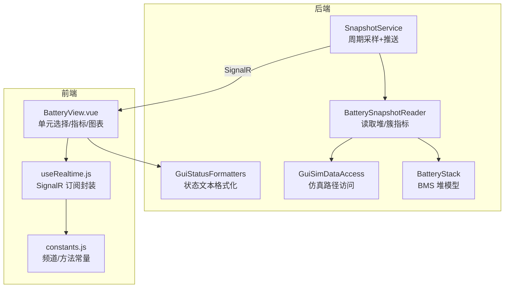
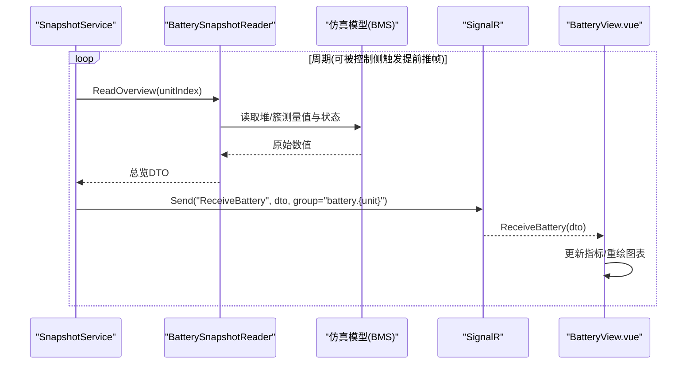
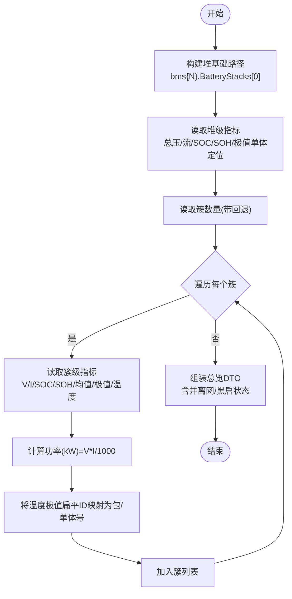
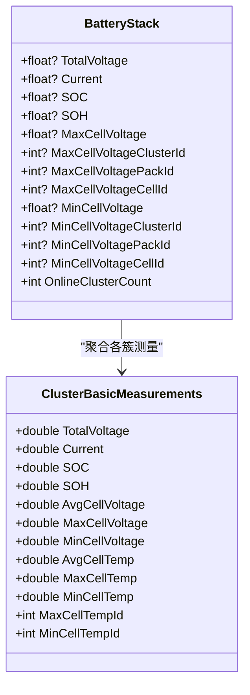
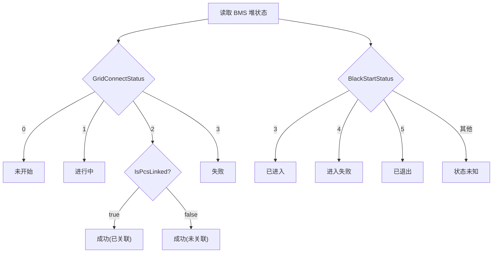
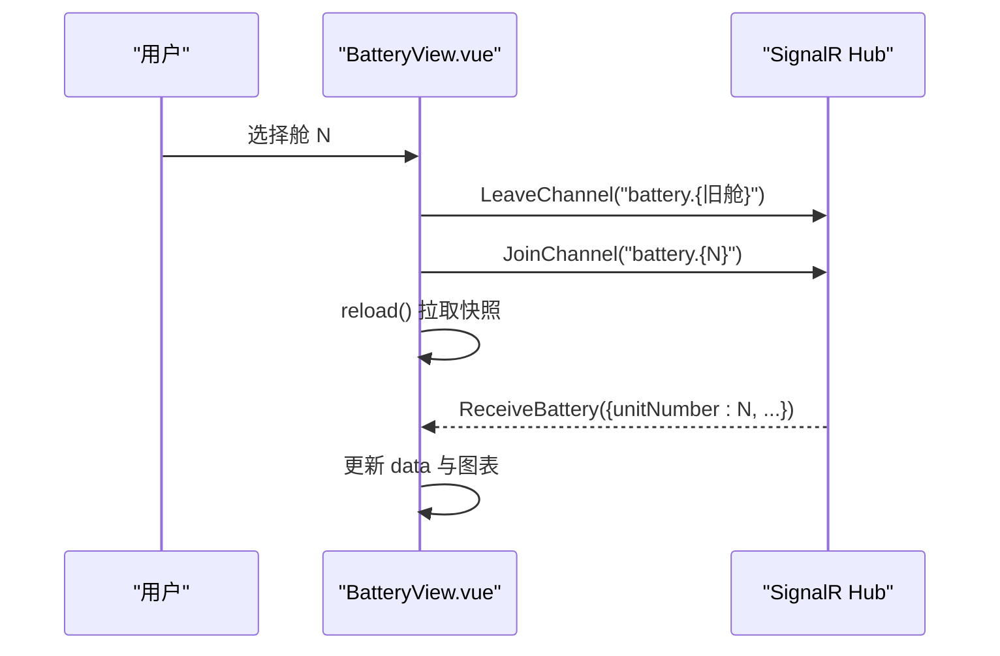
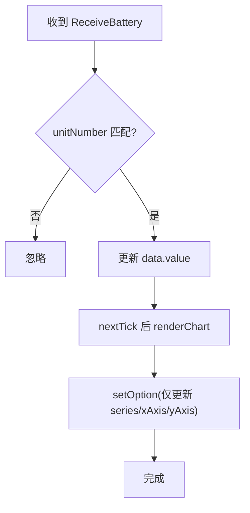
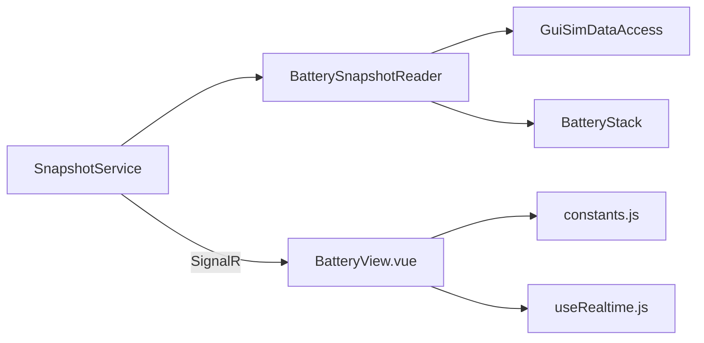

# 电池舱总览显示

<cite>
**本文引用的文件**
- [BatterySnapshotReader.cs](file://Web/BatterySnapshotReader.cs)
- [GuiStatusFormatters.cs](file://Display/GuiStatusFormatters.cs)
- [BatteryStack.cs](file://EssSimModelApi/Bms/BatteryStack.cs)
- [SnapshotService.cs](file://Web/SnapshotService.cs)
- [BatteryView.vue](file://Web/src/views/BatteryView.vue)
- [constants.js](file://Web/src/services/constants.js)
- [useRealtime.js](file://Web/src/services/useRealtime.js)
- [GuiSimDataAccess.cs](file://Display/GuiSimDataAccess.cs)
</cite>

## 目录
1. [简介](#简介)
2. [项目结构](#项目结构)
3. [核心组件](#核心组件)
4. [架构总览](#架构总览)
5. [详细组件分析](#详细组件分析)
6. [依赖关系分析](#依赖关系分析)
7. [性能考虑](#性能考虑)
8. [故障排查指南](#故障排查指南)
9. [结论](#结论)

## 简介
本文件面向“电池舱总览显示”功能，系统性说明后端如何从仿真模型中采集并聚合电池舱级指标（总电压、总电流、SOC、SOH、簇内最高/最低单体电芯及其位置），以及前端如何通过单元选择器切换舱位、订阅实时数据并渲染图表。同时解释并离网状态与黑启动模式的显示逻辑，给出图表配置与性能优化建议。

## 项目结构
该功能横跨后端快照服务、BMS 数据读取、状态格式化与前端视图：
- 后端
  - SnapshotService：周期采样并通过 SignalR 推送各舱的电池总览数据。
  - BatterySnapshotReader：按路径读取 BMS 堆与簇的测量值，组装 DTO。
  - GuiStatusFormatters：将并离网状态、黑启动模式等转换为可读文本。
  - GuiSimDataAccess：安全访问仿真对象路径，提供默认回退。
- 前端
  - BatteryView.vue：单元选择器、指标卡片、簇列表与 ECharts 图表；通过 SignalR 订阅实时数据。
  - constants.js / useRealtime.js：频道与方法常量与通用订阅封装。

**图示来源**
- [SnapshotService.cs:103-123](file://Web/SnapshotService.cs#L103-L123)
- [BatterySnapshotReader.cs:71-149](file://Web/BatterySnapshotReader.cs#L71-L149)
- [GuiStatusFormatters.cs:244-272](file://Display/GuiStatusFormatters.cs#L244-L272)
- [GuiSimDataAccess.cs:52-67](file://Display/GuiSimDataAccess.cs#L52-L67)
- [BatteryStack.cs:43-119](file://EssSimModelApi/Bms/BatteryStack.cs#L43-L119)
- [BatteryView.vue:45-132](file://Web/src/views/BatteryView.vue#L45-L132)
- [constants.js:1-17](file://Web/src/services/constants.js#L1-L17)
- [useRealtime.js:1-36](file://Web/src/services/useRealtime.js#L1-L36)

**章节来源**
- [SnapshotService.cs:103-123](file://Web/SnapshotService.cs#L103-L123)
- [BatterySnapshotReader.cs:71-149](file://Web/BatterySnapshotReader.cs#L71-L149)
- [GuiStatusFormatters.cs:244-272](file://Display/GuiStatusFormatters.cs#L244-L272)
- [GuiSimDataAccess.cs:52-67](file://Display/GuiSimDataAccess.cs#L52-L67)
- [BatteryStack.cs:43-119](file://EssSimModelApi/Bms/BatteryStack.cs#L43-L119)
- [BatteryView.vue:45-132](file://Web/src/views/BatteryView.vue#L45-L132)
- [constants.js:1-17](file://Web/src/services/constants.js#L1-L17)
- [useRealtime.js:1-36](file://Web/src/services/useRealtime.js#L1-L36)

## 核心组件
- 电池舱总览 DTO
  - 包含舱号、总电压、总电流、SOC、SOH、簇内最高/最低单体电压及对应簇/包/单体定位，并离网状态与黑启动模式状态，以及簇列表。
- 簇信息 DTO
  - 包含簇级总电压、总电流、功率、SOC、SOH、平均/最高/最低单体电压与温度，以及最高/最低温度单体的扁平编号与包/单体定位。
- 单体电压快照 DTO
  - 用于簇级单体电压明细展示，含每包单体电压数组、最高/最低单体定位与电池节点温度。

**章节来源**
- [BatterySnapshotReader.cs:6-67](file://Web/BatterySnapshotReader.cs#L6-L67)

## 架构总览
后端以固定周期采样 BMS 堆与簇数据，组装为总览 DTO，通过 SignalR 按“电池频道 + 舱号组”推送给前端；前端在挂载时获取配置确定舱位数，订阅对应组，收到数据后更新指标与图表。

**图示来源**
- [SnapshotService.cs:46-77](file://Web/SnapshotService.cs#L46-L77)
- [SnapshotService.cs:103-123](file://Web/SnapshotService.cs#L103-L123)
- [BatterySnapshotReader.cs:71-149](file://Web/BatterySnapshotReader.cs#L71-L149)
- [BatteryView.vue:111-123](file://Web/src/views/BatteryView.vue#L111-L123)

**章节来源**
- [SnapshotService.cs:46-77](file://Web/SnapshotService.cs#L46-L77)
- [SnapshotService.cs:103-123](file://Web/SnapshotService.cs#L103-L123)
- [BatterySnapshotReader.cs:71-149](file://Web/BatterySnapshotReader.cs#L71-L149)
- [BatteryView.vue:111-123](file://Web/src/views/BatteryView.vue#L111-L123)

## 详细组件分析

### 电池舱总览数据采集与聚合
- 数据来源
  - 堆级：总电压、总电流、SOC、SOH、最大/最小单体电压及其簇/包/单体定位。
  - 簇级：每个簇的总电压、总电流、SOC、SOH、平均/最高/最低单体电压与温度，以及最高/最低温度单体的扁平编号。
- 聚合逻辑
  - 读取簇数量（失败回退默认值）。
  - 遍历簇，计算功率=电压×电流/1000。
  - 根据 cellsPerPack 将扁平编号换算为包号与单体序号。
- 异常处理
  - 所有路径读取使用安全访问方法，失败返回默认值或空集合，避免中断整体流程。

**图示来源**
- [BatterySnapshotReader.cs:71-149](file://Web/BatterySnapshotReader.cs#L71-L149)
- [GuiSimDataAccess.cs:52-67](file://Display/GuiSimDataAccess.cs#L52-L67)

**章节来源**
- [BatterySnapshotReader.cs:71-149](file://Web/BatterySnapshotReader.cs#L71-L149)
- [GuiSimDataAccess.cs:52-67](file://Display/GuiSimDataAccess.cs#L52-L67)

### 簇内最高和最低单体电芯追踪机制
- 位置定位
  - 堆级：最大/最小单体电压对应的簇ID、包ID、单体ID。
  - 簇级：最大/最小温度单体的扁平编号，再换算为包ID与单体ID。
- 数值更新逻辑
  - 每次采样周期由 SnapshotService 触发，BatterySnapshotReader 重新读取最新值并刷新 DTO。
  - 若簇数量或 cellsPerPack 不可用，采用默认值保证界面可用。
- 关联模型
  - BatteryStack 暴露堆级极值单体字段与在线簇数（并网时为总簇数，离网时为 0）等属性，供上层聚合与展示。

**图示来源**
- [BatteryStack.cs:43-119](file://EssSimModelApi/Bms/BatteryStack.cs#L43-L119)
- [BatterySnapshotReader.cs:110-149](file://Web/BatterySnapshotReader.cs#L110-L149)

**章节来源**
- [BatteryStack.cs:43-119](file://EssSimModelApi/Bms/BatteryStack.cs#L43-L119)
- [BatterySnapshotReader.cs:110-149](file://Web/BatterySnapshotReader.cs#L110-L149)

### 并离网状态与黑启动模式显示逻辑
- 并离网状态
  - 基于 BMS 堆的 GridConnectStatus 与 IsPcsLinked 组合生成文案，区分“进行中/成功/失败”与是否已关联。
- 黑启动模式
  - 基于 BlackStartStatus 与 BlackStartEnterSuccess 生成“空闲/已进入/进入失败/已退出”等状态，并附带成功标志。
  - 对 PCS 侧黑启动开关状态，综合 EMU 设置、仿真当前态与运行模式（正常且离网）判断“开(运行中)/开(未生效)/关”。

**图示来源**
- [GuiStatusFormatters.cs:244-272](file://Display/GuiStatusFormatters.cs#L244-L272)
- [GuiStatusFormatters.cs:57-84](file://Display/GuiStatusFormatters.cs#L57-L84)

**章节来源**
- [GuiStatusFormatters.cs:244-272](file://Display/GuiStatusFormatters.cs#L244-L272)
- [GuiStatusFormatters.cs:57-84](file://Display/GuiStatusFormatters.cs#L57-L84)

### 单元选择器实现细节（多舱位切换与数据加载）
- 舱位数量
  - 前端通过配置接口获取 channelCount 或 unitCount*2，动态决定可选舱位数。
- 切换行为
  - 选择新舱位时，先离开旧组，再加入新组，然后拉取一次快照并渲染图表。
- 实时数据
  - 使用 SignalR 订阅 ReceiveBattery，仅当 unitNumber 匹配时才更新本地数据与图表。
- 资源管理
  - 组件卸载时销毁图表实例、取消订阅并离开频道组，避免内存泄漏与无效推送。

**图示来源**
- [BatteryView.vue:100-123](file://Web/src/views/BatteryView.vue#L100-L123)
- [constants.js:1-17](file://Web/src/services/constants.js#L1-L17)
- [useRealtime.js:1-36](file://Web/src/services/useRealtime.js#L1-L36)

**章节来源**
- [BatteryView.vue:100-123](file://Web/src/views/BatteryView.vue#L100-L123)
- [constants.js:1-17](file://Web/src/services/constants.js#L1-L17)
- [useRealtime.js:1-36](file://Web/src/services/useRealtime.js#L1-L36)

### 图表渲染配置与性能优化策略
- 图表配置
  - 双轴：左轴 SOC(%) 范围 0-100，右轴 功率(kW)。
  - X 轴为簇标签，系列包括柱状 SOC 与折线功率。
  - tooltip 触发 axis，grid 留出边距。
- 性能优化
  - 仅在数据变化时调用 setOption，避免重复初始化。
  - 组件卸载时 dispose 图表实例，释放 GPU/CPU 资源。
  - 使用 SignalR 分组推送，仅订阅当前舱位，减少无关消息。
  - 后端周期采样间隔可调（默认 200ms，下限 50ms），控制侧变更可立即推一帧，兼顾实时性与负载。

**图示来源**
- [BatteryView.vue:64-82](file://Web/src/views/BatteryView.vue#L64-L82)
- [BatteryView.vue:93-98](file://Web/src/views/BatteryView.vue#L93-L98)
- [SnapshotService.cs:55-77](file://Web/SnapshotService.cs#L55-L77)

**章节来源**
- [BatteryView.vue:64-82](file://Web/src/views/BatteryView.vue#L64-L82)
- [BatteryView.vue:93-98](file://Web/src/views/BatteryView.vue#L93-L98)
- [SnapshotService.cs:55-77](file://Web/SnapshotService.cs#L55-L77)

## 依赖关系分析
- 后端依赖
  - SnapshotService 依赖 BatterySnapshotReader 与 GuiSimDataAccess，最终读取仿真模型（BMS 堆/簇）。
  - 状态文本由 GuiStatusFormatters 统一格式化，确保前后端语义一致。
- 前端依赖
  - BatteryView.vue 依赖 SignalR 通道与方法常量，使用 useRealtime 进行订阅管理。
  - 图表库 ECharts 负责渲染，按需更新配置。

**图示来源**
- [SnapshotService.cs:103-123](file://Web/SnapshotService.cs#L103-L123)
- [BatterySnapshotReader.cs:71-149](file://Web/BatterySnapshotReader.cs#L71-L149)
- [GuiStatusFormatters.cs:244-272](file://Display/GuiStatusFormatters.cs#L244-L272)
- [BatteryView.vue:111-123](file://Web/src/views/BatteryView.vue#L111-L123)
- [constants.js:1-17](file://Web/src/services/constants.js#L1-L17)
- [useRealtime.js:1-36](file://Web/src/services/useRealtime.js#L1-L36)

**章节来源**
- [SnapshotService.cs:103-123](file://Web/SnapshotService.cs#L103-L123)
- [BatterySnapshotReader.cs:71-149](file://Web/BatterySnapshotReader.cs#L71-L149)
- [GuiStatusFormatters.cs:244-272](file://Display/GuiStatusFormatters.cs#L244-L272)
- [BatteryView.vue:111-123](file://Web/src/views/BatteryView.vue#L111-L123)
- [constants.js:1-17](file://Web/src/services/constants.js#L1-L17)
- [useRealtime.js:1-36](file://Web/src/services/useRealtime.js#L1-L36)

## 性能考虑
- 采样频率
  - 默认 200ms，可通过配置调整至 50-5000ms；控制侧变更后支持立即推一帧，提升交互响应。
- 数据量控制
  - 仅推送当前选中舱位的总览数据；单体电压明细需单独请求，避免全量广播。
- 前端渲染
  - 使用 setOption 增量更新，避免重建图表；组件卸载时及时释放资源。
- 健壮性
  - 所有仿真路径读取均带异常捕获与默认回退，单个舱失败不影响其他舱。

**章节来源**
- [SnapshotService.cs:55-77](file://Web/SnapshotService.cs#L55-L77)
- [SnapshotService.cs:113-123](file://Web/SnapshotService.cs#L113-L123)
- [BatterySnapshotReader.cs:71-149](file://Web/BatterySnapshotReader.cs#L71-L149)
- [BatteryView.vue:125-131](file://Web/src/views/BatteryView.vue#L125-L131)

## 故障排查指南
- 无数据或数据不更新
  - 检查 SignalR 连接与频道订阅是否正确；确认 unitNumber 与推送数据的 unitNumber 一致。
  - 查看后端日志中是否有采样失败或路径读取失败的记录。
- 单体定位异常
  - 确认 cellsPerPack 与扁平 ID 换算逻辑；检查簇数量与单体数组长度是否匹配。
- 并离网/黑启动状态不正确
  - 核对 BMS 堆的 GridConnectStatus、IsPcsLinked、BlackStartStatus、BlackStartEnterSuccess 字段。
  - 校验 PCS 侧黑启动开关与运行模式读取是否成功。

**章节来源**
- [SnapshotService.cs:60-70](file://Web/SnapshotService.cs#L60-L70)
- [BatterySnapshotReader.cs:152-201](file://Web/BatterySnapshotReader.cs#L152-L201)
- [GuiStatusFormatters.cs:244-272](file://Display/GuiStatusFormatters.cs#L244-L272)
- [GuiStatusFormatters.cs:57-84](file://Display/GuiStatusFormatters.cs#L57-L84)

## 结论
本方案通过后端周期采样与 SignalR 实时推送，结合前端单元选择器与图表渲染，实现了电池舱总览的多维指标展示。关键参数（总压/流、SOC/SOH、极值单体定位）与系统状态（并离网、黑启动）均具备清晰的来源与转换逻辑。通过合理的采样频率、增量更新与资源管理，系统在实时性与性能之间取得平衡，适用于大规模储能仿真的可视化监控场景。