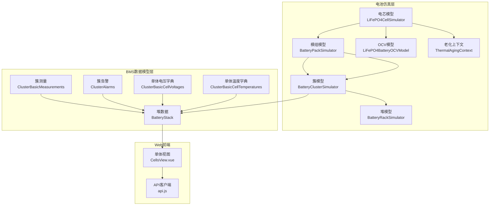
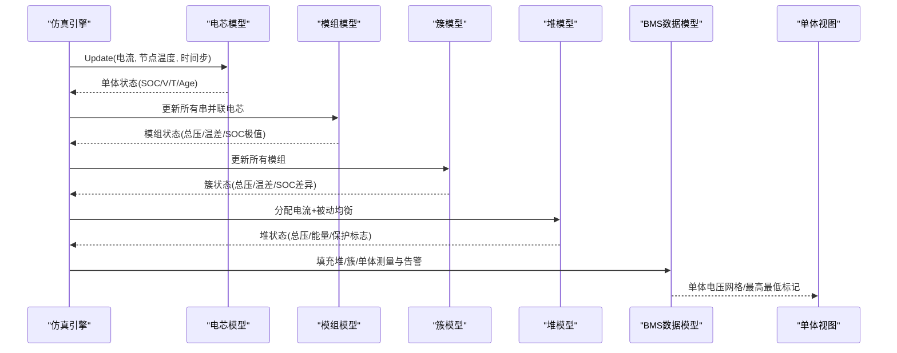
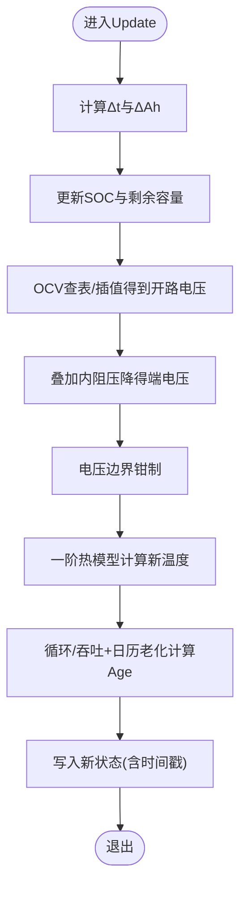
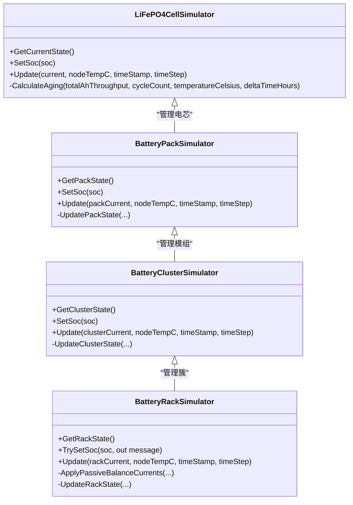
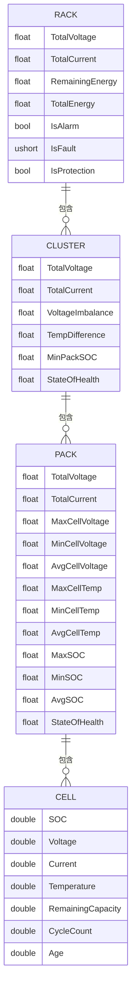
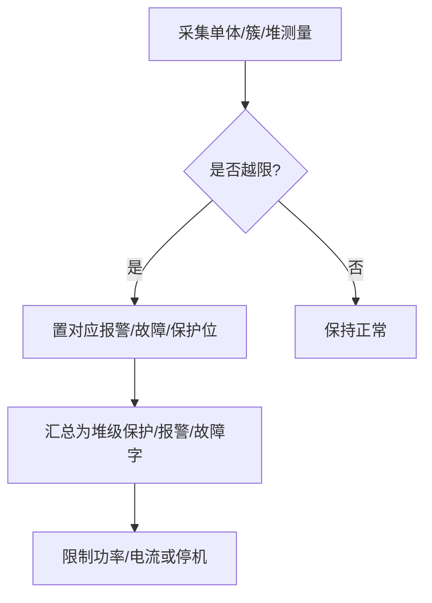
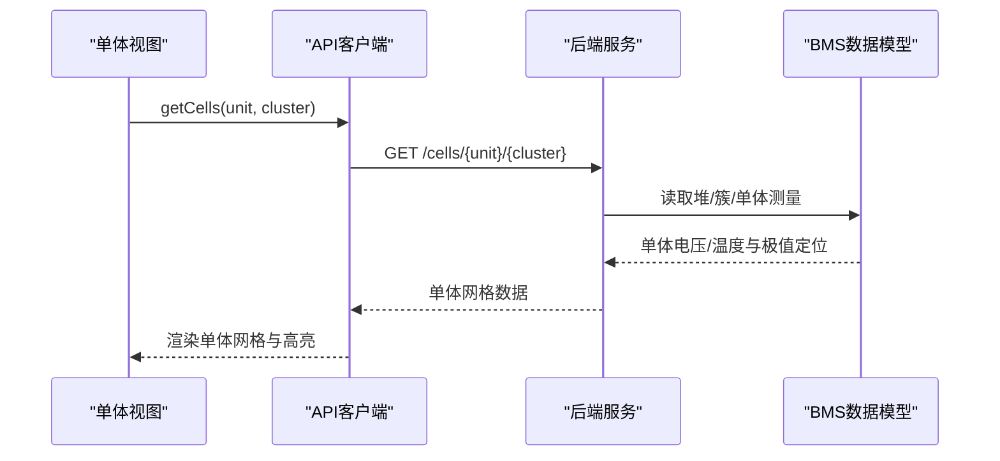
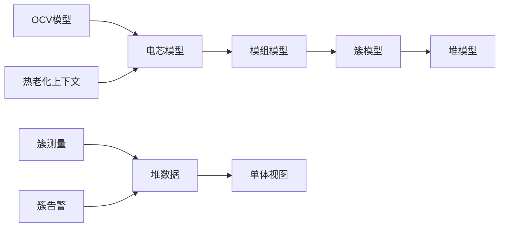

# 电芯级别监控

<cite>
**本文引用的文件**
- [batteryCellModel.cs](file://EssDeviceSimModel/Battery/batteryCellModel.cs)
- [batteryPackModel.cs](file://EssDeviceSimModel/Battery/batteryPackModel.cs)
- [batteryClusterModel.cs](file://EssDeviceSimModel/Battery/batteryClusterModel.cs)
- [batteryHeapModel.cs](file://EssDeviceSimModel/Battery/batteryHeapModel.cs)
- [OCVModel.cs](file://EssDeviceSimModel/Battery/OCVModel.cs)
- [ThermalAgingContext.cs](file://EssDeviceSimModel/Thermal/ThermalAgingContext.cs)
- [BatteryStack.cs](file://EssSimModelApi/Bms/BatteryStack.cs)
- [ClusterBasicMeasurements.cs](file://EssSimModelApi/Bms/ClusterBasicMeasurements.cs)
- [ClusterAlarms.cs](file://EssSimModelApi/Bms/ClusterAlarms.cs)
- [ClusterBasicCellVoltages.cs](file://EssSimModelApi/Bms/ClusterBasicCellVoltages.cs)
- [ClusterBasicCellTemperatures.cs](file://EssSimModelApi/Bms/ClusterBasicCellTemperatures.cs)
- [CellsView.vue](file://Web/src/views/CellsView.vue)
- [api.js](file://Web/src/services/api.js)
</cite>

## 目录
1. [简介](#简介)
2. [项目结构](#项目结构)
3. [核心组件](#核心组件)
4. [架构总览](#架构总览)
5. [详细组件分析](#详细组件分析)
6. [依赖关系分析](#依赖关系分析)
7. [性能考虑](#性能考虑)
8. [故障排查指南](#故障排查指南)
9. [结论](#结论)
10. [附录](#附录)

## 简介
本文件面向“电芯级别监控”能力，系统性说明单体电芯的详细信息展示、健康状态分析算法、层次化数据结构（从电池堆到电芯）、异常检测机制以及历史数据查看与分析。文档基于代码库中的电池仿真模型、BMS数据模型与前端展示进行梳理，帮助读者理解从底层电芯到上层可视化的完整链路。

## 项目结构
围绕电芯监控的关键模块分布如下：
- 电池仿真层：提供电芯、模组、簇、堆的层级仿真与状态聚合，包含热管理与老化模型。
- BMS数据模型层：定义堆、簇、单体电压/温度等测量与告警数据结构，支撑对外API与可视化。
- Web前端：提供单体电压网格视图、配置获取、实时数据刷新等交互能力。

**图表来源**
- [batteryCellModel.cs:35-177](file://EssDeviceSimModel/Battery/batteryCellModel.cs#L35-L177)
- [batteryPackModel.cs:44-203](file://EssDeviceSimModel/Battery/batteryPackModel.cs#L44-L203)
- [batteryClusterModel.cs:42-153](file://EssDeviceSimModel/Battery/batteryClusterModel.cs#L42-L153)
- [batteryHeapModel.cs:89-309](file://EssDeviceSimModel/Battery/batteryHeapModel.cs#L89-L309)
- [OCVModel.cs:9-189](file://EssDeviceSimModel/Battery/OCVModel.cs#L9-L189)
- [ThermalAgingContext.cs:5-38](file://EssDeviceSimModel/Thermal/ThermalAgingContext.cs#L5-L38)
- [BatteryStack.cs:7-355](file://EssSimModelApi/Bms/BatteryStack.cs#L7-L355)
- [ClusterBasicMeasurements.cs:7-103](file://EssSimModelApi/Bms/ClusterBasicMeasurements.cs#L7-L103)
- [ClusterAlarms.cs:7-451](file://EssSimModelApi/Bms/ClusterAlarms.cs#L7-L451)
- [ClusterBasicCellVoltages.cs:7-16](file://EssSimModelApi/Bms/ClusterBasicCellVoltages.cs#L7-L16)
- [ClusterBasicCellTemperatures.cs:7-17](file://EssSimModelApi/Bms/ClusterBasicCellTemperatures.cs#L7-L17)
- [CellsView.vue:1-108](file://Web/src/views/CellsView.vue#L1-L108)
- [api.js:14-31](file://Web/src/services/api.js#L14-L31)

**章节来源**
- [batteryCellModel.cs:35-177](file://EssDeviceSimModel/Battery/batteryCellModel.cs#L35-L177)
- [batteryPackModel.cs:44-203](file://EssDeviceSimModel/Battery/batteryPackModel.cs#L44-L203)
- [batteryClusterModel.cs:42-153](file://EssDeviceSimModel/Battery/batteryClusterModel.cs#L42-L153)
- [batteryHeapModel.cs:89-309](file://EssDeviceSimModel/Battery/batteryHeapModel.cs#L89-L309)
- [OCVModel.cs:9-189](file://EssDeviceSimModel/Battery/OCVModel.cs#L9-L189)
- [ThermalAgingContext.cs:5-38](file://EssDeviceSimModel/Thermal/ThermalAgingContext.cs#L5-L38)
- [BatteryStack.cs:7-355](file://EssSimModelApi/Bms/BatteryStack.cs#L7-L355)
- [ClusterBasicMeasurements.cs:7-103](file://EssSimModelApi/Bms/ClusterBasicMeasurements.cs#L7-L103)
- [ClusterAlarms.cs:7-451](file://EssSimModelApi/Bms/ClusterAlarms.cs#L7-L451)
- [ClusterBasicCellVoltages.cs:7-16](file://EssSimModelApi/Bms/ClusterBasicCellVoltages.cs#L7-L16)
- [ClusterBasicCellTemperatures.cs:7-17](file://EssSimModelApi/Bms/ClusterBasicCellTemperatures.cs#L7-L17)
- [CellsView.vue:1-108](file://Web/src/views/CellsView.vue#L1-L108)
- [api.js:14-31](file://Web/src/services/api.js#L14-L31)

## 核心组件
- 电芯仿真器：维护单体SOC、电压、电流、温度、剩余容量、循环次数、老化程度等动态状态；支持按时间步更新，结合OCV曲线与内阻计算端电压，并引入一阶热模型与日历老化。
- 模组仿真器：将电芯组织为串并联结构，计算模组总压、单体温差、SOC极值、健康度与剩余容量，并在串方向做温度扩散平滑。
- 簇仿真器：串联多个模组，汇总簇级电压、电流、温差、SOC差异与健康度，支持簇级平衡控制接口预留。
- 堆仿真器：并联多个簇，按内阻分配电流，执行堆内被动均衡（高SOC簇泄放），累计充放电能量，输出堆级统计与保护/故障标志。
- BMS数据模型：堆、簇、单体电压/温度测量与告警位域，支持最大/最小单体定位、功率限制、绝缘监测等。
- 前端单体视图：以网格形式展示单体电压，标注最高/最低单体位置，支持单元与簇选择及刷新。

**章节来源**
- [batteryCellModel.cs:35-177](file://EssDeviceSimModel/Battery/batteryCellModel.cs#L35-L177)
- [batteryPackModel.cs:44-203](file://EssDeviceSimModel/Battery/batteryPackModel.cs#L44-L203)
- [batteryClusterModel.cs:42-153](file://EssDeviceSimModel/Battery/batteryClusterModel.cs#L42-L153)
- [batteryHeapModel.cs:89-309](file://EssDeviceSimModel/Battery/batteryHeapModel.cs#L89-L309)
- [BatteryStack.cs:7-355](file://EssSimModelApi/Bms/BatteryStack.cs#L7-L355)
- [CellsView.vue:1-108](file://Web/src/views/CellsView.vue#L1-L108)

## 架构总览
下图展示了从电芯到堆的层级仿真与BMS数据映射关系，以及前端如何消费堆级单体信息。

**图表来源**
- [batteryCellModel.cs:90-177](file://EssDeviceSimModel/Battery/batteryCellModel.cs#L90-L177)
- [batteryPackModel.cs:100-155](file://EssDeviceSimModel/Battery/batteryPackModel.cs#L100-L155)
- [batteryClusterModel.cs:90-153](file://EssDeviceSimModel/Battery/batteryClusterModel.cs#L90-L153)
- [batteryHeapModel.cs:152-175](file://EssDeviceSimModel/Battery/batteryHeapModel.cs#L152-L175)
- [BatteryStack.cs:7-355](file://EssSimModelApi/Bms/BatteryStack.cs#L7-L355)
- [CellsView.vue:23-40](file://Web/src/views/CellsView.vue#L23-L40)

## 详细组件分析

### 单体电芯仿真与参数计算
- 关键参数：额定容量、额定电压、上下限电压、初始SOC、内阻、质量、体积。
- 动态状态：SOC、端电压、电流、温度、剩余容量、循环次数、老化程度、时间戳。
- 更新流程：依据时间步计算安时吞吐与SOC变化，通过OCV模型得到开路电压，叠加内阻压降得到端电压；采用一阶热模型计算温度演化；基于循环与吞吐量、温度加速日历老化计算老化程度。

**图表来源**
- [batteryCellModel.cs:90-177](file://EssDeviceSimModel/Battery/batteryCellModel.cs#L90-L177)
- [OCVModel.cs:43-61](file://EssDeviceSimModel/Battery/OCVModel.cs#L43-L61)
- [ThermalAgingContext.cs:27-35](file://EssDeviceSimModel/Thermal/ThermalAgingContext.cs#L27-L35)

**章节来源**
- [batteryCellModel.cs:9-33](file://EssDeviceSimModel/Battery/batteryCellModel.cs#L9-L33)
- [batteryCellModel.cs:90-177](file://EssDeviceSimModel/Battery/batteryCellModel.cs#L90-L177)
- [OCVModel.cs:43-61](file://EssDeviceSimModel/Battery/OCVModel.cs#L43-L61)
- [ThermalAgingContext.cs:5-38](file://EssDeviceSimModel/Thermal/ThermalAgingContext.cs#L5-L38)

### 一致性评估与老化判断
- 一致性评估：
  - 模组级：单体电压极差、温度极差、SOC极差反映内部一致性。
  - 簇级：模组间电压不平衡度、温差、SOC差异。
  - 堆级：簇间电流不平衡比例、SOC差异、电压差异。
- 老化判断：
  - 循环老化：基于累计充电/放电安时与循环计数。
  - 日历老化：基于Arrhenius因子与参考温度下的年老化率。
  - 综合老化：加权组合循环与日历老化，并限制在[0,1]区间。

**图表来源**
- [batteryCellModel.cs:35-177](file://EssDeviceSimModel/Battery/batteryCellModel.cs#L35-L177)
- [batteryPackModel.cs:44-203](file://EssDeviceSimModel/Battery/batteryPackModel.cs#L44-L203)
- [batteryClusterModel.cs:42-153](file://EssDeviceSimModel/Battery/batteryClusterModel.cs#L42-L153)
- [batteryHeapModel.cs:89-309](file://EssDeviceSimModel/Battery/batteryHeapModel.cs#L89-L309)

**章节来源**
- [batteryPackModel.cs:158-203](file://EssDeviceSimModel/Battery/batteryPackModel.cs#L158-L203)
- [batteryClusterModel.cs:108-153](file://EssDeviceSimModel/Battery/batteryClusterModel.cs#L108-L153)
- [batteryHeapModel.cs:247-309](file://EssDeviceSimModel/Battery/batteryHeapModel.cs#L247-L309)
- [batteryCellModel.cs:196-213](file://EssDeviceSimModel/Battery/batteryCellModel.cs#L196-L213)

### 层次化数据结构与映射（堆→簇→包→电芯）
- 堆（Rack）：并联簇集合，输出总压、总流、能量累计、保护/故障标志、被动均衡状态。
- 簇（Cluster）：串联模组集合，输出总压、总流、模组电压/温度/SOC极值、健康度。
- 包（Pack）：串并联电芯集合，输出总压、总流、单体电压/温度/SOC极值、健康度。
- 电芯（Cell）：单体SOC、电压、温度、内阻、老化等。

**图表来源**
- [batteryHeapModel.cs:10-45](file://EssDeviceSimModel/Battery/batteryHeapModel.cs#L10-L45)
- [batteryClusterModel.cs:19-40](file://EssDeviceSimModel/Battery/batteryClusterModel.cs#L19-L40)
- [batteryPackModel.cs:23-42](file://EssDeviceSimModel/Battery/batteryPackModel.cs#L23-L42)
- [batteryCellModel.cs:22-33](file://EssDeviceSimModel/Battery/batteryCellModel.cs#L22-L33)

**章节来源**
- [batteryHeapModel.cs:10-45](file://EssDeviceSimModel/Battery/batteryHeapModel.cs#L10-L45)
- [batteryClusterModel.cs:19-40](file://EssDeviceSimModel/Battery/batteryClusterModel.cs#L19-L40)
- [batteryPackModel.cs:23-42](file://EssDeviceSimModel/Battery/batteryPackModel.cs#L23-L42)
- [batteryCellModel.cs:22-33](file://EssDeviceSimModel/Battery/batteryCellModel.cs#L22-L33)

### 异常检测机制（过压、欠压、过温等）
- 单体层面：单体过压/欠压报警/故障/保护位；压差与温差报警/故障/保护位。
- 簇层面：簇过压/欠压、过流、绝缘、低SOC等；温度相关（端子高温、高压箱连接器高温、温升）。
- 堆层面：汇总各簇的保护/报警/故障位，形成堆级保护摘要；同时暴露充放电禁止标志。
- 触发条件：由BMS数据模型中的布尔位表示，具体阈值由外部配置或策略决定；系统可据此限制功率/电流。

**图表来源**
- [ClusterAlarms.cs:109-250](file://EssSimModelApi/Bms/ClusterAlarms.cs#L109-L250)
- [ClusterAlarms.cs:251-327](file://EssSimModelApi/Bms/ClusterAlarms.cs#L251-L327)
- [BatteryStack.cs:201-250](file://EssSimModelApi/Bms/BatteryStack.cs#L201-L250)

**章节来源**
- [ClusterAlarms.cs:109-250](file://EssSimModelApi/Bms/ClusterAlarms.cs#L109-L250)
- [ClusterAlarms.cs:251-327](file://EssSimModelApi/Bms/ClusterAlarms.cs#L251-L327)
- [BatteryStack.cs:201-250](file://EssSimModelApi/Bms/BatteryStack.cs#L201-L250)

### 单体电压/温度实时监控与可视化
- 数据源：堆级BMS数据包含单体电压/温度字典与极值定位（最大/最小单体所在簇、包、单体编号）。
- 前端展示：单体视图根据返回的 packs 数组渲染网格，用颜色区分最高/最低单体；支持单元与簇切换与刷新。
- 接口调用：通过 API 客户端获取单体数据与配置。

**图表来源**
- [CellsView.vue:23-40](file://Web/src/views/CellsView.vue#L23-L40)
- [api.js:17-17](file://Web/src/services/api.js#L17-L17)
- [BatteryStack.cs:84-107](file://EssSimModelApi/Bms/BatteryStack.cs#L84-L107)
- [ClusterBasicCellVoltages.cs:7-16](file://EssSimModelApi/Bms/ClusterBasicCellVoltages.cs#L7-L16)
- [ClusterBasicCellTemperatures.cs:7-17](file://EssSimModelApi/Bms/ClusterBasicCellTemperatures.cs#L7-L17)

**章节来源**
- [CellsView.vue:23-40](file://Web/src/views/CellsView.vue#L23-L40)
- [api.js:17-17](file://Web/src/services/api.js#L17-L17)
- [BatteryStack.cs:84-107](file://EssSimModelApi/Bms/BatteryStack.cs#L84-L107)
- [ClusterBasicCellVoltages.cs:7-16](file://EssSimModelApi/Bms/ClusterBasicCellVoltages.cs#L7-L16)
- [ClusterBasicCellTemperatures.cs:7-17](file://EssSimModelApi/Bms/ClusterBasicCellTemperatures.cs#L7-L17)

### 历史数据查看与分析（趋势与对比）
- 当前实现中，仿真层与BMS数据模型未内置历史时序存储；可通过外部记录堆/簇/单体快照（如定时采样）并持久化。
- 建议方案：
  - 在仿真步进或BMS数据生成处追加历史点（时间戳+关键指标）。
  - 提供查询接口按时间范围拉取，用于趋势分析与性能对比（如不同工况下的SOC轨迹、温度分布、SOH衰减）。
  - 前端增加折线图与对比面板，支持多簇/多堆对比。

[本节为概念性内容，不直接分析具体文件]

## 依赖关系分析
- 仿真层依赖：
  - 电芯模型依赖OCV模型与热老化上下文。
  - 模组/簇/堆模型逐级聚合下层状态，并实现一致性评估与均衡逻辑。
- BMS数据模型依赖：
  - 堆数据聚合簇测量与告警，导出单体极值定位与功率限制。
  - 簇测量基于SOC、温度、电压计算允许功率/电流。
- 前端依赖：
  - 单体视图依赖API客户端获取单体网格数据与配置。

**图表来源**
- [batteryCellModel.cs:35-177](file://EssDeviceSimModel/Battery/batteryCellModel.cs#L35-L177)
- [batteryPackModel.cs:44-203](file://EssDeviceSimModel/Battery/batteryPackModel.cs#L44-L203)
- [batteryClusterModel.cs:42-153](file://EssDeviceSimModel/Battery/batteryClusterModel.cs#L42-L153)
- [batteryHeapModel.cs:89-309](file://EssDeviceSimModel/Battery/batteryHeapModel.cs#L89-L309)
- [ClusterBasicMeasurements.cs:7-103](file://EssSimModelApi/Bms/ClusterBasicMeasurements.cs#L7-L103)
- [ClusterAlarms.cs:7-451](file://EssSimModelApi/Bms/ClusterAlarms.cs#L7-L451)
- [BatteryStack.cs:7-355](file://EssSimModelApi/Bms/BatteryStack.cs#L7-L355)
- [CellsView.vue:1-108](file://Web/src/views/CellsView.vue#L1-L108)

**章节来源**
- [batteryCellModel.cs:35-177](file://EssDeviceSimModel/Battery/batteryCellModel.cs#L35-L177)
- [batteryPackModel.cs:44-203](file://EssDeviceSimModel/Battery/batteryPackModel.cs#L44-L203)
- [batteryClusterModel.cs:42-153](file://EssDeviceSimModel/Battery/batteryClusterModel.cs#L42-L153)
- [batteryHeapModel.cs:89-309](file://EssDeviceSimModel/Battery/batteryHeapModel.cs#L89-L309)
- [ClusterBasicMeasurements.cs:7-103](file://EssSimModelApi/Bms/ClusterBasicMeasurements.cs#L7-L103)
- [ClusterAlarms.cs:7-451](file://EssSimModelApi/Bms/ClusterAlarms.cs#L7-L451)
- [BatteryStack.cs:7-355](file://EssSimModelApi/Bms/BatteryStack.cs#L7-L355)
- [CellsView.vue:1-108](file://Web/src/views/CellsView.vue#L1-L108)

## 性能考虑
- 仿真步进粒度：时间步长影响温度与老化计算的精度与性能；建议在保证精度的前提下增大步长以降低计算开销。
- 热模型复杂度：一阶热模型成本低且与步长解耦，适合大规模电芯仿真。
- 一致性评估：极值与平均计算为O(N)，在模组/簇/堆规模较大时需关注聚合开销。
- 被动均衡：仅在堆电流较小且SOC差超过阈值时启动，避免频繁动作造成额外能耗与计算。

[本节提供通用指导，不直接分析具体文件]

## 故障排查指南
- 单体电压异常：
  - 检查单体过压/欠压保护位与压差保护位；确认OCV曲线与内阻参数设置合理。
- 温度异常：
  - 检查单体温差保护位与端子/高压箱高温保护位；确认节点温度输入与散热系数配置。
- 功率/电流限制：
  - 查看簇测量中的最大允许充放电功率/电流，确认SOC与温度对限制因子的影响。
- 保护/故障汇总：
  - 核对堆级保护/报警/故障字与各簇汇总位，定位具体簇与单体。

**章节来源**
- [ClusterAlarms.cs:109-250](file://EssSimModelApi/Bms/ClusterAlarms.cs#L109-L250)
- [ClusterAlarms.cs:251-327](file://EssSimModelApi/Bms/ClusterAlarms.cs#L251-L327)
- [ClusterBasicMeasurements.cs:45-99](file://EssSimModelApi/Bms/ClusterBasicMeasurements.cs#L45-L99)
- [BatteryStack.cs:201-250](file://EssSimModelApi/Bms/BatteryStack.cs#L201-L250)

## 结论
该仿真系统提供了从电芯到堆的完整层级建模，支持单体级别的电压、温度、内阻等关键参数仿真与监控，具备一致性评估与老化判断能力，并通过BMS数据模型与前端视图实现单体信息的直观展示。异常检测覆盖过压、欠压、过温等常见故障，并可汇总至堆级保护位。历史数据分析需结合外部记录与查询接口扩展。

[本节为总结性内容，不直接分析具体文件]

## 附录
- 单体视图使用要点：
  - 选择单元与簇后点击刷新获取最新单体电压网格。
  - 高亮显示最高/最低单体位置，便于快速定位异常。
- 单体数据接口：
  - 通过API客户端调用单体数据接口，获取 packs 数组与极值定位信息。

**章节来源**
- [CellsView.vue:23-40](file://Web/src/views/CellsView.vue#L23-L40)
- [api.js:17-17](file://Web/src/services/api.js#L17-L17)