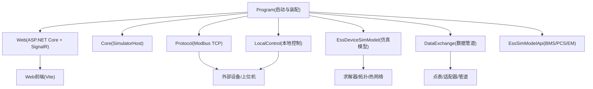
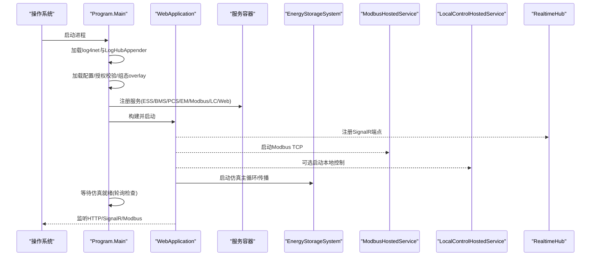
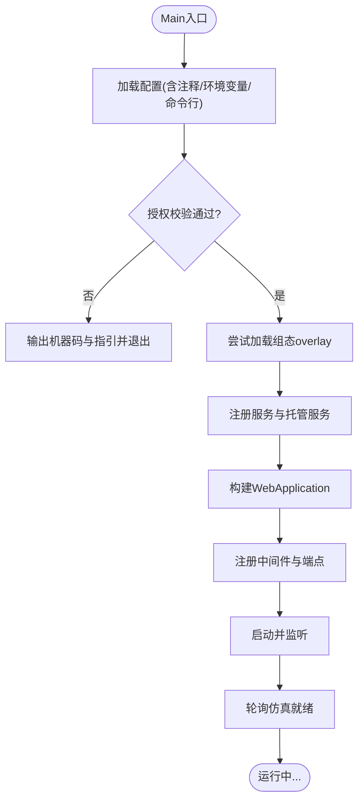
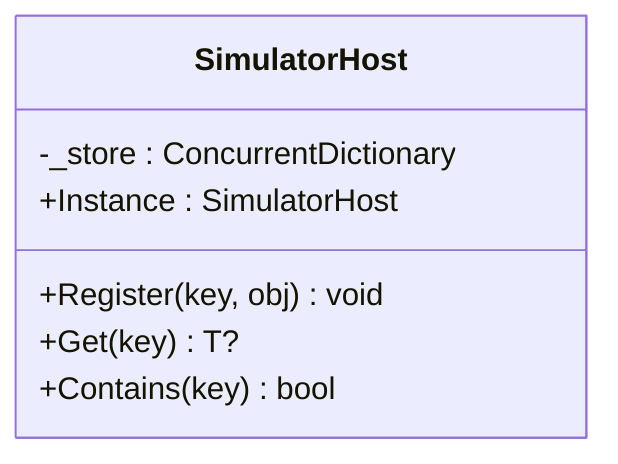
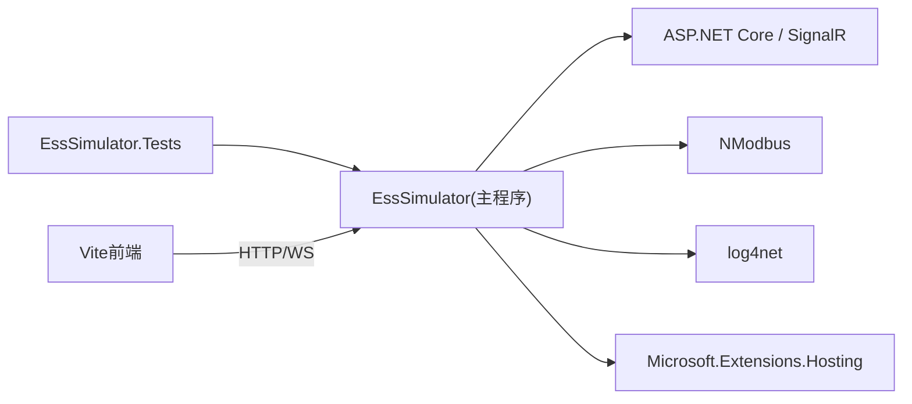

# 开发者指南

<cite>
**本文引用的文件**
- [Program.cs](file://Program.cs)
- [EssSimulator.csproj](file://EssSimulator.csproj)
- [appsettings.json](file://appsettings.json)
- [SimulatorConfig.cs](file://Configuration/SimulatorConfig.cs)
- [SimulatorHost.cs](file://Core/SimulatorHost.cs)
- [dev-up.sh](file://scripts/dev-up.sh)
- [项目编译说明.md](file://docs/项目编译说明.md)
- [商业发布脚本说明.md](file://scripts/commercial/README.md)
- [点位表说明.md](file://pointmaps/README.md)
- [EssSimulator.Tests.csproj](file://EssSimulator.Tests/EssSimulator.Tests.csproj)
</cite>

## 目录
1. [简介](#简介)
2. [项目结构](#项目结构)
3. [核心组件](#核心组件)
4. [架构总览](#架构总览)
5. [详细组件分析](#详细组件分析)
6. [依赖关系分析](#依赖关系分析)
7. [性能与优化建议](#性能与优化建议)
8. [故障排查指南](#故障排查指南)
9. [结论](#结论)
10. [附录：开发流程、规范与发布](#附录开发流程规范与发布)

## 简介
本指南面向新加入的开发者，提供从环境搭建到贡献、调试、性能优化与发布的完整路径。项目基于 .NET 8 Web 宿主（ASP.NET Core），内置 SignalR 实时通信、Modbus TCP 仿真服务、储能/光伏设备仿真模型、Web 前端（Vite）以及多档位配置与授权校验机制。通过统一入口 Program 完成配置加载、服务注册、中间件与端点挂载，并以托管服务驱动仿真与协议栈运行。

## 项目结构
仓库采用按职责分层的目录组织方式：
- Configuration：运行时配置模型（如 SimulatorConfig、EditionConfig、LicenseConfig、WebConfig）
- Core：仿真主机容器（SimulatorHost）
- DataExchange：数据交换管道、适配器和点表编解码
- Display：命令处理与显示相关逻辑
- EssDeviceSimModel：储能/光伏设备仿真模型、拓扑、求解器与热网络
- EssSimModelApi：BMS/PCS/EM 等外部接口与服务
- LocalControl：本地控制聚合与 Modbus 桥接
- Protocol：Modbus 协议实现与服务器
- Web：后端 API、SignalR Hub、静态资源与前端源码
- configs：多版本 appsettings 配置
- pointmaps：点位表版本管理
- scripts：开发与发布脚本
- docs：用户与编译文档
- EssSimulator.Tests：单元测试

图表来源
- [Program.cs:258-522](file://Program.cs#L258-L522)
- [EssSimulator.csproj:1-88](file://EssSimulator.csproj#L1-L88)

章节来源
- [EssSimulator.csproj:1-88](file://EssSimulator.csproj#L1-L88)
- [Program.cs:258-522](file://Program.cs#L258-L522)

## 核心组件
- 应用入口与装配：Program 负责配置加载、授权校验、服务注册、中间件与端点挂载、信号量就绪等待与日志接入。
- 仿真主机：SimulatorHost 作为单例容器，用于注册和获取仿真对象（ess、em、simEm、bms、emu、pv、simPv、simLc 等）。
- 配置系统：SimulatorConfig 及其子配置承载运行时参数、协议端口、设备单元、热模型、PCC/变压器/Pcs/负载等；appsettings.json 提供默认值与环境覆盖。
- 协议与服务：Modbus TCP 服务、本地控制聚合、BMS/PCS/EM 数据服务以托管服务形式运行。
- Web 层：API 端点、SignalR Hub、静态文件与 SPA 回退。

章节来源
- [Program.cs:25-522](file://Program.cs#L25-L522)
- [SimulatorHost.cs:5-26](file://Core/SimulatorHost.cs#L5-L26)
- [SimulatorConfig.cs:6-479](file://Configuration/SimulatorConfig.cs#L6-L479)
- [appsettings.json:1-472](file://appsettings.json#L1-L472)

## 架构总览
程序启动后，依次完成：
- 日志初始化与 LogHubAppender 注入
- 配置加载（支持 JSON 注释/尾随逗号、环境变量、命令行）
- 授权校验（社区版可免授权，其他档位默认需要 license.txt）
- 组态工程模式（TopologyOverlay）加载与裁剪
- 绑定并后置调整各配置节（Simulator、Edition、License、Pcs、Transformer、UnitTransformer、Load、Pcc、Meter、DataExchange、Web）
- 注册核心服务（EnergyStorageSystem、BmsDataService、PcsDataServer、EmDataService、ModbusHostedService、LocalControlHostedService 等）
- 构建 WebApplication，注册 CORS、SignalR、JSON 序列化策略、中间件与端点
- 启动并等待仿真就绪，输出协议端口信息

图表来源
- [Program.cs:216-522](file://Program.cs#L216-L522)

章节来源
- [Program.cs:216-522](file://Program.cs#L216-L522)

## 详细组件分析

### 启动与装配（Program）
- 配置加载：替换默认配置源为支持注释/尾随逗数的 JSON 流，叠加环境变量与命令行参数。
- 授权校验：根据 Edition 与 License.Required 决定是否强制要求 license.txt；失败时输出机器码与指引并退出。
- 组态 overlay：若启用且当前档位允许编辑，则覆盖设备/拓扑配置；否则回退到 appsettings。
- 服务注册：将 EnergyStorageSystem、BmsDataService、PcsDataServer、EmDataService、ModbusHostedService、LocalControlHostedService、WebCommandExecutor、DroopSliceStore、TopologyStore、SnapshotService、LogHubDispatcher 等注册为单例或托管服务。
- Web 管线：CORS、ApiKeyAuthMiddleware、静态文件、SignalR Hub、API 端点、SPA 回退。
- 就绪检测：轮询检查 ess/em/simEm/bms/emu/pv/simPv/simLc 及关键变量是否就绪。

图表来源
- [Program.cs:216-522](file://Program.cs#L258-L522)

章节来源
- [Program.cs:216-522](file://Program.cs#L216-L522)

### 仿真主机（SimulatorHost）
- 单例容器，线程安全字典存储键值对象（如 ess、em、simEm、bms1、emu1、simBms1、simEmu1、pv1、simPv1、simLc1）。
- 提供 Register<T>(key, obj)、Get<T>(key)、Contains(key) 方法，供 Program 与就绪检测使用。

图表来源
- [SimulatorHost.cs:5-26](file://Core/SimulatorHost.cs#L5-L26)

章节来源
- [SimulatorHost.cs:5-26](file://Core/SimulatorHost.cs#L5-L26)

### 配置模型（SimulatorConfig 与 appsettings）
- SimulatorConfig 包含 Runtime、Protocol、Devices、PvUnits 等；并提供 EffectiveEssUnitCount、UnitCount、BaseModbusPort 等便捷属性。
- 各子系统配置（PcsPhysicalConfig、TransformerConfig、UnitTransformerConfig、LoadConfig、PccConfig、MeterConfig、DataExchangeOptions、WebConfig）均通过 PostConfigure 进行合并与裁剪（例如社区版 MaxEssUnits 限制）。
- appsettings.json 提供默认值，支持环境覆盖；同时定义 Edition、License、Protocol 端口分配、热模型参数、PCC/变压器/Pcs/负载等。

章节来源
- [SimulatorConfig.cs:6-479](file://Configuration/SimulatorConfig.cs#L6-L479)
- [appsettings.json:1-472](file://appsettings.json#L1-L472)

### 协议与本地控制
- ModbusHostedService：启动多个 Modbus TCP 从站（电表、EMU、BMS、光伏 Logger/电表、可选 LocalControl 聚合）。
- LocalControlHostedService：当 EnableLocalControl=true 时启用，按组聚合 EMU/PCS，暴露聚合端口。
- 端口规划由 Protocol 配置决定，启动时打印端口清单便于联调。

章节来源
- [Program.cs:180-214](file://Program.cs#L180-L214)
- [Program.cs:441-449](file://Program.cs#L441-L449)
- [SimulatorConfig.cs:149-189](file://Configuration/SimulatorConfig.cs#L149-L189)

### Web 与实时通信
- SignalR Hub RealtimeHub：推送告警、遥测快照等实时数据。
- API 端点：MapSimulatorEndpoints 提供仿真控制与查询接口。
- 静态文件与 SPA：支持同源部署与开发代理跨域。

章节来源
- [Program.cs:398-513](file://Program.cs#L398-L513)

## 依赖关系分析
- 运行时框架：Microsoft.NET.Sdk.Web（隐式提供 ASP.NET Core、SignalR Server）
- 第三方库：log4net、NModbus、CsvHelper、Microsoft.Extensions.Hosting、Microsoft.Win32.Registry
- 测试框架：xunit、xunit.runner.visualstudio、coverlet.collector、Microsoft.NET.Test.Sdk
- 前端工具链：Vite（在 Web/src 下，通过 dev-up.sh 启动）

图表来源
- [EssSimulator.csproj:19-30](file://EssSimulator.csproj#L19-L30)
- [EssSimulator.Tests.csproj:12-25](file://EssSimulator.Tests/EssSimulator.Tests.csproj#L12-L25)

章节来源
- [EssSimulator.csproj:19-30](file://EssSimulator.csproj#L19-L30)
- [EssSimulator.Tests.csproj:12-25](file://EssSimulator.Tests/EssSimulator.Tests.csproj#L12-L25)

## 性能与优化建议
- 集成步长与传播周期：可通过 Simulator.Runtime.IntegrationStepMultiplier 与 PropagationIntervalMs 调节仿真步频与电气传播频率，平衡精度与性能。
- Q-U/V 迭代：PropagationQuvMaxIterations 与 PropagationVoltageTolerancePu 影响收敛速度与稳定性，建议在大规模场景下调小迭代次数或放宽容差。
- 热模型开关：Thermal.Enabled 关闭时可减少热网络计算开销；必要时保留以评估降额与老化。
- 遥测与控制间隔：DataExchange.TelemetryIntervalMs、EmuTelemetryIntervalMs、ControlPollIntervalMs 影响数据吞吐与延迟，需结合客户端能力调整。
- 日志与快照：SnapshotIntervalMs 与 SignalR 消息大小上限（MaximumReceiveMessageSize）应结合实际带宽与前端渲染能力设置。
- 端口与并发：合理设置 Modbus 端口步长与 LocalControl 聚合粒度，避免端口冲突与连接风暴。

[本节为通用指导，不直接分析具体代码文件]

## 故障排查指南
- 授权失败
  - 现象：启动时报错并提示机器码与授权步骤。
  - 处理：运行机器码生成脚本，向提供方申请 license.txt，放置于工作目录或程序目录后重启。
  - 参考：Program 中的授权校验与错误输出。
- 仿真未就绪导致初始读取异常
  - 现象：Web 启动后部分数据为空或报错。
  - 处理：等待就绪超时后重试；检查模拟器服务数量与关键变量是否就绪。
  - 参考：WaitForSimulatorReadyAsync 与 IsSimulatorReady。
- 端口占用
  - 现象：后端或前端无法启动。
  - 处理：修改 HTTP_PORT/VITE_PORT 环境变量或使用脚本自动释放端口。
  - 参考：dev-up.sh 端口检测与清理逻辑。
- 点位表缺失
  - 现象：Modbus 从站起不来或设定不可用。
  - 处理：执行同步脚本将 pointmaps 复制到根目录。
  - 参考：dev-up.sh 与 pointmaps/README.md。
- 日志问题
  - 现象：无日志或无法推送到前端。
  - 处理：检查 log4net.config 是否存在与可读；确认 LogHubAppender 注册成功。
  - 参考：Program 中日志初始化与附加器注册。

章节来源
- [Program.cs:141-178](file://Program.cs#L141-L178)
- [Program.cs:112-139](file://Program.cs#L112-L139)
- [Program.cs:226-256](file://Program.cs#L226-L256)
- [dev-up.sh:80-133](file://scripts/dev-up.sh#L80-L133)
- [点位表说明.md:16-33](file://pointmaps/README.md#L16-L33)

## 结论
本项目以 Program 为中心，组合 ASP.NET Core、SignalR、Modbus 仿真与储能/光伏设备模型，提供完整的仿真与可视化平台。通过清晰的配置分层、模块化服务与脚本化工具链，开发者可以快速搭建环境、定位问题并进行性能调优。遵循本指南的流程与规范，有助于高效协作与稳定发布。

[本节为总结性内容，不直接分析具体代码文件]

## 附录：开发流程、规范与发布

### 开发环境搭建
- 前置条件
  - .NET 8 SDK
  - Bash（macOS/Linux）或 PowerShell（Windows）
  - Node.js（用于 Vite 前端）
- 一键启动开发态
  - 使用 scripts/dev-up.sh 启动前后端，支持仅后端/仅前端/全部模式，自动安装前端依赖、端口检测与浏览器打开。
  - 首次启动会同步点位表到根目录，确保 Modbus 从站可用。
- 常用命令
  - dotnet build / dotnet run --project EssSimulator.csproj / dotnet test
  - ./scripts/dev-up.sh [--backend|--frontend|--no-open]

章节来源
- [项目编译说明.md:7-18](file://docs/项目编译说明.md#L7-L18)
- [dev-up.sh:1-216](file://scripts/dev-up.sh#L1-L216)

### 代码规范与提交流程
- 语言与特性
  - C#/.NET 8，启用 ImplicitUsings 与 Nullable。
- 测试
  - 使用 xunit 编写单元测试，位于 EssSimulator.Tests；覆盖率工具 coverlet 已集成。
  - 运行：dotnet test
- 提交前自检
  - 编译通过：dotnet build
  - 测试通过：dotnet test
  - 本地联调：./scripts/dev-up.sh
- 命名约定
  - 配置类使用 PascalCase（如 PcsPhysicalConfig、TransformerConfig）。
  - 配置文件节名与类 Section 常量保持一致（如 Pcs、Transformer、UnitTransformer、Load、Pcc、Meter、Simulator、DataExchange、Web、Edition、License）。
  - 端口与枚举命名清晰表达用途（如 BaseBmsModbusPort、EnableLocalControl）。

章节来源
- [EssSimulator.csproj:3-13](file://EssSimulator.csproj#L3-L13)
- [EssSimulator.Tests.csproj:1-28](file://EssSimulator.Tests/EssSimulator.Tests.csproj#L1-L28)
- [SimulatorConfig.cs:346-479](file://Configuration/SimulatorConfig.cs#L346-L479)

### 新功能开发流程
- 需求分析与设计
  - 明确新增功能对配置、协议、仿真模型或 Web 的影响范围。
  - 更新相关配置模型（Configuration/*）与 appsettings 示例。
- 实现与集成
  - 在对应模块添加代码（如 DataExchange、EssDeviceSimModel、Protocol、Web）。
  - 通过 Program 的服务注册与托管服务生命周期集成新功能。
- 测试
  - 编写单元测试覆盖核心逻辑；必要时增加端到端验证脚本。
- 联调与文档
  - 使用 dev-up.sh 联调前后端；更新点表与配置说明。
  - 补充 docs 中的使用说明与变更说明。

[本节为通用流程指导，不直接分析具体代码文件]

### 代码审查要求
- 正确性与健壮性
  - 边界条件与异常处理完善（如空配置、端口冲突、授权失败）。
- 性能影响
  - 避免高开销操作阻塞主循环；合理设置轮询与采样间隔。
- 可维护性
  - 配置项集中管理，命名一致；避免硬编码魔法值。
- 安全性
  - 敏感配置（如 ApiKey）通过环境变量或受控文件管理；禁止明文提交。

[本节为通用审查标准，不直接分析具体代码文件]

### 发布流程
- 开发联调发布
  - Windows：./scripts/publish-windows.sh [pointmap版本]
  - Linux：./scripts/publish-linux.sh [pointmap版本]
  - 输出至 dist/win-x64 或 dist/linux-arm64，并打包 zip/tar。
- 商业多版本发布
  - 使用 scripts/commercial/ 下的脚本，固定 common 点表，按版本（社区版/商业版/定制版/演示版）分别发布。
  - 发布前执行 check-edition-drift.sh 与 sync-custom-from-root.sh 对齐配置。
- 产物布局
  - 每个平台目录包含可执行文件、appsettings.json、点表 CSV、启动脚本与 README。

章节来源
- [项目编译说明.md:22-138](file://docs/项目编译说明.md#L22-L138)
- [商业发布脚本说明.md:1-38](file://scripts/commercial/README.md#L1-L38)
- [点位表说明.md:1-37](file://pointmaps/README.md#L1-L37)

### 调试技巧
- 日志
  - 查看 log4net 输出；前端通过 SignalR 接收日志（LogHubAppender）。
- 端口与连接
  - 使用 lsof/netstat 检查端口占用；通过 Modbus 客户端验证从站响应。
- 配置生效
  - 通过环境变量覆盖（如 Simulator__Web__HttpPort）；使用命令行参数覆盖。
- 就绪状态
  - 观察 Program 输出的协议端口清单与“仿真器已就绪”日志。

章节来源
- [Program.cs:226-256](file://Program.cs#L226-L256)
- [Program.cs:180-214](file://Program.cs#L180-L214)
- [dev-up.sh:89-133](file://scripts/dev-up.sh#L89-L133)