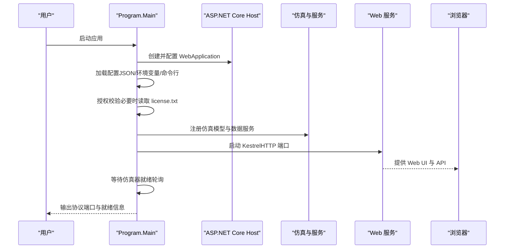

# 快速开始

<cite>
**本文引用的文件**
- [Program.cs](file://Program.cs)
- [EssSimulator.csproj](file://EssSimulator.csproj)
- [appsettings.json](file://appsettings.json)
- [Configuration/SimulatorConfig.cs](file://Configuration/SimulatorConfig.cs)
- [Configuration/EditionConfig.cs](file://Configuration/EditionConfig.cs)
- [configs/社区版.appsettings.json](file://configs/社区版.appsettings.json)
- [configs/商业版.appsettings.json](file://configs/商业版.appsettings.json)
- [configs/定制版.appsettings.json](file://configs/定制版.appsettings.json)
- [scripts/windows/start.bat](file://scripts/windows/start.bat)
- [scripts/linux/start.sh](file://scripts/linux/start.sh)
- [scripts/license/get-machine-id.sh](file://scripts/license/get-machine-id.sh)
- [scripts/windows/README-Windows.txt](file://scripts/windows/README-Windows.txt)
- [scripts/linux/README-Linux.txt](file://scripts/linux/README-Linux.txt)
- [docs/appsettings.explained.md](file://docs/appsettings.explained.md)
</cite>

## 目录
1. [简介](#简介)
2. [环境准备](#环境准备)
3. [克隆与构建](#克隆与构建)
4. [配置文件设置](#配置文件设置)
5. [系统启动流程](#系统启动流程)
6. [平台启动脚本说明](#平台启动脚本说明)
7. [不同版本的配置示例](#不同版本的配置示例)
8. [常见问题与故障排除](#常见问题与故障排除)
9. [性能与运行建议](#性能与运行建议)
10. [结论](#结论)

## 简介
本指南面向首次接触储能仿真系统的用户，目标是帮助你在最短时间内完成环境准备、项目构建、配置设置并成功启动系统，访问 Web 界面进行联调。系统基于 .NET 8 的 ASP.NET Core 后端（B/S 架构），内置 Modbus TCP 协议模拟服务，并通过 SignalR 向前端推送实时数据。

## 环境准备
- 操作系统：Windows 或 Linux（macOS 也可用于开发）
- 运行时与工具：
  - .NET 8 SDK（用于编译与运行）
  - Node.js（仅在前端需要本地开发时；发布产物由后端静态托管）
- 端口占用检查：默认 Web 端口为 5050；Modbus TCP 端口从 1500 起按配置递增，请确保未被占用

提示：
- 若使用发行包（已包含前端构建产物），无需安装 Node.js 即可直接运行。
- 若需修改前端源码并热更新，请在 Web 目录执行前端构建流程后再运行后端。

**章节来源**
- [EssSimulator.csproj:1-13](file://EssSimulator.csproj#L1-L13)
- [Program.cs:380-396](file://Program.cs#L380-L396)

## 克隆与构建
- 克隆仓库到本地目录
- 在根目录执行构建命令（例如 dotnet build / dotnet publish）
- 构建完成后，运行程序入口（如 dotnet run 或发行包中的可执行程序）

注意：
- 项目目标框架为 net8.0，必须使用 .NET 8 SDK。
- 前端构建产物默认作为 wwwroot 静态资源托管；发布时会一并复制。

**章节来源**
- [EssSimulator.csproj:1-13](file://EssSimulator.csproj#L1-L13)
- [Program.cs:486-513](file://Program.cs#L486-L513)

## 配置文件设置
系统通过 appsettings.json 及环境变量、命令行参数组合加载配置。核心配置节包括：
- Simulator：运行时、Web、Edition、License、Protocol 等
- DataExchange：遥测与控制周期
- Pcc、Meter、Transformer、UnitTransformer、Load、Pcs：电气模型与设备参数
- EssUnits：储能单元清单（每单元固定 2 路 PCS + 2 路 BMS）

关键要点：
- Web 监听地址与端口：HttpBaseUrl 与 HttpPort（默认 5050）
- Modbus TCP 端口：BaseBmsModbusPort、BaseEmuModbusPort、EmModbusPort 等
- Edition 档位：Name 决定功能开关（Community/Commercial/Custom）
- License：Required 控制是否校验 license.txt；FileName 指定文件名

配置优先级：
- 基础配置 appsettings.json
- 环境特定配置 appsettings.{Environment}.json
- 环境变量
- 命令行参数

**章节来源**
- [Program.cs:258-269](file://Program.cs#L258-L269)
- [appsettings.json:1-91](file://appsettings.json#L1-L91)
- [docs/appsettings.explained.md:16-31](file://docs/appsettings.explained.md#L16-L31)

## 系统启动流程
启动主流程概览：
1. 初始化日志（log4net）
2. 创建 WebApplication 构建器并加载配置（支持 JSON 注释与尾随逗号）
3. 授权校验（根据 Edition 与 License.Required）
4. 可选：工程模式（Topology Overlay）覆盖拓扑与设备配置
5. 绑定配置项与服务（仿真模型、BMS/PCS/EMU 数据服务、SignalR、CORS、中间件）
6. 启动 Kestrel 监听 Web 服务
7. 注册 API 端点与 SignalR Hub
8. 启动后等待仿真器就绪（轮询检查各服务与变量）
9. 输出协议端口信息，进入等待关闭状态

**图表来源**
- [Program.cs:216-523](file://Program.cs#L216-L523)

**章节来源**
- [Program.cs:216-523](file://Program.cs#L216-L523)

## 平台启动脚本说明
- Windows：双击 start.bat 或在命令行运行；脚本会尝试打开浏览器并启动程序
- Linux：赋予执行权限后运行 start.sh；脚本会尝试自动打开浏览器并启动程序

默认行为：
- Web 界面地址：http://localhost:5050
- Modbus TCP 端口参考 appsettings.json 中 Simulator.Protocol 配置

**章节来源**
- [scripts/windows/start.bat:1-13](file://scripts/windows/start.bat#L1-L13)
- [scripts/linux/start.sh:1-18](file://scripts/linux/start.sh#L1-L18)
- [scripts/windows/README-Windows.txt:1-15](file://scripts/windows/README-Windows.txt#L1-L15)
- [scripts/linux/README-Linux.txt:1-15](file://scripts/linux/README-Linux.txt#L1-L15)

## 不同版本的配置示例
系统通过 Edition.Name 切换功能边界，并提供不同版本的配置模板：
- 社区版：高级功能关闭，拓扑锁定，单元数限制
- 商业版：完整功能开放，默认要求授权
- 定制版：自定义功能开放，默认要求授权

常见差异：
- Simulator.Edition.Name：Community/Commercial/Custom
- Simulator.License.Required：true/false
- Simulator.Web.HttpBaseUrl：127.0.0.1 或 0.0.0.0
- Simulator.Protocol.BindAddress（部分版本）：限制监听地址

使用方式：
- 将对应版本的 appsettings.json 复制到运行目录，或通过环境变量/命令行覆盖
- 商业/定制版需在运行目录放置 license.txt（可通过 --machine-id 获取机器码）

**章节来源**
- [Configuration/EditionConfig.cs:1-57](file://Configuration/EditionConfig.cs#L1-L57)
- [configs/社区版.appsettings.json:1-52](file://configs/社区版.appsettings.json#L1-L52)
- [configs/商业版.appsettings.json:1-46](file://configs/商业版.appsettings.json#L1-L46)
- [configs/定制版.appsettings.json:1-46](file://configs/定制版.appsettings.json#L1-L46)

## 常见问题与故障排除
- 无法访问 Web 界面
  - 检查 HttpPort 与 HttpBaseUrl 是否正确
  - 确认防火墙未阻止 5050 端口
  - 查看启动日志中 Web 服务已启动的输出

- 授权校验失败
  - 商业/定制版需要 license.txt；若缺少，程序会提示错误并退出
  - 使用 --machine-id 获取本机机器码，向提供方申请授权文件
  - 将 license.txt 放入运行目录后重启

- Modbus 端口冲突
  - 检查 BaseBmsModbusPort、BaseEmuModbusPort、EmModbusPort 等是否被占用
  - 调整端口步长或起始端口避免冲突

- 仿真器未就绪导致初始读取异常
  - 程序会轮询等待仿真器就绪（超时仍启动 Web 服务）
  - 若出现 DPC 初始读取异常，稍后重试或检查协议端口与服务注册

- 前端无法连接后端
  - 检查 CORS 配置（CorsOrigins）
  - 开发模式下默认放行 Vite 常用端口

- 日志问题
  - 确认 log4net.config 存在且可加载
  - 若加载失败，程序会回退到基础配置并继续运行

**章节来源**
- [Program.cs:141-178](file://Program.cs#L141-L178)
- [Program.cs:226-239](file://Program.cs#L226-L239)
- [Program.cs:380-396](file://Program.cs#L380-L396)
- [Program.cs:515-523](file://Program.cs#L515-L523)

## 性能与运行建议
- 合理设置 PropagationIntervalMs：越小刷新越快但 CPU 占用更高
- 控制 DataExchange 遥测周期：TelemetryIntervalMs 与 EmuTelemetryIntervalMs 影响网络与计算负载
- 社区版默认关闭高级功能，适合轻量演示；商业/定制版可根据需求启用更多特性
- 在生产环境建议：
  - 固定 HttpBaseUrl 为内网地址
  - 启用 ApiKeyEnabled 保护 API
  - 监控端口占用与日志输出

**章节来源**
- [appsettings.json:1-91](file://appsettings.json#L1-L91)
- [docs/appsettings.explained.md:84-161](file://docs/appsettings.explained.md#L84-L161)

## 结论
通过以上步骤，你可以在 Windows 或 Linux 平台上快速搭建并运行储能仿真系统。借助不同版本的配置模板与灵活的授权机制，系统能够适配社区版、商业版与定制版的交付需求。遇到问题时，优先检查端口占用、授权文件与日志输出，通常可以快速定位并解决。